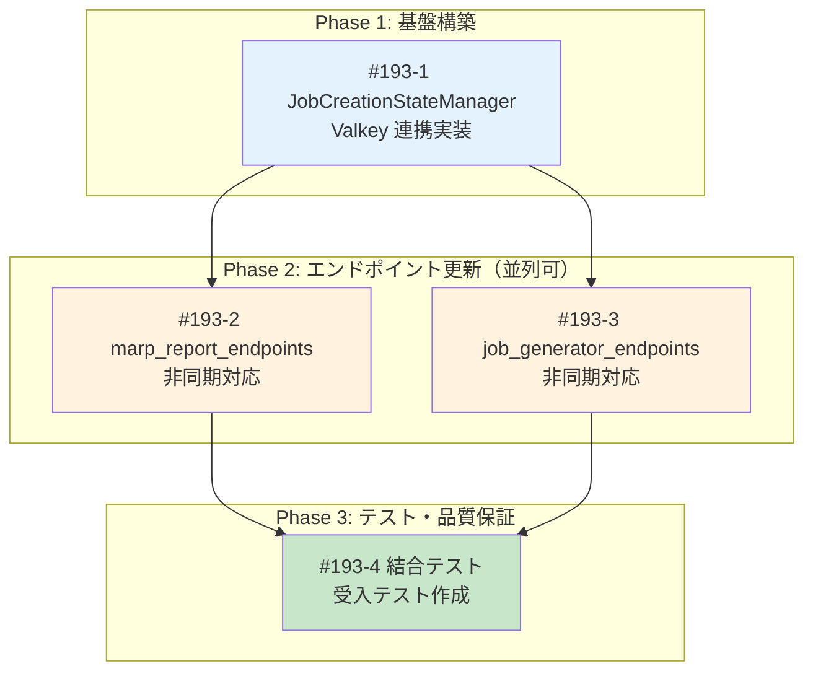

# Issue #193 分割計画書

## Feature: Marp Report API - インメモリ状態管理の永続化

**親Issue**: [#193](https://github.com/kewton/MySwiftAgent/issues/193)
**作成日**: 2025-12-05

---

## 分割サマリ

| Issue | GitHub Issue | タイトル | サイズ | 優先度 | 見積 | Phase |
|-------|-------------|---------|-------|-------|------|-------|
| #193-1 | [#239](https://github.com/Kewton/MySwiftAgent/issues/239) | JobCreationStateManager の Valkey 連携実装 | M | High | 4-6h | 1 |
| #193-2 | [#240](https://github.com/Kewton/MySwiftAgent/issues/240) | marp_report_endpoints の非同期対応 | S | High | 2-3h | 2 |
| #193-3 | [#241](https://github.com/Kewton/MySwiftAgent/issues/241) | job_generator_endpoints の非同期対応 | S | High | 2-3h | 2 |
| #193-4 | [#242](https://github.com/Kewton/MySwiftAgent/issues/242) | 結合テスト・受入テスト作成 | S | Medium | 2-3h | 3 |

**合計見積**: 10-15時間

---

## Issue #193-1: JobCreationStateManager の Valkey 連携実装
**GitHub Issue**: [#239](https://github.com/Kewton/MySwiftAgent/issues/239)

### 概要
`JobCreationStateManager` に Valkey 連携を追加し、2層キャッシュ（L1: Memory, L2: Valkey）を実装する。既存の同期メソッドは後方互換性のため維持し、新規の非同期メソッドを追加する。

### サイズ・優先度
- **サイズ**: M (3-5 Story Points)
- **優先度**: High
- **作業見積**: 4-6時間
- **担当候補**: Backend

### スコープ

- [x] `JobCreationStateManager` に `ValkeyClient` 統合
- [x] 非同期メソッドの追加
  - `get_status_async(job_id: str) -> Optional[JobCreationStatus]`
  - `create_job_async(job_id: str) -> None`
  - `mark_completed_async(job_id: str, ...) -> None`
  - `mark_failed_async(job_id: str, error_message: str) -> None`
  - `connect_valkey() -> None`
- [x] 2層キャッシュロジック（Cache-Aside + Write-Through）
- [x] Graceful Degradation（Valkey 障害時のフォールバック）
- [x] 単体テスト作成
- [x] 既存同期メソッドの後方互換性維持（deprecated 警告）

### 技術スタック
- 言語/FW: Python 3.11 / FastAPI
- ストレージ: Valkey (Redis互換)
- テスト: pytest, pytest-asyncio

### 受入基準 (Acceptance Criteria)

#### 🤖 自動検証可能な基準（pm-auto-devが実施）

**機能要件**:
- [ ] `get_status_async()` が L1 キャッシュをチェックし、ミス時に L2 (Valkey) をチェックする
- [ ] `mark_completed_async()` が L1 と L2 の両方にデータを書き込む
- [ ] Valkey 接続失敗時もインメモリキャッシュで動作継続する
- [ ] TTL (24時間) が Valkey キーに設定される

**品質基準**:
- [ ] 単体テストカバレッジ 90%以上
- [ ] Ruff/MyPy エラーゼロ
- [ ] 既存同期メソッドが動作を維持（後方互換性）

**テストケース**:
- [ ] 正常系: L1 キャッシュヒット時に Valkey アクセスなしで返却
- [ ] 正常系: L1 ミス → L2 ヒット → L1 ポピュレート → 返却
- [ ] 正常系: mark_completed_async で L1/L2 両方に書き込み
- [ ] 異常系: Valkey 接続失敗時にインメモリのみで動作
- [ ] 異常系: 存在しない job_id で None を返却
- [ ] エッジケース: datetime のシリアライズ/デシリアライズ

#### 👤 手動検証が必要な基準（ユーザーが実施）

**運用検証**:
- [ ] Valkey 接続失敗時に WARNING ログが出力される
- [ ] キャッシュ hit/miss がログに記録される

#### ✅ 完了条件
- `/pm-auto-dev` 完了時点: 🤖 自動検証可能な基準 → 全て✅
- ユーザー動作確認後: 👤 手動検証が必要な基準 → 全て✅

### 変更対象ファイル

| ファイル | 変更内容 |
|---------|---------|
| `expertAgent/app/services/job_creation_state.py` | Valkey連携、非同期メソッド追加 |
| `expertAgent/tests/unit/test_job_creation_state_valkey.py` | 新規作成 |

---

## Issue #193-2: marp_report_endpoints の非同期対応
**GitHub Issue**: [#240](https://github.com/Kewton/MySwiftAgent/issues/240)

### 概要
`GET /v1/marp-report/{job_id}` エンドポイントで `JobCreationStateManager` の非同期メソッドを使用するように変更し、エラーメッセージを改善する。

### サイズ・優先度
- **サイズ**: S (2 Story Points)
- **優先度**: High
- **作業見積**: 2-3時間
- **担当候補**: Backend

### スコープ

- [x] `get_marp_report_by_job_id()` で `get_status_async()` を使用
- [x] エラーメッセージの改善
  - 現在: `Job ID not found: {job_id}`
  - 改善後: `Job not found or expired. Job results are kept for 24 hours.`
- [x] 単体テスト更新

### 技術スタック
- 言語/FW: Python 3.11 / FastAPI
- テスト: pytest, pytest-asyncio

### 受入基準 (Acceptance Criteria)

#### 🤖 自動検証可能な基準（pm-auto-devが実施）

**機能要件**:
- [ ] `GET /v1/marp-report/{job_id}` が非同期で `JobCreationStateManager` を呼び出す
- [ ] 404 エラー時のメッセージが「Job not found or expired...」に変更される
- [ ] 既存の正常系動作が維持される

**品質基準**:
- [ ] 単体テストカバレッジ 90%以上
- [ ] Ruff/MyPy エラーゼロ

**テストケース**:
- [ ] 正常系: 完了済みジョブのスライド取得成功
- [ ] 異常系: 存在しない job_id で 404 + 改善メッセージ
- [ ] 異常系: 未完了ジョブで 400 エラー

#### 👤 手動検証が必要な基準（ユーザーが実施）

**UX検証**:
- [ ] フロントエンドでエラーメッセージが正しく表示される

#### ✅ 完了条件
- `/pm-auto-dev` 完了時点: 🤖 自動検証可能な基準 → 全て✅

### 変更対象ファイル

| ファイル | 変更内容 |
|---------|---------|
| `expertAgent/app/api/v1/marp_report_endpoints.py` | 非同期呼び出し、エラーメッセージ改善 |
| `expertAgent/tests/unit/test_marp_report_endpoints.py` | テスト更新 |

### 依存関係
- **依存先**: #193-1（JobCreationStateManager の非同期メソッドが必要）

---

## Issue #193-3: job_generator_endpoints の非同期対応
**GitHub Issue**: [#241](https://github.com/Kewton/MySwiftAgent/issues/241)

### 概要
`job_generator_endpoints.py` の 6箇所で `JobCreationStateManager` の非同期メソッドを使用するように変更する。

### サイズ・優先度
- **サイズ**: S (2 Story Points)
- **優先度**: High
- **作業見積**: 2-3時間
- **担当候補**: Backend

### スコープ

- [x] `get_job_creation_status()` で `get_status_async()` を使用
- [x] `generate_job_and_tasks()` で `create_job_async()` を使用
- [x] `_create_job_in_background()` で以下を非同期化:
  - `update_progress()` → `update_progress_async()`
  - `mark_completed()` → `mark_completed_async()`
  - `mark_failed()` → `mark_failed_async()`
- [x] 単体テスト更新

### 技術スタック
- 言語/FW: Python 3.11 / FastAPI
- テスト: pytest, pytest-asyncio

### 受入基準 (Acceptance Criteria)

#### 🤖 自動検証可能な基準（pm-auto-devが実施）

**機能要件**:
- [ ] ジョブ作成フローが非同期メソッドを使用して動作する
- [ ] ジョブ作成完了時に Valkey に永続化される
- [ ] 既存のジョブ作成機能が正常に動作する

**品質基準**:
- [ ] 単体テストカバレッジ 90%以上
- [ ] Ruff/MyPy エラーゼロ

**テストケース**:
- [ ] 正常系: ジョブ作成 → 進捗更新 → 完了マーク → Valkey 永続化
- [ ] 正常系: ジョブ作成状態の取得（L1 ヒット）
- [ ] 異常系: ジョブ作成失敗時のエラーハンドリング

#### 👤 手動検証が必要な基準（ユーザーが実施）

**E2E検証**:
- [ ] myAgentDesk からジョブ作成が正常に動作する

#### ✅ 完了条件
- `/pm-auto-dev` 完了時点: 🤖 自動検証可能な基準 → 全て✅

### 変更対象ファイル

| ファイル | 変更内容 |
|---------|---------|
| `expertAgent/app/api/v1/job_generator_endpoints.py` | 6箇所の非同期呼び出し変更 |
| `expertAgent/tests/unit/test_job_generator_endpoints.py` | テスト更新 |

### 依存関係
- **依存先**: #193-1（JobCreationStateManager の非同期メソッドが必要）

---

## Issue #193-4: 結合テスト・受入テスト作成
**GitHub Issue**: [#242](https://github.com/Kewton/MySwiftAgent/issues/242)

### 概要
サーバー再起動後のスライド表示、ページリロード後の動作を検証する結合テスト・受入テストを作成する。

### サイズ・優先度
- **サイズ**: S (2 Story Points)
- **優先度**: Medium
- **作業見積**: 2-3時間
- **担当候補**: QA / Backend

### スコープ

- [x] 結合テスト作成
  - Valkey を使用した永続化テスト
  - サーバー再起動シミュレーションテスト
- [x] 受入テストシナリオ作成
  - ジョブ作成 → サーバー再起動 → スライド表示
  - ジョブ作成 → 24時間経過 → スライド表示失敗

### 技術スタック
- テスト: pytest, pytest-asyncio
- インフラ: Docker (Valkey コンテナ)

### 受入基準 (Acceptance Criteria)

#### 🤖 自動検証可能な基準（pm-auto-devが実施）

**機能要件**:
- [ ] 結合テストが Valkey コンテナを使用して実行される
- [ ] サーバー再起動後もジョブ状態が取得できることを検証
- [ ] 結合テストカバレッジ 50%以上

**テストケース**:
- [ ] 正常系: ジョブ作成 → Valkey 永続化 → インメモリクリア → Valkey から復元
- [ ] 正常系: マルチインスタンスシミュレーション（異なるマネージャーインスタンスからアクセス）
- [ ] 異常系: Valkey ダウン時のフォールバック動作

#### 👤 手動検証が必要な基準（ユーザーが実施）

**E2E検証（Issue #193 の最終受入基準）**:
- [ ] myAgentDesk でジョブ作成後、ページリロードしてもスライドが表示される
- [ ] expertAgent サーバー再起動後もスライドが表示される
- [ ] 1時間以上経過したジョブでもスライドが表示される（24時間以内）

#### ✅ 完了条件
- `/pm-auto-dev` 完了時点: 🤖 自動検証可能な基準 → 全て✅
- ユーザー E2E 検証後: 👤 手動検証が必要な基準 → 全て✅
- 上記完了後に Issue #193 をクローズ

### 変更対象ファイル

| ファイル | 変更内容 |
|---------|---------|
| `tests/integration/test_marp_report_persistence.py` | 新規作成 |
| `tests/acceptance/test_issue_193_acceptance.sh` | 新規作成（受入テストスクリプト） |

### 依存関係
- **依存先**: #193-1, #193-2, #193-3（全ての実装完了後）

---

## Phase 毎のイシュー管理

### Phase 1: 基盤構築

| Issue | 概要 | 依存 | 担当 | 見積 |
|-------|------|------|------|------|
| #193-1 | JobCreationStateManager の Valkey 連携実装 | なし | Backend | 4-6h |

**Phase 1 完了条件**:
- [ ] `/pm-auto-dev 193-1` 完了（自動検証済み）
- [ ] 非同期メソッドが利用可能

### Phase 2: エンドポイント更新（並列実行可能）

| Issue | 概要 | 依存 | 担当 | 見積 |
|-------|------|------|------|------|
| #193-2 | marp_report_endpoints の非同期対応 | #193-1 | Backend | 2-3h |
| #193-3 | job_generator_endpoints の非同期対応 | #193-1 | Backend | 2-3h |

**Phase 2 完了条件**:
- [ ] `/pm-auto-dev 193-2` 完了（自動検証済み）
- [ ] `/pm-auto-dev 193-3` 完了（自動検証済み）
- [ ] 全エンドポイントが非同期メソッドを使用

### Phase 3: テスト・品質保証

| Issue | 概要 | 依存 | 担当 | 見積 |
|-------|------|------|------|------|
| #193-4 | 結合テスト・受入テスト作成 | #193-2, #193-3 | QA/Backend | 2-3h |

**Phase 3 完了条件**:
- [ ] `/pm-auto-dev 193-4` 完了（自動検証済み）
- [ ] ユーザー E2E 検証完了
- [ ] Issue #193 クローズ可能

---

## 依存関係グラフ

---

## 並列実行可能性マトリクス

| Phase | 並列実行可能なIssue | 理由 |
|-------|-------------------|------|
| Phase 1 | なし（単独） | 基盤実装のため先行必須 |
| Phase 2 | #193-2, #193-3 | 異なるエンドポイント、相互依存なし |
| Phase 3 | なし（単独） | 全実装完了後のテスト |

### 依存関係マトリクス（詳細版）

| Issue | 依存先 | 並列実行可能 | ブロッカー |
|-------|--------|-------------|------------|
| #193-1 | なし | - | なし |
| #193-2 | #193-1 | Yes（#193-3と並列可） | #193-1 の完了待ち |
| #193-3 | #193-1 | Yes（#193-2と並列可） | #193-1 の完了待ち |
| #193-4 | #193-2, #193-3 | No | #193-2, #193-3 の完了待ち |

---

## マイルストーン計画

### Milestone 1: 基盤構築・エンドポイント更新（Day 1-2）

| Phase | Issue | 内容 | 見積 |
|-------|-------|------|------|
| Phase 1 | #193-1 | JobCreationStateManager Valkey 連携 | 4-6h |
| Phase 2 | #193-2, #193-3 | エンドポイント非同期対応（並列） | 4-6h |

**Milestone 1 完了条件**:
- [ ] 全エンドポイントが Valkey 永続化を使用
- [ ] 単体テスト全件パス

### Milestone 2: 品質保証・リリース（Day 2-3）

| Phase | Issue | 内容 | 見積 |
|-------|-------|------|------|
| Phase 3 | #193-4 | 結合テスト・受入テスト | 2-3h |

**Milestone 2 完了条件**:
- [ ] 結合テスト全件パス
- [ ] ユーザー E2E 検証完了
- [ ] Issue #193 クローズ

---

## リソース配分

| 役割 | 必要人数 | スキル要件 | 担当Issue |
|------|---------|-----------|-----------|
| Backend | 1名 | Python/FastAPI/Valkey | #193-1, #193-2, #193-3 |
| QA | 0.5名 | pytest, E2Eテスト | #193-4 |

---

## リスク評価

| Issue | リスク | 影響度 | 対策 |
|-------|-------|-------|------|
| #193-1 | Valkey 接続の初期化タイミング | 中 | アプリ起動時に connect_valkey() を呼び出す |
| #193-1 | datetime シリアライズエラー | 中 | Pydantic `mode="json"` で対応 |
| #193-2, #193-3 | 同期→非同期の破壊的変更 | 高 | 同期メソッドを deprecated として維持 |
| #193-4 | Valkey コンテナのテスト環境 | 低 | testcontainers または docker-compose |

---

## 分割判断チェックリスト

各Issueについて確認：

| 項目 | #193-1 | #193-2 | #193-3 | #193-4 |
|------|--------|--------|--------|--------|
| 独立してデプロイ可能か | ⚠️ | ✅ | ✅ | - |
| 1-3日で完了可能か | ✅ | ✅ | ✅ | ✅ |
| 明確な完了条件があるか | ✅ | ✅ | ✅ | ✅ |
| テストが定義できるか | ✅ | ✅ | ✅ | ✅ |
| 他Issueへの影響が最小か | ✅ | ✅ | ✅ | ✅ |
| Phase間の依存関係が明確か | ✅ | ✅ | ✅ | ✅ |

**注**: #193-1 は基盤実装のため、単独デプロイは推奨しない。#193-2 または #193-3 と合わせてデプロイすることで機能が有効化される。

---

## 次のステップ

1. ~~**Issue 作成**: `/issue-create` で GitHub Issue を一括作成~~ ✅ 完了
   - #239 (Issue #193-1)
   - #240 (Issue #193-2)
   - #241 (Issue #193-3)
   - #242 (Issue #193-4)
2. **作業計画**: 各 Issue について `/work-plan` で詳細計画を立案
3. **実装開始**: `/pm-auto-dev 239` から順次実装

---

## 関連ドキュメント

- [Issue #193](https://github.com/kewton/MySwiftAgent/issues/193) - 親Issue
- [requirements.md](./requirements.md) - 要件定義書
- [design-policy.md](./design-policy.md) - 設計方針書
- [architecture-review.md](./architecture-review.md) - アーキテクチャレビュー
