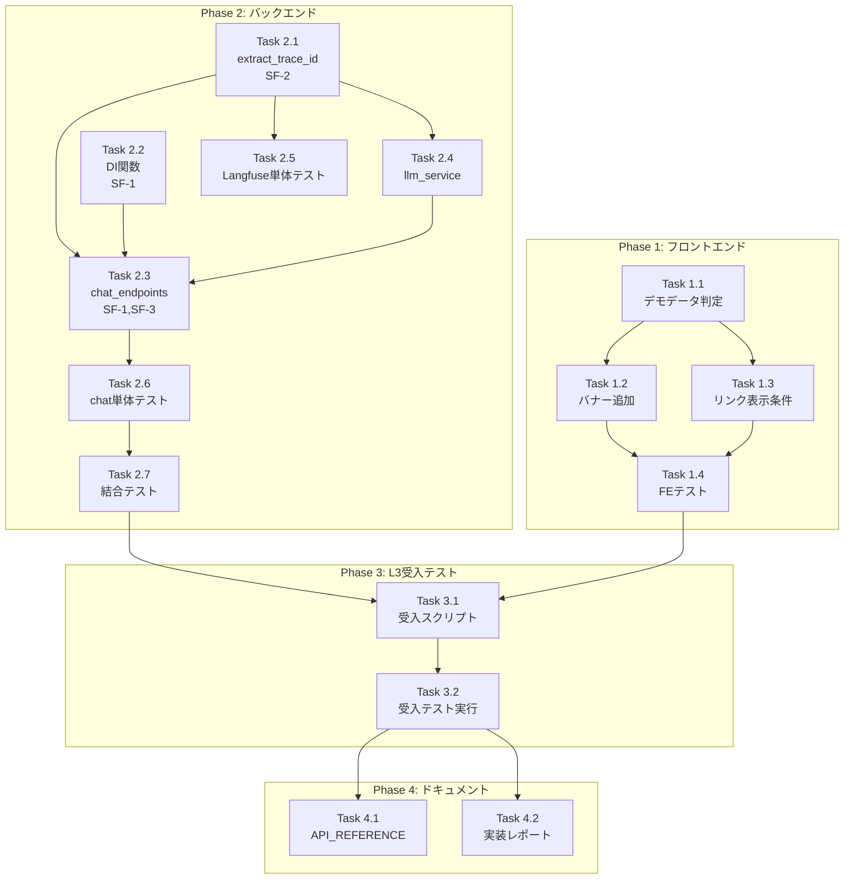

# Issue #194: Langfuse Trace not found エラーの長期対応 - 作業計画書

> 作成日: 2025-12-11
> Issue: [#194](https://github.com/kewton/MySwiftAgent/issues/194)
> 関連ドキュメント: [requirements.md](./requirements.md), [design-policy.md](./design-policy.md), [architecture-review.md](./architecture-review.md)

---

## 1. Issue概要の確認

```markdown
## Issue: Langfuse Trace not found エラーの長期対応
**Issue番号**: #194
**サイズ**: L（大規模）
**作業見積**: 16時間
**優先度**: High
**依存Issue**: なし
**ラベル**: bug, enhancement
```

### 根本原因

| 原因 | 詳細 | 該当コード |
|------|------|-----------|
| **save_with_metadata()未使用** | 定義済みだが呼び出されていない | `conversation_service.py:118-160` |
| **save_message()のみ使用** | メタデータ(trace_id)が保存されない | `chat_endpoints.py:88-90, 122-124` |
| デモデータのフェイクURL | APIエラー時にフォールバック | `+page.svelte:111` |

---

## 2. 詳細タスク分解

### Phase 1: フロントエンド改善（即効性）

#### 実装タスク

- [ ] **Task 1.1**: デモデータ判定ロジック追加
  - 所要時間: 1時間
  - 成果物: `myAgentDesk/src/routes/mlops/diagnostics/+page.svelte`
  - 依存: なし
  - 内容: `isUsingDemoData`フラグの導入

- [ ] **Task 1.2**: デモデータ表示バナー追加
  - 所要時間: 0.5時間
  - 成果物: `+page.svelte`
  - 依存: Task 1.1
  - 内容: 「デモデータを表示中」の警告バナー

- [ ] **Task 1.3**: Langfuseリンク表示条件の改善
  - 所要時間: 0.5時間
  - 成果物: `+page.svelte`
  - 依存: Task 1.1
  - 内容: `/trace/demo`または無効URLの場合はリンク非表示

#### テストタスク

- [ ] **Task 1.4**: フロントエンド単体テスト
  - 所要時間: 1時間
  - 成果物: `myAgentDesk/src/routes/mlops/diagnostics/+page.test.ts`
  - カバレッジ目標: 90%
  - テストケース:
    - デモデータ判定正常動作
    - バナー表示条件
    - リンク表示/非表示条件

---

### Phase 2: バックエンド改善（根本解決）

#### 実装タスク

- [ ] **Task 2.1**: LangfuseService.extract_trace_id() ヘルパー追加（SF-2）
  - 所要時間: 1時間
  - 成果物: `expertAgent/app/services/langfuse_service.py`
  - 依存: なし
  - 内容:
    ```python
    def extract_trace_id(self, handler: CallbackHandler | None) -> str | None:
        """Extract trace_id from handler after LLM invocation."""
        if handler is None:
            return None
        if not hasattr(handler, 'last_trace_id'):
            logger.warning("CallbackHandler does not have last_trace_id")
            return None
        return handler.last_trace_id
    ```

- [ ] **Task 2.2**: ConversationService DI関数作成（SF-1）
  - 所要時間: 1.5時間
  - 成果物: `expertAgent/app/api/v1/dependencies.py`（新規）
  - 依存: なし
  - 内容:
    ```python
    async def get_conversation_service() -> AsyncGenerator[ConversationService, None]:
        async with ConversationStoreValkey() as store:
            index_manager = IndexManager(store._client)
            yield ConversationService(store, index_manager)
    ```

- [ ] **Task 2.3**: chat_endpoints.py のリファクタリング（SF-1, SF-3）
  - 所要時間: 3時間
  - 成果物: `expertAgent/app/api/v1/chat_endpoints.py`
  - 依存: Task 2.1, Task 2.2
  - 内容:
    - グローバル`conversation_store`参照を削除
    - `ConversationService`をDI経由で注入
    - `save_message()` → `save_with_metadata()`に置換
    - SSE内のエラーハンドリング強化（SF-3）
    - trace_id取得ロジック追加

- [ ] **Task 2.4**: llm_service.py からtrace_id伝播
  - 所要時間: 1.5時間
  - 成果物: `expertAgent/app/services/conversation/llm_service.py`
  - 依存: Task 2.1
  - 内容:
    - `stream_requirement_clarification()`の戻り値にtrace_idを含める
    - または、handlerオブジェクトを上位に返却

#### テストタスク

- [ ] **Task 2.5**: LangfuseService単体テスト
  - 所要時間: 1時間
  - 成果物: `expertAgent/tests/unit/test_langfuse_service.py`
  - カバレッジ目標: 95%
  - テストケース:
    - `extract_trace_id()` 正常系
    - `extract_trace_id()` handler=None
    - `extract_trace_id()` last_trace_id属性なし

- [ ] **Task 2.6**: chat_endpoints単体テスト
  - 所要時間: 2時間
  - 成果物: `expertAgent/tests/unit/test_chat_endpoints.py`
  - カバレッジ目標: 90%
  - テストケース:
    - `/requirement-definition` 正常系（trace_id保存確認）
    - `/requirement-definition` Valkey障害時（SSE継続確認）
    - DI注入の動作確認

- [ ] **Task 2.7**: 結合テスト（Chat→Diagnosticsフロー）
  - 所要時間: 1.5時間
  - 成果物: `tests/integration/test_chat_diagnostics_flow.py`
  - シナリオ数: 3
  - テストケース:
    1. チャット→Valkey保存→Diagnostics取得→trace_url確認
    2. Langfuse無効時のフロー
    3. 複数メッセージのセッション

---

### Phase 3: L3受入テスト【必須】

- [ ] **Task 3.1**: L3受入テストスクリプト作成
  - 所要時間: 1時間
  - 成果物: `tests/acceptance/test_issue_194_acceptance.sh`
  - 内容: 下記「L3受入テスト計画」参照

- [ ] **Task 3.2**: L3受入テスト実行・エビデンス収集
  - 所要時間: 0.5時間
  - 成果物: テスト実行ログ、スクリーンショット
  - 内容: 実サービス起動してテスト実行

---

### Phase 4: ドキュメント

- [ ] **Task 4.1**: API_REFERENCE.md 更新
  - 所要時間: 0.5時間
  - 成果物: `expertAgent/docs/API_REFERENCE.md`
  - 内容: Chat APIのtrace_id保存動作を記載

- [ ] **Task 4.2**: 実装レポート作成
  - 所要時間: 0.5時間
  - 成果物: `dev-reports/feature/issue/194/implementation-report.md`
  - 内容: 実装内容、テスト結果、今後の課題

---

## 3. タスク依存関係



---

## 4. 作業スケジュール

### 日次計画

**Day 1 (6時間) - Phase 1 + Phase 2前半**

| 時間 | タスク | 成果物 |
|------|-------|--------|
| 09:00-10:00 | Task 1.1 デモデータ判定 | `+page.svelte` |
| 10:00-10:30 | Task 1.2 バナー追加 | `+page.svelte` |
| 10:30-11:00 | Task 1.3 リンク表示条件 | `+page.svelte` |
| 11:00-12:00 | Task 1.4 FEテスト | `+page.test.ts` |
| 13:00-14:00 | Task 2.1 extract_trace_id (SF-2) | `langfuse_service.py` |
| 14:00-15:30 | Task 2.2 DI関数 (SF-1) | `dependencies.py` |
| 15:30-17:00 | Task 2.3 前半（DI適用） | `chat_endpoints.py` |

**Day 2 (6時間) - Phase 2後半 + テスト**

| 時間 | タスク | 成果物 |
|------|-------|--------|
| 09:00-10:30 | Task 2.3 後半（save_with_metadata, SF-3） | `chat_endpoints.py` |
| 10:30-12:00 | Task 2.4 llm_service trace_id伝播 | `llm_service.py` |
| 13:00-14:00 | Task 2.5 Langfuse単体テスト | `test_langfuse_service.py` |
| 14:00-16:00 | Task 2.6 chat_endpoints単体テスト | `test_chat_endpoints.py` |
| 16:00-17:30 | Task 2.7 結合テスト | `test_chat_diagnostics_flow.py` |

**Day 3 (4時間) - Phase 3 + Phase 4**

| 時間 | タスク | 成果物 |
|------|-------|--------|
| 09:00-10:00 | Task 3.1 L3受入スクリプト | `test_issue_194_acceptance.sh` |
| 10:00-10:30 | Task 3.2 L3受入テスト実行 | エビデンス |
| 10:30-11:00 | Task 4.1 API_REFERENCE更新 | `API_REFERENCE.md` |
| 11:00-11:30 | Task 4.2 実装レポート | `implementation-report.md` |
| 11:30-13:00 | コードレビュー準備、PR作成 | PR |

**総作業時間**: 16時間（約3日）

---

## 5. チェックポイント

| タイミング | 確認事項 | 対応 |
|-----------|---------|------|
| Task 1.4完了時 | Phase 1 FEテストパス | `npm test` 実行 |
| Task 2.3完了時 | chat_endpoints動作確認 | ローカルで手動テスト |
| Task 2.7完了時 | 結合テストパス、カバレッジ確認 | 90%未達の場合追加テスト |
| Task 3.2完了時 | L3受入テスト全パス | 失敗時は原因調査・修正 |
| PR作成前 | `./scripts/pre-push-check-all.sh` | CI/CDグリーン確認 |

---

## 6. リスクと対策

| リスク | 発生確率 | 影響 | 対策 |
|-------|---------|------|------|
| SSE内でのasync context管理 | 中 | 実装遅延2時間 | DIの代わりにrequest-scoped factory |
| Langfuse SDKのlast_trace_id未定義 | 低 | 実装遅延1時間 | バージョン固定、フォールバック実装 |
| 既存テストの破壊 | 中 | 修正2時間 | 既存テスト先行実行で確認 |
| Valkey接続タイムアウト | 低 | テスト遅延1時間 | Docker compose確認、retry実装 |

---

## 7. 成果物チェックリスト

### コード

#### Phase 1
- [ ] `myAgentDesk/src/routes/mlops/diagnostics/+page.svelte` - デモデータ判定、バナー、リンク条件

#### Phase 2
- [ ] `expertAgent/app/services/langfuse_service.py` - `extract_trace_id()`追加
- [ ] `expertAgent/app/api/v1/dependencies.py` - DI関数（新規）
- [ ] `expertAgent/app/api/v1/chat_endpoints.py` - DI適用、save_with_metadata使用
- [ ] `expertAgent/app/services/conversation/llm_service.py` - trace_id伝播

### テスト

- [ ] `myAgentDesk/src/routes/mlops/diagnostics/+page.test.ts`
- [ ] `expertAgent/tests/unit/test_langfuse_service.py`
- [ ] `expertAgent/tests/unit/test_chat_endpoints.py`
- [ ] `tests/integration/test_chat_diagnostics_flow.py`
- [ ] `tests/acceptance/test_issue_194_acceptance.sh`

### ドキュメント

- [ ] `expertAgent/docs/API_REFERENCE.md` 更新
- [ ] `dev-reports/feature/issue/194/implementation-report.md`

---

## 8. L3受入テスト計画（具体的なコマンド）【必須】

### Step 1: サービス起動確認

```bash
#!/bin/bash
# tests/acceptance/test_issue_194_acceptance.sh

set -e
echo "=== Issue #194 L3受入テスト ==="

# サービス起動
./scripts/dev-start.sh

# ヘルスチェック（必須）
echo "=== Step 1: ヘルスチェック ==="
curl -sf http://localhost:8104/health && echo "✅ expertAgent: healthy" || exit 1
curl -sf http://localhost:8103/health && echo "✅ myVault: healthy" || exit 1
curl -sf http://localhost:3001/api/public/health && echo "✅ Langfuse: healthy" || echo "⚠️ Langfuse: not available (optional)"

# Valkey接続確認
docker exec myswiftagent-valkey redis-cli PING && echo "✅ Valkey: PONG" || exit 1
```

### Step 2: チャットAPI呼び出し（trace_id保存確認）

```bash
echo "=== Step 2: Chat API 呼び出し ==="

# 会話ID生成
CONVERSATION_ID="conv-test-$(date +%s)"

# チャットリクエスト送信（SSE）
curl -s -N -X POST http://localhost:8104/aiagent-api/v1/chat/requirement-definition \
  -H "Content-Type: application/json" \
  -d '{
    "conversation_id": "'"$CONVERSATION_ID"'",
    "user_message": "売上データを分析したい",
    "context": {
      "previous_messages": [],
      "current_requirements": {
        "data_source": null,
        "process_description": null,
        "output_format": null,
        "schedule": null,
        "completeness": 0
      }
    }
  }' --max-time 60 | head -20

echo ""
echo "✅ Chat API responded"

# 2秒待機（Valkey書き込み完了待ち）
sleep 2
```

### Step 3: Valkey保存確認

```bash
echo "=== Step 3: Valkey 保存確認 ==="

# 会話データがValkeyに保存されているか確認
VALKEY_KEY=$(docker exec myswiftagent-valkey redis-cli KEYS "conversation:$CONVERSATION_ID" 2>/dev/null)

if [ -n "$VALKEY_KEY" ]; then
  echo "✅ 会話データがValkeyに保存されています: $VALKEY_KEY"

  # メタデータ確認（trace_idが含まれているか）
  CONVERSATION_DATA=$(docker exec myswiftagent-valkey redis-cli GET "conversation:$CONVERSATION_ID" 2>/dev/null)
  echo "会話データ（先頭500文字）:"
  echo "$CONVERSATION_DATA" | head -c 500
  echo ""

  # trace_idの存在確認
  if echo "$CONVERSATION_DATA" | grep -q "trace_id"; then
    echo "✅ trace_id がメタデータに含まれています"
  else
    echo "❌ trace_id がメタデータに含まれていません"
    exit 1
  fi
else
  echo "❌ 会話データがValkeyに保存されていません"
  exit 1
fi
```

### Step 4: Diagnostics API確認

```bash
echo "=== Step 4: Diagnostics API 確認 ==="

# Diagnostics API呼び出し
DIAGNOSTICS_RESPONSE=$(curl -s http://localhost:8104/aiagent-api/v1/chat/diagnostics?limit=10)

echo "Diagnostics API レスポンス:"
echo "$DIAGNOSTICS_RESPONSE" | python3 -m json.tool | head -50

# 会話データが含まれているか確認
if echo "$DIAGNOSTICS_RESPONSE" | grep -q "$CONVERSATION_ID"; then
  echo "✅ テスト会話がDiagnostics APIで取得可能"
else
  echo "⚠️ テスト会話がDiagnostics APIで見つかりません（インデックス未更新の可能性）"
fi

# langfuse_trace_urlの確認
if echo "$DIAGNOSTICS_RESPONSE" | grep -q "langfuse_trace_url"; then
  TRACE_URL=$(echo "$DIAGNOSTICS_RESPONSE" | python3 -c "import sys,json; d=json.load(sys.stdin); print(d['items'][0]['langfuse_link']['trace_url'] if d['items'] else 'N/A')" 2>/dev/null || echo "N/A")
  echo "trace_url: $TRACE_URL"

  if [ "$TRACE_URL" != "N/A" ] && [ "$TRACE_URL" != "null" ] && [[ ! "$TRACE_URL" =~ "/trace/demo" ]]; then
    echo "✅ 有効なtrace_urlが生成されています"
  else
    echo "⚠️ trace_urlがnullまたはデモURL（Langfuse未設定の可能性）"
  fi
fi
```

### Step 5: フロントエンド確認（手動）

```bash
echo "=== Step 5: フロントエンド確認（手動） ==="
echo "以下を手動で確認してください:"
echo "1. http://localhost:5173/mlops/diagnostics にアクセス"
echo "2. APIがデータを返す場合:"
echo "   - 会話一覧が表示される"
echo "   - 有効なtrace_urlがある場合のみ「View in Langfuse」リンクが表示される"
echo "3. APIがエラーまたは空リストの場合:"
echo "   - 「デモデータを表示中」バナーが表示される"
echo "   - 「View in Langfuse」リンクが非表示"
echo ""
echo "=== L3受入テスト完了 ==="
```

### Step 6: エビデンス収集

```bash
echo "=== Step 6: エビデンス収集 ==="

# レスポンスをファイルに保存
mkdir -p /tmp/issue194_evidence

curl -s http://localhost:8104/aiagent-api/v1/chat/diagnostics?limit=10 \
  > /tmp/issue194_evidence/diagnostics_response.json

docker exec myswiftagent-valkey redis-cli KEYS "conversation:*" \
  > /tmp/issue194_evidence/valkey_keys.txt

echo "エビデンスを /tmp/issue194_evidence/ に保存しました"
ls -la /tmp/issue194_evidence/
```

---

## 9. Definition of Done

Issue完了条件：

- [ ] すべてのタスク（1.1〜4.2）が完了
- [ ] Phase 1: フロントエンド単体テストパス
- [ ] Phase 2: バックエンド単体テストカバレッジ90%以上
- [ ] Phase 2: 結合テスト全シナリオパス
- [ ] **Phase 3: L3受入テスト全パス**（実際のサービス起動・API呼び出し確認）
- [ ] CI/CD (`./scripts/pre-push-check-all.sh`) グリーン
- [ ] コードレビュー承認
- [ ] ドキュメント更新完了

### 受入基準（Issueより）

- [ ] デモデータ使用時、「View in Langfuse」リンクが非表示
- [ ] 実際の会話データがValkeyに保存され、Diagnostics APIで取得可能
- [ ] Langfuseに正しいトレースが生成され、リンクから確認可能（Langfuse設定時）

---

## 10. 次のアクション

作業計画承認後：

1. **ブランチ作成**: `feature/issue/194`
2. **worktree作成**（オプション）: `./scripts/setup-worktree.sh 194`
3. **タスク実行**: Day 1から計画に従って実装
4. **進捗報告**: `/progress-report`で定期報告
5. **PR作成**: `gh pr create --title "fix(expertAgent): trace_id persistence for Langfuse integration #194"`

---

## 参照ドキュメント

- [要件定義書](./requirements.md)
- [設計方針書](./design-policy.md)
- [アーキテクチャレビュー](./architecture-review.md)
- [architecture-overview.md](../../../docs/design/architecture-overview.md)
- [API_REFERENCE.md](../../../expertAgent/docs/API_REFERENCE.md)
