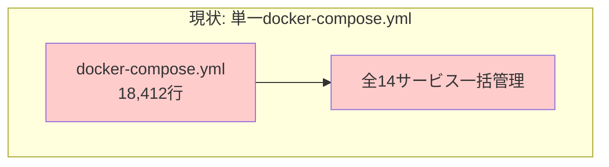
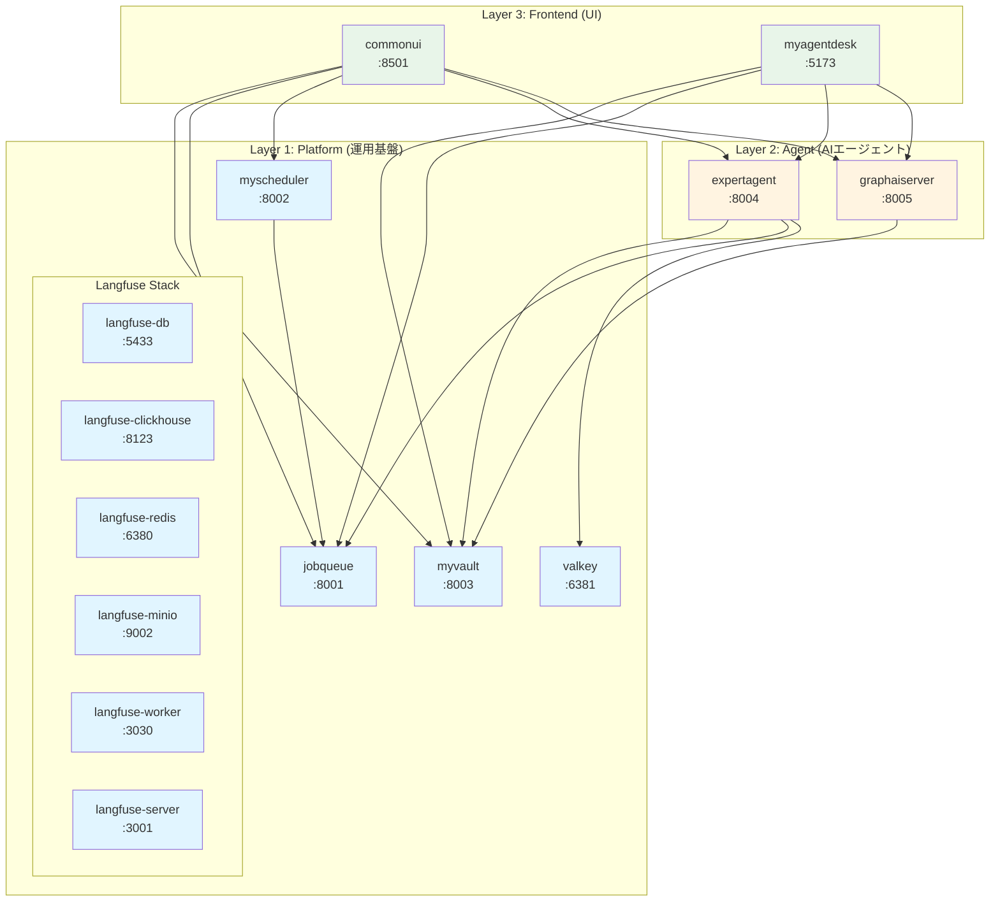
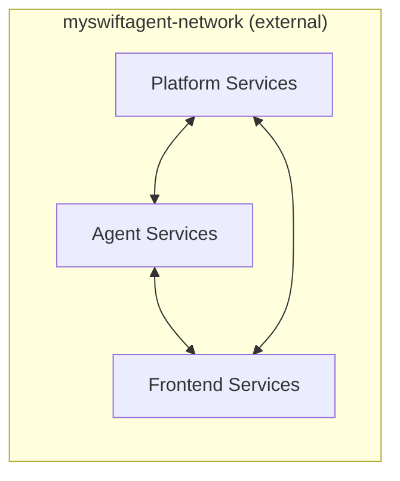
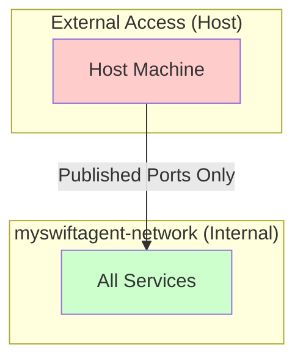
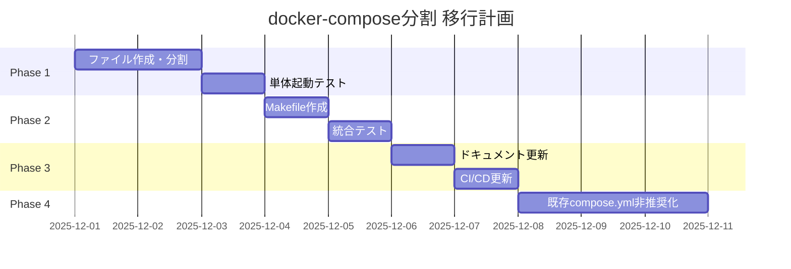

# 設計方針書: モノレポでの品質と生産性向上施策

**Issue番号**: #197
**作成日**: 2025-11-30
**ステータス**: 設計方針策定

---

## 1. アーキテクチャ設計

### 1.1 現状のシステム構成



### 1.2 目標のシステム構成



### 1.3 レイヤー構成設計

| レイヤー | ファイル名 | 責務 | サービス数 |
|---------|-----------|------|-----------|
| **Platform** | `docker-compose.platform.yml` | インフラ・データストア・監視 | 10 |
| **Agent** | `docker-compose.agent.yml` | AIワークフロー・LLM統合 | 2 |
| **Frontend** | `docker-compose.frontend.yml` | ユーザーインターフェース | 2 |

### 1.4 ネットワーク設計



**設計決定**: 単一の外部ネットワーク `myswiftagent-network` を使用

```yaml
# 各composeファイルで共通定義
networks:
  myswiftagent:
    external: true
    name: myswiftagent-network
```

**理由**:
- 各composeファイルの単体起動を可能にする
- サービス間通信をサービス名で解決可能
- 将来のk8s移行時にサービスディスカバリと類似の構成

---

## 2. 技術選定

### 2.1 ビルドツール選定

| 候補 | メリット | デメリット | 評価 |
|------|---------|-----------|------|
| **GNU Make** | OS標準搭載、学習コスト低、広く普及 | 構文がやや古い、タブ必須 | ★★★★★ |
| just | モダンな構文、クロスプラットフォーム | 追加インストール必要、普及度低 | ★★★ |
| Task (go-task) | YAML記法、依存解決 | 追加インストール必要 | ★★★ |
| npm scripts | Node.js環境で統一 | シェル操作との親和性低 | ★★ |

**決定**: **GNU Make** を採用

**理由**:
1. macOS/Linux標準搭載でインストール不要
2. 開発者の認知度が高い
3. CIでも追加設定なしで利用可能
4. 並列実行 (`make -j`) が標準サポート

### 2.2 Docker Compose バージョン

| 項目 | 要件 |
|------|------|
| 最小バージョン | Docker Compose v2.20+ |
| 必須機能 | `depends_on.condition`, `healthcheck`, `profiles` |
| ファイル形式 | Compose Specification (version不要) |

### 2.3 環境変数管理

| 方式 | 採用 | 用途 |
|------|------|------|
| `.env` | ✅ | ベース設定（gitignore） |
| `.env.example` | ✅ | テンプレート（git管理） |
| `.env.docker` | ✅ | Docker専用設定 |
| `.env.local` | ✅ | worktree/開発者別オーバーライド |
| `.env.{layer}` | ❌ | 複雑化を避けるため不採用 |

---

## 3. 設計パターン

### 3.1 Compose分割パターン

**採用パターン**: **Layer-Based Split with External Network**

```
project/
├── docker-compose.platform.yml    # 運用基盤
├── docker-compose.agent.yml       # AIエージェント
├── docker-compose.frontend.yml    # フロントエンド
├── docker-compose.yml             # 統合用（optional, 互換性維持）
└── Makefile                       # 起動コマンド
```

**代替案との比較**:

| パターン | 説明 | 採否 | 理由 |
|---------|------|------|------|
| Layer-Based Split | レイヤ別に分割 | ✅ 採用 | 責務明確、チーム分担容易 |
| Service-Based Split | サービス単位で分割 | ❌ | ファイル数過多、管理コスト高 |
| Environment-Based | dev/prod別に分割 | ❌ | 今回の目的と異なる |
| Extends/Override | base + override | △ 補助的に | 将来の拡張で検討 |

### 3.2 依存関係管理パターン

```yaml
# healthcheck + depends_on.condition パターン
services:
  expertagent:
    depends_on:
      myvault:
        condition: service_healthy
      valkey:
        condition: service_healthy
```

**設計方針**:
- 各サービスに `healthcheck` を必須定義
- `depends_on` は同一compose内のサービスのみ
- クロスcompose依存はMakefileで制御

### 3.3 Makefile設計パターン

**採用**: **Phony Targets with Prerequisites**

```makefile
.PHONY: dev-platform dev-agent dev-frontend dev-all down

# レイヤ別起動（前提条件を明示）
dev-platform:
	docker compose -f docker-compose.platform.yml up -d

dev-agent: _check-platform
	docker compose -f docker-compose.agent.yml up -d

dev-frontend: _check-agent
	docker compose -f docker-compose.frontend.yml up -d

dev-all: dev-platform
	@$(MAKE) dev-agent
	@$(MAKE) dev-frontend
```

---

## 4. ファイル構成設計

### 4.1 docker-compose.platform.yml

```yaml
# docker-compose.platform.yml
# 運用基盤レイヤ: インフラ・データストア・監視サービス

services:
  # === Data Store ===
  valkey:
    image: valkey/valkey:latest
    container_name: myswiftagent-valkey
    ports:
      - "${VALKEY_PORT:-6381}:6379"
    volumes:
      - ./valkey/data:/data
      - ./valkey/config/valkey.conf:/usr/local/etc/valkey/valkey.conf:ro
    command: ["valkey-server", "/usr/local/etc/valkey/valkey.conf"]
    networks:
      - myswiftagent
    healthcheck:
      test: ["CMD", "valkey-cli", "PING"]
      interval: 30s
      timeout: 10s
      retries: 3
    restart: unless-stopped

  # === Core Services ===
  jobqueue:
    # ... (現行設定を移行)

  myscheduler:
    depends_on:
      jobqueue:
        condition: service_healthy
    # ...

  myvault:
    # ...

  # === Observability (Langfuse) ===
  langfuse-db:
    # ...
  langfuse-clickhouse:
    # ...
  langfuse-redis:
    # ...
  langfuse-minio:
    # ...
  langfuse-worker:
    depends_on:
      langfuse-db:
        condition: service_healthy
      langfuse-clickhouse:
        condition: service_healthy
      langfuse-redis:
        condition: service_healthy
      langfuse-minio:
        condition: service_healthy
    # ...
  langfuse-server:
    # ...

networks:
  myswiftagent:
    external: true
    name: myswiftagent-network
```

### 4.2 docker-compose.agent.yml

```yaml
# docker-compose.agent.yml
# AIエージェントレイヤ: LLM統合・ワークフロー実行

services:
  expertagent:
    env_file:
      - .env.docker
    image: myswiftagent-expertagent:${EXPERTAGENT_VERSION:-0.1.2}
    build:
      context: ./expertAgent
      dockerfile: Dockerfile
    container_name: myswiftagent-expertagent
    ports:
      - "${EXPERTAGENT_PORT:-8004}:8000"
    environment:
      # Platform層への接続（サービス名で解決）
      - MYVAULT_BASE_URL=http://myvault:8000
      - VALKEY_URL=redis://valkey:6379
      # ... その他設定
    networks:
      - myswiftagent
    healthcheck:
      test: ["CMD", "curl", "-f", "http://localhost:8000/health"]
      interval: 30s
      timeout: 10s
      retries: 3
    restart: unless-stopped
    # Note: Platform層の依存は外部で管理（Makefile）

  graphaiserver:
    env_file:
      - .env.docker
    image: myswiftagent-graphaiserver:${GRAPHAISERVER_VERSION:-0.1.0}
    build:
      context: ./graphAiServer
      dockerfile: Dockerfile
    container_name: myswiftagent-graphaiserver
    ports:
      - "${GRAPHAISERVER_PORT:-8005}:8000"
    environment:
      - MYVAULT_BASE_URL=http://myvault:8000
      - EXPERTAGENT_BASE_URL=http://expertagent:8000
      # ...
    networks:
      - myswiftagent
    healthcheck:
      test: ["CMD", "wget", "--spider", "-q", "http://localhost:8000/health"]
      interval: 30s
      timeout: 10s
      retries: 3
    restart: unless-stopped

networks:
  myswiftagent:
    external: true
    name: myswiftagent-network
```

### 4.3 docker-compose.frontend.yml

```yaml
# docker-compose.frontend.yml
# フロントエンドレイヤ: ユーザーインターフェース

services:
  commonui:
    env_file:
      - .env.docker
    image: myswiftagent-commonui:${COMMONUI_VERSION:-0.2.0}
    build:
      context: ./commonUI
      dockerfile: Dockerfile
    container_name: myswiftagent-commonui
    ports:
      - "${COMMONUI_PORT:-8501}:8501"
    environment:
      # 下位レイヤへの接続
      - MYVAULT_BASE_URL=http://myvault:8000
      - JOBQUEUE_BASE_URL=http://jobqueue:8000
      - MYSCHEDULER_BASE_URL=http://myscheduler:8000
      - EXPERTAGENT_BASE_URL=http://expertagent:8000
      - GRAPHAISERVER_BASE_URL=http://graphaiserver:8000
      # ...
    networks:
      - myswiftagent
    healthcheck:
      test: ["CMD", "curl", "-f", "http://localhost:8501/_stcore/health"]
      interval: 30s
      timeout: 10s
      retries: 3
    restart: unless-stopped

  # myagentdesk は開発時はローカル起動推奨
  # 本番用にDockerビルドも提供
  myagentdesk:
    profiles:
      - production  # docker compose --profile production で起動
    build:
      context: ./myAgentDesk
      dockerfile: Dockerfile
    container_name: myswiftagent-myagentdesk
    ports:
      - "${MYAGENTDESK_PORT:-5173}:5173"
    environment:
      - PUBLIC_EXPERTAGENT_BASE_URL=http://expertagent:8000
      # ...
    networks:
      - myswiftagent
    restart: unless-stopped

networks:
  myswiftagent:
    external: true
    name: myswiftagent-network
```

### 4.4 Makefile設計

```makefile
# Makefile
# MySwiftAgent レイヤ別開発コマンド

.PHONY: help network dev-platform dev-agent dev-frontend dev-all \
        down down-platform down-agent down-frontend \
        logs status rebuild clean

# デフォルトターゲット
.DEFAULT_GOAL := help

# 設定
COMPOSE_PLATFORM := docker compose -f docker-compose.platform.yml
COMPOSE_AGENT := docker compose -f docker-compose.agent.yml
COMPOSE_FRONTEND := docker compose -f docker-compose.frontend.yml
COMPOSE_ALL := docker compose \
    -f docker-compose.platform.yml \
    -f docker-compose.agent.yml \
    -f docker-compose.frontend.yml

# ============================================================================
# ヘルプ
# ============================================================================

help: ## このヘルプを表示
	@echo "MySwiftAgent - レイヤ別開発コマンド"
	@echo ""
	@echo "使用方法:"
	@echo "  make <target>"
	@echo ""
	@echo "レイヤ別起動:"
	@grep -E '^dev-[a-zA-Z_-]+:.*?## .*$$' $(MAKEFILE_LIST) | awk 'BEGIN {FS = ":.*?## "}; {printf "  \033[36m%-20s\033[0m %s\n", $$1, $$2}'
	@echo ""
	@echo "停止:"
	@grep -E '^down[a-zA-Z_-]*:.*?## .*$$' $(MAKEFILE_LIST) | awk 'BEGIN {FS = ":.*?## "}; {printf "  \033[36m%-20s\033[0m %s\n", $$1, $$2}'
	@echo ""
	@echo "ユーティリティ:"
	@grep -E '^(logs|status|rebuild|clean):.*?## .*$$' $(MAKEFILE_LIST) | awk 'BEGIN {FS = ":.*?## "}; {printf "  \033[36m%-20s\033[0m %s\n", $$1, $$2}'

# ============================================================================
# ネットワーク管理
# ============================================================================

network: ## 共有ネットワークを作成
	@docker network inspect myswiftagent-network >/dev/null 2>&1 || \
		docker network create myswiftagent-network
	@echo "✅ Network 'myswiftagent-network' is ready"

# ============================================================================
# レイヤ別起動
# ============================================================================

dev-platform: network ## Platform層を起動 (valkey, jobqueue, myvault, langfuse等)
	@echo "🚀 Starting Platform layer..."
	$(COMPOSE_PLATFORM) up -d
	@echo "⏳ Waiting for services to be healthy..."
	@$(MAKE) _wait-platform
	@echo "✅ Platform layer is ready"

dev-agent: _check-platform ## Agent層を起動 (expertagent, graphaiserver) ※Platform必須
	@echo "🚀 Starting Agent layer..."
	$(COMPOSE_AGENT) up -d
	@echo "⏳ Waiting for services to be healthy..."
	@$(MAKE) _wait-agent
	@echo "✅ Agent layer is ready"

dev-frontend: _check-agent ## Frontend層を起動 (commonui) ※Platform+Agent必須
	@echo "🚀 Starting Frontend layer..."
	$(COMPOSE_FRONTEND) up -d
	@echo "✅ Frontend layer is ready"

dev-all: network ## 全レイヤを一括起動
	@echo "🚀 Starting all layers..."
	$(COMPOSE_ALL) up -d
	@echo "✅ All services started"
	@$(MAKE) status

# ============================================================================
# 停止
# ============================================================================

down: ## 全サービスを停止
	@echo "🛑 Stopping all services..."
	$(COMPOSE_ALL) down
	@echo "✅ All services stopped"

down-platform: ## Platform層のみ停止
	$(COMPOSE_PLATFORM) down

down-agent: ## Agent層のみ停止
	$(COMPOSE_AGENT) down

down-frontend: ## Frontend層のみ停止
	$(COMPOSE_FRONTEND) down

# ============================================================================
# ユーティリティ
# ============================================================================

logs: ## 全サービスのログを表示
	$(COMPOSE_ALL) logs -f

logs-platform: ## Platform層のログを表示
	$(COMPOSE_PLATFORM) logs -f

logs-agent: ## Agent層のログを表示
	$(COMPOSE_AGENT) logs -f

status: ## 全サービスのステータスを表示
	@echo "📊 Service Status:"
	@echo ""
	@echo "=== Platform Layer ==="
	@$(COMPOSE_PLATFORM) ps --format "table {{.Name}}\t{{.Status}}\t{{.Ports}}" 2>/dev/null || echo "  (not running)"
	@echo ""
	@echo "=== Agent Layer ==="
	@$(COMPOSE_AGENT) ps --format "table {{.Name}}\t{{.Status}}\t{{.Ports}}" 2>/dev/null || echo "  (not running)"
	@echo ""
	@echo "=== Frontend Layer ==="
	@$(COMPOSE_FRONTEND) ps --format "table {{.Name}}\t{{.Status}}\t{{.Ports}}" 2>/dev/null || echo "  (not running)"

rebuild: ## 全イメージを再ビルド
	$(COMPOSE_ALL) build --no-cache

clean: down ## 全サービス停止＋ボリューム削除
	$(COMPOSE_ALL) down -v
	@echo "🧹 Cleaned up volumes"

# ============================================================================
# 内部ターゲット（直接呼び出し不可）
# ============================================================================

_check-platform:
	@curl -sf http://localhost:$${MYVAULT_PORT:-8003}/health >/dev/null 2>&1 || \
		(echo "❌ Platform layer is not running. Run 'make dev-platform' first." && exit 1)

_check-agent:
	@$(MAKE) _check-platform
	@curl -sf http://localhost:$${EXPERTAGENT_PORT:-8004}/health >/dev/null 2>&1 || \
		(echo "❌ Agent layer is not running. Run 'make dev-agent' first." && exit 1)

_wait-platform:
	@echo "  Waiting for myvault..."
	@timeout 60 bash -c 'until curl -sf http://localhost:$${MYVAULT_PORT:-8003}/health >/dev/null 2>&1; do sleep 2; done'
	@echo "  Waiting for jobqueue..."
	@timeout 60 bash -c 'until curl -sf http://localhost:$${JOBQUEUE_PORT:-8001}/health >/dev/null 2>&1; do sleep 2; done'

_wait-agent:
	@echo "  Waiting for expertagent..."
	@timeout 90 bash -c 'until curl -sf http://localhost:$${EXPERTAGENT_PORT:-8004}/health >/dev/null 2>&1; do sleep 2; done'
```

---

## 5. ENV設計

### 5.1 .env.example 更新内容

```bash
# .env.example
# MySwiftAgent 環境変数テンプレート

# ============================================================================
# レイヤ別ポート設定
# ============================================================================
# 各レイヤのサービスポート（ホスト側）
# worktree別に異なるポートを使用する場合は .env.local で上書き

# Platform Layer
VALKEY_PORT=6381
JOBQUEUE_PORT=8001
MYSCHEDULER_PORT=8002
MYVAULT_PORT=8003

# Langfuse (Platform)
LANGFUSE_DB_PORT=5433
LANGFUSE_WEB_PORT=3001
LANGFUSE_CLICKHOUSE_HTTP_PORT=8123
LANGFUSE_REDIS_PORT=6380
LANGFUSE_MINIO_API_PORT=9002
LANGFUSE_MINIO_CONSOLE_PORT=9001

# Agent Layer
EXPERTAGENT_PORT=8004
GRAPHAISERVER_PORT=8005

# Frontend Layer
COMMONUI_PORT=8501
MYAGENTDESK_PORT=5173

# ============================================================================
# サービス間通信URL（Docker内部用）
# ============================================================================
# これらはdocker-compose内で自動設定されるため、通常は変更不要
# MYVAULT_BASE_URL=http://myvault:8000
# JOBQUEUE_BASE_URL=http://jobqueue:8000
# EXPERTAGENT_BASE_URL=http://expertagent:8000

# ============================================================================
# 認証・シークレット
# ============================================================================
# (既存の設定を維持)
MSA_MASTER_KEY=base64:YOUR_GENERATED_KEY_HERE
MYVAULT_TOKEN_EXPERTAGENT=your_token_here
# ...
```

### 5.2 ハードコーディング調査・修正方針

| サービス | 現状 | 修正方針 |
|---------|------|---------|
| expertAgent | `MYVAULT_BASE_URL` 環境変数対応済み | 変更不要 |
| graphAiServer | 一部ハードコーディング | ENV参照に統一 |
| commonUI | ENV対応済み | 変更不要 |
| myAgentDesk | `.env` ファイル参照 | 変更不要 |

---

## 6. セキュリティ設計

### 6.1 ネットワーク分離



**方針**:
- 内部通信はサービス名解決（ポート公開不要）
- 外部アクセスは必要なポートのみ公開
- Langfuse内部サービス（clickhouse等）は `127.0.0.1` バインドを維持

### 6.2 シークレット管理

| シークレット種別 | 管理方法 |
|-----------------|---------|
| API Keys | myVault経由 |
| Service Tokens | .env（gitignore） |
| DB Passwords | .env.docker（gitignore） |

---

## 7. パフォーマンス設計

### 7.1 起動時間最適化

| 最適化項目 | 方法 |
|-----------|------|
| ビルドキャッシュ | Docker layer caching |
| 並列起動 | `docker compose up -d` （デフォルト並列） |
| ヘルスチェック間隔 | 初回30秒、以降30秒 |
| 依存関係最小化 | クロスcompose依存をMakefileに分離 |

### 7.2 リソース制限（将来検討）

```yaml
services:
  expertagent:
    deploy:
      resources:
        limits:
          memory: 2G
        reservations:
          memory: 512M
```

---

## 8. 設計上の決定事項とトレードオフ

### 8.1 主要な設計決定

| 決定事項 | 採用案 | 代替案 | トレードオフ |
|---------|--------|--------|-------------|
| ネットワーク | 単一external | レイヤ別ネットワーク | 単純さ vs 分離性 → 単純さ優先 |
| 依存管理 | Makefile制御 | depends_on跨ぎ | 柔軟性 vs 宣言的 → 柔軟性優先 |
| Langfuse配置 | Platform層 | 別レイヤ | 一括管理 vs 独立性 → 一括管理優先 |
| myagentdesk | profile機能 | 常時含める | 開発効率 vs 統一性 → 開発効率優先 |

### 8.2 リスクと軽減策

| リスク | 影響度 | 軽減策 |
|--------|--------|--------|
| ネットワーク作成忘れ | 中 | Makefileで自動作成 |
| レイヤ順序間違い | 中 | _check-* ターゲットでバリデーション |
| ENV設定漏れ | 中 | .env.example の完備、起動時チェック |
| 既存スクリプトとの競合 | 低 | 既存スクリプトとの共存（非破壊的追加） |

---

## 9. 移行計画

### 9.1 移行ステップ



### 9.2 互換性維持

```yaml
# docker-compose.yml (互換性維持用)
# 非推奨: 代わりに make dev-all を使用してください

include:
  - docker-compose.platform.yml
  - docker-compose.agent.yml
  - docker-compose.frontend.yml
```

---

## 10. 検証項目

### 10.1 機能検証

| テスト項目 | コマンド | 期待結果 |
|-----------|---------|---------|
| Platform単体起動 | `make dev-platform` | 全Platformサービス healthy |
| Agent単体起動 | `make dev-agent` | Platform依存チェック後、Agent起動 |
| Frontend単体起動 | `make dev-frontend` | Agent依存チェック後、Frontend起動 |
| 全体起動 | `make dev-all` | 全サービス healthy |
| 全体停止 | `make down` | 全コンテナ停止 |

### 10.2 回帰テスト

- 既存の `./scripts/unified-start.sh` が動作すること
- 既存の `./scripts/pre-push-check-all.sh` が動作すること
- CI/CDパイプラインが正常完了すること

---

## 11. 関連ドキュメント

| ドキュメント | 更新内容 |
|-------------|---------|
| README.md | レイヤ説明、Makeコマンド一覧追加 |
| docs/arch/service-dependencies.md | レイヤ分割図の更新 |
| docs/ops/deployment-guide.md | 新しいcomposeファイル構成の説明 |

---

**作成者**: Claude Code
**レビュー待ち**: Yes
**次ステップ**: 作業計画書（work-plan.md）の作成
