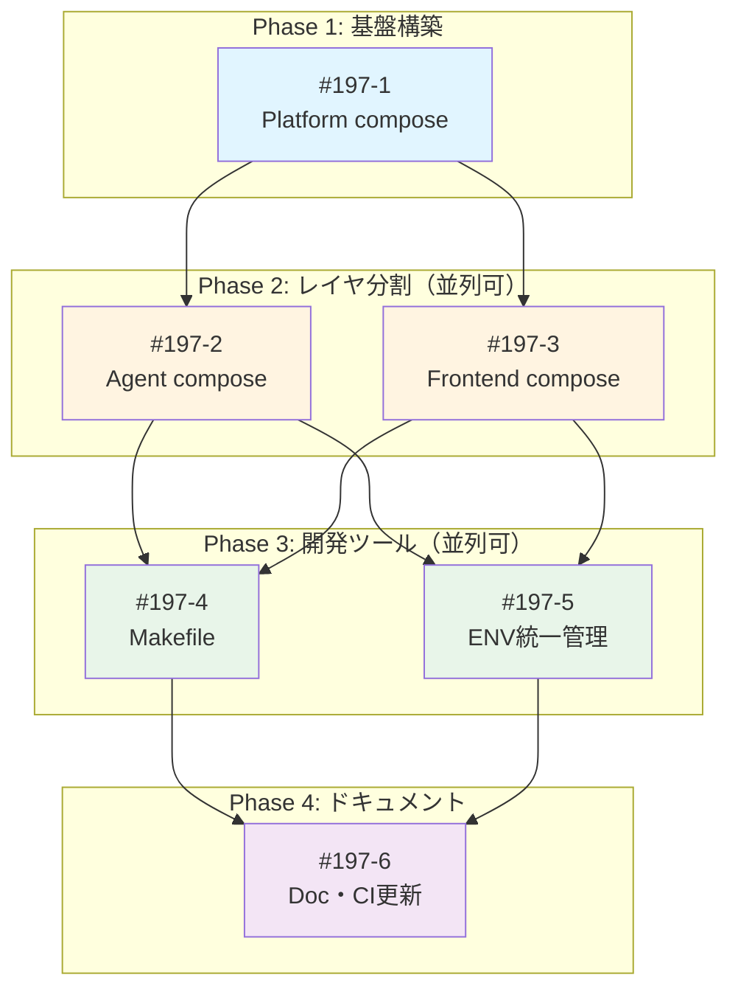

# Issue分割計画書: モノレポでの品質と生産性向上施策

**親Issue番号**: #197
**作成日**: 2025-11-30
**ステータス**: 分割計画策定

---

## 1. 分割戦略

### 分割アプローチ

本Featureはインフラストラクチャ改善のため、**レイヤ別縦割り分割**を採用：

| 分割軸 | 理由 |
|--------|------|
| docker-composeレイヤ別 | 各レイヤが独立して起動・テスト可能 |
| 機能カテゴリ別 | Makefile、ENV管理は横断的だが独立して実装可能 |
| ドキュメント別出し | 実装完了後にまとめて更新 |

### サイズガイドライン

| Issue | サイズ | 見積時間 |
|-------|--------|---------|
| docker-compose分割（各レイヤ） | S | 2-4時間 |
| Makefile作成 | M | 4-6時間 |
| ENV統一管理 | S | 2-4時間 |
| ドキュメント・CI更新 | S | 2-3時間 |

---

## 2. Issue一覧

### Issue #197-1: docker-compose.platform.yml 作成

**概要**: 運用基盤レイヤ（valkey, jobqueue, myscheduler, myvault, langfuse群）のdocker-compose定義ファイルを作成
**サイズ**: S
**優先度**: High
**作業見積**: 3時間
**担当候補**: DevOps/Backend

**スコープ**:
- [ ] 現行docker-compose.ymlからPlatformサービスを抽出
- [ ] docker-compose.platform.yml を作成
- [ ] 共有ネットワーク設定（external: true）
- [ ] healthcheck設定の確認・追加
- [ ] 単体起動テスト

**技術スタック**:
- Docker Compose v2.20+
- YAML

**受入基準 (Acceptance Criteria)**:

#### 自動検証可能な基準（pm-auto-devが実施）

**機能要件**:
- [ ] `docker compose -f docker-compose.platform.yml config` がエラーなく実行される
- [ ] `docker compose -f docker-compose.platform.yml up -d` で全サービスが起動する
- [ ] 以下のサービスがhealthyになる: valkey, jobqueue, myscheduler, myvault
- [ ] langfuse-server が起動し `/api/public/health` が200を返す

**品質基準**:
- [ ] YAMLシンタックスエラーなし
- [ ] 全サービスに `healthcheck` が定義されている
- [ ] `networks.myswiftagent` が `external: true` で定義されている

**テストケース**:
- [ ] 正常系: 全サービス起動後、各healthエンドポイントにアクセス可能
- [ ] 正常系: `docker compose down` で全サービス停止
- [ ] 異常系: ネットワーク未作成時に適切なエラーメッセージ

#### 手動検証が必要な基準（ユーザーが実施）

**運用検証**:
- [ ] 起動ログが適切に出力される
- [ ] 既存のdocker-compose.ymlと同等の動作をする

#### 完了条件
- `/pm-auto-dev` 完了時点: 自動検証可能な基準 → 全て✅
- ユーザー動作確認後: 手動検証が必要な基準 → 全て✅

---

### Issue #197-2: docker-compose.agent.yml 作成

**概要**: AIエージェントレイヤ（expertagent, graphaiserver）のdocker-compose定義ファイルを作成
**サイズ**: S
**優先度**: High
**作業見積**: 2時間
**担当候補**: DevOps/Backend
**依存**: #197-1（Platform層が先に起動している必要）

**スコープ**:
- [ ] 現行docker-compose.ymlからAgentサービスを抽出
- [ ] docker-compose.agent.yml を作成
- [ ] Platform層への接続設定（サービス名解決）
- [ ] healthcheck設定の確認
- [ ] Platform起動状態での単体起動テスト

**技術スタック**:
- Docker Compose v2.20+
- YAML

**受入基準 (Acceptance Criteria)**:

#### 自動検証可能な基準（pm-auto-devが実施）

**機能要件**:
- [ ] `docker compose -f docker-compose.agent.yml config` がエラーなく実行される
- [ ] Platform層起動後、`docker compose -f docker-compose.agent.yml up -d` で起動する
- [ ] expertagent が `/health` で200を返す
- [ ] graphaiserver が `/health` で200を返す

**品質基準**:
- [ ] YAMLシンタックスエラーなし
- [ ] 全サービスに `healthcheck` が定義されている
- [ ] 環境変数でPlatformサービスURLが設定されている

**テストケース**:
- [ ] 正常系: Platform起動後、Agent層が正常起動
- [ ] 正常系: expertagent → myvault 通信が成功
- [ ] 正常系: graphaiserver → myvault 通信が成功
- [ ] 異常系: Platform未起動時にタイムアウト

#### 手動検証が必要な基準（ユーザーが実施）

**運用検証**:
- [ ] AIエージェント機能が正常動作（Job Generator等）
- [ ] GraphAIワークフローが実行可能

#### 完了条件
- `/pm-auto-dev` 完了時点: 自動検証可能な基準 → 全て✅
- ユーザー動作確認後: 手動検証が必要な基準 → 全て✅

---

### Issue #197-3: docker-compose.frontend.yml 作成

**概要**: フロントエンドレイヤ（commonui, myagentdesk）のdocker-compose定義ファイルを作成
**サイズ**: S
**優先度**: High
**作業見積**: 2時間
**担当候補**: DevOps/Frontend
**依存**: #197-1, #197-2（Platform+Agent層が先に起動している必要）

**スコープ**:
- [ ] 現行docker-compose.ymlからFrontendサービスを抽出
- [ ] docker-compose.frontend.yml を作成
- [ ] myagentdeskの `profiles: [production]` 設定
- [ ] 下位レイヤへの接続設定
- [ ] Platform+Agent起動状態での単体起動テスト

**技術スタック**:
- Docker Compose v2.20+
- YAML

**受入基準 (Acceptance Criteria)**:

#### 自動検証可能な基準（pm-auto-devが実施）

**機能要件**:
- [ ] `docker compose -f docker-compose.frontend.yml config` がエラーなく実行される
- [ ] Platform+Agent層起動後、`docker compose -f docker-compose.frontend.yml up -d` で起動する
- [ ] commonui が `/_stcore/health` で200を返す

**品質基準**:
- [ ] YAMLシンタックスエラーなし
- [ ] commonuiに `healthcheck` が定義されている
- [ ] myagentdeskが `profiles: [production]` で定義されている

**テストケース**:
- [ ] 正常系: Platform+Agent起動後、Frontend層が正常起動
- [ ] 正常系: commonui → expertagent 通信が成功
- [ ] 正常系: `--profile production` でmyagentdeskも起動

#### 手動検証が必要な基準（ユーザーが実施）

**UX検証**:
- [ ] commonUI画面が正常表示される
- [ ] 各サービスへのAPI呼び出しが動作する

#### 完了条件
- `/pm-auto-dev` 完了時点: 自動検証可能な基準 → 全て✅
- ユーザー動作確認後: 手動検証が必要な基準 → 全て✅

---

### Issue #197-4: Makefile作成（レイヤ別開発コマンド）

**概要**: レイヤ別起動・停止・ログ表示などの開発コマンドをMakefileで提供
**サイズ**: M
**優先度**: High
**作業見積**: 4時間
**担当候補**: DevOps
**依存**: #197-1, #197-2, #197-3（各composeファイルが必要）

**スコープ**:
- [ ] Makefile作成（ルートディレクトリ）
- [ ] `make network` - 共有ネットワーク作成
- [ ] `make dev-platform` - Platform層起動
- [ ] `make dev-agent` - Agent層起動（依存チェック付き）
- [ ] `make dev-frontend` - Frontend層起動（依存チェック付き）
- [ ] `make dev-all` - 全レイヤ一括起動
- [ ] `make down` / `make down-{layer}` - 停止コマンド
- [ ] `make logs` / `make status` - ユーティリティ
- [ ] `make help` - ヘルプ表示

**技術スタック**:
- GNU Make 3.81+
- Bash

**受入基準 (Acceptance Criteria)**:

#### 自動検証可能な基準（pm-auto-devが実施）

**機能要件**:
- [ ] `make help` がエラーなく実行され、利用可能コマンド一覧が表示される
- [ ] `make network` で `myswiftagent-network` が作成される
- [ ] `make dev-platform` でPlatform層が起動する
- [ ] `make dev-agent` でAgent層が起動する（Platform依存チェック）
- [ ] `make dev-frontend` でFrontend層が起動する（Agent依存チェック）
- [ ] `make dev-all` で全サービスが起動する
- [ ] `make down` で全サービスが停止する
- [ ] `make status` でサービス状態が表示される

**品質基準**:
- [ ] Makefileシンタックスエラーなし（`make -n` で確認）
- [ ] 全ターゲットが `.PHONY` で宣言されている
- [ ] 依存チェック失敗時に適切なエラーメッセージ

**テストケース**:
- [ ] 正常系: `make dev-all && make status && make down` が成功
- [ ] 正常系: `make dev-platform && make dev-agent && make dev-frontend` が順次成功
- [ ] 異常系: Platform未起動で `make dev-agent` がエラー
- [ ] 異常系: Agent未起動で `make dev-frontend` がエラー

#### 手動検証が必要な基準（ユーザーが実施）

**UX検証**:
- [ ] コマンドの実行結果が分かりやすい
- [ ] エラーメッセージが開発者にとって有用

**運用検証**:
- [ ] 既存の `./scripts/unified-start.sh` と競合しない
- [ ] CI環境でも動作する

#### 完了条件
- `/pm-auto-dev` 完了時点: 自動検証可能な基準 → 全て✅
- ユーザー動作確認後: 手動検証が必要な基準 → 全て✅

---

### Issue #197-5: ENV統一管理（.env.example更新・ハードコーディング除去）

**概要**: サービス間URL/ポートをENVで統一管理し、ハードコーディングを除去
**サイズ**: S
**優先度**: Medium
**作業見積**: 3時間
**担当候補**: Backend
**依存**: #197-1, #197-2, #197-3（composeファイルでENV参照が必要）

**スコープ**:
- [ ] .env.example にレイヤ別ポート設定を追加
- [ ] graphAiServerのハードコーディングURL調査・修正
- [ ] 各composeファイルでENV変数参照を確認
- [ ] .env.docker との整合性確認
- [ ] 動作確認（全パターン）

**技術スタック**:
- Shell/Environment Variables
- TypeScript (graphAiServer修正)

**受入基準 (Acceptance Criteria)**:

#### 自動検証可能な基準（pm-auto-devが実施）

**機能要件**:
- [ ] .env.example に以下の変数が定義されている:
  - VALKEY_PORT, JOBQUEUE_PORT, MYSCHEDULER_PORT, MYVAULT_PORT
  - EXPERTAGENT_PORT, GRAPHAISERVER_PORT
  - COMMONUI_PORT, MYAGENTDESK_PORT
- [ ] `grep -r "localhost:8" graphAiServer/src/` でハードコーディングURLが検出されない
- [ ] 各composeファイルで `${VAR:-default}` 形式でポートが参照されている

**品質基準**:
- [ ] .env.example がコピーのみで動作する
- [ ] TypeScript修正後、`npm run type-check` がパス

**テストケース**:
- [ ] 正常系: デフォルトポートで全サービス起動
- [ ] 正常系: カスタムポート設定（.env.local）で起動
- [ ] 正常系: サービス間通信が正常動作

#### 手動検証が必要な基準（ユーザーが実施）

**運用検証**:
- [ ] worktree環境で異なるポート設定が機能する
- [ ] ドキュメントに記載のポート設定例が正確

#### 完了条件
- `/pm-auto-dev` 完了時点: 自動検証可能な基準 → 全て✅
- ユーザー動作確認後: 手動検証が必要な基準 → 全て✅

---

### Issue #197-6: ドキュメント・CI更新

**概要**: README.md更新、既存docker-compose.yml非推奨化、CI/CD対応
**サイズ**: S
**優先度**: Medium
**作業見積**: 3時間
**担当候補**: DevOps/Tech Writer
**依存**: #197-1 〜 #197-5（全実装完了後）

**スコープ**:
- [ ] README.md に「レイヤ別docker-compose」セクション追加
- [ ] README.md に「Makeコマンド一覧」セクション追加
- [ ] README.md に「よく使う開発パターン」セクション追加
- [ ] 既存docker-compose.yml に `include` 方式で互換性維持
- [ ] docs/arch/service-dependencies.md 更新
- [ ] CI/CD（GitHub Actions）の確認・更新（必要に応じて）

**技術スタック**:
- Markdown
- GitHub Actions YAML

**受入基準 (Acceptance Criteria)**:

#### 自動検証可能な基準（pm-auto-devが実施）

**機能要件**:
- [ ] README.md に「レイヤ別docker-compose」セクションが存在する
- [ ] README.md に「Makeコマンド一覧」セクションが存在する
- [ ] 既存docker-compose.yml が `include` で3ファイルを参照している
- [ ] `docker compose up -d` （既存コマンド）が引き続き動作する

**品質基準**:
- [ ] Markdownリンクが有効（壊れたリンクなし）
- [ ] コードブロックの言語指定が正しい

**テストケース**:
- [ ] 正常系: 既存の `docker compose up -d` が全サービス起動
- [ ] 正常系: CI/CDパイプラインが正常完了

#### 手動検証が必要な基準（ユーザーが実施）

**UX検証**:
- [ ] ドキュメントが分かりやすい
- [ ] 新規開発者がドキュメントのみでセットアップ可能

**運用検証**:
- [ ] 既存の開発フローに影響がない

#### 完了条件
- `/pm-auto-dev` 完了時点: 自動検証可能な基準 → 全て✅
- ユーザー動作確認後: 手動検証が必要な基準 → 全て✅

---

## 3. Phase毎のイシュー管理

### Phase 1: docker-compose分割（並列実行可能）

| Issue | 概要 | 依存 | 担当 | 見積 |
|-------|------|------|------|------|
| #197-1 | docker-compose.platform.yml作成 | なし | DevOps | 3h |

**Phase 1 完了条件**:
- [ ] Platform層が単体起動可能
- [ ] 全Platformサービスがhealthy

### Phase 2: Agent・Frontend compose作成（Phase 1完了後、並列可）

| Issue | 概要 | 依存 | 担当 | 見積 |
|-------|------|------|------|------|
| #197-2 | docker-compose.agent.yml作成 | #197-1 | DevOps | 2h |
| #197-3 | docker-compose.frontend.yml作成 | #197-1 | DevOps | 2h |

**Phase 2 完了条件**:
- [ ] Agent層がPlatform依存で起動可能
- [ ] Frontend層がPlatform+Agent依存で起動可能
- [ ] 3ファイル統合起動が成功

### Phase 3: 開発ツール整備（Phase 2完了後）

| Issue | 概要 | 依存 | 担当 | 見積 |
|-------|------|------|------|------|
| #197-4 | Makefile作成 | #197-1,2,3 | DevOps | 4h |
| #197-5 | ENV統一管理 | #197-1,2,3 | Backend | 3h |

**Phase 3 完了条件**:
- [ ] `make dev-all` で全サービス起動可能
- [ ] ENV設定のみで全ポート変更可能

### Phase 4: ドキュメント・統合（Phase 3完了後）

| Issue | 概要 | 依存 | 担当 | 見積 |
|-------|------|------|------|------|
| #197-6 | ドキュメント・CI更新 | #197-1〜5 | DevOps | 3h |

**Phase 4 完了条件**:
- [ ] README.mdに新機能が文書化
- [ ] 既存docker-compose.ymlとの互換性維持
- [ ] CI/CDが正常動作

---

## 4. 依存関係グラフ



---

## 5. 並列実行可能性マトリクス

| Phase | 並列実行可能なIssue | 理由 |
|-------|-------------------|------|
| Phase 1 | なし（単一Issue） | Platform層は他の基盤 |
| Phase 2 | #197-2, #197-3 | 異なるレイヤ、相互依存なし |
| Phase 3 | #197-4, #197-5 | Makefileとコード修正は独立 |
| Phase 4 | なし（単一Issue） | 全実装完了後のドキュメント |

### 依存関係マトリクス（詳細版）

| Issue | 依存先 | 並列実行可能 | ブロッカー |
|-------|--------|-------------|------------|
| #197-1 | なし | - | なし |
| #197-2 | #197-1 | Yes（#197-3と並列可） | #197-1の完了待ち |
| #197-3 | #197-1 | Yes（#197-2と並列可） | #197-1の完了待ち |
| #197-4 | #197-1,2,3 | Yes（#197-5と並列可） | #197-1,2,3の完了待ち |
| #197-5 | #197-1,2,3 | Yes（#197-4と並列可） | #197-1,2,3の完了待ち |
| #197-6 | #197-1〜5 | No | 全Issueの完了待ち |

---

## 6. マイルストーン計画

### Milestone 1: レイヤ分割完了

**対象Issue**: #197-1, #197-2, #197-3
**完了基準**:
- [ ] 3つのdocker-composeファイルが作成済み
- [ ] 各ファイルの単体起動が成功
- [ ] 統合起動（手動）が成功

### Milestone 2: 開発環境整備完了

**対象Issue**: #197-4, #197-5
**完了基準**:
- [ ] `make dev-all` で全サービス起動可能
- [ ] ENV設定でポート変更可能
- [ ] 依存チェックが機能する

### Milestone 3: 本番リリース準備完了

**対象Issue**: #197-6
**完了基準**:
- [ ] ドキュメント更新完了
- [ ] 既存docker-compose.ymlとの互換性維持
- [ ] CI/CD正常動作

---

## 7. リソース配分

| 役割 | 必要スキル | 担当Issue | 合計工数 |
|------|-----------|-----------|---------|
| DevOps | Docker Compose, Make | #197-1〜4, #197-6 | 14h |
| Backend | Python, TypeScript | #197-5 | 3h |

**合計見積工数**: 17時間（約2-3日）

---

## 8. リスク評価

| Issue | リスク | 影響度 | 対策 |
|-------|-------|-------|------|
| #197-1 | Langfuse依存関係の複雑性 | 中 | 現行設定をそのまま移行、段階的テスト |
| #197-2 | Platform通信エラー | 中 | サービス名解決の確認、healthcheck調整 |
| #197-4 | Make互換性（Windows） | 低 | WSL2前提、ドキュメント明記 |
| #197-5 | ハードコーディング箇所の見落とし | 中 | grep検索、E2Eテストで検証 |
| #197-6 | 既存CIの破損 | 高 | 既存docker-compose.ymlのinclude互換性 |

---

## 9. 分割判断チェックリスト

各Issueについて確認済み:

| チェック項目 | #197-1 | #197-2 | #197-3 | #197-4 | #197-5 | #197-6 |
|-------------|--------|--------|--------|--------|--------|--------|
| 独立してデプロイ可能 | ✅ | ✅ | ✅ | ✅ | ✅ | ✅ |
| 1-3日で完了可能 | ✅ | ✅ | ✅ | ✅ | ✅ | ✅ |
| 明確な完了条件あり | ✅ | ✅ | ✅ | ✅ | ✅ | ✅ |
| テスト定義可能 | ✅ | ✅ | ✅ | ✅ | ✅ | ✅ |
| 他Issueへの影響最小 | ✅ | ✅ | ✅ | ✅ | ✅ | ✅ |
| Phase間依存関係明確 | ✅ | ✅ | ✅ | ✅ | ✅ | ✅ |
| 並列実行可能性識別済 | ✅ | ✅ | ✅ | ✅ | ✅ | ✅ |

---

## 10. Issue作成テンプレート

以下のIssueをGitHubに作成:

```
#197-1: [Platform] docker-compose.platform.yml 作成
#197-2: [Agent] docker-compose.agent.yml 作成
#197-3: [Frontend] docker-compose.frontend.yml 作成
#197-4: [DevOps] Makefile作成（レイヤ別開発コマンド）
#197-5: [Backend] ENV統一管理（.env.example更新・ハードコーディング除去）
#197-6: [Docs] ドキュメント・CI更新
```

---

## 11. 次のステップ

1. **`/issue-create 197`** - 上記Issueを一括作成
2. **`/work-plan {issue_number}`** - 各Issueの詳細作業計画を立案
3. **`/pm-auto-dev {issue_number}`** - 各Issueを自動実装

---

**作成者**: Claude Code
**レビュー待ち**: Yes

---

## 🔗 作成されたGitHub Issue

### 親Issue
- #197: モノレポでの品質と生産性向上施策
  - URL: https://github.com/Kewton/MySwiftAgent/issues/197

### 子Issue

#### Phase 1: docker-compose分割
- #198: [Platform] docker-compose.platform.yml 作成
  - URL: https://github.com/Kewton/MySwiftAgent/issues/198
  - サイズ: S、優先度: High、見積: 3h

#### Phase 2: Agent・Frontend compose作成（並列可）
- #199: [Agent] docker-compose.agent.yml 作成
  - URL: https://github.com/Kewton/MySwiftAgent/issues/199
  - サイズ: S、優先度: High、見積: 2h
  - 依存: #198

- #200: [Frontend] docker-compose.frontend.yml 作成
  - URL: https://github.com/Kewton/MySwiftAgent/issues/200
  - サイズ: S、優先度: High、見積: 2h
  - 依存: #198

#### Phase 3: 開発ツール整備（並列可）
- #201: [DevOps] Makefile作成（レイヤ別開発コマンド）
  - URL: https://github.com/Kewton/MySwiftAgent/issues/201
  - サイズ: M、優先度: High、見積: 4h
  - 依存: #198, #199, #200

- #202: [Backend] ENV統一管理（.env.example更新・ハードコーディング除去）
  - URL: https://github.com/Kewton/MySwiftAgent/issues/202
  - サイズ: S、優先度: Medium、見積: 3h
  - 依存: #198, #199, #200

#### Phase 4: ドキュメント・統合
- #203: [Docs] ドキュメント・CI更新
  - URL: https://github.com/Kewton/MySwiftAgent/issues/203
  - サイズ: S、優先度: Medium、見積: 3h
  - 依存: #198, #199, #200, #201, #202

### 作成日時
2025-11-30

### 作成者
@maenokota
