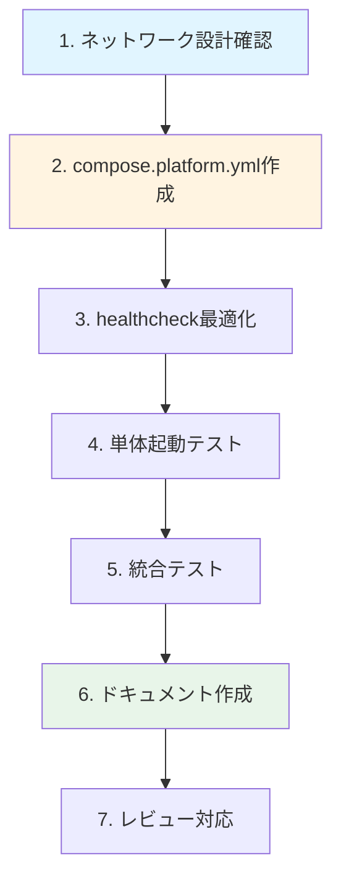

# 作業計画書: docker-compose.platform.yml 作成

**Issue番号**: #198
**親Issue**: #197
**作成日**: 2025-11-30
**見積工数**: S (3時間)
**ステータス**: 作業計画策定

---

## 1. 概要

### 1.1 目的

運用基盤レイヤ（Platform Layer）のdocker-compose定義ファイルを作成し、レイヤ別起動の基盤を構築する。

### 1.2 スコープ

| 対象 | 含む | 含まない |
|------|------|---------|
| サービス定義 | valkey, jobqueue, myscheduler, myvault, langfuse-* (6サービス) | expertagent, graphaiserver, commonui |
| ネットワーク | myswiftagent-network (external) | 内部ネットワーク |
| 設定 | healthcheck, restart, ENV変数参照 | リソース制限 |

### 1.3 対象サービス一覧

| サービス | ポート | 役割 | healthcheck |
|---------|--------|------|-------------|
| valkey | 6381:6379 | インメモリデータストア | `valkey-cli PING` |
| jobqueue | 8001:8000 | ジョブキュー管理 | `curl /health` |
| myscheduler | 8002:8000 | ジョブスケジューリング | `curl /health` |
| myvault | 8003:8000 | シークレット管理 | `curl /health` |
| langfuse-db | 5433:5432 | PostgreSQL | `pg_isready` |
| langfuse-clickhouse | 8123,9000 | 分析DB | `wget /ping` |
| langfuse-redis | 6380:6379 | Langfuse用キャッシュ | `redis-cli ping` |
| langfuse-minio | 9002,9001 | オブジェクトストレージ | `curl /minio/health/live` |
| langfuse-worker | 3030 | バックグラウンドワーカー | - |
| langfuse-server | 3001:3000 | Web UI | `wget /api/public/health` |

---

## 2. 作業ブレイクダウン

### 2.1 タスク一覧

| # | タスク | 見積 | 依存 | 成果物 |
|---|--------|------|------|--------|
| 1 | 共有ネットワーク設計確認 | 10min | - | 設計確認 |
| 2 | docker-compose.platform.yml 作成 | 60min | #1 | docker-compose.platform.yml |
| 3 | healthcheck設定の最適化 | 20min | #2 | healthcheck定義 |
| 4 | 単体起動テスト | 30min | #3 | テスト結果 |
| 5 | 統合テスト（既存composeとの整合性） | 20min | #4 | 検証結果 |
| 6 | ドキュメント作成 | 30min | #5 | README更新、コメント |
| 7 | コードレビュー対応 | 10min | #6 | 最終版 |

**合計**: 約3時間

### 2.2 作業フロー



---

## 3. 実装詳細

### 3.1 タスク1: 共有ネットワーク設計確認

**目的**: 外部ネットワークの設定方法を確認

**チェック項目**:
- [ ] ネットワーク名: `myswiftagent-network`
- [ ] ネットワークタイプ: external
- [ ] 作成コマンド: `docker network create myswiftagent-network`

**参照ドキュメント**:
- `dev-reports/feature/issue/197/design-policy.md` セクション1.4

### 3.2 タスク2: docker-compose.platform.yml 作成

**目的**: Platform層サービスの定義ファイル作成

**実装方針**:
1. 現行 `docker-compose.yml` から対象サービスを抽出
2. `external: true` ネットワーク設定を追加
3. ポート設定を `${VAR:-default}` 形式に統一
4. depends_on を同一compose内に限定

**ファイル構造**:
```yaml
# docker-compose.platform.yml
# 運用基盤レイヤ: インフラ・データストア・監視サービス

services:
  # === Data Store ===
  valkey:
    # ...

  # === Core Services ===
  jobqueue:
    # ...
  myscheduler:
    depends_on:
      jobqueue:
        condition: service_healthy
    # ...
  myvault:
    # ...

  # === Observability (Langfuse) ===
  langfuse-db:
    # ...
  langfuse-clickhouse:
    # ...
  langfuse-redis:
    # ...
  langfuse-minio:
    # ...
  langfuse-worker:
    depends_on:
      langfuse-db:
        condition: service_healthy
      langfuse-clickhouse:
        condition: service_healthy
      langfuse-redis:
        condition: service_healthy
      langfuse-minio:
        condition: service_healthy
    # ...
  langfuse-server:
    # ...

networks:
  myswiftagent:
    external: true
    name: myswiftagent-network
```

**注意点**:
- expertagent, graphaiserverの `depends_on` は削除（別composeで管理）
- commonuiの `depends_on` も削除（別composeで管理）

### 3.3 タスク3: healthcheck設定の最適化

**目的**: 全サービスのhealthcheck設定を確認・最適化

**確認項目**:

| サービス | 現状 | 対応 |
|---------|------|------|
| valkey | ✅ 設定済み | 維持 |
| jobqueue | ✅ 設定済み | 維持 |
| myscheduler | ✅ 設定済み | 維持 |
| myvault | ✅ 設定済み | 維持 |
| langfuse-db | ✅ 設定済み | 維持 |
| langfuse-clickhouse | ✅ 設定済み | 維持 |
| langfuse-redis | ✅ 設定済み | 維持 |
| langfuse-minio | ✅ 設定済み | 維持 |
| langfuse-worker | ❌ なし | 追加検討 |
| langfuse-server | ✅ 設定済み | 維持 |

### 3.4 タスク4: 単体起動テスト

**目的**: Platform層が単独で起動できることを確認

**テスト手順**:
```bash
# 1. ネットワーク作成
docker network create myswiftagent-network

# 2. Platform層起動
docker compose -f docker-compose.platform.yml up -d

# 3. サービス状態確認
docker compose -f docker-compose.platform.yml ps

# 4. healthcheck確認
curl -sf http://localhost:8003/health  # myvault
curl -sf http://localhost:8001/health  # jobqueue
curl -sf http://localhost:8002/health  # myscheduler
valkey-cli -p 6381 PING              # valkey

# 5. Langfuse確認
curl -sf http://localhost:3001/api/public/health  # langfuse-server

# 6. 停止
docker compose -f docker-compose.platform.yml down
```

**期待結果**:
- [ ] 全サービスが `healthy` または `running` 状態
- [ ] 各health endpointが200を返す
- [ ] ログにエラーがない

### 3.5 タスク5: 統合テスト

**目的**: 既存の docker-compose.yml との整合性確認

**テスト項目**:
- [ ] 既存 `docker compose up -d` が動作すること
- [ ] サービス設定が同等であること（環境変数、ボリューム等）
- [ ] ネットワーク設定が競合しないこと

**テスト手順**:
```bash
# 1. 既存composeで起動
docker compose up -d

# 2. サービス確認
docker compose ps

# 3. 停止
docker compose down

# 4. 分割composeで起動
docker network create myswiftagent-network 2>/dev/null || true
docker compose -f docker-compose.platform.yml up -d

# 5. サービス比較
docker compose -f docker-compose.platform.yml ps
```

### 3.6 タスク6: ドキュメント作成

**目的**: 使用方法と設計意図を文書化

**成果物**:

| ドキュメント | 内容 | 場所 |
|-------------|------|------|
| ファイル内コメント | レイヤ説明、サービス分類 | docker-compose.platform.yml |
| 設計メモ | 実装時の判断事項 | dev-reports/feature/issue/198/implementation-notes.md |

**docker-compose.platform.yml 内コメント**:
```yaml
# docker-compose.platform.yml
# =============================================================================
# Platform Layer - 運用基盤サービス
# =============================================================================
#
# このファイルはMySwiftAgentの運用基盤レイヤを定義します。
# 他のレイヤ（Agent, Frontend）はこのレイヤに依存します。
#
# 起動方法:
#   docker network create myswiftagent-network  # 初回のみ
#   docker compose -f docker-compose.platform.yml up -d
#
# 含まれるサービス:
#   - valkey: インメモリデータストア (Redis互換)
#   - jobqueue: ジョブキュー管理API
#   - myscheduler: ジョブスケジューリングサービス
#   - myvault: シークレット管理サービス
#   - langfuse-*: LLM Observability Platform
#
# 関連ファイル:
#   - docker-compose.agent.yml: AIエージェントレイヤ
#   - docker-compose.frontend.yml: フロントエンドレイヤ
#   - Makefile: レイヤ別起動コマンド
#
# =============================================================================
```

### 3.7 タスク7: コードレビュー対応

**チェックリスト**:
- [ ] YAMLシンタックスエラーなし (`docker compose config`)
- [ ] 全サービスにhealthcheck定義
- [ ] ネットワーク設定が `external: true`
- [ ] コメントが十分
- [ ] 不要な設定がない

---

## 4. テスト計画

### 4.1 自動テスト（CI対応）

| テスト | コマンド | 期待結果 |
|--------|---------|---------|
| YAML検証 | `docker compose -f docker-compose.platform.yml config` | エラーなし |
| サービス起動 | `docker compose -f docker-compose.platform.yml up -d` | 全サービス起動 |
| health確認 | `curl -sf http://localhost:8003/health` | 200 OK |
| サービス停止 | `docker compose -f docker-compose.platform.yml down` | 全サービス停止 |

### 4.2 手動テスト

| テスト | 手順 | 期待結果 |
|--------|------|---------|
| ネットワーク未作成時 | ネットワークなしで起動 | 適切なエラーメッセージ |
| ログ確認 | `docker compose logs` | エラーなし、正常起動ログ |
| 既存composeとの比較 | 設定値を目視比較 | 差分が意図通り |

---

## 5. リスクと軽減策

| リスク | 影響 | 軽減策 |
|--------|------|--------|
| Langfuse起動順序の問題 | 中 | depends_on condition で制御 |
| ENV変数の不足 | 低 | 既存.env.dockerを流用 |
| ネットワーク設定ミス | 中 | 単体テストで早期発見 |

---

## 6. 受入基準チェックリスト

### 6.1 機能要件

- [ ] `docker compose -f docker-compose.platform.yml config` がエラーなく実行される
- [ ] `docker compose -f docker-compose.platform.yml up -d` で全サービスが起動する
- [ ] 以下のサービスがhealthyになる: valkey, jobqueue, myscheduler, myvault
- [ ] langfuse-server が起動し `/api/public/health` が200を返す

### 6.2 品質基準

- [ ] YAMLシンタックスエラーなし
- [ ] 全サービスに `healthcheck` が定義されている
- [ ] `networks.myswiftagent` が `external: true` で定義されている

### 6.3 テストケース

- [ ] 正常系: 全サービス起動後、各healthエンドポイントにアクセス可能
- [ ] 正常系: `docker compose down` で全サービス停止
- [ ] 異常系: ネットワーク未作成時に適切なエラーメッセージ

### 6.4 ドキュメント

- [ ] docker-compose.platform.yml 内にレイヤ説明コメントがある
- [ ] dev-reports/feature/issue/198/ にimplementation-notes.mdがある

---

## 7. 関連資料

| ドキュメント | 用途 |
|-------------|------|
| [設計方針書](../197/design-policy.md) | アーキテクチャ設計 |
| [Issue分割計画書](../197/issue-split.md) | Issue依存関係 |
| [サービス依存関係図](../../../docs/arch/service-dependencies.md) | 現行構成 |

---

## 8. 次ステップ

1. **即座に着手可能**
2. 完了後、#199 と #200 が並列着手可能
3. Makefile作成（#201）の前提条件となる

---

**作成者**: Claude Code
**レビュー待ち**: No（即座に実装開始可能）
