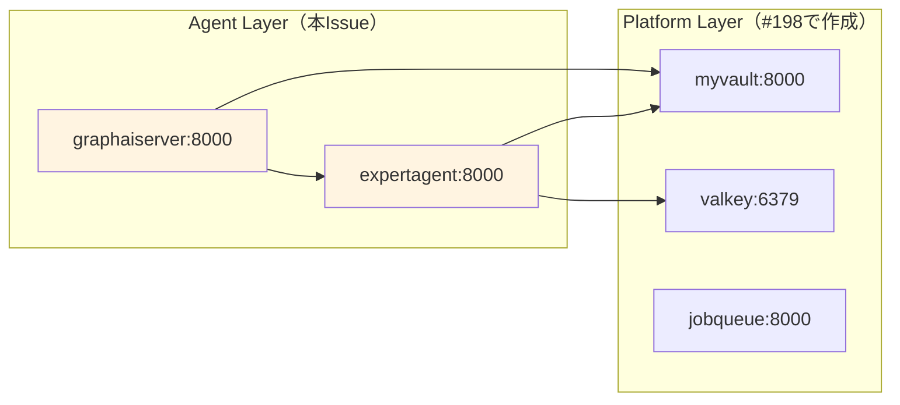
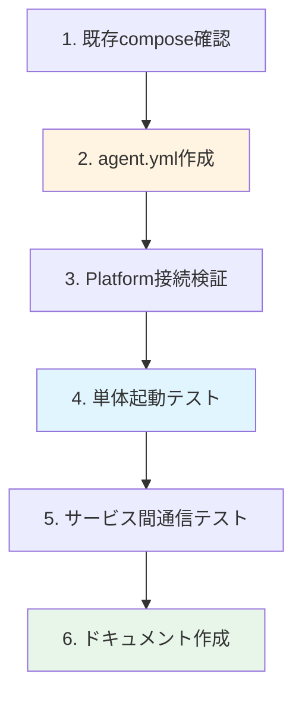

# 作業計画書: docker-compose.agent.yml 作成

**Issue番号**: #199
**親Issue**: #197
**作成日**: 2025-11-30
**見積工数**: S (2時間)
**ステータス**: 作業計画策定

---

## 1. 概要

### 1.1 目的

AIエージェントレイヤ（Agent Layer）のdocker-compose定義ファイルを作成し、Platform層に依存する形でのレイヤ別起動を実現する。

### 1.2 スコープ

| 対象 | 含む | 含まない |
|------|------|---------|
| サービス定義 | expertagent, graphaiserver | valkey, jobqueue, myvault, langfuse-*, commonui |
| ネットワーク | myswiftagent-network (external) | 内部ネットワーク |
| 設定 | healthcheck, Platform接続URL, ENV参照 | リソース制限、depends_on（クロスcompose） |

### 1.3 対象サービス一覧

| サービス | ポート | 役割 | 依存先（Platform層） |
|---------|--------|------|---------------------|
| expertagent | 8004:8000 | AIエージェントAPI | myvault, valkey |
| graphaiserver | 8005:8000 | GraphAIワークフロー実行 | myvault, expertagent |

### 1.4 依存関係



---

## 2. 作業ブレイクダウン

### 2.1 タスク一覧

| # | タスク | 見積 | 依存 | 成果物 |
|---|--------|------|------|--------|
| 1 | 既存compose設定の確認 | 10min | - | 設定確認 |
| 2 | docker-compose.agent.yml 作成 | 40min | #1 | docker-compose.agent.yml |
| 3 | Platform接続設定の検証 | 15min | #2 | 接続設定確認 |
| 4 | 単体起動テスト（Platform依存） | 25min | #3 | テスト結果 |
| 5 | サービス間通信テスト | 15min | #4 | 通信確認 |
| 6 | ドキュメント作成 | 15min | #5 | コメント、実装メモ |

**合計**: 約2時間

### 2.2 作業フロー



---

## 3. 実装詳細

### 3.1 タスク1: 既存compose設定の確認

**目的**: expertagent, graphaiserverの現行設定を把握

**確認項目**:
- [ ] expertagent の環境変数一覧
- [ ] graphaiserver の環境変数一覧
- [ ] volumes マウント設定
- [ ] security_opt, cap_add 設定（expertagent特有）
- [ ] shm_size 設定（Playwright用）

**現行設定サマリ**:

| 項目 | expertagent | graphaiserver |
|------|-------------|---------------|
| イメージ | myswiftagent-expertagent:0.1.2 | myswiftagent-graphaiserver:0.1.0 |
| ポート | 8004:8000 | 8005:8000 |
| volumes | token, logs | config, logs |
| 特殊設定 | shm_size: 2gb, seccomp=unconfined, SYS_ADMIN | なし |

### 3.2 タスク2: docker-compose.agent.yml 作成

**目的**: Agent層サービスの定義ファイル作成

**実装方針**:
1. 現行 `docker-compose.yml` から expertagent, graphaiserver を抽出
2. `depends_on` を削除（クロスcompose依存はMakefileで管理）
3. `external: true` ネットワーク設定を追加
4. ポート設定を `${VAR:-default}` 形式に統一

**ファイル構造**:
```yaml
# docker-compose.agent.yml
# =============================================================================
# Agent Layer - AIエージェントサービス
# =============================================================================
#
# このファイルはMySwiftAgentのAIエージェントレイヤを定義します。
# Platform層（docker-compose.platform.yml）が起動している必要があります。
#
# 起動方法:
#   # 前提: Platform層が起動済み
#   docker compose -f docker-compose.agent.yml up -d
#
# 含まれるサービス:
#   - expertagent: AIエージェントAPI（Job Generator, Chat等）
#   - graphaiserver: GraphAIワークフロー実行エンジン
#
# Platform層への依存:
#   - myvault: シークレット管理
#   - valkey: 会話履歴永続化
#   - jobqueue: ジョブキュー管理
#
# 関連ファイル:
#   - docker-compose.platform.yml: 運用基盤レイヤ
#   - docker-compose.frontend.yml: フロントエンドレイヤ
#   - Makefile: レイヤ別起動コマンド
#
# =============================================================================

services:
  expertagent:
    env_file:
      - .env.docker
    image: myswiftagent-expertagent:${EXPERTAGENT_VERSION:-0.1.2}
    build:
      context: ./expertAgent
      dockerfile: Dockerfile
      tags:
        - "myswiftagent-expertagent:${EXPERTAGENT_VERSION:-0.1.2}"
    container_name: myswiftagent-expertagent
    ports:
      - "${EXPERTAGENT_PORT:-8004}:8000"
    environment:
      # ... (現行設定を維持)
      # Platform層への接続（サービス名で解決）
      - MYVAULT_BASE_URL=http://myvault:8000
      - VALKEY_URL=redis://valkey:6379
    volumes:
      - ./docker-compose-data/expertagent/token:/app/token
      - ./docker-compose-data/expertagent/logs:/app/logs
    shm_size: 2gb
    security_opt:
      - seccomp=unconfined
    cap_add:
      - SYS_ADMIN
    networks:
      - myswiftagent
    healthcheck:
      test: ["CMD", "curl", "-f", "http://localhost:8000/health"]
      interval: 30s
      timeout: 10s
      retries: 3
      start_period: 10s
    restart: unless-stopped
    # Note: Platform層への依存はMakefileで管理

  graphaiserver:
    env_file:
      - .env.docker
    image: myswiftagent-graphaiserver:${GRAPHAISERVER_VERSION:-0.1.0}
    build:
      context: ./graphAiServer
      dockerfile: Dockerfile
      tags:
        - "myswiftagent-graphaiserver:${GRAPHAISERVER_VERSION:-0.1.0}"
    container_name: myswiftagent-graphaiserver
    ports:
      - "${GRAPHAISERVER_PORT:-8005}:8000"
    environment:
      # ... (現行設定を維持)
      # Platform/Agent層への接続（サービス名で解決）
      - MYVAULT_BASE_URL=http://myvault:8000
      - EXPERTAGENT_BASE_URL=http://expertagent:8000
      - GRAPHAISERVER_BASE_URL=http://graphaiserver:8000
      - JOBQUEUE_BASE_URL=http://jobqueue:8000
      - MYSCHEDULER_BASE_URL=http://myscheduler:8000
    volumes:
      - ./docker-compose-data/graphaiserver/config:/app/config
      - ./docker-compose-data/graphaiserver/logs:/app/logs
    networks:
      - myswiftagent
    healthcheck:
      test: ["CMD", "wget", "--no-verbose", "--tries=1", "--spider", "http://localhost:8000/health"]
      interval: 30s
      timeout: 10s
      retries: 3
      start_period: 10s
    restart: unless-stopped

networks:
  myswiftagent:
    external: true
    name: myswiftagent-network
```

### 3.3 タスク3: Platform接続設定の検証

**目的**: サービス名でのPlatform層接続が正しく設定されていることを確認

**確認項目**:

| 接続先 | 環境変数 | 期待値 |
|--------|---------|--------|
| myvault | MYVAULT_BASE_URL | http://myvault:8000 |
| valkey | VALKEY_URL | redis://valkey:6379 |
| jobqueue | JOBQUEUE_BASE_URL | http://jobqueue:8000 |
| myscheduler | MYSCHEDULER_BASE_URL | http://myscheduler:8000 |

**検証方法**:
```bash
# YAML設定を確認
docker compose -f docker-compose.agent.yml config | grep -E "(MYVAULT|VALKEY|JOBQUEUE|MYSCHEDULER)"
```

### 3.4 タスク4: 単体起動テスト（Platform依存）

**目的**: Platform層起動状態でAgent層が正常起動することを確認

**前提条件**:
- Platform層が起動済み（#198完了後）
- myswiftagent-network が作成済み

**テスト手順**:
```bash
# 1. Platform層起動確認
docker compose -f docker-compose.platform.yml ps
curl -sf http://localhost:8003/health  # myvault

# 2. Agent層起動
docker compose -f docker-compose.agent.yml up -d

# 3. サービス状態確認
docker compose -f docker-compose.agent.yml ps

# 4. healthcheck確認
curl -sf http://localhost:8004/health  # expertagent
curl -sf http://localhost:8005/health  # graphaiserver

# 5. ログ確認
docker compose -f docker-compose.agent.yml logs --tail=50

# 6. 停止
docker compose -f docker-compose.agent.yml down
```

**期待結果**:
- [ ] 両サービスが `healthy` または `running` 状態
- [ ] 各health endpointが200を返す
- [ ] ログにPlatform接続エラーがない

### 3.5 タスク5: サービス間通信テスト

**目的**: Agent層からPlatform層への通信が正常に機能することを確認

**テストケース**:

| テスト | コマンド | 期待結果 |
|--------|---------|---------|
| expertagent → myvault | コンテナ内からcurl | 200 OK |
| expertagent → valkey | コンテナ内からping | PONG |
| graphaiserver → myvault | コンテナ内からcurl | 200 OK |
| graphaiserver → expertagent | コンテナ内からcurl | 200 OK |

**テスト手順**:
```bash
# expertagent → myvault
docker exec myswiftagent-expertagent curl -sf http://myvault:8000/health

# expertagent → valkey
docker exec myswiftagent-expertagent redis-cli -h valkey PING

# graphaiserver → myvault
docker exec myswiftagent-graphaiserver wget -q -O - http://myvault:8000/health

# graphaiserver → expertagent
docker exec myswiftagent-graphaiserver wget -q -O - http://expertagent:8000/health
```

### 3.6 タスク6: ドキュメント作成

**目的**: 使用方法と設計意図を文書化

**成果物**:

| ドキュメント | 内容 | 場所 |
|-------------|------|------|
| ファイル内コメント | レイヤ説明、依存関係 | docker-compose.agent.yml |
| 実装メモ | 判断事項、注意点 | dev-reports/feature/issue/199/implementation-notes.md |

---

## 4. テスト計画

### 4.1 自動テスト（CI対応）

| テスト | コマンド | 期待結果 |
|--------|---------|---------|
| YAML検証 | `docker compose -f docker-compose.agent.yml config` | エラーなし |
| サービス起動 | `docker compose -f docker-compose.agent.yml up -d` | 全サービス起動 |
| health確認（expertagent） | `curl -sf http://localhost:8004/health` | 200 OK |
| health確認（graphaiserver） | `curl -sf http://localhost:8005/health` | 200 OK |
| サービス停止 | `docker compose -f docker-compose.agent.yml down` | 全サービス停止 |

### 4.2 手動テスト

| テスト | 手順 | 期待結果 |
|--------|------|---------|
| Platform未起動時 | Agent層のみ起動試行 | 起動するがPlatform接続エラー |
| Job Generator機能 | APIエンドポイント呼び出し | 正常レスポンス |
| GraphAIワークフロー | 簡単なワークフロー実行 | 正常完了 |

---

## 5. リスクと軽減策

| リスク | 影響 | 軽減策 |
|--------|------|--------|
| Platform層未起動でのテスト | 中 | #198完了を待つ、または既存composeでテスト |
| expertagent特殊設定の漏れ | 高 | shm_size, security_opt, cap_add を明示的に確認 |
| 環境変数の不整合 | 中 | 現行composeとの差分比較 |

---

## 6. 受入基準チェックリスト

### 6.1 機能要件

- [ ] `docker compose -f docker-compose.agent.yml config` がエラーなく実行される
- [ ] Platform層起動後、`docker compose -f docker-compose.agent.yml up -d` で起動する
- [ ] expertagent が `/health` で200を返す
- [ ] graphaiserver が `/health` で200を返す

### 6.2 品質基準

- [ ] YAMLシンタックスエラーなし
- [ ] 全サービスに `healthcheck` が定義されている
- [ ] 環境変数でPlatformサービスURLが設定されている

### 6.3 テストケース

- [ ] 正常系: Platform起動後、Agent層が正常起動
- [ ] 正常系: expertagent → myvault 通信が成功
- [ ] 正常系: graphaiserver → myvault 通信が成功
- [ ] 異常系: Platform未起動時にタイムアウト（または接続エラー）

### 6.4 ドキュメント

- [ ] docker-compose.agent.yml 内にレイヤ説明コメントがある
- [ ] Platform層への依存関係が明記されている
- [ ] dev-reports/feature/issue/199/ に実装メモがある

---

## 7. 関連資料

| ドキュメント | 用途 |
|-------------|------|
| [設計方針書](../197/design-policy.md) | アーキテクチャ設計（セクション4.2） |
| [Issue分割計画書](../197/issue-split.md) | Issue依存関係 |
| [Issue #198 作業計画](../198/work-plan.md) | Platform層実装 |
| [docker-compose.yml](../../../docker-compose.yml) | 現行設定 |

---

## 8. 前提条件

### 8.1 Issue #198 完了条件

本Issue着手前に以下が完了している必要がある：

- [ ] docker-compose.platform.yml が作成済み
- [ ] Platform層が単体起動可能
- [ ] myvault, valkey, jobqueue がhealthy

### 8.2 並列着手について

- Issue #199（本Issue）と #200（Frontend compose）は**並列着手可能**
- ただし両方ともIssue #198の完了が前提

---

## 9. 次ステップ

1. **#198完了後に着手**
2. 完了後、#200と合わせて #201（Makefile）、#202（ENV統一）が着手可能
3. 全レイヤのcompose統合テストを実施

---

**作成者**: Claude Code
**レビュー待ち**: No（#198完了後に実装開始可能）
