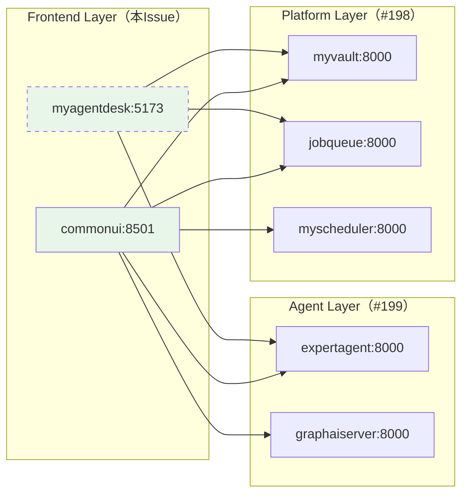
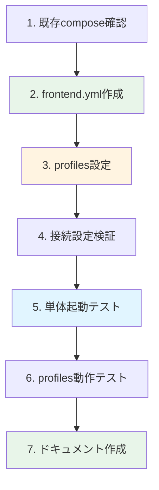

# 作業計画書: docker-compose.frontend.yml 作成

**Issue番号**: #200
**親Issue**: #197
**作成日**: 2025-11-30
**見積工数**: S (2時間)
**ステータス**: 作業計画策定

---

## 1. 概要

### 1.1 目的

フロントエンドレイヤ（Frontend Layer）のdocker-compose定義ファイルを作成し、Platform層およびAgent層に依存する形でのレイヤ別起動を実現する。

### 1.2 スコープ

| 対象 | 含む | 含まない |
|------|------|---------|
| サービス定義 | commonui, myagentdesk | expertagent, graphaiserver, Platform層サービス |
| ネットワーク | myswiftagent-network (external) | 内部ネットワーク |
| 設定 | healthcheck, profiles, 下位レイヤ接続URL | リソース制限 |
| 特殊機能 | profiles (myagentdeskはproduction時のみ起動) | - |

### 1.3 対象サービス一覧

| サービス | ポート | 役割 | 依存先 | 備考 |
|---------|--------|------|--------|------|
| commonui | 8501:8501 | Streamlit Web UI | myvault, jobqueue, myscheduler, expertagent, graphaiserver | 常時起動 |
| myagentdesk | 5173:5173 | SvelteKit Web UI | expertagent, myvault, jobqueue | `profiles: [production]` |

### 1.4 依存関係



**凡例**: 破線 = `profiles: [production]` で条件付き起動

---

## 2. 作業ブレイクダウン

### 2.1 タスク一覧

| # | タスク | 見積 | 依存 | 成果物 |
|---|--------|------|------|--------|
| 1 | 既存compose設定の確認 | 10min | - | 設定確認 |
| 2 | docker-compose.frontend.yml 作成 | 35min | #1 | docker-compose.frontend.yml |
| 3 | profiles設定の実装 | 10min | #2 | myagentdesk profiles設定 |
| 4 | 下位レイヤ接続設定の検証 | 15min | #3 | 接続設定確認 |
| 5 | 単体起動テスト（全レイヤ依存） | 25min | #4 | テスト結果 |
| 6 | profiles動作テスト | 10min | #5 | production profile確認 |
| 7 | ドキュメント作成 | 15min | #6 | コメント、実装メモ |

**合計**: 約2時間

### 2.2 作業フロー



---

## 3. 実装詳細

### 3.1 タスク1: 既存compose設定の確認

**目的**: commonui の現行設定を把握

**確認項目**:
- [ ] commonui の環境変数一覧（下位レイヤURL）
- [ ] depends_on 設定（削除対象）
- [ ] volumes マウント設定
- [ ] healthcheck 設定

**現行設定サマリ（commonui）**:

| 項目 | 値 |
|------|-----|
| イメージ | myswiftagent-commonui:0.2.0 |
| ポート | 8501:8501 |
| healthcheck | `curl -f http://localhost:8501/_stcore/health` |
| depends_on | jobqueue, myscheduler, myvault, expertagent, graphaiserver（削除対象） |

### 3.2 タスク2: docker-compose.frontend.yml 作成

**目的**: Frontend層サービスの定義ファイル作成

**実装方針**:
1. 現行 `docker-compose.yml` から commonui を抽出
2. `depends_on` を削除（クロスcompose依存はMakefileで管理）
3. `external: true` ネットワーク設定を追加
4. myagentdesk を `profiles: [production]` で追加

**ファイル構造**:
```yaml
# docker-compose.frontend.yml
# =============================================================================
# Frontend Layer - ユーザーインターフェースサービス
# =============================================================================
#
# このファイルはMySwiftAgentのフロントエンドレイヤを定義します。
# Platform層（docker-compose.platform.yml）およびAgent層（docker-compose.agent.yml）
# が起動している必要があります。
#
# 起動方法:
#   # 前提: Platform層とAgent層が起動済み
#   docker compose -f docker-compose.frontend.yml up -d
#
#   # myagentdeskも含める場合（本番環境）:
#   docker compose -f docker-compose.frontend.yml --profile production up -d
#
# 含まれるサービス:
#   - commonui: Streamlit Web UI（管理画面）
#   - myagentdesk: SvelteKit Web UI（ユーザー向け）※production profileのみ
#
# 下位レイヤへの依存:
#   Platform層: myvault, jobqueue, myscheduler
#   Agent層: expertagent, graphaiserver
#
# 関連ファイル:
#   - docker-compose.platform.yml: 運用基盤レイヤ
#   - docker-compose.agent.yml: AIエージェントレイヤ
#   - Makefile: レイヤ別起動コマンド
#
# =============================================================================

services:
  # === Primary UI ===
  commonui:
    env_file:
      - .env.docker
    image: myswiftagent-commonui:${COMMONUI_VERSION:-0.2.0}
    build:
      context: ./commonUI
      dockerfile: Dockerfile
      tags:
        - "myswiftagent-commonui:${COMMONUI_VERSION:-0.2.0}"
    container_name: myswiftagent-commonui
    ports:
      - "${COMMONUI_PORT:-8501}:8501"
    environment:
      # ... (現行設定を維持)
      # 下位レイヤへの接続（サービス名で解決）
      - MYVAULT_BASE_URL=http://myvault:8000
      - JOBQUEUE_BASE_URL=http://jobqueue:8000
      - MYSCHEDULER_BASE_URL=http://myscheduler:8000
      - EXPERTAGENT_BASE_URL=http://expertagent:8000
      - GRAPHAISERVER_BASE_URL=http://graphaiserver:8000
    volumes:
      - ./docker-compose-data/commonUI:/app/data
      - ./docker-compose-data/commonUI/logs:/app/logs
    networks:
      - myswiftagent
    healthcheck:
      test: ["CMD", "curl", "-f", "http://localhost:8501/_stcore/health"]
      interval: 30s
      timeout: 10s
      retries: 3
      start_period: 15s
    restart: unless-stopped
    # Note: Platform/Agent層への依存はMakefileで管理

  # === SvelteKit UI (Production Only) ===
  # 開発時はローカル起動推奨（npm run dev）
  # 本番デプロイ時のみDockerで起動
  myagentdesk:
    profiles:
      - production
    image: myswiftagent-myagentdesk:${MYAGENTDESK_VERSION:-0.1.0}
    build:
      context: ./myAgentDesk
      dockerfile: Dockerfile
      tags:
        - "myswiftagent-myagentdesk:${MYAGENTDESK_VERSION:-0.1.0}"
    container_name: myswiftagent-myagentdesk
    ports:
      - "${MYAGENTDESK_PORT:-5173}:5173"
    environment:
      - NODE_ENV=production
      - PUBLIC_EXPERTAGENT_BASE_URL=http://expertagent:8000
      - PUBLIC_MYVAULT_BASE_URL=http://myvault:8000
      - PUBLIC_JOBQUEUE_BASE_URL=http://jobqueue:8000
    networks:
      - myswiftagent
    restart: unless-stopped

networks:
  myswiftagent:
    external: true
    name: myswiftagent-network
```

### 3.3 タスク3: profiles設定の実装

**目的**: myagentdeskを条件付き起動に設定

**実装ポイント**:
- `profiles: [production]` を設定
- デフォルト起動時はcommonuiのみ
- `--profile production` 指定時にmyagentdeskも起動

**動作確認**:
```bash
# デフォルト起動（commonuiのみ）
docker compose -f docker-compose.frontend.yml config --services
# 期待: commonui

# production profile（両方）
docker compose -f docker-compose.frontend.yml --profile production config --services
# 期待: commonui, myagentdesk
```

### 3.4 タスク4: 下位レイヤ接続設定の検証

**目的**: サービス名での下位レイヤ接続が正しく設定されていることを確認

**確認項目**:

| 接続先 | 環境変数 | 期待値 |
|--------|---------|--------|
| myvault | MYVAULT_BASE_URL | http://myvault:8000 |
| jobqueue | JOBQUEUE_BASE_URL | http://jobqueue:8000 |
| myscheduler | MYSCHEDULER_BASE_URL | http://myscheduler:8000 |
| expertagent | EXPERTAGENT_BASE_URL | http://expertagent:8000 |
| graphaiserver | GRAPHAISERVER_BASE_URL | http://graphaiserver:8000 |

**検証方法**:
```bash
# YAML設定を確認
docker compose -f docker-compose.frontend.yml config | grep -E "(BASE_URL)"
```

### 3.5 タスク5: 単体起動テスト（全レイヤ依存）

**目的**: Platform層+Agent層起動状態でFrontend層が正常起動することを確認

**前提条件**:
- Platform層が起動済み（#198）
- Agent層が起動済み（#199）
- myswiftagent-network が作成済み

**テスト手順**:
```bash
# 1. Platform層+Agent層起動確認
docker compose -f docker-compose.platform.yml ps
docker compose -f docker-compose.agent.yml ps
curl -sf http://localhost:8004/health  # expertagent

# 2. Frontend層起動
docker compose -f docker-compose.frontend.yml up -d

# 3. サービス状態確認
docker compose -f docker-compose.frontend.yml ps

# 4. healthcheck確認
curl -sf http://localhost:8501/_stcore/health  # commonui

# 5. ログ確認
docker compose -f docker-compose.frontend.yml logs --tail=50

# 6. 停止
docker compose -f docker-compose.frontend.yml down
```

**期待結果**:
- [ ] commonui が `healthy` または `running` 状態
- [ ] health endpointが200を返す
- [ ] ログに下位レイヤ接続エラーがない

### 3.6 タスク6: profiles動作テスト

**目的**: `--profile production` でmyagentdeskが起動することを確認

**テスト手順**:
```bash
# 1. production profileで起動
docker compose -f docker-compose.frontend.yml --profile production up -d

# 2. 両サービスが起動していることを確認
docker compose -f docker-compose.frontend.yml --profile production ps
# 期待: commonui, myagentdesk 両方が running

# 3. myagentdeskにアクセス確認
curl -sf http://localhost:5173  # トップページ

# 4. 停止
docker compose -f docker-compose.frontend.yml --profile production down
```

### 3.7 タスク7: ドキュメント作成

**目的**: 使用方法と設計意図を文書化

**成果物**:

| ドキュメント | 内容 | 場所 |
|-------------|------|------|
| ファイル内コメント | レイヤ説明、profiles使用方法 | docker-compose.frontend.yml |
| 実装メモ | 判断事項、注意点 | dev-reports/feature/issue/200/implementation-notes.md |

---

## 4. テスト計画

### 4.1 自動テスト（CI対応）

| テスト | コマンド | 期待結果 |
|--------|---------|---------|
| YAML検証 | `docker compose -f docker-compose.frontend.yml config` | エラーなし |
| サービス一覧（デフォルト） | `docker compose -f docker-compose.frontend.yml config --services` | commonui のみ |
| サービス一覧（production） | `docker compose -f docker-compose.frontend.yml --profile production config --services` | commonui, myagentdesk |
| サービス起動 | `docker compose -f docker-compose.frontend.yml up -d` | commonui起動 |
| health確認 | `curl -sf http://localhost:8501/_stcore/health` | 200 OK |

### 4.2 手動テスト

| テスト | 手順 | 期待結果 |
|--------|------|---------|
| 下位レイヤ未起動時 | Frontend層のみ起動 | 起動するが接続エラー |
| commonUI画面表示 | ブラウザでアクセス | 画面が正常表示 |
| API呼び出し | commonUIから各機能実行 | 正常動作 |

---

## 5. リスクと軽減策

| リスク | 影響 | 軽減策 |
|--------|------|--------|
| Platform/Agent層未起動でのテスト | 中 | #198, #199完了を待つ |
| myagentdesk Dockerfile未整備 | 中 | 既存Dockerfileの確認、必要に応じて修正 |
| Streamlit healthcheck特殊性 | 低 | `/_stcore/health` エンドポイント確認 |

---

## 6. 受入基準チェックリスト

### 6.1 機能要件

- [ ] `docker compose -f docker-compose.frontend.yml config` がエラーなく実行される
- [ ] Platform+Agent層起動後、`docker compose -f docker-compose.frontend.yml up -d` で起動する
- [ ] commonui が `/_stcore/health` で200を返す

### 6.2 品質基準

- [ ] YAMLシンタックスエラーなし
- [ ] commonuiに `healthcheck` が定義されている
- [ ] myagentdeskが `profiles: [production]` で定義されている

### 6.3 テストケース

- [ ] 正常系: Platform+Agent起動後、Frontend層が正常起動
- [ ] 正常系: commonui → expertagent 通信が成功
- [ ] 正常系: `--profile production` でmyagentdeskも起動

### 6.4 ドキュメント

- [ ] docker-compose.frontend.yml 内にレイヤ説明コメントがある
- [ ] profiles使用方法が明記されている
- [ ] dev-reports/feature/issue/200/ に実装メモがある

---

## 7. 関連資料

| ドキュメント | 用途 |
|-------------|------|
| [設計方針書](../197/design-policy.md) | アーキテクチャ設計（セクション4.3） |
| [Issue分割計画書](../197/issue-split.md) | Issue依存関係 |
| [Issue #198 作業計画](../198/work-plan.md) | Platform層実装 |
| [Issue #199 作業計画](../199/work-plan.md) | Agent層実装 |
| [docker-compose.yml](../../../docker-compose.yml) | 現行設定 |

---

## 8. 前提条件

### 8.1 Issue #198, #199 完了条件

本Issue着手前に以下が完了している必要がある：

- [ ] docker-compose.platform.yml が作成済み
- [ ] docker-compose.agent.yml が作成済み
- [ ] Platform層 + Agent層が起動可能
- [ ] myvault, valkey, expertagent, graphaiserver がhealthy

### 8.2 並列着手について

- Issue #199（Agent compose）と #200（本Issue）は**並列着手可能**
- ただし両方ともIssue #198の完了が前提
- 統合テストは#199完了後に実施

---

## 9. 次ステップ

1. **#198完了後に着手**（#199と並列可能）
2. 完了後、#201（Makefile）、#202（ENV統一）が着手可能
3. 全レイヤのcompose統合テストを実施

---

**作成者**: Claude Code
**レビュー待ち**: No（#198完了後に実装開始可能）
