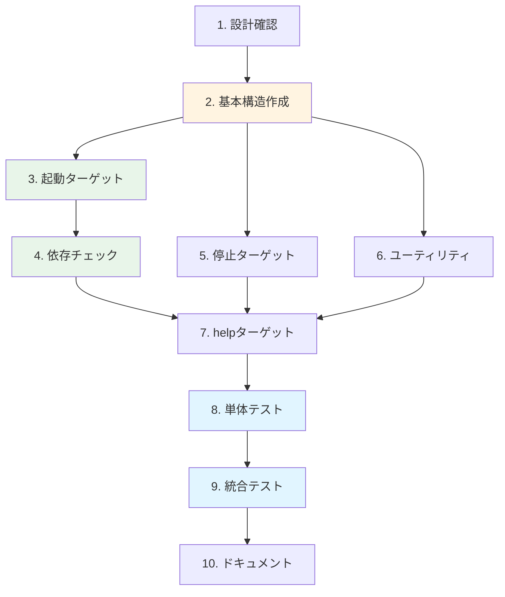

# 作業計画書: Makefile作成（レイヤ別開発コマンド）

**Issue番号**: #201
**親Issue**: #197
**作成日**: 2025-11-30
**見積工数**: M (4時間)
**ステータス**: 作業計画策定

---

## 1. 概要

### 1.1 目的

レイヤ別起動・停止・ログ表示などの開発コマンドをMakefileで提供し、開発者の日常的なワークフローを効率化する。

### 1.2 スコープ

| 対象 | 含む | 含まない |
|------|------|---------|
| ターゲット | dev-*, down-*, logs-*, status, help, network | CI/CD専用ターゲット |
| 機能 | 依存チェック、ヘルスチェック待機 | 自動リトライ、通知 |
| 互換性 | 既存スクリプトとの共存 | 既存スクリプトの置換 |

### 1.3 提供するMakeターゲット一覧

| カテゴリ | ターゲット | 説明 |
|---------|-----------|------|
| **起動** | `dev-platform` | Platform層起動 |
| | `dev-agent` | Agent層起動（Platform依存チェック付き） |
| | `dev-frontend` | Frontend層起動（Agent依存チェック付き） |
| | `dev-all` | 全レイヤ一括起動 |
| **停止** | `down` | 全サービス停止 |
| | `down-platform` | Platform層のみ停止 |
| | `down-agent` | Agent層のみ停止 |
| | `down-frontend` | Frontend層のみ停止 |
| **ユーティリティ** | `status` | サービス状態表示 |
| | `logs` | 全ログ表示 |
| | `logs-platform` | Platform層ログ |
| | `logs-agent` | Agent層ログ |
| | `rebuild` | イメージ再ビルド |
| | `clean` | 停止+ボリューム削除 |
| **管理** | `help` | ヘルプ表示（デフォルト） |
| | `network` | 共有ネットワーク作成 |

---

## 2. 作業ブレイクダウン

### 2.1 タスク一覧

| # | タスク | 見積 | 依存 | 成果物 |
|---|--------|------|------|--------|
| 1 | 設計方針の確認・調整 | 15min | - | 設計確認 |
| 2 | Makefile基本構造作成 | 30min | #1 | Makefile（骨格） |
| 3 | レイヤ別起動ターゲット実装 | 45min | #2 | dev-* ターゲット |
| 4 | 依存チェック・待機ロジック実装 | 30min | #3 | _check-*, _wait-* |
| 5 | 停止ターゲット実装 | 20min | #2 | down-* ターゲット |
| 6 | ユーティリティターゲット実装 | 25min | #2 | logs, status, etc. |
| 7 | helpターゲット実装 | 20min | #6 | help（自動生成） |
| 8 | 単体テスト（各ターゲット） | 45min | #7 | テスト結果 |
| 9 | 統合テスト（全レイヤ連携） | 30min | #8 | 検証結果 |
| 10 | ドキュメント作成 | 20min | #9 | コメント、実装メモ |

**合計**: 約4時間20分

### 2.2 作業フロー



---

## 3. 実装詳細

### 3.1 タスク1: 設計方針の確認・調整

**目的**: 設計方針書のMakefile設計を確認し、必要に応じて調整

**確認項目**:
- [ ] ターゲット名の命名規則
- [ ] COMPOSE_* 変数の定義
- [ ] 依存チェックのポート番号
- [ ] タイムアウト値の妥当性

**参照ドキュメント**:
- `dev-reports/feature/issue/197/design-policy.md` セクション4.4

### 3.2 タスク2: Makefile基本構造作成

**目的**: Makefileの骨格を作成

**実装内容**:
```makefile
# Makefile
# =============================================================================
# MySwiftAgent - レイヤ別開発コマンド
# =============================================================================
#
# 使用方法:
#   make help          - 利用可能なコマンド一覧
#   make dev-all       - 全レイヤを起動
#   make dev-platform  - Platform層のみ起動
#   make down          - 全サービスを停止
#
# 前提条件:
#   - Docker & Docker Compose v2.20+
#   - docker-compose.platform.yml, docker-compose.agent.yml,
#     docker-compose.frontend.yml が存在すること
#
# 関連ドキュメント:
#   - docs/arch/service-dependencies.md
#   - README.md
#
# =============================================================================

# シェル設定
SHELL := /bin/bash
.SHELLFLAGS := -eu -o pipefail -c

# デフォルトターゲット
.DEFAULT_GOAL := help

# PHONYターゲット宣言
.PHONY: help network \
        dev-platform dev-agent dev-frontend dev-all \
        down down-platform down-agent down-frontend \
        logs logs-platform logs-agent logs-frontend \
        status rebuild clean \
        _check-platform _check-agent _wait-platform _wait-agent

# =============================================================================
# 設定
# =============================================================================

# Compose コマンド定義
COMPOSE_PLATFORM := docker compose -f docker-compose.platform.yml
COMPOSE_AGENT := docker compose -f docker-compose.agent.yml
COMPOSE_FRONTEND := docker compose -f docker-compose.frontend.yml
COMPOSE_ALL := docker compose \
    -f docker-compose.platform.yml \
    -f docker-compose.agent.yml \
    -f docker-compose.frontend.yml

# ポート設定（ENV変数からオーバーライド可能）
MYVAULT_PORT ?= 8003
JOBQUEUE_PORT ?= 8001
EXPERTAGENT_PORT ?= 8004

# タイムアウト設定（秒）
PLATFORM_TIMEOUT ?= 120
AGENT_TIMEOUT ?= 120
```

### 3.3 タスク3: レイヤ別起動ターゲット実装

**目的**: dev-platform, dev-agent, dev-frontend, dev-all の実装

**実装ポイント**:
- `dev-platform`: network依存、_wait-platform呼び出し
- `dev-agent`: _check-platform依存、_wait-agent呼び出し
- `dev-frontend`: _check-agent依存
- `dev-all`: network依存、順次起動

**コード例**:
```makefile
dev-platform: network ## Platform層を起動 (valkey, jobqueue, myvault, langfuse等)
	@echo "🚀 Starting Platform layer..."
	@$(COMPOSE_PLATFORM) up -d
	@echo "⏳ Waiting for services to be healthy..."
	@$(MAKE) --no-print-directory _wait-platform
	@echo "✅ Platform layer is ready"

dev-agent: _check-platform ## Agent層を起動 (expertagent, graphaiserver) ※Platform必須
	@echo "🚀 Starting Agent layer..."
	@$(COMPOSE_AGENT) up -d
	@echo "⏳ Waiting for services to be healthy..."
	@$(MAKE) --no-print-directory _wait-agent
	@echo "✅ Agent layer is ready"

dev-frontend: _check-agent ## Frontend層を起動 (commonui) ※Platform+Agent必須
	@echo "🚀 Starting Frontend layer..."
	@$(COMPOSE_FRONTEND) up -d
	@echo "✅ Frontend layer is ready"

dev-all: network ## 全レイヤを一括起動
	@echo "🚀 Starting all layers..."
	@$(COMPOSE_ALL) up -d
	@echo "⏳ Waiting for services to be healthy..."
	@$(MAKE) --no-print-directory _wait-platform || true
	@$(MAKE) --no-print-directory _wait-agent || true
	@echo "✅ All services started"
	@$(MAKE) --no-print-directory status
```

### 3.4 タスク4: 依存チェック・待機ロジック実装

**目的**: _check-*, _wait-* 内部ターゲットの実装

**実装ポイント**:
- `_check-platform`: myvault health確認
- `_check-agent`: platform確認 + expertagent health確認
- `_wait-platform`: myvault, jobqueue のhealthy待機
- `_wait-agent`: expertagent のhealthy待機

**コード例**:
```makefile
_check-platform:
	@if ! curl -sf http://localhost:$(MYVAULT_PORT)/health >/dev/null 2>&1; then \
		echo "❌ Platform layer is not running."; \
		echo "   Run 'make dev-platform' first."; \
		exit 1; \
	fi

_check-agent: _check-platform
	@if ! curl -sf http://localhost:$(EXPERTAGENT_PORT)/health >/dev/null 2>&1; then \
		echo "❌ Agent layer is not running."; \
		echo "   Run 'make dev-agent' first."; \
		exit 1; \
	fi

_wait-platform:
	@echo "  Waiting for myvault..."
	@timeout $(PLATFORM_TIMEOUT) bash -c '\
		until curl -sf http://localhost:$(MYVAULT_PORT)/health >/dev/null 2>&1; do \
			sleep 2; \
		done' || (echo "  ⚠️  Timeout waiting for myvault" && exit 1)
	@echo "  Waiting for jobqueue..."
	@timeout $(PLATFORM_TIMEOUT) bash -c '\
		until curl -sf http://localhost:$(JOBQUEUE_PORT)/health >/dev/null 2>&1; do \
			sleep 2; \
		done' || (echo "  ⚠️  Timeout waiting for jobqueue" && exit 1)

_wait-agent:
	@echo "  Waiting for expertagent..."
	@timeout $(AGENT_TIMEOUT) bash -c '\
		until curl -sf http://localhost:$(EXPERTAGENT_PORT)/health >/dev/null 2>&1; do \
			sleep 2; \
		done' || (echo "  ⚠️  Timeout waiting for expertagent" && exit 1)
```

### 3.5 タスク5: 停止ターゲット実装

**目的**: down, down-platform, down-agent, down-frontend の実装

**コード例**:
```makefile
down: ## 全サービスを停止
	@echo "🛑 Stopping all services..."
	@$(COMPOSE_ALL) down 2>/dev/null || true
	@echo "✅ All services stopped"

down-platform: ## Platform層のみ停止
	@echo "🛑 Stopping Platform layer..."
	@$(COMPOSE_PLATFORM) down
	@echo "✅ Platform layer stopped"

down-agent: ## Agent層のみ停止
	@echo "🛑 Stopping Agent layer..."
	@$(COMPOSE_AGENT) down
	@echo "✅ Agent layer stopped"

down-frontend: ## Frontend層のみ停止
	@echo "🛑 Stopping Frontend layer..."
	@$(COMPOSE_FRONTEND) down
	@echo "✅ Frontend layer stopped"
```

### 3.6 タスク6: ユーティリティターゲット実装

**目的**: logs, status, rebuild, clean, network の実装

**コード例**:
```makefile
network: ## 共有ネットワークを作成
	@docker network inspect myswiftagent-network >/dev/null 2>&1 || \
		docker network create myswiftagent-network
	@echo "✅ Network 'myswiftagent-network' is ready"

logs: ## 全サービスのログを表示 (Ctrl+C で終了)
	@$(COMPOSE_ALL) logs -f

logs-platform: ## Platform層のログを表示
	@$(COMPOSE_PLATFORM) logs -f

logs-agent: ## Agent層のログを表示
	@$(COMPOSE_AGENT) logs -f

logs-frontend: ## Frontend層のログを表示
	@$(COMPOSE_FRONTEND) logs -f

status: ## 全サービスのステータスを表示
	@echo "📊 Service Status:"
	@echo ""
	@echo "=== Platform Layer ==="
	@$(COMPOSE_PLATFORM) ps --format "table {{.Name}}\t{{.Status}}\t{{.Ports}}" 2>/dev/null || echo "  (not running)"
	@echo ""
	@echo "=== Agent Layer ==="
	@$(COMPOSE_AGENT) ps --format "table {{.Name}}\t{{.Status}}\t{{.Ports}}" 2>/dev/null || echo "  (not running)"
	@echo ""
	@echo "=== Frontend Layer ==="
	@$(COMPOSE_FRONTEND) ps --format "table {{.Name}}\t{{.Status}}\t{{.Ports}}" 2>/dev/null || echo "  (not running)"

rebuild: ## 全イメージを再ビルド（キャッシュなし）
	@echo "🔨 Rebuilding all images..."
	@$(COMPOSE_ALL) build --no-cache
	@echo "✅ Rebuild complete"

clean: down ## 全サービス停止＋ボリューム削除
	@echo "🧹 Cleaning up volumes..."
	@$(COMPOSE_ALL) down -v 2>/dev/null || true
	@echo "✅ Cleaned up"
```

### 3.7 タスク7: helpターゲット実装

**目的**: 自動生成されるヘルプ表示の実装

**コード例**:
```makefile
help: ## このヘルプを表示
	@echo ""
	@echo "╔═══════════════════════════════════════════════════════════════╗"
	@echo "║  MySwiftAgent - レイヤ別開発コマンド                          ║"
	@echo "╚═══════════════════════════════════════════════════════════════╝"
	@echo ""
	@echo "使用方法: make <target>"
	@echo ""
	@echo "🚀 レイヤ別起動:"
	@grep -E '^dev-[a-zA-Z_-]+:.*?## .*$$' $(MAKEFILE_LIST) | \
		awk 'BEGIN {FS = ":.*?## "}; {printf "  \033[36m%-20s\033[0m %s\n", $$1, $$2}'
	@echo ""
	@echo "🛑 停止:"
	@grep -E '^down[a-zA-Z_-]*:.*?## .*$$' $(MAKEFILE_LIST) | \
		awk 'BEGIN {FS = ":.*?## "}; {printf "  \033[36m%-20s\033[0m %s\n", $$1, $$2}'
	@echo ""
	@echo "🔧 ユーティリティ:"
	@grep -E '^(network|logs|logs-[a-z]+|status|rebuild|clean):.*?## .*$$' $(MAKEFILE_LIST) | \
		awk 'BEGIN {FS = ":.*?## "}; {printf "  \033[36m%-20s\033[0m %s\n", $$1, $$2}'
	@echo ""
	@echo "📚 詳細: make <target> を実行してください"
	@echo ""
```

### 3.8 タスク8: 単体テスト（各ターゲット）

**目的**: 各ターゲットが正しく動作することを確認

**テスト手順**:
```bash
# 1. シンタックスチェック
make -n dev-all  # ドライラン

# 2. helpターゲット
make help

# 3. networkターゲット
make network
docker network ls | grep myswiftagent-network

# 4. Platform起動・停止
make dev-platform
make status
make down-platform

# 5. Agent起動（Platform依存チェック）
make dev-agent  # エラー期待（Platform未起動）
make dev-platform
make dev-agent
make down

# 6. Frontend起動（Agent依存チェック）
make dev-frontend  # エラー期待
make dev-platform && make dev-agent
make dev-frontend
make down
```

### 3.9 タスク9: 統合テスト（全レイヤ連携）

**目的**: 全ターゲットが連携して動作することを確認

**テスト手順**:
```bash
# 1. 全レイヤ起動
make dev-all
make status

# 2. サービス確認
curl -sf http://localhost:8003/health  # myvault
curl -sf http://localhost:8004/health  # expertagent
curl -sf http://localhost:8501/_stcore/health  # commonui

# 3. ログ確認
make logs-platform &
sleep 5
kill %1

# 4. 全停止
make down

# 5. クリーンアップ
make clean
```

### 3.10 タスク10: ドキュメント作成

**目的**: 使用方法と設計意図を文書化

**成果物**:

| ドキュメント | 内容 | 場所 |
|-------------|------|------|
| Makefile内コメント | ファイルヘッダー、ターゲット説明 | Makefile |
| 実装メモ | 判断事項、注意点 | dev-reports/feature/issue/201/implementation-notes.md |

---

## 4. テスト計画

### 4.1 自動テスト（CI対応）

| テスト | コマンド | 期待結果 |
|--------|---------|---------|
| シンタックス | `make -n dev-all` | エラーなし |
| help表示 | `make help` | ターゲット一覧表示 |
| network作成 | `make network` | ネットワーク作成 |
| 全起動 | `make dev-all` | 全サービス起動 |
| status | `make status` | 状態表示 |
| 全停止 | `make down` | 全サービス停止 |

### 4.2 異常系テスト

| テスト | 手順 | 期待結果 |
|--------|------|---------|
| Platform未起動でAgent | `make dev-agent` | エラーメッセージ、exit 1 |
| Agent未起動でFrontend | `make dev-frontend` | エラーメッセージ、exit 1 |
| タイムアウト | サービス起動遅延 | タイムアウトエラー |

---

## 5. リスクと軽減策

| リスク | 影響 | 軽減策 |
|--------|------|--------|
| compose ファイル未完成 | 高 | #198, #199, #200 完了を待つ |
| ポート競合 | 中 | ENV変数でオーバーライド可能に |
| タイムアウト値不適切 | 低 | ENV変数で調整可能に |
| 既存スクリプトとの競合 | 低 | 共存設計、置換しない |

---

## 6. 受入基準チェックリスト

### 6.1 機能要件

- [ ] `make help` がエラーなく実行され、利用可能コマンド一覧が表示される
- [ ] `make network` で `myswiftagent-network` が作成される
- [ ] `make dev-platform` でPlatform層が起動する
- [ ] `make dev-agent` でAgent層が起動する（Platform依存チェック）
- [ ] `make dev-frontend` でFrontend層が起動する（Agent依存チェック）
- [ ] `make dev-all` で全サービスが起動する
- [ ] `make down` で全サービスが停止する
- [ ] `make status` でサービス状態が表示される

### 6.2 品質基準

- [ ] Makefileシンタックスエラーなし（`make -n` で確認）
- [ ] 全ターゲットが `.PHONY` で宣言されている
- [ ] 依存チェック失敗時に適切なエラーメッセージ

### 6.3 テストケース

- [ ] 正常系: `make dev-all && make status && make down` が成功
- [ ] 正常系: `make dev-platform && make dev-agent && make dev-frontend` が順次成功
- [ ] 異常系: Platform未起動で `make dev-agent` がエラー
- [ ] 異常系: Agent未起動で `make dev-frontend` がエラー

### 6.4 ドキュメント

- [ ] Makefile内にファイルヘッダーコメントがある
- [ ] 全ターゲットに `## 説明` コメントがある
- [ ] dev-reports/feature/issue/201/ に実装メモがある

---

## 7. 関連資料

| ドキュメント | 用途 |
|-------------|------|
| [設計方針書](../197/design-policy.md) | Makefile設計（セクション4.4） |
| [Issue分割計画書](../197/issue-split.md) | Issue依存関係 |
| [Issue #198 作業計画](../198/work-plan.md) | Platform compose |
| [Issue #199 作業計画](../199/work-plan.md) | Agent compose |
| [Issue #200 作業計画](../200/work-plan.md) | Frontend compose |

---

## 8. 前提条件

### 8.1 Issue #198, #199, #200 完了条件

本Issue着手前に以下が完了している必要がある：

- [ ] docker-compose.platform.yml が作成済み
- [ ] docker-compose.agent.yml が作成済み
- [ ] docker-compose.frontend.yml が作成済み
- [ ] 各レイヤが単体起動可能

### 8.2 既存スクリプトとの関係

| スクリプト | 役割 | 関係 |
|-----------|------|------|
| `./scripts/unified-start.sh` | 既存の一括起動 | 共存（置換しない） |
| `./scripts/dev-start.sh` | 開発用起動 | 共存 |
| `./scripts/pre-push-check-all.sh` | プッシュ前チェック | 無関係 |

---

## 9. 次ステップ

1. **#198, #199, #200 完了後に着手**
2. #202（ENV統一）と**並列着手可能**
3. 完了後、#203（ドキュメント・CI）が着手可能
4. README.md にMakeコマンド一覧を追記（#203で実施）

---

**作成者**: Claude Code
**レビュー待ち**: No（前提Issue完了後に実装開始可能）
