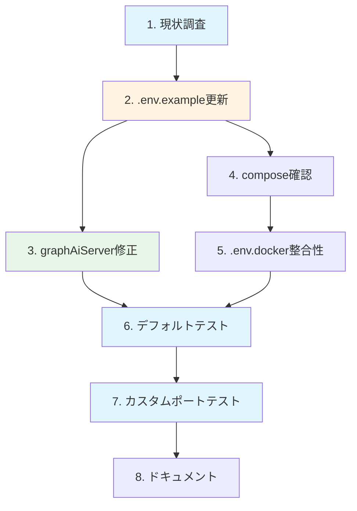

# 作業計画書: ENV統一管理（.env.example更新・ハードコーディング除去）

**Issue番号**: #202
**親Issue**: #197
**作成日**: 2025-11-30
**見積工数**: S (3時間)
**ステータス**: 作業計画策定

---

## 1. 概要

### 1.1 目的

サービス間URL/ポートをENV変数で統一管理し、ハードコーディングを除去することで、worktree環境での並列開発や将来のk8sデプロイを容易にする。

### 1.2 スコープ

| 対象 | 含む | 含まない |
|------|------|---------|
| ファイル | .env.example, graphAiServer/src/*.ts, docker-compose.*.yml | アプリケーションコード全般 |
| 変数 | ポート設定、サービスURL | APIキー、認証トークン（既存） |
| 検証 | デフォルト起動、カスタムポート起動 | 負荷テスト |

### 1.3 追加するENV変数一覧

| カテゴリ | 変数名 | デフォルト値 | 用途 |
|---------|--------|-------------|------|
| **Platform** | VALKEY_PORT | 6381 | Valkeyホストポート |
| | JOBQUEUE_PORT | 8001 | JobQueueホストポート |
| | MYSCHEDULER_PORT | 8002 | MySchedulerホストポート |
| | MYVAULT_PORT | 8003 | MyVaultホストポート |
| **Langfuse** | LANGFUSE_DB_PORT | 5433 | PostgreSQLポート |
| | LANGFUSE_WEB_PORT | 3001 | Langfuse UIポート |
| | LANGFUSE_CLICKHOUSE_HTTP_PORT | 8123 | ClickHouse HTTPポート |
| | LANGFUSE_REDIS_PORT | 6380 | Redis ポート |
| | LANGFUSE_MINIO_API_PORT | 9002 | MinIO APIポート |
| | LANGFUSE_MINIO_CONSOLE_PORT | 9001 | MinIO コンソールポート |
| **Agent** | EXPERTAGENT_PORT | 8004 | ExpertAgentホストポート |
| | GRAPHAISERVER_PORT | 8005 | GraphAIServerホストポート |
| **Frontend** | COMMONUI_PORT | 8501 | CommonUIホストポート |
| | MYAGENTDESK_PORT | 5173 | MyAgentDeskホストポート |

---

## 2. 作業ブレイクダウン

### 2.1 タスク一覧

| # | タスク | 見積 | 依存 | 成果物 |
|---|--------|------|------|--------|
| 1 | 現状調査（ハードコーディング箇所特定） | 20min | - | 調査結果 |
| 2 | .env.example 更新 | 25min | #1 | .env.example |
| 3 | graphAiServer ハードコーディング修正 | 40min | #2 | TypeScript修正 |
| 4 | compose ファイルでのENV参照確認 | 20min | #2 | 確認結果 |
| 5 | .env.docker との整合性確認 | 15min | #4 | 整合性確認 |
| 6 | デフォルトポートでの起動テスト | 25min | #5 | テスト結果 |
| 7 | カスタムポートでの起動テスト | 25min | #6 | テスト結果 |
| 8 | ドキュメント作成 | 20min | #7 | コメント、実装メモ |

**合計**: 約3時間10分

### 2.2 作業フロー



---

## 3. 実装詳細

### 3.1 タスク1: 現状調査（ハードコーディング箇所特定）

**目的**: ハードコーディングされているURL/ポートを特定

**調査コマンド**:
```bash
# graphAiServer内のハードコーディング検索
grep -r "localhost:8" graphAiServer/src/ --include="*.ts"
grep -r "127.0.0.1:" graphAiServer/src/ --include="*.ts"

# expertAgent内（確認用）
grep -r "localhost:8" expertAgent/app/ --include="*.py"

# commonUI内（確認用）
grep -r "localhost:8" commonUI/ --include="*.py"
```

**期待結果**: graphAiServerに一部ハードコーディングがある（設計方針書より）

### 3.2 タスク2: .env.example 更新

**目的**: レイヤ別ポート設定を追加

**追加内容**:
```bash
# ============================================================================
# レイヤ別ポート設定
# ============================================================================
# 各レイヤのサービスポート（ホスト側）
# worktree別に異なるポートを使用する場合は .env.local で上書き
#
# 命名規則: {SERVICE}_PORT
# デフォルト値は docker-compose.yml と一致

# --- Platform Layer ---
VALKEY_PORT=6381
JOBQUEUE_PORT=8001
MYSCHEDULER_PORT=8002
MYVAULT_PORT=8003

# --- Langfuse (Platform) ---
LANGFUSE_DB_PORT=5433
LANGFUSE_WEB_PORT=3001
LANGFUSE_CLICKHOUSE_HTTP_PORT=8123
LANGFUSE_REDIS_PORT=6380
LANGFUSE_MINIO_API_PORT=9002
LANGFUSE_MINIO_CONSOLE_PORT=9001

# --- Agent Layer ---
EXPERTAGENT_PORT=8004
GRAPHAISERVER_PORT=8005

# --- Frontend Layer ---
COMMONUI_PORT=8501
MYAGENTDESK_PORT=5173
```

**配置場所**: Docker Image Versions セクションの後

### 3.3 タスク3: graphAiServer ハードコーディング修正

**目的**: ハードコーディングURLをENV参照に変更

**修正パターン**:
```typescript
// Before
const MYVAULT_URL = "http://localhost:8003";

// After
const MYVAULT_URL = process.env.MYVAULT_BASE_URL || "http://localhost:8003";
```

**検証コマンド**:
```bash
cd graphAiServer
npm run type-check
npm run lint
```

### 3.4 タスク4: composeファイルでのENV参照確認

**目的**: 各composeファイルで `${VAR:-default}` 形式が使用されていることを確認

**確認対象**:
- docker-compose.platform.yml
- docker-compose.agent.yml
- docker-compose.frontend.yml

**確認コマンド**:
```bash
grep -E '\$\{[A-Z_]+_PORT' docker-compose.*.yml
```

**期待結果**: ポート設定が `"${EXPERTAGENT_PORT:-8004}:8000"` 形式

### 3.5 タスク5: .env.docker との整合性確認

**目的**: .env.docker の設定との整合性を確認

**確認項目**:
- [ ] 変数名が統一されている
- [ ] デフォルト値が一致している
- [ ] 重複定義がない

### 3.6 タスク6: デフォルトポートでの起動テスト

**目的**: ENV未設定時にデフォルト値で正常起動することを確認

**テスト手順**:
```bash
# 1. 既存.envのバックアップ
cp .env .env.backup

# 2. .env.exampleからコピー
cp .env.example .env
# 必須項目（MSA_MASTER_KEY等）を設定

# 3. 全レイヤ起動
make dev-all

# 4. ポート確認
docker ps --format "table {{.Names}}\t{{.Ports}}"

# 5. 期待値との比較
# valkey: 6381
# jobqueue: 8001
# myscheduler: 8002
# myvault: 8003
# expertagent: 8004
# graphaiserver: 8005
# commonui: 8501

# 6. 停止
make down

# 7. 復元
mv .env.backup .env
```

### 3.7 タスク7: カスタムポートでの起動テスト

**目的**: .env.local でのポート上書きが機能することを確認

**テスト手順**:
```bash
# 1. .env.localを作成
cat > .env.local << 'EOF'
# Custom port configuration for testing
EXPERTAGENT_PORT=9004
GRAPHAISERVER_PORT=9005
COMMONUI_PORT=9501
EOF

# 2. 起動
make dev-all

# 3. カスタムポート確認
curl -sf http://localhost:9004/health  # expertagent
curl -sf http://localhost:9005/health  # graphaiserver
curl -sf http://localhost:9501/_stcore/health  # commonui

# 4. 停止・クリーンアップ
make down
rm .env.local
```

### 3.8 タスク8: ドキュメント作成

**目的**: 使用方法と設計意図を文書化

**成果物**:

| ドキュメント | 内容 | 場所 |
|-------------|------|------|
| .env.example コメント | セクション説明、使用方法 | .env.example |
| 実装メモ | 修正箇所、判断事項 | dev-reports/feature/issue/202/implementation-notes.md |

---

## 4. テスト計画

### 4.1 自動テスト（CI対応）

| テスト | コマンド | 期待結果 |
|--------|---------|---------|
| ENV変数定義確認 | `grep -E "^(VALKEY\|JOBQUEUE\|...)_PORT" .env.example` | 全変数が存在 |
| ハードコーディング検出 | `grep -r "localhost:8" graphAiServer/src/` | 検出なし |
| TypeScript型チェック | `cd graphAiServer && npm run type-check` | エラーなし |
| compose ENV参照 | `grep -E '\$\{.*_PORT' docker-compose.*.yml` | 全ポートがENV参照 |

### 4.2 手動テスト

| テスト | 手順 | 期待結果 |
|--------|------|---------|
| デフォルト起動 | .env.example からコピー、起動 | 全サービス起動 |
| カスタムポート | .env.local でオーバーライド | カスタムポートで起動 |
| サービス間通信 | commonui → expertagent API呼び出し | 正常レスポンス |

---

## 5. リスクと軽減策

| リスク | 影響 | 軽減策 |
|--------|------|--------|
| compose ファイル未完成 | 高 | #198, #199, #200 完了を待つ |
| 既存.env との非互換 | 中 | 追加のみ、既存設定は変更しない |
| TypeScript修正での型エラー | 低 | type-check で早期発見 |

---

## 6. 受入基準チェックリスト

### 6.1 機能要件

- [ ] .env.example に以下の変数が定義されている:
  - VALKEY_PORT, JOBQUEUE_PORT, MYSCHEDULER_PORT, MYVAULT_PORT
  - EXPERTAGENT_PORT, GRAPHAISERVER_PORT
  - COMMONUI_PORT, MYAGENTDESK_PORT
  - LANGFUSE_DB_PORT, LANGFUSE_WEB_PORT, etc.
- [ ] `grep -r "localhost:8" graphAiServer/src/` でハードコーディングURLが検出されない
- [ ] 各composeファイルで `${VAR:-default}` 形式でポートが参照されている

### 6.2 品質基準

- [ ] .env.example がコピーのみで動作する
- [ ] TypeScript修正後、`npm run type-check` がパス

### 6.3 テストケース

- [ ] 正常系: デフォルトポートで全サービス起動
- [ ] 正常系: カスタムポート設定（.env.local）で起動
- [ ] 正常系: サービス間通信が正常動作

### 6.4 ドキュメント

- [ ] .env.example にセクション説明コメントがある
- [ ] 各変数にコメントで用途が記載されている
- [ ] dev-reports/feature/issue/202/ に実装メモがある

---

## 7. 関連資料

| ドキュメント | 用途 |
|-------------|------|
| [設計方針書](../197/design-policy.md) | ENV設計（セクション5） |
| [Issue分割計画書](../197/issue-split.md) | Issue依存関係 |
| [.env.example](../../../.env.example) | 現行設定 |
| [.env.docker](../../../.env.docker) | Docker用設定 |

---

## 8. 前提条件

### 8.1 Issue #198, #199, #200 完了条件

本Issue着手前に以下が完了している必要がある：

- [ ] docker-compose.platform.yml が作成済み
- [ ] docker-compose.agent.yml が作成済み
- [ ] docker-compose.frontend.yml が作成済み
- [ ] 各composeで `${VAR:-default}` 形式が使用されていること

### 8.2 並列着手について

- Issue #201（Makefile）と #202（本Issue）は**並列着手可能**
- ただし両方ともIssue #198, #199, #200の完了が前提

---

## 9. 次ステップ

1. **#198, #199, #200 完了後に着手**
2. #201（Makefile）と**並列着手可能**
3. 完了後、#203（ドキュメント・CI）が着手可能
4. README.md にENV設定ガイドを追記（#203で実施）

---

**作成者**: Claude Code
**レビュー待ち**: No（前提Issue完了後に実装開始可能）
