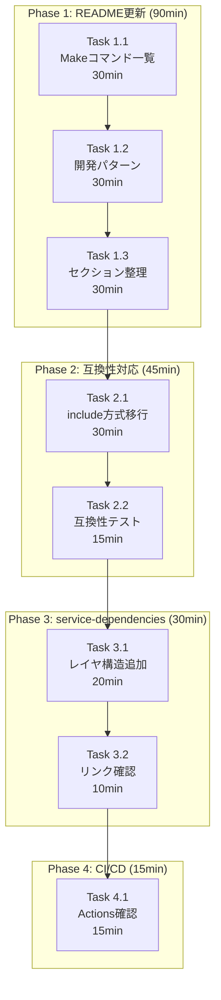

# 作業計画書: Issue #203 - ドキュメント・CI更新

## Issue: [Docs] ドキュメント・CI更新

**Issue番号**: #203
**親Issue**: #197
**Phase**: Phase 4: ドキュメント・統合
**サイズ**: S
**作業見積**: 3時間
**優先度**: Medium
**依存Issue**: #198, #199, #200, #201, #202

---

## 1. 現状分析

### 現在の状態

| ファイル | 状態 | 備考 |
|----------|------|------|
| `README.md` | 部分的完了 | 「レイヤ別Docker Compose」セクション有り（L97-124） |
| `README.md` | 未着手 | 「Makeコマンド一覧」セクション未作成 |
| `README.md` | 未着手 | 「よく使う開発パターン」セクション未作成 |
| `docker-compose.yml` | 更新必要 | `include` 方式未対応 |
| `docs/arch/service-dependencies.md` | 更新必要 | レイヤ構造反映が必要 |
| `.github/workflows/*` | 確認必要 | CI/CD影響確認 |

### 依存ファイル（既存・確認済み）

| ファイル | サイズ | 最終更新 |
|----------|--------|----------|
| `docker-compose.platform.yml` | 13KB | 2024-12-02 |
| `docker-compose.agent.yml` | 5.4KB | 2024-12-02 |
| `docker-compose.frontend.yml` | 4.2KB | 2024-12-02 |
| `Makefile` | 10.6KB | 2024-12-02 |
| `docker-compose.yml` | 18.4KB | 既存（更新対象） |

---

## 2. 詳細タスク分解

### Phase 1: README.md更新（90分）

#### Task 1.1: 「Makeコマンド一覧」セクション追加
- 所要時間: 30分
- 成果物: `README.md` 内セクション追加
- 依存: なし
- 内容:
  - `make help` の出力内容をドキュメント化
  - Startup/Shutdown/Log/Utilityコマンド一覧表作成
  - 依存レイヤの説明追加

#### Task 1.2: 「よく使う開発パターン」セクション追加
- 所要時間: 30分
- 成果物: `README.md` 内セクション追加
- 依存: Task 1.1
- 内容:
  - Platform層のみ開発
  - AI機能開発（Platform + Agent）
  - フルスタック開発
  - 特定サービスのみローカル起動

#### Task 1.3: 既存セクション統合・整理
- 所要時間: 30分
- 成果物: `README.md` 整理済み
- 依存: Task 1.1, Task 1.2
- 内容:
  - 「方法1b: レイヤ別Docker Compose」セクションとの整合性確認
  - 重複内容の統合
  - 目次・リンク確認

### Phase 2: docker-compose.yml互換性対応（45分）

#### Task 2.1: include方式への移行
- 所要時間: 30分
- 成果物: `docker-compose.yml` 更新
- 依存: Phase 1完了
- 内容:
  ```yaml
  include:
    - docker-compose.platform.yml
    - docker-compose.agent.yml
    - docker-compose.frontend.yml
  ```
  - 既存サービス定義の整理
  - 重複定義の除去
  - 互換性維持（既存コマンド動作確認）

#### Task 2.2: 互換性テスト
- 所要時間: 15分
- 成果物: テスト結果確認
- 依存: Task 2.1
- テストケース:
  - `docker compose config` でエラーなし
  - `docker compose up -d` で全サービス起動
  - 既存のヘルスチェック動作

### Phase 3: service-dependencies.md更新（30分）

#### Task 3.1: レイヤ構造セクション追加
- 所要時間: 20分
- 成果物: `docs/arch/service-dependencies.md` 更新
- 依存: Phase 2完了
- 内容:
  - レイヤ別起動方法の追加
  - Makeコマンドへの参照追加
  - 依存関係グラフの更新

#### Task 3.2: リンク確認
- 所要時間: 10分
- 成果物: リンク検証完了
- 依存: Task 3.1
- 内容:
  - 内部リンクの有効性確認
  - 新規追加ファイルへの参照追加

### Phase 4: CI/CD確認・検証（15分）

#### Task 4.1: GitHub Actions確認
- 所要時間: 15分
- 成果物: CI/CD検証結果
- 依存: Phase 3完了
- 確認対象:
  - `ci-feature.yml` - docker compose使用箇所
  - `cd-develop.yml` - デプロイステップ
  - 必要に応じて更新

---

## 3. タスク依存関係



---

## 4. 作業スケジュール

### 想定作業時間: 3時間（180分）

| 時間 | タスク | 成果物 |
|------|--------|--------|
| 0:00-0:30 | Task 1.1: Makeコマンド一覧 | README.mdセクション追加 |
| 0:30-1:00 | Task 1.2: 開発パターン | README.mdセクション追加 |
| 1:00-1:30 | Task 1.3: セクション整理 | README.md整理完了 |
| 1:30-2:00 | Task 2.1: include方式移行 | docker-compose.yml更新 |
| 2:00-2:15 | Task 2.2: 互換性テスト | テスト完了 |
| 2:15-2:35 | Task 3.1: レイヤ構造追加 | service-dependencies.md更新 |
| 2:35-2:45 | Task 3.2: リンク確認 | リンク検証完了 |
| 2:45-3:00 | Task 4.1: CI/CD確認 | 検証完了・PR準備 |

---

## 5. チェックポイント

| タイミング | 確認事項 | 判断基準 |
|-----------|---------|---------|
| Phase 1完了後 | README.mdプレビュー確認 | マークダウンレンダリング正常 |
| Task 2.1完了後 | `docker compose config` | エラーなし |
| Task 2.2完了後 | 全サービス起動確認 | healthチェック通過 |
| Phase 3完了後 | リンク検証 | 全リンク有効 |
| Phase 4完了後 | CI実行 | 既存ワークフロー正常 |

---

## 6. リスクと対策

| リスク | 発生確率 | 影響 | 対策 |
|-------|---------|------|------|
| docker-compose include構文エラー | 中 | 互換性破損 | 段階的テスト、ロールバック準備 |
| CI/CDワークフロー破損 | 低 | ビルド失敗 | 事前にワークフロー読み込み、dry-run |
| リンク切れ | 低 | ドキュメント品質低下 | 自動リンクチェック |
| 既存コマンド非互換 | 中 | 開発者混乱 | 後方互換性維持、deprecation notice |

---

## 7. 成果物チェックリスト

### ドキュメント
- [ ] `README.md` - 「Makeコマンド一覧」セクション追加
- [ ] `README.md` - 「よく使う開発パターン」セクション追加
- [ ] `README.md` - 既存セクション統合・整理
- [ ] `docs/arch/service-dependencies.md` - レイヤ構造反映

### 設定ファイル
- [ ] `docker-compose.yml` - include方式への移行

### 検証
- [ ] 互換性テスト完了
- [ ] CI/CD確認完了

---

## 8. Definition of Done

Issue完了条件:

### 自動検証可能な基準
- [ ] README.md に「Makeコマンド一覧」セクションが存在する
- [ ] README.md に「よく使う開発パターン」セクションが存在する
- [ ] 既存docker-compose.yml が `include` で3ファイルを参照している
- [ ] `docker compose up -d` （既存コマンド）が引き続き動作する
- [ ] Markdownリンクが有効（壊れたリンクなし）
- [ ] コードブロックの言語指定が正しい

### 手動検証が必要な基準
- [ ] ドキュメントが分かりやすい
- [ ] 新規開発者がドキュメントのみでセットアップ可能
- [ ] 既存の開発フローに影響がない

---

## 9. 参照ドキュメント

- [Issue分割計画書](../197/issue-split.md)
- [品質基準](../../../../docs/claude/04-quality-standards.md)
- [ドキュメント管理ルール](../../../../docs/claude/07-documentation-rules.md)

---

## 10. 次のアクション

作業計画承認後:
1. **ブランチ作成**: `feature/issue/203` または既存worktree使用
2. **タスク実行**: 計画に従って実装
3. **PR作成**: `develop` ブランチへ
4. **進捗報告**: `/progress-report`で定期報告

---

**作成日**: 2025-12-02
**作成者**: Claude Code
**ステータス**: 承認待ち
