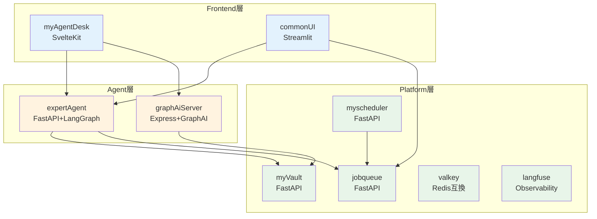
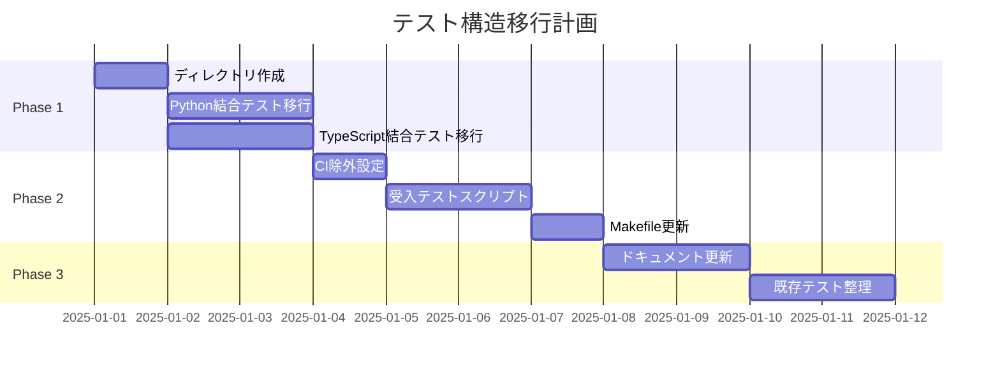

# 設計方針書: Issue #209 - 開発プロセス改善

**Issue番号**: #209
**タイトル**: 開発プロセス改善
**作成日**: 2025-12-02
**ステータス**: 設計方針策定

---

## 1. アーキテクチャ設計

### 1.1 テストアーキテクチャ全体像

```
┌─────────────────────────────────────────────────────────────────────────┐
│                        テストアーキテクチャ                              │
├─────────────────────────────────────────────────────────────────────────┤
│                                                                         │
│  ┌─────────────────────────────────────────────────────────────────┐   │
│  │                    CI実行対象（GitHub Actions）                  │   │
│  │  ┌─────────────────────┐    ┌─────────────────────────────┐    │   │
│  │  │   単体テスト        │    │   結合テスト                 │    │   │
│  │  │   (Unit Tests)      │    │   (Integration Tests)        │    │   │
│  │  │                     │    │                              │    │   │
│  │  │  ・プロジェクト内   │    │  ・リポジトリ直下           │    │   │
│  │  │  ・モック多用       │    │  ・API間通信テスト          │    │   │
│  │  │  ・高速実行         │    │  ・DB接続テスト             │    │   │
│  │  │  ・カバレッジ90%+   │    │  ・カバレッジ50%+           │    │   │
│  │  └─────────────────────┘    └─────────────────────────────┘    │   │
│  └─────────────────────────────────────────────────────────────────┘   │
│                                                                         │
│  ┌─────────────────────────────────────────────────────────────────┐   │
│  │                ローカル実行のみ（受入テスト）                    │   │
│  │  ┌─────────────────────┐    ┌─────────────────────────────┐    │   │
│  │  │   開発者受入テスト   │    │   PO受入テスト               │    │   │
│  │  │                     │    │                              │    │   │
│  │  │  ・APIキー必要      │    │  ・UX/UI検証                │    │   │
│  │  │  ・実サービス接続   │    │  ・ビジネスロジック検証     │    │   │
│  │  │  ・E2Eシナリオ      │    │  ・手動操作確認             │    │   │
│  │  │  ・Playwright/pytest│    │  ・スクリーンショット       │    │   │
│  │  └─────────────────────┘    └─────────────────────────────┘    │   │
│  └─────────────────────────────────────────────────────────────────┘   │
│                                                                         │
└─────────────────────────────────────────────────────────────────────────┘
```

### 1.2 レイヤー構成とテスト責任



### 1.3 テストディレクトリ構造設計

```
MySwiftAgent/
│
├── 【単体テスト：プロジェクト内（現状維持）】
│
├── expertAgent/
│   └── tests/
│       ├── unit/                    # 単体テスト（CI対象）
│       │   ├── test_*.py
│       │   └── conftest.py
│       ├── fixtures/                # テストフィクスチャ
│       └── conftest.py              # 共通設定
│
├── jobqueue/
│   └── tests/
│       └── unit/                    # 単体テスト（CI対象）
│
├── myscheduler/
│   └── tests/
│       └── unit/                    # 単体テスト（CI対象）
│
├── myVault/
│   └── tests/
│       └── unit/                    # 単体テスト（CI対象）
│
├── myAgentDesk/
│   └── src/
│       └── **/*.test.ts             # 単体テスト（CI対象）
│
├── graphAiServer/
│   └── src/
│       └── **/*.test.ts             # 単体テスト（CI対象）
│
│
├── 【結合・受入テスト：リポジトリ直下（新規）】
│
└── tests/
    │
    ├── integration/                 # 結合テスト（CI対象）
    │   │
    │   ├── python/                  # Python結合テスト
    │   │   ├── conftest.py          # pytest共通設定
    │   │   ├── pytest.ini           # pytest設定
    │   │   ├── requirements.txt     # テスト依存関係
    │   │   │
    │   │   ├── platform/            # Platform層結合テスト
    │   │   │   ├── test_myvault_api.py
    │   │   │   ├── test_jobqueue_api.py
    │   │   │   └── test_myscheduler_api.py
    │   │   │
    │   │   ├── agent/               # Agent層結合テスト
    │   │   │   ├── test_expertagent_api.py
    │   │   │   └── test_expertagent_myvault.py
    │   │   │
    │   │   └── cross_layer/         # レイヤー間結合テスト
    │   │       ├── test_agent_platform.py
    │   │       └── test_full_stack.py
    │   │
    │   └── typescript/              # TypeScript結合テスト
    │       ├── vitest.config.ts     # Vitest設定
    │       ├── package.json         # npm依存関係
    │       │
    │       └── api/                 # API結合テスト
    │           └── graphaiserver.test.ts
    │
    │
    └── acceptance/                  # 受入テスト（ローカルのみ）
        │
        ├── python/                  # Python受入テスト
        │   ├── conftest.py          # pytest共通設定
        │   ├── pytest.ini           # pytest設定
        │   │
        │   ├── platform/            # Platform層受入テスト
        │   │   └── test_myvault_secrets.py
        │   │
        │   ├── agent/               # Agent層受入テスト
        │   │   ├── test_job_generator_e2e.py
        │   │   └── test_workflow_execution.py
        │   │
        │   └── e2e/                 # E2Eシナリオテスト
        │       ├── test_user_journey.py
        │       └── scenarios/
        │           ├── scenario_job_creation.py
        │           └── scenario_workflow_run.py
        │
        └── typescript/              # TypeScript受入テスト（Playwright）
            ├── playwright.config.ts # Playwright設定
            ├── package.json         # npm依存関係
            │
            ├── ui/                  # UIテスト
            │   ├── myagentdesk.spec.ts
            │   └── commonui.spec.ts
            │
            └── e2e/                 # E2Eテスト
                └── full_flow.spec.ts
```

---

## 2. 技術選定

### 2.1 Python テストスタック

| カテゴリ | 技術 | バージョン | 選定理由 |
|----------|------|----------|----------|
| テストフレームワーク | pytest | 7.x+ | 既存採用、豊富なプラグイン |
| HTTPクライアント | httpx | 0.25+ | 非同期対応、pytest統合良好 |
| モック | pytest-mock | 3.x+ | 既存採用、シンプル |
| カバレッジ | pytest-cov | 4.x+ | 既存採用、CI統合済み |
| 非同期テスト | pytest-asyncio | 0.21+ | FastAPI非同期テスト対応 |
| フィクスチャ | factory_boy | 3.x+ | テストデータ生成 |

### 2.2 TypeScript テストスタック

| カテゴリ | 技術 | バージョン | 選定理由 |
|----------|------|----------|----------|
| 単体テスト | Vitest | 1.x+ | Vite統合、高速、ESM対応 |
| コンポーネントテスト | @testing-library/svelte | 4.x+ | SvelteKit標準 |
| E2Eテスト | Playwright | 1.40+ | クロスブラウザ、高信頼性 |
| モック | vi (Vitest内蔵) | - | Vitest統合 |
| カバレッジ | v8 (Vitest内蔵) | - | ネイティブ対応 |

### 2.3 インフラ・ツール

| カテゴリ | 技術 | 選定理由 |
|----------|------|----------|
| コンテナ | Docker Compose | 既存採用、レイヤ別yml対応済み |
| タスクランナー | GNU Make | 既存採用、シンプル、CI統合容易 |
| CI/CD | GitHub Actions | 既存採用 |
| シークレット管理 | .env + myVault | 既存採用、ローカル/本番分離 |

---

## 3. 設計パターン

### 3.1 テスト分離パターン（Test Pyramid）

```
                    ┌─────────┐
                   /│   E2E   │\        ← 受入テスト（ローカル）
                  / │  Tests  │ \          少数、遅い、高コスト
                 /  └─────────┘  \
                /                  \
               /   ┌───────────┐   \
              /    │Integration│    \   ← 結合テスト（CI）
             /     │   Tests   │     \     中程度
            /      └───────────┘      \
           /                            \
          /      ┌───────────────┐      \
         /       │  Unit Tests   │       \ ← 単体テスト（CI）
        /        └───────────────┘        \   多数、高速、低コスト
       ──────────────────────────────────────
```

### 3.2 レイヤー分離パターン（Layer Isolation）

**原則**: 1 Issue = 1 Layer

```python
# 良い例：単一レイヤー内での変更
class ExpertAgentServiceTest:
    """Agent層のみのテスト"""
    def test_job_generator(self):
        # myVaultはモック
        mock_vault = Mock()
        service = JobGeneratorService(vault=mock_vault)
        result = service.generate(...)
        assert result.status == "success"

# 避けるべき例：レイヤー跨ぎ
class CrossLayerTest:
    """Platform + Agent の同時テスト（単一Issueでは避ける）"""
    def test_full_integration(self):
        # 複数レイヤーの変更が必要
        pass
```

### 3.3 フィクスチャ管理パターン（Shared Fixtures）

```python
# tests/integration/python/conftest.py
import pytest
from typing import Generator

@pytest.fixture(scope="session")
def docker_services() -> Generator[dict, None, None]:
    """Platform層コンテナを起動（セッション単位で共有）"""
    # docker-compose.platform.yml を起動
    yield {"myvault": "http://localhost:8103", ...}
    # クリーンアップ

@pytest.fixture(scope="function")
def test_client(docker_services) -> Generator[httpx.AsyncClient, None, None]:
    """テスト用HTTPクライアント"""
    async with httpx.AsyncClient() as client:
        yield client
```

### 3.4 conftest.py共通化戦略

#### 3.4.1 階層構造と責任分担

```
tests/
├── conftest.py                          # [L0] 全テスト共通
│   └─ pytest設定、共通マーカー定義
│
├── integration/
│   └── python/
│       ├── conftest.py                  # [L1] Python結合テスト共通
│       │   └─ docker_services, test_client
│       ├── platform/conftest.py         # [L2] Platform層固有
│       │   └─ myvault_client, jobqueue_client
│       └── agent/conftest.py            # [L2] Agent層固有
│           └─ expertagent_client, mock_myvault
│
└── acceptance/
    └── python/
        ├── conftest.py                  # [L1] Python受入テスト共通
        │   └─ env_config, requires_api_key
        ├── platform/conftest.py         # [L2] Platform層固有
        ├── agent/conftest.py            # [L2] Agent層固有
        └── e2e/conftest.py              # [L2] E2E固有
            └─ full_stack_services
```

#### 3.4.2 共通フィクスチャ定義

```python
# tests/conftest.py [L0: ルートレベル]
"""
全テスト共通のpytest設定とマーカー定義
"""
import pytest

def pytest_configure(config):
    """カスタムマーカーの登録"""
    config.addinivalue_line("markers", "slow: マークされたテストは低速")
    config.addinivalue_line("markers", "requires_api_key: 外部APIキーが必要")
    config.addinivalue_line("markers", "platform: Platform層テスト")
    config.addinivalue_line("markers", "agent: Agent層テスト")
    config.addinivalue_line("markers", "frontend: Frontend層テスト")

@pytest.fixture(scope="session")
def project_root() -> str:
    """プロジェクトルートパスを返す"""
    import os
    return os.path.dirname(os.path.dirname(os.path.abspath(__file__)))
```

```python
# tests/integration/python/conftest.py [L1: 結合テスト共通]
"""
Python結合テスト共通フィクスチャ
"""
import pytest
import httpx
from typing import Generator, Dict, Any

# L0からの継承は自動
# project_root, マーカーなどが利用可能

@pytest.fixture(scope="session")
def service_urls() -> Dict[str, str]:
    """サービスURLの定義（CI環境用デフォルト値）"""
    return {
        "myvault": "http://localhost:8103",
        "jobqueue": "http://localhost:8001",
        "myscheduler": "http://localhost:8002",
        "expertagent": "http://localhost:8104",
        "graphaiserver": "http://localhost:8105",
    }

@pytest.fixture(scope="session")
def docker_compose_up(service_urls):
    """Docker Composeサービス起動（CIでは事前起動を想定）"""
    import subprocess
    import time

    # ヘルスチェック待機のみ（起動はCI側で実施）
    max_retries = 30
    for i in range(max_retries):
        try:
            response = httpx.get(f"{service_urls['myvault']}/health", timeout=5)
            if response.status_code == 200:
                break
        except httpx.RequestError:
            pass
        time.sleep(2)
    else:
        pytest.skip("Required services not available")

    yield service_urls

@pytest.fixture
async def async_client() -> Generator[httpx.AsyncClient, None, None]:
    """非同期HTTPクライアント"""
    async with httpx.AsyncClient(timeout=30) as client:
        yield client
```

```python
# tests/acceptance/python/conftest.py [L1: 受入テスト共通]
"""
Python受入テスト共通フィクスチャ
"""
import pytest
import os
from typing import Dict, Any
from functools import wraps

@pytest.fixture(scope="session")
def env_config() -> Dict[str, Any]:
    """環境変数からの設定読み込み"""
    return {
        "MYVAULT_URL": os.getenv("MYVAULT_URL", "http://localhost:8103"),
        "EXPERTAGENT_URL": os.getenv("EXPERTAGENT_URL", "http://localhost:8104"),
        "GOOGLE_API_KEY": os.getenv("GOOGLE_API_KEY"),
        "OPENAI_API_KEY": os.getenv("OPENAI_API_KEY"),
    }

def requires_api_key(key_name: str):
    """APIキーが必要なテストをスキップするデコレータ"""
    def decorator(func):
        @wraps(func)
        def wrapper(*args, **kwargs):
            if not os.getenv(key_name):
                pytest.skip(f"{key_name} not set in environment")
            return func(*args, **kwargs)
        return wrapper
    return decorator

@pytest.fixture(scope="session")
def ensure_services_running(env_config):
    """受入テスト用サービス起動確認"""
    import subprocess

    # make dev-platform または make dev-agent を実行
    # （呼び出し元のMakefileターゲットで制御）
    yield env_config
```

#### 3.4.3 フィクスチャ継承ルール

| レベル | 配置場所 | 責任範囲 | 継承元 |
|--------|----------|----------|--------|
| L0 | `tests/conftest.py` | 全テスト共通設定 | なし |
| L1 | `tests/{type}/python/conftest.py` | テスト種別共通 | L0 |
| L2 | `tests/{type}/python/{layer}/conftest.py` | レイヤー固有 | L1, L0 |

#### 3.4.4 フィクスチャ重複回避ルール

```python
# ❌ Bad: 同じフィクスチャを複数箇所で定義
# tests/integration/python/platform/conftest.py
@pytest.fixture
def async_client():  # L1で既に定義済み
    ...

# ✅ Good: 上位レベルのフィクスチャを再利用
# tests/integration/python/platform/conftest.py
@pytest.fixture
def myvault_client(async_client, service_urls):  # L1のフィクスチャを利用
    """MyVault専用クライアント"""
    return MyVaultTestClient(async_client, service_urls["myvault"])
```

#### 3.4.5 プロジェクト内conftest.pyとの関係

```
【プロジェクト内（単体テスト用）】
expertAgent/tests/conftest.py
  └─ プロジェクト固有のモック、ファクトリー
  └─ 独立して動作（リポジトリ直下のconftest.pyに依存しない）

【リポジトリ直下（結合・受入テスト用）】
tests/conftest.py
  └─ 結合・受入テスト専用
  └─ プロジェクト内conftest.pyとは独立
```

**重要**: プロジェクト内のconftest.pyとリポジトリ直下のconftest.pyは**相互に独立**。
単体テスト実行時にリポジトリ直下のconftest.pyが読み込まれないようにする。

### 3.5 環境切り替えパターン（Environment Switching）

```python
# tests/acceptance/python/conftest.py
import os

@pytest.fixture(scope="session")
def env_config():
    """環境設定の読み込み"""
    return {
        "MYVAULT_URL": os.getenv("MYVAULT_URL", "http://localhost:8103"),
        "GOOGLE_API_KEY": os.getenv("GOOGLE_API_KEY"),  # ローカル.envから
        "OPENAI_API_KEY": os.getenv("OPENAI_API_KEY"),
    }

def requires_api_key(key_name: str):
    """APIキーが必要なテストをスキップ"""
    def decorator(func):
        if not os.getenv(key_name):
            return pytest.mark.skip(f"{key_name} not set")(func)
        return func
    return decorator
```

---

## 4. CI/CD設計

### 4.1 CIワークフロー更新設計

```yaml
# .github/workflows/ci-feature.yml（更新箇所）

jobs:
  test-python:
    name: Python Tests
    runs-on: ubuntu-latest
    strategy:
      matrix:
        project: [expertAgent, jobqueue, myscheduler, myVault]
    steps:
      # 単体テスト（プロジェクト内）
      - name: Run unit tests
        working-directory: ./${{ matrix.project }}
        run: uv run pytest tests/unit/ -v --cov=app

  test-integration-python:
    name: Python Integration Tests
    runs-on: ubuntu-latest
    needs: test-python
    steps:
      # 結合テスト（リポジトリ直下）
      - name: Run integration tests
        working-directory: ./tests/integration/python
        run: |
          pip install -r requirements.txt
          pytest . -v --ignore=../acceptance/
        env:
          # CIでは実APIキーは使用しない
          MYVAULT_URL: http://localhost:8103
          USE_MOCK_SERVICES: "true"

  test-typescript:
    name: TypeScript Tests
    runs-on: ubuntu-latest
    strategy:
      matrix:
        project: [myAgentDesk, graphAiServer]
    steps:
      # 単体テスト（プロジェクト内）
      - name: Run unit tests
        working-directory: ./${{ matrix.project }}
        run: npm test

  # 受入テストはCIから除外（明示的に記載）
  # acceptance tests are excluded from CI
  # Run locally with: make acceptance-test-{layer}
```

### 4.2 除外設定

```yaml
# tests/acceptance/配下をCI対象から除外する方法

# 方法1: pytest.ini での除外
[pytest]
testpaths = tests/integration
norecursedirs = tests/acceptance

# 方法2: GitHub Actions での明示的除外
- name: Run tests
  run: pytest tests/integration/ --ignore=tests/acceptance/

# 方法3: .github/workflows/ci-feature.yml の paths-ignore
on:
  push:
    paths-ignore:
      - 'tests/acceptance/**'
```

---

## 5. Makefileターゲット設計

### 5.1 新規ターゲット一覧

```makefile
# =============================================================================
# Acceptance Test Targets
# =============================================================================

.PHONY: acceptance-test-all acceptance-test-platform acceptance-test-agent
.PHONY: acceptance-test-frontend acceptance-test-python acceptance-test-typescript

# ヘルプ表示に追加
help:
	@echo ""
	@echo "Acceptance Test Commands:"
	@grep -E '^acceptance-test[a-zA-Z_-]*:.*?## .*$$' $(MAKEFILE_LIST) | \
		awk 'BEGIN {FS = ":.*?## "}; {printf "  \033[36m%-25s\033[0m %s\n", $$1, $$2}'

# -----------------------------------------------------------------------------
# Layer-based Acceptance Tests
# -----------------------------------------------------------------------------

acceptance-test-platform: _ensure-platform-up ## Platform層の受入テスト実行
	@echo "🧪 Running Platform layer acceptance tests..."
	cd tests/acceptance/python && \
		uv run pytest platform/ -v --tb=short
	@echo "✅ Platform acceptance tests complete"

acceptance-test-agent: _ensure-agent-up ## Agent層の受入テスト実行
	@echo "🧪 Running Agent layer acceptance tests..."
	cd tests/acceptance/python && \
		uv run pytest agent/ -v --tb=short
	@echo "✅ Agent acceptance tests complete"

acceptance-test-frontend: _ensure-all-up ## Frontend層の受入テスト実行（Playwright）
	@echo "🧪 Running Frontend layer acceptance tests..."
	cd tests/acceptance/typescript && \
		npx playwright test
	@echo "✅ Frontend acceptance tests complete"

# -----------------------------------------------------------------------------
# Language-based Acceptance Tests
# -----------------------------------------------------------------------------

acceptance-test-python: _ensure-platform-up _ensure-agent-up ## 全Python受入テスト実行
	@echo "🧪 Running all Python acceptance tests..."
	cd tests/acceptance/python && \
		uv run pytest . -v --tb=short
	@echo "✅ Python acceptance tests complete"

acceptance-test-typescript: _ensure-all-up ## 全TypeScript受入テスト実行
	@echo "🧪 Running all TypeScript acceptance tests..."
	cd tests/acceptance/typescript && \
		npx playwright test
	@echo "✅ TypeScript acceptance tests complete"

# -----------------------------------------------------------------------------
# Full Acceptance Test Suite
# -----------------------------------------------------------------------------

acceptance-test-all: acceptance-test-python acceptance-test-typescript ## 全受入テスト実行
	@echo "🎉 All acceptance tests complete!"

# -----------------------------------------------------------------------------
# Internal Targets (Dependency Management)
# -----------------------------------------------------------------------------

_ensure-platform-up:
	@echo "🐳 Ensuring Platform layer is running..."
	@$(MAKE) dev-platform --no-print-directory || true
	@$(MAKE) _wait-platform --no-print-directory

_ensure-agent-up: _ensure-platform-up
	@echo "🐳 Ensuring Agent layer is running..."
	@$(MAKE) dev-agent --no-print-directory || true
	@$(MAKE) _wait-agent --no-print-directory

_ensure-all-up: _ensure-agent-up
	@echo "🐳 Ensuring Frontend layer is running..."
	@$(MAKE) dev-frontend --no-print-directory || true
```

### 5.2 テストレポート出力

```makefile
# レポート出力ターゲット
acceptance-test-report: ## 受入テスト結果をMarkdownレポートで出力
	@echo "📊 Generating acceptance test report..."
	@mkdir -p reports/acceptance
	cd tests/acceptance/python && \
		uv run pytest . -v --tb=short \
			--html=../../../reports/acceptance/python-report.html \
			--self-contained-html
	cd tests/acceptance/typescript && \
		npx playwright test --reporter=html
	@echo "📄 Reports generated in reports/acceptance/"
```

---

## 6. 受入テスト実行スクリプト設計

### 6.1 メインスクリプト

```bash
#!/bin/bash
# scripts/run-acceptance-tests.sh

set -euo pipefail

SCRIPT_DIR="$(cd "$(dirname "${BASH_SOURCE[0]}")" && pwd)"
PROJECT_ROOT="$(dirname "$SCRIPT_DIR")"

# カラー定義
RED='\033[0;31m'
GREEN='\033[0;32m'
YELLOW='\033[1;33m'
NC='\033[0m'

usage() {
    cat << EOF
Usage: $0 [OPTIONS] [LAYER]

Run acceptance tests for MySwiftAgent.

LAYER:
    platform    Run Platform layer tests only
    agent       Run Agent layer tests only
    frontend    Run Frontend layer tests only
    all         Run all acceptance tests (default)

OPTIONS:
    -h, --help      Show this help message
    -v, --verbose   Verbose output
    --no-deps       Skip dependency container startup
    --report        Generate HTML report

Examples:
    $0 platform          # Platform層のみテスト
    $0 agent --verbose   # Agent層を詳細出力でテスト
    $0 all --report      # 全テスト実行＋レポート生成
EOF
}

# 依存コンテナの起動
start_dependencies() {
    local layer=$1
    echo -e "${YELLOW}🐳 Starting dependency containers for ${layer}...${NC}"

    case $layer in
        platform)
            make dev-platform
            ;;
        agent)
            make dev-platform dev-agent
            ;;
        frontend|all)
            make dev-all
            ;;
    esac

    echo -e "${GREEN}✅ Dependencies ready${NC}"
}

# Python受入テスト実行
run_python_tests() {
    local layer=$1
    local verbose=$2

    echo -e "${YELLOW}🧪 Running Python acceptance tests for ${layer}...${NC}"

    cd "$PROJECT_ROOT/tests/acceptance/python"

    local pytest_args="-v --tb=short"
    [[ "$verbose" == "true" ]] && pytest_args="$pytest_args -vv"

    case $layer in
        platform)
            uv run pytest platform/ $pytest_args
            ;;
        agent)
            uv run pytest agent/ $pytest_args
            ;;
        all)
            uv run pytest . $pytest_args
            ;;
    esac

    echo -e "${GREEN}✅ Python tests complete${NC}"
}

# TypeScript受入テスト実行
run_typescript_tests() {
    local layer=$1

    echo -e "${YELLOW}🧪 Running TypeScript acceptance tests...${NC}"

    cd "$PROJECT_ROOT/tests/acceptance/typescript"
    npx playwright test

    echo -e "${GREEN}✅ TypeScript tests complete${NC}"
}

# メイン処理
main() {
    local layer="all"
    local verbose="false"
    local skip_deps="false"
    local generate_report="false"

    # 引数解析
    while [[ $# -gt 0 ]]; do
        case $1 in
            -h|--help) usage; exit 0 ;;
            -v|--verbose) verbose="true"; shift ;;
            --no-deps) skip_deps="true"; shift ;;
            --report) generate_report="true"; shift ;;
            platform|agent|frontend|all) layer="$1"; shift ;;
            *) echo "Unknown option: $1"; usage; exit 1 ;;
        esac
    done

    echo "=============================================="
    echo "🚀 MySwiftAgent Acceptance Tests"
    echo "   Layer: $layer"
    echo "=============================================="

    # 依存コンテナ起動
    [[ "$skip_deps" == "false" ]] && start_dependencies "$layer"

    # テスト実行
    case $layer in
        platform|agent)
            run_python_tests "$layer" "$verbose"
            ;;
        frontend)
            run_typescript_tests "$layer"
            ;;
        all)
            run_python_tests "all" "$verbose"
            run_typescript_tests "all"
            ;;
    esac

    echo "=============================================="
    echo -e "${GREEN}🎉 Acceptance tests completed successfully!${NC}"
    echo "=============================================="
}

main "$@"
```

---

## 7. 移行戦略

### 7.1 段階的移行計画



### 7.2 結合テスト移行マッピング

| 現在の場所 | 移行先 | 備考 |
|-----------|--------|------|
| `expertAgent/tests/integration/` | `tests/integration/python/agent/` | API結合テスト |
| `jobqueue/tests/integration/` | `tests/integration/python/platform/` | Platform層 |
| `myVault/tests/integration/` | `tests/integration/python/platform/` | Platform層 |
| `myscheduler/tests/integration/` | `tests/integration/python/platform/` | Platform層 |

### 7.3 後方互換性

```python
# expertAgent/tests/conftest.py（移行期間中）
import warnings

def pytest_configure(config):
    """移行期間中の警告表示"""
    if "integration" in str(config.rootdir):
        warnings.warn(
            "Integration tests are moving to tests/integration/python/. "
            "Please update your test location.",
            DeprecationWarning
        )
```

---

## 8. セキュリティ設計

### 8.1 シークレット管理

```
┌─────────────────────────────────────────────────────────────┐
│                  シークレット管理フロー                      │
├─────────────────────────────────────────────────────────────┤
│                                                             │
│  ┌─────────────┐     ┌─────────────┐     ┌─────────────┐  │
│  │   CI環境    │     │ローカル環境  │     │  本番環境   │  │
│  │             │     │             │     │             │  │
│  │ ・モック使用│     │ ・.env使用  │     │ ・myVault   │  │
│  │ ・APIキーなし│     │ ・実APIキー │     │ ・暗号化    │  │
│  │ ・テスト用DB│     │ ・ローカルDB│     │ ・監査ログ  │  │
│  └─────────────┘     └─────────────┘     └─────────────┘  │
│                                                             │
└─────────────────────────────────────────────────────────────┘
```

### 8.2 .env.example テンプレート

```bash
# tests/acceptance/.env.example

# =============================================================================
# Acceptance Test Environment Variables
# =============================================================================

# API Keys (Required for acceptance tests)
GOOGLE_API_KEY=your_google_api_key_here
OPENAI_API_KEY=your_openai_api_key_here

# Service URLs (Local defaults)
MYVAULT_URL=http://localhost:8103
EXPERTAGENT_URL=http://localhost:8104
GRAPHAISERVER_URL=http://localhost:8105

# Test Configuration
TEST_TIMEOUT=30
TEST_RETRY_COUNT=3

# =============================================================================
# IMPORTANT: Never commit actual API keys to version control!
# Copy this file to .env and fill in your values.
# =============================================================================
```

---

## 9. 設計上の決定事項とトレードオフ

### 9.1 決定事項

| 決定 | 理由 | 代替案 |
|------|------|--------|
| 単体テストはプロジェクト内に維持 | 既存構造を活用、移行コスト削減 | 全テストをリポジトリ直下に統合 |
| 結合・受入テストをリポジトリ直下に配置 | レイヤー間テストの管理容易化 | プロジェクト内にacceptance/追加 |
| pytest/Vitest/Playwrightの併用 | 各言語の最適ツール選択 | 統一ツール（Cypress等） |
| Makefileでタスク管理 | 既存パターン継続、シンプル | npm scripts / Task (Go) |

### 9.2 トレードオフ分析

```
┌─────────────────────────────────────────────────────────────────────┐
│                     トレードオフマトリクス                           │
├─────────────────────────────────────────────────────────────────────┤
│                                                                     │
│  採用案: 単体テストはプロジェクト内、結合・受入はリポジトリ直下     │
│                                                                     │
│  ┌───────────────────┬───────────────────┬───────────────────┐     │
│  │      メリット      │     デメリット     │      対策        │     │
│  ├───────────────────┼───────────────────┼───────────────────┤     │
│  │ 移行コスト低      │ 2箇所にテスト分散 │ ドキュメント整備 │     │
│  │ 既存CI影響小      │ conftest重複     │ 共通モジュール化 │     │
│  │ レイヤー責任明確  │ 依存関係管理複雑 │ Make/Script自動化│     │
│  │ 並列開発容易      │                   │                   │     │
│  └───────────────────┴───────────────────┴───────────────────┘     │
│                                                                     │
└─────────────────────────────────────────────────────────────────────┘
```

### 9.3 リスクと対策

| リスク | 発生確率 | 影響度 | 対策 |
|--------|---------|--------|------|
| テスト実行場所の混乱 | 中 | 中 | ドキュメント、エラーメッセージ |
| CI/ローカルの環境差異 | 中 | 高 | Docker統一、.env.example |
| 受入テスト実行漏れ | 高 | 中 | PRテンプレート、チェックリスト |
| 移行期間中の混乱 | 中 | 低 | 段階的移行、deprecation警告 |

---

## 10. テスト品質向上施策

### 10.1 エラーハンドリング標準化（SF-1）

#### 10.1.1 テストエラー出力フォーマット

```python
# tests/integration/python/conftest.py

import pytest
from typing import Optional

class TestErrorFormatter:
    """テストエラーの標準フォーマッター"""

    @staticmethod
    def format_api_error(
        endpoint: str,
        expected_status: int,
        actual_status: int,
        response_body: Optional[dict] = None
    ) -> str:
        """API呼び出しエラーのフォーマット"""
        return f"""
=== API Test Failure ===
Endpoint: {endpoint}
Expected Status: {expected_status}
Actual Status: {actual_status}
Response Body: {response_body}
========================
"""

    @staticmethod
    def format_timeout_error(
        operation: str,
        timeout_seconds: int,
        context: Optional[str] = None
    ) -> str:
        """タイムアウトエラーのフォーマット"""
        return f"""
=== Timeout Error ===
Operation: {operation}
Timeout: {timeout_seconds}s
Context: {context or 'N/A'}
=====================
"""

@pytest.fixture
def error_formatter():
    """エラーフォーマッターフィクスチャ"""
    return TestErrorFormatter()
```

#### 10.1.2 共通例外ハンドラー

```python
# tests/integration/python/conftest.py

import functools
import httpx
import pytest

def handle_test_errors(func):
    """テストエラーハンドリングデコレータ"""
    @functools.wraps(func)
    async def wrapper(*args, **kwargs):
        try:
            return await func(*args, **kwargs)
        except httpx.TimeoutException as e:
            pytest.fail(f"HTTP Timeout: {e}")
        except httpx.ConnectError as e:
            pytest.fail(f"Connection Error (is the service running?): {e}")
        except AssertionError:
            raise  # アサーションエラーはそのまま伝播
        except Exception as e:
            pytest.fail(f"Unexpected error: {type(e).__name__}: {e}")
    return wrapper
```

#### 10.1.3 エラーメッセージガイドライン

| エラー種別 | 必須情報 | 例 |
|-----------|----------|-----|
| API失敗 | エンドポイント、期待値、実際値、レスポンス | `POST /api/v1/jobs failed: expected 201, got 500` |
| タイムアウト | 操作名、タイムアウト値、コンテキスト | `Service health check timed out after 30s` |
| バリデーション | フィールド名、期待値、実際値 | `job.status: expected 'completed', got 'pending'` |
| 接続エラー | サービス名、URL、原因 | `Cannot connect to myVault at http://localhost:8103` |

### 10.2 テストデータ管理戦略（SF-2）

#### 10.2.1 フィクスチャファイル構造

```
tests/
├── fixtures/                    # 共通テストデータ
│   ├── __init__.py
│   ├── api_responses/           # APIレスポンスモック
│   │   ├── myvault/
│   │   │   ├── secrets_response.json
│   │   │   └── health_response.json
│   │   └── expertagent/
│   │       ├── job_result.json
│   │       └── workflow_result.json
│   │
│   ├── test_data/               # テスト入力データ
│   │   ├── job_requests/
│   │   │   ├── valid_job.json
│   │   │   ├── invalid_job.json
│   │   │   └── edge_case_job.json
│   │   └── workflows/
│   │       └── sample_workflow.json
│   │
│   └── factories/               # テストデータファクトリ
│       ├── job_factory.py
│       └── user_factory.py
│
├── integration/
│   └── python/
│       └── conftest.py          # fixtures/への参照設定
│
└── acceptance/
    └── python/
        └── conftest.py          # fixtures/への参照設定
```

#### 10.2.2 テストデータファクトリ

```python
# tests/fixtures/factories/job_factory.py

from dataclasses import dataclass, field
from typing import Optional, List
from datetime import datetime
import uuid

@dataclass
class JobFactory:
    """ジョブテストデータファクトリ"""

    @staticmethod
    def create_valid_job(
        title: str = "Test Job",
        description: str = "Test Description",
        tasks: Optional[List[dict]] = None
    ) -> dict:
        """有効なジョブデータを生成"""
        return {
            "title": title,
            "description": description,
            "tasks": tasks or [{"name": "task1", "type": "simple"}],
            "created_at": datetime.now().isoformat(),
            "request_id": str(uuid.uuid4())
        }

    @staticmethod
    def create_invalid_job() -> dict:
        """無効なジョブデータを生成（バリデーションテスト用）"""
        return {
            "title": "",  # 空タイトル（無効）
            "description": None,
            "tasks": []  # 空タスク（無効）
        }

    @staticmethod
    def create_edge_case_job() -> dict:
        """エッジケースジョブデータを生成"""
        return {
            "title": "A" * 1000,  # 最大長タイトル
            "description": "Test" * 500,
            "tasks": [{"name": f"task_{i}", "type": "simple"} for i in range(100)]
        }
```

#### 10.2.3 データクリーンアップ戦略

```python
# tests/integration/python/conftest.py

import pytest
from typing import List

@pytest.fixture
def cleanup_jobs(async_client, service_urls):
    """テスト後のジョブデータクリーンアップ"""
    created_job_ids: List[str] = []

    def register_job(job_id: str):
        created_job_ids.append(job_id)
        return job_id

    yield register_job

    # クリーンアップ
    for job_id in created_job_ids:
        try:
            await async_client.delete(
                f"{service_urls['jobqueue']}/api/v1/jobs/{job_id}"
            )
        except Exception:
            pass  # クリーンアップ失敗は無視
```

### 10.3 パフォーマンス計測基盤（SF-3）

#### 10.3.1 テスト実行時間計測

```python
# tests/conftest.py

import pytest
import time
from typing import Dict, List
from dataclasses import dataclass, field

@dataclass
class TestMetrics:
    """テストメトリクス収集クラス"""
    test_times: Dict[str, float] = field(default_factory=dict)
    slow_tests: List[str] = field(default_factory=list)
    slow_threshold_seconds: float = 5.0

    def record(self, test_name: str, duration: float):
        self.test_times[test_name] = duration
        if duration > self.slow_threshold_seconds:
            self.slow_tests.append(f"{test_name}: {duration:.2f}s")

    def report(self) -> str:
        if not self.slow_tests:
            return "All tests completed within threshold"
        return f"Slow tests detected:\n" + "\n".join(self.slow_tests)

_metrics = TestMetrics()

@pytest.fixture(autouse=True)
def measure_test_time(request):
    """各テストの実行時間を計測"""
    start = time.time()
    yield
    duration = time.time() - start
    _metrics.record(request.node.name, duration)

def pytest_sessionfinish(session, exitstatus):
    """セッション終了時にメトリクスレポート"""
    print("\n" + "=" * 50)
    print("Test Performance Report")
    print("=" * 50)
    print(_metrics.report())
```

#### 10.3.2 API応答時間計測

```python
# tests/integration/python/conftest.py

import httpx
import time
from contextlib import asynccontextmanager

@asynccontextmanager
async def timed_request(client: httpx.AsyncClient, method: str, url: str, **kwargs):
    """API呼び出しの応答時間を計測"""
    start = time.time()
    try:
        response = await getattr(client, method)(url, **kwargs)
        duration = time.time() - start
        response.headers["X-Test-Duration"] = str(duration)
        yield response
    finally:
        pass

@pytest.fixture
def api_timer():
    """API応答時間計測フィクスチャ"""
    return timed_request
```

#### 10.3.3 パフォーマンスしきい値定義

```python
# tests/conftest.py

# パフォーマンスしきい値（秒）
PERFORMANCE_THRESHOLDS = {
    "unit_test": 0.5,          # 単体テストは0.5秒以内
    "integration_test": 5.0,    # 結合テストは5秒以内
    "acceptance_test": 30.0,    # 受入テストは30秒以内
    "api_response": 2.0,        # API応答は2秒以内
    "health_check": 1.0,        # ヘルスチェックは1秒以内
}

def check_performance(test_type: str, duration: float) -> bool:
    """パフォーマンスしきい値チェック"""
    threshold = PERFORMANCE_THRESHOLDS.get(test_type, 10.0)
    return duration <= threshold
```

#### 10.3.4 CI用パフォーマンスレポート

```yaml
# .github/workflows/ci-feature.yml (追加セクション)

- name: Generate performance report
  if: always()
  run: |
    echo "## Test Performance Summary" >> $GITHUB_STEP_SUMMARY
    echo "" >> $GITHUB_STEP_SUMMARY
    # pytest-benchmark等の結果をサマリーに追加
```

---

## 11. CLAUDE.md/docs/claude更新方針

### 11.1 CLAUDE.md更新箇所

```markdown
# 追加セクション

## 🧪 テスト構造

### テストの種類と実行場所

| テスト種別 | 場所 | 実行環境 | コマンド |
|-----------|------|----------|----------|
| 単体テスト | `{project}/tests/unit/` | CI + ローカル | `uv run pytest tests/unit/` |
| 結合テスト | `tests/integration/` | CI + ローカル | `make test-integration` |
| 受入テスト | `tests/acceptance/` | ローカルのみ | `make acceptance-test-{layer}` |

### 受入テスト実行方法

```bash
# Platform層の受入テスト
make acceptance-test-platform

# Agent層の受入テスト
make acceptance-test-agent

# 全受入テスト
make acceptance-test-all
```
```

### 11.2 docs/claude/04-quality-standards.md更新

```markdown
# 追加セクション

## 🧪 テスト方針（更新）

### テスト階層

| レベル | 種別 | カバレッジ目標 | 実行環境 |
|--------|------|--------------|----------|
| Level 1 | 単体テスト | 90%+ | CI |
| Level 2 | 結合テスト | 50%+ | CI |
| Level 3 | 受入テスト | - | ローカル |
| Level 4 | PO受入テスト | - | ローカル（手動） |

### 受入テストのスキップ条件

以下のラベルが付与されたPRは受入テスト不要:
- `docs-only`: ドキュメントのみの変更
- `internal`: 内部リファクタリング
- `test-only`: テストコードのみの変更
```

### 11.3 docs/claude/08-issue-split.md更新

```markdown
# 追加セクション

## 🎯 単一レイヤー改修ルール

### 原則

**1 Issue = 1 Layer**

各Issueは以下のいずれか1つのレイヤーのみを対象とすること:

| レイヤー | 対象サービス |
|----------|-------------|
| Platform | valkey, jobqueue, myscheduler, myvault, langfuse |
| Agent | expertAgent, graphAiServer |
| Frontend | commonUI, myAgentDesk |
| Docs | ドキュメントのみ |

### 例外処理

レイヤー跨ぎが必要な場合:
1. 親Issueを作成し、レイヤー別に子Issueを分割
2. 各子Issueは単一レイヤーのみ変更
3. PRには`cross-layer`ラベルを付与
```

---

## 12. tests/README.md設計（テスト実行場所ガイド）

### 12.1 README.md内容

```markdown
# MySwiftAgent Tests

このディレクトリには結合テストと受入テストが配置されています。

## 📍 テスト場所クイックリファレンス

| テスト種別 | 場所 | 実行環境 | コマンド |
|-----------|------|----------|----------|
| 単体テスト | `{project}/tests/unit/` | CI + ローカル | プロジェクト内で実行 |
| 結合テスト | `tests/integration/` | CI + ローカル | `make test-integration` |
| 受入テスト | `tests/acceptance/` | **ローカルのみ** | `make acceptance-test-{layer}` |

## 🚀 クイックスタート

### 単体テスト（プロジェクト内）

```bash
# expertAgentの単体テスト
cd expertAgent && uv run pytest tests/unit/ -v

# myVaultの単体テスト
cd myVault && uv run pytest tests/unit/ -v

# TypeScriptプロジェクト
cd myAgentDesk && npm test
```

### 結合テスト（CI対象）

```bash
# 全結合テスト
make test-integration

# Python結合テストのみ
cd tests/integration/python && uv run pytest . -v

# TypeScript結合テストのみ
cd tests/integration/typescript && npm test
```

### 受入テスト（ローカルのみ）

```bash
# Platform層
make acceptance-test-platform

# Agent層
make acceptance-test-agent

# Frontend層（Playwright）
make acceptance-test-frontend

# 全受入テスト
make acceptance-test-all
```

## 📁 ディレクトリ構造

```
tests/
├── README.md                 # このファイル
│
├── integration/              # 結合テスト（CI対象）
│   ├── python/
│   │   ├── conftest.py       # 共通フィクスチャ
│   │   ├── platform/         # Platform層結合テスト
│   │   ├── agent/            # Agent層結合テスト
│   │   └── cross_layer/      # レイヤー間テスト
│   │
│   └── typescript/
│       └── api/              # API結合テスト
│
└── acceptance/               # 受入テスト（ローカルのみ）
    ├── python/
    │   ├── conftest.py       # 共通フィクスチャ
    │   ├── platform/         # Platform層受入テスト
    │   ├── agent/            # Agent層受入テスト
    │   └── e2e/              # E2Eシナリオ
    │
    └── typescript/           # Playwrightテスト
        ├── ui/               # UIテスト
        └── e2e/              # E2Eテスト
```

## ⚠️ 重要な注意事項

### CIでは受入テストが実行されません

`tests/acceptance/` 配下のテストはCIでは実行されません。
PRをマージする前に、ローカルで受入テストを実行してください。

```bash
# PRマージ前チェックリスト
make acceptance-test-{変更したレイヤー}
```

### APIキーが必要なテスト

受入テストには外部APIキーが必要な場合があります。
`.env.example` を参考に `.env` ファイルを作成してください。

```bash
cp tests/acceptance/.env.example tests/acceptance/.env
# .envファイルを編集してAPIキーを設定
```

## 🔗 関連ドキュメント

- [品質基準](../docs/claude/04-quality-standards.md)
- [開発ワークフロー](../docs/claude/01-development-workflow.md)
- [Makeコマンド一覧](../README.md#makeコマンド一覧)
```

### 12.2 配置と更新タイミング

| タイミング | アクション |
|-----------|-----------|
| #209-3完了時 | `tests/README.md` 初版作成 |
| 新テスト追加時 | ディレクトリ構造セクション更新 |
| コマンド変更時 | クイックスタートセクション更新 |

---

## 13. 承認

| 役割 | 承認者 | 日付 | ステータス |
|------|--------|------|----------|
| テックリード | - | - | 待機中 |
| アーキテクト | - | - | 待機中 |

---

**作成者**: Claude Code
**レビュー待ち**: Yes
