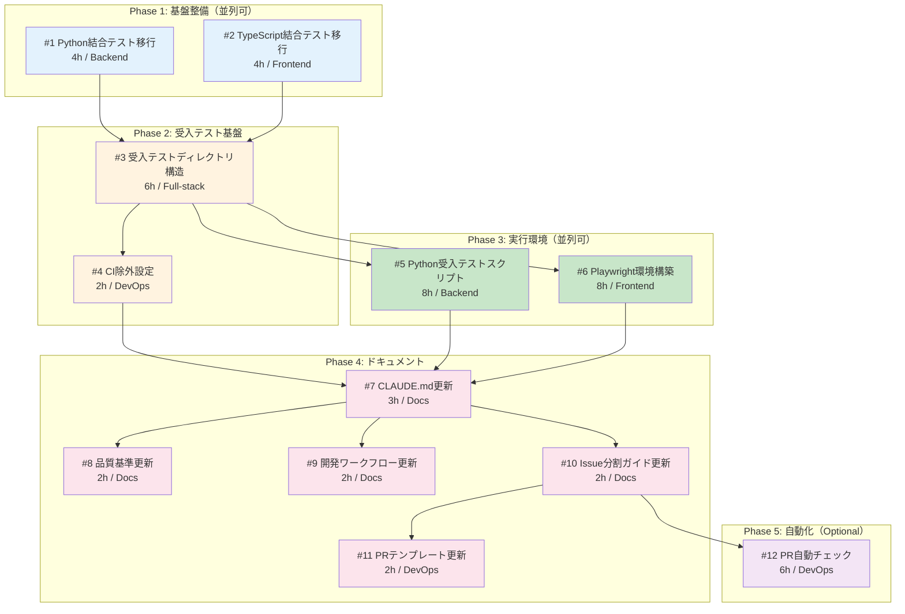

# Issue分割計画書: Feature #209 - 開発プロセス改善

**Feature番号**: #209
**タイトル**: 開発プロセス改善
**作成日**: 2025-12-03
**ステータス**: Issue分割完了

---

## 1. Feature概要

### 目的
- CIテストと受入テストの分離
- ローカル受入テスト環境の整備
- 単一レイヤー改修ルールの徹底

### スコープ
- テストディレクトリ構造の再編
- CI/CD設定の更新
- 受入テスト実行スクリプト
- 開発プロセスドキュメント更新

### 対象レイヤー
本Featureは**Docs層**を主対象とし、テスト構造の変更を行う。
（実際のサービスコードの変更は含まない）

---

## 2. Issue一覧

### Issue #1: Python結合テストのリポジトリ直下移行

**概要**: 各Pythonプロジェクト内の結合テストを`tests/integration/python/`に移行
**サイズ**: S
**優先度**: High
**作業見積**: 4時間
**担当候補**: Backend

**スコープ**:
- [ ] `tests/integration/python/` ディレクトリ構造作成
- [ ] `tests/integration/python/conftest.py` 共通フィクスチャ作成
- [ ] 既存結合テストの移行（expertAgent, jobqueue, myVault, myscheduler）
- [ ] pytest.ini / pyproject.toml 設定
- [ ] 移行元ディレクトリへのdeprecation警告追加

**技術スタック**:
- 言語/FW: Python/pytest
- ツール: httpx, pytest-asyncio

**受入基準 (Acceptance Criteria)**:

#### 🤖 自動検証可能な基準（pm-auto-devが実施）

**機能要件**:
- [ ] `tests/integration/python/` ディレクトリが存在する
- [ ] `tests/integration/python/conftest.py` が共通フィクスチャを提供する
- [ ] `uv run pytest tests/integration/python/ -v` が正常に実行される
- [ ] 既存の結合テストが全てパスする

**品質基準**:
- [ ] Ruff/MyPy エラーゼロ
- [ ] conftest.pyが設計方針書3.4の階層構造に従っている

**テストケース**:
- [ ] 正常系: Platform層結合テスト実行
- [ ] 正常系: Agent層結合テスト実行
- [ ] 異常系: サービス未起動時のスキップ動作

#### 👤 手動検証が必要な基準（ユーザーが実施）

**ビジネスロジック検証**:
- [ ] 移行前と同じテスト結果が得られる
- [ ] 既存CIワークフローが正常に動作する

**運用検証**:
- [ ] 開発者が迷わずテスト実行できる

#### ✅ 完了条件
- `/pm-auto-dev` 完了時点: 🤖 自動検証可能な基準 → 全て✅
- ユーザー動作確認後: 👤 手動検証が必要な基準 → 全て✅

---

### Issue #2: TypeScript結合テストのリポジトリ直下移行

**概要**: TypeScriptプロジェクトの結合テストを`tests/integration/typescript/`に移行
**サイズ**: S
**優先度**: High
**作業見積**: 4時間
**担当候補**: Frontend

**スコープ**:
- [ ] `tests/integration/typescript/` ディレクトリ構造作成
- [ ] `vitest.config.ts` 設定ファイル作成
- [ ] `package.json` 依存関係定義
- [ ] 既存結合テストの移行（graphAiServer, myAgentDesk）

**技術スタック**:
- 言語/FW: TypeScript/Vitest
- ツール: @testing-library/svelte

**受入基準 (Acceptance Criteria)**:

#### 🤖 自動検証可能な基準（pm-auto-devが実施）

**機能要件**:
- [ ] `tests/integration/typescript/` ディレクトリが存在する
- [ ] `npm test` が正常に実行される
- [ ] 既存の結合テストが全てパスする

**品質基準**:
- [ ] ESLint/TypeScript エラーゼロ
- [ ] vitest.config.tsが適切に設定されている

**テストケース**:
- [ ] 正常系: API結合テスト実行
- [ ] 異常系: サービス未起動時のスキップ動作

#### 👤 手動検証が必要な基準（ユーザーが実施）

**ビジネスロジック検証**:
- [ ] 移行前と同じテスト結果が得られる
- [ ] 既存CIワークフローが正常に動作する

#### ✅ 完了条件
- `/pm-auto-dev` 完了時点: 🤖 自動検証可能な基準 → 全て✅
- ユーザー動作確認後: 👤 手動検証が必要な基準 → 全て✅

---

### Issue #3: 受入テストディレクトリ構造作成

**概要**: `tests/acceptance/` ディレクトリ構造と共通フィクスチャを作成
**サイズ**: M
**優先度**: High
**作業見積**: 6時間
**担当候補**: Full-stack

**スコープ**:
- [ ] `tests/acceptance/python/` ディレクトリ構造作成
- [ ] `tests/acceptance/typescript/` ディレクトリ構造作成
- [ ] `tests/conftest.py` (L0レベル) 作成
- [ ] `tests/acceptance/python/conftest.py` (L1レベル) 作成
- [ ] `tests/fixtures/` 共通テストデータディレクトリ作成
- [ ] `tests/README.md` 作成（テスト実行場所ガイド）
- [ ] `.env.example` テンプレート作成

**技術スタック**:
- 言語/FW: Python/pytest, TypeScript/Playwright
- ツール: httpx, factory_boy

**受入基準 (Acceptance Criteria)**:

#### 🤖 自動検証可能な基準（pm-auto-devが実施）

**機能要件**:
- [ ] `tests/acceptance/python/` ディレクトリが存在する
- [ ] `tests/acceptance/typescript/` ディレクトリが存在する
- [ ] `tests/conftest.py` がL0共通フィクスチャを提供する
- [ ] `tests/README.md` が存在し、テスト場所クイックリファレンスを含む
- [ ] `.env.example` が存在し、必要な環境変数がドキュメント化されている

**品質基準**:
- [ ] conftest.py階層がdesign-policy.md 3.4に準拠
- [ ] Ruff/MyPy エラーゼロ

**テストケース**:
- [ ] 正常系: conftest.pyの共通フィクスチャがインポート可能
- [ ] 正常系: L0 → L1 → L2 の継承が機能する

#### 👤 手動検証が必要な基準（ユーザーが実施）

**UX/UI検証**:
- [ ] README.mdが分かりやすい
- [ ] 新規開発者がREADMEのみでテスト実行方法を理解できる

**運用検証**:
- [ ] ディレクトリ構造が設計方針書と一致している

#### ✅ 完了条件
- `/pm-auto-dev` 完了時点: 🤖 自動検証可能な基準 → 全て✅
- ユーザー動作確認後: 👤 手動検証が必要な基準 → 全て✅

---

### Issue #4: CI除外設定の追加

**概要**: `tests/acceptance/` をCIから除外する設定を追加
**サイズ**: S
**優先度**: High
**作業見積**: 2時間
**担当候補**: DevOps

**スコープ**:
- [ ] `.github/workflows/ci-feature.yml` 更新（除外パス追加）
- [ ] `pytest.ini` 更新（norecursedirs設定）
- [ ] CIワークフローのテストパス明示化

**技術スタック**:
- ツール: GitHub Actions, pytest

**受入基準 (Acceptance Criteria)**:

#### 🤖 自動検証可能な基準（pm-auto-devが実施）

**機能要件**:
- [ ] `ci-feature.yml` に `tests/acceptance/**` の除外設定が存在する
- [ ] `pytest.ini` に `norecursedirs = tests/acceptance` が設定されている
- [ ] CIで `tests/acceptance/` 配下のテストが実行されない

**品質基準**:
- [ ] 既存のCI単体テスト・結合テストが引き続き実行される
- [ ] YAMLシンタックスエラーなし

**テストケース**:
- [ ] 正常系: CI実行で `tests/acceptance/` が除外される
- [ ] 正常系: 既存テストが全てパスする

#### 👤 手動検証が必要な基準（ユーザーが実施）

**運用検証**:
- [ ] 実際のPRでCIが正常に動作する
- [ ] CI実行時間が短縮される（受入テスト除外による）

#### ✅ 完了条件
- `/pm-auto-dev` 完了時点: 🤖 自動検証可能な基準 → 全て✅
- ユーザー動作確認後: 👤 手動検証が必要な基準 → 全て✅

---

### Issue #5: Python受入テスト実行スクリプト作成

**概要**: レイヤー別のPython受入テスト実行スクリプトとMakeターゲットを作成
**サイズ**: M
**優先度**: High
**作業見積**: 8時間
**担当候補**: Backend

**スコープ**:
- [ ] `scripts/run-acceptance-tests.sh` 作成
- [ ] `Makefile` に受入テストターゲット追加
  - `acceptance-test-platform`
  - `acceptance-test-agent`
  - `acceptance-test-python`
  - `acceptance-test-all`
- [ ] 依存コンテナ自動起動機能
- [ ] ヘルスチェック待機機能
- [ ] テストレポート出力機能

**技術スタック**:
- 言語: Bash, Make
- ツール: Docker Compose, curl

**受入基準 (Acceptance Criteria)**:

#### 🤖 自動検証可能な基準（pm-auto-devが実施）

**機能要件**:
- [ ] `scripts/run-acceptance-tests.sh` が存在し、実行可能
- [ ] `make acceptance-test-platform` が正常に実行される
- [ ] `make acceptance-test-agent` が正常に実行される
- [ ] `make help` に受入テストコマンドが表示される
- [ ] 依存コンテナが自動起動される

**品質基準**:
- [ ] ShellCheck エラーゼロ
- [ ] スクリプトにヘルプオプション（-h, --help）が実装されている

**テストケース**:
- [ ] 正常系: Platform層のみテスト実行
- [ ] 正常系: Agent層のみテスト実行
- [ ] 正常系: 全層テスト実行
- [ ] 異常系: 依存コンテナ起動失敗時のエラーメッセージ

#### 👤 手動検証が必要な基準（ユーザーが実施）

**UX/UI検証**:
- [ ] コマンドの出力が分かりやすい
- [ ] エラーメッセージが原因と対策を示している

**運用検証**:
- [ ] 実際のローカル環境で正常動作する
- [ ] worktree環境でも正常動作する

#### ✅ 完了条件
- `/pm-auto-dev` 完了時点: 🤖 自動検証可能な基準 → 全て✅
- ユーザー動作確認後: 👤 手動検証が必要な基準 → 全て✅

---

### Issue #6: Playwright受入テスト環境構築

**概要**: TypeScript/Playwright による Frontend層受入テスト環境を構築
**サイズ**: M
**優先度**: Medium
**作業見積**: 8時間
**担当候補**: Frontend

**スコープ**:
- [ ] `tests/acceptance/typescript/playwright.config.ts` 作成
- [ ] `tests/acceptance/typescript/package.json` 作成
- [ ] スモークテスト作成（`smoke.spec.ts`）
- [ ] `Makefile` に `acceptance-test-frontend` ターゲット追加
- [ ] Playwright インストールスクリプト

**技術スタック**:
- 言語/FW: TypeScript/Playwright
- ツール: npm, npx

**受入基準 (Acceptance Criteria)**:

#### 🤖 自動検証可能な基準（pm-auto-devが実施）

**機能要件**:
- [ ] `playwright.config.ts` が存在し、適切に設定されている
- [ ] `npm install` が正常に完了する
- [ ] `npx playwright test` が正常に実行される
- [ ] スモークテストがパスする
- [ ] `make acceptance-test-frontend` が正常に実行される

**品質基準**:
- [ ] ESLint/TypeScript エラーゼロ
- [ ] playwright.config.tsにタイムアウト設定がある

**テストケース**:
- [ ] 正常系: myAgentDeskのスモークテスト
- [ ] 正常系: ページタイトル検証
- [ ] 異常系: サービス未起動時のエラーメッセージ

#### 👤 手動検証が必要な基準（ユーザーが実施）

**UX/UI検証**:
- [ ] テスト結果レポートが見やすい
- [ ] スクリーンショットが適切に保存される

**運用検証**:
- [ ] 実際のUI操作がテストできる
- [ ] ヘッドレスモードとヘッドモードの切り替えが可能

#### ✅ 完了条件
- `/pm-auto-dev` 完了時点: 🤖 自動検証可能な基準 → 全て✅
- ユーザー動作確認後: 👤 手動検証が必要な基準 → 全て✅

---

### Issue #7: CLAUDE.md 開発プロセス更新

**概要**: CLAUDE.mdにテスト構造と受入テスト実行方法を追加
**サイズ**: S
**優先度**: High
**作業見積**: 3時間
**担当候補**: Docs

**スコープ**:
- [ ] 「テスト構造」セクション追加
- [ ] テストの種類と実行場所の表追加
- [ ] 受入テスト実行方法のコマンド例追加
- [ ] 開発時チェックリストの更新

**技術スタック**:
- フォーマット: Markdown

**受入基準 (Acceptance Criteria)**:

#### 🤖 自動検証可能な基準（pm-auto-devが実施）

**機能要件**:
- [ ] CLAUDE.mdに「テスト構造」セクションが存在する
- [ ] テストの種類と実行場所の表が含まれている
- [ ] `make acceptance-test-*` コマンド例が記載されている
- [ ] Markdownシンタックスエラーがない

**品質基準**:
- [ ] リンクが全て有効
- [ ] コードブロックの言語指定が正しい

**テストケース**:
- [ ] 正常系: Markdownレンダリングが正常

#### 👤 手動検証が必要な基準（ユーザーが実施）

**UX/UI検証**:
- [ ] ドキュメントが分かりやすい
- [ ] 新規開発者がCLAUDE.mdのみでテスト方法を理解できる

#### ✅ 完了条件
- `/pm-auto-dev` 完了時点: 🤖 自動検証可能な基準 → 全て✅
- ユーザー動作確認後: 👤 手動検証が必要な基準 → 全て✅

---

### Issue #8: 品質基準ドキュメント更新

**概要**: docs/claude/04-quality-standards.md にテスト階層と受入テストスキップ条件を追加
**サイズ**: S
**優先度**: Medium
**作業見積**: 2時間
**担当候補**: Docs

**スコープ**:
- [ ] 「テスト方針（更新）」セクション追加
- [ ] テスト階層表（Level 1-4）追加
- [ ] 受入テストのスキップ条件追加
- [ ] PO受入テストが必要なPRの判定基準追加

**技術スタック**:
- フォーマット: Markdown

**受入基準 (Acceptance Criteria)**:

#### 🤖 自動検証可能な基準（pm-auto-devが実施）

**機能要件**:
- [ ] 「テスト方針」セクションが更新されている
- [ ] テスト階層表が含まれている
- [ ] スキップ条件ラベル（docs-only, internal, test-only）が記載されている
- [ ] Markdownシンタックスエラーがない

**品質基準**:
- [ ] 既存のセクションとの整合性が取れている

#### 👤 手動検証が必要な基準（ユーザーが実施）

**ビジネスロジック検証**:
- [ ] テスト階層が要件定義書と一致している
- [ ] スキップ条件が運用に適している

#### ✅ 完了条件
- `/pm-auto-dev` 完了時点: 🤖 自動検証可能な基準 → 全て✅
- ユーザー動作確認後: 👤 手動検証が必要な基準 → 全て✅

---

### Issue #9: 開発ワークフロードキュメント更新

**概要**: docs/claude/01-development-workflow.md に受入テストフローを追加
**サイズ**: S
**優先度**: Medium
**作業見積**: 2時間
**担当候補**: Docs

**スコープ**:
- [ ] Issue種別ごとのテストフロー図追加
- [ ] 通常Issue vs 重要Issue のフロー説明
- [ ] Feature完了時のPO最終受入テストフロー追加

**技術スタック**:
- フォーマット: Markdown, Mermaid

**受入基準 (Acceptance Criteria)**:

#### 🤖 自動検証可能な基準（pm-auto-devが実施）

**機能要件**:
- [ ] テストフロー図（Mermaid）が含まれている
- [ ] 通常Issueと重要Issueの区別が記載されている
- [ ] Markdownシンタックスエラーがない

**品質基準**:
- [ ] Mermaidダイアグラムがレンダリングされる

#### 👤 手動検証が必要な基準（ユーザーが実施）

**ビジネスロジック検証**:
- [ ] フローが要件定義書のPO受入テスト方針と一致している

#### ✅ 完了条件
- `/pm-auto-dev` 完了時点: 🤖 自動検証可能な基準 → 全て✅
- ユーザー動作確認後: 👤 手動検証が必要な基準 → 全て✅

---

### Issue #10: Issue分割ガイド更新（レイヤールール）

**概要**: docs/claude/08-issue-split.md に単一レイヤー改修ルールを追加
**サイズ**: S
**優先度**: High
**作業見積**: 2時間
**担当候補**: Docs

**スコープ**:
- [ ] 「単一レイヤー改修ルール」セクション追加
- [ ] レイヤー定義表追加（Platform/Agent/Frontend/Docs）
- [ ] レイヤー跨ぎの例外処理手順追加
- [ ] cross-layerラベルの使用方法追加

**技術スタック**:
- フォーマット: Markdown

**受入基準 (Acceptance Criteria)**:

#### 🤖 自動検証可能な基準（pm-auto-devが実施）

**機能要件**:
- [ ] 「単一レイヤー改修ルール」セクションが存在する
- [ ] レイヤー定義表が含まれている
- [ ] 例外処理手順が記載されている
- [ ] Markdownシンタックスエラーがない

**品質基準**:
- [ ] 既存のIssue分割ガイドとの整合性

#### 👤 手動検証が必要な基準（ユーザーが実施）

**ビジネスロジック検証**:
- [ ] ルールが実際の開発プロセスに適用可能
- [ ] 例外処理が現実的

#### ✅ 完了条件
- `/pm-auto-dev` 完了時点: 🤖 自動検証可能な基準 → 全て✅
- ユーザー動作確認後: 👤 手動検証が必要な基準 → 全て✅

---

### Issue #11: PRテンプレート更新

**概要**: .github/PULL_REQUEST_TEMPLATE.md に受入テストチェックリストを追加
**サイズ**: S
**優先度**: Medium
**作業見積**: 2時間
**担当候補**: DevOps

**スコープ**:
- [ ] 「テスト確認」セクション追加
- [ ] CI自動テストチェックボックス追加
- [ ] 開発者受入テストチェックボックス追加
- [ ] PO受入テスト（該当する場合）チェックボックス追加

**技術スタック**:
- フォーマット: Markdown

**受入基準 (Acceptance Criteria)**:

#### 🤖 自動検証可能な基準（pm-auto-devが実施）

**機能要件**:
- [ ] 「テスト確認」セクションが存在する
- [ ] 3種類のチェックボックス（CI、開発者受入、PO受入）が含まれている
- [ ] Markdownシンタックスエラーがない

**品質基準**:
- [ ] 既存のPRテンプレートとの整合性

#### 👤 手動検証が必要な基準（ユーザーが実施）

**UX/UI検証**:
- [ ] PR作成時にテンプレートが正しく表示される
- [ ] チェックリストが分かりやすい

#### ✅ 完了条件
- `/pm-auto-dev` 完了時点: 🤖 自動検証可能な基準 → 全て✅
- ユーザー動作確認後: 👤 手動検証が必要な基準 → 全て✅

---

### Issue #12: PR自動チェック機能（Optional）

**概要**: 複数レイヤー変更を検出して警告するGitHub Actions追加
**サイズ**: M
**優先度**: Low
**作業見積**: 6時間
**担当候補**: DevOps

**スコープ**:
- [ ] `.github/workflows/pr-layer-check.yml` 作成
- [ ] 変更ファイルからレイヤーを検出するロジック
- [ ] 複数レイヤー検出時のPRコメント警告
- [ ] `cross-layer` ラベル自動付与

**技術スタック**:
- ツール: GitHub Actions, Bash

**受入基準 (Acceptance Criteria)**:

#### 🤖 自動検証可能な基準（pm-auto-devが実施）

**機能要件**:
- [ ] ワークフローファイルが存在する
- [ ] 単一レイヤー変更PRで警告が出ない
- [ ] 複数レイヤー変更PRで警告コメントが出る
- [ ] `cross-layer` ラベルが自動付与される

**品質基準**:
- [ ] YAMLシンタックスエラーなし
- [ ] ワークフロー実行時間が1分以内

**テストケース**:
- [ ] 正常系: Platform層のみ変更 → 警告なし
- [ ] 正常系: Platform + Agent変更 → 警告あり
- [ ] 正常系: Docs層のみ変更 → 警告なし

#### 👤 手動検証が必要な基準（ユーザーが実施）

**運用検証**:
- [ ] 実際のPRで正しく動作する
- [ ] 警告メッセージが分かりやすい

#### ✅ 完了条件
- `/pm-auto-dev` 完了時点: 🤖 自動検証可能な基準 → 全て✅
- ユーザー動作確認後: 👤 手動検証が必要な基準 → 全て✅

---

## 3. Phase毎のイシュー管理

### Phase 1: ディレクトリ構造・基盤整備（並列実行可能）

| Issue | タイトル | 依存 | 担当 | 見積 |
|-------|---------|------|------|------|
| #1 | Python結合テストのリポジトリ直下移行 | なし | Backend | 4h |
| #2 | TypeScript結合テストのリポジトリ直下移行 | なし | Frontend | 4h |

**Phase 1 完了条件**:
- [ ] `tests/integration/python/` ディレクトリ作成完了
- [ ] `tests/integration/typescript/` ディレクトリ作成完了
- [ ] 既存結合テストの移行完了

### Phase 2: 受入テスト基盤構築（Phase 1完了後）

| Issue | タイトル | 依存 | 担当 | 見積 |
|-------|---------|------|------|------|
| #3 | 受入テストディレクトリ構造作成 | #1, #2 | Full-stack | 6h |
| #4 | CI除外設定の追加 | #3 | DevOps | 2h |

**Phase 2 完了条件**:
- [ ] `tests/acceptance/` ディレクトリ構造完成
- [ ] `tests/README.md` 作成完了
- [ ] CI除外設定完了

### Phase 3: テスト実行環境整備（Phase 2完了後、並列可）

| Issue | タイトル | 依存 | 担当 | 見積 |
|-------|---------|------|------|------|
| #5 | Python受入テスト実行スクリプト作成 | #3 | Backend | 8h |
| #6 | Playwright受入テスト環境構築 | #3 | Frontend | 8h |

**Phase 3 完了条件**:
- [ ] `make acceptance-test-platform` 動作確認
- [ ] `make acceptance-test-agent` 動作確認
- [ ] `make acceptance-test-frontend` 動作確認

### Phase 4: ドキュメント更新（Phase 3完了後）

| Issue | タイトル | 依存 | 担当 | 見積 |
|-------|---------|------|------|------|
| #7 | CLAUDE.md 開発プロセス更新 | #4, #5, #6 | Docs | 3h |
| #8 | 品質基準ドキュメント更新 | #7 | Docs | 2h |
| #9 | 開発ワークフロードキュメント更新 | #7 | Docs | 2h |
| #10 | Issue分割ガイド更新 | #7 | Docs | 2h |
| #11 | PRテンプレート更新 | #10 | DevOps | 2h |

**Phase 4 完了条件**:
- [ ] 全ドキュメント更新完了
- [ ] 新規開発者向けガイドとして使用可能

### Phase 5: 自動化・運用（Optional、Phase 4完了後）

| Issue | タイトル | 依存 | 担当 | 見積 |
|-------|---------|------|------|------|
| #12 | PR自動チェック機能 | #10 | DevOps | 6h |

**Phase 5 完了条件**:
- [ ] 複数レイヤー変更の自動検出が機能
- [ ] 警告メッセージが適切に表示

---

## 4. 依存関係グラフ

---

## 5. 並列実行可能性マトリクス

| Phase | 並列実行可能なIssue | 理由 |
|-------|-------------------|------|
| Phase 1 | #1, #2 | 異なる言語（Python/TypeScript）で相互依存なし |
| Phase 3 | #5, #6 | 異なる言語・ツール（Bash/Playwright）で相互依存なし |
| Phase 4 | #8, #9, #10 | #7完了後、異なるドキュメントで並列可 |

### 依存関係マトリクス（詳細版）

| Issue | 依存先 | 並列実行可能 | ブロッカー |
|-------|--------|-------------|------------|
| #1 | なし | Yes | なし |
| #2 | なし | Yes（#1と並列可） | なし |
| #3 | #1, #2 | No | #1, #2の完了待ち |
| #4 | #3 | No | #3の完了待ち |
| #5 | #3 | Yes（#6と並列可） | #3の完了待ち |
| #6 | #3 | Yes（#5と並列可） | #3の完了待ち |
| #7 | #4, #5, #6 | No | #4, #5, #6の完了待ち |
| #8 | #7 | Yes（#9, #10と並列可） | #7の完了待ち |
| #9 | #7 | Yes（#8, #10と並列可） | #7の完了待ち |
| #10 | #7 | Yes（#8, #9と並列可） | #7の完了待ち |
| #11 | #10 | No | #10の完了待ち |
| #12 | #10 | Yes（#11と並列可） | #10の完了待ち |

---

## 6. マイルストーン計画

### Milestone 1: テスト基盤構築（Week 1）
- Phase 1: ディレクトリ構造・基盤整備（並列実行）
- Phase 2: 受入テスト基盤構築

**完了条件**:
- [ ] `tests/integration/` ディレクトリ完成
- [ ] `tests/acceptance/` ディレクトリ完成
- [ ] CI除外設定完了

**作業見積合計**: 16時間（2人日）

### Milestone 2: 実行環境整備（Week 2）
- Phase 3: テスト実行環境整備（並列実行可能）

**完了条件**:
- [ ] `make acceptance-test-*` コマンドが全て動作
- [ ] Playwright環境構築完了

**作業見積合計**: 16時間（2人日）

### Milestone 3: ドキュメント・運用（Week 3）
- Phase 4: ドキュメント更新
- Phase 5: 自動化・運用（Optional）

**完了条件**:
- [ ] 全ドキュメント更新完了
- [ ] PRテンプレート更新完了
- [ ] （Optional）PR自動チェック機能

**作業見積合計**: 17時間（約2人日）

---

## 7. リソース配分

| 役割 | 必要人数 | スキル要件 | 担当Issue |
|------|---------|-----------|-----------|
| Backend | 1名 | Python/pytest/Bash | #1, #5 |
| Frontend | 1名 | TypeScript/Vitest/Playwright | #2, #6 |
| Full-stack | 1名 | Python/TypeScript | #3 |
| DevOps | 1名 | GitHub Actions/Make | #4, #11, #12 |
| Docs | 1名 | Markdown/Mermaid | #7, #8, #9, #10 |

**推奨チーム構成**: 2-3名（Backend兼Full-stack、Frontend、DevOps兼Docs）

---

## 8. リスク評価

| Issue | リスク | 影響度 | 発生確率 | 対策 |
|-------|-------|-------|---------|------|
| #1, #2 | 既存テストの移行漏れ | 中 | 中 | 移行前後のテスト数比較 |
| #3 | conftest.py設計ミス | 高 | 低 | 設計方針書3.4に厳密に従う |
| #4 | CI既存機能への影響 | 高 | 低 | 段階的なCI設定変更、ドライラン |
| #5 | コンテナ起動タイミング問題 | 中 | 中 | ヘルスチェック＋リトライ |
| #6 | Playwright学習コスト | 中 | 中 | スモークテストから段階的導入 |
| #7-#10 | ドキュメント整合性 | 低 | 中 | 相互レビュー、リンクチェック |
| #12 | 誤検知による開発者ストレス | 中 | 中 | 明確な例外処理ルール |

---

## 9. 分割判断チェックリスト

各Issueについて確認済み:
- [x] 独立してデプロイ可能か
- [x] 1-3日で完了可能か
- [x] 明確な完了条件があるか（受入基準が2層構造で定義されているか）
- [x] テストが定義できるか
- [x] 他Issueへの影響が最小か
- [x] Phase間の依存関係が明確か
- [x] 並列実行可能なIssueが識別されているか

---

## 10. 総作業見積

| Phase | Issue数 | 合計見積 | 並列度 | 実質日数 |
|-------|--------|---------|--------|---------|
| Phase 1 | 2 | 8h | 2 | 0.5日 |
| Phase 2 | 2 | 8h | 1 | 1日 |
| Phase 3 | 2 | 16h | 2 | 1日 |
| Phase 4 | 5 | 11h | 3 | 0.5日 |
| Phase 5 | 1 | 6h | 1 | 0.75日 |
| **合計** | **12** | **49h** | - | **約3.75日** |

※ Phase 5（Optional）を除くと **43h / 約3日**

---

## 11. 次のステップ

1. **Issue作成**: `/issue-create 209` でGitHub Issueを一括作成
2. **作業計画**: 各Issueに対して `/work-plan {Issue番号}` で詳細計画立案
3. **実装開始**: Phase 1から順次 `/pm-auto-dev {Issue番号}` で実装

---

**作成日**: 2025-12-03
**作成者**: Claude Code
**ステータス**: Issue作成完了

---

## 🔗 作成されたGitHub Issue

### 親Issue
- #209: 開発プロセス改善
  - URL: https://github.com/Kewton/MySwiftAgent/issues/209

### 子Issue

#### Phase 1: ディレクトリ構造・基盤整備
- #211: Issue #209-1: Python結合テストのリポジトリ直下移行
  - URL: https://github.com/Kewton/MySwiftAgent/issues/211
  - サイズ: S、優先度: High
- #212: Issue #209-2: TypeScript結合テストのリポジトリ直下移行
  - URL: https://github.com/Kewton/MySwiftAgent/issues/212
  - サイズ: S、優先度: High

#### Phase 2: 受入テスト基盤構築
- #213: Issue #209-3: 受入テストディレクトリ構造作成
  - URL: https://github.com/Kewton/MySwiftAgent/issues/213
  - サイズ: M、優先度: High
- #214: Issue #209-4: CI除外設定の追加
  - URL: https://github.com/Kewton/MySwiftAgent/issues/214
  - サイズ: S、優先度: High

#### Phase 3: テスト実行環境整備
- #215: Issue #209-5: Python受入テスト実行スクリプト作成
  - URL: https://github.com/Kewton/MySwiftAgent/issues/215
  - サイズ: M、優先度: High
- #216: Issue #209-6: Playwright受入テスト環境構築
  - URL: https://github.com/Kewton/MySwiftAgent/issues/216
  - サイズ: M、優先度: Medium

#### Phase 4: ドキュメント更新
- #217: Issue #209-7: CLAUDE.md 開発プロセス更新
  - URL: https://github.com/Kewton/MySwiftAgent/issues/217
  - サイズ: S、優先度: High
- #218: Issue #209-8: 品質基準ドキュメント更新
  - URL: https://github.com/Kewton/MySwiftAgent/issues/218
  - サイズ: S、優先度: Medium
- #219: Issue #209-9: 開発ワークフロードキュメント更新
  - URL: https://github.com/Kewton/MySwiftAgent/issues/219
  - サイズ: S、優先度: Medium
- #220: Issue #209-10: Issue分割ガイド更新（レイヤールール）
  - URL: https://github.com/Kewton/MySwiftAgent/issues/220
  - サイズ: S、優先度: High
- #221: Issue #209-11: PRテンプレート更新
  - URL: https://github.com/Kewton/MySwiftAgent/issues/221
  - サイズ: S、優先度: Medium

#### Phase 5: 自動化・運用（Optional）
- #222: Issue #209-12: PR自動チェック機能（Optional）
  - URL: https://github.com/Kewton/MySwiftAgent/issues/222
  - サイズ: M、優先度: Low

### 作成日時
2025-12-03

### 作成者
Claude Code
