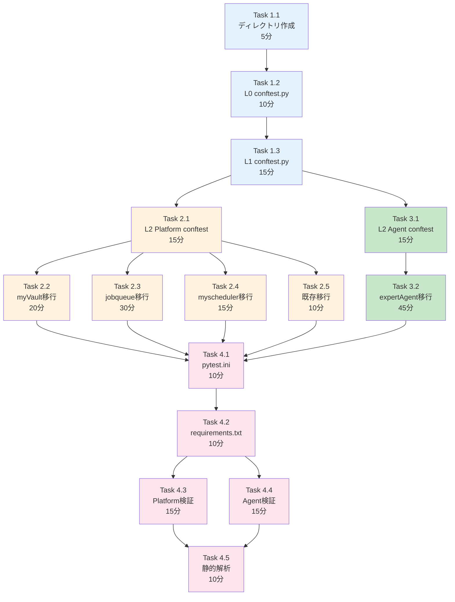

# 作業計画書: Issue #211 - Python結合テストのリポジトリ直下移行

## Issue: Python結合テストのリポジトリ直下移行

**Issue番号**: #211
**親Issue**: #209 (開発プロセス改善)
**サイズ**: S (4時間)
**作業見積**: 4時間
**優先度**: High
**依存Issue**: なし（即座に着手可能）
**ブロック対象**: #213 (受入テストディレクトリ構造作成)

---

## 1. 現状分析

### 1.1 移行対象ファイル

| プロジェクト | ファイル数 | 移行先 |
|------------|----------|--------|
| expertAgent | 25 | `tests/integration/python/agent/` |
| jobqueue | 9 | `tests/integration/python/platform/` |
| myVault | 4 | `tests/integration/python/platform/` |
| myscheduler | 2 | `tests/integration/python/platform/` |
| tests/integration | 4 | `tests/integration/python/platform/` (既存維持) |
| **合計** | **44** | - |

### 1.2 移行先ディレクトリ構造

```
tests/
├── conftest.py                          # [L0] 全テスト共通
├── integration/
│   └── python/
│       ├── conftest.py                  # [L1] Python結合テスト共通
│       ├── pytest.ini                   # pytest設定
│       ├── requirements.txt             # テスト依存関係
│       │
│       ├── platform/                    # Platform層結合テスト
│       │   ├── conftest.py              # [L2] Platform層固有
│       │   ├── test_myvault_*.py
│       │   ├── test_jobqueue_*.py
│       │   └── test_myscheduler_*.py
│       │
│       └── agent/                       # Agent層結合テスト
│           ├── conftest.py              # [L2] Agent層固有
│           └── test_expertagent_*.py
```

---

## 2. 詳細タスク分解

### Phase 1: ディレクトリ構造作成（30分）

- [ ] **Task 1.1**: ディレクトリ作成
  - 所要時間: 5分
  - 成果物: `tests/integration/python/{platform,agent}/`
  - 依存: なし

- [ ] **Task 1.2**: L0 conftest.py作成
  - 所要時間: 10分
  - 成果物: `tests/conftest.py`
  - 依存: Task 1.1
  - 内容: カスタムマーカー定義、project_rootフィクスチャ

- [ ] **Task 1.3**: L1 conftest.py作成
  - 所要時間: 15分
  - 成果物: `tests/integration/python/conftest.py`
  - 依存: Task 1.2
  - 内容: service_urls, docker_compose_up, async_client フィクスチャ

### Phase 2: Platform層テスト移行（1時間30分）

- [ ] **Task 2.1**: L2 Platform conftest.py作成
  - 所要時間: 15分
  - 成果物: `tests/integration/python/platform/conftest.py`
  - 依存: Task 1.3
  - 内容: myvault_client, jobqueue_client フィクスチャ

- [ ] **Task 2.2**: myVault結合テスト移行
  - 所要時間: 20分
  - 成果物: `tests/integration/python/platform/test_myvault_*.py` (4ファイル)
  - 依存: Task 2.1
  - 作業: ファイル移動、importパス修正

- [ ] **Task 2.3**: jobqueue結合テスト移行
  - 所要時間: 30分
  - 成果物: `tests/integration/python/platform/test_jobqueue_*.py` (9ファイル)
  - 依存: Task 2.1
  - 作業: ファイル移動、importパス修正

- [ ] **Task 2.4**: myscheduler結合テスト移行
  - 所要時間: 15分
  - 成果物: `tests/integration/python/platform/test_myscheduler_*.py` (2ファイル)
  - 依存: Task 2.1
  - 作業: ファイル移動、importパス修正

- [ ] **Task 2.5**: 既存tests/integration移行
  - 所要時間: 10分
  - 成果物: `tests/integration/python/platform/test_issue_*.py` (4ファイル)
  - 依存: Task 2.1
  - 作業: ファイル移動

### Phase 3: Agent層テスト移行（1時間）

- [ ] **Task 3.1**: L2 Agent conftest.py作成
  - 所要時間: 15分
  - 成果物: `tests/integration/python/agent/conftest.py`
  - 依存: Task 1.3
  - 内容: expertagent_client, mock_myvault フィクスチャ

- [ ] **Task 3.2**: expertAgent結合テスト移行
  - 所要時間: 45分
  - 成果物: `tests/integration/python/agent/test_*.py` (25ファイル)
  - 依存: Task 3.1
  - 作業: ファイル移動、importパス修正、既存conftest.py統合

### Phase 4: 設定・検証（1時間）

- [ ] **Task 4.1**: pytest.ini作成
  - 所要時間: 10分
  - 成果物: `tests/integration/python/pytest.ini`
  - 依存: Phase 2, 3完了
  - 内容: testpaths, norecursedirs, markers設定

- [ ] **Task 4.2**: requirements.txt作成
  - 所要時間: 10分
  - 成果物: `tests/integration/python/requirements.txt`
  - 依存: なし
  - 内容: pytest, httpx, pytest-asyncio等

- [ ] **Task 4.3**: Platform層テスト実行検証
  - 所要時間: 15分
  - 作業: `uv run pytest tests/integration/python/platform/ -v`
  - 依存: Task 4.1, 4.2

- [ ] **Task 4.4**: Agent層テスト実行検証
  - 所要時間: 15分
  - 作業: `uv run pytest tests/integration/python/agent/ -v`
  - 依存: Task 4.1, 4.2

- [ ] **Task 4.5**: 静的解析（Ruff/MyPy）
  - 所要時間: 10分
  - 作業: `uv run ruff check tests/ && uv run mypy tests/`
  - 依存: Task 4.3, 4.4

---

## 3. タスク依存関係



---

## 4. 作業スケジュール

### セッション1（2時間）

| 時間 | タスク | 成果物 |
|------|--------|--------|
| 0:00-0:05 | Task 1.1 ディレクトリ作成 | ディレクトリ構造 |
| 0:05-0:15 | Task 1.2 L0 conftest.py | `tests/conftest.py` |
| 0:15-0:30 | Task 1.3 L1 conftest.py | `tests/integration/python/conftest.py` |
| 0:30-0:45 | Task 2.1 L2 Platform conftest | `tests/integration/python/platform/conftest.py` |
| 0:45-1:05 | Task 2.2 myVault移行 | 4ファイル移行完了 |
| 1:05-1:35 | Task 2.3 jobqueue移行 | 9ファイル移行完了 |
| 1:35-1:50 | Task 2.4 myscheduler移行 | 2ファイル移行完了 |
| 1:50-2:00 | Task 2.5 既存移行 | 4ファイル移行完了 |

### セッション2（2時間）

| 時間 | タスク | 成果物 |
|------|--------|--------|
| 0:00-0:15 | Task 3.1 L2 Agent conftest | `tests/integration/python/agent/conftest.py` |
| 0:15-1:00 | Task 3.2 expertAgent移行 | 25ファイル移行完了 |
| 1:00-1:10 | Task 4.1 pytest.ini | `tests/integration/python/pytest.ini` |
| 1:10-1:20 | Task 4.2 requirements.txt | `tests/integration/python/requirements.txt` |
| 1:20-1:35 | Task 4.3 Platform検証 | テスト実行成功 |
| 1:35-1:50 | Task 4.4 Agent検証 | テスト実行成功 |
| 1:50-2:00 | Task 4.5 静的解析 | Ruff/MyPyパス |

**総作業時間**: 4時間

---

## 5. チェックポイント

| タイミング | 確認事項 | 対応 |
|-----------|---------|------|
| Phase 1完了時 | conftest.pyが正しく継承される | pytestの--collect-onlyで確認 |
| Phase 2完了時 | Platform層テストがimportエラーなし | pytest --collect-only |
| Phase 3完了時 | Agent層テストがimportエラーなし | pytest --collect-only |
| Phase 4完了時 | 全テストがパス | pytest -v実行 |

---

## 6. リスクと対策

| リスク | 発生確率 | 影響 | 対策 |
|-------|---------|------|------|
| importパス修正漏れ | 高 | テスト失敗 | 移行後即座にcollect-only実行 |
| conftest.py競合 | 中 | フィクスチャ重複 | L0/L1/L2階層厳守、既存統合 |
| CI既存動作への影響 | 中 | CIパイプライン失敗 | 移行元にdeprecation警告追加 |
| 既存expertAgent conftest.pyの複雑さ | 中 | 統合困難 | 必要なフィクスチャのみ抽出 |

---

## 7. 成果物チェックリスト

### ディレクトリ・ファイル
- [ ] `tests/conftest.py` (L0)
- [ ] `tests/integration/python/conftest.py` (L1)
- [ ] `tests/integration/python/pytest.ini`
- [ ] `tests/integration/python/requirements.txt`
- [ ] `tests/integration/python/platform/conftest.py` (L2)
- [ ] `tests/integration/python/platform/test_myvault_*.py` (4ファイル)
- [ ] `tests/integration/python/platform/test_jobqueue_*.py` (9ファイル)
- [ ] `tests/integration/python/platform/test_myscheduler_*.py` (2ファイル)
- [ ] `tests/integration/python/platform/test_issue_*.py` (4ファイル)
- [ ] `tests/integration/python/agent/conftest.py` (L2)
- [ ] `tests/integration/python/agent/test_*.py` (25ファイル)

### 移行元への対応
- [ ] 移行元ディレクトリへのdeprecation警告追加

---

## 8. Definition of Done

### 🤖 自動検証可能な基準

**機能要件**:
- [ ] `tests/integration/python/` ディレクトリが存在する
- [ ] `tests/integration/python/conftest.py` が共通フィクスチャを提供する
- [ ] `uv run pytest tests/integration/python/ -v` が正常に実行される
- [ ] 既存の結合テストが全てパスする

**品質基準**:
- [ ] Ruff/MyPy エラーゼロ
- [ ] conftest.pyが設計方針書3.4の階層構造に従っている

**テストケース**:
- [ ] 正常系: Platform層結合テスト実行
- [ ] 正常系: Agent層結合テスト実行
- [ ] 異常系: サービス未起動時のスキップ動作

### 👤 手動検証が必要な基準

**ビジネスロジック検証**:
- [ ] 移行前と同じテスト結果が得られる
- [ ] 既存CIワークフローが正常に動作する

**運用検証**:
- [ ] 開発者が迷わずテスト実行できる

---

## 9. 次のアクション

作業計画承認後：
1. **ブランチ作成**: `feature/issue/211`
2. **worktree作成**: `./scripts/worktree-create-from-issue.sh 211`
3. **タスク実行**: Phase 1から順次実行
4. **進捗報告**: 各Phase完了時に `/progress-report`

---

## 10. 参照ドキュメント

- [設計方針書](./design-policy.md) - `dev-reports/feature/issue/209/design-policy.md`
- [Issue分割計画書](../issue/209/issue-split.md)
- [品質基準](../../docs/claude/04-quality-standards.md)

---

**作成日**: 2025-12-03
**作成者**: Claude Code
**ステータス**: 承認待ち
