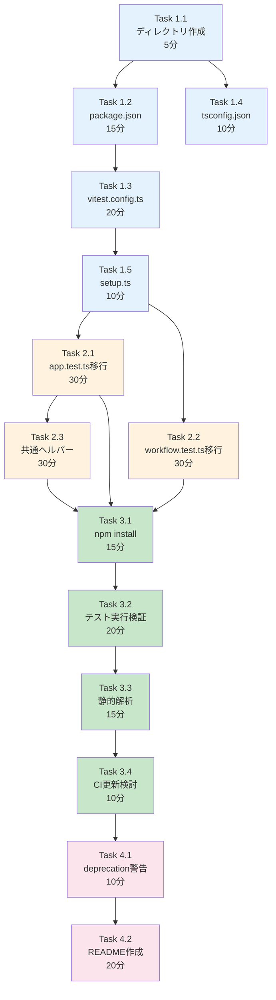

# 作業計画書: Issue #212 - TypeScript結合テストのリポジトリ直下移行

## Issue: TypeScript結合テストのリポジトリ直下移行

**Issue番号**: #212
**親Issue**: #209 (開発プロセス改善)
**サイズ**: S (4時間)
**作業見積**: 4時間
**優先度**: High
**依存Issue**: なし（即座に着手可能）
**ブロック対象**: #213 (受入テストディレクトリ構造作成)

---

## 1. 現状分析

### 1.1 既存TypeScriptテスト構成

| プロジェクト | テスト種別 | フレームワーク | ファイル数 | 対象 |
|------------|----------|--------------|----------|------|
| graphAiServer | 結合テスト | Jest/supertest | 2 | **Issue #212** |
| myAgentDesk | 単体テスト | Vitest | 16 | プロジェクト内維持 |
| myAgentDesk | E2Eテスト | Playwright | 4 | **Issue #216** |

### 1.2 移行対象ファイル

```
graphAiServer/tests/integration/
├── app.test.ts      → tests/integration/typescript/api/graphaiserver-api.test.ts
└── workflow.test.ts → tests/integration/typescript/api/graphaiserver-workflow.test.ts
```

### 1.3 移行先ディレクトリ構造

```
tests/
└── integration/
    └── typescript/
        ├── vitest.config.ts     # Vitest設定
        ├── package.json         # npm依存関係
        ├── tsconfig.json        # TypeScript設定
        │
        └── api/                 # API結合テスト
            ├── graphaiserver-api.test.ts
            └── graphaiserver-workflow.test.ts
```

### 1.4 技術選定の変更

| 項目 | 現状（graphAiServer） | 移行後 | 理由 |
|------|---------------------|--------|------|
| テストフレームワーク | Jest | Vitest | 設計方針書2.2準拠、ESM対応 |
| HTTPクライアント | supertest | supertest (維持) | Express統合良好 |
| モジュール形式 | ESM | ESM | 既存維持 |

---

## 2. 詳細タスク分解

### Phase 1: ディレクトリ・設定ファイル作成（1時間）

- [ ] **Task 1.1**: ディレクトリ作成
  - 所要時間: 5分
  - 成果物: `tests/integration/typescript/api/`
  - 依存: なし

- [ ] **Task 1.2**: package.json作成
  - 所要時間: 15分
  - 成果物: `tests/integration/typescript/package.json`
  - 依存: Task 1.1
  - 内容: vitest, supertest, typescript依存関係

- [ ] **Task 1.3**: vitest.config.ts作成
  - 所要時間: 20分
  - 成果物: `tests/integration/typescript/vitest.config.ts`
  - 依存: Task 1.2
  - 内容: ESM対応、タイムアウト設定、グローバル設定

- [ ] **Task 1.4**: tsconfig.json作成
  - 所要時間: 10分
  - 成果物: `tests/integration/typescript/tsconfig.json`
  - 依存: Task 1.1
  - 内容: ESM対応、paths設定

- [ ] **Task 1.5**: セットアップファイル作成
  - 所要時間: 10分
  - 成果物: `tests/integration/typescript/setup.ts`
  - 依存: Task 1.3
  - 内容: グローバルセットアップ、環境変数読み込み

### Phase 2: テストファイル移行・変換（1時間30分）

- [ ] **Task 2.1**: graphAiServer app.test.ts移行
  - 所要時間: 30分
  - 成果物: `tests/integration/typescript/api/graphaiserver-api.test.ts`
  - 依存: Phase 1完了
  - 作業: Jest → Vitest構文変換、importパス修正

- [ ] **Task 2.2**: graphAiServer workflow.test.ts移行
  - 所要時間: 30分
  - 成果物: `tests/integration/typescript/api/graphaiserver-workflow.test.ts`
  - 依存: Phase 1完了
  - 作業: Jest → Vitest構文変換、importパス修正

- [ ] **Task 2.3**: 共通ヘルパー作成
  - 所要時間: 30分
  - 成果物: `tests/integration/typescript/helpers/`
  - 依存: Task 2.1
  - 内容: API クライアントラッパー、テストユーティリティ

### Phase 3: 依存関係・CI連携（1時間）

- [ ] **Task 3.1**: npm install実行・依存解決
  - 所要時間: 15分
  - 作業: `cd tests/integration/typescript && npm install`
  - 依存: Phase 2完了

- [ ] **Task 3.2**: テスト実行検証
  - 所要時間: 20分
  - 作業: `npm test` が正常に実行される
  - 依存: Task 3.1

- [ ] **Task 3.3**: 静的解析（ESLint/TypeScript）
  - 所要時間: 15分
  - 作業: `npm run lint && npm run type-check`
  - 依存: Task 3.2

- [ ] **Task 3.4**: CIワークフロー更新検討
  - 所要時間: 10分
  - 成果物: 必要に応じて `.github/workflows/` 更新提案
  - 依存: Task 3.3

### Phase 4: ドキュメント・クリーンアップ（30分）

- [ ] **Task 4.1**: 移行元へのdeprecation警告
  - 所要時間: 10分
  - 成果物: `graphAiServer/tests/integration/README.md`
  - 依存: Phase 3完了

- [ ] **Task 4.2**: README.md作成
  - 所要時間: 20分
  - 成果物: `tests/integration/typescript/README.md`
  - 依存: Task 4.1
  - 内容: テスト実行方法、ディレクトリ構造説明

---

## 3. タスク依存関係



---

## 4. 作業スケジュール

### セッション1（2時間）

| 時間 | タスク | 成果物 |
|------|--------|--------|
| 0:00-0:05 | Task 1.1 ディレクトリ作成 | ディレクトリ構造 |
| 0:05-0:20 | Task 1.2 package.json | `package.json` |
| 0:20-0:40 | Task 1.3 vitest.config.ts | `vitest.config.ts` |
| 0:40-0:50 | Task 1.4 tsconfig.json | `tsconfig.json` |
| 0:50-1:00 | Task 1.5 setup.ts | `setup.ts` |
| 1:00-1:30 | Task 2.1 app.test.ts移行 | `graphaiserver-api.test.ts` |
| 1:30-2:00 | Task 2.2 workflow.test.ts移行 | `graphaiserver-workflow.test.ts` |

### セッション2（2時間）

| 時間 | タスク | 成果物 |
|------|--------|--------|
| 0:00-0:30 | Task 2.3 共通ヘルパー | `helpers/` |
| 0:30-0:45 | Task 3.1 npm install | 依存関係解決 |
| 0:45-1:05 | Task 3.2 テスト実行検証 | テスト成功 |
| 1:05-1:20 | Task 3.3 静的解析 | ESLint/TSパス |
| 1:20-1:30 | Task 3.4 CI更新検討 | CI更新提案 |
| 1:30-1:40 | Task 4.1 deprecation警告 | 警告追加 |
| 1:40-2:00 | Task 4.2 README作成 | `README.md` |

**総作業時間**: 4時間

---

## 5. Jest → Vitest 変換ガイド

### 5.1 構文変換

| Jest | Vitest | 備考 |
|------|--------|------|
| `describe()` | `describe()` | 変更なし |
| `it()` / `test()` | `it()` / `test()` | 変更なし |
| `expect()` | `expect()` | 変更なし |
| `beforeAll()` | `beforeAll()` | 変更なし |
| `jest.mock()` | `vi.mock()` | importが必要 |
| `jest.fn()` | `vi.fn()` | importが必要 |

### 5.2 import文の変更

```typescript
// Jest（変更前）
import request from 'supertest';
import app from '../../src/app.js';

// Vitest（変更後）
import { describe, it, expect, beforeAll, afterAll } from 'vitest';
import request from 'supertest';
// graphAiServerへの相対パス調整が必要
import app from '../../../../graphAiServer/src/app.js';
```

### 5.3 設定ファイル例

```typescript
// vitest.config.ts
import { defineConfig } from 'vitest/config';

export default defineConfig({
  test: {
    globals: true,
    environment: 'node',
    include: ['**/*.test.ts'],
    testTimeout: 30000,
    setupFiles: ['./setup.ts'],
  },
});
```

---

## 6. チェックポイント

| タイミング | 確認事項 | 対応 |
|-----------|---------|------|
| Phase 1完了時 | `npm install` 成功 | package.json修正 |
| Task 2.1完了時 | 構文変換正常 | TypeScriptエラー確認 |
| Phase 2完了時 | 全テストcollect成功 | `vitest --run --reporter=verbose` |
| Phase 3完了時 | テスト全パス | 失敗時は個別修正 |

---

## 7. リスクと対策

| リスク | 発生確率 | 影響 | 対策 |
|-------|---------|------|------|
| Jest→Vitest構文互換問題 | 中 | テスト失敗 | 公式マイグレーションガイド参照 |
| ESMモジュール解決エラー | 高 | import失敗 | tsconfig.jsonのpaths設定 |
| graphAiServerへのパス解決 | 高 | テスト実行不可 | シンボリックリンクまたはパス設定 |
| supertestとVitestの互換性 | 低 | テスト実行不可 | 代替手段（node-fetch等）検討 |

---

## 8. 成果物チェックリスト

### ディレクトリ・ファイル
- [ ] `tests/integration/typescript/package.json`
- [ ] `tests/integration/typescript/vitest.config.ts`
- [ ] `tests/integration/typescript/tsconfig.json`
- [ ] `tests/integration/typescript/setup.ts`
- [ ] `tests/integration/typescript/api/graphaiserver-api.test.ts`
- [ ] `tests/integration/typescript/api/graphaiserver-workflow.test.ts`
- [ ] `tests/integration/typescript/helpers/` (共通ヘルパー)
- [ ] `tests/integration/typescript/README.md`

### 移行元への対応
- [ ] `graphAiServer/tests/integration/README.md` (deprecation警告)

---

## 9. Definition of Done

### 🤖 自動検証可能な基準

**機能要件**:
- [ ] `tests/integration/typescript/` ディレクトリが存在する
- [ ] `npm test` が正常に実行される
- [ ] 既存の結合テストが全てパスする

**品質基準**:
- [ ] ESLint/TypeScript エラーゼロ
- [ ] vitest.config.tsが適切に設定されている

**テストケース**:
- [ ] 正常系: API結合テスト実行
- [ ] 異常系: サービス未起動時のスキップ動作

### 👤 手動検証が必要な基準

**ビジネスロジック検証**:
- [ ] 移行前と同じテスト結果が得られる
- [ ] 既存CIワークフローが正常に動作する

---

## 10. 次のアクション

作業計画承認後：
1. **ブランチ作成**: `feature/issue/212`
2. **worktree作成**: `./scripts/worktree-create-from-issue.sh 212`
3. **タスク実行**: Phase 1から順次実行
4. **進捗報告**: 各Phase完了時に `/progress-report`

---

## 11. 参照ドキュメント

- [設計方針書](../issue/209/design-policy.md) - `dev-reports/feature/issue/209/design-policy.md`
- [Issue分割計画書](../issue/209/issue-split.md)
- [Vitest Migration Guide](https://vitest.dev/guide/migration.html)
- [品質基準](../../docs/claude/04-quality-standards.md)

---

## 12. 注意事項

### myAgentDesk E2Eテストについて

myAgentDeskのE2Eテスト（Playwright）は本Issue (#212) の対象外です。
Playwrightベースのテストは Issue #216 (Playwright受入テスト環境構築) で対応します。

```
移行対象外:
myAgentDesk/tests/e2e/
├── home.test.ts
├── schedule.test.ts
├── create-job.test.ts
└── slides.test.ts
```

これらは `tests/acceptance/typescript/` に移行されます（#216）。

---

**作成日**: 2025-12-03
**作成者**: Claude Code
**ステータス**: 承認待ち
