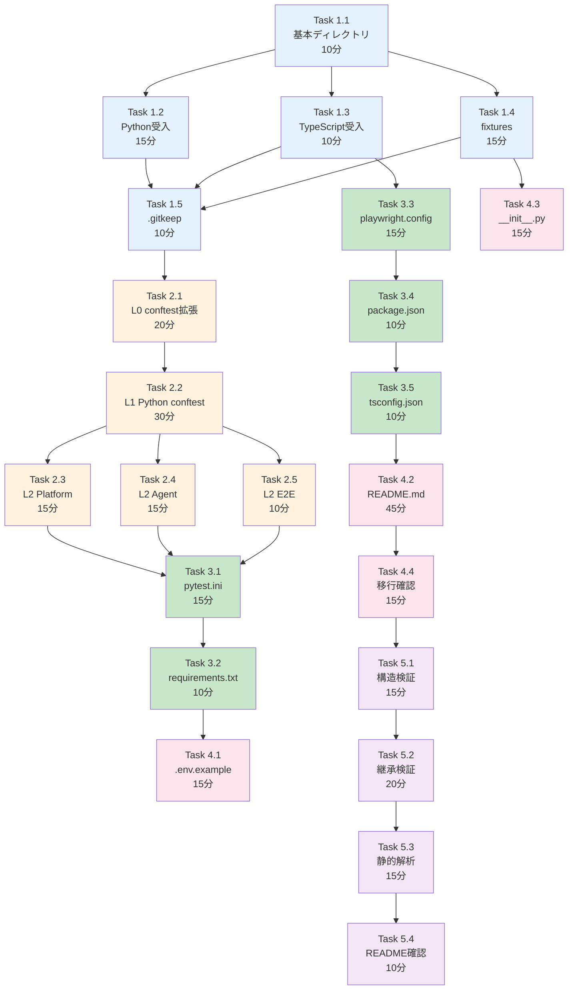

# 作業計画書: Issue #213 - 受入テストディレクトリ構造作成

## Issue: 受入テストディレクトリ構造作成

**Issue番号**: #213
**親Issue**: #209 (開発プロセス改善)
**Phase**: Phase 2: 受入テスト基盤構築
**サイズ**: M (6時間)
**作業見積**: 6時間
**優先度**: High
**依存Issue**:
- #211 (Python結合テスト移行) ✅ 必須
- #212 (TypeScript結合テスト移行) ✅ 必須
**ブロック対象**:
- #214 (CI除外設定)
- #215 (Python受入テスト実行スクリプト)
- #216 (Playwright受入テスト環境構築)

---

## 1. 現状分析

### 1.1 既存ディレクトリ構造

```
tests/
├── conftest.py                  # [L0] 既存（基本マーカー定義済み）
├── integration/
│   ├── python/                  # Issue #211で作成予定
│   ├── typescript/              # Issue #212で作成予定
│   ├── test_issue_148_acceptance.py  # 移行対象（acceptance/へ）
│   ├── test_issue_149_acceptance.py  # 移行対象（acceptance/へ）
│   ├── test_issue_150_acceptance.py  # 移行対象（acceptance/へ）
│   └── test_issue_166_acceptance.py  # 移行対象（acceptance/へ）
└── unit/                        # 既存（維持）
```

### 1.2 既存L0 conftest.py内容

```python
# 既存マーカー
- integration: 結合テスト
- e2e: E2Eテスト
- llm_required: LLM API必要
- production: 本番クリティカル
- critical: クリティカルパス
- slow: 低速テスト

# 既存フィクスチャ
- project_root: リポジトリルートパス
```

### 1.3 作成するディレクトリ構造

```
tests/
├── conftest.py                          # [L0] 拡張（新マーカー追加）
├── fixtures/                            # 共通テストデータ（新規）
│   ├── __init__.py
│   ├── api_responses/                   # APIレスポンスモック
│   │   ├── myvault/
│   │   └── expertagent/
│   ├── test_data/                       # テスト入力データ
│   │   ├── job_requests/
│   │   └── workflows/
│   └── factories/                       # テストデータファクトリ
│       └── __init__.py
│
├── integration/                         # Issue #211, #212で作成済み想定
│   ├── python/
│   └── typescript/
│
├── acceptance/                          # 受入テスト（新規）
│   ├── python/
│   │   ├── conftest.py                  # [L1] Python受入テスト共通
│   │   ├── pytest.ini                   # pytest設定
│   │   ├── requirements.txt             # テスト依存関係
│   │   │
│   │   ├── platform/                    # Platform層受入テスト
│   │   │   ├── conftest.py              # [L2] Platform層固有
│   │   │   └── .gitkeep
│   │   │
│   │   ├── agent/                       # Agent層受入テスト
│   │   │   ├── conftest.py              # [L2] Agent層固有
│   │   │   └── .gitkeep
│   │   │
│   │   └── e2e/                         # E2Eシナリオテスト
│   │       ├── conftest.py              # [L2] E2E固有
│   │       ├── scenarios/
│   │       │   └── .gitkeep
│   │       └── .gitkeep
│   │
│   └── typescript/                      # Playwright受入テスト
│       ├── playwright.config.ts         # Playwright設定
│       ├── package.json                 # npm依存関係
│       ├── tsconfig.json                # TypeScript設定
│       │
│       ├── ui/                          # UIテスト
│       │   └── .gitkeep
│       │
│       └── e2e/                         # E2Eテスト
│           └── .gitkeep
│
├── .env.example                         # 環境変数テンプレート（新規）
│
└── README.md                            # テスト実行ガイド（新規）
```

---

## 2. 詳細タスク分解

### Phase 1: ディレクトリ構造作成（1時間）

- [ ] **Task 1.1**: 基本ディレクトリ作成
  - 所要時間: 10分
  - 成果物: `tests/acceptance/`, `tests/fixtures/`
  - 依存: なし

- [ ] **Task 1.2**: Python受入テストディレクトリ作成
  - 所要時間: 15分
  - 成果物: `tests/acceptance/python/{platform,agent,e2e}/`
  - 依存: Task 1.1

- [ ] **Task 1.3**: TypeScript受入テストディレクトリ作成
  - 所要時間: 10分
  - 成果物: `tests/acceptance/typescript/{ui,e2e}/`
  - 依存: Task 1.1

- [ ] **Task 1.4**: テストフィクスチャディレクトリ作成
  - 所要時間: 15分
  - 成果物: `tests/fixtures/{api_responses,test_data,factories}/`
  - 依存: Task 1.1

- [ ] **Task 1.5**: .gitkeepファイル配置
  - 所要時間: 10分
  - 成果物: 各空ディレクトリに.gitkeep
  - 依存: Task 1.2, 1.3, 1.4

### Phase 2: conftest.py階層作成（1時間30分）

- [ ] **Task 2.1**: L0 conftest.py拡張
  - 所要時間: 20分
  - 成果物: `tests/conftest.py` 更新
  - 依存: Phase 1完了
  - 内容: 新マーカー追加（platform, agent, frontend, requires_api_key）

- [ ] **Task 2.2**: L1 Python受入テストconftest.py作成
  - 所要時間: 30分
  - 成果物: `tests/acceptance/python/conftest.py`
  - 依存: Task 2.1
  - 内容: env_config, requires_api_key, ensure_services_running

- [ ] **Task 2.3**: L2 Platform conftest.py作成
  - 所要時間: 15分
  - 成果物: `tests/acceptance/python/platform/conftest.py`
  - 依存: Task 2.2
  - 内容: myvault_acceptance_client, jobqueue_acceptance_client

- [ ] **Task 2.4**: L2 Agent conftest.py作成
  - 所要時間: 15分
  - 成果物: `tests/acceptance/python/agent/conftest.py`
  - 依存: Task 2.2
  - 内容: expertagent_acceptance_client, graphai_acceptance_client

- [ ] **Task 2.5**: L2 E2E conftest.py作成
  - 所要時間: 10分
  - 成果物: `tests/acceptance/python/e2e/conftest.py`
  - 依存: Task 2.2
  - 内容: full_stack_services

### Phase 3: 設定ファイル作成（1時間）

- [ ] **Task 3.1**: Python pytest.ini作成
  - 所要時間: 15分
  - 成果物: `tests/acceptance/python/pytest.ini`
  - 依存: Phase 2完了
  - 内容: testpaths, markers, asyncio_mode

- [ ] **Task 3.2**: Python requirements.txt作成
  - 所要時間: 10分
  - 成果物: `tests/acceptance/python/requirements.txt`
  - 依存: なし
  - 内容: pytest, httpx, pytest-asyncio, factory_boy

- [ ] **Task 3.3**: TypeScript playwright.config.ts作成
  - 所要時間: 15分
  - 成果物: `tests/acceptance/typescript/playwright.config.ts`
  - 依存: Task 1.3
  - 内容: baseURL, timeout, projects (chromium, firefox, webkit)

- [ ] **Task 3.4**: TypeScript package.json作成
  - 所要時間: 10分
  - 成果物: `tests/acceptance/typescript/package.json`
  - 依存: Task 1.3
  - 内容: playwright, @playwright/test

- [ ] **Task 3.5**: TypeScript tsconfig.json作成
  - 所要時間: 10分
  - 成果物: `tests/acceptance/typescript/tsconfig.json`
  - 依存: Task 1.3

### Phase 4: 環境設定・ドキュメント（1時間30分）

- [ ] **Task 4.1**: .env.example作成
  - 所要時間: 15分
  - 成果物: `tests/.env.example`
  - 依存: なし
  - 内容: APIキー、サービスURL、テスト設定

- [ ] **Task 4.2**: tests/README.md作成
  - 所要時間: 45分
  - 成果物: `tests/README.md`
  - 依存: Phase 3完了
  - 内容: 設計方針書セクション12に基づく詳細ガイド

- [ ] **Task 4.3**: フィクスチャ__init__.py作成
  - 所要時間: 15分
  - 成果物: `tests/fixtures/__init__.py`, `tests/fixtures/factories/__init__.py`
  - 依存: Task 1.4
  - 内容: モジュール初期化、基本ファクトリ

- [ ] **Task 4.4**: 既存acceptanceテスト移行確認
  - 所要時間: 15分
  - 作業: tests/integration/test_issue_*_acceptance.py の移行方針確認
  - 依存: Phase 3完了
  - 備考: 実際の移行はIssue #215で実施

### Phase 5: 検証（1時間）

- [ ] **Task 5.1**: ディレクトリ構造検証
  - 所要時間: 15分
  - 作業: 設計方針書1.3との整合性確認
  - 依存: Phase 4完了

- [ ] **Task 5.2**: conftest.py継承検証
  - 所要時間: 20分
  - 作業: `pytest --collect-only tests/acceptance/python/`
  - 依存: Phase 4完了

- [ ] **Task 5.3**: 静的解析（Ruff/MyPy）
  - 所要時間: 15分
  - 作業: `uv run ruff check tests/ && uv run mypy tests/`
  - 依存: Task 5.2

- [ ] **Task 5.4**: README確認
  - 所要時間: 10分
  - 作業: README.mdの内容確認、リンク検証
  - 依存: Task 5.3

---

## 3. タスク依存関係



---

## 4. 作業スケジュール

### セッション1（3時間）

| 時間 | タスク | 成果物 |
|------|--------|--------|
| 0:00-0:10 | Task 1.1 基本ディレクトリ | `acceptance/`, `fixtures/` |
| 0:10-0:25 | Task 1.2 Python受入 | `python/{platform,agent,e2e}/` |
| 0:25-0:35 | Task 1.3 TypeScript受入 | `typescript/{ui,e2e}/` |
| 0:35-0:50 | Task 1.4 fixtures | `fixtures/{api_responses,test_data,factories}/` |
| 0:50-1:00 | Task 1.5 .gitkeep | 各空ディレクトリ |
| 1:00-1:20 | Task 2.1 L0 conftest拡張 | `tests/conftest.py` 更新 |
| 1:20-1:50 | Task 2.2 L1 Python conftest | `acceptance/python/conftest.py` |
| 1:50-2:05 | Task 2.3 L2 Platform | `platform/conftest.py` |
| 2:05-2:20 | Task 2.4 L2 Agent | `agent/conftest.py` |
| 2:20-2:30 | Task 2.5 L2 E2E | `e2e/conftest.py` |
| 2:30-2:45 | Task 3.1 pytest.ini | `pytest.ini` |
| 2:45-2:55 | Task 3.2 requirements.txt | `requirements.txt` |

### セッション2（3時間）

| 時間 | タスク | 成果物 |
|------|--------|--------|
| 0:00-0:15 | Task 3.3 playwright.config | `playwright.config.ts` |
| 0:15-0:25 | Task 3.4 package.json | `package.json` |
| 0:25-0:35 | Task 3.5 tsconfig.json | `tsconfig.json` |
| 0:35-0:50 | Task 4.1 .env.example | `tests/.env.example` |
| 0:50-1:35 | Task 4.2 README.md | `tests/README.md` |
| 1:35-1:50 | Task 4.3 __init__.py | `fixtures/__init__.py` |
| 1:50-2:05 | Task 4.4 移行確認 | 移行方針ドキュメント |
| 2:05-2:20 | Task 5.1 構造検証 | 検証結果 |
| 2:20-2:40 | Task 5.2 継承検証 | pytest collect結果 |
| 2:40-2:55 | Task 5.3 静的解析 | Ruff/MyPyパス |
| 2:55-3:05 | Task 5.4 README確認 | 最終確認 |

**総作業時間**: 6時間

---

## 5. conftest.py設計詳細

### 5.1 L0 conftest.py拡張内容

```python
# tests/conftest.py [L0: ルートレベル]
"""
全テスト共通のpytest設定とマーカー定義
"""
from pathlib import Path
import pytest

def pytest_configure(config: pytest.Config) -> None:
    """カスタムマーカーの登録"""
    # 既存マーカー（維持）
    config.addinivalue_line("markers", "integration: mark test as integration test")
    config.addinivalue_line("markers", "e2e: mark test as end-to-end test")
    config.addinivalue_line("markers", "llm_required: mark test as requiring LLM API access")
    config.addinivalue_line("markers", "production: mark test as production-critical")
    config.addinivalue_line("markers", "critical: mark test as critical path")
    config.addinivalue_line("markers", "slow: mark test as slow-running")

    # 新規マーカー（追加）
    config.addinivalue_line("markers", "platform: Platform layer test")
    config.addinivalue_line("markers", "agent: Agent layer test")
    config.addinivalue_line("markers", "frontend: Frontend layer test")
    config.addinivalue_line("markers", "requires_api_key: requires external API key")
    config.addinivalue_line("markers", "acceptance: acceptance test (local only)")

@pytest.fixture(scope="session")
def project_root() -> Path:
    """リポジトリルートパスを返す"""
    return Path(__file__).parent.parent
```

### 5.2 L1 acceptance/python/conftest.py

```python
# tests/acceptance/python/conftest.py [L1: Python受入テスト共通]
"""
Python受入テスト共通フィクスチャ
"""
import os
import pytest
import httpx
from functools import wraps
from typing import Dict, Any, Generator

@pytest.fixture(scope="session")
def env_config() -> Dict[str, Any]:
    """環境変数からの設定読み込み"""
    return {
        "MYVAULT_URL": os.getenv("MYVAULT_URL", "http://localhost:8103"),
        "EXPERTAGENT_URL": os.getenv("EXPERTAGENT_URL", "http://localhost:8104"),
        "GRAPHAISERVER_URL": os.getenv("GRAPHAISERVER_URL", "http://localhost:8105"),
        "JOBQUEUE_URL": os.getenv("JOBQUEUE_URL", "http://localhost:8001"),
        "MYSCHEDULER_URL": os.getenv("MYSCHEDULER_URL", "http://localhost:8002"),
        "GOOGLE_API_KEY": os.getenv("GOOGLE_API_KEY"),
        "OPENAI_API_KEY": os.getenv("OPENAI_API_KEY"),
    }

def requires_api_key(key_name: str):
    """APIキーが必要なテストをスキップするデコレータ"""
    def decorator(func):
        @wraps(func)
        def wrapper(*args, **kwargs):
            if not os.getenv(key_name):
                pytest.skip(f"{key_name} not set in environment")
            return func(*args, **kwargs)
        return wrapper
    return decorator

@pytest.fixture(scope="session")
def ensure_services_running(env_config) -> Dict[str, str]:
    """受入テスト用サービス起動確認"""
    import time

    services_to_check = [
        ("myvault", env_config["MYVAULT_URL"]),
    ]

    for service_name, url in services_to_check:
        max_retries = 10
        for i in range(max_retries):
            try:
                response = httpx.get(f"{url}/health", timeout=5)
                if response.status_code == 200:
                    break
            except httpx.RequestError:
                pass
            if i == max_retries - 1:
                pytest.skip(f"{service_name} service not available at {url}")
            time.sleep(2)

    return env_config

@pytest.fixture
async def async_client() -> Generator[httpx.AsyncClient, None, None]:
    """非同期HTTPクライアント"""
    async with httpx.AsyncClient(timeout=30) as client:
        yield client
```

### 5.3 L2 platform/conftest.py

```python
# tests/acceptance/python/platform/conftest.py [L2: Platform層固有]
"""
Platform層受入テスト固有フィクスチャ
"""
import pytest
import httpx
from typing import Generator

@pytest.fixture
def myvault_acceptance_client(
    env_config, ensure_services_running
) -> Generator[httpx.Client, None, None]:
    """MyVault受入テスト用クライアント"""
    with httpx.Client(
        base_url=env_config["MYVAULT_URL"],
        timeout=30
    ) as client:
        yield client

@pytest.fixture
def jobqueue_acceptance_client(
    env_config, ensure_services_running
) -> Generator[httpx.Client, None, None]:
    """JobQueue受入テスト用クライアント"""
    with httpx.Client(
        base_url=env_config["JOBQUEUE_URL"],
        timeout=30
    ) as client:
        yield client
```

---

## 6. チェックポイント

| タイミング | 確認事項 | 対応 |
|-----------|---------|------|
| Phase 1完了時 | ディレクトリ構造が設計通り | `tree tests/` で確認 |
| Task 2.2完了時 | L1 conftest.pyが正しく動作 | `pytest --collect-only` |
| Phase 3完了時 | 設定ファイルの構文エラーなし | `python -m py_compile` |
| Phase 4完了時 | README.mdが設計方針書と一致 | 手動確認 |
| Phase 5完了時 | conftest.py継承が機能 | pytest実行確認 |

---

## 7. リスクと対策

| リスク | 発生確率 | 影響 | 対策 |
|-------|---------|------|------|
| #211, #212未完了での着手 | 中 | ディレクトリ競合 | 依存Issue完了確認後に着手 |
| conftest.py継承エラー | 中 | テスト実行不可 | 段階的に検証、pytest --collect-only |
| Playwright設定不備 | 低 | TypeScript受入テスト不可 | #216で詳細設定 |
| 既存acceptanceテストとの競合 | 中 | importエラー | 移行方針を明確化 |

---

## 8. 成果物チェックリスト

### ディレクトリ・ファイル

#### Phase 1: ディレクトリ
- [ ] `tests/acceptance/python/`
- [ ] `tests/acceptance/python/platform/`
- [ ] `tests/acceptance/python/agent/`
- [ ] `tests/acceptance/python/e2e/`
- [ ] `tests/acceptance/python/e2e/scenarios/`
- [ ] `tests/acceptance/typescript/`
- [ ] `tests/acceptance/typescript/ui/`
- [ ] `tests/acceptance/typescript/e2e/`
- [ ] `tests/fixtures/`
- [ ] `tests/fixtures/api_responses/`
- [ ] `tests/fixtures/api_responses/myvault/`
- [ ] `tests/fixtures/api_responses/expertagent/`
- [ ] `tests/fixtures/test_data/`
- [ ] `tests/fixtures/test_data/job_requests/`
- [ ] `tests/fixtures/test_data/workflows/`
- [ ] `tests/fixtures/factories/`

#### Phase 2: conftest.py
- [ ] `tests/conftest.py` (L0拡張)
- [ ] `tests/acceptance/python/conftest.py` (L1)
- [ ] `tests/acceptance/python/platform/conftest.py` (L2)
- [ ] `tests/acceptance/python/agent/conftest.py` (L2)
- [ ] `tests/acceptance/python/e2e/conftest.py` (L2)

#### Phase 3: 設定ファイル
- [ ] `tests/acceptance/python/pytest.ini`
- [ ] `tests/acceptance/python/requirements.txt`
- [ ] `tests/acceptance/typescript/playwright.config.ts`
- [ ] `tests/acceptance/typescript/package.json`
- [ ] `tests/acceptance/typescript/tsconfig.json`

#### Phase 4: ドキュメント・環境
- [ ] `tests/.env.example`
- [ ] `tests/README.md`
- [ ] `tests/fixtures/__init__.py`
- [ ] `tests/fixtures/factories/__init__.py`

---

## 9. Definition of Done

### 🤖 自動検証可能な基準

**機能要件**:
- [ ] `tests/acceptance/python/` ディレクトリが存在する
- [ ] `tests/acceptance/typescript/` ディレクトリが存在する
- [ ] `tests/conftest.py` がL0共通フィクスチャを提供する
- [ ] `tests/README.md` が存在し、テスト場所クイックリファレンスを含む
- [ ] `tests/.env.example` が存在し、必要な環境変数がドキュメント化されている

**品質基準**:
- [ ] conftest.py階層がdesign-policy.md 3.4に準拠
- [ ] Ruff/MyPy エラーゼロ

**テストケース**:
- [ ] 正常系: conftest.pyの共通フィクスチャがインポート可能
- [ ] 正常系: L0 → L1 → L2 の継承が機能する
- [ ] 正常系: `pytest --collect-only tests/acceptance/python/` が成功する

### 👤 手動検証が必要な基準

**UX/UI検証**:
- [ ] README.mdが分かりやすい
- [ ] 新規開発者がREADMEのみでテスト実行方法を理解できる

**運用検証**:
- [ ] ディレクトリ構造が設計方針書と一致している

---

## 10. 次のアクション

作業計画承認後：
1. **依存Issue確認**: #211, #212の完了を確認
2. **ブランチ作成**: `feature/issue/213`
3. **worktree作成**: `./scripts/worktree-create-from-issue.sh 213`
4. **タスク実行**: Phase 1から順次実行
5. **進捗報告**: 各Phase完了時に `/progress-report`

---

## 11. 参照ドキュメント

- [設計方針書](../issue/209/design-policy.md) - セクション1.3, 3.4, 12を重点参照
- [Issue分割計画書](../issue/209/issue-split.md)
- [品質基準](../../docs/claude/04-quality-standards.md)

---

## 12. 注意事項

### 既存acceptanceテストについて

`tests/integration/` 直下にある以下のファイルは本Issue (#213) では移行しません：
- `test_issue_148_acceptance.py`
- `test_issue_149_acceptance.py`
- `test_issue_150_acceptance.py`
- `test_issue_166_acceptance.py`

これらの移行はIssue #215 (Python受入テスト実行スクリプト作成) で実施します。
本Issueでは移行先のディレクトリ構造のみを作成します。

### TypeScript設定について

`playwright.config.ts` と `package.json` は基本設定のみ作成します。
詳細な設定はIssue #216 (Playwright受入テスト環境構築) で実施します。

---

**作成日**: 2025-12-03
**作成者**: Claude Code
**ステータス**: 承認待ち
