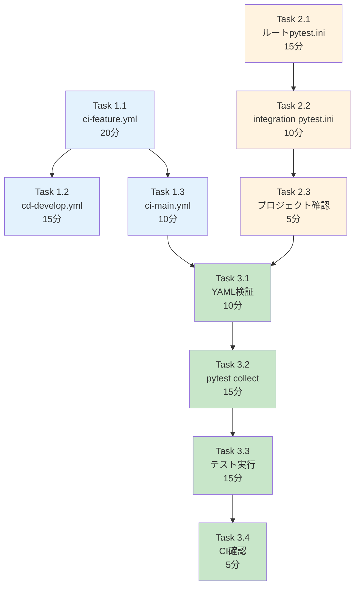

# 作業計画書: Issue #214 - CI除外設定の追加

## Issue: CI除外設定の追加

**Issue番号**: #214
**親Issue**: #209 (開発プロセス改善)
**Phase**: Phase 2: 受入テスト基盤構築
**サイズ**: S (2時間)
**作業見積**: 2時間
**優先度**: High
**依存Issue**:
- #213 (受入テストディレクトリ構造作成) ✅ 必須
**ブロック対象**:
- #217 (CLAUDE.md 開発プロセス更新)

---

## 1. 現状分析

### 1.1 現在のCI設定（ci-feature.yml）

```yaml
# 現在の paths フィルタ
on:
  pull_request:
    paths:
      - 'myscheduler/**'
      - 'jobqueue/**'
      - 'expertAgent/**'
      - 'myAgentDesk/**'
      - 'graphAiServer/**'
      - '.github/workflows/**'
      - '!docs/**'  # docs除外
      # tests/acceptance/** の除外がない ← 追加必要
```

### 1.2 現在のpytest.ini（ルートレベル）

```ini
[pytest]
testpaths = tests
# norecursedirs がない ← 追加必要
```

### 1.3 変更対象ファイル

| ファイル | 変更内容 |
|----------|---------|
| `.github/workflows/ci-feature.yml` | `paths-ignore` に `tests/acceptance/**` 追加 |
| `pytest.ini` | `norecursedirs = tests/acceptance` 追加 |
| `tests/integration/python/pytest.ini` | `norecursedirs` 確認・追加 |

---

## 2. 詳細タスク分解

### Phase 1: CI除外設定（45分）

- [ ] **Task 1.1**: ci-feature.yml paths-ignore追加
  - 所要時間: 20分
  - 成果物: `.github/workflows/ci-feature.yml` 更新
  - 依存: なし
  - 内容:
    - `paths` セクションに `'!tests/acceptance/**'` 追加
    - コメント追加（受入テストはローカル実行のみ）

- [ ] **Task 1.2**: cd-develop.yml確認・更新
  - 所要時間: 15分
  - 成果物: `.github/workflows/cd-develop.yml` 更新（必要に応じて）
  - 依存: Task 1.1
  - 内容: develop統合時の除外設定確認

- [ ] **Task 1.3**: ci-main.yml確認・更新
  - 所要時間: 10分
  - 成果物: `.github/workflows/ci-main.yml` 更新（必要に応じて）
  - 依存: Task 1.1
  - 内容: main統合時の除外設定確認

### Phase 2: pytest設定更新（30分）

- [ ] **Task 2.1**: ルートpytest.ini更新
  - 所要時間: 15分
  - 成果物: `pytest.ini` 更新
  - 依存: なし
  - 内容:
    - `norecursedirs = tests/acceptance .git __pycache__ .pytest_cache`
    - コメント追加

- [ ] **Task 2.2**: tests/integration/python/pytest.ini確認
  - 所要時間: 10分
  - 成果物: 確認結果ドキュメント
  - 依存: Task 2.1
  - 内容: 結合テスト用pytest.iniが受入テストを除外していることを確認

- [ ] **Task 2.3**: 各プロジェクトpytest.ini確認
  - 所要時間: 5分
  - 成果物: 確認結果
  - 依存: Task 2.1
  - 内容: プロジェクト内pytest.iniが影響を受けないことを確認

### Phase 3: 検証（45分）

- [ ] **Task 3.1**: YAMLシンタックス検証
  - 所要時間: 10分
  - 作業: `yamllint .github/workflows/ci-feature.yml`
  - 依存: Phase 1, 2完了

- [ ] **Task 3.2**: pytest collect検証
  - 所要時間: 15分
  - 作業: `uv run pytest --collect-only tests/integration/` で受入テストが含まれないことを確認
  - 依存: Task 3.1

- [ ] **Task 3.3**: 既存テスト実行検証
  - 所要時間: 15分
  - 作業: `uv run pytest tests/integration/python/ -v` が正常動作することを確認
  - 依存: Task 3.2

- [ ] **Task 3.4**: CI実行時間確認（PRマージ後）
  - 所要時間: 5分
  - 作業: CI実行ログで受入テストが実行されていないことを確認
  - 依存: Task 3.3
  - 備考: 実際のPRでの確認

---

## 3. タスク依存関係



---

## 4. 作業スケジュール

### セッション（2時間）

| 時間 | タスク | 成果物 |
|------|--------|--------|
| 0:00-0:20 | Task 1.1 ci-feature.yml | paths-ignore追加 |
| 0:20-0:35 | Task 1.2 cd-develop.yml | 除外設定確認 |
| 0:35-0:45 | Task 1.3 ci-main.yml | 除外設定確認 |
| 0:45-1:00 | Task 2.1 ルートpytest.ini | norecursedirs追加 |
| 1:00-1:10 | Task 2.2 integration pytest.ini | 確認結果 |
| 1:10-1:15 | Task 2.3 プロジェクト確認 | 確認結果 |
| 1:15-1:25 | Task 3.1 YAML検証 | シンタックス確認 |
| 1:25-1:40 | Task 3.2 pytest collect | 除外確認 |
| 1:40-1:55 | Task 3.3 テスト実行 | 既存テストパス |
| 1:55-2:00 | Task 3.4 CI確認準備 | 確認項目整理 |

**総作業時間**: 2時間

---

## 5. 設定変更詳細

### 5.1 ci-feature.yml変更内容

```yaml
# 変更前
on:
  pull_request:
    branches: [develop]
    paths:
      - 'myscheduler/**'
      - 'jobqueue/**'
      - 'expertAgent/**'
      - 'myAgentDesk/**'
      - 'graphAiServer/**'
      - '.github/workflows/**'
      - '!docs/**'

# 変更後
on:
  pull_request:
    branches: [develop]
    paths:
      - 'myscheduler/**'
      - 'jobqueue/**'
      - 'expertAgent/**'
      - 'myAgentDesk/**'
      - 'graphAiServer/**'
      - 'tests/integration/**'       # 結合テストはCI対象
      - '.github/workflows/**'
      - '!docs/**'
      - '!tests/acceptance/**'       # 受入テストはCI除外（ローカル実行のみ）

  push:
    branches:
      - 'feature/**'
      - 'fix/**'
      - 'refactor/**'
      - 'test/**'
      - 'vibe/**'
    paths:
      - 'myscheduler/**'
      - 'jobqueue/**'
      - 'expertAgent/**'
      - 'myAgentDesk/**'
      - 'graphAiServer/**'
      - 'tests/integration/**'       # 結合テストはCI対象
      - '.github/workflows/**'
      - '!docs/**'
      - '!tests/acceptance/**'       # 受入テストはCI除外（ローカル実行のみ）
```

### 5.2 pytest.ini変更内容

```ini
# 変更前
[pytest]
testpaths = tests

# 変更後
[pytest]
testpaths = tests

# CI除外設定: 受入テストはローカル実行のみ
norecursedirs =
    tests/acceptance
    .git
    __pycache__
    .pytest_cache
    node_modules
    .venv
    venv
```

### 5.3 テストジョブへの明示的パス追加（オプション）

```yaml
# test ジョブでのテスト実行（変更後）
- name: Run tests with coverage
  working-directory: ./${{ matrix.project }}
  run: |
    uv run pytest tests/ -v --cov=app --cov-report=xml --cov-report=term \
      --ignore=tests/acceptance  # 明示的な除外
```

---

## 6. チェックポイント

| タイミング | 確認事項 | 対応 |
|-----------|---------|------|
| Task 1.1完了時 | YAML構文エラーなし | yamllintで確認 |
| Phase 2完了時 | pytest.ini構文エラーなし | pytest --co で確認 |
| Task 3.2完了時 | 受入テストが収集されない | --collect-only結果確認 |
| Task 3.3完了時 | 既存テストが全パス | pytest実行結果確認 |

---

## 7. リスクと対策

| リスク | 発生確率 | 影響 | 対策 |
|-------|---------|------|------|
| YAML構文エラー | 低 | CI停止 | yamllintで事前検証 |
| 既存テストへの影響 | 低 | テスト失敗 | pytest --collect-onlyで確認 |
| パス除外設定の不整合 | 中 | 意図しない除外 | 複数ワークフローの整合性確認 |
| CI実行時間短縮効果なし | 低 | 期待効果なし | 受入テストが元々少ない場合は影響軽微 |

---

## 8. 成果物チェックリスト

### 変更ファイル
- [ ] `.github/workflows/ci-feature.yml`
- [ ] `.github/workflows/cd-develop.yml` （必要に応じて）
- [ ] `.github/workflows/ci-main.yml` （必要に応じて）
- [ ] `pytest.ini`

### 確認項目
- [ ] YAML構文検証パス
- [ ] pytest collect結果で受入テスト除外確認
- [ ] 既存テスト実行成功
- [ ] CI実行ログで受入テスト除外確認

---

## 9. Definition of Done

### 🤖 自動検証可能な基準

**機能要件**:
- [ ] `ci-feature.yml` に `tests/acceptance/**` の除外設定が存在する
- [ ] `pytest.ini` に `norecursedirs = tests/acceptance` が設定されている
- [ ] CIで `tests/acceptance/` 配下のテストが実行されない

**品質基準**:
- [ ] 既存のCI単体テスト・結合テストが引き続き実行される
- [ ] YAMLシンタックスエラーなし

**テストケース**:
- [ ] 正常系: CI実行で `tests/acceptance/` が除外される
- [ ] 正常系: 既存テストが全てパスする
- [ ] 正常系: `pytest --collect-only` で受入テストが収集されない

### 👤 手動検証が必要な基準

**運用検証**:
- [ ] 実際のPRでCIが正常に動作する
- [ ] CI実行時間が短縮される（受入テスト除外による）

---

## 10. 次のアクション

作業計画承認後：
1. **依存Issue確認**: #213の完了を確認
2. **ブランチ作成**: `feature/issue/214`
3. **worktree作成**: `./scripts/worktree-create-from-issue.sh 214`
4. **タスク実行**: Phase 1から順次実行
5. **進捗報告**: 完了時に `/progress-report`

---

## 11. 参照ドキュメント

- [設計方針書](../issue/209/design-policy.md) - セクション4（CI/CD設計）
- [Issue分割計画書](../issue/209/issue-split.md)
- [品質基準](../../docs/claude/04-quality-standards.md)

---

## 12. 注意事項

### CI除外の範囲

本Issueでは以下のみを除外します：
- `tests/acceptance/**` - 受入テスト

以下は引き続きCI対象です：
- `tests/integration/**` - 結合テスト
- `{project}/tests/**` - 各プロジェクト内の単体テスト

### 他ワークフローへの影響

以下のワークフローも確認が必要です：
- `cd-develop.yml` - develop統合時
- `ci-main.yml` - main統合時
- `hotfix.yml` - ホットフィックス時

これらは同様の除外設定が必要か確認し、必要に応じて更新します。

---

**作成日**: 2025-12-03
**作成者**: Claude Code
**ステータス**: 承認待ち
