# 作業計画書: Issue #215 - Python受入テスト実行スクリプト作成

## Issue: Python受入テスト実行スクリプト作成

**Issue番号**: #215
**親Issue**: #209 (開発プロセス改善)
**Phase**: Phase 3: 受入テスト基盤構築
**サイズ**: M (8時間)
**作業見積**: 8時間
**優先度**: High
**依存Issue**:
- #213 (受入テストディレクトリ構造作成) - 必須
**ブロック対象**:
- #217 (CLAUDE.md 開発プロセス更新)

---

## 1. 現状分析

### 1.1 既存Makefile構成

現在のMakefile（283行）は以下のレイヤーベース設計:

| ターゲット | 機能 | 依存関係 |
|-----------|------|---------|
| `dev-platform` | Platform層起動 | `network` |
| `dev-agent` | Agent層起動 | `_check-platform` |
| `dev-frontend` | Frontend層起動 | `_check-agent` |
| `dev-all` | 全層起動 | 順次起動 |
| `down` | 全停止 | - |
| `status` | ステータス確認 | - |

**既存のヘルスチェック機能**:
- `_check-platform`: MyVault(8003), JobQueue(8001)のヘルスチェック
- `_check-agent`: ExpertAgent(8004)のヘルスチェック
- `_wait-platform/agent`: タイムアウト付き待機

### 1.2 追加必要なターゲット

設計方針書セクション5に基づく新規ターゲット:

| ターゲット | 機能 | 依存チェック |
|-----------|------|-------------|
| `acceptance-test-platform` | Platform層受入テスト | Platform起動確認 |
| `acceptance-test-agent` | Agent層受入テスト | Agent起動確認 |
| `acceptance-test-python` | Python全受入テスト | 全層起動確認 |
| `acceptance-test-all` | Python+TS全受入テスト | 全層起動確認 |

### 1.3 作成対象スクリプト

| ファイル | 機能 | 行数見積 |
|---------|------|---------|
| `scripts/run-acceptance-tests.sh` | 受入テスト実行 | ~200行 |
| `Makefile` (追記) | 受入テストターゲット | ~60行 |

### 1.4 設計方針書からの要件

設計方針書セクション5.1/6.1より:

```bash
# 使用例
./scripts/run-acceptance-tests.sh --layer platform
./scripts/run-acceptance-tests.sh --layer agent
./scripts/run-acceptance-tests.sh --marker e2e
./scripts/run-acceptance-tests.sh --all
```

主要機能:
1. 依存コンテナ自動起動（--auto-start オプション）
2. ヘルスチェック待機（タイムアウト設定可能）
3. レイヤー別テスト実行（--layer オプション）
4. マーカー指定（--marker オプション）
5. テスト結果レポート出力（JUnit XML, HTML）
6. 終了時クリーンアップ（オプション）

---

## 2. 詳細タスク分解

### Phase 1: スクリプト基盤作成（2時間30分）

- [ ] **Task 1.1**: スクリプトスケルトン作成
  - 所要時間: 30分
  - 成果物: `scripts/run-acceptance-tests.sh` (基本構造)
  - 依存: なし
  - 内容:
    - shebang, set -euo pipefail
    - 引数解析（getopts）
    - ヘルプ表示関数
    - カラー出力ユーティリティ

- [ ] **Task 1.2**: 設定変数・デフォルト値設定
  - 所要時間: 20分
  - 成果物: スクリプト設定セクション
  - 依存: Task 1.1
  - 内容:
    - ポート定義（Platform/Agent/Frontend）
    - タイムアウト設定
    - パス設定（テストディレクトリ、レポート出力先）

- [ ] **Task 1.3**: ヘルスチェック関数実装
  - 所要時間: 40分
  - 成果物: check_health, wait_for_health 関数
  - 依存: Task 1.2
  - 内容:
    - サービス別ヘルスチェック（curl -sf）
    - タイムアウト付き待機ループ
    - エラーメッセージ表示

- [ ] **Task 1.4**: サービス起動関数実装
  - 所要時間: 30分
  - 成果物: start_services, stop_services 関数
  - 依存: Task 1.3
  - 内容:
    - docker compose呼び出し
    - レイヤー別起動制御
    - エラーハンドリング

- [ ] **Task 1.5**: ログ・レポート出力関数
  - 所要時間: 30分
  - 成果物: setup_logging, output_report 関数
  - 依存: Task 1.1
  - 内容:
    - タイムスタンプ付きログ
    - レポートディレクトリ作成
    - サマリー出力

### Phase 2: テスト実行機能実装（2時間）

- [ ] **Task 2.1**: pytest実行関数実装
  - 所要時間: 40分
  - 成果物: run_pytest 関数
  - 依存: Phase 1完了
  - 内容:
    - pytest呼び出し（uv run pytest）
    - マーカー指定（-m オプション）
    - JUnit XML出力（--junitxml）
    - HTML出力（--html、pytest-html依存）
    - カバレッジ設定（オプション）

- [ ] **Task 2.2**: レイヤー別テスト関数実装
  - 所要時間: 30分
  - 成果物: test_platform, test_agent, test_e2e 関数
  - 依存: Task 2.1
  - 内容:
    - レイヤー別テストパス設定
    - 依存サービス確認
    - マーカー自動設定

- [ ] **Task 2.3**: 全体テスト実行関数
  - 所要時間: 30分
  - 成果物: run_all_tests 関数
  - 依存: Task 2.2
  - 内容:
    - 順次レイヤーテスト実行
    - 失敗時の継続/停止制御
    - 最終サマリー出力

- [ ] **Task 2.4**: メイン処理フロー実装
  - 所要時間: 20分
  - 成果物: main 関数
  - 依存: Task 2.3
  - 内容:
    - 引数に応じた分岐
    - オプション処理
    - 終了コード管理

### Phase 3: Makefileターゲット追加（1時間30分）

- [ ] **Task 3.1**: acceptance-test-platform ターゲット
  - 所要時間: 20分
  - 成果物: Makefile追記
  - 依存: Phase 2完了
  - 内容:
    ```makefile
    acceptance-test-platform: _check-platform ## Run Platform layer acceptance tests
    	@echo "Running Platform layer acceptance tests..."
    	./scripts/run-acceptance-tests.sh --layer platform
    ```

- [ ] **Task 3.2**: acceptance-test-agent ターゲット
  - 所要時間: 15分
  - 成果物: Makefile追記
  - 依存: Task 3.1
  - 内容: Agent層受入テスト実行ターゲット

- [ ] **Task 3.3**: acceptance-test-python ターゲット
  - 所要時間: 15分
  - 成果物: Makefile追記
  - 依存: Task 3.2
  - 内容: Python全受入テスト実行ターゲット

- [ ] **Task 3.4**: acceptance-test-all ターゲット
  - 所要時間: 15分
  - 成果物: Makefile追記
  - 依存: Task 3.3
  - 内容: Python + TypeScript全受入テスト（将来対応）

- [ ] **Task 3.5**: help出力更新
  - 所要時間: 15分
  - 成果物: Makefile help セクション更新
  - 依存: Task 3.4
  - 内容: 受入テストコマンドをhelp出力に追加

- [ ] **Task 3.6**: PHONY宣言追加
  - 所要時間: 10分
  - 成果物: Makefile PHONY 更新
  - 依存: Task 3.5

### Phase 4: 検証・テスト（1時間30分）

- [ ] **Task 4.1**: スクリプト構文検証
  - 所要時間: 15分
  - 作業: `shellcheck scripts/run-acceptance-tests.sh`
  - 依存: Phase 3完了

- [ ] **Task 4.2**: ヘルプ表示テスト
  - 所要時間: 10分
  - 作業: `./scripts/run-acceptance-tests.sh --help`
  - 依存: Task 4.1

- [ ] **Task 4.3**: ヘルスチェック機能テスト
  - 所要時間: 20分
  - 作業: サービス停止状態でのエラー確認
  - 依存: Task 4.2

- [ ] **Task 4.4**: Platform層テスト実行
  - 所要時間: 20分
  - 作業: `make acceptance-test-platform`
  - 依存: Task 4.3
  - 備考: Platform層のサンプルテストで動作確認

- [ ] **Task 4.5**: Agent層テスト実行
  - 所要時間: 15分
  - 作業: `make acceptance-test-agent`
  - 依存: Task 4.4

- [ ] **Task 4.6**: 全テスト実行
  - 所要時間: 10分
  - 作業: `make acceptance-test-python`
  - 依存: Task 4.5

### Phase 5: ドキュメント（30分）

- [ ] **Task 5.1**: スクリプトREADME作成
  - 所要時間: 20分
  - 成果物: `scripts/README.md` (受入テストセクション追加)
  - 依存: Phase 4完了
  - 内容: 使用方法、オプション説明

- [ ] **Task 5.2**: Makefileコメント整理
  - 所要時間: 10分
  - 成果物: Makefile コメント更新
  - 依存: Task 5.1
  - 内容: 受入テストセクションのヘッダーコメント

---

## 3. タスク依存関係

```mermaid
graph TD
    T11[Task 1.1<br/>スケルトン作成<br/>30分] --> T12[Task 1.2<br/>設定変数<br/>20分]
    T11 --> T15[Task 1.5<br/>ログ・レポート<br/>30分]
    T12 --> T13[Task 1.3<br/>ヘルスチェック<br/>40分]
    T13 --> T14[Task 1.4<br/>サービス起動<br/>30分]

    T14 & T15 --> T21[Task 2.1<br/>pytest実行<br/>40分]
    T21 --> T22[Task 2.2<br/>レイヤー別テスト<br/>30分]
    T22 --> T23[Task 2.3<br/>全体テスト<br/>30分]
    T23 --> T24[Task 2.4<br/>メイン処理<br/>20分]

    T24 --> T31[Task 3.1<br/>acceptance-test-platform<br/>20分]
    T31 --> T32[Task 3.2<br/>acceptance-test-agent<br/>15分]
    T32 --> T33[Task 3.3<br/>acceptance-test-python<br/>15分]
    T33 --> T34[Task 3.4<br/>acceptance-test-all<br/>15分]
    T34 --> T35[Task 3.5<br/>help更新<br/>15分]
    T35 --> T36[Task 3.6<br/>PHONY宣言<br/>10分]

    T36 --> T41[Task 4.1<br/>構文検証<br/>15分]
    T41 --> T42[Task 4.2<br/>ヘルプテスト<br/>10分]
    T42 --> T43[Task 4.3<br/>ヘルスチェック確認<br/>20分]
    T43 --> T44[Task 4.4<br/>Platformテスト<br/>20分]
    T44 --> T45[Task 4.5<br/>Agentテスト<br/>15分]
    T45 --> T46[Task 4.6<br/>全テスト<br/>10分]

    T46 --> T51[Task 5.1<br/>README作成<br/>20分]
    T51 --> T52[Task 5.2<br/>コメント整理<br/>10分]

    style T11 fill:#e3f2fd
    style T12 fill:#e3f2fd
    style T13 fill:#e3f2fd
    style T14 fill:#e3f2fd
    style T15 fill:#e3f2fd
    style T21 fill:#fff3e0
    style T22 fill:#fff3e0
    style T23 fill:#fff3e0
    style T24 fill:#fff3e0
    style T31 fill:#c8e6c9
    style T32 fill:#c8e6c9
    style T33 fill:#c8e6c9
    style T34 fill:#c8e6c9
    style T35 fill:#c8e6c9
    style T36 fill:#c8e6c9
    style T41 fill:#f3e5f5
    style T42 fill:#f3e5f5
    style T43 fill:#f3e5f5
    style T44 fill:#f3e5f5
    style T45 fill:#f3e5f5
    style T46 fill:#f3e5f5
    style T51 fill:#fce4ec
    style T52 fill:#fce4ec
```



---

## 4. 作業スケジュール

### セッション1（4時間）

| 時間 | タスク | 成果物 |
|------|--------|--------|
| 0:00-0:30 | Task 1.1 スケルトン | 基本スクリプト構造 |
| 0:30-0:50 | Task 1.2 設定変数 | 設定セクション |
| 0:50-1:30 | Task 1.3 ヘルスチェック | check_health関数群 |
| 1:30-2:00 | Task 1.4 サービス起動 | start/stop関数 |
| 2:00-2:30 | Task 1.5 ログ・レポート | logging関数群 |
| 2:30-3:10 | Task 2.1 pytest実行 | run_pytest関数 |
| 3:10-3:40 | Task 2.2 レイヤー別 | test_*関数群 |
| 3:40-4:00 | Task 2.3-2.4 全体・メイン | メインフロー完成 |

### セッション2（4時間）

| 時間 | タスク | 成果物 |
|------|--------|--------|
| 0:00-0:20 | Task 3.1 platform | Makefileターゲット |
| 0:20-0:35 | Task 3.2 agent | Makefileターゲット |
| 0:35-0:50 | Task 3.3 python | Makefileターゲット |
| 0:50-1:05 | Task 3.4 all | Makefileターゲット |
| 1:05-1:20 | Task 3.5 help | help出力更新 |
| 1:20-1:30 | Task 3.6 PHONY | PHONY宣言 |
| 1:30-1:45 | Task 4.1 構文検証 | shellcheckパス |
| 1:45-1:55 | Task 4.2 ヘルプ | --help動作確認 |
| 1:55-2:15 | Task 4.3 ヘルスチェック | エラー確認 |
| 2:15-2:35 | Task 4.4 Platform | テスト実行確認 |
| 2:35-2:50 | Task 4.5 Agent | テスト実行確認 |
| 2:50-3:00 | Task 4.6 全テスト | 全実行確認 |
| 3:00-3:20 | Task 5.1 README | ドキュメント |
| 3:20-3:30 | Task 5.2 コメント | コメント整理 |
| 3:30-4:00 | 予備時間・調整 | バッファ |

**総作業時間**: 8時間

---

## 5. スクリプト設計詳細

### 5.1 run-acceptance-tests.sh 構造

```bash
#!/bin/bash
# =============================================================================
# run-acceptance-tests.sh - MySwiftAgent Acceptance Test Runner
# =============================================================================

set -euo pipefail

# =============================================================================
# Configuration
# =============================================================================

SCRIPT_DIR="$(cd "$(dirname "${BASH_SOURCE[0]}")" && pwd)"
PROJECT_ROOT="$(dirname "$SCRIPT_DIR")"

# Port Configuration
MYVAULT_PORT=${MYVAULT_PORT:-8003}
JOBQUEUE_PORT=${JOBQUEUE_PORT:-8001}
EXPERTAGENT_PORT=${EXPERTAGENT_PORT:-8004}
GRAPHAISERVER_PORT=${GRAPHAISERVER_PORT:-8005}
MYAGENTDESK_PORT=${MYAGENTDESK_PORT:-5173}

# Timeout Configuration
HEALTH_CHECK_TIMEOUT=${HEALTH_CHECK_TIMEOUT:-60}
HEALTH_CHECK_INTERVAL=${HEALTH_CHECK_INTERVAL:-5}

# Test Configuration
TEST_BASE_DIR="${PROJECT_ROOT}/tests/acceptance/python"
REPORT_DIR="${PROJECT_ROOT}/test-reports/acceptance"

# =============================================================================
# Color Output
# =============================================================================

RED='\033[0;31m'
GREEN='\033[0;32m'
YELLOW='\033[1;33m'
BLUE='\033[0;34m'
NC='\033[0m' # No Color

# =============================================================================
# Usage
# =============================================================================

usage() {
    echo "Usage: $0 [OPTIONS]"
    echo ""
    echo "Options:"
    echo "  --layer <layer>    Run tests for specific layer (platform|agent|frontend|e2e)"
    echo "  --marker <marker>  Run tests with specific pytest marker"
    echo "  --all              Run all acceptance tests"
    echo "  --auto-start       Automatically start required services"
    echo "  --cleanup          Stop services after tests"
    echo "  --report           Generate HTML report"
    echo "  --verbose          Enable verbose output"
    echo "  --help             Show this help message"
    echo ""
    echo "Examples:"
    echo "  $0 --layer platform"
    echo "  $0 --layer agent --auto-start"
    echo "  $0 --all --report"
    echo "  $0 --marker requires_api_key"
}

# ... (以下省略 - 実装時に完成)
```

### 5.2 Makefile追加ターゲット

```makefile
# =============================================================================
# Acceptance Test Targets
# =============================================================================

.PHONY: acceptance-test-platform acceptance-test-agent acceptance-test-python acceptance-test-all

acceptance-test-platform: _check-platform ## Run Platform layer acceptance tests (local only)
	@echo "Running Platform layer acceptance tests..."
	./scripts/run-acceptance-tests.sh --layer platform --report
	@echo "Platform acceptance tests complete"

acceptance-test-agent: _check-agent ## Run Agent layer acceptance tests (local only)
	@echo "Running Agent layer acceptance tests..."
	./scripts/run-acceptance-tests.sh --layer agent --report
	@echo "Agent acceptance tests complete"

acceptance-test-python: _check-agent ## Run all Python acceptance tests (local only)
	@echo "Running all Python acceptance tests..."
	./scripts/run-acceptance-tests.sh --all --report
	@echo "All Python acceptance tests complete"

acceptance-test-all: acceptance-test-python ## Run all acceptance tests (Python + TypeScript)
	@echo "Note: TypeScript acceptance tests will be added in Issue #216"
	@echo "All acceptance tests complete"
```

---

## 6. チェックポイント

| タイミング | 確認事項 | 対応 |
|-----------|---------|------|
| Phase 1完了時 | スクリプト構文エラーなし | `bash -n script.sh` |
| Phase 2完了時 | pytest実行可能 | 手動実行テスト |
| Phase 3完了時 | Makefile構文正常 | `make help` 確認 |
| Phase 4完了時 | 全テスト成功 | 実行ログ確認 |

---

## 7. リスクと対策

| リスク | 発生確率 | 影響 | 対策 |
|-------|---------|------|------|
| サービス起動タイムアウト | 中 | テスト実行不可 | タイムアウト値を環境変数で調整可能に |
| pytest-html未インストール | 低 | レポート生成失敗 | 依存関係を事前確認 |
| ポート競合 | 中 | ヘルスチェック失敗 | 環境変数でポート上書き可能に |
| shellcheckエラー | 低 | スクリプト品質問題 | 開発中に逐次確認 |

---

## 8. 成果物チェックリスト

### ファイル
- [ ] `scripts/run-acceptance-tests.sh` (実行可能)
- [ ] `Makefile` (ターゲット追加)
- [ ] `scripts/README.md` (受入テストセクション)
- [ ] `test-reports/acceptance/.gitkeep`

### 品質確認
- [ ] shellcheck エラーゼロ
- [ ] Makefile help に受入テストコマンド表示
- [ ] `--help` オプション動作

### 動作確認
- [ ] `make acceptance-test-platform` 成功
- [ ] `make acceptance-test-agent` 成功
- [ ] `make acceptance-test-python` 成功

---

## 9. Definition of Done

### 自動検証可能な基準

**機能要件**:
- [ ] `scripts/run-acceptance-tests.sh` が存在し実行可能
- [ ] `--help` オプションで使用方法が表示される
- [ ] `--layer platform` でPlatform層テストが実行される
- [ ] `--layer agent` でAgent層テストが実行される
- [ ] Makefileに `acceptance-test-*` ターゲットが存在する

**品質基準**:
- [ ] shellcheck でエラーゼロ
- [ ] Makefile構文エラーなし

**テストケース**:
- [ ] 正常系: サービス起動済み時のテスト実行
- [ ] 異常系: サービス未起動時のエラーメッセージ
- [ ] 正常系: レポート出力（JUnit XML）

### 手動検証が必要な基準

**運用検証**:
- [ ] 開発者がローカルで容易に実行できる
- [ ] ドキュメントに従って新規開発者が使用できる

---

## 10. 次のアクション

作業計画承認後：
1. **依存Issue確認**: #213の完了を確認
2. **ブランチ作成**: `feature/issue/215`
3. **worktree作成**: `./scripts/worktree-create-from-issue.sh 215`
4. **タスク実行**: Phase 1から順次実行
5. **進捗報告**: 完了時に `/progress-report`

---

## 11. 参照ドキュメント

- [設計方針書](../issue/209/design-policy.md) - セクション5（Makefileターゲット設計）、セクション6（受入テストスクリプト設計）
- [Issue分割計画書](../issue/209/issue-split.md)
- [品質基準](../../docs/claude/04-quality-standards.md)
- [acceptance-testing.md](../../docs/spec/acceptance-testing.md)

---

## 12. 注意事項

### TypeScript受入テストについて

本Issue (#215) はPython受入テストのみを対象とします。
TypeScript受入テスト（Playwright）は Issue #216 で対応します。

`acceptance-test-all` ターゲットは将来のTypeScript対応を見据えた
プレースホルダーとして実装します。

### ポート設定

環境変数でポートを上書き可能にすることで、worktree環境など
ポートが異なる環境でも動作可能にします。

### レポート出力

テストレポートは `test-reports/acceptance/` ディレクトリに出力します。
このディレクトリは `.gitignore` に追加し、コミット対象外とします。

---

**作成日**: 2025-12-04
**作成者**: Claude Code
**ステータス**: 承認待ち
