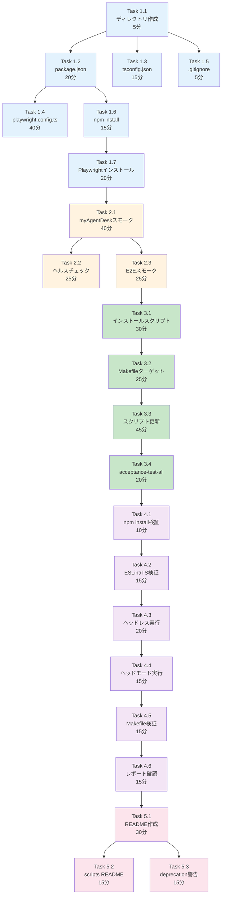

# 作業計画書: Issue #216 - Playwright受入テスト環境構築

## Issue: Playwright受入テスト環境構築

**Issue番号**: #216
**親Issue**: #209 (開発プロセス改善)
**Phase**: Phase 3: テスト実行環境整備
**サイズ**: M (8時間)
**作業見積**: 8時間
**優先度**: Medium
**依存Issue**:
- #213 (受入テストディレクトリ構造作成) - 必須
**ブロック対象**:
- #217 (CLAUDE.md 開発プロセス更新)

---

## 1. 現状分析

### 1.1 既存myAgentDesk E2Eテスト構成

```
myAgentDesk/tests/e2e/
├── home.test.ts           # ホームページテスト
├── create-job.test.ts     # ジョブ作成テスト
├── schedule.test.ts       # スケジュールテスト
├── slides.test.ts         # スライドテスト
├── port8003-interaction.spec.ts  # API連携テスト
└── mlops/                 # MLOps関連テスト
    ├── candidate-selection.spec.ts
    ├── dashboard.spec.ts
    ├── feedback.spec.ts
    └── responsive.spec.ts
```

**合計**: 9テストファイル

### 1.2 現行playwright.config.ts

```typescript
// myAgentDesk/playwright.config.ts
const config: PlaywrightTestConfig = {
  webServer: {
    command: 'npm run dev',
    port: 5173,
    reuseExistingServer: !process.env.CI,
    timeout: 120 * 1000
  },
  testDir: 'tests/e2e',
  timeout: 30000,
  fullyParallel: true,
  reporter: [['html'], ['list']],
  use: {
    baseURL: 'http://localhost:5173',
    trace: 'on-first-retry',
    screenshot: 'only-on-failure'
  }
};
```

### 1.3 移行先ディレクトリ構造

設計方針書セクション1.3より:

```
tests/acceptance/typescript/
├── playwright.config.ts    # Playwright設定
├── package.json            # npm依存関係
├── tsconfig.json           # TypeScript設定
│
├── ui/                     # UIテスト
│   ├── myagentdesk.spec.ts
│   └── commonui.spec.ts
│
└── e2e/                    # E2Eテスト
    └── full_flow.spec.ts
```

### 1.4 Playwright依存関係

myAgentDesk package.jsonより:

| パッケージ | バージョン | 用途 |
|-----------|----------|------|
| `@playwright/test` | ^1.40.0 | テストフレームワーク |
| `typescript` | ^5.3.3 | TypeScript |

---

## 2. 詳細タスク分解

### Phase 1: ディレクトリ・設定ファイル作成（2時間）

- [ ] **Task 1.1**: ディレクトリ作成
  - 所要時間: 5分
  - 成果物: `tests/acceptance/typescript/ui/`, `tests/acceptance/typescript/e2e/`
  - 依存: なし

- [ ] **Task 1.2**: package.json作成
  - 所要時間: 20分
  - 成果物: `tests/acceptance/typescript/package.json`
  - 依存: Task 1.1
  - 内容:
    - @playwright/test ^1.40.0
    - typescript ^5.3.3
    - scripts: test, test:ui, test:e2e

- [ ] **Task 1.3**: tsconfig.json作成
  - 所要時間: 15分
  - 成果物: `tests/acceptance/typescript/tsconfig.json`
  - 依存: Task 1.1
  - 内容: ESM対応、厳格モード

- [ ] **Task 1.4**: playwright.config.ts作成
  - 所要時間: 40分
  - 成果物: `tests/acceptance/typescript/playwright.config.ts`
  - 依存: Task 1.2
  - 内容:
    - 複数プロジェクト（UI, E2E）対応
    - ヘッドレス/ヘッドモード切替
    - タイムアウト設定（環境変数対応）
    - レポート出力設定

- [ ] **Task 1.5**: .gitignore作成
  - 所要時間: 5分
  - 成果物: `tests/acceptance/typescript/.gitignore`
  - 依存: Task 1.1
  - 内容: node_modules, playwright-report, test-results

- [ ] **Task 1.6**: npm install実行
  - 所要時間: 15分
  - 作業: `cd tests/acceptance/typescript && npm install`
  - 依存: Task 1.2

- [ ] **Task 1.7**: Playwrightブラウザインストール
  - 所要時間: 20分
  - 作業: `npx playwright install chromium`
  - 依存: Task 1.6

### Phase 2: スモークテスト作成（1時間30分）

- [ ] **Task 2.1**: myAgentDeskスモークテスト
  - 所要時間: 40分
  - 成果物: `tests/acceptance/typescript/ui/myagentdesk-smoke.spec.ts`
  - 依存: Phase 1完了
  - 内容:
    - ページ読み込み確認
    - タイトル検証
    - 主要ナビゲーション存在確認

- [ ] **Task 2.2**: ヘルスチェックテスト
  - 所要時間: 25分
  - 成果物: `tests/acceptance/typescript/ui/health-check.spec.ts`
  - 依存: Task 2.1
  - 内容:
    - サービス起動状態確認
    - API疎通確認

- [ ] **Task 2.3**: E2Eスモークテスト
  - 所要時間: 25分
  - 成果物: `tests/acceptance/typescript/e2e/smoke.spec.ts`
  - 依存: Task 2.1
  - 内容:
    - 基本的なユーザーフロー確認
    - 画面遷移テスト

### Phase 3: Makefile・スクリプト統合（2時間）

- [ ] **Task 3.1**: Playwrightインストールスクリプト作成
  - 所要時間: 30分
  - 成果物: `scripts/install-playwright.sh`
  - 依存: Phase 2完了
  - 内容:
    - npm依存関係インストール
    - ブラウザインストール
    - 環境確認

- [ ] **Task 3.2**: acceptance-test-frontend Makefileターゲット
  - 所要時間: 25分
  - 成果物: Makefile追記
  - 依存: Task 3.1
  - 内容:
    ```makefile
    acceptance-test-frontend: _check-frontend
        ./scripts/run-acceptance-tests.sh --layer frontend
    ```

- [ ] **Task 3.3**: run-acceptance-tests.sh Frontend対応
  - 所要時間: 45分
  - 成果物: `scripts/run-acceptance-tests.sh` 更新
  - 依存: Task 3.2
  - 内容:
    - `--layer frontend` オプション追加
    - Playwright実行統合
    - レポート出力設定

- [ ] **Task 3.4**: acceptance-test-all ターゲット更新
  - 所要時間: 20分
  - 成果物: Makefile更新
  - 依存: Task 3.3
  - 内容: Python + TypeScript両方実行

### Phase 4: 検証（1時間30分）

- [ ] **Task 4.1**: npm install検証
  - 所要時間: 10分
  - 作業: `cd tests/acceptance/typescript && npm install`
  - 依存: Phase 3完了

- [ ] **Task 4.2**: ESLint/TypeScript検証
  - 所要時間: 15分
  - 作業: `npm run lint && npm run type-check`
  - 依存: Task 4.1

- [ ] **Task 4.3**: スモークテスト実行（ヘッドレス）
  - 所要時間: 20分
  - 作業: `npx playwright test --project=ui`
  - 依存: Task 4.2

- [ ] **Task 4.4**: スモークテスト実行（ヘッドモード）
  - 所要時間: 15分
  - 作業: `npx playwright test --headed`
  - 依存: Task 4.3

- [ ] **Task 4.5**: Makefileターゲット検証
  - 所要時間: 15分
  - 作業: `make acceptance-test-frontend`
  - 依存: Task 4.4

- [ ] **Task 4.6**: レポート出力確認
  - 所要時間: 15分
  - 作業: playwright-report確認
  - 依存: Task 4.5

### Phase 5: ドキュメント（1時間）

- [ ] **Task 5.1**: README.md作成
  - 所要時間: 30分
  - 成果物: `tests/acceptance/typescript/README.md`
  - 依存: Phase 4完了
  - 内容:
    - セットアップ手順
    - テスト実行方法
    - 設定オプション

- [ ] **Task 5.2**: scripts/README.md更新
  - 所要時間: 15分
  - 成果物: `scripts/README.md` 更新
  - 依存: Task 5.1
  - 内容: install-playwright.sh説明追加

- [ ] **Task 5.3**: myAgentDesk E2Eへのdeprecation警告
  - 所要時間: 15分
  - 成果物: `myAgentDesk/tests/e2e/README.md`
  - 依存: Task 5.1
  - 内容: 移行先案内

---

## 3. タスク依存関係



---

## 4. 作業スケジュール

### セッション1（4時間）

| 時間 | タスク | 成果物 |
|------|--------|--------|
| 0:00-0:05 | Task 1.1 ディレクトリ | ディレクトリ構造 |
| 0:05-0:25 | Task 1.2 package.json | 依存関係定義 |
| 0:25-0:40 | Task 1.3 tsconfig.json | TypeScript設定 |
| 0:40-0:45 | Task 1.5 .gitignore | 除外設定 |
| 0:45-1:25 | Task 1.4 playwright.config.ts | Playwright設定 |
| 1:25-1:40 | Task 1.6 npm install | 依存解決 |
| 1:40-2:00 | Task 1.7 Playwrightインストール | ブラウザ準備 |
| 2:00-2:40 | Task 2.1 myAgentDeskスモーク | スモークテスト |
| 2:40-3:05 | Task 2.2 ヘルスチェック | ヘルスチェックテスト |
| 3:05-3:30 | Task 2.3 E2Eスモーク | E2Eテスト |
| 3:30-4:00 | Task 3.1 インストールスクリプト | インストーラ |

### セッション2（4時間）

| 時間 | タスク | 成果物 |
|------|--------|--------|
| 0:00-0:25 | Task 3.2 Makefileターゲット | Makefile更新 |
| 0:25-1:10 | Task 3.3 スクリプト更新 | Frontend対応 |
| 1:10-1:30 | Task 3.4 acceptance-test-all | 統合ターゲット |
| 1:30-1:40 | Task 4.1 npm install検証 | 依存確認 |
| 1:40-1:55 | Task 4.2 ESLint/TS検証 | 品質確認 |
| 1:55-2:15 | Task 4.3 ヘッドレス実行 | 自動テスト確認 |
| 2:15-2:30 | Task 4.4 ヘッドモード実行 | 手動確認 |
| 2:30-2:45 | Task 4.5 Makefile検証 | 統合確認 |
| 2:45-3:00 | Task 4.6 レポート確認 | 出力確認 |
| 3:00-3:30 | Task 5.1 README作成 | ドキュメント |
| 3:30-3:45 | Task 5.2 scripts README | スクリプト説明 |
| 3:45-4:00 | Task 5.3 deprecation警告 | 移行案内 |

**総作業時間**: 8時間

---

## 5. 設定ファイル詳細設計

### 5.1 package.json

```json
{
  "name": "myswiftagent-acceptance-tests",
  "version": "1.0.0",
  "description": "TypeScript/Playwright acceptance tests for MySwiftAgent",
  "type": "module",
  "scripts": {
    "test": "playwright test",
    "test:ui": "playwright test --project=ui",
    "test:e2e": "playwright test --project=e2e",
    "test:headed": "playwright test --headed",
    "test:debug": "playwright test --debug",
    "report": "playwright show-report",
    "lint": "eslint . --ext .ts",
    "type-check": "tsc --noEmit"
  },
  "devDependencies": {
    "@playwright/test": "^1.40.0",
    "@typescript-eslint/eslint-plugin": "^6.15.0",
    "@typescript-eslint/parser": "^6.15.0",
    "eslint": "^8.56.0",
    "typescript": "^5.3.3"
  }
}
```

### 5.2 playwright.config.ts

```typescript
import { defineConfig, devices } from '@playwright/test';

const MYAGENTDESK_PORT = process.env.MYAGENTDESK_PORT || '5173';
const TIMEOUT_MS = parseInt(process.env.PLAYWRIGHT_TIMEOUT || '30000', 10);

export default defineConfig({
  testDir: '.',
  fullyParallel: true,
  forbidOnly: !!process.env.CI,
  retries: process.env.CI ? 2 : 0,
  workers: process.env.CI ? 1 : undefined,

  timeout: TIMEOUT_MS,

  reporter: [
    ['html', { outputFolder: '../../../test-reports/acceptance/playwright' }],
    ['list'],
    ['junit', { outputFile: '../../../test-reports/acceptance/playwright-results.xml' }]
  ],

  use: {
    baseURL: `http://localhost:${MYAGENTDESK_PORT}`,
    trace: 'on-first-retry',
    screenshot: 'only-on-failure',
    video: 'retain-on-failure',
  },

  projects: [
    {
      name: 'ui',
      testDir: './ui',
      use: { ...devices['Desktop Chrome'] },
    },
    {
      name: 'e2e',
      testDir: './e2e',
      use: { ...devices['Desktop Chrome'] },
      dependencies: ['ui'],  // UIテスト後にE2E実行
    },
  ],
});
```

### 5.3 スモークテスト例

```typescript
// tests/acceptance/typescript/ui/myagentdesk-smoke.spec.ts
import { test, expect } from '@playwright/test';

test.describe('myAgentDesk Smoke Tests', () => {
  test('should load home page', async ({ page }) => {
    await page.goto('/');
    await expect(page).toHaveTitle(/myAgentDesk/);
  });

  test('should display main navigation', async ({ page }) => {
    await page.goto('/');
    const nav = page.locator('nav').or(page.locator('[data-testid="sidebar"]'));
    await expect(nav.first()).toBeVisible();
  });

  test('should be responsive', async ({ page }) => {
    await page.setViewportSize({ width: 375, height: 667 });
    await page.goto('/');
    await expect(page.locator('body')).toBeVisible();
  });
});
```

---

## 6. チェックポイント

| タイミング | 確認事項 | 対応 |
|-----------|---------|------|
| Phase 1完了時 | npm install成功 | package.json修正 |
| Task 2.1完了時 | テスト構文正常 | TypeScriptエラー確認 |
| Phase 3完了時 | Makefile動作 | make help確認 |
| Phase 4完了時 | 全テストパス | 失敗時は個別修正 |

---

## 7. リスクと対策

| リスク | 発生確率 | 影響 | 対策 |
|-------|---------|------|------|
| Playwrightブラウザインストール失敗 | 中 | テスト実行不可 | npx playwright install --with-deps |
| ポート競合 | 中 | 接続失敗 | 環境変数でポート上書き |
| myAgentDesk未起動 | 高 | テスト失敗 | ヘルスチェック事前確認 |
| headless動作問題 | 低 | CI実行不可 | Xvfb設定（Linux環境） |

---

## 8. 成果物チェックリスト

### ディレクトリ・ファイル
- [ ] `tests/acceptance/typescript/package.json`
- [ ] `tests/acceptance/typescript/tsconfig.json`
- [ ] `tests/acceptance/typescript/playwright.config.ts`
- [ ] `tests/acceptance/typescript/.gitignore`
- [ ] `tests/acceptance/typescript/ui/myagentdesk-smoke.spec.ts`
- [ ] `tests/acceptance/typescript/ui/health-check.spec.ts`
- [ ] `tests/acceptance/typescript/e2e/smoke.spec.ts`
- [ ] `tests/acceptance/typescript/README.md`
- [ ] `scripts/install-playwright.sh`

### Makefile
- [ ] `acceptance-test-frontend` ターゲット
- [ ] `acceptance-test-all` 更新

### 品質確認
- [ ] ESLint/TypeScript エラーゼロ
- [ ] `npm install` 成功
- [ ] `npx playwright test` 成功

---

## 9. Definition of Done

### 自動検証可能な基準

**機能要件**:
- [ ] `playwright.config.ts` が存在し適切に設定されている
- [ ] `npm install` が正常に完了する
- [ ] `npx playwright test` が正常に実行される
- [ ] スモークテストがパスする
- [ ] `make acceptance-test-frontend` が正常に実行される

**品質基準**:
- [ ] ESLint/TypeScript エラーゼロ
- [ ] playwright.config.tsにタイムアウト設定がある

**テストケース**:
- [ ] 正常系: myAgentDeskのスモークテスト
- [ ] 正常系: ページタイトル検証
- [ ] 異常系: サービス未起動時のエラーメッセージ

### 手動検証が必要な基準

**UX/UI検証**:
- [ ] テスト結果レポートが見やすい
- [ ] スクリーンショットが適切に保存される

**運用検証**:
- [ ] 実際のUI操作がテストできる
- [ ] ヘッドレスモードとヘッドモードの切り替えが可能

---

## 10. 次のアクション

作業計画承認後：
1. **依存Issue確認**: #213の完了を確認
2. **ブランチ作成**: `feature/issue/216`
3. **worktree作成**: `./scripts/worktree-create-from-issue.sh 216`
4. **タスク実行**: Phase 1から順次実行
5. **進捗報告**: 完了時に `/progress-report`

---

## 11. 参照ドキュメント

- [設計方針書](../issue/209/design-policy.md) - セクション2.2（TypeScriptテストスタック）
- [Issue分割計画書](../issue/209/issue-split.md)
- [Playwright公式ドキュメント](https://playwright.dev/docs/intro)
- [品質基準](../../docs/claude/04-quality-standards.md)

---

## 12. 注意事項

### 既存E2Eテストの移行

本Issue (#216) では環境構築のみを行い、myAgentDeskの既存E2Eテスト（9ファイル）の移行は含みません。
テスト移行は別途Issueで対応することを推奨します。

移行対象候補:
```
myAgentDesk/tests/e2e/
├── home.test.ts
├── create-job.test.ts
├── schedule.test.ts
├── slides.test.ts
├── port8003-interaction.spec.ts
└── mlops/ (4ファイル)
```

### ポート設定

環境変数でポートを上書き可能にすることで、worktree環境など
ポートが異なる環境でも動作可能にします。

```bash
MYAGENTDESK_PORT=5204 npx playwright test
```

### Issue #215との連携

`scripts/run-acceptance-tests.sh`（Issue #215）に `--layer frontend` オプションを追加して
Playwright実行を統合します。

---

**作成日**: 2025-12-04
**作成者**: Claude Code
**ステータス**: 承認待ち
