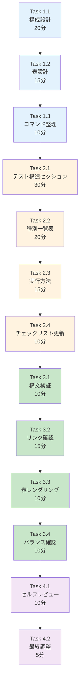

# 作業計画書: Issue #217 - CLAUDE.md 開発プロセス更新

## Issue: CLAUDE.md 開発プロセス更新

**Issue番号**: #217
**親Issue**: #209 (開発プロセス改善)
**Phase**: Phase 4: ドキュメント更新
**サイズ**: S (3時間)
**作業見積**: 3時間
**優先度**: High
**依存Issue**:
- #214 (CI除外設定の追加) - 必須
- #215 (Python受入テスト実行スクリプト作成) - 必須
- #216 (Playwright受入テスト環境構築) - 必須
**ブロック対象**:
- #218 (品質基準ドキュメント更新)
- #219 (開発ワークフロードキュメント更新)
- #220 (Issue分割ガイド更新)

---

## 1. 現状分析

### 1.1 現在のCLAUDE.md構成

```
CLAUDE.md (160行)
├── # CLAUDE.md（ヘッダー）
├── ## ✨ 特徴
├── ## 🚀 クイックスタート
│   ├── ### 📋 必須制約条件
│   │   ├── コード品質原則
│   │   ├── 品質基準
│   │   └── 開発ワークフロー
├── ## 📚 詳細ドキュメントインデックス
├── ## 🚨 重要な参照ドキュメント
│   └── ### 📚 プロジェクト別必須ドキュメント
├── ## 🔍 用途別クイックリンク
├── ## 🤖 Claude Code向けガイドライン
├── ## 📋 開発時チェックリスト    ← 更新対象
└── ## 📊 現在のプロジェクト一覧
```

### 1.2 追加予定セクション

| 追加位置 | セクション名 | 内容 |
|---------|-------------|------|
| 「品質基準」の後 | 🧪 テスト構造 | テストの種類と実行場所 |
| 上記の子セクション | テスト種別一覧 | 表形式で整理 |
| 上記の子セクション | 受入テスト実行方法 | コマンド例 |
| 既存セクション更新 | 📋 開発時チェックリスト | 受入テスト項目追加 |

### 1.3 参照する設計方針書

設計方針書セクション1より:
- テストアーキテクチャ全体像（ASCII図）
- テストの種類と実行場所
- レイヤー構成

---

## 2. 詳細タスク分解

### Phase 1: セクション設計（45分）

- [ ] **Task 1.1**: 追加セクションの構成設計
  - 所要時間: 20分
  - 成果物: セクション構成案（メモ）
  - 依存: なし
  - 内容:
    - 見出しレベル決定
    - 既存セクションとの整合性確認
    - 追加位置の最終決定

- [ ] **Task 1.2**: テスト種別一覧表の設計
  - 所要時間: 15分
  - 成果物: 表構造設計
  - 依存: Task 1.1
  - 内容:
    - 列項目決定（種類、場所、実行環境、コマンド）
    - 行項目決定（単体、結合、受入）

- [ ] **Task 1.3**: コマンド例の整理
  - 所要時間: 10分
  - 成果物: コマンドリスト
  - 依存: Task 1.2
  - 内容:
    - make acceptance-test-* コマンド
    - pytest/playwright直接実行コマンド

### Phase 2: CLAUDE.md編集（1時間15分）

- [ ] **Task 2.1**: 「🧪 テスト構造」セクション作成
  - 所要時間: 30分
  - 成果物: CLAUDE.md更新
  - 依存: Phase 1完了
  - 内容:
    - セクション見出し追加
    - テストアーキテクチャ概要（簡潔版）
    - 設計方針書へのリンク

- [ ] **Task 2.2**: テスト種別一覧表の作成
  - 所要時間: 20分
  - 成果物: CLAUDE.md更新
  - 依存: Task 2.1
  - 内容:
    ```markdown
    | テスト種別 | 場所 | 実行環境 | コマンド例 |
    |-----------|------|---------|-----------|
    | 単体テスト | プロジェクト内 | CI | `uv run pytest` |
    | 結合テスト | tests/integration/ | CI | `uv run pytest tests/integration/` |
    | 受入テスト | tests/acceptance/ | ローカルのみ | `make acceptance-test-*` |
    ```

- [ ] **Task 2.3**: 受入テスト実行方法セクション
  - 所要時間: 15分
  - 成果物: CLAUDE.md更新
  - 依存: Task 2.2
  - 内容:
    - コマンド例（コードブロック）
    - 注意事項（APIキー必要等）

- [ ] **Task 2.4**: 開発時チェックリスト更新
  - 所要時間: 10分
  - 成果物: CLAUDE.md更新
  - 依存: Task 2.3
  - 内容:
    - 受入テスト実行項目追加
    - 既存項目との整合性確認

### Phase 3: 検証（45分）

- [ ] **Task 3.1**: Markdown構文検証
  - 所要時間: 10分
  - 作業: Markdownプレビュー確認
  - 依存: Phase 2完了

- [ ] **Task 3.2**: リンク有効性確認
  - 所要時間: 15分
  - 作業: 全リンクをクリックして確認
  - 依存: Task 3.1

- [ ] **Task 3.3**: 表レンダリング確認
  - 所要時間: 10分
  - 作業: GitHub上での表示確認
  - 依存: Task 3.2

- [ ] **Task 3.4**: 全体バランス確認
  - 所要時間: 10分
  - 作業: 既存セクションとの整合性確認
  - 依存: Task 3.3

### Phase 4: レビュー・調整（15分）

- [ ] **Task 4.1**: セルフレビュー
  - 所要時間: 10分
  - 作業: 新規開発者視点での可読性確認
  - 依存: Phase 3完了

- [ ] **Task 4.2**: 最終調整
  - 所要時間: 5分
  - 作業: 軽微な修正
  - 依存: Task 4.1

---

## 3. タスク依存関係



---

## 4. 作業スケジュール

### セッション（3時間）

| 時間 | タスク | 成果物 |
|------|--------|--------|
| 0:00-0:20 | Task 1.1 構成設計 | セクション構成案 |
| 0:20-0:35 | Task 1.2 表設計 | 表構造設計 |
| 0:35-0:45 | Task 1.3 コマンド整理 | コマンドリスト |
| 0:45-1:15 | Task 2.1 テスト構造セクション | CLAUDE.md更新 |
| 1:15-1:35 | Task 2.2 種別一覧表 | CLAUDE.md更新 |
| 1:35-1:50 | Task 2.3 実行方法 | CLAUDE.md更新 |
| 1:50-2:00 | Task 2.4 チェックリスト更新 | CLAUDE.md更新 |
| 2:00-2:10 | Task 3.1 構文検証 | 検証結果 |
| 2:10-2:25 | Task 3.2 リンク確認 | 確認結果 |
| 2:25-2:35 | Task 3.3 表レンダリング | 確認結果 |
| 2:35-2:45 | Task 3.4 バランス確認 | 確認結果 |
| 2:45-2:55 | Task 4.1 セルフレビュー | レビュー結果 |
| 2:55-3:00 | Task 4.2 最終調整 | 最終版 |

**総作業時間**: 3時間

---

## 5. 追加セクション詳細設計

### 5.1 追加位置

```markdown
## 🚀 クイックスタート

### 📋 必須制約条件
（既存）

#### 品質基準
（既存）

### 🧪 テスト構造   ← 新規追加

（新規セクション内容）

#### 開発ワークフロー
（既存）
```

### 5.2 追加セクション内容案

```markdown
### 🧪 テスト構造

テストは3層構造で、実行環境が異なります：

| テスト種別 | 場所 | 実行環境 | カバレッジ目標 |
|-----------|------|---------|--------------|
| **単体テスト** | `{project}/tests/unit/` | CI (GitHub Actions) | 90%以上 |
| **結合テスト** | `tests/integration/` | CI (GitHub Actions) | 50%以上 |
| **受入テスト** | `tests/acceptance/` | ローカルのみ | - |

#### 受入テスト実行方法

受入テストはAPIキーや実サービス接続が必要なため、**ローカル環境でのみ実行**します：

```bash
# Platform層テスト（myVault, jobqueue等）
make acceptance-test-platform

# Agent層テスト（expertAgent, graphAiServer）
make acceptance-test-agent

# Frontend層テスト（myAgentDesk - Playwright）
make acceptance-test-frontend

# 全受入テスト実行
make acceptance-test-all
```

> ⚠️ **注意**: 受入テストの実行には環境変数（APIキー等）の設定が必要です。
> 詳細は [acceptance-testing.md](./docs/spec/acceptance-testing.md) を参照してください。
```

### 5.3 チェックリスト更新内容

```markdown
## 📋 開発時チェックリスト

- [ ] コード品質原則（SOLID、KISS、YAGNI、DRY）に従っている
- [ ] テストカバレッジ要件を満たしている（単体90%、結合50%）
- [ ] 静的解析エラーがない（Ruff、MyPy）
- [ ] 適切なブランチで作業している
- [ ] PRラベルを正しく設定している
- [ ] コミット前に `./scripts/pre-push-check-all.sh` を実行している
- [ ] 必要なドキュメントを `./dev-reports/{branch_path}/` に作成している
- [ ] **受入テストが必要な機能の場合、ローカルで受入テストを実行している** ← 追加
```

---

## 6. チェックポイント

| タイミング | 確認事項 | 対応 |
|-----------|---------|------|
| Phase 1完了時 | 構成が既存と調和 | 不自然なら再設計 |
| Phase 2完了時 | Markdownプレビュー正常 | 構文エラー修正 |
| Phase 3完了時 | 全リンク有効 | 無効リンク修正 |
| Phase 4完了時 | 可読性確認 | 文言調整 |

---

## 7. リスクと対策

| リスク | 発生確率 | 影響 | 対策 |
|-------|---------|------|------|
| 既存セクションとの重複 | 低 | 冗長なドキュメント | 設計時に確認 |
| リンク切れ | 中 | 参照不可 | Phase 3で検証 |
| 表が長すぎる | 低 | 可読性低下 | 簡潔に保つ |
| 依存Issue未完了 | 中 | コマンド例が不正確 | 依存確認後に作業開始 |

---

## 8. 成果物チェックリスト

### 変更ファイル
- [ ] `CLAUDE.md`

### 追加セクション
- [ ] 「🧪 テスト構造」セクション
- [ ] テスト種別一覧表
- [ ] 受入テスト実行方法
- [ ] 開発時チェックリスト更新

### 品質確認
- [ ] Markdownシンタックスエラーなし
- [ ] 全リンク有効
- [ ] 表レンダリング正常
- [ ] 既存セクションとの整合性

---

## 9. Definition of Done

### 自動検証可能な基準

**機能要件**:
- [ ] CLAUDE.mdに「テスト構造」セクションが存在する
- [ ] テストの種類と実行場所の表が含まれている
- [ ] `make acceptance-test-*` コマンド例が記載されている
- [ ] Markdownシンタックスエラーがない

**品質基準**:
- [ ] リンクが全て有効
- [ ] コードブロックの言語指定が正しい

**テストケース**:
- [ ] 正常系: Markdownレンダリングが正常

### 手動検証が必要な基準

**UX/UI検証**:
- [ ] ドキュメントが分かりやすい
- [ ] 新規開発者がCLAUDE.mdのみでテスト方法を理解できる

---

## 10. 次のアクション

作業計画承認後：
1. **依存Issue確認**: #214, #215, #216の完了を確認
2. **ブランチ作成**: `feature/issue/217`
3. **worktree作成**: `./scripts/worktree-create-from-issue.sh 217`
4. **タスク実行**: Phase 1から順次実行
5. **進捗報告**: 完了時に `/progress-report`

---

## 11. 参照ドキュメント

- [設計方針書](../issue/209/design-policy.md) - セクション1（テストアーキテクチャ）
- [Issue分割計画書](../issue/209/issue-split.md)
- [品質基準](../../docs/claude/04-quality-standards.md)

---

## 12. 注意事項

### 依存Issueの完了確認

本Issue (#217) は以下の3つのIssueに依存しています：
- #214: CI除外設定 → `tests/acceptance/` がCI除外されている
- #215: Python受入テストスクリプト → `make acceptance-test-*` コマンドが使用可能
- #216: Playwright環境 → `make acceptance-test-frontend` が使用可能

これらが完了していないと、コマンド例が不正確になる可能性があります。

### CLAUDE.mdのモジュール化方針

CLAUDE.mdは160行に簡潔化されており、詳細は各モジュールファイルに委譲されています。
追加するセクションも簡潔に保ち、詳細は既存ドキュメントへリンクする方針とします。

---

**作成日**: 2025-12-04
**作成者**: Claude Code
**ステータス**: 承認待ち
