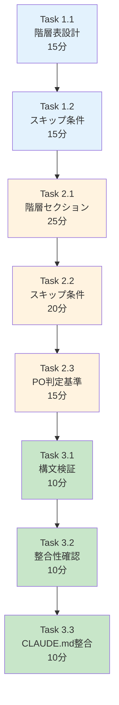

# 作業計画書: Issue #218 - 品質基準ドキュメント更新

## Issue: 品質基準ドキュメント更新

**Issue番号**: #218
**親Issue**: #209 (開発プロセス改善)
**Phase**: Phase 4: ドキュメント更新
**サイズ**: S (2時間)
**作業見積**: 2時間
**優先度**: Medium
**依存Issue**:
- #217 (CLAUDE.md 開発プロセス更新) - 必須
**ブロック対象**: なし

---

## 1. 現状分析

### 1.1 現在の04-quality-standards.md構成

```
docs/claude/04-quality-standards.md (221行)
├── ## 🐍 Python開発環境
│   ├── 環境構築ツール
│   ├── セットアップ手順
│   └── プロジェクト構成
├── ## 🛡️ 品質担保方針
│   ├── 原理原則 (SOLID, KISS, YAGNI, DRY)
│   ├── 静的解析・コード品質
│   ├── テスト方針              ← 更新対象
│   ├── 必須チェック項目
│   └── CI/CD との連携
├── ## ログ設定
└── ## 🤖 AI開発支援
```

### 1.2 既存テスト方針セクション

現在の「テスト方針」セクション（行75-106）:
- テストレベル表（単体/結合）
- カバレッジ要件の設計思想
- CI/CDでの運用

**不足している内容**:
- テスト階層（Level 1-4）
- 受入テストの位置づけ
- スキップ条件ラベル
- PO受入テストの判定基準

### 1.3 追加予定内容

設計方針書セクション3.1より:

| レベル | テスト種別 | 実行環境 | 特徴 |
|-------|-----------|---------|------|
| Level 1 | 単体テスト | CI | 高速、モック多用 |
| Level 2 | 結合テスト | CI | API間通信 |
| Level 3 | 受入テスト（開発者） | ローカル | APIキー必要 |
| Level 4 | 受入テスト（PO） | ローカル | UX/UI検証 |

---

## 2. 詳細タスク分解

### Phase 1: 内容設計（30分）

- [ ] **Task 1.1**: テスト階層表の設計
  - 所要時間: 15分
  - 成果物: 表構造設計
  - 依存: なし
  - 内容:
    - Level 1-4の定義
    - 既存表との整合性確認

- [ ] **Task 1.2**: スキップ条件の整理
  - 所要時間: 15分
  - 成果物: スキップ条件リスト
  - 依存: Task 1.1
  - 内容:
    - docs-only ラベル
    - internal ラベル
    - test-only ラベル

### Phase 2: ドキュメント編集（1時間）

- [ ] **Task 2.1**: テスト階層セクション追加
  - 所要時間: 25分
  - 成果物: 04-quality-standards.md更新
  - 依存: Phase 1完了
  - 内容:
    - Test Pyramid図の追加
    - Level 1-4の説明

- [ ] **Task 2.2**: 受入テストスキップ条件セクション
  - 所要時間: 20分
  - 成果物: 04-quality-standards.md更新
  - 依存: Task 2.1
  - 内容:
    - スキップ条件ラベル表
    - 使用例

- [ ] **Task 2.3**: PO受入テスト判定基準追加
  - 所要時間: 15分
  - 成果物: 04-quality-standards.md更新
  - 依存: Task 2.2
  - 内容:
    - PO受入テストが必要なPRの条件
    - 判定フローチャート

### Phase 3: 検証（30分）

- [ ] **Task 3.1**: Markdown構文検証
  - 所要時間: 10分
  - 作業: Markdownプレビュー確認
  - 依存: Phase 2完了

- [ ] **Task 3.2**: 既存セクションとの整合性確認
  - 所要時間: 10分
  - 作業: 矛盾がないか確認
  - 依存: Task 3.1

- [ ] **Task 3.3**: CLAUDE.mdとの整合性確認
  - 所要時間: 10分
  - 作業: #217で追加した内容との整合
  - 依存: Task 3.2

---

## 3. タスク依存関係



---

## 4. 作業スケジュール

### セッション（2時間）

| 時間 | タスク | 成果物 |
|------|--------|--------|
| 0:00-0:15 | Task 1.1 階層表設計 | 表構造設計 |
| 0:15-0:30 | Task 1.2 スキップ条件整理 | 条件リスト |
| 0:30-0:55 | Task 2.1 階層セクション追加 | MD更新 |
| 0:55-1:15 | Task 2.2 スキップ条件セクション | MD更新 |
| 1:15-1:30 | Task 2.3 PO判定基準追加 | MD更新 |
| 1:30-1:40 | Task 3.1 構文検証 | 検証結果 |
| 1:40-1:50 | Task 3.2 整合性確認 | 確認結果 |
| 1:50-2:00 | Task 3.3 CLAUDE.md整合 | 確認結果 |

**総作業時間**: 2時間

---

## 5. 追加セクション詳細設計

### 5.1 テスト階層表

```markdown
### テスト階層（Test Pyramid）

| Level | テスト種別 | 場所 | 実行環境 | カバレッジ | 特徴 |
|-------|-----------|------|---------|-----------|------|
| **L1** | 単体テスト | `{project}/tests/unit/` | CI | 90%+ | 高速、モック多用 |
| **L2** | 結合テスト | `tests/integration/` | CI | 50%+ | API間通信、DB接続 |
| **L3** | 受入テスト（開発者） | `tests/acceptance/` | ローカル | - | APIキー必要、E2E |
| **L4** | 受入テスト（PO） | - | 手動 | - | UX/UI検証 |

```
                    ┌─────────┐
                   /│  L4 PO  │\        ← 手動確認
                  / │ 受入    │ \
                 /  └─────────┘  \
                /   ┌─────────┐   \
               /    │ L3 開発 │    \    ← ローカル実行
              /     │ 受入    │     \
             /      └─────────┘      \
            /      ┌───────────┐      \
           /       │ L2 結合   │       \ ← CI実行
          /        └───────────┘        \
         /        ┌───────────────┐      \
        /         │   L1 単体     │       \ ← CI実行
       /          └───────────────┘        \
      ────────────────────────────────────────
```
```

### 5.2 受入テストスキップ条件

```markdown
### 受入テストのスキップ条件

以下のラベルが付与されたPRは、L3/L4受入テストをスキップできます：

| ラベル | 説明 | 例 |
|-------|------|-----|
| `docs-only` | ドキュメントのみの変更 | README更新、仕様書修正 |
| `internal` | 内部リファクタリング | コード整理、変数名変更 |
| `test-only` | テストコードのみの変更 | テスト追加、テスト修正 |
| `ci-only` | CI/CD設定のみの変更 | ワークフロー修正 |

> ⚠️ **注意**: ユーザー影響がある変更（機能追加、バグ修正、UI変更）は
> 必ずL3またはL4の受入テストを実施してください。
```

### 5.3 PO受入テスト判定基準

```markdown
### PO受入テスト（L4）が必要なPR

以下の条件に該当するPRは、PO（プロダクトオーナー）による手動受入テストが必要です：

**必須条件**:
- [ ] UI/UXに影響する変更
- [ ] 新機能の追加
- [ ] ユーザーフローの変更
- [ ] エラーメッセージの変更
- [ ] 課金・認証に関わる変更

**判定フロー**:
```
PRの変更内容
    ↓
ユーザーに見える変更か？
    ├── Yes → L4 PO受入テスト必要
    └── No → L3 開発者受入テストのみ
```
```

---

## 6. チェックポイント

| タイミング | 確認事項 | 対応 |
|-----------|---------|------|
| Phase 1完了時 | 設計に矛盾なし | 再設計 |
| Phase 2完了時 | Markdownプレビュー正常 | 構文修正 |
| Phase 3完了時 | 既存内容との整合 | 調整 |

---

## 7. リスクと対策

| リスク | 発生確率 | 影響 | 対策 |
|-------|---------|------|------|
| 既存セクションとの重複 | 低 | 冗長なドキュメント | 既存を確認して統合 |
| テスト階層の定義不明確 | 低 | 開発者の混乱 | 具体例を追加 |
| スキップ条件の乱用 | 中 | 品質低下 | 注意書きを明記 |

---

## 8. 成果物チェックリスト

### 変更ファイル
- [ ] `docs/claude/04-quality-standards.md`

### 追加セクション
- [ ] テスト階層表（Level 1-4）
- [ ] Test Pyramid図
- [ ] 受入テストスキップ条件
- [ ] PO受入テスト判定基準

### 品質確認
- [ ] Markdownシンタックスエラーなし
- [ ] 既存セクションとの整合性
- [ ] CLAUDE.mdとの整合性

---

## 9. Definition of Done

### 自動検証可能な基準

**機能要件**:
- [ ] 「テスト方針」セクションが更新されている
- [ ] テスト階層表が含まれている
- [ ] スキップ条件ラベル（docs-only, internal, test-only）が記載されている
- [ ] Markdownシンタックスエラーがない

**品質基準**:
- [ ] 既存のセクションとの整合性が取れている

### 手動検証が必要な基準

**ビジネスロジック検証**:
- [ ] テスト階層が要件定義書と一致している
- [ ] スキップ条件が運用に適している

---

## 10. 次のアクション

作業計画承認後：
1. **依存Issue確認**: #217の完了を確認
2. **ブランチ作成**: `feature/issue/218`
3. **worktree作成**: `./scripts/worktree-create-from-issue.sh 218`
4. **タスク実行**: Phase 1から順次実行
5. **進捗報告**: 完了時に `/progress-report`

---

## 11. 参照ドキュメント

- [設計方針書](../issue/209/design-policy.md) - セクション3.1（テスト分離パターン）
- [Issue分割計画書](../issue/209/issue-split.md)
- [CLAUDE.md](../../CLAUDE.md)

---

## 12. 注意事項

### 既存テスト方針との統合

現在の「テスト方針」セクション（行75-106）には既に単体テスト/結合テストの説明があります。
追加するテスト階層表はこれを**拡張**する形で記述し、既存内容と矛盾しないよう注意します。

### スキップ条件の運用

スキップ条件は「例外」として使用すべきであり、デフォルトではL3/L4テストを実施します。
ドキュメントには警告文を含めて、乱用を防ぎます。

---

**作成日**: 2025-12-04
**作成者**: Claude Code
**ステータス**: 承認待ち
