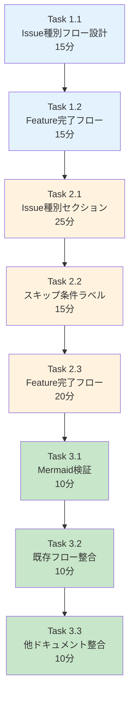
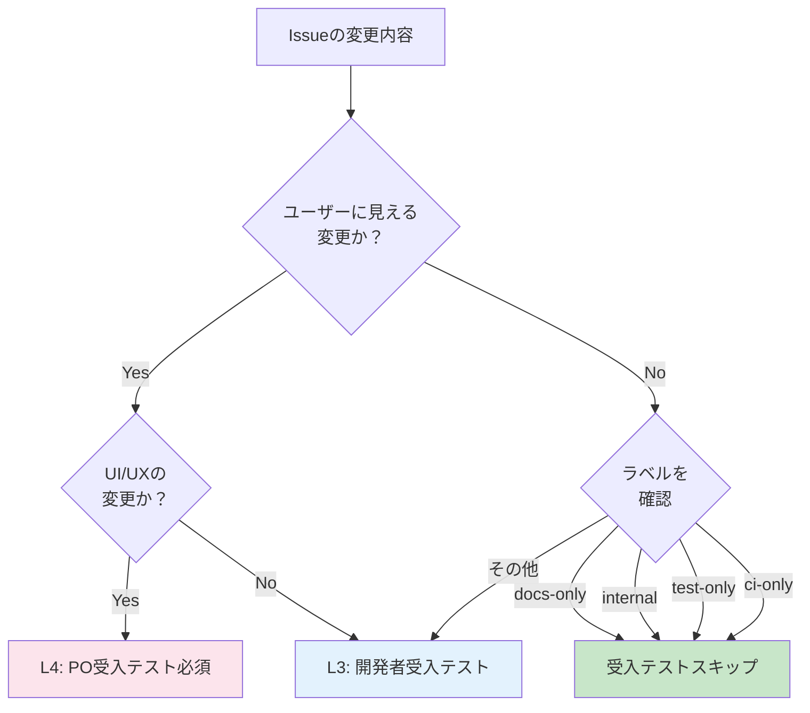
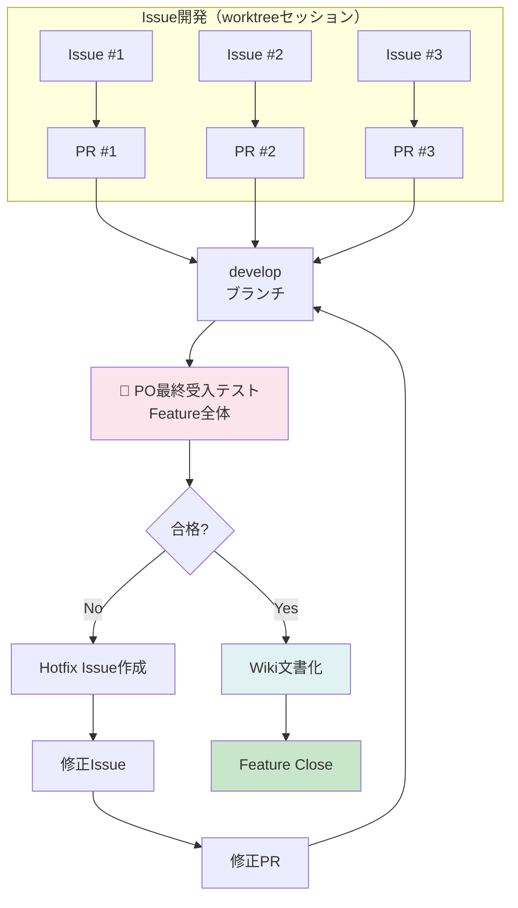

# 作業計画書: Issue #219 - 開発ワークフロードキュメント更新

## Issue: 開発ワークフロードキュメント更新

**Issue番号**: #219
**親Issue**: #209 (開発プロセス改善)
**Phase**: Phase 4: ドキュメント更新
**サイズ**: S (2時間)
**作業見積**: 2時間
**優先度**: Medium
**依存Issue**:
- #217 (CLAUDE.md 開発プロセス更新) - 必須
**ブロック対象**: なし

---

## 1. 現状分析

### 1.1 現在の01-development-workflow.md構成

```
docs/claude/01-development-workflow.md (500行)
├── ## 🚀 アジャイル開発ワークフロー
├── ## 📋 開発フロー概要
│   └── フロー図（Mermaid）
├── ## 🤖 開発フローとスラッシュコマンドマッピング
│   ├── セッション区分表
│   └── フェーズ1-19の詳細表
├── ## フェーズ9-12の実行方式
│   ├── パターンA: 個別実行
│   ├── パターンB: 一括委託
│   └── 比較図（Mermaid）
├── ## スキル実行フローの例
│   └── 詳細フロー図（Mermaid）
├── ## 🎯 Feature管理
├── ## 🎨 UIモックアップ作成プロセス
├── ## 🎯 新スキルによる品質向上プロセス
│   ├── TDD実装スキル
│   ├── 受入テストスキル           ← 更新対象
│   └── フィードバックループ       ← 更新対象
├── ## 📝 Issue管理
│   └── Issue分割の原則            ← 更新対象
├── ## 🌿 ブランチ・PR戦略
├── ## 🎛️ フィーチャーフラグ管理
└── ## 📚 ドキュメント管理
    └── Feature完了時の必須タスク  ← 更新対象
```

### 1.2 不足している内容

設計方針書（design-policy.md）を参照すると、以下の内容が不足:

1. **Issue種別ごとのテストフロー図**
   - 通常Issue（docs-only, internal, test-only）
   - 重要Issue（UI変更、新機能）
   - 各ラベルでの受入テストスキップ条件

2. **通常Issue vs 重要Issue のフロー説明**
   - L3開発者受入テストのみで完了するケース
   - L4 PO受入テストが必要なケース
   - 判断フローチャート

3. **Feature完了時のPO最終受入テストフロー**
   - 全Issueマージ後のPO統合テスト
   - Feature全体の動作確認
   - Wiki文書化への接続

### 1.3 追加予定内容のソース

設計方針書セクション1.1より（テスト階層）:

| レベル | テスト種別 | 実行環境 | 特徴 |
|-------|-----------|---------|------|
| L1 | 単体テスト | CI | 高速、モック多用 |
| L2 | 結合テスト | CI | API間通信 |
| L3 | 受入テスト（開発者） | ローカル | APIキー必要 |
| L4 | 受入テスト（PO） | ローカル | UX/UI検証 |

---

## 2. 詳細タスク分解

### Phase 1: フロー図設計（30分）

- [ ] **Task 1.1**: Issue種別ごとのテストフロー設計
  - 所要時間: 15分
  - 成果物: Mermaidフロー図設計
  - 依存: なし
  - 内容:
    - docs-only/internal/test-only ラベル時のフロー
    - 機能追加/UI変更時のフロー

- [ ] **Task 1.2**: Feature完了時テストフロー設計
  - 所要時間: 15分
  - 成果物: Mermaidフロー図設計
  - 依存: Task 1.1
  - 内容:
    - 全Issueマージ後のPO統合テスト
    - Feature Close判定フロー

### Phase 2: ドキュメント編集（1時間）

- [ ] **Task 2.1**: Issue種別テストフローセクション追加
  - 所要時間: 25分
  - 成果物: 01-development-workflow.md更新
  - 依存: Phase 1完了
  - 内容:
    - 「## 🧪 Issue種別ごとのテストフロー」セクション追加
    - 通常Issue vs 重要Issue の判断フロー図

- [ ] **Task 2.2**: スキップ条件ラベル説明追加
  - 所要時間: 15分
  - 成果物: 01-development-workflow.md更新
  - 依存: Task 2.1
  - 内容:
    - docs-only, internal, test-only ラベルの説明
    - 受入テストスキップの判断表

- [ ] **Task 2.3**: Feature完了時テストフロー追加
  - 所要時間: 20分
  - 成果物: 01-development-workflow.md更新
  - 依存: Task 2.2
  - 内容:
    - 「### Feature完了時のPO受入テスト」セクション追加
    - 統合テストフロー図
    - Wiki文書化への接続

### Phase 3: 検証（30分）

- [ ] **Task 3.1**: Mermaid構文検証
  - 所要時間: 10分
  - 作業: Mermaidプレビューで表示確認
  - 依存: Phase 2完了

- [ ] **Task 3.2**: 既存フローとの整合性確認
  - 所要時間: 10分
  - 作業: 既存のスキル実行フローとの整合
  - 依存: Task 3.1

- [ ] **Task 3.3**: CLAUDE.md/04-quality-standards.mdとの整合性確認
  - 所要時間: 10分
  - 作業: #217, #218で追加した内容との整合
  - 依存: Task 3.2

---

## 3. タスク依存関係



---

## 4. 作業スケジュール

### セッション（2時間）

| 時間 | タスク | 成果物 |
|------|--------|--------|
| 0:00-0:15 | Task 1.1 Issue種別フロー設計 | フロー図設計 |
| 0:15-0:30 | Task 1.2 Feature完了フロー設計 | フロー図設計 |
| 0:30-0:55 | Task 2.1 Issue種別セクション追加 | MD更新 |
| 0:55-1:10 | Task 2.2 スキップ条件ラベル追加 | MD更新 |
| 1:10-1:30 | Task 2.3 Feature完了フロー追加 | MD更新 |
| 1:30-1:40 | Task 3.1 Mermaid検証 | 検証結果 |
| 1:40-1:50 | Task 3.2 既存フロー整合確認 | 確認結果 |
| 1:50-2:00 | Task 3.3 他ドキュメント整合確認 | 確認結果 |

**総作業時間**: 2時間

---

## 5. 追加セクション詳細設計

### 5.1 Issue種別ごとのテストフロー

```markdown
## 🧪 Issue種別ごとのテストフロー

### Issue種別判定

Issueの内容に応じて、適用するテストレベルが異なります：



### スキップ条件ラベル

| ラベル | 説明 | 受入テスト |
|-------|------|-----------|
| `docs-only` | ドキュメントのみの変更 | スキップ可 |
| `internal` | 内部リファクタリング | スキップ可 |
| `test-only` | テストコードのみの変更 | スキップ可 |
| `ci-only` | CI/CD設定のみの変更 | スキップ可 |
| （上記以外） | 機能変更、バグ修正など | 必須 |

> ⚠️ **注意**: スキップ可能であっても、影響範囲が不明確な場合はL3テストを推奨
```

### 5.2 通常Issue vs 重要Issue

```markdown
### 通常Issue と 重要Issue

**通常Issue**（L3テストで完了）:
- バックエンドAPIの内部ロジック変更
- パフォーマンス改善
- エラーハンドリング追加
- ログ出力の改善

**重要Issue**（L4テスト必須）:
- UI/UX変更（ボタン追加、レイアウト変更）
- 新機能の追加
- ユーザーフローの変更
- エラーメッセージの変更
- 課金・認証に関わる変更
```

### 5.3 Feature完了時のPO受入テスト

```markdown
### Feature完了時のPO最終受入テスト

全Issueがdevelopにマージされた後、Feature全体としてのPO受入テストを実施します：



**PO最終受入テストの確認項目**:
- [ ] 全Issue機能が統合されて動作する
- [ ] ユーザージャーニー全体を通したテスト
- [ ] 実際のデータでの動作確認
- [ ] 他機能への影響がないこと
```

---

## 6. チェックポイント

| タイミング | 確認事項 | 対応 |
|-----------|---------|------|
| Phase 1完了時 | フロー設計に矛盾なし | 再設計 |
| Phase 2完了時 | Mermaid構文エラーなし | 構文修正 |
| Phase 3完了時 | 既存内容との整合 | 調整 |

---

## 7. リスクと対策

| リスク | 発生確率 | 影響 | 対策 |
|-------|---------|------|------|
| 既存フローとの重複 | 低 | 冗長なドキュメント | 既存を確認して統合 |
| Mermaid図が複雑すぎる | 中 | 可読性低下 | シンプルな図に分割 |
| CLAUDE.mdとの不整合 | 低 | 開発者の混乱 | #217の内容を参照 |

---

## 8. 成果物チェックリスト

### 変更ファイル
- [ ] `docs/claude/01-development-workflow.md`

### 追加セクション
- [ ] Issue種別ごとのテストフロー（Mermaid図）
- [ ] スキップ条件ラベル表
- [ ] 通常Issue vs 重要Issue の説明
- [ ] Feature完了時のPO最終受入テストフロー

### 品質確認
- [ ] Mermaidシンタックスエラーなし
- [ ] 既存フローとの整合性
- [ ] CLAUDE.md/04-quality-standards.mdとの整合性

---

## 9. Definition of Done

### 自動検証可能な基準

**機能要件**:
- [ ] 「Issue種別ごとのテストフロー」セクションが追加されている
- [ ] スキップ条件ラベル（docs-only, internal, test-only, ci-only）が記載されている
- [ ] Mermaidフロー図が正しく表示される
- [ ] Markdownシンタックスエラーがない

**品質基準**:
- [ ] 既存のセクションとの整合性が取れている

### 手動検証が必要な基準

**ビジネスロジック検証**:
- [ ] テストフローが設計方針書（design-policy.md）と一致している
- [ ] スキップ条件が運用に適している
- [ ] Feature完了時フローが実際の運用と一致している

---

## 10. 次のアクション

作業計画承認後：
1. **依存Issue確認**: #217の完了を確認
2. **ブランチ作成**: `feature/issue/219`
3. **worktree作成**: `./scripts/worktree-create-from-issue.sh 219`
4. **タスク実行**: Phase 1から順次実行
5. **進捗報告**: 完了時に `/progress-report`

---

## 11. 参照ドキュメント

- [設計方針書](../issue/209/design-policy.md) - セクション1.1（テストアーキテクチャ）
- [Issue分割計画書](../issue/209/issue-split.md)
- [CLAUDE.md](../../CLAUDE.md)
- [01-development-workflow.md](../../docs/claude/01-development-workflow.md)

---

## 12. 注意事項

### 既存フローとの統合

現在の「スキル実行フローの例」（行226-286）と新規追加するテストフローは
**補完関係**にあります。既存フローは「スラッシュコマンドの実行順序」を示し、
新規フローは「テストレベルの判断」を示すため、両者は矛盾しません。

### Feature完了時フローの位置

「📚 ドキュメント（ナレッジ）管理」セクション（行476-496）の
「Feature完了時の必須タスク」の前に、PO最終受入テストのフローを追加します。
これにより、Feature Close前の最終チェックが明確になります。

---

**作成日**: 2025-12-04
**作成者**: Claude Code
**ステータス**: 承認待ち
