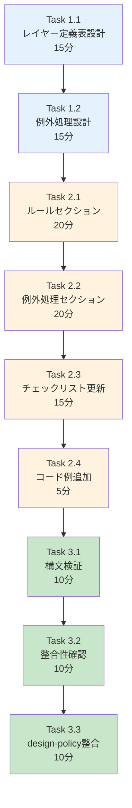
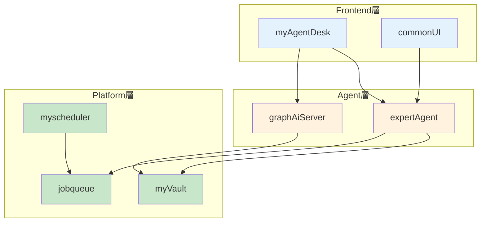
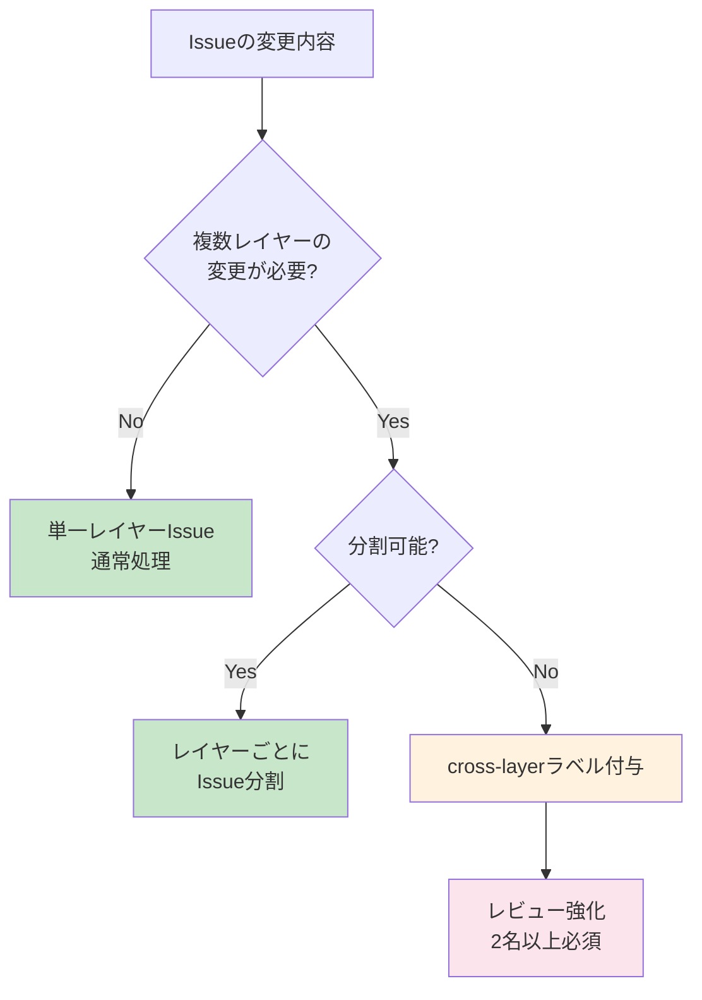

# 作業計画書: Issue #220 - Issue分割ガイド更新（レイヤールール）

## Issue: Issue分割ガイド更新（レイヤールール）

**Issue番号**: #220
**親Issue**: #209 (開発プロセス改善)
**Phase**: Phase 4: ドキュメント更新
**サイズ**: S (2時間)
**作業見積**: 2時間
**優先度**: High
**依存Issue**:
- #217 (CLAUDE.md 開発プロセス更新) - 必須
**ブロック対象**:
- #221 (PRテンプレート更新)
- #222 (PR自動チェック機能)

---

## 1. 現状分析

### 1.1 現在の08-issue-split.md構成

```
docs/claude/08-issue-split.md (401行)
├── ## 📋 概要
│   └── Issue分割の目的
├── ## 🎨 Issue分割の原則
│   ├── 縦割り（Vertical Slice）優先
│   ├── Issueサイズの目安
│   └── 依存関係の最小化
├── ## 📝 受入基準の2層構造         # 既存（そのまま）
│   ├── 自動検証可能な基準
│   └── 手動検証が必要な基準
├── ## 🗺️ Phase毎のイシュー管理
│   ├── Phase 1-5の例
│   └── 完了条件の例
├── ## 📊 依存関係グラフの作成
│   ├── Mermaid可視化
│   └── 並列実行可能性マトリクス
├── ## 📅 マイルストーン計画
├── ## 🚨 よくある落とし穴と対策
├── ## 📋 Issue分割チェックリスト    ← 更新対象（レイヤールール追加）
└── ## 🔗 関連ドキュメント
```

### 1.2 不足している内容

設計方針書（design-policy.md）セクション3.2を参照すると、以下が不足:

1. **単一レイヤー改修ルール**
   - 「1 Issue = 1 Layer」の原則
   - レイヤー分離の意義

2. **レイヤー定義表**
   - Platform層（myVault, jobqueue, myscheduler, valkey, langfuse）
   - Agent層（expertAgent, graphAiServer）
   - Frontend層（myAgentDesk, commonUI）
   - Docs層（docs/, CLAUDE.md）

3. **レイヤー跨ぎの例外処理**
   - cross-layerラベルの使用条件
   - レビュー強化の手順
   - Issue分割の検討

4. **cross-layerラベルの使用方法**
   - ラベル付与基準
   - PRレビュー時の注意点

### 1.3 追加予定セクションの配置

「## 🚨 よくある落とし穴と対策」の前（行324付近）に新セクションを追加:

```markdown
## 🏗️ 単一レイヤー改修ルール ← 新規追加
```

---

## 2. 詳細タスク分解

### Phase 1: 内容設計（30分）

- [ ] **Task 1.1**: レイヤー定義表の設計
  - 所要時間: 15分
  - 成果物: 表構造設計
  - 依存: なし
  - 内容:
    - 4レイヤーの定義
    - 各レイヤーに属するプロジェクト
    - レイヤー間依存関係

- [ ] **Task 1.2**: 例外処理手順の設計
  - 所要時間: 15分
  - 成果物: フローチャート設計
  - 依存: Task 1.1
  - 内容:
    - cross-layer判定フロー
    - 対応オプション（分割/承認）

### Phase 2: ドキュメント編集（1時間）

- [ ] **Task 2.1**: 単一レイヤー改修ルールセクション追加
  - 所要時間: 20分
  - 成果物: 08-issue-split.md更新
  - 依存: Phase 1完了
  - 内容:
    - ルールの説明
    - レイヤー定義表

- [ ] **Task 2.2**: 例外処理手順セクション追加
  - 所要時間: 20分
  - 成果物: 08-issue-split.md更新
  - 依存: Task 2.1
  - 内容:
    - cross-layerラベルの説明
    - 判定フローチャート（Mermaid）

- [ ] **Task 2.3**: Issue分割チェックリスト更新
  - 所要時間: 15分
  - 成果物: 08-issue-split.md更新
  - 依存: Task 2.2
  - 内容:
    - レイヤールールのチェック項目追加

- [ ] **Task 2.4**: コード例・悪い例の追加
  - 所要時間: 5分
  - 成果物: 08-issue-split.md更新
  - 依存: Task 2.3
  - 内容:
    - 良い例: 単一レイヤーのIssue
    - 悪い例: レイヤー跨ぎのIssue

### Phase 3: 検証（30分）

- [ ] **Task 3.1**: Markdown構文検証
  - 所要時間: 10分
  - 作業: Markdownプレビュー確認
  - 依存: Phase 2完了

- [ ] **Task 3.2**: 既存セクションとの整合性確認
  - 所要時間: 10分
  - 作業: 既存Issue分割原則との矛盾確認
  - 依存: Task 3.1

- [ ] **Task 3.3**: design-policy.mdとの整合性確認
  - 所要時間: 10分
  - 作業: セクション3.2との一致確認
  - 依存: Task 3.2

---

## 3. タスク依存関係



---

## 4. 作業スケジュール

### セッション（2時間）

| 時間 | タスク | 成果物 |
|------|--------|--------|
| 0:00-0:15 | Task 1.1 レイヤー定義表設計 | 表構造設計 |
| 0:15-0:30 | Task 1.2 例外処理設計 | フロー設計 |
| 0:30-0:50 | Task 2.1 ルールセクション追加 | MD更新 |
| 0:50-1:10 | Task 2.2 例外処理セクション追加 | MD更新 |
| 1:10-1:25 | Task 2.3 チェックリスト更新 | MD更新 |
| 1:25-1:30 | Task 2.4 コード例追加 | MD更新 |
| 1:30-1:40 | Task 3.1 構文検証 | 検証結果 |
| 1:40-1:50 | Task 3.2 整合性確認 | 確認結果 |
| 1:50-2:00 | Task 3.3 design-policy整合確認 | 確認結果 |

**総作業時間**: 2時間

---

## 5. 追加セクション詳細設計

### 5.1 単一レイヤー改修ルール

```markdown
## 🏗️ 単一レイヤー改修ルール

### 原則: 1 Issue = 1 Layer

各Issueは原則として**単一のレイヤー**内での変更に限定します。

### レイヤー定義

| レイヤー | プロジェクト | 役割 | テスト責任 |
|---------|-------------|------|-----------|
| **Platform層** | myVault, jobqueue, myscheduler, valkey, langfuse | インフラ・基盤サービス | 単体+結合 |
| **Agent層** | expertAgent, graphAiServer | AIエージェント・ワークフロー | 単体+結合+受入 |
| **Frontend層** | myAgentDesk, commonUI | ユーザーインターフェース | 単体+E2E |
| **Docs層** | docs/, CLAUDE.md, *.md | ドキュメント | 構文チェック |

### レイヤー間依存関係



### なぜ単一レイヤーか？

1. **テスト戦略の明確化**: レイヤーごとにテスト責任が異なる
2. **レビューの効率化**: レビュアーが担当レイヤーに集中できる
3. **デプロイリスクの最小化**: 変更範囲が限定される
4. **並列開発の促進**: 異なるレイヤーは同時に作業可能
```

### 5.2 例外処理手順

```markdown
### レイヤー跨ぎの例外処理

#### cross-layerラベルの使用条件

以下の場合のみ `cross-layer` ラベルを付与できます：

| 条件 | 例 | 対応 |
|------|-----|------|
| **API契約変更** | Request/Responseスキーマ変更 | 必須: 両レイヤーの同時変更 |
| **データベース移行** | スキーマ変更+API変更 | 推奨: 別Issue分割を検討 |
| **E2Eバグ修正** | UI+API両方の修正が必要 | 許容: 単一Issue |

#### 判定フロー



#### cross-layer Issue のレビュー要件

- [ ] 2名以上のレビュアー（各レイヤーから1名）
- [ ] 変更理由の明記（なぜ分割できないか）
- [ ] 影響範囲の明示（両レイヤーへの影響）
- [ ] ロールバック手順の準備
```

### 5.3 チェックリスト追加項目

```markdown
### レイヤールール
- [ ] 単一レイヤー内の変更か
- [ ] 複数レイヤーの場合 `cross-layer` ラベルが付与されているか
- [ ] cross-layerの場合、分割不可能な理由が明記されているか
```

### 5.4 良い例・悪い例

```markdown
### 良い例・悪い例

**✅ 良い例**: 単一レイヤー内の変更

```markdown
Issue: expertAgentにログ出力機能を追加
- 変更対象: expertAgent/app/logging/
- レイヤー: Agent層のみ
- テスト: expertAgent/tests/unit/
```

**❌ 悪い例**: レイヤー跨ぎの変更（分割すべき）

```markdown
Issue: ユーザー登録機能の追加
- 変更対象:
  - expertAgent/app/api/users.py (Agent層)
  - myAgentDesk/src/routes/users/ (Frontend層)
  - myVault/app/models/users.py (Platform層)
→ 3つのIssueに分割すべき
```

**⚠️ 許容される例**: cross-layer（分割不可能）

```markdown
Issue: API契約変更（RequestスキーマとUI同時更新）
- ラベル: cross-layer
- 理由: スキーマ変更は両側同時でないと動作しない
- レビュー: Backend担当1名 + Frontend担当1名
```
```

---

## 6. チェックポイント

| タイミング | 確認事項 | 対応 |
|-----------|---------|------|
| Phase 1完了時 | レイヤー定義に矛盾なし | 再設計 |
| Phase 2完了時 | Markdown構文エラーなし | 構文修正 |
| Phase 3完了時 | 既存内容との整合 | 調整 |

---

## 7. リスクと対策

| リスク | 発生確率 | 影響 | 対策 |
|-------|---------|------|------|
| 既存原則との矛盾 | 低 | 混乱 | 「縦割り」原則と整合させる |
| レイヤー定義の曖昧さ | 中 | 運用困難 | 具体的なプロジェクト名を明記 |
| cross-layerの乱用 | 中 | ルール形骸化 | 明確な使用条件を記載 |

---

## 8. 成果物チェックリスト

### 変更ファイル
- [ ] `docs/claude/08-issue-split.md`

### 追加セクション
- [ ] 単一レイヤー改修ルール
- [ ] レイヤー定義表
- [ ] レイヤー間依存関係図（Mermaid）
- [ ] 例外処理手順（判定フロー）
- [ ] cross-layerラベルの使用方法
- [ ] チェックリスト更新（レイヤールール項目）
- [ ] 良い例・悪い例

### 品質確認
- [ ] Markdownシンタックスエラーなし
- [ ] Mermaid図が正しく表示される
- [ ] 既存セクションとの整合性
- [ ] design-policy.mdとの整合性

---

## 9. Definition of Done

### 自動検証可能な基準

**機能要件**:
- [ ] 「単一レイヤー改修ルール」セクションが存在する
- [ ] レイヤー定義表が含まれている
- [ ] 例外処理手順が記載されている
- [ ] Markdownシンタックスエラーがない

**品質基準**:
- [ ] 既存のIssue分割ガイドとの整合性

### 手動検証が必要な基準

**ビジネスロジック検証**:
- [ ] ルールが実際の開発プロセスに適用可能
- [ ] 例外処理が現実的

---

## 10. 次のアクション

作業計画承認後：
1. **依存Issue確認**: #217の完了を確認
2. **ブランチ作成**: `feature/issue/220`
3. **worktree作成**: `./scripts/worktree-create-from-issue.sh 220`
4. **タスク実行**: Phase 1から順次実行
5. **進捗報告**: 完了時に `/progress-report`

---

## 11. 参照ドキュメント

- [設計方針書](../issue/209/design-policy.md) - セクション3.2（レイヤー分離パターン）
- [Issue分割計画書](../issue/209/issue-split.md)
- [08-issue-split.md](../../docs/claude/08-issue-split.md)
- [アーキテクチャ概要](../../docs/design/architecture-overview.md)

---

## 12. 注意事項

### 既存「縦割り原則」との関係

現在の「縦割り（Vertical Slice）優先」原則（行20-35）は**機能単位**での分割を推奨しています。
新規追加する「単一レイヤー改修ルール」は**技術層単位**での分割を推奨します。

両者は矛盾せず、以下のように補完関係にあります：

1. **縦割り原則**: 「何を実装するか」の単位（ユーザー登録機能など）
2. **レイヤールール**: 「どこを変更するか」の制約（Agent層のみなど）

つまり、「ユーザー登録機能」というFeatureを「API実装（Agent層）」「UI実装（Frontend層）」
のように**レイヤーごとのIssue**に分割するのが推奨アプローチです。

### ブロック対象への影響

本Issue（#220）は以下をブロックします：
- #221 (PRテンプレート更新): レイヤールールをPRテンプレートに反映
- #222 (PR自動チェック機能): cross-layerラベルの自動検出

---

**作成日**: 2025-12-04
**作成者**: Claude Code
**ステータス**: 承認待ち
