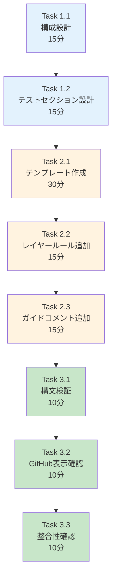

# 作業計画書: Issue #221 - PRテンプレート更新

## Issue: PRテンプレート更新

**Issue番号**: #221
**親Issue**: #209 (開発プロセス改善)
**Phase**: Phase 4: ドキュメント更新
**サイズ**: S (2時間)
**作業見積**: 2時間
**優先度**: Medium
**依存Issue**:
- #220 (Issue分割ガイド更新) - 必須
**ブロック対象**: なし

---

## 1. 現状分析

### 1.1 現在の.github/ディレクトリ構成

```
.github/
├── BRANCH_PROTECTION.md      # ブランチ保護ルール
├── DEPLOYMENT.md             # デプロイメント手順
├── workflows/                # GitHub Actions
│   ├── ci-feature.yml
│   ├── ci-main.yml
│   ├── cd-develop.yml
│   └── ... (12ワークフロー)
└── PULL_REQUEST_TEMPLATE.md  ← 存在しない（新規作成）
```

### 1.2 作成すべきPRテンプレートの要件

設計方針書（design-policy.md）とIssue分割ガイド（08-issue-split.md）を参照:

1. **基本情報セクション**
   - PRタイトル/概要
   - 関連Issue番号
   - 変更種別（feature/fix/refactor等）

2. **テスト確認セクション（新規）**
   - CI自動テスト（L1単体、L2結合）
   - 開発者受入テスト（L3）
   - PO受入テスト（L4、該当時のみ）

3. **レイヤールール確認（#220連携）**
   - 単一レイヤー確認
   - cross-layerラベル（必要時）

4. **レビュー依頼セクション**
   - レビュアー指定
   - 特記事項

### 1.3 参考: 一般的なPRテンプレート構成

```markdown
## 概要
## 変更内容
## テスト確認      ← 追加対象
## スクリーンショット
## チェックリスト
## レビュアーへの依頼事項
```

---

## 2. 詳細タスク分解

### Phase 1: 設計（30分）

- [ ] **Task 1.1**: PRテンプレート構成設計
  - 所要時間: 15分
  - 成果物: セクション構成案
  - 依存: なし
  - 内容:
    - 必須セクションの定義
    - オプションセクションの定義

- [ ] **Task 1.2**: テスト確認セクション設計
  - 所要時間: 15分
  - 成果物: チェックボックス設計
  - 依存: Task 1.1
  - 内容:
    - L1-L4テストレベルの反映
    - スキップ条件の表記

### Phase 2: 実装（1時間）

- [ ] **Task 2.1**: PULL_REQUEST_TEMPLATE.md作成
  - 所要時間: 30分
  - 成果物: `.github/PULL_REQUEST_TEMPLATE.md`
  - 依存: Phase 1完了
  - 内容:
    - 基本構成の作成
    - テスト確認セクション追加

- [ ] **Task 2.2**: レイヤールール確認セクション追加
  - 所要時間: 15分
  - 成果物: `.github/PULL_REQUEST_TEMPLATE.md`更新
  - 依存: Task 2.1
  - 内容:
    - 単一レイヤー確認チェックボックス
    - cross-layerラベル案内

- [ ] **Task 2.3**: 使用ガイドコメント追加
  - 所要時間: 15分
  - 成果物: `.github/PULL_REQUEST_TEMPLATE.md`更新
  - 依存: Task 2.2
  - 内容:
    - HTMLコメントでの使用方法説明
    - 条件分岐の案内

### Phase 3: 検証（30分）

- [ ] **Task 3.1**: Markdown構文検証
  - 所要時間: 10分
  - 作業: Markdownプレビュー確認
  - 依存: Phase 2完了

- [ ] **Task 3.2**: GitHub上での表示確認
  - 所要時間: 10分
  - 作業: テストPR作成で表示確認
  - 依存: Task 3.1

- [ ] **Task 3.3**: 関連ドキュメントとの整合性確認
  - 所要時間: 10分
  - 作業: 04-quality-standards.md, 08-issue-split.mdとの整合
  - 依存: Task 3.2

---

## 3. タスク依存関係



---

## 4. 作業スケジュール

### セッション（2時間）

| 時間 | タスク | 成果物 |
|------|--------|--------|
| 0:00-0:15 | Task 1.1 構成設計 | セクション構成案 |
| 0:15-0:30 | Task 1.2 テストセクション設計 | チェックボックス設計 |
| 0:30-1:00 | Task 2.1 テンプレート作成 | MD作成 |
| 1:00-1:15 | Task 2.2 レイヤールール追加 | MD更新 |
| 1:15-1:30 | Task 2.3 ガイドコメント追加 | MD更新 |
| 1:30-1:40 | Task 3.1 構文検証 | 検証結果 |
| 1:40-1:50 | Task 3.2 GitHub表示確認 | 確認結果 |
| 1:50-2:00 | Task 3.3 整合性確認 | 確認結果 |

**総作業時間**: 2時間

---

## 5. PRテンプレート詳細設計

### 5.1 全体構成

```markdown
## 概要
<!-- このPRで何を実現するか簡潔に記載 -->

## 関連Issue
<!-- 関連するIssue番号を記載 -->
- Closes #

## 変更種別
<!-- 該当するものにチェック -->
- [ ] 🆕 新機能 (feature)
- [ ] 🐛 バグ修正 (fix)
- [ ] ♻️ リファクタリング (refactor)
- [ ] 📝 ドキュメント (docs)
- [ ] 🧪 テスト (test)
- [ ] 🎨 UI/UX改善 (vibe)

## 変更内容
<!-- 具体的な変更内容を箇条書きで記載 -->
-
-
-

## テスト確認
<!-- 該当するものにチェック -->

### CI自動テスト（必須）
- [ ] 単体テスト（L1）パス
- [ ] 結合テスト（L2）パス
- [ ] 静的解析（Ruff/MyPy）パス

### 受入テスト
<!-- スキップ条件に該当する場合は理由を記載 -->
- [ ] 開発者受入テスト（L3）実施済み
  - スキップ理由: <!-- docs-only, internal, test-only, ci-only -->
- [ ] PO受入テスト（L4）実施済み（UI/UX変更の場合）
  - 該当しない場合: N/A

## レイヤー確認
<!-- Issue分割ガイドのレイヤールールを確認 -->
- [ ] 単一レイヤー内の変更である
- [ ] 複数レイヤーの場合: `cross-layer` ラベルを付与済み

## スクリーンショット（UI変更の場合）
<!-- Before/Afterを添付 -->

## レビュアーへの依頼事項
<!-- 特に確認してほしい点があれば記載 -->

## チェックリスト
- [ ] コードがプロジェクトのスタイルガイドに従っている
- [ ] セルフレビューを実施した
- [ ] 必要なドキュメントを更新した
- [ ] 依存関係の変更がある場合、適切に対応した
```

### 5.2 テスト確認セクションの詳細

```markdown
## テスト確認

### CI自動テスト（必須）
<!-- CIが自動実行。全てパスが必須 -->
- [ ] 単体テスト（L1）パス - カバレッジ90%以上
- [ ] 結合テスト（L2）パス - カバレッジ50%以上
- [ ] 静的解析（Ruff/MyPy）エラーゼロ

### 開発者受入テスト（L3）
<!-- ローカルで実行。APIキーが必要な場合あり -->
- [ ] 実施済み
- [ ] スキップ（理由: ）

**スキップ可能な条件**:
| ラベル | 説明 |
|-------|------|
| `docs-only` | ドキュメントのみの変更 |
| `internal` | 内部リファクタリング |
| `test-only` | テストコードのみの変更 |
| `ci-only` | CI/CD設定のみの変更 |

### PO受入テスト（L4）
<!-- UI/UX変更、新機能追加時は必須 -->
- [ ] 実施済み
- [ ] 該当なし（理由: ）

**必須条件**:
- UI/UXに影響する変更
- 新機能の追加
- ユーザーフローの変更
```

### 5.3 レイヤー確認セクション

```markdown
## レイヤー確認

<!-- Issue分割ガイド（08-issue-split.md）のレイヤールールを確認 -->

### 変更対象レイヤー
- [ ] Platform層（myVault, jobqueue, myscheduler）
- [ ] Agent層（expertAgent, graphAiServer）
- [ ] Frontend層（myAgentDesk, commonUI）
- [ ] Docs層（docs/, CLAUDE.md）

### レイヤールール確認
- [ ] **単一レイヤー**内の変更である
- [ ] **複数レイヤー**の場合:
  - [ ] `cross-layer` ラベルを付与済み
  - [ ] 分割不可能な理由を記載済み
  - [ ] 2名以上のレビュアーを指定
```

---

## 6. チェックポイント

| タイミング | 確認事項 | 対応 |
|-----------|---------|------|
| Phase 1完了時 | セクション構成に漏れなし | 再設計 |
| Phase 2完了時 | Markdown構文エラーなし | 構文修正 |
| Task 3.2完了時 | GitHub上で正しく表示 | 表示調整 |

---

## 7. リスクと対策

| リスク | 発生確率 | 影響 | 対策 |
|-------|---------|------|------|
| テンプレートが長すぎる | 中 | 開発者が敬遠 | 必須/オプションを明確に分離 |
| チェック項目の漏れ | 低 | 品質低下 | 関連ドキュメントとクロスチェック |
| GitHub表示の崩れ | 低 | UX低下 | 実際のPR作成で確認 |

---

## 8. 成果物チェックリスト

### 作成ファイル
- [ ] `.github/PULL_REQUEST_TEMPLATE.md`（新規作成）

### 必須セクション
- [ ] 概要
- [ ] 関連Issue
- [ ] 変更種別
- [ ] 変更内容
- [ ] テスト確認（CI、L3、L4）
- [ ] レイヤー確認
- [ ] チェックリスト

### 品質確認
- [ ] Markdownシンタックスエラーなし
- [ ] GitHub上で正しく表示される
- [ ] 04-quality-standards.mdとの整合性
- [ ] 08-issue-split.mdとの整合性

---

## 9. Definition of Done

### 自動検証可能な基準

**機能要件**:
- [ ] 「テスト確認」セクションが存在する
- [ ] 3種類のチェックボックス（CI、開発者受入、PO受入）が含まれている
- [ ] Markdownシンタックスエラーがない

**品質基準**:
- [ ] 既存のPRテンプレートとの整合性（新規作成のため該当なし）

### 手動検証が必要な基準

**UX/UI検証**:
- [ ] PR作成時にテンプレートが正しく表示される
- [ ] チェックリストが分かりやすい

---

## 10. 次のアクション

作業計画承認後：
1. **依存Issue確認**: #220の完了を確認
2. **ブランチ作成**: `feature/issue/221`
3. **worktree作成**: `./scripts/worktree-create-from-issue.sh 221`
4. **タスク実行**: Phase 1から順次実行
5. **進捗報告**: 完了時に `/progress-report`

---

## 11. 参照ドキュメント

- [設計方針書](../issue/209/design-policy.md) - テストアーキテクチャ
- [Issue分割計画書](../issue/209/issue-split.md)
- [04-quality-standards.md](../../docs/claude/04-quality-standards.md) - テスト方針
- [08-issue-split.md](../../docs/claude/08-issue-split.md) - レイヤールール

---

## 12. 注意事項

### テンプレートの使いやすさ

PRテンプレートは開発者が毎回使用するため、以下に配慮：

1. **必須項目を最小限に**: 全てにチェックを強制しない
2. **HTMLコメントで説明**: 記入方法を分かりやすく案内
3. **スキップ条件を明記**: 不要なチェックを省けるように

### #220（レイヤールール）との連携

#220で追加する「単一レイヤー改修ルール」をPRテンプレートに反映：
- レイヤー確認セクションで単一レイヤーを確認
- cross-layerラベルの案内を含める

### 既存ワークフローへの影響

このテンプレートは新規作成のため、既存のPRには影響しません。
テンプレート追加後に作成されるPRから適用されます。

---

**作成日**: 2025-12-04
**作成者**: Claude Code
**ステータス**: 承認待ち
