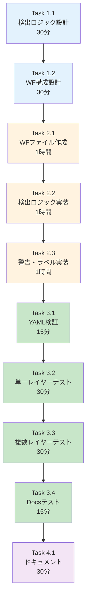

# 作業計画書: Issue #222 - PR自動チェック機能（Optional）

## Issue: PR自動チェック機能

**Issue番号**: #222
**親Issue**: #209 (開発プロセス改善)
**Phase**: Phase 5: 自動化・運用（Optional）
**サイズ**: M (6時間)
**作業見積**: 6時間
**優先度**: Low
**依存Issue**:
- #220 (Issue分割ガイド更新) - 必須
**ブロック対象**: なし

---

## 1. 現状分析

### 1.1 現在のCI/CDワークフロー構成

```
.github/workflows/
├── ci-feature.yml      # Feature/Fixブランチ向けCI
├── ci-main.yml         # mainブランチ向けCI
├── cd-develop.yml      # develop統合時CD
├── auto-release.yml    # 自動リリース
├── hotfix.yml          # ホットフィックス
├── docs.yml            # ドキュメント
└── pr-layer-check.yml  ← 新規作成
```

### 1.2 レイヤー定義（#220で定義）

| レイヤー | ディレクトリパターン |
|---------|---------------------|
| Platform層 | `myVault/**`, `jobqueue/**`, `myscheduler/**` |
| Agent層 | `expertAgent/**`, `graphAiServer/**` |
| Frontend層 | `myAgentDesk/**`, `commonUI/**` |
| Docs層 | `docs/**`, `*.md` (ルート) |

### 1.3 既存ワークフローの参考パターン

`ci-feature.yml`の変更検出ロジック:
```yaml
- name: Detect changes
  id: changes
  run: |
    if [ -d "expertAgent" ]; then
      echo "expertAgent=true" >> $GITHUB_OUTPUT
    fi
```

このパターンを拡張して、レイヤー検出を実装します。

---

## 2. 詳細タスク分解

### Phase 1: 設計（1時間）

- [ ] **Task 1.1**: レイヤー検出ロジック設計
  - 所要時間: 30分
  - 成果物: ロジック設計書
  - 依存: なし
  - 内容:
    - ディレクトリ→レイヤーのマッピング
    - 複数レイヤー判定条件

- [ ] **Task 1.2**: ワークフロー構成設計
  - 所要時間: 30分
  - 成果物: ワークフロー設計書
  - 依存: Task 1.1
  - 内容:
    - トリガー条件
    - ジョブ構成
    - 出力形式

### Phase 2: 実装（3時間）

- [ ] **Task 2.1**: ワークフローファイル作成
  - 所要時間: 1時間
  - 成果物: `.github/workflows/pr-layer-check.yml`
  - 依存: Phase 1完了
  - 内容:
    - 基本構造
    - トリガー設定
    - 変更ファイル取得

- [ ] **Task 2.2**: レイヤー検出ロジック実装
  - 所要時間: 1時間
  - 成果物: `.github/workflows/pr-layer-check.yml`更新
  - 依存: Task 2.1
  - 内容:
    - ディレクトリパターンマッチング
    - 複数レイヤー判定

- [ ] **Task 2.3**: 警告コメント・ラベル付与実装
  - 所要時間: 1時間
  - 成果物: `.github/workflows/pr-layer-check.yml`更新
  - 依存: Task 2.2
  - 内容:
    - PRコメント投稿
    - `cross-layer`ラベル自動付与
    - GitHub APIトークン設定

### Phase 3: テスト（1.5時間）

- [ ] **Task 3.1**: YAML構文検証
  - 所要時間: 15分
  - 作業: yamllint実行
  - 依存: Phase 2完了

- [ ] **Task 3.2**: 単一レイヤーテスト
  - 所要時間: 30分
  - 作業: Platform層のみ変更PRでテスト
  - 依存: Task 3.1

- [ ] **Task 3.3**: 複数レイヤーテスト
  - 所要時間: 30分
  - 作業: Platform + Agent変更PRでテスト
  - 依存: Task 3.2

- [ ] **Task 3.4**: Docs層テスト
  - 所要時間: 15分
  - 作業: docs/のみ変更PRでテスト
  - 依存: Task 3.3

### Phase 4: ドキュメント（30分）

- [ ] **Task 4.1**: ワークフロー説明追加
  - 所要時間: 30分
  - 成果物: `CLAUDE.md`または`docs/`への説明追加
  - 依存: Phase 3完了

---

## 3. タスク依存関係



---

## 4. 作業スケジュール

### セッション（6時間）

| 時間 | タスク | 成果物 |
|------|--------|--------|
| 0:00-0:30 | Task 1.1 検出ロジック設計 | ロジック設計 |
| 0:30-1:00 | Task 1.2 WF構成設計 | WF設計 |
| 1:00-2:00 | Task 2.1 WFファイル作成 | yml作成 |
| 2:00-3:00 | Task 2.2 検出ロジック実装 | yml更新 |
| 3:00-4:00 | Task 2.3 警告・ラベル実装 | yml更新 |
| 4:00-4:15 | Task 3.1 YAML検証 | 検証結果 |
| 4:15-4:45 | Task 3.2 単一レイヤーテスト | テスト結果 |
| 4:45-5:15 | Task 3.3 複数レイヤーテスト | テスト結果 |
| 5:15-5:30 | Task 3.4 Docsテスト | テスト結果 |
| 5:30-6:00 | Task 4.1 ドキュメント | 説明追加 |

**総作業時間**: 6時間

---

## 5. ワークフロー詳細設計

### 5.1 ワークフローファイル構成

```yaml
name: PR Layer Check

on:
  pull_request:
    branches: [develop]
    types: [opened, synchronize, reopened]

permissions:
  contents: read
  pull-requests: write
  issues: write

jobs:
  check-layers:
    name: Check Modified Layers
    runs-on: ubuntu-latest
    steps:
      - name: Checkout
        uses: actions/checkout@v4
        with:
          fetch-depth: 0

      - name: Get changed files
        id: changed-files
        uses: tj-actions/changed-files@v44

      - name: Detect layers
        id: detect
        run: |
          # レイヤー検出ロジック
          ...

      - name: Add comment and label if cross-layer
        if: steps.detect.outputs.is_cross_layer == 'true'
        uses: actions/github-script@v7
        with:
          script: |
            // PRコメント投稿
            // ラベル付与
            ...
```

### 5.2 レイヤー検出ロジック

```bash
#!/bin/bash

# 変更ファイルリストを取得
CHANGED_FILES="${{ steps.changed-files.outputs.all_changed_files }}"

# レイヤーフラグ初期化
PLATFORM=false
AGENT=false
FRONTEND=false
DOCS=false

for file in $CHANGED_FILES; do
  case "$file" in
    myVault/*|jobqueue/*|myscheduler/*)
      PLATFORM=true
      ;;
    expertAgent/*|graphAiServer/*)
      AGENT=true
      ;;
    myAgentDesk/*|commonUI/*)
      FRONTEND=true
      ;;
    docs/*|*.md)
      DOCS=true
      ;;
  esac
done

# 複数レイヤー判定（Docsは除外）
LAYER_COUNT=0
[ "$PLATFORM" = true ] && ((LAYER_COUNT++))
[ "$AGENT" = true ] && ((LAYER_COUNT++))
[ "$FRONTEND" = true ] && ((LAYER_COUNT++))

if [ $LAYER_COUNT -gt 1 ]; then
  echo "is_cross_layer=true" >> $GITHUB_OUTPUT
  echo "layers=$PLATFORM,$AGENT,$FRONTEND" >> $GITHUB_OUTPUT
else
  echo "is_cross_layer=false" >> $GITHUB_OUTPUT
fi
```

### 5.3 PRコメント・ラベル付与

```javascript
// actions/github-script
const layers = [];
if (process.env.PLATFORM === 'true') layers.push('Platform層');
if (process.env.AGENT === 'true') layers.push('Agent層');
if (process.env.FRONTEND === 'true') layers.push('Frontend層');

const body = `## ⚠️ Cross-Layer Change Detected

このPRは複数のレイヤーを変更しています：
${layers.map(l => `- ${l}`).join('\n')}

### 対応が必要です

1. **Issue分割の検討**: 可能であれば、レイヤーごとに別Issueに分割してください
2. **分割不可能な場合**:
   - PRの説明に分割できない理由を記載
   - 2名以上のレビュアーを指定（各レイヤーから1名）

📚 参照: [Issue分割ガイド - レイヤールール](docs/claude/08-issue-split.md#単一レイヤー改修ルール)
`;

// コメント投稿
await github.rest.issues.createComment({
  owner: context.repo.owner,
  repo: context.repo.repo,
  issue_number: context.issue.number,
  body: body
});

// ラベル付与
await github.rest.issues.addLabels({
  owner: context.repo.owner,
  repo: context.repo.repo,
  issue_number: context.issue.number,
  labels: ['cross-layer']
});
```

### 5.4 テストシナリオ

| シナリオ | 変更ファイル | 期待結果 |
|---------|-------------|---------|
| 単一レイヤー（Platform） | `myVault/app/main.py` | 警告なし |
| 単一レイヤー（Agent） | `expertAgent/app/api.py` | 警告なし |
| 複数レイヤー | `expertAgent/app/api.py`, `myAgentDesk/src/+page.svelte` | 警告あり、ラベル付与 |
| Docsのみ | `docs/README.md` | 警告なし |
| Docs + コード | `docs/README.md`, `expertAgent/app/api.py` | 警告なし（Docs除外） |

---

## 6. チェックポイント

| タイミング | 確認事項 | 対応 |
|-----------|---------|------|
| Phase 1完了時 | レイヤーマッピングに漏れなし | 再設計 |
| Task 2.1完了時 | トリガー設定正常 | 修正 |
| Task 3.2完了時 | 単一レイヤーで警告なし | ロジック修正 |
| Task 3.3完了時 | 複数レイヤーで警告あり | ロジック修正 |

---

## 7. リスクと対策

| リスク | 発生確率 | 影響 | 対策 |
|-------|---------|------|------|
| GitHub API制限 | 低 | ラベル付与失敗 | エラーハンドリング追加 |
| 誤検出（false positive） | 中 | 開発者の混乱 | Docs除外ルール追加 |
| ワークフロー実行時間超過 | 低 | タイムアウト | 1分以内を目標 |
| cross-layerラベル未作成 | 高 | ラベル付与失敗 | 事前にラベル作成 |

---

## 8. 成果物チェックリスト

### 作成ファイル
- [ ] `.github/workflows/pr-layer-check.yml`（新規作成）

### ワークフロー機能
- [ ] PRオープン時にトリガー
- [ ] 変更ファイルからレイヤー検出
- [ ] 複数レイヤー時に警告コメント
- [ ] `cross-layer`ラベル自動付与

### 品質確認
- [ ] YAMLシンタックスエラーなし
- [ ] ワークフロー実行時間1分以内
- [ ] 単一レイヤーで誤警告なし
- [ ] 複数レイヤーで正しく検出

---

## 9. Definition of Done

### 自動検証可能な基準

**機能要件**:
- [ ] ワークフローファイルが存在する
- [ ] 単一レイヤー変更PRで警告が出ない
- [ ] 複数レイヤー変更PRで警告コメントが出る
- [ ] `cross-layer`ラベルが自動付与される

**品質基準**:
- [ ] YAMLシンタックスエラーなし
- [ ] ワークフロー実行時間が1分以内

**テストケース**:
- [ ] 正常系: Platform層のみ変更 → 警告なし
- [ ] 正常系: Platform + Agent変更 → 警告あり
- [ ] 正常系: Docs層のみ変更 → 警告なし

### 手動検証が必要な基準

**運用検証**:
- [ ] 実際のPRで正しく動作する
- [ ] 警告メッセージが分かりやすい

---

## 10. 事前準備

作業開始前に以下を確認・準備：

### cross-layerラベルの作成

```bash
gh label create "cross-layer" \
  --description "PR changes multiple layers (Platform/Agent/Frontend)" \
  --color "FFA500"
```

### GitHub Actions権限確認

リポジトリ設定で以下を確認：
- Settings → Actions → General → Workflow permissions
- "Read and write permissions" が有効であること

---

## 11. 次のアクション

作業計画承認後：
1. **依存Issue確認**: #220の完了を確認
2. **事前準備**: cross-layerラベル作成
3. **ブランチ作成**: `feature/issue/222`
4. **worktree作成**: `./scripts/worktree-create-from-issue.sh 222`
5. **タスク実行**: Phase 1から順次実行
6. **進捗報告**: 完了時に `/progress-report`

---

## 12. 参照ドキュメント

- [設計方針書](../issue/209/design-policy.md) - レイヤー分離パターン
- [Issue分割計画書](../issue/209/issue-split.md)
- [08-issue-split.md](../../docs/claude/08-issue-split.md) - レイヤールール
- [ci-feature.yml](../../.github/workflows/ci-feature.yml) - 既存ワークフロー参考

---

## 13. 注意事項

### Optional Issueについて

このIssueはPhase 5（Optional）に位置づけられています。
Phase 4（#217-#221）が完了してから着手することを推奨します。

### 誤検出の回避

以下のケースは「複数レイヤー」とみなさない：
- Docs層のみの変更
- Docs層 + 他1レイヤーの変更（ドキュメント更新は付随作業）
- ルートのMarkdownファイル（CLAUDE.md等）のみの変更

### ラベルの事前作成

`cross-layer`ラベルはリポジトリに存在しない場合、ワークフローが失敗します。
作業開始前に必ず作成してください。

---

**作成日**: 2025-12-04
**作成者**: Claude Code
**ステータス**: 承認待ち
