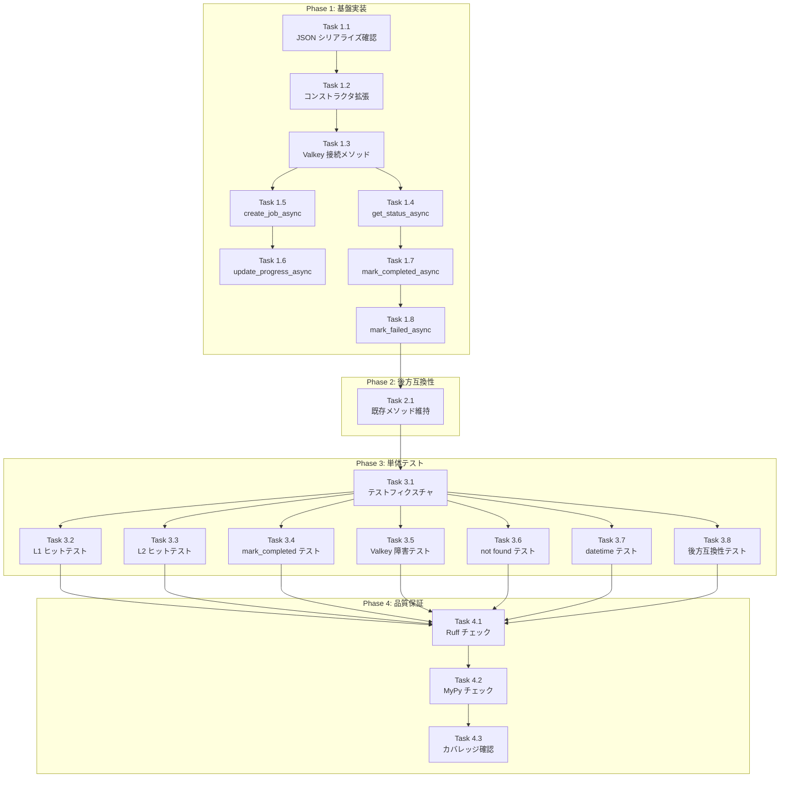

# Issue #239 作業計画書

## JobCreationStateManager の Valkey 連携実装

---

## Issue 概要

| 項目 | 値 |
|-----|-----|
| **Issue番号** | [#239](https://github.com/Kewton/MySwiftAgent/issues/239) |
| **親Issue** | [#193](https://github.com/Kewton/MySwiftAgent/issues/193) |
| **サイズ** | M (3-5 Story Points) |
| **作業見積** | 4-6時間 |
| **優先度** | High |
| **Phase** | 1（基盤構築） |
| **依存Issue** | なし |
| **ブロッカー** | #240, #241 がこのIssueに依存 |

---

## 詳細タスク分解

### Phase 1: 基盤実装（2.5時間）

#### Task 1.1: JobCreationStatus のJSON シリアライズ確認
- **所要時間**: 15分
- **成果物**: テストコードで確認
- **依存**: なし
- **内容**:
  - `JobCreationStatus.model_dump(mode="json")` で datetime が ISO 形式に変換されることを確認
  - `JobCreationStatus.model_validate(data)` で JSON からの復元を確認

#### Task 1.2: JobCreationStateManager のコンストラクタ拡張
- **所要時間**: 30分
- **成果物**: `expertAgent/app/services/job_creation_state.py`
- **依存**: なし
- **内容**:
  ```python
  def __init__(
      self,
      valkey_client: Optional[ValkeyClient] = None,
      ttl_seconds: int = 86400,  # 24 hours
  ) -> None:
      self._storage: dict[str, JobCreationStatus] = {}
      self._valkey_client = valkey_client
      self._valkey_connected = False
      self._ttl_seconds = ttl_seconds
  ```

#### Task 1.3: Valkey 接続メソッドの実装
- **所要時間**: 30分
- **成果物**: `expertAgent/app/services/job_creation_state.py`
- **依存**: Task 1.2
- **内容**:
  - `async def connect_valkey()` - Valkey への接続（Graceful Degradation 対応）
  - `async def disconnect_valkey()` - 切断処理
  - 接続失敗時は WARNING ログを出力し、インメモリのみで動作

#### Task 1.4: 非同期 get_status_async() の実装
- **所要時間**: 30分
- **成果物**: `expertAgent/app/services/job_creation_state.py`
- **依存**: Task 1.3
- **内容**:
  - L1 (Memory) チェック → Hit なら即返却
  - L1 Miss → L2 (Valkey) チェック
  - L2 Hit → L1 ポピュレート → 返却
  - L2 Miss → None 返却
  - キャッシュ hit/miss のログ出力

#### Task 1.5: 非同期 create_job_async() の実装
- **所要時間**: 15分
- **成果物**: `expertAgent/app/services/job_creation_state.py`
- **依存**: Task 1.3
- **内容**:
  - L1 にジョブ作成エントリを追加
  - L2 への書き込みは完了時まで行わない（creating 状態は永続化不要）

#### Task 1.6: 非同期 update_progress_async() の実装
- **所要時間**: 15分
- **成果物**: `expertAgent/app/services/job_creation_state.py`
- **依存**: Task 1.5
- **内容**:
  - L1 の進捗を更新
  - L2 への書き込みはオプショナル（パフォーマンス考慮）

#### Task 1.7: 非同期 mark_completed_async() の実装
- **所要時間**: 30分
- **成果物**: `expertAgent/app/services/job_creation_state.py`
- **依存**: Task 1.4
- **内容**:
  - L1 を completed に更新
  - **Write-Through**: L2 に永続化（TTL: 24h）
  - Valkey 書き込み失敗時は WARNING ログを出力（処理は継続）

#### Task 1.8: 非同期 mark_failed_async() の実装
- **所要時間**: 15分
- **成果物**: `expertAgent/app/services/job_creation_state.py`
- **依存**: Task 1.7
- **内容**:
  - L1 を failed に更新
  - L2 に永続化（TTL: 24h）- エラー情報の保持

### Phase 2: 後方互換性と既存メソッド対応（30分）

#### Task 2.1: 既存同期メソッドの維持
- **所要時間**: 30分
- **成果物**: `expertAgent/app/services/job_creation_state.py`
- **依存**: Phase 1 完了
- **内容**:
  - 既存の同期メソッド（`get_status`, `create_job`, `mark_completed`, `mark_failed`）を維持
  - deprecated 警告を追加（`warnings.warn(..., DeprecationWarning)`）
  - 同期メソッドは L1 (Memory) のみで動作（現行動作を維持）

### Phase 3: 単体テスト作成（1.5時間）

#### Task 3.1: テストファイル作成・フィクスチャ設定
- **所要時間**: 20分
- **成果物**: `expertAgent/tests/unit/test_job_creation_state_valkey.py`
- **依存**: Phase 1, 2 完了
- **内容**:
  - pytest-asyncio 設定
  - ValkeyClient のモック作成
  - JobCreationStateManager インスタンス生成フィクスチャ

#### Task 3.2: 正常系テスト - L1 キャッシュヒット
- **所要時間**: 10分
- **成果物**: `test_get_status_async_l1_hit`
- **依存**: Task 3.1
- **内容**:
  - L1 にデータがある場合、Valkey にアクセスせずに返却
  - Valkey mock の `get()` が呼ばれないことを検証

#### Task 3.3: 正常系テスト - L1 ミス → L2 ヒット
- **所要時間**: 15分
- **成果物**: `test_get_status_async_l1_miss_l2_hit`
- **依存**: Task 3.1
- **内容**:
  - L1 にデータがない場合、Valkey からデータを取得
  - L1 にポピュレートされることを検証

#### Task 3.4: 正常系テスト - mark_completed_async
- **所要時間**: 15分
- **成果物**: `test_mark_completed_async_writes_to_both_layers`
- **依存**: Task 3.1
- **内容**:
  - L1 と L2 の両方にデータが書き込まれることを検証
  - TTL が設定されることを検証

#### Task 3.5: 異常系テスト - Valkey 接続失敗
- **所要時間**: 15分
- **成果物**: `test_valkey_connection_failure_graceful_degradation`
- **依存**: Task 3.1
- **内容**:
  - Valkey 接続失敗時にインメモリのみで動作継続
  - WARNING ログが出力されることを検証

#### Task 3.6: 異常系テスト - 存在しない job_id
- **所要時間**: 10分
- **成果物**: `test_get_status_async_not_found`
- **依存**: Task 3.1
- **内容**:
  - L1/L2 両方に存在しない場合 None を返却

#### Task 3.7: エッジケーステスト - datetime シリアライズ
- **所要時間**: 15分
- **成果物**: `test_datetime_serialization_deserialization`
- **依存**: Task 3.1
- **内容**:
  - `datetime` が正しく JSON シリアライズ/デシリアライズされる
  - `start_time`, `end_time` の検証

#### Task 3.8: 後方互換性テスト
- **所要時間**: 10分
- **成果物**: `test_sync_methods_backward_compatible`
- **依存**: Task 3.1
- **内容**:
  - 既存の同期メソッドが動作することを検証
  - deprecated 警告が発生することを検証

### Phase 4: 品質保証（30分）

#### Task 4.1: Ruff チェック・修正
- **所要時間**: 10分
- **成果物**: リントエラーゼロ
- **依存**: Phase 1, 2, 3 完了
- **コマンド**: `uv run ruff check expertAgent/app/services/job_creation_state.py expertAgent/tests/unit/test_job_creation_state_valkey.py`

#### Task 4.2: MyPy 型チェック・修正
- **所要時間**: 10分
- **成果物**: 型エラーゼロ
- **依存**: Task 4.1
- **コマンド**: `uv run mypy expertAgent/app/services/job_creation_state.py`

#### Task 4.3: テストカバレッジ確認
- **所要時間**: 10分
- **成果物**: 90%以上のカバレッジ
- **依存**: Task 4.2
- **コマンド**: `uv run pytest expertAgent/tests/unit/test_job_creation_state_valkey.py -v --cov=expertAgent/app/services/job_creation_state --cov-report=term-missing`

---

## タスク依存関係



---

## 作業スケジュール

### Session 1 (3時間)

| 時間 | タスク | 成果物 |
|------|--------|--------|
| 0:00-0:15 | Task 1.1 | JSON シリアライズ動作確認 |
| 0:15-0:45 | Task 1.2 | コンストラクタ拡張完了 |
| 0:45-1:15 | Task 1.3 | Valkey 接続メソッド実装 |
| 1:15-1:45 | Task 1.4 | get_status_async 実装 |
| 1:45-2:00 | Task 1.5 | create_job_async 実装 |
| 2:00-2:15 | Task 1.6 | update_progress_async 実装 |
| 2:15-2:45 | Task 1.7 | mark_completed_async 実装 |
| 2:45-3:00 | Task 1.8 | mark_failed_async 実装 |

### Session 2 (2時間)

| 時間 | タスク | 成果物 |
|------|--------|--------|
| 0:00-0:30 | Task 2.1 | 既存メソッド維持・deprecated 警告追加 |
| 0:30-0:50 | Task 3.1 | テストフィクスチャ設定 |
| 0:50-1:00 | Task 3.2 | L1 ヒットテスト |
| 1:00-1:15 | Task 3.3 | L2 ヒットテスト |
| 1:15-1:30 | Task 3.4 | mark_completed テスト |
| 1:30-1:45 | Task 3.5, 3.6 | 異常系テスト |
| 1:45-2:00 | Task 3.7, 3.8 | エッジケース・後方互換性テスト |

### Session 3 (1時間)

| 時間 | タスク | 成果物 |
|------|--------|--------|
| 0:00-0:20 | Task 4.1 | Ruff エラーゼロ |
| 0:20-0:40 | Task 4.2 | MyPy エラーゼロ |
| 0:40-1:00 | Task 4.3 | カバレッジ 90%以上 |

**総作業時間**: 約5-6時間

---

## チェックポイント

| タイミング | 確認事項 | 対応 |
|-----------|---------|------|
| Task 1.4 完了時 | L1/L2 キャッシュ動作確認 | 手動テスト実行 |
| Phase 1 完了時 | 全非同期メソッド動作確認 | 手動テスト実行 |
| Phase 2 完了時 | 既存テストがパスすること | `uv run pytest` で既存テスト実行 |
| Task 3.8 完了時 | 全テストパス | `uv run pytest -v` |
| Phase 4 完了時 | CI 品質基準達成 | カバレッジ・静的解析確認 |

---

## リスクと対策

| リスク | 発生確率 | 影響 | 対策 |
|-------|---------|------|------|
| datetime シリアライズエラー | 中 | 実装遅延1時間 | Pydantic `mode="json"` で ISO 形式に変換 |
| Valkey 接続タイムアウト | 低 | テスト遅延30分 | ローカル Valkey 起動確認、タイムアウト設定 |
| 既存テスト破損 | 中 | 修正1時間 | 同期メソッドは変更せず維持 |
| 型エラー（MyPy） | 中 | 修正30分 | Optional 型の明示的ハンドリング |

---

## 成果物チェックリスト

### コード
- [ ] `expertAgent/app/services/job_creation_state.py` - Valkey 連携実装
  - [ ] `connect_valkey()` メソッド
  - [ ] `disconnect_valkey()` メソッド
  - [ ] `get_status_async()` メソッド
  - [ ] `create_job_async()` メソッド
  - [ ] `update_progress_async()` メソッド
  - [ ] `mark_completed_async()` メソッド
  - [ ] `mark_failed_async()` メソッド
  - [ ] 既存同期メソッドに deprecated 警告

### テスト
- [ ] `expertAgent/tests/unit/test_job_creation_state_valkey.py` - 新規作成
  - [ ] `test_get_status_async_l1_hit`
  - [ ] `test_get_status_async_l1_miss_l2_hit`
  - [ ] `test_mark_completed_async_writes_to_both_layers`
  - [ ] `test_valkey_connection_failure_graceful_degradation`
  - [ ] `test_get_status_async_not_found`
  - [ ] `test_datetime_serialization_deserialization`
  - [ ] `test_sync_methods_backward_compatible`

### 品質
- [ ] Ruff チェックパス
- [ ] MyPy 型チェックパス
- [ ] 単体テストカバレッジ 90%以上

---

## Definition of Done

Issue #239 完了条件：

### 🤖 自動検証可能な基準（必須）
- [ ] 全タスク完了
- [ ] `get_status_async()` が L1 → L2 の順でキャッシュをチェックする
- [ ] `mark_completed_async()` が L1 と L2 の両方にデータを書き込む
- [ ] Valkey 接続失敗時もインメモリキャッシュで動作継続する
- [ ] TTL (24時間) が Valkey キーに設定される
- [ ] 単体テストカバレッジ 90%以上
- [ ] Ruff/MyPy エラーゼロ
- [ ] 既存同期メソッドが動作を維持（後方互換性）

### 👤 手動検証が必要な基準（推奨）
- [ ] Valkey 接続失敗時に WARNING ログが出力される
- [ ] キャッシュ hit/miss がログに記録される

---

## 実装コード参考

### ValkeyClient の使用パターン（ConversationStoreValkey より）

```python
# 接続
await self._valkey_client.connect()

# データ取得
data = await self._valkey_client.get(f"job:creation:{job_id}")

# データ保存（TTL 付き）
await self._valkey_client.set(
    f"job:creation:{job_id}",
    status.model_dump(mode="json"),
    ttl=self._ttl_seconds,
)

# 切断
await self._valkey_client.disconnect()
```

### Pydantic JSON シリアライズ

```python
# シリアライズ（datetime → ISO 文字列）
json_data = status.model_dump(mode="json")

# デシリアライズ（ISO 文字列 → datetime）
status = JobCreationStatus.model_validate(json_data)
```

---

## 次のアクション

作業計画承認後：
1. **ブランチ作成**: `feature/issue/239`
2. **worktree 作成** (オプション): `./scripts/worktree-create-from-issue.sh 239`
3. **TDD 開発開始**: `/pm-auto-dev 239` または `/tdd-impl 239`
4. **進捗報告**: `/progress-report 239` で定期報告

---

## 関連ドキュメント

- [Issue #239](https://github.com/Kewton/MySwiftAgent/issues/239)
- [Issue #193 (親Issue)](https://github.com/Kewton/MySwiftAgent/issues/193)
- [requirements.md](../issue/193/requirements.md)
- [design-policy.md](../issue/193/design-policy.md)
- [architecture-review.md](../issue/193/architecture-review.md)
- [issue-split.md](../issue/193/issue-split.md)
