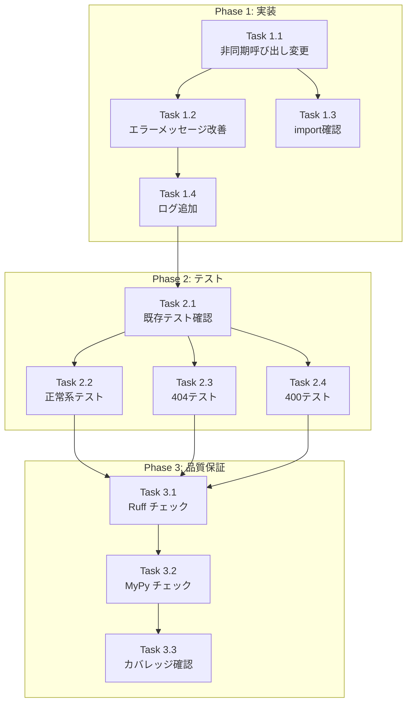

# Issue #240 作業計画書

## marp_report_endpoints の非同期対応

---

## Issue 概要

| 項目 | 値 |
|-----|-----|
| **Issue番号** | [#240](https://github.com/Kewton/MySwiftAgent/issues/240) |
| **親Issue** | [#193](https://github.com/Kewton/MySwiftAgent/issues/193) |
| **サイズ** | S (2 Story Points) |
| **作業見積** | 2-3時間 |
| **優先度** | High |
| **Phase** | 2（エンドポイント更新） |
| **依存Issue** | #239（JobCreationStateManager の非同期メソッドが必要） |
| **並列可能** | #241 と並列実行可能 |

---

## 現状分析

### 変更対象コード

**`expertAgent/app/api/v1/marp_report_endpoints.py` (Lines 289-294)**:
```python
# 現在の実装
job_status = job_state_manager.get_status(job_id)

if not job_status:
    msg = f"Job ID not found: {job_id}"
    raise HTTPException(status_code=404, detail=msg)
```

### 変更後のコード

```python
# 非同期対応後
job_status = await job_state_manager.get_status_async(job_id)

if not job_status:
    msg = "Job not found or expired. Job results are kept for 24 hours."
    raise HTTPException(status_code=404, detail=msg)
```

---

## 詳細タスク分解

### Phase 1: 実装（45分）

#### Task 1.1: 非同期メソッド呼び出しへの変更
- **所要時間**: 15分
- **成果物**: `expertAgent/app/api/v1/marp_report_endpoints.py`
- **依存**: なし
- **内容**:
  - Line 290: `job_state_manager.get_status(job_id)` → `await job_state_manager.get_status_async(job_id)`
  - 関数は既に `async def` なので追加変更不要

#### Task 1.2: エラーメッセージの改善
- **所要時間**: 10分
- **成果物**: `expertAgent/app/api/v1/marp_report_endpoints.py`
- **依存**: Task 1.1
- **内容**:
  - Line 293-294: エラーメッセージを改善
  - 現在: `f"Job ID not found: {job_id}"`
  - 改善後: `"Job not found or expired. Job results are kept for 24 hours."`

#### Task 1.3: import 文の確認
- **所要時間**: 5分
- **成果物**: `expertAgent/app/api/v1/marp_report_endpoints.py`
- **依存**: Task 1.1
- **内容**:
  - `job_state_manager` のインポートが正しいことを確認
  - 非同期メソッドが利用可能であることを確認（#239 完了が前提）

#### Task 1.4: ログメッセージの追加（オプション）
- **所要時間**: 15分
- **成果物**: `expertAgent/app/api/v1/marp_report_endpoints.py`
- **依存**: Task 1.2
- **内容**:
  - 404 エラー時に DEBUG レベルでログ出力
  - `logger.debug(f"Job not found or expired: job_id={job_id}")`

### Phase 2: テスト更新（1時間）

#### Task 2.1: 既存テストの確認・修正
- **所要時間**: 15分
- **成果物**: `expertAgent/tests/unit/test_marp_report_endpoints.py`
- **依存**: Phase 1 完了
- **内容**:
  - `get_marp_report_by_job_id` 関数のテストが既存か確認
  - 既存テストがあれば非同期モック対応に修正

#### Task 2.2: 正常系テスト作成
- **所要時間**: 15分
- **成果物**: `test_get_marp_report_by_job_id_success`
- **依存**: Task 2.1
- **内容**:
  - 完了済みジョブのスライド取得成功
  - `job_state_manager.get_status_async` をモック
  - レスポンス構造の検証

#### Task 2.3: 異常系テスト - job_id 不存在
- **所要時間**: 15分
- **成果物**: `test_get_marp_report_by_job_id_not_found`
- **依存**: Task 2.1
- **内容**:
  - 存在しない job_id で 404 エラー
  - **重要**: エラーメッセージが改善版であることを検証
  - `"Job not found or expired"` が含まれることを確認

#### Task 2.4: 異常系テスト - 未完了ジョブ
- **所要時間**: 15分
- **成果物**: `test_get_marp_report_by_job_id_not_completed`
- **依存**: Task 2.1
- **内容**:
  - 未完了（`status="creating"`）ジョブで 400 エラー
  - エラーメッセージに現在のステータスが含まれることを検証

### Phase 3: 品質保証（30分）

#### Task 3.1: Ruff チェック・修正
- **所要時間**: 10分
- **成果物**: リントエラーゼロ
- **依存**: Phase 1, 2 完了
- **コマンド**: `uv run ruff check expertAgent/app/api/v1/marp_report_endpoints.py expertAgent/tests/unit/test_marp_report_endpoints.py`

#### Task 3.2: MyPy 型チェック・修正
- **所要時間**: 10分
- **成果物**: 型エラーゼロ
- **依存**: Task 3.1
- **コマンド**: `uv run mypy expertAgent/app/api/v1/marp_report_endpoints.py`

#### Task 3.3: テストカバレッジ確認
- **所要時間**: 10分
- **成果物**: 90%以上のカバレッジ
- **依存**: Task 3.2
- **コマンド**: `uv run pytest expertAgent/tests/unit/test_marp_report_endpoints.py -v --cov=expertAgent/app/api/v1/marp_report_endpoints --cov-report=term-missing`

---

## タスク依存関係



---

## 作業スケジュール

### Session 1 (2-3時間)

| 時間 | タスク | 成果物 |
|------|--------|--------|
| 0:00-0:15 | Task 1.1 | 非同期呼び出し変更完了 |
| 0:15-0:25 | Task 1.2 | エラーメッセージ改善完了 |
| 0:25-0:30 | Task 1.3 | import 確認完了 |
| 0:30-0:45 | Task 1.4 | ログ追加（オプション） |
| 0:45-1:00 | Task 2.1 | 既存テスト確認・修正 |
| 1:00-1:15 | Task 2.2 | 正常系テスト作成 |
| 1:15-1:30 | Task 2.3 | 404 テスト作成 |
| 1:30-1:45 | Task 2.4 | 400 テスト作成 |
| 1:45-1:55 | Task 3.1 | Ruff チェック |
| 1:55-2:05 | Task 3.2 | MyPy チェック |
| 2:05-2:15 | Task 3.3 | カバレッジ確認 |

**総作業時間**: 約2-2.5時間

---

## チェックポイント

| タイミング | 確認事項 | 対応 |
|-----------|---------|------|
| Task 1.2 完了時 | 手動で 404 エラーメッセージ確認 | curl またはテストで確認 |
| Phase 1 完了時 | 既存テストがパスすること | `uv run pytest` で確認 |
| Task 2.3 完了時 | 改善メッセージがテストで検証されること | テストコード確認 |
| Phase 3 完了時 | CI 品質基準達成 | カバレッジ・静的解析確認 |

---

## リスクと対策

| リスク | 発生確率 | 影響 | 対策 |
|-------|---------|------|------|
| #239 未完了 | 低 | 作業ブロック | #239 の完了を待つ |
| 非同期モックの複雑さ | 中 | テスト遅延30分 | `AsyncMock` 使用 |
| 既存テスト破損 | 低 | 修正30分 | 変更箇所のみテスト対象 |

---

## 成果物チェックリスト

### コード
- [ ] `expertAgent/app/api/v1/marp_report_endpoints.py`
  - [ ] Line 290: `get_status_async()` 呼び出し
  - [ ] Line 293-294: 改善エラーメッセージ
  - [ ] DEBUG ログ追加（オプション）

### テスト
- [ ] `expertAgent/tests/unit/test_marp_report_endpoints.py`
  - [ ] `test_get_marp_report_by_job_id_success`
  - [ ] `test_get_marp_report_by_job_id_not_found`
  - [ ] `test_get_marp_report_by_job_id_not_completed`

### 品質
- [ ] Ruff チェックパス
- [ ] MyPy 型チェックパス
- [ ] 単体テストカバレッジ 90%以上

---

## Definition of Done

Issue #240 完了条件：

### 🤖 自動検証可能な基準（必須）
- [ ] 全タスク完了
- [ ] `GET /v1/marp-report/{job_id}` が非同期で `JobCreationStateManager` を呼び出す
- [ ] 404 エラー時のメッセージが「Job not found or expired...」に変更される
- [ ] 既存の正常系動作が維持される
- [ ] 単体テストカバレッジ 90%以上
- [ ] Ruff/MyPy エラーゼロ

### 👤 手動検証が必要な基準（推奨）
- [ ] フロントエンドでエラーメッセージが正しく表示される

---

## テストコード参考

### 非同期モックの使用例

```python
import pytest
from unittest.mock import AsyncMock, patch, MagicMock
from datetime import datetime

from app.api.v1.marp_report_endpoints import get_marp_report_by_job_id
from app.services.job_creation_state import JobCreationStatus


class TestGetMarpReportByJobId:
    """Test get_marp_report_by_job_id endpoint."""

    @pytest.mark.asyncio
    @patch("app.api.v1.marp_report_endpoints.job_state_manager")
    async def test_get_marp_report_by_job_id_not_found(
        self, mock_manager: MagicMock
    ):
        """Test 404 error with improved message."""
        # Mock get_status_async to return None
        mock_manager.get_status_async = AsyncMock(return_value=None)

        with pytest.raises(HTTPException) as exc_info:
            await get_marp_report_by_job_id("nonexistent-job-id")

        assert exc_info.value.status_code == 404
        assert "Job not found or expired" in str(exc_info.value.detail)
        assert "24 hours" in str(exc_info.value.detail)

    @pytest.mark.asyncio
    @patch("app.api.v1.marp_report_endpoints.job_state_manager")
    async def test_get_marp_report_by_job_id_not_completed(
        self, mock_manager: MagicMock
    ):
        """Test 400 error for incomplete job."""
        # Mock job status with creating status
        mock_status = JobCreationStatus(
            job_id="test-job-id",
            status="creating",
            progress=50,
            start_time=datetime.now(),
        )
        mock_manager.get_status_async = AsyncMock(return_value=mock_status)

        with pytest.raises(HTTPException) as exc_info:
            await get_marp_report_by_job_id("test-job-id")

        assert exc_info.value.status_code == 400
        assert "not completed" in str(exc_info.value.detail).lower()
```

---

## 次のアクション

作業計画承認後：
1. **前提確認**: Issue #239 が完了していることを確認
2. **ブランチ作成**: `fix/issue/240` または既存の `fix/issue/239` ブランチで作業
3. **TDD 開発開始**: `/pm-auto-dev 240` または `/tdd-impl 240`
4. **進捗報告**: `/progress-report 240` で報告

---

## 関連ドキュメント

- [Issue #240](https://github.com/Kewton/MySwiftAgent/issues/240)
- [Issue #193 (親Issue)](https://github.com/Kewton/MySwiftAgent/issues/193)
- [Issue #239 (依存先)](https://github.com/Kewton/MySwiftAgent/issues/239)
- [requirements.md](../issue/193/requirements.md)
- [design-policy.md](../issue/193/design-policy.md)
