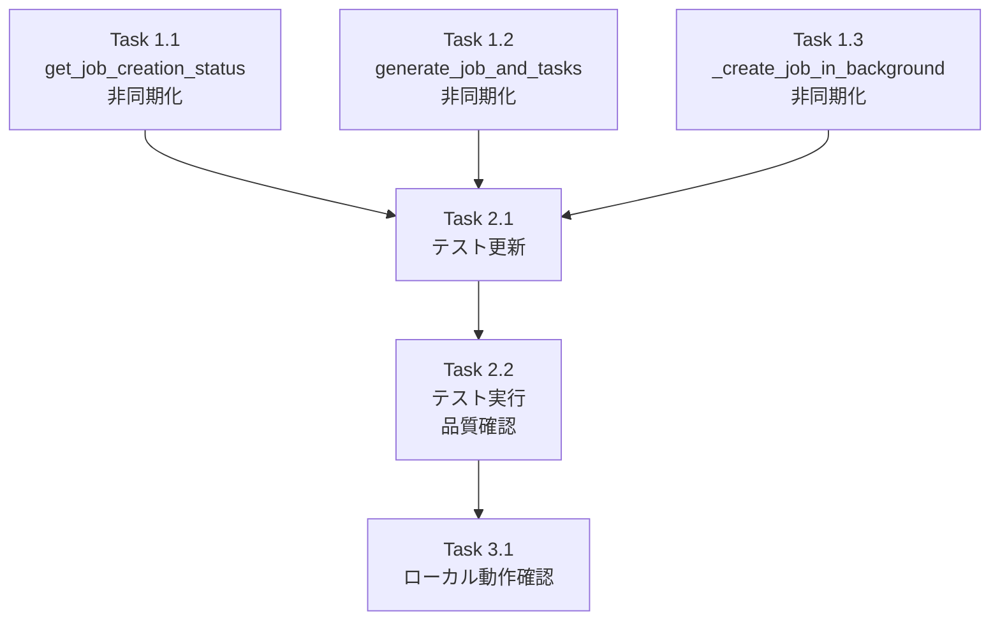

# Issue #241 作業計画書

## job_generator_endpoints の非同期対応

**作成日**: 2025-12-06
**Issue**: [#241](https://github.com/Kewton/MySwiftAgent/issues/241)
**親Issue**: [#193](https://github.com/Kewton/MySwiftAgent/issues/193)
**ステータス**: Draft

---

## Issue 概要

| 項目 | 値 |
|------|-----|
| **Issue番号** | #241 |
| **タイトル** | job_generator_endpoints の非同期対応 |
| **サイズ** | S (2 Story Points) |
| **作業見積** | 2-3時間 |
| **優先度** | High |
| **Phase** | 2（エンドポイント更新） |

### 依存関係

| Issue | タイトル | 状態 |
|-------|---------|------|
| #239 | JobCreationStateManager の Valkey 連携実装 | ✅ CLOSED |
| #240 | marp_report_endpoints の非同期対応 | ✅ CLOSED |

---

## 詳細タスク分解

### Phase 1: 実装（1.5時間）

#### Task 1.1: get_job_creation_status() の非同期対応
- **所要時間**: 15分
- **変更箇所**: `expertAgent/app/api/v1/job_generator_endpoints.py` (line 94)
- **変更内容**:
  ```python
  # Before
  status = job_state_manager.get_status(job_id)

  # After
  status = await job_state_manager.get_status_async(job_id)
  ```

#### Task 1.2: generate_job_and_tasks() の非同期対応
- **所要時間**: 15分
- **変更箇所**: `expertAgent/app/api/v1/job_generator_endpoints.py` (line 163)
- **変更内容**:
  ```python
  # Before
  job_state_manager.create_job(job_id)

  # After
  await job_state_manager.create_job_async(job_id)
  ```

#### Task 1.3: _create_job_in_background() の非同期対応
- **所要時間**: 30分
- **変更箇所**: `expertAgent/app/api/v1/job_generator_endpoints.py`
- **変更内容（6箇所）**:

  | 行番号 | Before | After |
  |--------|--------|-------|
  | 215 | `job_state_manager.update_progress(job_id, 10)` | `await job_state_manager.update_progress_async(job_id, 10)` |
  | 221 | `job_state_manager.update_progress(job_id, 20)` | `await job_state_manager.update_progress_async(job_id, 20)` |
  | 230 | `job_state_manager.update_progress(job_id, 90)` | `await job_state_manager.update_progress_async(job_id, 90)` |
  | 240 | `job_state_manager.mark_completed(...)` | `await job_state_manager.mark_completed_async(...)` |
  | 249 | `job_state_manager.mark_failed(...)` | `await job_state_manager.mark_failed_async(...)` |

### Phase 2: テスト更新（1時間）

#### Task 2.1: 単体テストの非同期モック対応
- **所要時間**: 45分
- **変更箇所**: `expertAgent/tests/unit/test_job_generator_endpoints.py`
- **変更内容**:
  - `job_state_manager.get_status` → `job_state_manager.get_status_async` モック
  - `job_state_manager.create_job` → `job_state_manager.create_job_async` モック
  - `AsyncMock` の使用

#### Task 2.2: テスト実行と品質確認
- **所要時間**: 15分
- **確認項目**:
  - [ ] 既存テストがパス
  - [ ] Ruff/MyPy エラーゼロ
  - [ ] カバレッジ 90%以上

### Phase 3: 検証（30分）

#### Task 3.1: ローカル動作確認
- **所要時間**: 30分
- **確認項目**:
  - [ ] POST /v1/job-generator でジョブ作成成功
  - [ ] GET /v1/jobs/{job_id}/status で進捗取得成功
  - [ ] ジョブ完了後、Valkey に永続化されている

---

## タスク依存関係



---

## 変更対象ファイル

| ファイル | 変更内容 | 変更行数（概算） |
|---------|---------|--------------|
| `expertAgent/app/api/v1/job_generator_endpoints.py` | 6箇所の非同期呼び出し変更 | ~10行 |
| `expertAgent/tests/unit/test_job_generator_endpoints.py` | モックの非同期対応 | ~20行 |

---

## 技術詳細

### 使用する非同期メソッド

`JobCreationStateManager` で実装済みの非同期メソッド:

| メソッド | 用途 | 行番号 |
|---------|------|--------|
| `get_status_async()` | ジョブ状態取得（L1 → L2 キャッシュ） | 315-334 |
| `create_job_async()` | ジョブ作成（L1 → L2 書き込み） | 336-349 |
| `update_progress_async()` | 進捗更新（L1 → L2 書き込み） | 351-368 |
| `mark_completed_async()` | 完了マーク（L1 → L2 永続化） | 370-393 |
| `mark_failed_async()` | 失敗マーク（L1 → L2 永続化） | 395-412 |

### キャッシュ戦略

```
Write Path (ジョブ作成・更新時):
1. L1 (Memory) に書き込み
2. L2 (Valkey) に永続化 (TTL: 24h)

Read Path (ステータス取得時):
1. L1 (Memory) をチェック → Hit: Return
2. L2 (Valkey) をチェック → Hit: L1 にポピュレート → Return
3. Miss: None を返す
```

---

## 受入基準チェックリスト

### 機能要件
- [ ] ジョブ作成フローが非同期メソッドを使用して動作する
- [ ] ジョブ作成完了時に Valkey に永続化される
- [ ] 既存のジョブ作成機能が正常に動作する

### 品質基準
- [ ] 単体テストカバレッジ 90%以上
- [ ] Ruff/MyPy エラーゼロ

### テストケース
- [ ] 正常系: ジョブ作成 → 進捗更新 → 完了マーク → Valkey 永続化
- [ ] 正常系: ジョブ作成状態の取得（L1 ヒット）
- [ ] 異常系: ジョブ作成失敗時のエラーハンドリング

---

## リスクと対策

| リスク | 発生確率 | 影響度 | 対策 |
|-------|---------|--------|------|
| テストモックの不整合 | 中 | 中 | AsyncMock を適切に使用 |
| 既存テスト失敗 | 低 | 中 | 変更前後でテスト実行 |
| Valkey 接続エラー | 低 | 低 | Graceful Degradation 実装済み |

---

## 実行コマンド

```bash
# Phase 1: 実装後の静的解析
cd expertAgent
uv run ruff check app/api/v1/job_generator_endpoints.py
uv run mypy app/api/v1/job_generator_endpoints.py

# Phase 2: テスト実行
uv run pytest tests/unit/test_job_generator_endpoints.py -v

# Phase 3: カバレッジ確認
uv run pytest tests/unit/test_job_generator_endpoints.py --cov=app/api/v1/job_generator_endpoints --cov-report=term-missing

# 全体チェック
./scripts/pre-push-check-all.sh
```

---

## Definition of Done

- [ ] すべてのタスクが完了
- [ ] 単体テストカバレッジ 90%以上
- [ ] Ruff/MyPy エラーゼロ
- [ ] CI/CD グリーン
- [ ] ローカル動作確認完了
- [ ] PR 作成準備完了

---

## 関連ドキュメント

- [Issue #193 requirements.md](../193/requirements.md)
- [Issue #193 design-policy.md](../193/design-policy.md)
- [Issue #240 work-plan.md](../240/work-plan.md) - 参考: marp_report_endpoints の非同期対応

---

## 次のアクション

作業計画承認後:
1. **ブランチ作成**: `fix/issue/241`
2. **worktree作成**: 別セッションで作業開始
3. **TDD実行**: `/tdd-impl` で実装
4. **進捗報告**: `/progress-report` で定期報告
