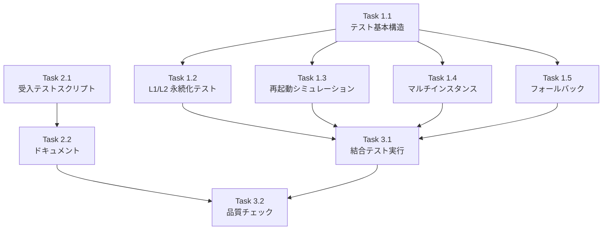

# Issue #242 作業計画書

## 結合テスト・受入テスト作成

**作成日**: 2025-12-06
**Issue**: [#242](https://github.com/Kewton/MySwiftAgent/issues/242)
**親Issue**: [#193](https://github.com/Kewton/MySwiftAgent/issues/193)
**ステータス**: Draft

---

## Issue 概要

| 項目 | 値 |
|------|-----|
| **Issue番号** | #242 |
| **タイトル** | 結合テスト・受入テスト作成 |
| **サイズ** | S (2 Story Points) |
| **作業見積** | 2-3時間 |
| **優先度** | Medium |
| **Phase** | 3（テスト・品質保証） |

### 依存関係

| Issue | タイトル | 状態 |
|-------|---------|------|
| #239 | JobCreationStateManager の Valkey 連携実装 | ✅ CLOSED |
| #240 | marp_report_endpoints の非同期対応 | ✅ CLOSED |
| #241 | job_generator_endpoints の非同期対応 | ✅ CLOSED |

---

## 詳細タスク分解

### Phase 1: 結合テスト作成（1.5時間）

#### Task 1.1: テストファイル作成と基本構造
- **所要時間**: 20分
- **成果物**: `expertAgent/tests/integration/test_marp_report_persistence.py`
- **内容**:
  - pytest fixtures（valkey_test_client 活用）
  - `@pytest.mark.integration` デコレータ
  - テストクラス構造定義

#### Task 1.2: L1/L2 キャッシュ永続化テスト
- **所要時間**: 30分
- **テストケース**:
  ```python
  async def test_job_creation_persisted_to_valkey():
      """ジョブ作成 → Valkey 永続化を検証"""
      # Given: 新しい JobCreationStateManager インスタンス
      # When: create_job_async → mark_completed_async
      # Then: Valkey にデータが存在する
  ```

#### Task 1.3: サーバー再起動シミュレーションテスト
- **所要時間**: 30分
- **テストケース**:
  ```python
  async def test_status_restored_after_memory_clear():
      """インメモリクリア後、Valkey から復元を検証"""
      # Given: ジョブを作成して Valkey に永続化
      # When: インメモリキャッシュをクリア（サーバー再起動シミュレーション）
      # Then: get_status_async で Valkey から復元される
  ```

#### Task 1.4: マルチインスタンスシミュレーションテスト
- **所要時間**: 20分
- **テストケース**:
  ```python
  async def test_multi_instance_access():
      """異なる StateManager インスタンスからアクセスを検証"""
      # Given: インスタンス A でジョブ作成・永続化
      # When: インスタンス B（新規）で get_status_async
      # Then: Valkey から正しく取得できる
  ```

#### Task 1.5: Valkey ダウン時フォールバックテスト
- **所要時間**: 20分
- **テストケース**:
  ```python
  async def test_graceful_degradation_without_valkey():
      """Valkey 接続なしでもインメモリで動作を検証"""
      # Given: Valkey 未接続の StateManager
      # When: create_job_async → get_status_async
      # Then: インメモリのみで正常動作
  ```

### Phase 2: 受入テストシナリオ作成（1時間）

#### Task 2.1: 受入テストスクリプト作成
- **所要時間**: 40分
- **成果物**: `tests/acceptance/test_issue_193_acceptance.sh`
- **シナリオ**:

  | シナリオ | 内容 |
  |---------|------|
  | AC-1 | ジョブ作成 → サーバー再起動 → スライド表示 |
  | AC-2 | ジョブ作成 → ページリロード → スライド表示 |
  | AC-3 | 1時間以上経過したジョブのスライド表示 |

#### Task 2.2: 受入テストドキュメント作成
- **所要時間**: 20分
- **成果物**: `tests/acceptance/README_issue_193.md`
- **内容**:
  - 前提条件（Valkey 起動、expertAgent 起動）
  - 実行手順
  - 期待結果

### Phase 3: テスト実行・品質確認（30分）

#### Task 3.1: 結合テスト実行
- **所要時間**: 15分
- **確認項目**:
  - [ ] 全テストケースがパス
  - [ ] カバレッジ 50%以上

#### Task 3.2: 静的解析・品質チェック
- **所要時間**: 15分
- **確認項目**:
  - [ ] Ruff/MyPy エラーゼロ
  - [ ] CI/CD グリーン

---

## タスク依存関係



---

## 変更対象ファイル

| ファイル | 変更内容 | 新規/修正 |
|---------|---------|---------|
| `expertAgent/tests/integration/test_marp_report_persistence.py` | Valkey 永続化結合テスト | 新規 |
| `tests/acceptance/test_issue_193_acceptance.sh` | 受入テストシナリオ | 新規 |
| `tests/acceptance/README_issue_193.md` | 受入テスト手順書 | 新規 |

---

## テスト設計詳細

### 結合テストクラス構造

```python
@pytest.mark.integration
class TestMarpReportPersistence:
    """Marp Report 永続化の結合テスト"""

    # --- L1/L2 キャッシュテスト ---
    async def test_job_creation_persisted_to_valkey(self): ...
    async def test_status_restored_after_memory_clear(self): ...

    # --- マルチインスタンステスト ---
    async def test_multi_instance_access(self): ...

    # --- フォールバックテスト ---
    async def test_graceful_degradation_without_valkey(self): ...
    async def test_valkey_reconnection_after_temporary_failure(self): ...
```

### 使用するフィクスチャ

```python
@pytest.fixture
async def job_state_manager_with_valkey(valkey_test_client):
    """Valkey 接続済みの JobCreationStateManager"""
    manager = JobCreationStateManager()
    manager.configure_valkey(
        host="localhost",
        port=6379,
        ttl_seconds=3600,
    )
    await manager.connect_valkey()
    yield manager
    await manager.disconnect_valkey()

@pytest.fixture
def job_state_manager_without_valkey():
    """Valkey 未接続の JobCreationStateManager"""
    return JobCreationStateManager()
```

### 受入テストシナリオ詳細

#### AC-1: サーバー再起動耐性

```bash
# 1. サービス起動
./scripts/unified-start.sh start

# 2. ジョブ作成（myAgentDesk または curl）
JOB_ID=$(curl -X POST http://localhost:8104/aiagent-api/v1/job-generator \
  -H "Content-Type: application/json" \
  -d '{"user_requirement": "テスト用ジョブ"}' | jq -r '.job_id')

# 3. 完了待機
sleep 30

# 4. expertAgent のみ再起動
pkill -f "expertAgent"
cd expertAgent && uv run uvicorn app.main:app --port 8104 &
sleep 5

# 5. スライド取得
curl http://localhost:8104/aiagent-api/v1/marp-report/$JOB_ID

# 期待結果: 200 OK でスライドが返される
```

---

## 受入基準チェックリスト

### 機能要件（自動検証）
- [ ] 結合テストが Valkey コンテナを使用して実行される
- [ ] サーバー再起動後もジョブ状態が取得できることを検証
- [ ] 結合テストカバレッジ 50%以上

### テストケース
- [ ] 正常系: ジョブ作成 → Valkey 永続化 → インメモリクリア → Valkey から復元
- [ ] 正常系: マルチインスタンスシミュレーション
- [ ] 異常系: Valkey ダウン時のフォールバック動作

### 手動検証（E2E - Issue #193 最終受入基準）
- [ ] myAgentDesk でジョブ作成後、ページリロードしてもスライドが表示される
- [ ] expertAgent サーバー再起動後もスライドが表示される
- [ ] 1時間以上経過したジョブでもスライドが表示される（24時間以内）

---

## リスクと対策

| リスク | 発生確率 | 影響度 | 対策 |
|-------|---------|--------|------|
| Valkey コンテナ未起動 | 中 | 高 | conftest.py で自動起動/スキップ |
| テスト間のデータ競合 | 低 | 中 | 各テストでユニークな job_id 使用 |
| TTL による予期せぬ削除 | 低 | 中 | テスト用に長い TTL (3600秒) 設定 |

---

## 実行コマンド

```bash
# Phase 1: 結合テスト実行
cd expertAgent
uv run pytest tests/integration/test_marp_report_persistence.py -v --cov=app/services/job_creation_state --cov-report=term-missing

# Phase 2: 受入テスト実行（ローカルのみ）
chmod +x tests/acceptance/test_issue_193_acceptance.sh
./tests/acceptance/test_issue_193_acceptance.sh

# Phase 3: 品質チェック
uv run ruff check tests/integration/test_marp_report_persistence.py
uv run mypy tests/integration/test_marp_report_persistence.py

# 全体チェック
./scripts/pre-push-check-all.sh
```

---

## Definition of Done

- [ ] すべての結合テストがパス
- [ ] 結合テストカバレッジ 50%以上
- [ ] Ruff/MyPy エラーゼロ
- [ ] CI/CD グリーン
- [ ] 受入テストスクリプト作成完了
- [ ] 受入テストドキュメント作成完了
- [ ] PR 作成準備完了

---

## 完了後のアクション

Issue #242 完了後:
1. **Issue #193 クローズ準備**: 手動 E2E 検証を実施
2. **親 Issue 更新**: #193 の進捗を 100% に更新
3. **リリースノート**: Marp Report 永続化機能のリリースノート作成

---

## 関連ドキュメント

- [Issue #193 requirements.md](../193/requirements.md)
- [Issue #193 design-policy.md](../193/design-policy.md)
- [test_valkey_integration.py](../../expertAgent/tests/integration/test_valkey_integration.py) - 参考パターン
- [acceptance-testing.md](../../docs/spec/acceptance-testing.md) - 受入テスト方針

---

## 次のアクション

作業計画承認後:
1. **ブランチ作成**: `fix/issue/242`
2. **worktree作成**: `/worktree-setup 242`
3. **TDD実行**: `/tdd-impl` で実装
4. **進捗報告**: `/progress-report` で定期報告
