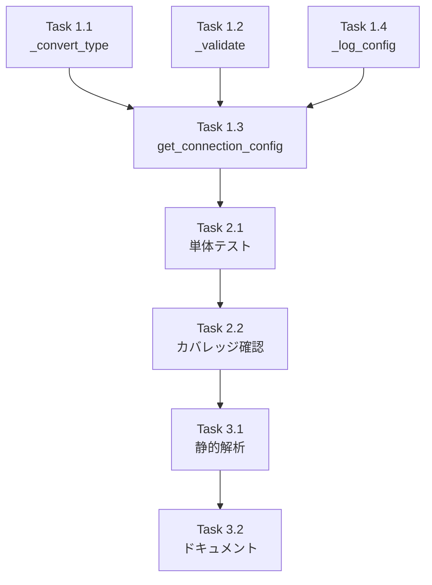

# Issue #250 作業計画書

## SecretsManager 拡張（get_connection_config）

**作成日**: 2025-12-07
**Issue**: [#250](https://github.com/Kewton/MySwiftAgent/issues/250)
**親Issue**: [#248](https://github.com/Kewton/MySwiftAgent/issues/248)
**ステータス**: Draft

---

## Issue 概要

| 項目 | 値 |
|------|-----|
| **Issue番号** | #250 |
| **タイトル** | SecretsManager 拡張（get_connection_config） |
| **サイズ** | S (2 Story Points) |
| **作業見積** | 3時間 |
| **優先度** | High |
| **Phase** | 1（基盤構築） |

### 依存関係

| Issue | タイトル | 状態 |
|-------|---------|------|
| なし | - | - |

### ブロック対象

| Issue | タイトル |
|-------|---------|
| #252 | Valkey 初期化の myVault 対応 |
| #253 | Langfuse HOST の myVault 対応 |

---

## 詳細タスク分解

### Phase 1: 実装（1.5時間）

#### Task 1.1: `_convert_type()` ヘルパーメソッド実装
- **所要時間**: 20分
- **成果物**: `expertAgent/core/secrets.py` 内に追加
- **内容**:
  - 文字列→int 変換
  - 文字列→bool 変換（"true", "1", "yes", "on" → True）
  - 未対応型のエラーハンドリング
  - エラーメッセージの詳細化

```python
def _convert_type(self, value: str, value_type: type) -> Any:
    """Convert string value to specified type."""
    if value_type == str:
        return value
    elif value_type == int:
        try:
            return int(value)
        except ValueError as e:
            raise ValueError(
                f"Failed to convert '{value}' to int: {e}"
            ) from e
    elif value_type == bool:
        return value.lower() in ("true", "1", "yes", "on")
    else:
        raise ValueError(f"Unsupported type: {value_type}")
```

#### Task 1.2: `_validate_connection_config()` バリデーション実装
- **所要時間**: 15分
- **成果物**: `expertAgent/core/secrets.py` 内に追加
- **内容**:
  - ポート番号範囲チェック（1-65535）
  - ホスト名長さチェック（1-255）

```python
def _validate_connection_config(
    self, key: str, value: Any, value_type: type
) -> None:
    """Validate connection configuration value."""
    if key.endswith("_PORT") and value_type == int:
        if not (1 <= value <= 65535):
            raise ValueError(f"Invalid port number: {value}")
    if key.endswith("_HOST") and value_type == str:
        if not value or len(value) > 255:
            raise ValueError(f"Invalid hostname: {value}")
```

#### Task 1.3: `get_connection_config()` メインメソッド実装
- **所要時間**: 30分
- **成果物**: `expertAgent/core/secrets.py` 内に追加
- **内容**:
  - myVault 優先取得ロジック
  - 環境変数フォールバック
  - デフォルト値処理
  - 型変換呼び出し
  - バリデーション呼び出し

```python
def get_connection_config(
    self,
    key: str,
    project: Optional[str] = None,
    *,
    default: Optional[Any] = None,
    value_type: type = str,
) -> Any:
    """Get connection configuration with type conversion.

    Priority:
    1. myVault (if enabled)
    2. Environment variable (fallback)
    3. Default value (if provided)
    4. Raise ValueError if not found
    """
    # 1. Try myVault first
    if self.myvault_enabled and self.myvault_client:
        try:
            value = self._get_from_myvault(key, project)
            if value:
                converted = self._convert_type(value, value_type)
                self._validate_connection_config(key, converted, value_type)
                self._log_config_retrieval(key, "myVault", converted)
                return converted
        except MyVaultError:
            pass  # Continue to fallback

    # 2. Fallback to environment variable
    env_value = getattr(self.settings, key, None)
    if env_value is not None:
        str_value = str(env_value)
        converted = self._convert_type(str_value, value_type)
        self._validate_connection_config(key, converted, value_type)
        self._log_config_retrieval(key, "env", converted)
        return converted

    # 3. Use default if provided
    if default is not None:
        return default

    # 4. Not found
    raise ValueError(
        f"Config '{key}' not found in myVault or environment variables"
    )
```

#### Task 1.4: `_log_config_retrieval()` ログ出力メソッド実装
- **所要時間**: 15分
- **成果物**: `expertAgent/core/secrets.py` 内に追加
- **内容**:
  - ポート番号等はそのまま出力
  - ホスト名は部分マスキング
  - その他は完全マスキング

```python
def _log_config_retrieval(
    self, key: str, source: str, value: Any
) -> None:
    """Log configuration retrieval with masking."""
    if key.endswith(("_PORT", "_DB", "_TTL")):
        logger.info(f"Config '{key}' from {source}: {value}")
    elif key.endswith("_HOST"):
        masked = str(value)[:10] + "***" if len(str(value)) > 10 else value
        logger.info(f"Config '{key}' from {source}: {masked}")
    else:
        logger.info(f"Config '{key}' from {source}: ***")
```

### Phase 2: テスト作成（1時間）

#### Task 2.1: 単体テスト作成
- **所要時間**: 45分
- **成果物**: `expertAgent/tests/unit/test_secrets_connection_config.py`
- **テストケース**:

| テストケース | 内容 |
|-------------|------|
| `test_get_connection_config_string` | myVault から文字列値取得 |
| `test_get_connection_config_int` | myVault から整数値取得（型変換） |
| `test_get_connection_config_bool_true` | bool 変換 ("true" → True) |
| `test_get_connection_config_bool_false` | bool 変換 ("false" → False) |
| `test_get_connection_config_env_fallback` | myVault 未登録時に環境変数フォールバック |
| `test_get_connection_config_default` | デフォルト値使用 |
| `test_get_connection_config_not_found` | ValueError 発生 |
| `test_convert_type_invalid_int` | 型変換失敗エラーメッセージ |
| `test_convert_type_unsupported` | 未対応型エラー |
| `test_validate_port_out_of_range` | ポート番号範囲外エラー |
| `test_validate_host_empty` | 空ホスト名エラー |
| `test_log_config_port_unmasked` | ポート番号はマスキングなし |
| `test_log_config_host_masked` | ホスト名は部分マスキング |

#### Task 2.2: テスト実行・カバレッジ確認
- **所要時間**: 15分
- **確認項目**:
  - [ ] 全テストケースがパス
  - [ ] カバレッジ 90%以上

### Phase 3: 品質確認（30分）

#### Task 3.1: 静的解析
- **所要時間**: 15分
- **確認項目**:
  - [ ] Ruff エラーゼロ
  - [ ] MyPy エラーゼロ

#### Task 3.2: ドキュメント確認
- **所要時間**: 15分
- **確認項目**:
  - [ ] docstring が適切
  - [ ] 型ヒントが正確

---

## タスク依存関係



---

## 作業スケジュール

**3時間作業**

| 時間 | タスク | 成果物 |
|------|-------|--------|
| 0:00-0:20 | Task 1.1: `_convert_type()` 実装 | メソッド追加 |
| 0:20-0:35 | Task 1.2: `_validate_connection_config()` 実装 | メソッド追加 |
| 0:35-1:05 | Task 1.3: `get_connection_config()` 実装 | メインメソッド |
| 1:05-1:20 | Task 1.4: `_log_config_retrieval()` 実装 | ログメソッド |
| 1:20-2:05 | Task 2.1: 単体テスト作成 | 13テストケース |
| 2:05-2:20 | Task 2.2: テスト実行・カバレッジ確認 | 90%以上達成 |
| 2:20-2:35 | Task 3.1: 静的解析 | エラーゼロ確認 |
| 2:35-2:50 | Task 3.2: ドキュメント確認 | docstring確認 |
| 2:50-3:00 | PR準備・コミット | PR作成 |

---

## 変更対象ファイル

| ファイル | 変更内容 | 新規/修正 |
|---------|---------|---------|
| `expertAgent/core/secrets.py` | 4メソッド追加（約80行） | 修正 |
| `expertAgent/tests/unit/test_secrets_connection_config.py` | 13テストケース | 新規 |

---

## 実装詳細

### 挿入位置

`expertAgent/core/secrets.py` の `SecretsManager` クラス内、`clear_cache()` メソッドの後（line 147付近）に以下を追加：

1. `_convert_type()` (line 148-165)
2. `_validate_connection_config()` (line 167-175)
3. `_log_config_retrieval()` (line 177-185)
4. `get_connection_config()` (line 187-230)

### テストファイル構造

```python
# expertAgent/tests/unit/test_secrets_connection_config.py

import pytest
from unittest.mock import Mock, patch

from core.secrets import SecretsManager


class TestGetConnectionConfig:
    """Tests for get_connection_config method."""

    @pytest.fixture
    def mock_settings(self):
        """Mock settings with connection configs."""
        mock = Mock()
        mock.MYVAULT_ENABLED = True
        mock.MYVAULT_BASE_URL = "http://localhost:8103"
        mock.MYVAULT_SERVICE_NAME = "expertAgent"
        mock.MYVAULT_SERVICE_TOKEN = "test-token"
        mock.SECRETS_CACHE_TTL = 300
        mock.VALKEY_HOST = "localhost"
        mock.VALKEY_PORT = 6379
        mock.VALKEY_DB = 0
        return mock

    # ... 13 test methods
```

---

## 受入基準チェックリスト

### 機能要件（自動検証）
- [ ] `get_connection_config("VALKEY_PORT", value_type=int)` が整数を返す
- [ ] `get_connection_config("VALKEY_ENABLED", value_type=bool)` が真偽値を返す
- [ ] myVault に値がない場合、環境変数から取得する
- [ ] 両方にない場合、`default` パラメータの値を返す
- [ ] `default` もない場合、`ValueError` を発生させる

### 品質基準
- [ ] 単体テストカバレッジ 90%以上
- [ ] Ruff/MyPy エラーゼロ

### テストケース
- [ ] 正常系: myVault から文字列値を取得
- [ ] 正常系: myVault から整数値を取得（型変換）
- [ ] 正常系: myVault から真偽値を取得（型変換）
- [ ] 正常系: myVault 未登録時に環境変数フォールバック
- [ ] 正常系: デフォルト値使用
- [ ] 異常系: 型変換失敗時のエラーメッセージ
- [ ] 異常系: 値が見つからない場合の ValueError
- [ ] エッジケース: ポート番号範囲外（1-65535）

---

## リスクと対策

| リスク | 発生確率 | 影響度 | 対策 |
|-------|---------|--------|------|
| 既存テスト失敗 | 低 | 中 | 既存テスト実行で確認 |
| 型変換エラー | 中 | 中 | 詳細なエラーメッセージ |
| キャッシュ不整合 | 低 | 低 | 既存キャッシュ機構を再利用 |

---

## 実行コマンド

```bash
# Phase 1 完了後: 静的解析
cd expertAgent
uv run ruff check core/secrets.py
uv run mypy core/secrets.py

# Phase 2: テスト実行
uv run pytest tests/unit/test_secrets_connection_config.py -v

# Phase 2: カバレッジ確認
uv run pytest tests/unit/test_secrets_connection_config.py \
  --cov=core/secrets --cov-report=term-missing

# 全体チェック
./scripts/pre-push-check-all.sh
```

---

## Definition of Done

- [ ] すべてのタスクが完了
- [ ] 単体テストカバレッジ 90%以上
- [ ] Ruff/MyPy エラーゼロ
- [ ] CI/CD グリーン
- [ ] コードレビュー承認
- [ ] PR マージ完了

---

## 関連ドキュメント

- [Issue #248 requirements.md](../248/requirements.md)
- [Issue #248 design-policy.md](../248/design-policy.md)
- [Issue #248 architecture-review.md](../248/architecture-review.md)
- [既存テスト: test_secrets_manager.py](../../expertAgent/tests/unit/test_secrets_manager.py)

---

## 次のアクション

作業計画承認後:
1. **ブランチ作成**: `fix/issue/250`
2. **worktree作成**: `/worktree-setup 250`
3. **TDD実行**: `/tdd-impl` で実装
4. **進捗報告**: `/progress-report` で定期報告
