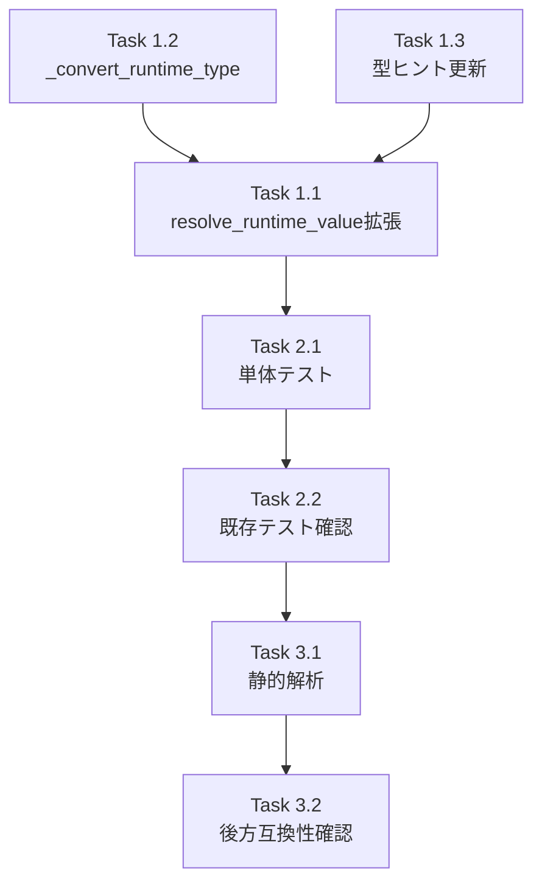

# Issue #251 作業計画書

## resolve_runtime_value 型変換対応

**作成日**: 2025-12-07
**Issue**: [#251](https://github.com/Kewton/MySwiftAgent/issues/251)
**親Issue**: [#248](https://github.com/Kewton/MySwiftAgent/issues/248)
**ステータス**: Draft

---

## Issue 概要

| 項目 | 値 |
|------|-----|
| **Issue番号** | #251 |
| **タイトル** | resolve_runtime_value 型変換対応 |
| **サイズ** | XS (1 Story Point) |
| **作業見積** | 2時間 |
| **優先度** | Medium |
| **Phase** | 1（基盤構築） |

### 依存関係

| Issue | タイトル | 状態 |
|-------|---------|------|
| なし | - | - |

### ブロック対象

| Issue | タイトル |
|-------|---------|
| なし（#250 と並列実行可能） | - |

---

## 現状分析

### 既存の `resolve_runtime_value()` 関数

**場所**: `expertAgent/core/secrets.py` (行 289-303)

```python
def resolve_runtime_value(
    key: str,
    project: Optional[str] = None,
    *,
    default: Optional[Any] = None,
):
    """Resolve configuration values with MyVault priority and env fallback."""

    if key in _SETTINGS_ONLY_KEYS:
        return getattr(settings, key, default)

    try:
        return secrets_manager.get_secret(key, project=project)
    except ValueError:
        return getattr(settings, key, default)
```

### 呼び出し箇所（10ファイル、14箇所）

| ファイル | 行 | 用途 | 期待する型 |
|---------|-----|------|-----------|
| `mymcp/stdio_action.py` | 150 | MAIL_TO | str |
| `mymcp/specializedtool/generate_melmaga_script.py` | 94 | MAIL_TO | str |
| `mymcp/utils/chatollama.py` | 32 | OLLAMA_DEF_SMALL_MODEL | str |
| `mymcp/utils/chatollama.py` | 38 | OLLAMA_URL | str |
| `mymcp/utils/chatollama.py` | 141 | MLX_LLM_SERVER_URL | str |
| `mymcp/tool/file_reader_processors.py` | 63 | OPENAI_API_KEY | str |
| `mymcp/tool/file_reader_processors.py` | 399 | OPENAI_API_KEY | str |
| `mymcp/tool/google_search_by_serper.py` | 20 | SERPER_API_KEY | str |
| `mymcp/utils/generate_subject_from_text.py` | 83 | OLLAMA_DEF_SMALL_MODEL | str |
| `mymcp/utils/extract_knowledge_from_text.py` | 37 | EXTRACT_KNOWLEDGE_MODEL | str |
| `mymcp/stdioall.py` | 93 | MAIL_TO | str |
| `mymcp/stdioall.py` | 100 | PODCAST_SCRIPT_DEFAULT_MODEL | str |
| `mymcp/tts/tts.py` | 14 | OPENAI_API_KEY | str |

**重要**: 全ての既存呼び出しは文字列を期待しているため、`value_type=str` をデフォルトにすることで**後方互換性を完全に維持**できる。

---

## 詳細タスク分解

### Phase 1: 実装（1時間）

#### Task 1.1: `resolve_runtime_value()` 関数の拡張
- **所要時間**: 30分
- **成果物**: `expertAgent/core/secrets.py` の関数修正
- **内容**:
  - `value_type: type = str` パラメータ追加
  - 型変換ロジック実装（#250 の `_convert_type()` と同等）
  - docstring 更新

```python
def resolve_runtime_value(
    key: str,
    project: Optional[str] = None,
    *,
    default: Optional[Any] = None,
    value_type: type = str,  # 新規追加（後方互換性のためデフォルトはstr）
) -> Any:
    """Resolve configuration values with MyVault priority and env fallback.

    Args:
        key: Configuration key name
        project: Optional project name for MyVault
        default: Default value if not found
        value_type: Target type for conversion (str, int, bool). Default: str

    Returns:
        Configuration value converted to specified type

    Raises:
        ValueError: If type conversion fails
    """
    if key in _SETTINGS_ONLY_KEYS:
        value = getattr(settings, key, default)
        if value is None:
            return default
        return _convert_runtime_type(str(value), value_type)

    try:
        value = secrets_manager.get_secret(key, project=project)
        return _convert_runtime_type(value, value_type)
    except ValueError:
        env_value = getattr(settings, key, None)
        if env_value is not None:
            return _convert_runtime_type(str(env_value), value_type)
        return default
```

#### Task 1.2: `_convert_runtime_type()` ヘルパー関数実装
- **所要時間**: 15分
- **成果物**: `expertAgent/core/secrets.py` 内に追加
- **内容**:
  - str→int 変換
  - str→bool 変換
  - 未対応型のエラーハンドリング

```python
def _convert_runtime_type(value: str, value_type: type) -> Any:
    """Convert string value to specified type.

    Args:
        value: String value to convert
        value_type: Target type (str, int, bool)

    Returns:
        Converted value

    Raises:
        ValueError: If conversion fails or type is unsupported
    """
    if value_type == str:
        return value
    elif value_type == int:
        try:
            return int(value)
        except ValueError as e:
            raise ValueError(
                f"Failed to convert '{value}' to int: {e}"
            ) from e
    elif value_type == bool:
        return value.lower() in ("true", "1", "yes", "on")
    else:
        raise ValueError(f"Unsupported type: {value_type}")
```

#### Task 1.3: 型ヒント・import 更新
- **所要時間**: 15分
- **成果物**: `expertAgent/core/secrets.py` の修正
- **内容**:
  - 戻り値型を `Any` に明示
  - 必要な import 追加確認

---

### Phase 2: テスト作成（45分）

#### Task 2.1: 単体テスト作成
- **所要時間**: 30分
- **成果物**: `expertAgent/tests/unit/test_resolve_runtime_value.py`
- **テストケース**:

| テストケース | 内容 |
|-------------|------|
| `test_resolve_runtime_value_default_string` | value_type 未指定時は文字列を返す（後方互換性） |
| `test_resolve_runtime_value_int_conversion` | value_type=int で整数変換 |
| `test_resolve_runtime_value_bool_true` | value_type=bool で "true" → True |
| `test_resolve_runtime_value_bool_false` | value_type=bool で "false" → False |
| `test_resolve_runtime_value_bool_1` | value_type=bool で "1" → True |
| `test_resolve_runtime_value_env_fallback_with_type` | 環境変数フォールバック + 型変換 |
| `test_resolve_runtime_value_default_with_type` | デフォルト値使用時 |
| `test_resolve_runtime_value_settings_only_key` | _SETTINGS_ONLY_KEYS のキーでの動作 |
| `test_convert_runtime_type_invalid_int` | 型変換失敗時のエラー |
| `test_convert_runtime_type_unsupported` | 未対応型のエラー |

#### Task 2.2: 既存テストの動作確認
- **所要時間**: 15分
- **確認項目**:
  - [ ] 既存の `test_secrets_manager.py` が全パス
  - [ ] 既存の `test_file_reader_processors.py` が全パス（resolve_runtime_value を使用）

---

### Phase 3: 品質確認（15分）

#### Task 3.1: 静的解析
- **所要時間**: 10分
- **確認項目**:
  - [ ] Ruff エラーゼロ
  - [ ] MyPy エラーゼロ

#### Task 3.2: 後方互換性確認
- **所要時間**: 5分
- **確認項目**:
  - [ ] 既存の10ファイルでの呼び出しが正常動作
  - [ ] 既存テスト全パス

---

## タスク依存関係



---

## 作業スケジュール

**2時間作業**

| 時間 | タスク | 成果物 |
|------|-------|--------|
| 0:00-0:15 | Task 1.2: `_convert_runtime_type()` 実装 | ヘルパー関数追加 |
| 0:15-0:45 | Task 1.1: `resolve_runtime_value()` 拡張 | メイン関数修正 |
| 0:45-1:00 | Task 1.3: 型ヒント・import 更新 | コード整形 |
| 1:00-1:30 | Task 2.1: 単体テスト作成 | 10テストケース |
| 1:30-1:45 | Task 2.2: 既存テスト確認 | 全パス確認 |
| 1:45-1:55 | Task 3.1: 静的解析 | エラーゼロ確認 |
| 1:55-2:00 | Task 3.2: 後方互換性確認 | 最終確認 |

---

## 変更対象ファイル

| ファイル | 変更内容 | 新規/修正 |
|---------|---------|---------|
| `expertAgent/core/secrets.py` | 関数拡張（約30行追加） | 修正 |
| `expertAgent/tests/unit/test_resolve_runtime_value.py` | 10テストケース | 新規 |

---

## 実装詳細

### 挿入位置

`expertAgent/core/secrets.py` の変更:

1. **`_convert_runtime_type()`** - 行 288 付近（`resolve_runtime_value()` の直前）に新規追加
2. **`resolve_runtime_value()`** - 行 289-303 の既存関数を修正

### テストファイル構造

```python
# expertAgent/tests/unit/test_resolve_runtime_value.py

import pytest
from unittest.mock import Mock, patch

from core.secrets import resolve_runtime_value, _convert_runtime_type


class TestConvertRuntimeType:
    """Tests for _convert_runtime_type helper function."""

    def test_convert_string(self):
        """String type returns value as-is."""
        assert _convert_runtime_type("hello", str) == "hello"

    def test_convert_int_success(self):
        """Integer conversion succeeds for valid input."""
        assert _convert_runtime_type("42", int) == 42

    def test_convert_int_failure(self):
        """Integer conversion raises ValueError for invalid input."""
        with pytest.raises(ValueError, match="Failed to convert"):
            _convert_runtime_type("not_a_number", int)

    def test_convert_bool_true_values(self):
        """Boolean conversion returns True for true-like values."""
        for val in ["true", "True", "TRUE", "1", "yes", "on"]:
            assert _convert_runtime_type(val, bool) is True

    def test_convert_bool_false_values(self):
        """Boolean conversion returns False for false-like values."""
        for val in ["false", "False", "0", "no", "off", "anything"]:
            assert _convert_runtime_type(val, bool) is False

    def test_convert_unsupported_type(self):
        """Unsupported type raises ValueError."""
        with pytest.raises(ValueError, match="Unsupported type"):
            _convert_runtime_type("value", list)


class TestResolveRuntimeValue:
    """Tests for resolve_runtime_value function."""

    @pytest.fixture
    def mock_secrets_manager(self):
        """Mock secrets_manager.get_secret."""
        with patch("core.secrets.secrets_manager") as mock:
            yield mock

    @pytest.fixture
    def mock_settings(self):
        """Mock settings."""
        with patch("core.secrets.settings") as mock:
            yield mock

    def test_default_type_is_string(self, mock_secrets_manager):
        """Without value_type, returns string (backward compatibility)."""
        mock_secrets_manager.get_secret.return_value = "test_value"
        result = resolve_runtime_value("TEST_KEY")
        assert result == "test_value"
        assert isinstance(result, str)

    def test_int_conversion(self, mock_secrets_manager):
        """With value_type=int, returns integer."""
        mock_secrets_manager.get_secret.return_value = "6379"
        result = resolve_runtime_value("VALKEY_PORT", value_type=int)
        assert result == 6379
        assert isinstance(result, int)

    def test_bool_conversion(self, mock_secrets_manager):
        """With value_type=bool, returns boolean."""
        mock_secrets_manager.get_secret.return_value = "true"
        result = resolve_runtime_value("FEATURE_ENABLED", value_type=bool)
        assert result is True

    def test_env_fallback_with_type(self, mock_secrets_manager, mock_settings):
        """Environment fallback with type conversion."""
        mock_secrets_manager.get_secret.side_effect = ValueError("Not found")
        mock_settings.VALKEY_PORT = 6379
        result = resolve_runtime_value("VALKEY_PORT", value_type=int)
        assert result == 6379
```

---

## 受入基準チェックリスト

### 機能要件（自動検証）
- [ ] `resolve_runtime_value("VALKEY_PORT", value_type=int)` が整数を返す
- [ ] `value_type` 未指定時は従来通り文字列を返す（後方互換性）
- [ ] 既存の10ファイルでの呼び出しが正常動作

### 品質基準
- [ ] 単体テストカバレッジ 90%以上
- [ ] Ruff/MyPy エラーゼロ
- [ ] 既存テスト全パス

### テストケース
- [ ] 正常系: 型変換あり呼び出し（int, bool）
- [ ] 正常系: 型変換なし呼び出し（後方互換性）
- [ ] 正常系: 環境変数フォールバック + 型変換
- [ ] 異常系: 型変換失敗時のエラーメッセージ
- [ ] 異常系: 未対応型のエラー

---

## リスクと対策

| リスク | 発生確率 | 影響度 | 対策 |
|-------|---------|--------|------|
| 既存呼び出し箇所の破壊 | 低 | 高 | デフォルト引数 `value_type=str` で後方互換性維持 |
| 型変換エラー | 中 | 低 | 詳細なエラーメッセージ |
| #250 との重複実装 | 低 | 低 | 共通ヘルパー関数として設計（将来統合可能） |

---

## 実行コマンド

```bash
# Phase 1 完了後: 静的解析
cd expertAgent
uv run ruff check core/secrets.py
uv run mypy core/secrets.py

# Phase 2: テスト実行
uv run pytest tests/unit/test_resolve_runtime_value.py -v

# Phase 2: カバレッジ確認
uv run pytest tests/unit/test_resolve_runtime_value.py \
  --cov=core/secrets --cov-report=term-missing

# 既存テスト確認
uv run pytest tests/unit/test_secrets_manager.py -v
uv run pytest tests/unit/test_file_reader_processors.py -v

# 全体チェック
./scripts/pre-push-check-all.sh
```

---

## Definition of Done

- [ ] すべてのタスクが完了
- [ ] 既存の10ファイルでの呼び出しが正常動作（後方互換性）
- [ ] 単体テストカバレッジ 90%以上
- [ ] Ruff/MyPy エラーゼロ
- [ ] 既存テスト全パス
- [ ] CI/CD グリーン
- [ ] コードレビュー承認
- [ ] PR マージ完了

---

## #250 との関係

Issue #250 では `SecretsManager` クラスに `get_connection_config()` メソッドを追加し、内部に `_convert_type()` ヘルパーを実装します。

Issue #251 では独立した関数 `resolve_runtime_value()` を拡張し、`_convert_runtime_type()` ヘルパーを実装します。

**設計判断**:
- 両者は並列実行可能（相互依存なし）
- 類似した型変換ロジックを持つが、用途が異なる：
  - `get_connection_config()`: 接続設定専用（バリデーション付き）
  - `resolve_runtime_value()`: 汎用的な設定値取得
- 将来的に共通のヘルパーに統合可能だが、Phase 1 では独立実装を維持

---

## 関連ドキュメント

- [Issue #248 requirements.md](../248/requirements.md)
- [Issue #248 design-policy.md](../248/design-policy.md)
- [Issue #248 architecture-review.md](../248/architecture-review.md)
- [Issue #250 work-plan.md](../250/work-plan.md)
- [既存コード: secrets.py](../../expertAgent/core/secrets.py)

---

## 次のアクション

作業計画承認後:
1. **ブランチ作成**: `fix/issue/251`
2. **worktree作成**: `/worktree-setup 251`
3. **TDD実行**: `/tdd-impl` で実装
4. **進捗報告**: `/progress-report` で定期報告
