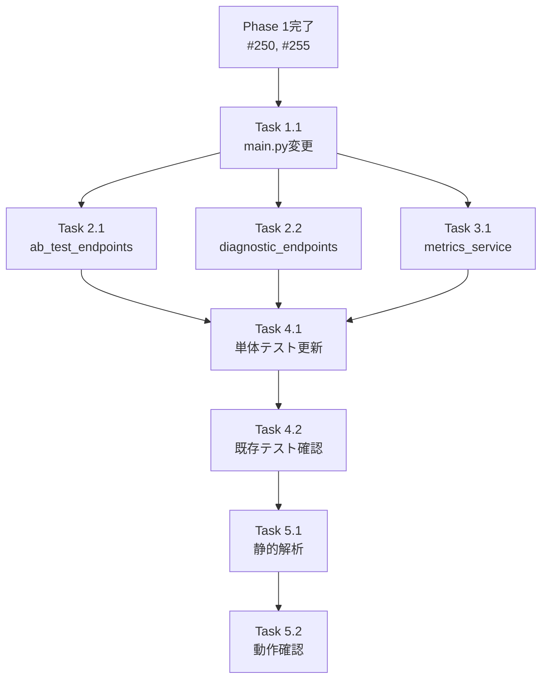

# Issue #252 作業計画書

## Valkey 初期化の myVault 対応

**作成日**: 2025-12-08
**Issue**: [#252](https://github.com/Kewton/MySwiftAgent/issues/252)
**親Issue**: [#248](https://github.com/Kewton/MySwiftAgent/issues/248)
**ステータス**: Draft

---

## Issue 概要

| 項目 | 値 |
|------|-----|
| **Issue番号** | #252 |
| **タイトル** | Valkey 初期化の myVault 対応 |
| **サイズ** | S (2 Story Points) |
| **作業見積** | 2時間 |
| **優先度** | High |
| **Phase** | 2（サービス統合） |

### 依存関係

| Issue | タイトル | 状態 |
|-------|---------|------|
| #250 | SecretsManager 拡張（get_connection_config） | ⏳ Phase 1 |
| #255 | myvault_secrets.yaml 更新 | ⏳ Phase 1 |

### ブロック対象

| Issue | タイトル |
|-------|---------|
| #254 | 結合テスト・受入テスト作成 |

---

## 現状分析

### 変更対象ファイルと現在の実装

#### 1. `expertAgent/app/main.py` (行 45-54)

**現在の実装**:
```python
if settings.VALKEY_ENABLED:
    logger.info(
        f"Initializing Valkey connection: {settings.VALKEY_HOST}:{settings.VALKEY_PORT}"
    )
    valkey_client = ValkeyClient(
        host=settings.VALKEY_HOST,
        port=settings.VALKEY_PORT,
        db=settings.VALKEY_DB,
    )
    job_state_manager.configure_valkey(valkey_client, settings.VALKEY_TTL)
```

#### 2. `expertAgent/app/api/v1/ab_test_endpoints.py` (行 43-49)

**現在の実装**:
```python
_ab_test_service = ABTestService(
    valkey_host=settings.VALKEY_HOST,
    valkey_port=settings.VALKEY_PORT,
    valkey_db=settings.VALKEY_DB,
    use_valkey=settings.VALKEY_ENABLED,
)
```

#### 3. `expertAgent/app/api/v1/diagnostic_endpoints.py` (行 37-48)

**現在の実装**:
```python
valkey_host = getattr(settings, "VALKEY_HOST", "localhost")
valkey_port = getattr(settings, "VALKEY_PORT", 6379)
valkey_db = getattr(settings, "VALKEY_DB", 0)
```

#### 4. `expertAgent/app/services/metrics_aggregation_service.py` (行 56-60)

**現在の実装**:
```python
self._valkey_client = ValkeyClient(
    host=settings.VALKEY_HOST,
    port=settings.VALKEY_PORT,
    db=settings.VALKEY_DB,
)
```

---

## 詳細タスク分解

### Phase 1: main.py 変更（30分）

#### Task 1.1: main.py の Valkey 初期化を get_connection_config() に変更
- **所要時間**: 30分
- **成果物**: `expertAgent/app/main.py` 修正
- **内容**:
  - `from core.secrets import secrets_manager` 追加
  - `settings.VALKEY_*` を `secrets_manager.get_connection_config()` に置換
  - ログ出力の更新（マスキング考慮）

**変更後のコード**:
```python
from core.secrets import secrets_manager

@asynccontextmanager
async def lifespan(app: FastAPI):
    setup_logging()

    # Initialize Valkey connection for JobCreationStateManager (Issue #244)
    valkey_enabled = secrets_manager.get_connection_config(
        "VALKEY_ENABLED", value_type=bool, default=False
    )

    if valkey_enabled:
        valkey_host = secrets_manager.get_connection_config(
            "VALKEY_HOST", value_type=str, default="localhost"
        )
        valkey_port = secrets_manager.get_connection_config(
            "VALKEY_PORT", value_type=int, default=6379
        )
        valkey_db = secrets_manager.get_connection_config(
            "VALKEY_DB", value_type=int, default=0
        )
        valkey_ttl = secrets_manager.get_connection_config(
            "VALKEY_TTL", value_type=int, default=86400
        )

        logger.info(f"Initializing Valkey connection: {valkey_host}:{valkey_port}")
        valkey_client = ValkeyClient(
            host=valkey_host,
            port=valkey_port,
            db=valkey_db,
        )
        job_state_manager.configure_valkey(valkey_client, valkey_ttl)
        await job_state_manager.connect_valkey()
    else:
        logger.info("Valkey disabled - JobCreationStateManager using L1 cache only")

    yield

    # Shutdown: cleanup Valkey connection
    if valkey_enabled:
        await job_state_manager.disconnect_valkey()
```

### Phase 2: エンドポイント変更（30分）

#### Task 2.1: ab_test_endpoints.py の変更
- **所要時間**: 15分
- **成果物**: `expertAgent/app/api/v1/ab_test_endpoints.py` 修正
- **内容**:
  - `secrets_manager.get_connection_config()` を使用
  - デフォルト値を維持

#### Task 2.2: diagnostic_endpoints.py の変更
- **所要時間**: 15分
- **成果物**: `expertAgent/app/api/v1/diagnostic_endpoints.py` 修正
- **内容**:
  - `getattr(settings, ...)` を `get_connection_config()` に置換
  - 型変換をメソッドに委譲

### Phase 3: サービス変更（20分）

#### Task 3.1: metrics_aggregation_service.py の変更
- **所要時間**: 20分
- **成果物**: `expertAgent/app/services/metrics_aggregation_service.py` 修正
- **内容**:
  - `secrets_manager.get_connection_config()` を使用
  - `_get_valkey_client()` メソッド内での設定取得を変更

### Phase 4: テスト作成・更新（30分）

#### Task 4.1: 単体テスト更新
- **所要時間**: 20分
- **成果物**: 既存テストファイルの更新
- **テストケース**:

| テストケース | 内容 |
|-------------|------|
| `test_main_lifespan_valkey_myvault` | myVault から設定取得での起動 |
| `test_main_lifespan_valkey_env_fallback` | 環境変数フォールバックでの起動 |
| `test_ab_test_service_myvault_config` | ABTestService の myVault 設定 |
| `test_metrics_service_myvault_config` | MetricsService の myVault 設定 |

#### Task 4.2: 既存テストの動作確認
- **所要時間**: 10分
- **確認項目**:
  - [ ] `test_issue_244_main_lifespan.py` 全パス
  - [ ] `test_ab_test_endpoints.py` 全パス
  - [ ] `test_diagnostic_endpoints.py` 全パス
  - [ ] `test_metrics_aggregation_service.py` 全パス

### Phase 5: 品質確認（10分）

#### Task 5.1: 静的解析
- **所要時間**: 5分
- **確認項目**:
  - [ ] Ruff エラーゼロ
  - [ ] MyPy エラーゼロ

#### Task 5.2: 動作確認
- **所要時間**: 5分
- **確認項目**:
  - [ ] サービス起動確認
  - [ ] `/v1/health` でValkey接続状態確認

---

## タスク依存関係



---

## 作業スケジュール

**2時間作業**

| 時間 | タスク | 成果物 |
|------|-------|--------|
| 0:00-0:30 | Task 1.1: main.py 変更 | Valkey初期化修正 |
| 0:30-0:45 | Task 2.1: ab_test_endpoints.py 変更 | エンドポイント修正 |
| 0:45-1:00 | Task 2.2: diagnostic_endpoints.py 変更 | エンドポイント修正 |
| 1:00-1:20 | Task 3.1: metrics_aggregation_service.py 変更 | サービス修正 |
| 1:20-1:40 | Task 4.1: 単体テスト更新 | テスト追加 |
| 1:40-1:50 | Task 4.2: 既存テスト確認 | 全パス確認 |
| 1:50-1:55 | Task 5.1: 静的解析 | エラーゼロ確認 |
| 1:55-2:00 | Task 5.2: 動作確認 | 起動確認 |

---

## 変更対象ファイル

| ファイル | 変更内容 | 新規/修正 |
|---------|---------|---------|
| `expertAgent/app/main.py` | Valkey 初期化を get_connection_config() に変更 | 修正 |
| `expertAgent/app/api/v1/ab_test_endpoints.py` | 設定取得を get_connection_config() に変更 | 修正 |
| `expertAgent/app/api/v1/diagnostic_endpoints.py` | 設定取得を get_connection_config() に変更 | 修正 |
| `expertAgent/app/services/metrics_aggregation_service.py` | 設定取得を get_connection_config() に変更 | 修正 |
| `expertAgent/tests/unit/test_valkey_myvault_integration.py` | myVault 統合テスト | 新規 |

---

## 実装詳細

### 共通パターン

各ファイルで以下のパターンを適用:

```python
# Before (settings 直接参照)
host = settings.VALKEY_HOST
port = settings.VALKEY_PORT
db = settings.VALKEY_DB

# After (get_connection_config 使用)
from core.secrets import secrets_manager

host = secrets_manager.get_connection_config(
    "VALKEY_HOST", value_type=str, default="localhost"
)
port = secrets_manager.get_connection_config(
    "VALKEY_PORT", value_type=int, default=6379
)
db = secrets_manager.get_connection_config(
    "VALKEY_DB", value_type=int, default=0
)
```

### myVault 登録が必要なシークレット

| キー名 | 型 | デフォルト値 | 登録タイミング |
|-------|-----|-------------|---------------|
| `VALKEY_ENABLED` | bool | false | 実装前（手動） |
| `VALKEY_HOST` | str | localhost | 実装前（手動） |
| `VALKEY_PORT` | int | 6379 | 実装前（手動） |
| `VALKEY_DB` | int | 0 | 実装前（手動） |
| `VALKEY_TTL` | int | 86400 | 実装前（手動） |

### 登録コマンド例

```bash
# myVault に Valkey 設定を登録
curl -X POST "http://localhost:8103/api/v1/secrets/expertagent/default_project/VALKEY_HOST" \
  -H "Content-Type: application/json" \
  -d '{"value": "localhost"}'

curl -X POST "http://localhost:8103/api/v1/secrets/expertagent/default_project/VALKEY_PORT" \
  -H "Content-Type: application/json" \
  -d '{"value": "6379"}'

curl -X POST "http://localhost:8103/api/v1/secrets/expertagent/default_project/VALKEY_DB" \
  -H "Content-Type: application/json" \
  -d '{"value": "0"}'

curl -X POST "http://localhost:8103/api/v1/secrets/expertagent/default_project/VALKEY_TTL" \
  -H "Content-Type: application/json" \
  -d '{"value": "86400"}'
```

---

## 受入基準チェックリスト

### 機能要件（自動検証）
- [ ] myVault に `VALKEY_HOST` がある場合、その値で Valkey に接続
- [ ] myVault に値がない場合、環境変数から接続情報を取得
- [ ] Valkey 接続成功時にログ出力

### 品質基準
- [ ] Ruff/MyPy エラーゼロ
- [ ] 既存テスト全パス
- [ ] 新規テスト追加・パス

### テストケース
- [ ] 正常系: myVault から Valkey 接続情報取得 → 接続成功
- [ ] 正常系: myVault 未登録時に環境変数フォールバック → 接続成功
- [ ] 正常系: デフォルト値使用での接続

### 手動検証
- [ ] myVault に設定登録後、サービス起動確認
- [ ] `/v1/health` エンドポイントで Valkey 接続状態確認
- [ ] myVault シークレット削除後、環境変数フォールバック確認

---

## リスクと対策

| リスク | 発生確率 | 影響度 | 対策 |
|-------|---------|--------|------|
| Phase 1 Issue (#250) 未完了 | 低 | 高 | Phase 1 完了を確認してから着手 |
| 既存テスト失敗 | 中 | 中 | モック設定の更新 |
| Valkey 接続失敗 | 低 | 中 | デフォルト値でのフォールバック維持 |

---

## 実行コマンド

```bash
# Phase 1 完了確認
git log --oneline origin/feature/issue/250 | head -5
git log --oneline origin/feature/issue/255 | head -5

# 静的解析
cd expertAgent
uv run ruff check app/main.py app/api/v1/ab_test_endpoints.py \
  app/api/v1/diagnostic_endpoints.py app/services/metrics_aggregation_service.py
uv run mypy app/main.py app/api/v1/ab_test_endpoints.py \
  app/api/v1/diagnostic_endpoints.py app/services/metrics_aggregation_service.py

# テスト実行
uv run pytest tests/unit/test_issue_244_main_lifespan.py -v
uv run pytest tests/unit/test_ab_test_endpoints.py -v
uv run pytest tests/unit/test_diagnostic_endpoints.py -v
uv run pytest tests/unit/test_metrics_aggregation_service.py -v

# 動作確認
uv run uvicorn app.main:app --reload --port 8104
curl http://localhost:8104/v1/health

# 全体チェック
./scripts/pre-push-check-all.sh
```

---

## Definition of Done

- [ ] すべてのタスクが完了
- [ ] 4ファイルすべてで `get_connection_config()` 使用に変更
- [ ] myVault 優先で Valkey 接続が動作
- [ ] 環境変数フォールバックが動作
- [ ] Ruff/MyPy エラーゼロ
- [ ] 既存テスト全パス
- [ ] CI/CD グリーン
- [ ] コードレビュー承認
- [ ] PR マージ完了

---

## 関連ドキュメント

- [Issue #248 requirements.md](../248/requirements.md)
- [Issue #248 design-policy.md](../248/design-policy.md)
- [Issue #250 work-plan.md](../250/work-plan.md)（依存先）
- [Issue #255 work-plan.md](../255/work-plan.md)（依存先）

---

## 次のアクション

**Phase 1 完了後**:
1. **ブランチ作成**: `feature/issue/252`
2. **worktree作成**: `/worktree-setup 252`
3. **TDD実行**: `/tdd-impl` で実装
4. **進捗報告**: `/progress-report` で定期報告

**注意**: Issue #250 と #255 が完了してから着手すること
