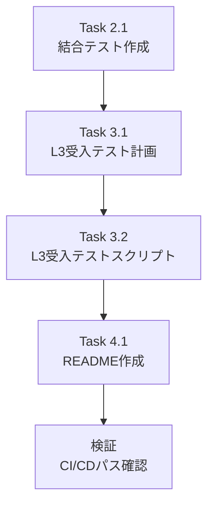

# 作業計画: Issue #254 結合テスト・受入テスト作成

## 1. Issue概要の確認

```markdown
## Issue: Issue #248-5: 結合テスト・受入テスト作成
**Issue番号**: #254
**親Issue**: #248 (myVault接続情報集約)
**サイズ**: S (2 Story Points)
**作業見積**: 2時間
**優先度**: Medium
**依存Issue**: #252 (✅CLOSED), #253 (✅CLOSED)
**ブロック対象**: なし（最終Phase）
```

---

## 2. 詳細タスク分解

### 実装タスク（Phase 1）

なし（テスト・ドキュメント作成のみのIssue）

### テストタスク（Phase 2: TDD - CI実行可能）

- [ ] **Task 2.1**: 結合テストファイル作成
  - 所要時間: 45分
  - 成果物: `expertAgent/tests/integration/test_myvault_connection_config.py`
  - カバレッジ目標: 50%以上
  - 依存: なし

### 受入テストタスク（Phase 3: L3ローカル受入テスト）【必須】

- [ ] **Task 3.1**: L3受入テスト計画
  - 所要時間: 15分
  - 成果物: 受入テストシナリオ（具体的なcurlコマンド）
  - 依存: Task 2.1

- [ ] **Task 3.2**: L3受入テストスクリプト作成
  - 所要時間: 45分
  - 成果物: `tests/acceptance/test_issue_248_acceptance.sh`
  - 依存: Task 3.1

### ドキュメントタスク（Phase 4）

- [ ] **Task 4.1**: 受入テストREADME作成
  - 所要時間: 15分
  - 成果物: `tests/acceptance/README_issue_248.md`
  - 依存: Task 3.2

---

## 3. タスク依存関係



---

## 4. 作業スケジュール

### 全体: 約2時間

| 時間 | タスク | 内容 |
|------|--------|------|
| 0:00-0:45 | Task 2.1 | 結合テスト作成 |
| 0:45-1:00 | Task 3.1 | L3受入テスト計画 |
| 1:00-1:45 | Task 3.2 | L3受入テストスクリプト作成 |
| 1:45-2:00 | Task 4.1 | README作成 |

---

## 5. チェックポイント

| タイミング | 確認事項 | 対応 |
|-----------|---------|------|
| Task 2.1完了時 | 結合テスト通過 | `uv run pytest tests/integration/test_myvault_connection_config.py -v` |
| Task 3.2完了時 | スクリプト実行可能 | `./tests/acceptance/test_issue_248_acceptance.sh` |
| PR作成前 | CI/CDパス | Ruff/MyPy/テスト全パス |

---

## 6. リスクと対策

| リスク | 発生確率 | 影響 | 対策 |
|-------|---------|------|------|
| myVaultサービス起動失敗 | 低 | テスト実行不可 | `docker-compose up -d myvault` で事前確認 |
| 環境変数設定不足 | 中 | フォールバックテスト失敗 | `.env.example` 参照、事前設定確認 |
| CIでのmyVaultアクセス | 中 | 結合テストスキップ | `pytest.mark.skipif` でCI判定 |

---

## 7. 成果物チェックリスト

### コード
- [ ] `expertAgent/tests/integration/test_myvault_connection_config.py`

### テスト
- [ ] 結合テストカバレッジ 50%以上

### ドキュメント/スクリプト
- [ ] `tests/acceptance/test_issue_248_acceptance.sh`
- [ ] `tests/acceptance/README_issue_248.md`

---

## 8. L3受入テスト計画（具体的なコマンド）【必須セクション】

**重要**: このセクションは必ず**具体的なcurlコマンド**を記載すること。
抽象的な説明（「APIを叩く」等）は不可。

### Step 1: サービス起動確認

```bash
# サービス起動
./scripts/dev-start.sh

# ヘルスチェック（必須）
curl -sf http://localhost:8103/health && echo "✅ myVault: healthy" || { echo "❌ myVault: not running"; exit 1; }
curl -sf http://localhost:8104/health && echo "✅ expertAgent: healthy" || { echo "❌ expertAgent: not running"; exit 1; }
docker exec myswiftagent-valkey redis-cli PING | grep -q PONG && echo "✅ Valkey: healthy" || { echo "❌ Valkey: not running"; exit 1; }
curl -sf http://localhost:3001/api/public/health && echo "✅ Langfuse: healthy" || echo "⚠️ Langfuse: not running (optional)"
```

### Step 2: myVault設定確認（実際のAPIエンドポイント呼び出し）

```bash
# Valkey接続情報がmyVaultに登録されているか確認
curl -s http://localhost:8103/api/v1/secrets/expertagent/default_project/VALKEY_HOST | jq .
# 期待するレスポンス:
# - HTTPステータス: 200
# - レスポンスボディ: {"key": "VALKEY_HOST", "value": "localhost", ...}

curl -s http://localhost:8103/api/v1/secrets/expertagent/default_project/VALKEY_PORT | jq .
# 期待するレスポンス:
# - HTTPステータス: 200
# - レスポンスボディ: {"key": "VALKEY_PORT", "value": "6379", ...}

# Langfuse HOST確認
curl -s http://localhost:8103/api/v1/secrets/expertagent/default_project/LANGFUSE_HOST | jq .
# 期待するレスポンス:
# - HTTPステータス: 200
# - レスポンスボディ: {"key": "LANGFUSE_HOST", "value": "http://localhost:3001", ...}
```

### Step 3: シナリオ1 - myVault → Valkey接続確認

```bash
# expertAgentのジョブ作成APIを呼び出し（Valkey使用）
curl -s -X POST http://localhost:8104/aiagent-api/v1/job-generator \
  -H "Content-Type: application/json" \
  -d '{
    "user_requirement": "テスト用要求: myVault接続確認",
    "available_capabilities": ["test_capability"],
    "project": "default_project"
  }' | jq .

# 期待するレスポンス:
# - HTTPステータス: 200
# - レスポンスボディ: {"job_id": "job_XXXXXXXX-...", "status": "processing"}
# - Valkeyにジョブ状態が保存される

# Valkeyにデータが保存されたか確認
docker exec myswiftagent-valkey redis-cli KEYS "job:*" | head -5
# 期待する出力: job:job_XXXXXXXX-... のようなキーが表示される
```

### Step 4: シナリオ2 - Langfuse HOST myVault確認

```bash
# LLM APIを呼び出し（Langfuseトレースが記録される）
curl -s -X POST http://localhost:8104/v1/aiagent/utility/explorer \
  -H "Content-Type: application/json" \
  -d '{
    "user_input": "Hello, this is a test for myVault Langfuse integration",
    "model_name": "gpt-4o-mini",
    "project": "default_project"
  }' \
  -w "\nHTTP_STATUS:%{http_code}\n"

# 期待するレスポンス:
# - HTTPステータス: 200
# - Langfuse UIでトレースを確認: http://localhost:3001
```

### Step 5: シナリオ3 - 環境変数フォールバック確認

```bash
# expertAgentのヘルスエンドポイントで設定確認
curl -s http://localhost:8104/health | jq .

# 期待するレスポンス:
# - HTTPステータス: 200
# - レスポンスボディ: {"status": "healthy", ...}
```

### Step 6: エビデンス収集

```bash
# レスポンスをファイルに保存
curl -s http://localhost:8103/api/v1/secrets/expertagent/default_project/VALKEY_HOST > /tmp/myvault_valkey_host.json
curl -s http://localhost:8103/api/v1/secrets/expertagent/default_project/LANGFUSE_HOST > /tmp/myvault_langfuse_host.json

# サービスログ確認
tail -50 expertAgent/logs/expertagent.log | grep -E "(myVault|Valkey|Langfuse)" || echo "No relevant logs found"

echo "📊 エビデンス:"
echo "- myVault Valkey設定: /tmp/myvault_valkey_host.json"
echo "- myVault Langfuse設定: /tmp/myvault_langfuse_host.json"
echo "- Langfuse UI: http://localhost:3001"
```

---

## 9. Definition of Done

Issue完了条件：
- [ ] すべてのタスクが完了
- [ ] 結合テストカバレッジ 50%以上
- [ ] 結合テスト全シナリオパス
- [ ] **L3受入テスト全パス**（実際のサービス起動・API呼び出し確認）
  - [ ] myVaultヘルスチェック通過
  - [ ] expertAgentヘルスチェック通過
  - [ ] Valkey接続確認
  - [ ] Langfuse HOST確認
  - [ ] ジョブ作成API呼び出し成功
- [ ] Ruff/MyPyエラーゼロ
- [ ] CI/CDグリーン
- [ ] コードレビュー承認
- [ ] 受入テストドキュメント完成

**L3受入テストスキップ条件**:
このIssueは `feature` ラベルのため、**スキップ不可**。

---

## 10. 次のアクション

作業計画承認後：
1. **ブランチ作成**: `feature/issue/254`
2. **Task 2.1実行**: 結合テスト作成
3. **Task 3.1-3.2実行**: L3受入テストスクリプト作成
4. **Task 4.1実行**: README作成
5. **品質確認**: `./scripts/pre-push-check.sh`
6. **PR作成**: developへマージ

---

作成日: 2025-12-08
作成者: Claude Code
