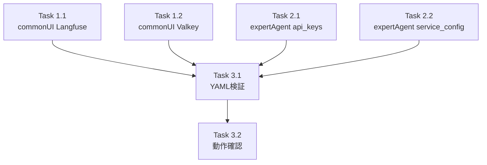

# Issue #255 作業計画書

## myvault_secrets.yaml 更新

**作成日**: 2025-12-07
**Issue**: [#255](https://github.com/Kewton/MySwiftAgent/issues/255)
**親Issue**: [#248](https://github.com/Kewton/MySwiftAgent/issues/248)
**ステータス**: Draft

---

## Issue 概要

| 項目 | 値 |
|------|-----|
| **Issue番号** | #255 |
| **タイトル** | myvault_secrets.yaml 更新 |
| **サイズ** | XS (1 Story Point) |
| **作業見積** | 1時間 |
| **優先度** | High |
| **Phase** | 1（基盤構築） |

### 依存関係

| Issue | タイトル | 状態 |
|-------|---------|------|
| なし | - | - |

### ブロック対象

| Issue | タイトル |
|-------|---------|
| #252 | Valkey 初期化の myVault 対応 |
| #253 | Langfuse HOST の myVault 対応 |

---

## 現状分析

### 対象ファイル

#### 1. `commonUI/data/myvault_secrets.yaml`

**用途**: commonUI（myAgentDesk）のシークレット登録画面でドロップダウン表示用

**現在の構造**:
```yaml
secrets:
  - name: OPENAI_API_KEY
    description: OpenAI API key for content generation
  # ... 12項目
```

**既存項目数**: 12項目

#### 2. `expertAgent/myvault_secrets.yaml`

**用途**: expertAgent のシークレット定義・バリデーションルール

**現在の構造**:
```yaml
api_keys:
  type: string
  required: true
  keys:
    - OPENAI_API_KEY
    # ...

service_config:
  type: string
  required: false
  keys:
    - MAIL_TO
    # ...
```

**既存カテゴリ**: 5カテゴリ

---

## 追加する設定項目

### Langfuse 接続情報

| キー名 | 型 | 説明 | カテゴリ |
|-------|-----|------|---------|
| `LANGFUSE_HOST` | string | Langfuse Self-hosted URL | service_config |
| `LANGFUSE_PUBLIC_KEY` | string | Langfuse public API key | api_keys |
| `LANGFUSE_SECRET_KEY` | string | Langfuse secret API key | api_keys |

### Valkey 接続情報

| キー名 | 型 | 説明 | カテゴリ |
|-------|-----|------|---------|
| `VALKEY_HOST` | string | Valkey server hostname | service_config |
| `VALKEY_PORT` | string | Valkey server port (default: 6379) | service_config |
| `VALKEY_DB` | string | Valkey database number (default: 0) | service_config |
| `VALKEY_TTL` | string | Valkey TTL in seconds (default: 86400) | service_config |

**合計**: 7項目追加

---

## 詳細タスク分解

### Phase 1: commonUI YAML 更新（20分）

#### Task 1.1: Langfuse 項目追加
- **所要時間**: 10分
- **成果物**: `commonUI/data/myvault_secrets.yaml` 更新
- **内容**:
  - `LANGFUSE_HOST` 追加
  - `LANGFUSE_PUBLIC_KEY` 追加
  - `LANGFUSE_SECRET_KEY` 追加

#### Task 1.2: Valkey 項目追加
- **所要時間**: 10分
- **成果物**: `commonUI/data/myvault_secrets.yaml` 更新
- **内容**:
  - `VALKEY_HOST` 追加
  - `VALKEY_PORT` 追加
  - `VALKEY_DB` 追加
  - `VALKEY_TTL` 追加

### Phase 2: expertAgent YAML 更新（20分）

#### Task 2.1: api_keys カテゴリ更新
- **所要時間**: 5分
- **成果物**: `expertAgent/myvault_secrets.yaml` 更新
- **内容**:
  - `LANGFUSE_PUBLIC_KEY` 追加
  - `LANGFUSE_SECRET_KEY` 追加

#### Task 2.2: service_config カテゴリ更新
- **所要時間**: 10分
- **成果物**: `expertAgent/myvault_secrets.yaml` 更新
- **内容**:
  - `LANGFUSE_HOST` 追加
  - `VALKEY_HOST` 追加
  - `VALKEY_PORT` 追加
  - `VALKEY_DB` 追加
  - `VALKEY_TTL` 追加

#### Task 2.3: 新規 valkey_config カテゴリ追加（オプション）
- **所要時間**: 5分
- **判断**: Valkey 設定を独立カテゴリとして管理する場合
- **内容**:
  - 新規 `valkey_config` カテゴリ作成
  - Valkey 関連キーをまとめる

### Phase 3: 品質確認（20分）

#### Task 3.1: YAML 構文検証
- **所要時間**: 10分
- **確認項目**:
  - [ ] YAML パース可能
  - [ ] インデント正しい
  - [ ] 重複キーなし

#### Task 3.2: 既存項目の動作確認
- **所要時間**: 10分
- **確認項目**:
  - [ ] 既存項目が壊れていない
  - [ ] commonUI でドロップダウン表示確認

---

## タスク依存関係



---

## 作業スケジュール

**1時間作業**

| 時間 | タスク | 成果物 |
|------|-------|--------|
| 0:00-0:10 | Task 1.1: commonUI Langfuse 項目追加 | 3項目追加 |
| 0:10-0:20 | Task 1.2: commonUI Valkey 項目追加 | 4項目追加 |
| 0:20-0:25 | Task 2.1: expertAgent api_keys 更新 | 2項目追加 |
| 0:25-0:35 | Task 2.2: expertAgent service_config 更新 | 5項目追加 |
| 0:35-0:45 | Task 3.1: YAML 構文検証 | エラーゼロ確認 |
| 0:45-0:55 | Task 3.2: 動作確認 | ドロップダウン表示確認 |
| 0:55-1:00 | PR準備・コミット | PR作成 |

---

## 変更対象ファイル

| ファイル | 変更内容 | 新規/修正 |
|---------|---------|---------|
| `commonUI/data/myvault_secrets.yaml` | 7項目追加 | 修正 |
| `expertAgent/myvault_secrets.yaml` | 7項目追加 | 修正 |

---

## 実装詳細

### commonUI/data/myvault_secrets.yaml 追加内容

```yaml
  # Langfuse observability
  - name: LANGFUSE_HOST
    description: Langfuse self-hosted server URL

  - name: LANGFUSE_PUBLIC_KEY
    description: Langfuse public API key for tracing

  - name: LANGFUSE_SECRET_KEY
    description: Langfuse secret API key for tracing

  # Valkey (Redis-compatible) cache
  - name: VALKEY_HOST
    description: Valkey server hostname

  - name: VALKEY_PORT
    description: Valkey server port (default 6379)

  - name: VALKEY_DB
    description: Valkey database number (default 0)

  - name: VALKEY_TTL
    description: Valkey cache TTL in seconds (default 86400)
```

### expertAgent/myvault_secrets.yaml 追加内容

#### api_keys セクション追加

```yaml
api_keys:
  type: string
  required: true
  description: "API keys for AI services"
  keys:
    - OPENAI_API_KEY
    - ANTHROPIC_API_KEY
    - GOOGLE_API_KEY
    - GROQ_API_KEY
    - SERPER_API_KEY
    - LANGFUSE_PUBLIC_KEY    # 追加
    - LANGFUSE_SECRET_KEY    # 追加
```

#### service_config セクション追加

```yaml
service_config:
  type: string
  required: false
  description: "Service-specific configuration"
  keys:
    - MAIL_TO
    - SPREADSHEET_ID
    - OLLAMA_URL
    - MLX_LLM_SERVER_URL
    - LANGFUSE_HOST           # 追加
    - VALKEY_HOST             # 追加
    - VALKEY_PORT             # 追加
    - VALKEY_DB               # 追加
    - VALKEY_TTL              # 追加
```

---

## 受入基準チェックリスト

### 機能要件（自動検証）
- [ ] `commonUI/data/myvault_secrets.yaml` に全7項目が定義されている
- [ ] `expertAgent/myvault_secrets.yaml` に全7項目が定義されている
- [ ] YAML 構文が正しい（パースエラーなし）
- [ ] 既存項目が壊れていない

### 品質基準
- [ ] YAML lint エラーゼロ
- [ ] 既存項目との整合性確保

### テストケース
- [ ] 正常系: YAML ファイルがパース可能
- [ ] 正常系: 既存項目が正常に読み込める

### 手動検証
- [ ] commonUI（myAgentDesk）のシークレット登録画面で新規項目がドロップダウンに表示される
- [ ] 各項目の description が適切に表示される

---

## リスクと対策

| リスク | 発生確率 | 影響度 | 対策 |
|-------|---------|--------|------|
| YAML 構文エラー | 低 | 中 | yamllint でチェック |
| 既存項目の破壊 | 低 | 高 | 追加のみで変更なし |
| ドロップダウン表示崩れ | 低 | 中 | 手動確認 |

---

## 実行コマンド

```bash
# YAML 構文検証
python -c "import yaml; yaml.safe_load(open('commonUI/data/myvault_secrets.yaml'))"
python -c "import yaml; yaml.safe_load(open('expertAgent/myvault_secrets.yaml'))"

# yamllint（インストール済みの場合）
yamllint commonUI/data/myvault_secrets.yaml
yamllint expertAgent/myvault_secrets.yaml

# 全体チェック
./scripts/pre-push-check-all.sh
```

---

## Definition of Done

- [ ] すべてのタスクが完了
- [ ] 両ファイルに全7項目が追加されている
- [ ] YAML 構文エラーなし
- [ ] 既存項目が正常動作
- [ ] commonUI で新規項目が選択可能（手動確認）
- [ ] CI/CD グリーン
- [ ] コードレビュー承認
- [ ] PR マージ完了

---

## 関連ドキュメント

- [Issue #248 requirements.md](../248/requirements.md)
- [Issue #248 design-policy.md](../248/design-policy.md)
- [Issue #248 issue-split.md](../248/issue-split.md)
- [既存ファイル: commonUI/data/myvault_secrets.yaml](../../commonUI/data/myvault_secrets.yaml)
- [既存ファイル: expertAgent/myvault_secrets.yaml](../../expertAgent/myvault_secrets.yaml)

---

## 次のアクション

作業計画承認後:
1. **ブランチ作成**: `fix/issue/255`
2. **worktree作成**: `/worktree-setup 255`
3. **YAML編集**: 直接編集（テスト不要、YAML構文検証のみ）
4. **進捗報告**: `/progress-report` で定期報告
