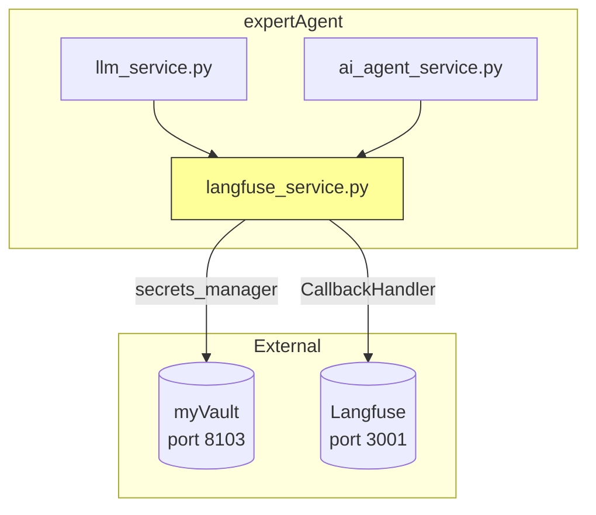
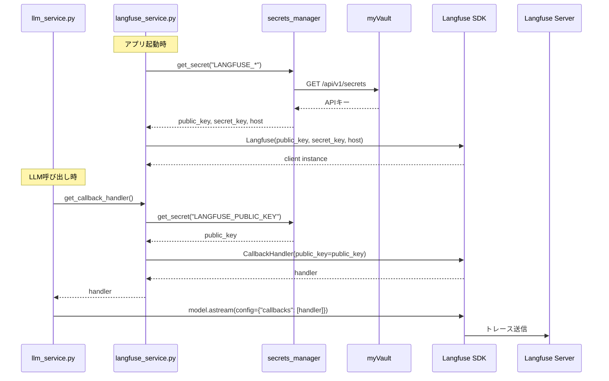

# 設計方針書: Issue #263

## Langfuse CallbackHandler の myVault APIキー対応

**Issue**: [#263](https://github.com/Kewton/MySwiftAgent/issues/263)
**作成日**: 2025-12-09
**ステータス**: Draft

---

## 1. 問題の根本原因分析

### 現状のコード

```python
# langfuse_service.py:93-133
def get_callback_handler(self, ...):
    if not self._is_enabled() or self._client is None:
        return None

    # 問題: CallbackHandler() を引数なしで作成
    handler = CallbackHandler()  # ← ここが問題
    return handler
```

### Langfuse SDK v3 の動作

調査の結果、Langfuse SDK v3 の動作は以下の通り:

```
┌─────────────────────────────────────────────────────────────────┐
│  Langfuse(public_key, secret_key, host)                         │
│    ↓                                                            │
│  LangfuseResourceManager._instances[public_key] に登録          │
└─────────────────────────────────────────────────────────────────┘

┌─────────────────────────────────────────────────────────────────┐
│  CallbackHandler()  ← 引数なし                                  │
│    ↓                                                            │
│  get_client()                                                   │
│    ↓                                                            │
│  len(_instances) == 0 → Langfuse() を新規作成 (環境変数から)    │
│  len(_instances) == 1 → 既存設定を使った新クライアント作成      │
└─────────────────────────────────────────────────────────────────┘

┌─────────────────────────────────────────────────────────────────┐
│  CallbackHandler(public_key="xyz")  ← 明示的に指定              │
│    ↓                                                            │
│  get_client(public_key="xyz")                                   │
│    ↓                                                            │
│  _instances["xyz"] の設定を使ったクライアントを返す             │
└─────────────────────────────────────────────────────────────────┘
```

### 問題の核心

1. `_initialize_client()` で `Langfuse(public_key, secret_key, host)` を呼び出し → `_instances[public_key]` に登録される ✓
2. `get_callback_handler()` で `CallbackHandler()` を引数なしで作成
3. `CallbackHandler.__init__` 内で `get_client()` が呼ばれる
4. `get_client()` は `len(_instances) == 1` の場合、既存設定を使うが、**タイミングや初期化順序により環境変数から読み取る可能性がある**

**検証結果**: `CallbackHandler(public_key=public_key)` を使うと、明示的に指定した `public_key` に紐づく設定（secret_key, host含む）が使用される

---

## 2. アーキテクチャ設計

### システム構成図



### コンポーネント責務

| コンポーネント | 責務 |
|---------------|------|
| `langfuse_service.py` | Langfuseクライアント管理、CallbackHandler生成、APIキー取得 |
| `secrets_manager` | myVault経由でのシークレット取得 |
| `LangfuseResourceManager` | SDK内部のクライアントインスタンス管理（シングルトン） |

---

## 3. 設計方針

### 選択した方式: **Option A - public_key 明示指定方式**

```python
def get_callback_handler(self, ...):
    if not self._is_enabled() or self._client is None:
        return None

    # myVault から取得した public_key を明示的に渡す
    public_key = secrets_manager.get_secret("LANGFUSE_PUBLIC_KEY")
    handler = CallbackHandler(public_key=public_key)
    return handler
```

### 選定理由

| 観点 | Option A (public_key指定) | Option B (引数なし) |
|------|--------------------------|---------------------|
| **確実性** | ✅ 明示的に指定するため確実 | ⚠️ SDK内部の状態に依存 |
| **可読性** | ✅ 意図が明確 | ⚠️ 暗黙的な動作に依存 |
| **マルチプロジェクト対応** | ✅ 将来拡張可能 | ❌ 対応困難 |
| **デバッグ** | ✅ 問題特定が容易 | ⚠️ SDK内部状態の把握が必要 |
| **KISS原則** | ✅ シンプル | ⚠️ 暗黙的依存 |

### 設計パターン

- **Singleton Pattern**: `LangfuseService` でアプリケーション全体で1つのクライアントを共有
- **Facade Pattern**: `langfuse_service` がSDKの複雑さを隠蔽し、シンプルなAPIを提供

---

## 4. 詳細設計

### 4.1 修正対象: `get_callback_handler()`

```python
def get_callback_handler(
    self,
    trace_name: str | None = None,
    user_id: str | None = None,
    session_id: str | None = None,
    tags: list[str] | None = None,
    metadata: dict[str, Any] | None = None,
) -> CallbackHandler | None:
    """LangChain/LangGraph用のCallbackHandlerを取得.

    Args:
        trace_name: トレース名（将来の拡張用）
        user_id: ユーザーID（将来の拡張用）
        session_id: セッションID（将来の拡張用）
        tags: タグリスト（将来の拡張用）
        metadata: メタデータ（将来の拡張用）

    Returns:
        CallbackHandler or None（Langfuse無効時）
    """
    if not self._is_enabled() or self._client is None:
        return None

    try:
        # myVault から取得した public_key を明示的に渡す
        public_key = secrets_manager.get_secret("LANGFUSE_PUBLIC_KEY")
        handler = CallbackHandler(public_key=public_key)
        logger.debug(f"CallbackHandler created with public_key: {public_key[:8]}...")
        return handler
    except Exception as e:
        logger.error(f"Failed to create CallbackHandler: {e}")
        return None
```

### 4.2 シーケンス図



### 4.3 エラーハンドリング

| エラー状況 | 対応 |
|-----------|------|
| myVault接続失敗 | `_is_enabled()` が False を返す → `None` を返す |
| APIキー未設定 | `_is_enabled()` が False を返す → `None` を返す |
| CallbackHandler作成失敗 | ログ出力 → `None` を返す |

---

## 5. 非機能要件への対応

### パフォーマンス

- **非同期トレース送信**: Langfuse SDK は内部でバッチ送信を行うため、LLMレスポンスに影響なし
- **シングルトン**: `LangfuseService` のシングルトンにより、不要なインスタンス生成を防止

### セキュリティ

- **APIキーのログ出力防止**: `public_key[:8]...` のように先頭8文字のみログ出力
- **myVault経由**: 環境変数にAPIキーを設定する必要なし

### 互換性

- **既存API維持**: `get_callback_handler()` のシグネチャは変更なし
- **Graceful Degradation**: Langfuse無効時は `None` を返し、呼び出し元で適切に処理

---

## 6. テスト設計

### 単体テスト

| テストケース | 検証内容 |
|--------------|----------|
| `test_callback_handler_with_myvault_public_key` | public_key が CallbackHandler に渡されることを確認 |
| `test_callback_handler_disabled_when_no_keys` | APIキー未設定時に None が返される |
| `test_callback_handler_logs_partial_key` | ログにAPIキー全体が出力されないことを確認 |

### 結合テスト

| テストケース | 検証内容 |
|--------------|----------|
| E2E トレース送信 | 要件定義チャット → Langfuse UI でトレース確認 |

---

## 7. 実装計画

### 変更ファイル

| ファイル | 変更内容 | LOC |
|----------|----------|-----|
| `langfuse_service.py` | `get_callback_handler()` 修正 | ~5行 |
| `test_langfuse_service.py` | 単体テスト追加 | ~30行 |

### チェックリスト

- [ ] `get_callback_handler()` に public_key 取得・指定を追加
- [ ] ログ出力でAPIキー全体を出力しないことを確認
- [ ] 単体テスト追加
- [ ] Ruff/MyPy エラーなし
- [ ] E2E テスト（Langfuse UI でトレース確認）

---

## 8. リスクと対策

| リスク | 影響度 | 発生確率 | 対策 |
|--------|--------|---------|------|
| SDK破壊的変更 | 中 | 低 | SDK バージョン固定、変更履歴監視 |
| myVault接続失敗 | 低 | 低 | 既存の graceful degradation で対応済み |
| public_key 取得の重複呼び出し | 低 | 中 | `_initialize_client()` で取得した値をキャッシュ |

### 将来の改善案

1. **public_key キャッシュ**: `_initialize_client()` で取得した `public_key` をインスタンス変数に保存し、`get_callback_handler()` での再取得を回避
2. **マルチプロジェクト対応**: 複数の Langfuse プロジェクトを使い分ける場合の拡張

---

## 参照資料

- [Langfuse LangChain Integration](https://langfuse.com/docs/langchain/python)
- [Langfuse Python SDK Advanced Usage](https://langfuse.com/docs/observability/sdk/python/advanced-usage)
- [GitHub Discussion: CallbackHandler init params](https://github.com/orgs/langfuse/discussions/7651)
