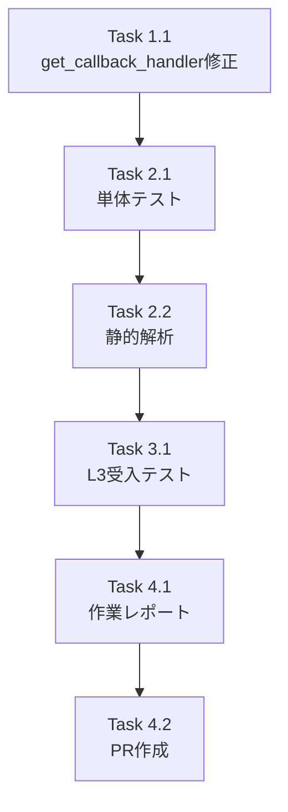

# 作業計画書: Issue #263

## Langfuse CallbackHandler の myVault APIキー対応

---

## 1. Issue概要の確認

```markdown
## Issue: Langfuse CallbackHandler が myVault の APIキーを使用していない
**Issue番号**: #263
**ラベル**: bug
**サイズ**: S (Small)
**作業見積**: 3時間
**優先度**: High
**依存Issue**: なし
```

### 背景
- `langfuse_service.py` の `get_callback_handler()` が `CallbackHandler()` を引数なしで作成
- 結果: myVault から取得した APIキーが使用されず、環境変数を参照

### 解決策（設計承認済み）
- `CallbackHandler(public_key=public_key)` で明示的に public_key を渡す

---

## 2. 詳細タスク分解

### Phase 1: 実装タスク

- [ ] **Task 1.1**: `get_callback_handler()` の修正
  - 所要時間: 0.5時間
  - 成果物: `expertAgent/app/services/langfuse_service.py`
  - 依存: なし
  - 変更内容:
    - `secrets_manager.get_secret("LANGFUSE_PUBLIC_KEY")` で public_key 取得
    - `CallbackHandler(public_key=public_key)` で明示的に渡す
    - ログ出力でAPIキーをマスク (`public_key[:8]...`)

### Phase 2: テストタスク（TDD - CI実行可能）

- [ ] **Task 2.1**: 単体テスト追加
  - 所要時間: 1時間
  - 成果物: `expertAgent/tests/unit/test_langfuse_service.py`
  - カバレッジ目標: 90%
  - テストケース:
    - `test_callback_handler_with_myvault_public_key`
    - `test_callback_handler_disabled_when_no_keys`
    - `test_callback_handler_logs_partial_key`

- [ ] **Task 2.2**: 静的解析
  - 所要時間: 0.25時間
  - 成果物: Ruff/MyPy エラーゼロ確認

### Phase 3: L3受入テスト（ローカル受入テスト）【必須】

- [ ] **Task 3.1**: L3受入テスト実行
  - 所要時間: 1時間
  - 成果物: `tests/acceptance/test_issue_263_langfuse_myvault.sh`
  - 内容:
    - サービス起動確認
    - myVault に Langfuse APIキー設定
    - 要件定義チャット実行
    - Langfuse UI でトレース確認

### Phase 4: ドキュメント・PR

- [ ] **Task 4.1**: 作業レポート更新
  - 所要時間: 0.25時間
  - 成果物: `dev-reports/feature/issue/263/implementation-report.md`

- [ ] **Task 4.2**: PR作成
  - 所要時間: 0.25時間
  - 成果物: GitHub Pull Request

---

## 3. タスク依存関係



---

## 4. 作業スケジュール

### 一括作業計画（約3時間）

| 時間 | タスク | 成果物 |
|------|--------|--------|
| 0:00-0:30 | Task 1.1 実装 | `langfuse_service.py` 修正 |
| 0:30-1:30 | Task 2.1 単体テスト | `test_langfuse_service.py` |
| 1:30-1:45 | Task 2.2 静的解析 | Ruff/MyPy パス |
| 1:45-2:45 | Task 3.1 L3受入テスト | トレース確認 |
| 2:45-3:00 | Task 4.1-4.2 レポート・PR | PR作成 |

**総作業時間**: 3時間

---

## 5. チェックポイント

| タイミング | 確認事項 | 対応 |
|-----------|---------|------|
| Task 1.1完了時 | コードコンパイル確認 | インポートエラーなし |
| Task 2.1完了時 | 単体テスト全パス | 失敗時は実装修正 |
| Task 2.2完了時 | Ruff/MyPy エラーゼロ | エラー時は修正 |
| Task 3.1完了時 | Langfuse UIでトレース確認 | 確認できない場合は調査 |

---

## 6. リスクと対策

| リスク | 発生確率 | 影響 | 対策 |
|-------|---------|------|------|
| Langfuse v3 API仕様変更 | 低 | 実装やり直し | SDKドキュメント事前確認済み |
| myVault接続エラー | 低 | テスト遅延 | 事前にサービス起動確認 |
| Langfuse UIアクセス不可 | 低 | E2E確認不可 | ログでトレース送信確認 |

---

## 7. 成果物チェックリスト

### コード
- [ ] `expertAgent/app/services/langfuse_service.py` (修正)

### テスト
- [ ] `expertAgent/tests/unit/test_langfuse_service.py` (追加/修正)
- [ ] `tests/acceptance/test_issue_263_langfuse_myvault.sh` (新規)

### ドキュメント
- [ ] `dev-reports/feature/issue/263/implementation-report.md`

---

## 8. L3受入テスト計画（具体的なコマンド）【必須セクション】

### Step 1: サービス起動確認

```bash
# サービス起動
cd /Users/maenokota/share/work/github_kewton/MySwiftAgent
./scripts/dev-start.sh

# ヘルスチェック
curl -sf http://localhost:8104/health && echo "✅ expertAgent: healthy"
curl -sf http://localhost:8103/health && echo "✅ myVault: healthy"
curl -sf http://localhost:3001/api/public/health && echo "✅ Langfuse: healthy"
```

### Step 2: myVault に Langfuse APIキー設定確認

```bash
# Langfuse APIキー取得確認
curl -s http://localhost:8103/api/v1/secrets/expertagent/default_project/LANGFUSE_PUBLIC_KEY | jq -r '.value[:8]'
# 期待: pk-lf-xx (先頭8文字が表示される)

curl -s http://localhost:8103/api/v1/secrets/expertagent/default_project/LANGFUSE_SECRET_KEY | jq -r '.value[:8]'
# 期待: sk-lf-xx (先頭8文字が表示される)

curl -s http://localhost:8103/api/v1/secrets/expertagent/default_project/LANGFUSE_HOST | jq -r '.value'
# 期待: http://localhost:3001
```

### Step 3: 要件定義チャット実行（トレース送信テスト）

```bash
# 要件定義チャット API 呼び出し
curl -s -N -X POST http://localhost:8104/aiagent-api/v1/chat/requirement-definition \
  -H "Content-Type: application/json" \
  -d '{
    "conversation_id": "langfuse_test_263",
    "user_message": "売上データを分析してレポートを作成したい",
    "context": {
      "previous_messages": [],
      "current_requirements": {
        "data_source": null,
        "process_description": null,
        "output_format": null,
        "schedule": null,
        "completeness": 0
      }
    }
  }' | head -20

# 期待するレスポンス:
# - SSEストリーミングレスポンス
# - type: "message" イベントが含まれる
```

### Step 4: Langfuse UI でトレース確認

```bash
# Langfuse API でトレース一覧取得
curl -s -X GET "http://localhost:3001/api/public/traces?limit=5" \
  -H "X-Langfuse-Public-Key: $(curl -s http://localhost:8103/api/v1/secrets/expertagent/default_project/LANGFUSE_PUBLIC_KEY | jq -r '.value')" \
  | jq '.data | length'

# 期待: 1以上（トレースが登録されている）

# または Langfuse UI で確認
echo "🔗 Langfuse UI: http://localhost:3001"
echo "   → Traces メニューで 'requirement_clarification' トレースを確認"
```

### Step 5: expertAgent ログ確認

```bash
# ログでトレース送信確認
docker logs myswiftagent-expertagent-1 2>&1 | grep -i langfuse | tail -10

# 期待するログ:
# - "CallbackHandler created with public_key: pk-lf-xx..."
# - "Langfuse traces flushed successfully"
```

### Step 6: エビデンス収集

```bash
# テスト結果をファイルに保存
cat > /tmp/issue_263_acceptance_result.json << 'EOF'
{
  "issue": 263,
  "test_date": "$(date -Iseconds)",
  "results": {
    "service_health": "PASS/FAIL",
    "myvault_keys": "PASS/FAIL",
    "chat_api": "PASS/FAIL",
    "langfuse_trace": "PASS/FAIL"
  },
  "notes": ""
}
EOF

echo "✅ 受入テスト完了 - エビデンス: /tmp/issue_263_acceptance_result.json"
```

---

## 9. Definition of Done

Issue #263 完了条件：

- [ ] `get_callback_handler()` が `CallbackHandler(public_key=public_key)` で呼び出す
- [ ] 単体テスト全パス
- [ ] Ruff/MyPy エラーゼロ
- [ ] **L3受入テスト全パス**
  - [ ] サービス起動確認
  - [ ] myVault APIキー取得確認
  - [ ] 要件定義チャット正常動作
  - [ ] **Langfuse UI でトレース表示確認**
- [ ] CI/CD グリーン
- [ ] PR作成・マージ

---

## 10. 次のアクション

作業計画承認後：

1. **ブランチ作成**: `fix/issue-263-langfuse-callback-handler`
2. **実装着手**: Task 1.1 から順に実施
3. **テスト実行**: 単体テスト → 静的解析 → L3受入テスト
4. **PR作成**: レビュー依頼
5. **進捗報告**: 完了後に `/progress-report`

---

## 参照ドキュメント

| ドキュメント | パス |
|-------------|------|
| 要件定義書 | `dev-reports/feature/issue/263/requirements.md` |
| 設計方針書 | `dev-reports/feature/issue/263/design-policy.md` |
| アーキテクチャレビュー | `dev-reports/feature/issue/263/architecture-review.md` |
