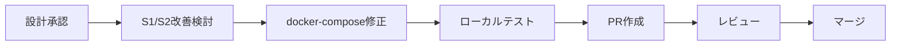

# アーキテクチャレビュー: Issue #265

## Langfuse MinIOバケット自動作成

**レビュー日**: 2025-12-10
**レビュアー**: Claude (Architecture Review)
**対象ドキュメント**: `dev-reports/feature/issue/265/design-policy.md`

---

## 1. 設計原則の遵守確認

### 1.1 SOLID原則チェック

| 原則 | 評価 | コメント |
|------|------|----------|
| **S**ingle Responsibility | ✅ Pass | initコンテナはバケット作成のみを担当。明確な単一責任。 |
| **O**pen/Closed | ✅ Pass | 環境変数で設定変更可能。コード変更なしで拡張可能。 |
| **L**iskov Substitution | N/A | 継承関係なし（インフラ設定のため該当せず） |
| **I**nterface Segregation | N/A | インターフェース定義なし（シェルスクリプトのため該当せず） |
| **D**ependency Inversion | ✅ Pass | 環境変数による設定注入で依存関係を制御 |

### 1.2 その他の原則

| 原則 | 評価 | コメント |
|------|------|----------|
| **KISS** | ✅ Pass | 4行のシェルスクリプトで実現。過度な複雑性なし。 |
| **YAGNI** | ✅ Pass | 現在必要な単一バケットのみ。将来の拡張は明示的に「Future Enhancement」に分類。 |
| **DRY** | ✅ Pass | 環境変数による設定一元管理。重複なし。 |

**原則準拠スコア**: **5/5** (該当項目のみ)

---

## 2. アーキテクチャ評価

### 2.1 構造的品質

| 評価項目 | スコア(1-5) | コメント |
|---------|------------|----------|
| **モジュール性** | 5 | initコンテナとして完全に分離。他サービスへの影響なし。 |
| **結合度** | 5 | 疎結合。MinIOへの依存はhealthcheck経由のみ。 |
| **凝集度** | 5 | 高凝集。バケット作成という単一機能に特化。 |
| **拡張性** | 4 | 環境変数で設定変更可能。複数バケット対応は追加作業が必要。 |
| **保守性** | 5 | シンプルな構成。トラブルシューティング容易。 |

**構造的品質スコア**: **4.8/5**

### 2.2 パフォーマンス観点

| 評価項目 | 評価 | コメント |
|----------|------|----------|
| **起動時間への影響** | ✅ 許容範囲 | +2〜4秒のオーバーヘッド。全体起動時間(30秒以上)に対して無視できるレベル。 |
| **リソース使用効率** | ✅ 最適 | 一時的に~10MB使用。初期化後は即座に停止。 |
| **スケーラビリティ** | N/A | 初期化処理のため、スケーリング不要。 |

### 2.3 依存関係の妥当性

```
評価対象の依存関係:

langfuse-minio (healthy)
       ↓
langfuse-minio-init (completed_successfully)
       ↓
langfuse-worker / langfuse-server
```

**評価**: ✅ 適切

- `service_healthy` による起動待ちは適切
- `service_completed_successfully` による初期化完了待ちは適切
- 循環依存なし

---

## 3. セキュリティレビュー

### 3.1 OWASP Top 10 チェック

| 脆弱性カテゴリ | 評価 | コメント |
|---------------|------|----------|
| A01: アクセス制御の不備 | ✅ N/A | 認証情報はMinIO管理者のみ。内部ネットワーク限定。 |
| A02: 暗号化の失敗 | ⚠️ 注意 | デフォルト認証情報が平文。本番環境では強化必要。 |
| A03: インジェクション | ✅ Pass | 環境変数は固定値のみ。ユーザー入力なし。 |
| A04: 安全でない設計 | ✅ Pass | 最小権限の原則に従う。初期化後は停止。 |
| A05: セキュリティ設定ミス | ⚠️ 注意 | デフォルト値 `minioadmin/minioadmin` は開発環境限定。 |
| A06: 脆弱なコンポーネント | ✅ Pass | 公式MinIO Clientイメージ使用。 |
| A07: 認証の失敗 | ✅ Pass | 内部ネットワーク限定。外部アクセス不可。 |
| A08: データ整合性の障害 | ✅ Pass | 冪等性確保。重複実行でもデータ破損なし。 |
| A09: ログとモニタリングの不足 | ✅ Pass | 初期化ログ出力あり。 |
| A10: SSRF | ✅ N/A | 外部リクエストなし。 |

### 3.2 セキュリティ改善提案

| 優先度 | 改善項目 | 対策 |
|--------|----------|------|
| **中** | 本番環境の認証強化 | `.env.production` で強力なパスワードを設定 |
| **低** | イメージ固定 | `minio/mc:RELEASE.xxx` で特定バージョンを固定 |

---

## 4. 既存システムとの整合性

### 4.1 統合ポイント

| 統合項目 | 評価 | コメント |
|----------|------|----------|
| **API互換性** | ✅ 影響なし | 新規コンテナ追加のみ。既存APIへの影響なし。 |
| **データモデル整合性** | ✅ 適合 | Langfuse標準のS3バケット構成に準拠。 |
| **認証/認可の一貫性** | ✅ 適合 | 既存のMinIO認証情報を再利用。 |
| **ログ/監視の統合** | ✅ 適合 | Docker標準ログに出力。既存の監視と整合。 |

### 4.2 既存パターンとの比較

| 既存パターン | 今回の設計 | 整合性 |
|-------------|-----------|--------|
| `scripts/init-myvault-default-project.sh` | Docker Compose initコンテナ | ✅ 同等の機能をCompose内で実現 |
| `service_healthy` 依存 | `service_completed_successfully` 依存 | ✅ Docker Compose標準パターン |
| 環境変数による設定 | 環境変数による設定 | ✅ 一貫性あり |

### 4.3 技術スタックの適合性

| 項目 | 評価 |
|------|------|
| 既存技術との親和性 | ✅ Docker Compose v2標準機能のみ使用 |
| チームのスキルセット | ✅ 既存の知識で対応可能（シェルスクリプト、Docker Compose） |
| 運用負荷への影響 | ✅ 自動化により運用負荷軽減 |

---

## 5. リスク評価

### 5.1 リスクマトリクス

| リスク種別 | 内容 | 影響度 | 発生確率 | リスクレベル | 対策状況 |
|-----------|------|--------|---------|-------------|----------|
| **技術的** | MinIO接続タイムアウト | 中 | 低 | 🟡 中 | ✅ healthcheck待機で対策済み |
| **技術的** | initコンテナ失敗 | 高 | 低 | 🟡 中 | ✅ ログ出力、冪等性で対策済み |
| **運用** | イメージ取得失敗 | 中 | 極低 | 🟢 低 | ✅ 公式イメージ使用 |
| **セキュリティ** | 認証情報漏洩 | 高 | 低 | 🟡 中 | ⚠️ 本番環境での強化推奨 |
| **ビジネス** | 起動遅延 | 低 | 低 | 🟢 低 | ✅ +2〜4秒は許容範囲 |

### 5.2 残存リスク

| リスク | 残存理由 | 受容可能性 |
|--------|----------|------------|
| 初回イメージ取得の遅延 | DockerHub依存は避けられない | ✅ 受容可能（初回のみ） |
| デフォルト認証情報 | 開発環境の利便性とのトレードオフ | ⚠️ 本番環境では不可 |

---

## 6. 改善提案

### 6.1 必須改善項目（Must Fix）

**なし** - 設計は要件を満たしており、重大な問題は検出されませんでした。

### 6.2 推奨改善項目（Should Fix）

| ID | 改善項目 | 理由 | 対策案 |
|----|----------|------|--------|
| S1 | イメージバージョン固定 | 再現性・安定性向上 | `minio/mc:RELEASE.2024-11-17T19-35-25Z` のように固定 |
| S2 | エラーハンドリング強化 | トラブルシューティング容易化 | `set -e` と詳細なエラーメッセージ追加 |

**S1の実装例**:
```yaml
langfuse-minio-init:
  image: minio/mc:RELEASE.2024-11-17T19-35-25Z  # バージョン固定
```

**S2の実装例**:
```yaml
entrypoint: >
  /bin/sh -c "
  set -e;
  echo '🔄 Initializing MinIO bucket for Langfuse...';
  if ! mc alias set myminio http://langfuse-minio:9000 $${MINIO_ROOT_USER} $${MINIO_ROOT_PASSWORD}; then
    echo '❌ Failed to set MinIO alias';
    exit 1;
  fi;
  mc mb --ignore-existing myminio/$${LANGFUSE_S3_BUCKET};
  echo '✅ Bucket '$${LANGFUSE_S3_BUCKET}' created or already exists';
  "
```

### 6.3 検討事項（Consider）

| ID | 検討項目 | 理由 | 優先度 |
|----|----------|------|--------|
| C1 | バケットポリシー設定 | 将来的なアクセス制御 | 低 |
| C2 | ライフサイクル設定 | 古いトレースの自動削除 | 低 |
| C3 | 複数バケット対応 | events/media/exportsを分離する場合 | 低 |

---

## 7. ベストプラクティスとの比較

### 7.1 業界標準との比較

| プラクティス | 採用状況 | コメント |
|-------------|----------|----------|
| **Init Container Pattern** | ✅ 採用 | Kubernetes/Docker Compose標準パターン |
| **Health Check** | ✅ 採用 | サービス準備完了の確認 |
| **Idempotent Operations** | ✅ 採用 | `--ignore-existing` による冪等性 |
| **Fail Fast** | ✅ 採用 | 初期化失敗時は後続サービス起動しない |
| **Infrastructure as Code** | ✅ 採用 | docker-compose.ymlで定義 |
| **Immutable Infrastructure** | ⚠️ 部分的 | イメージバージョン固定推奨 |

### 7.2 代替アーキテクチャ案

#### 代替案A: MinIOのentrypointカスタマイズ

```yaml
langfuse-minio:
  image: minio/minio:latest
  entrypoint: >
    /bin/sh -c "
    minio server /data --console-address ':9001' &
    sleep 5;
    mc alias set local http://localhost:9000 minioadmin minioadmin;
    mc mb --ignore-existing local/langfuse;
    wait
    "
```

| 項目 | 評価 |
|------|------|
| **メリット** | コンテナ数が増えない |
| **デメリット** | MinIOの責任が肥大化、テスト困難、healthcheckとの競合 |
| **判定** | ❌ 不採用（単一責任原則違反）|

#### 代替案B: サイドカーコンテナ

```yaml
langfuse-minio-sidecar:
  image: minio/mc
  restart: always
  command: >
    /bin/sh -c "
    while true; do
      mc alias set myminio http://langfuse-minio:9000 minioadmin minioadmin;
      mc mb --ignore-existing myminio/langfuse;
      sleep 3600;
    done
    "
```

| 項目 | 評価 |
|------|------|
| **メリット** | 継続的な監視が可能 |
| **デメリット** | リソース浪費、不必要な複雑性 |
| **判定** | ❌ 不採用（YAGNI違反）|

#### 結論

**採用案（initコンテナ）が最適解**
- 単一責任原則に準拠
- Docker Compose標準パターン
- 最小限のリソース使用

---

## 8. 総合評価

### 8.1 スコアサマリー

| カテゴリ | スコア | 重み | 加重スコア |
|---------|--------|------|-----------|
| 設計原則準拠 | 5.0/5 | 25% | 1.25 |
| 構造的品質 | 4.8/5 | 25% | 1.20 |
| セキュリティ | 4.0/5 | 20% | 0.80 |
| 既存システム整合性 | 5.0/5 | 15% | 0.75 |
| リスク管理 | 4.5/5 | 15% | 0.68 |
| **総合スコア** | | | **4.68/5** |

### 8.2 レビューサマリー

```
┌─────────────────────────────────────────────────────┐
│         アーキテクチャレビュー結果                    │
├─────────────────────────────────────────────────────┤
│  全体評価: ⭐⭐⭐⭐⭐ (4.68/5)                       │
├─────────────────────────────────────────────────────┤
│  強み:                                              │
│  ・シンプルで理解しやすい設計                        │
│  ・Docker Compose標準パターンに準拠                  │
│  ・冪等性が確保されている                            │
│  ・既存システムとの整合性が高い                      │
├─────────────────────────────────────────────────────┤
│  弱み:                                              │
│  ・イメージバージョンが固定されていない              │
│  ・本番環境向けのセキュリティ強化が別途必要          │
├─────────────────────────────────────────────────────┤
│  総評:                                              │
│  バグ修正として適切な設計。要件を満たし、            │
│  過度な複雑性を避けたシンプルな解決策。              │
│  推奨改善項目(S1, S2)の対応で更に品質向上。         │
└─────────────────────────────────────────────────────┘
```

### 8.3 承認判定

| 判定 | 状態 |
|------|------|
| ✅ **承認（Approved）** | **該当** |
| ⬜ 条件付き承認（Conditionally Approved） | - |
| ⬜ 要再設計（Needs Major Changes） | - |

**判定理由**: 設計は要件を満たし、設計原則に準拠している。推奨改善項目は実装時に対応可能であり、設計の承認を阻害するものではない。

---

## 9. 次のステップ

### 9.1 実装前チェックリスト

- [x] 要件定義書の作成
- [x] 設計方針書の作成
- [x] アーキテクチャレビューの実施
- [ ] 推奨改善項目(S1: イメージバージョン固定)の検討
- [ ] 推奨改善項目(S2: エラーハンドリング強化)の検討

### 9.2 実装フェーズ

1. `docker-compose.platform.yml` に `langfuse-minio-init` サービスを追加
2. `langfuse-worker` と `langfuse-server` の依存関係を更新
3. 単体テスト実行
4. 結合テスト実行
5. 受入テスト実行
6. PRレビュー・マージ

### 9.3 推奨される実装順序



---

## 10. 付録

### 10.1 レビュー対象ドキュメント

| ドキュメント | パス |
|--------------|------|
| 要件定義書 | `dev-reports/feature/issue/265/requirements.md` |
| 設計方針書 | `dev-reports/feature/issue/265/design-policy.md` |

### 10.2 参考資料

- [Docker Compose depends_on](https://docs.docker.com/compose/startup-order/)
- [MinIO Client Documentation](https://min.io/docs/minio/linux/reference/minio-mc.html)
- [Init Container Pattern (Kubernetes)](https://kubernetes.io/docs/concepts/workloads/pods/init-containers/)

---

**レビュー完了**: 2025-12-10
**承認ステータス**: ✅ Approved
