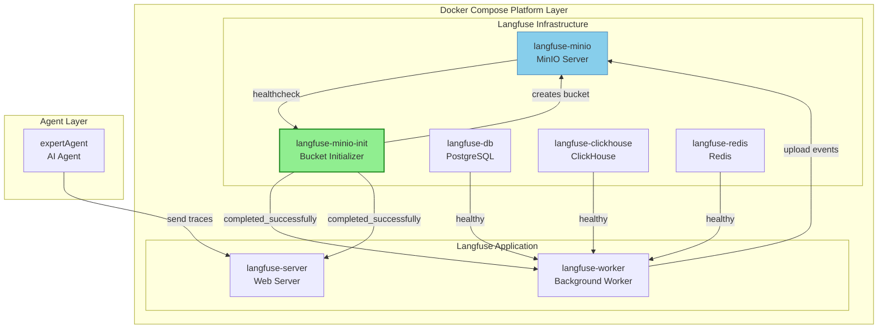
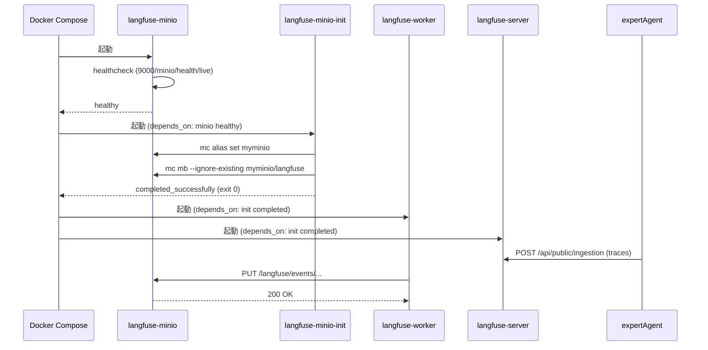
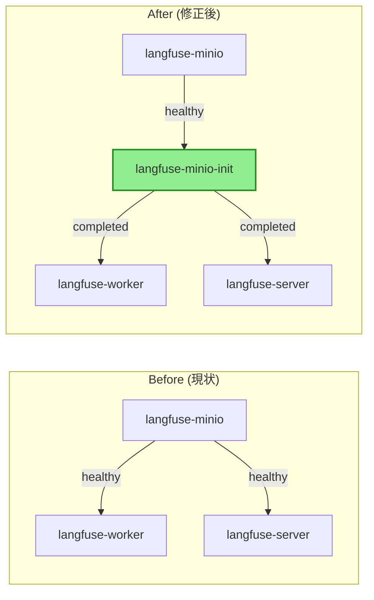
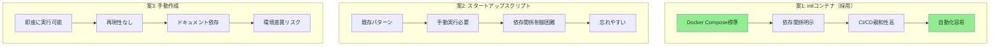

# 設計方針書: Issue #265

## Langfuse MinIOバケット自動作成

---

## 1. アーキテクチャ設計

### 1.1 システム構成図



### 1.2 起動シーケンス図



### 1.3 レイヤー構成

| レイヤー | コンポーネント | 役割 |
|---------|---------------|------|
| **Infrastructure** | langfuse-minio | オブジェクトストレージ |
| **Initialization** | langfuse-minio-init | バケット初期化（新規追加） |
| **Application** | langfuse-worker | バックグラウンド処理 |
| **Application** | langfuse-server | API/UI サーバー |
| **Client** | expertAgent | トレース送信 |

---

## 2. 技術選定

### 2.1 アプローチ比較

| アプローチ | 長所 | 短所 | 採用 |
|-----------|------|------|------|
| **案1: initコンテナ** | Docker Compose標準、依存関係制御可能、冪等性確保 | コンテナ1つ追加 | **採用** |
| **案2: スタートアップスクリプト** | シンプル、既存パターンあり | 手動実行必要、依存関係制御困難 | 不採用 |
| **案3: 手動作成** | 即座に実行可能 | 再現性なし、自動化不可 | 不採用 |

### 2.2 技術選定理由

| カテゴリ | 選定技術 | 選定理由 |
|---------|----------|----------|
| **イメージ** | `minio/mc` | 公式MinIO Client、軽量（~50MB）、`mc mb`コマンド内蔵 |
| **依存条件** | `service_completed_successfully` | 初期化完了を確実に待機、Docker Compose v2標準機能 |
| **冪等性** | `--ignore-existing` | 既存バケットあり時もエラーにしない |

### 2.3 既存パターンとの整合性

プロジェクトには類似の初期化パターンが存在：

```bash
# scripts/init-myvault-default-project.sh
# - healthcheck待機
# - 冪等性（既存プロジェクトチェック）
# - ログ出力
```

今回の設計はこのパターンをDocker Compose内に統合したものであり、一貫性を保つ。

---

## 3. 設計パターン

### 3.1 適用パターン

| パターン | 適用箇所 | 理由 |
|----------|----------|------|
| **Init Container** | langfuse-minio-init | アプリケーション起動前の初期化を分離 |
| **Health Check** | MinIO healthcheck | 依存サービスの準備完了を確認 |
| **Idempotent Operation** | `mc mb --ignore-existing` | 複数回実行しても同じ結果 |
| **Fail Fast** | entrypoint exit code | 初期化失敗時は即座に停止 |

### 3.2 依存関係グラフ



---

## 4. 実装設計

### 4.1 新規コンテナ定義

```yaml
# docker-compose.platform.yml に追加

langfuse-minio-init:
  image: minio/mc
  container_name: myswiftagent-langfuse-minio-init
  depends_on:
    langfuse-minio:
      condition: service_healthy
  environment:
    - MINIO_ROOT_USER=${MINIO_ROOT_USER:-minioadmin}
    - MINIO_ROOT_PASSWORD=${MINIO_ROOT_PASSWORD:-minioadmin}
    - LANGFUSE_S3_BUCKET=${LANGFUSE_S3_EVENT_UPLOAD_BUCKET:-langfuse}
  entrypoint: >
    /bin/sh -c "
    echo '🔄 Initializing MinIO bucket for Langfuse...';
    mc alias set myminio http://langfuse-minio:9000
      $${MINIO_ROOT_USER} $${MINIO_ROOT_PASSWORD};
    mc mb --ignore-existing myminio/$${LANGFUSE_S3_BUCKET};
    echo '✅ Bucket '$${LANGFUSE_S3_BUCKET}' created or already exists';
    "
  networks:
    - myswiftagent
  restart: "no"
```

### 4.2 依存関係の更新

```yaml
# langfuse-worker の depends_on を更新
langfuse-worker:
  depends_on:
    langfuse-db:
      condition: service_healthy
    langfuse-clickhouse:
      condition: service_healthy
    langfuse-redis:
      condition: service_healthy
    langfuse-minio:
      condition: service_healthy
    langfuse-minio-init:                    # 追加
      condition: service_completed_successfully  # 追加

# langfuse-server の depends_on を更新
langfuse-server:
  depends_on:
    langfuse-db:
      condition: service_healthy
    langfuse-clickhouse:
      condition: service_healthy
    langfuse-redis:
      condition: service_healthy
    langfuse-minio:
      condition: service_healthy
    langfuse-minio-init:                    # 追加
      condition: service_completed_successfully  # 追加
```

### 4.3 環境変数マッピング

| 環境変数 | デフォルト値 | 用途 |
|----------|-------------|------|
| `MINIO_ROOT_USER` | minioadmin | MinIO認証ユーザー |
| `MINIO_ROOT_PASSWORD` | minioadmin | MinIO認証パスワード |
| `LANGFUSE_S3_EVENT_UPLOAD_BUCKET` | langfuse | 作成するバケット名 |

---

## 5. セキュリティ設計

### 5.1 認証情報の取り扱い

| 項目 | 対策 |
|------|------|
| **認証情報の保存** | `.env`ファイルで管理、Git管理対象外 |
| **デフォルト値** | 開発環境用のデフォルト値を設定 |
| **本番環境** | 環境変数で上書き可能な設計 |

### 5.2 ネットワーク分離

```yaml
networks:
  - myswiftagent  # 内部ネットワークのみ
```

- MinIOへのアクセスは内部ネットワーク経由のみ
- 外部からの直接アクセスは制限

### 5.3 最小権限の原則

- initコンテナはバケット作成のみ実行
- `restart: "no"` で初期化後は停止
- 長期実行するプロセスを持たない

---

## 6. パフォーマンス設計

### 6.1 起動時間への影響

| フェーズ | 所要時間（予測） |
|----------|-----------------|
| MinIO healthcheck | 10-15秒 |
| initコンテナ起動 | 1-2秒 |
| mc alias set | <1秒 |
| mc mb | <1秒 |
| **合計オーバーヘッド** | **2-4秒** |

### 6.2 リソース使用量

| リソース | 使用量 |
|----------|--------|
| メモリ | ~10MB（一時的） |
| ディスク | ~50MB（イメージサイズ） |
| CPU | 最小限（即座に完了） |

---

## 7. 設計上の決定事項とトレードオフ

### 7.1 決定事項

| 決定 | 理由 |
|------|------|
| initコンテナ方式を採用 | Docker Compose標準機能、依存関係の明示的制御、CI/CDとの親和性 |
| `service_completed_successfully` を使用 | 初期化完了を確実に待機、失敗時は後続サービスを起動しない |
| 単一バケット構成 | 現在の要件（events/media/exports）は同一バケットで対応可能 |

### 7.2 代替案との比較



### 7.3 想定されるリスクと対策

| リスク | 影響 | 確率 | 対策 |
|--------|------|------|------|
| MinIO接続タイムアウト | initコンテナ失敗 | 低 | healthcheckで起動待ちを確保 |
| initコンテナ失敗 | Langfuse起動阻害 | 低 | ログ出力で原因特定、`--ignore-existing`で冪等性確保 |
| イメージ取得失敗 | 起動不可 | 極低 | DockerHubの公式イメージを使用 |
| 環境変数未設定 | 認証失敗 | 低 | デフォルト値を設定 |

---

## 8. テスト戦略

### 8.1 単体テスト

```bash
# MinIO + initコンテナのみでテスト
docker compose -f docker-compose.platform.yml up -d langfuse-minio langfuse-minio-init

# バケット確認
docker exec myswiftagent-langfuse-minio mc ls local/
```

### 8.2 結合テスト

```bash
# Langfuse全体を起動
docker compose -f docker-compose.platform.yml up -d

# エラーログ確認
docker logs myswiftagent-langfuse-server 2>&1 | grep -i "bucket\|NoSuchBucket"
# 期待: エラーなし
```

### 8.3 受入テスト

```bash
# 1. クリーンアップ
docker compose -f docker-compose.platform.yml down -v

# 2. 起動
docker compose -f docker-compose.platform.yml up -d

# 3. バケット存在確認
docker exec myswiftagent-langfuse-minio mc ls local/ | grep langfuse
# 期待: langfuse ディレクトリが表示

# 4. トレース送信テスト
curl -X POST http://localhost:8004/aiagent-api/v1/observability/test-trace

# 5. Langfuse UI確認
open http://localhost:3001
# 期待: トレースが表示される
```

### 8.4 冪等性テスト

```bash
# 2回連続起動
docker compose -f docker-compose.platform.yml down
docker compose -f docker-compose.platform.yml up -d
docker compose -f docker-compose.platform.yml down
docker compose -f docker-compose.platform.yml up -d

# エラーなく起動することを確認
docker compose -f docker-compose.platform.yml ps
```

---

## 9. 実装チェックリスト

- [ ] `langfuse-minio-init` サービスを追加
- [ ] `langfuse-worker` の依存関係を更新
- [ ] `langfuse-server` の依存関係を更新
- [ ] 環境変数のデフォルト値を確認
- [ ] 単体テスト実行
- [ ] 結合テスト実行
- [ ] 受入テスト実行
- [ ] 冪等性テスト実行
- [ ] ドキュメント更新

---

## 10. 設計原則への準拠

| 原則 | 準拠状況 | 説明 |
|------|----------|------|
| **SOLID - 単一責任** | ✅ | initコンテナはバケット作成のみを担当 |
| **SOLID - 開放/閉鎖** | ✅ | 環境変数で設定変更可能、コード変更不要 |
| **KISS** | ✅ | 最小限のシェルスクリプトで実現 |
| **YAGNI** | ✅ | 現在必要な機能のみ実装（単一バケット） |
| **DRY** | ✅ | 環境変数で設定を一元管理 |

---

## 11. 関連ドキュメント

| ドキュメント | パス |
|--------------|------|
| 要件定義書 | `dev-reports/feature/issue/265/requirements.md` |
| Docker Compose設定 | `docker-compose.platform.yml` |
| Langfuse統合ドキュメント | Issue #135 |

---

## 12. 承認

| 項目 | 状態 |
|------|------|
| 設計レビュー | 待機中 |
| 実装承認 | 待機中 |
| テスト計画承認 | 待機中 |
