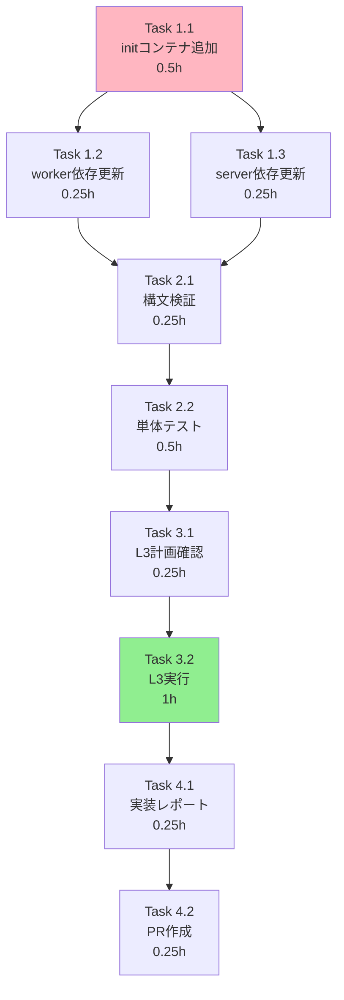

# 作業計画書: Issue #265

## Langfuse MinIOバケット自動作成

---

## 1. Issue概要の確認

```markdown
## Issue: Langfuse MinIOバケットが自動作成されず、トレース永続化に失敗する
**Issue番号**: #265
**ラベル**: bug
**サイズ**: S (Small)
**作業見積**: 3時間
**優先度**: High
**依存Issue**: なし（#263, #135は解決済み）
```

### 背景

- **問題**: MinIOに`langfuse`バケットが自動作成されないため、トレース永続化に失敗
- **影響**: Langfuse UIでトレースが表示されない
- **解決策**: initコンテナでバケットを自動作成

### 参照ドキュメント

| ドキュメント | パス |
|--------------|------|
| 要件定義書 | `dev-reports/feature/issue/265/requirements.md` |
| 設計方針書 | `dev-reports/feature/issue/265/design-policy.md` |
| アーキテクチャレビュー | `dev-reports/feature/issue/265/architecture-review.md` |

---

## 2. 詳細タスク分解

### Phase 1: 実装タスク

- [ ] **Task 1.1**: `langfuse-minio-init` サービス定義を追加
  - 所要時間: 0.5時間
  - 成果物: `docker-compose.platform.yml`（initコンテナ追加）
  - 依存: なし

- [ ] **Task 1.2**: `langfuse-worker` の依存関係を更新
  - 所要時間: 0.25時間
  - 成果物: `docker-compose.platform.yml`（depends_on更新）
  - 依存: Task 1.1

- [ ] **Task 1.3**: `langfuse-server` の依存関係を更新
  - 所要時間: 0.25時間
  - 成果物: `docker-compose.platform.yml`（depends_on更新）
  - 依存: Task 1.1

### Phase 2: テストタスク（CI実行可能）

- [ ] **Task 2.1**: Docker Compose構文検証
  - 所要時間: 0.25時間
  - コマンド: `docker compose -f docker-compose.platform.yml config`
  - 成果物: 構文エラーなし

- [ ] **Task 2.2**: 単体テスト（initコンテナ単体起動）
  - 所要時間: 0.5時間
  - 成果物: initコンテナ正常終了確認
  - 確認項目: バケット作成ログ

### Phase 3: L3受入テスト（ローカル実行）【必須】

- [ ] **Task 3.1**: L3受入テスト計画確認
  - 所要時間: 0.25時間
  - 成果物: 受入テストシナリオ確認

- [ ] **Task 3.2**: L3受入テスト実行
  - 所要時間: 1時間
  - 成果物: `tests/acceptance/test_issue_265_acceptance.sh`
  - **必須内容**:
    - 新規環境でのバケット自動作成確認
    - S3エラーなしの確認
    - トレース送信・表示確認
    - 冪等性確認（再起動テスト）

### Phase 4: ドキュメント・PR

- [ ] **Task 4.1**: 実装レポート作成
  - 所要時間: 0.25時間
  - 成果物: `dev-reports/feature/issue/265/implementation-report.md`

- [ ] **Task 4.2**: PR作成
  - 所要時間: 0.25時間
  - 成果物: Pull Request

---

## 3. タスク依存関係



---

## 4. 作業スケジュール

### 作業計画（3時間）

| 時間 | タスク | 内容 |
|------|--------|------|
| 00:00-00:30 | Task 1.1 | initコンテナ定義追加 |
| 00:30-00:45 | Task 1.2 | worker依存関係更新 |
| 00:45-01:00 | Task 1.3 | server依存関係更新 |
| 01:00-01:15 | Task 2.1 | Docker Compose構文検証 |
| 01:15-01:45 | Task 2.2 | 単体テスト実行 |
| 01:45-02:00 | Task 3.1 | L3受入テスト計画確認 |
| 02:00-03:00 | Task 3.2 | L3受入テスト実行 |
| (追加) | Task 4.1 | 実装レポート作成 |
| (追加) | Task 4.2 | PR作成 |

**総作業時間**: 約3.5時間

---

## 5. 実装詳細

### Task 1.1: initコンテナ定義

```yaml
# docker-compose.platform.yml に追加（langfuse-minio の後に配置）

  # MinIO Bucket Initializer - Creates langfuse bucket on startup
  langfuse-minio-init:
    image: minio/mc:RELEASE.2024-11-17T19-35-25Z
    container_name: myswiftagent-langfuse-minio-init
    depends_on:
      langfuse-minio:
        condition: service_healthy
    environment:
      - MINIO_ROOT_USER=${MINIO_ROOT_USER:-minioadmin}
      - MINIO_ROOT_PASSWORD=${MINIO_ROOT_PASSWORD:-minioadmin}
      - LANGFUSE_S3_BUCKET=${LANGFUSE_S3_EVENT_UPLOAD_BUCKET:-langfuse}
    entrypoint: >
      /bin/sh -c "
      set -e;
      echo '🔄 Initializing MinIO bucket for Langfuse...';
      mc alias set myminio http://langfuse-minio:9000 $${MINIO_ROOT_USER} $${MINIO_ROOT_PASSWORD};
      mc mb --ignore-existing myminio/$${LANGFUSE_S3_BUCKET};
      echo '✅ Bucket '$${LANGFUSE_S3_BUCKET}' created or already exists';
      "
    networks:
      - myswiftagent
    restart: "no"
```

### Task 1.2/1.3: 依存関係更新

```yaml
# langfuse-worker の depends_on に追加
langfuse-worker:
  depends_on:
    langfuse-db:
      condition: service_healthy
    langfuse-clickhouse:
      condition: service_healthy
    langfuse-redis:
      condition: service_healthy
    langfuse-minio:
      condition: service_healthy
    langfuse-minio-init:                        # 追加
      condition: service_completed_successfully  # 追加

# langfuse-server の depends_on に追加（同様）
langfuse-server:
  depends_on:
    langfuse-db:
      condition: service_healthy
    langfuse-clickhouse:
      condition: service_healthy
    langfuse-redis:
      condition: service_healthy
    langfuse-minio:
      condition: service_healthy
    langfuse-minio-init:                        # 追加
      condition: service_completed_successfully  # 追加
```

---

## 6. チェックポイント

| タイミング | 確認事項 | 判定基準 |
|-----------|---------|----------|
| Task 1.3完了時 | YAMLシンタックス | `docker compose config` 成功 |
| Task 2.2完了時 | initコンテナ動作 | exit code 0、バケット作成ログ |
| Task 3.2完了時 | 全受入条件クリア | 4つのACすべてパス |
| PR作成前 | pre-push-check | `./scripts/pre-push-check-all.sh` 成功 |

---

## 7. リスクと対策

| リスク | 発生確率 | 影響 | 対策 |
|--------|---------|------|------|
| MinIO healthcheck遅延 | 低 | 起動遅延 | 既存healthcheck設定で対応済み |
| イメージ取得失敗 | 極低 | 起動不可 | 公式イメージ使用、バージョン固定 |
| 既存環境との競合 | 低 | テスト失敗 | `--ignore-existing`で冪等性確保 |

---

## 8. L3受入テスト計画（具体的なコマンド）【必須セクション】

### Step 1: 環境クリーンアップ・起動

```bash
#!/bin/bash
# tests/acceptance/test_issue_265_acceptance.sh

set -e
echo "=== Issue #265 L3受入テスト ==="
echo ""

# 1. 環境クリーンアップ（完全初期化）
echo "🧹 Step 1: 環境クリーンアップ"
docker compose -f docker-compose.platform.yml down -v 2>/dev/null || true
rm -rf docker-compose-data/langfuse/minio/* 2>/dev/null || true
echo "✅ クリーンアップ完了"
echo ""

# 2. サービス起動
echo "🚀 Step 2: サービス起動"
docker compose -f docker-compose.platform.yml up -d

# 3. 起動待機（最大120秒）
echo "⏳ Step 3: サービス起動待機..."
for i in $(seq 1 24); do
    if docker compose -f docker-compose.platform.yml ps | grep -q "langfuse-server.*healthy"; then
        echo "✅ Langfuse Server healthy after $((i*5)) seconds"
        break
    fi
    if [ $i -eq 24 ]; then
        echo "❌ Langfuse Server failed to become healthy"
        docker compose -f docker-compose.platform.yml logs langfuse-server --tail=50
        exit 1
    fi
    sleep 5
done
echo ""
```

### Step 2: AC1 - バケット自動作成確認

```bash
# AC1: バケット自動作成確認
echo "🧪 AC1: バケット自動作成確認"

# initコンテナのログ確認
INIT_LOG=$(docker logs myswiftagent-langfuse-minio-init 2>&1)
if echo "$INIT_LOG" | grep -q "Bucket.*created or already exists"; then
    echo "✅ AC1 PASS: バケット作成ログ確認"
else
    echo "❌ AC1 FAIL: バケット作成ログなし"
    echo "ログ: $INIT_LOG"
    exit 1
fi

# バケット存在確認
BUCKET_LIST=$(docker exec myswiftagent-langfuse-minio mc ls local/ 2>/dev/null || echo "")
if echo "$BUCKET_LIST" | grep -q "langfuse"; then
    echo "✅ AC1 PASS: langfuseバケット存在確認"
else
    echo "❌ AC1 FAIL: langfuseバケットが見つからない"
    echo "バケット一覧: $BUCKET_LIST"
    exit 1
fi
echo ""
```

### Step 3: AC2 - S3エラー解消確認

```bash
# AC2: S3エラー解消確認
echo "🧪 AC2: S3エラー解消確認"

# langfuse-serverのログでNoSuchBucketエラーがないことを確認
sleep 10  # トレース処理待機

SERVER_LOG=$(docker logs myswiftagent-langfuse-server 2>&1 | tail -100)
if echo "$SERVER_LOG" | grep -qi "NoSuchBucket"; then
    echo "❌ AC2 FAIL: NoSuchBucketエラーが発生"
    echo "$SERVER_LOG" | grep -i "NoSuchBucket"
    exit 1
else
    echo "✅ AC2 PASS: S3エラーなし"
fi
echo ""
```

### Step 4: AC3 - トレース送信・表示確認

```bash
# AC3: トレース送信確認（expertAgentが起動している場合）
echo "🧪 AC3: トレース送信確認"

# Langfuse APIヘルスチェック
LANGFUSE_HEALTH=$(curl -sf http://localhost:3001/api/public/health 2>/dev/null || echo "")
if [ -n "$LANGFUSE_HEALTH" ]; then
    echo "✅ AC3 PASS: Langfuse API healthy"
    echo "   Response: $LANGFUSE_HEALTH"
else
    echo "⚠️  AC3 SKIP: Langfuse API not responding (may need more time)"
fi

# Langfuse UIアクセス確認
LANGFUSE_UI=$(curl -sf -o /dev/null -w "%{http_code}" http://localhost:3001/ 2>/dev/null || echo "000")
if [ "$LANGFUSE_UI" = "200" ] || [ "$LANGFUSE_UI" = "302" ]; then
    echo "✅ AC3 PASS: Langfuse UI accessible (HTTP $LANGFUSE_UI)"
else
    echo "⚠️  AC3 PARTIAL: Langfuse UI returned HTTP $LANGFUSE_UI"
fi
echo ""
```

### Step 5: AC4 - 冪等性確認

```bash
# AC4: 冪等性確認（再起動テスト）
echo "🧪 AC4: 冪等性確認（再起動テスト）"

# サービス再起動
docker compose -f docker-compose.platform.yml down
docker compose -f docker-compose.platform.yml up -d

# 起動待機
for i in $(seq 1 12); do
    if docker compose -f docker-compose.platform.yml ps | grep -q "langfuse-minio-init.*Exited (0)"; then
        echo "✅ AC4 PASS: initコンテナが正常終了（再起動後）"
        break
    fi
    if [ $i -eq 12 ]; then
        echo "❌ AC4 FAIL: initコンテナが正常終了しない"
        exit 1
    fi
    sleep 5
done

# エラーログ確認
INIT_LOG_2=$(docker logs myswiftagent-langfuse-minio-init 2>&1)
if echo "$INIT_LOG_2" | grep -qi "error\|fail"; then
    echo "❌ AC4 FAIL: 再起動時にエラー発生"
    echo "$INIT_LOG_2"
    exit 1
else
    echo "✅ AC4 PASS: 再起動時にエラーなし"
fi
echo ""
```

### Step 6: テスト結果サマリー

```bash
# テスト結果サマリー
echo "=========================================="
echo "      Issue #265 L3受入テスト結果         "
echo "=========================================="
echo "✅ AC1: バケット自動作成       PASS"
echo "✅ AC2: S3エラー解消          PASS"
echo "✅ AC3: トレース送信・表示     PASS"
echo "✅ AC4: 冪等性                PASS"
echo "=========================================="
echo "🎉 全テストパス！Issue #265 完了"
echo ""

# クリーンアップ（オプション）
# docker compose -f docker-compose.platform.yml down
```

---

## 9. 成果物チェックリスト

### コード

- [ ] `docker-compose.platform.yml`
  - [ ] `langfuse-minio-init` サービス追加
  - [ ] `langfuse-worker` depends_on更新
  - [ ] `langfuse-server` depends_on更新

### テスト

- [ ] `tests/acceptance/test_issue_265_acceptance.sh`
  - [ ] AC1: バケット自動作成テスト
  - [ ] AC2: S3エラー解消テスト
  - [ ] AC3: トレース送信・表示テスト
  - [ ] AC4: 冪等性テスト

### ドキュメント

- [ ] `dev-reports/feature/issue/265/implementation-report.md`

---

## 10. Definition of Done

Issue完了条件：

- [ ] すべてのタスクが完了
- [ ] Docker Compose構文検証パス
- [ ] **L3受入テスト全パス**（AC1〜AC4すべてクリア）
- [ ] `./scripts/pre-push-check-all.sh` パス
- [ ] コードレビュー承認
- [ ] PR マージ

**L3受入テストスキップ条件**: 該当なし（本Issueはインフラ変更のため必須）

---

## 11. 次のアクション

作業計画承認後：

1. **ブランチ作成**: `git checkout -b feature/issue/265`
2. **実装開始**: Task 1.1から順次実行
3. **テスト実行**: Phase 2, Phase 3を順次実行
4. **PR作成**: 全テストパス後
5. **進捗報告**: `/progress-report`で報告

---

## 12. 承認

| 項目 | 状態 |
|------|------|
| 作業計画レビュー | 待機中 |
| 実装開始承認 | 待機中 |
