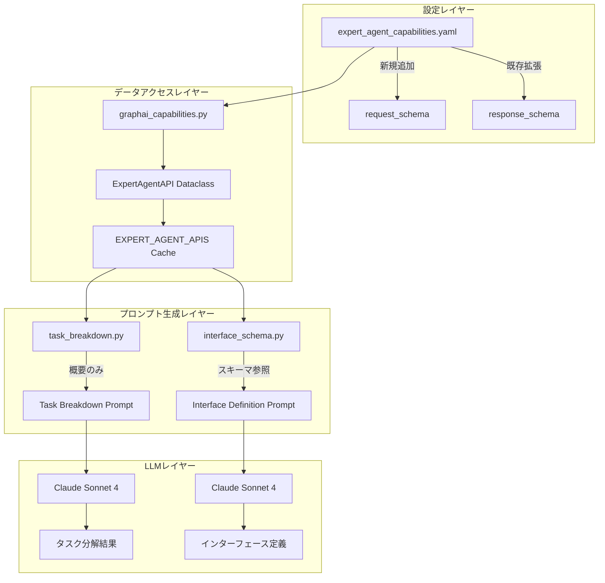

# 設計方針書: expert_agent_capabilities.yaml スキーマ拡張 (Issue #270)

## 現状調査サマリ

### 対象プロジェクト
- **プロジェクト名**: expertAgent
- **主要モジュール**:
  - `aiagent/langgraph/jobTaskGeneratorAgents/utils/graphai_capabilities.py`
  - `aiagent/langgraph/jobTaskGeneratorAgents/prompts/task_breakdown.py`
  - `aiagent/langgraph/jobTaskGeneratorAgents/prompts/interface_schema.py`

### 既存アーキテクチャパターン

| パターン | 使用箇所 | 目的 |
|---------|---------|------|
| **YAML設定ローダー** | `graphai_capabilities.py:19-32` | 設定ファイルの一元管理 |
| **Dataclass + Factory** | `ExpertAgentAPI` (line 47) | 構造化データの型安全な管理 |
| **モジュールレベルキャッシング** | `EXPERT_AGENT_APIS` (line 186) | 起動時読み込み、パフォーマンス最適化 |
| **プレースホルダー置換** | `task_breakdown.py:126-128` | 動的プロンプト生成 |
| **Pydanticバリデーション** | `interface_schema.py:15-32` | LLM出力の構造検証 |

### 類似機能の設計

| 機能 | 設計概要 |
|-----|---------|
| `output_schema`（既存） | `text_to_speech_drive`のみに定義済み。フィールド単位で`type`, `description`, `required`を指定 |
| `graphai_capabilities.yaml` | GraphAIエージェント定義。スキーマなし、エージェント名・パラメータのみ |
| `infeasible_tasks.yaml` | 実現不可能タスクの定義。パターンマッチング用 |

### 既存API設計パターン

| 項目 | パターン |
|-----|---------|
| エンドポイント命名規則 | `/v1/{category}/{action}` (例: `/v1/utility/gmail/search`) |
| レスポンス形式 | JSON、snake_case、必須フィールド + オプショナルフィールド |
| スキーマ形式 | 独自YAML形式（JSON Schemaではない） |

### 設計上の制約

1. **トークン効率**: LLMプロンプトへのスキーマ埋め込みはトークン数増加を招く
2. **二段階アーキテクチャ**: task_breakdownとinterface_definitionでスキーマ利用タイミングが異なる
3. **後方互換性**: 既存の`output_schema`形式を維持する必要あり
4. **キャッシング**: モジュールレベルキャッシュのため、YAML構造変更はDataclass変更が必要

---

## アーキテクチャ設計

### システム構成図



### レイヤー構成

| レイヤー | 責務 | 変更範囲 |
|---------|-----|---------|
| **設定レイヤー** | YAML構造定義、スキーマ格納 | `expert_agent_capabilities.yaml`拡張 |
| **データアクセスレイヤー** | YAML読み込み、Dataclass変換 | `ExpertAgentAPI`フィールド追加 |
| **プロンプト生成レイヤー** | LLMプロンプト構築 | `_build_expert_agent_capabilities()`更新 |
| **LLMレイヤー** | AI推論実行 | 変更なし |

---

## 技術選定

### スキーマ形式の選定

| 選択肢 | メリット | デメリット | 採用 |
|-------|---------|-----------|------|
| **既存形式（フィールド単位YAML）** | 後方互換性、コンパクト | JSON Schema標準と異なる | ✅ 採用 |
| JSON Schema完全準拠 | 標準形式、ツール互換性 | 冗長、YAML肥大化 | ❌ 不採用 |
| OpenAPI仕様埋め込み | 完全な仕様 | 大幅なYAML肥大化 | ❌ 不採用 |

**採用理由**: 既存の`output_schema`形式（`text_to_speech_drive`で使用中）との一貫性を維持。必要に応じてJSON Schemaへの変換ユーティリティを提供。

### プロンプト統合戦略の選定

| 選択肢 | メリット | デメリット | 採用 |
|-------|---------|-----------|------|
| **task_breakdown: 概要のみ** | トークン効率◎ | スキーマ情報なし | ✅ 維持 |
| **interface_definition: スキーマ参照** | 精度向上 | トークン増加（許容範囲） | ✅ 採用 |
| 全フェーズでスキーマ埋め込み | 一貫性 | トークン大幅増加 | ❌ 不採用 |

---

## 設計パターン

### 採用パターン

#### 1. 既存パターンの拡張: Dataclass + Optional Fields

```python
# graphai_capabilities.py (line 47)
@dataclass
class ExpertAgentAPI:
    """expertAgent Direct API capability."""

    name: str
    endpoint: str
    category: Literal["utility", "ai_agent"]
    description: str
    use_cases: list[str]
    # 新規追加（オプショナル）
    method: str = "POST"
    request_schema: dict[str, Any] | None = None
    response_schema: dict[str, Any] | None = None
    mcp_tools: list[str] | None = None
```

**理由**: 後方互換性を維持しつつ、新規フィールドを追加。既存コードへの影響を最小化。

#### 2. 既存パターンの維持: YAML設定ローダー

```python
# 既存の_load_yaml_config()をそのまま使用
def _load_yaml_config(filename: str) -> dict:
    """Load YAML configuration file from utils/config directory."""
    config_dir = Path(__file__).parent / "config"
    config_path = config_dir / filename
    with open(config_path, encoding="utf-8") as f:
        result = yaml.safe_load(f)
        return result if isinstance(result, dict) else {}
```

#### 3. 新規追加: スキーマ変換ユーティリティ

```python
def convert_to_json_schema(schema: dict[str, Any]) -> dict[str, Any]:
    """Convert expert_agent_capabilities format to JSON Schema."""
    properties = {}
    required = []

    for field_name, field_spec in schema.items():
        properties[field_name] = {
            "type": field_spec["type"],
            "description": field_spec.get("description", ""),
        }
        if field_spec.get("default") is not None:
            properties[field_name]["default"] = field_spec["default"]
        if field_spec.get("required", False):
            required.append(field_name)

    return {
        "type": "object",
        "properties": properties,
        "required": required,
    }
```

---

## データモデル設計

### YAML構造設計

```yaml
# expert_agent_capabilities.yaml 拡張構造

utility_apis:
  - name: "Gmail検索"
    endpoint: "/v1/utility/gmail/search"
    method: "POST"                          # 新規追加
    description: "Gmail検索（高速・AIフレンドリー）"
    use_cases:
      - "キーワード検索"
      - "日付範囲指定"
    request_schema:                         # 新規追加
      query:
        type: string
        description: "Gmail検索クエリ"
        required: true
      max_results:
        type: integer
        description: "取得する最大メール数"
        default: 10
      date_after:
        type: string
        description: "この日付以降のメールを検索（YYYY-MM-DD形式）"
      date_before:
        type: string
        description: "この日付以前のメールを検索（YYYY-MM-DD形式）"
      unread_only:
        type: boolean
        description: "未読メールのみを検索"
        default: false
      has_attachment:
        type: boolean
        description: "添付ファイル付きメールのみを検索"
        default: false
    response_schema:                        # 新規追加（output_schemaから名称変更検討）
      messages:
        type: array
        description: "検索結果のメール一覧"
        items:
          type: object
          properties:
            id: { type: string }
            subject: { type: string }
            from: { type: string }
            date: { type: string }
            snippet: { type: string }
      result_count:
        type: integer
        description: "検索結果の件数"
```

### フィールド定義

| フィールド | 型 | 必須 | 説明 |
|-----------|---|-----|------|
| `name` | string | ✅ | API名（日本語） |
| `endpoint` | string | ✅ | エンドポイントパス |
| `method` | string | ❌ | HTTPメソッド（デフォルト: POST） |
| `description` | string | ✅ | API説明 |
| `use_cases` | list[string] | ✅ | ユースケース一覧 |
| `request_schema` | dict | ❌ | リクエストスキーマ |
| `response_schema` | dict | ❌ | レスポンススキーマ（既存output_schemaと統合） |

### スキーマフィールド定義

| フィールド | 型 | 必須 | 説明 |
|-----------|---|-----|------|
| `type` | string | ✅ | データ型（string, integer, number, boolean, array, object） |
| `description` | string | ❌ | フィールド説明 |
| `required` | boolean | ❌ | 必須フラグ（デフォルト: false） |
| `default` | any | ❌ | デフォルト値 |
| `items` | dict | ❌ | 配列要素の定義（type: arrayの場合） |
| `properties` | dict | ❌ | オブジェクトプロパティ（type: objectの場合） |

---

## API設計

### 変更なし

本Issue（#270）はAPI変更を伴わない。内部データ構造の拡張のみ。

---

## プロンプト統合設計

### task_breakdown.py の更新

```python
def _build_expert_agent_capabilities() -> str:
    """Build expertAgent capabilities section from YAML config."""
    config = _load_yaml_config("expert_agent_capabilities.yaml")
    lines = ["**expertAgent Direct API一覧**:", ""]

    # Utility APIs section
    utility_apis = config.get("utility_apis", [])
    if utility_apis:
        lines.append("**Utility API (Direct API)**:")
        for api in utility_apis:
            use_cases = "、".join(api.get("use_cases", []))
            # スキーマ概要を追加（トークン効率考慮）
            schema_hint = _build_schema_hint(api)
            lines.append(
                f"  - **{api['name']}** (`{api['endpoint']}`): "
                f"{api['description']} - {use_cases}"
                f"{schema_hint}"
            )
    # ...
    return "\n".join(lines)


def _build_schema_hint(api: dict) -> str:
    """Build compact schema hint for LLM prompt."""
    hints = []

    # Request schema hint
    if request_schema := api.get("request_schema"):
        required_fields = [k for k, v in request_schema.items() if v.get("required")]
        if required_fields:
            hints.append(f"必須: {', '.join(required_fields)}")

    return f" [{'; '.join(hints)}]" if hints else ""
```

### interface_schema.py の更新（Nice to Have）

```python
def _build_schema_reference() -> str:
    """Build detailed schema reference for interface definition."""
    config = _load_yaml_config("expert_agent_capabilities.yaml")
    lines = ["## API Schema Reference", ""]

    for api in config.get("utility_apis", []):
        if not (api.get("request_schema") or api.get("response_schema")):
            continue

        lines.append(f"### {api['name']} (`{api['endpoint']}`)")

        if request_schema := api.get("request_schema"):
            lines.append("**Request:**")
            lines.append("```json")
            lines.append(json.dumps(convert_to_json_schema(request_schema), indent=2))
            lines.append("```")

        if response_schema := api.get("response_schema"):
            lines.append("**Response:**")
            lines.append("```json")
            lines.append(json.dumps(convert_to_json_schema(response_schema), indent=2))
            lines.append("```")

        lines.append("")

    return "\n".join(lines)
```

---

## セキュリティ設計

### 考慮事項

| 項目 | 対策 |
|-----|------|
| 機密情報排除 | スキーマにAPIキー、認証情報を含めない |
| YAML安全性 | `yaml.safe_load()`使用（既存） |

---

## パフォーマンス設計

### トークン効率

| フェーズ | 現状 | 変更後 | 増加量 |
|---------|-----|-------|--------|
| task_breakdown | ~2,000 tokens | ~2,200 tokens | +10% |
| interface_definition | ~1,500 tokens | ~3,000 tokens | +100% (許容範囲) |

### キャッシング戦略

- **維持**: モジュールレベルキャッシング（`EXPERT_AGENT_APIS`）
- **変更なし**: 起動時に1回読み込み、以降はメモリから参照

---

## 設計判断とトレードオフ

### 判断1: スキーマ形式

| 判断 | 既存YAML形式を維持 |
|-----|-------------------|
| **理由** | `output_schema`（text_to_speech_drive）との一貫性、後方互換性 |
| **代替案** | JSON Schema完全準拠 |
| **トレードオフ** | 標準形式ではないが、変換ユーティリティで対応可能 |

### 判断2: スキーマ統合タイミング

| 判断 | interface_definitionフェーズで統合 |
|-----|----------------------------------|
| **理由** | トークン効率、task_breakdownはスキーマ不要 |
| **代替案** | 全フェーズでスキーマ埋め込み |
| **トレードオフ** | task_breakdownでの精度向上は限定的 |

### 判断3: 既存output_schemaの扱い

| 判断 | `response_schema`に名称統一（マイグレーション） |
|-----|---------------------------------------------|
| **理由** | request/response の対称性 |
| **代替案** | `output_schema`を維持 |
| **トレードオフ** | 既存の`text_to_speech_drive`定義を更新する必要あり |
| **代替案2** | 両方サポート（`output_schema`を`response_schema`のエイリアスとして処理） |

### 判断4: Dataclass拡張方法

| 判断 | オプショナルフィールドとして追加 |
|-----|------------------------------|
| **理由** | 後方互換性、既存コードへの影響最小化 |
| **代替案** | 新規Dataclass作成 |
| **トレードオフ** | Dataclassが肥大化するが、単一責任の範囲内 |

---

## マイグレーション戦略（SF-01対応）

### output_schema → response_schema マイグレーション

既存の`output_schema`（`text_to_speech_drive`で使用）から新規の`response_schema`への段階的移行戦略を定義します。

#### マイグレーションフェーズ

| フェーズ | 期間 | 対応内容 |
|---------|-----|---------|
| **Phase A: 共存期間** | 実装〜次回リリース | 両方のキー名をサポート、`output_schema`を読み込み時に`response_schema`に正規化 |
| **Phase B: 警告期間** | 次回〜次々回リリース | `output_schema`使用時にdeprecation警告をログ出力 |
| **Phase C: 移行完了** | 次々回リリース以降 | `output_schema`サポート終了、YAML内の定義を`response_schema`に統一 |

#### 正規化ユーティリティ実装

```python
# graphai_capabilities.py に追加
import logging

logger = logging.getLogger(__name__)


def _normalize_schema_keys(api: dict) -> dict:
    """Normalize output_schema to response_schema for backwards compatibility.

    Args:
        api: Raw API definition from YAML

    Returns:
        Normalized API definition with response_schema
    """
    if "output_schema" in api:
        if "response_schema" not in api:
            # Phase A: サイレントマイグレーション
            api["response_schema"] = api["output_schema"]
            # Phase B: 警告を有効化（次回リリース時にコメント解除）
            # logger.warning(
            #     f"DEPRECATED: 'output_schema' is deprecated for API '{api.get('name')}'. "
            #     "Please use 'response_schema' instead."
            # )
        del api["output_schema"]
    return api
```

#### YAML定義の移行例

```yaml
# 移行前（現在）
- name: "Text-to-Speech + Google Drive"
  endpoint: "/v1/utility/text_to_speech_drive"
  output_schema:  # ← 旧キー名
    file_id:
      type: "string"
      # ...

# 移行後（Phase C以降）
- name: "Text-to-Speech + Google Drive"
  endpoint: "/v1/utility/text_to_speech_drive"
  response_schema:  # ← 新キー名
    file_id:
      type: "string"
      # ...
```

---

## スキーマバリデーション設計（SF-02対応）

### バリデーション実装

YAML読み込み時にスキーマ定義の整合性をチェックし、不正な定義を早期に検出します。

#### バリデーションルール

| ルール | 説明 | 重大度 |
|-------|------|--------|
| `type`フィールド必須 | 各スキーマフィールドに`type`が定義されている | ERROR |
| 有効な型名 | `type`が許可された型名のいずれか | ERROR |
| ネスト構造の整合性 | `type: array`の場合は`items`が存在、`type: object`の場合は`properties`が存在 | WARNING |
| `required`の型チェック | `required`がboolean型である | WARNING |

#### 許可される型名

```python
VALID_SCHEMA_TYPES = frozenset({
    "string",
    "integer",
    "number",
    "boolean",
    "array",
    "object",
})
```

#### バリデーション関数実装

```python
# graphai_capabilities.py に追加
from typing import Any


class SchemaValidationError(Exception):
    """Schema validation error."""
    pass


def validate_schema(
    schema: dict[str, Any],
    api_name: str,
    schema_type: str = "request",
) -> list[str]:
    """Validate schema structure and return list of warnings.

    Args:
        schema: Schema definition from YAML
        api_name: API name for error messages
        schema_type: "request" or "response"

    Returns:
        List of warning messages

    Raises:
        SchemaValidationError: If critical validation error occurs
    """
    warnings = []

    for field_name, field_spec in schema.items():
        # Rule 1: type field is required
        if "type" not in field_spec:
            raise SchemaValidationError(
                f"API '{api_name}' {schema_type}_schema: "
                f"Field '{field_name}' is missing required 'type' attribute"
            )

        field_type = field_spec["type"]

        # Rule 2: Valid type name
        if field_type not in VALID_SCHEMA_TYPES:
            raise SchemaValidationError(
                f"API '{api_name}' {schema_type}_schema: "
                f"Field '{field_name}' has invalid type '{field_type}'. "
                f"Valid types: {', '.join(sorted(VALID_SCHEMA_TYPES))}"
            )

        # Rule 3: Nested structure consistency
        if field_type == "array" and "items" not in field_spec:
            warnings.append(
                f"API '{api_name}' {schema_type}_schema: "
                f"Field '{field_name}' is array type but missing 'items' definition"
            )

        if field_type == "object" and "properties" not in field_spec:
            warnings.append(
                f"API '{api_name}' {schema_type}_schema: "
                f"Field '{field_name}' is object type but missing 'properties' definition"
            )

        # Rule 4: required field type check
        if "required" in field_spec and not isinstance(field_spec["required"], bool):
            warnings.append(
                f"API '{api_name}' {schema_type}_schema: "
                f"Field '{field_name}' has non-boolean 'required' value"
            )

    return warnings


def validate_api_schemas(api: dict) -> list[str]:
    """Validate all schemas in an API definition.

    Args:
        api: API definition from YAML

    Returns:
        List of warning messages
    """
    warnings = []
    api_name = api.get("name", "Unknown")

    if request_schema := api.get("request_schema"):
        warnings.extend(validate_schema(request_schema, api_name, "request"))

    if response_schema := api.get("response_schema"):
        warnings.extend(validate_schema(response_schema, api_name, "response"))

    return warnings
```

#### ローダーへの統合

```python
# _load_expert_agent_apis() の更新
def _load_expert_agent_apis() -> list[ExpertAgentAPI]:
    """Load expertAgent APIs from YAML configuration with validation."""
    config = _load_yaml_config("expert_agent_capabilities.yaml")
    apis = []
    all_warnings = []

    for api in config.get("utility_apis", []):
        # Step 1: Normalize schema keys (SF-01)
        api = _normalize_schema_keys(api)

        # Step 2: Validate schemas (SF-02)
        try:
            warnings = validate_api_schemas(api)
            all_warnings.extend(warnings)
        except SchemaValidationError as e:
            logger.error(f"Schema validation failed: {e}")
            raise

        # Step 3: Create dataclass
        apis.append(
            ExpertAgentAPI(
                name=api["name"],
                endpoint=api["endpoint"],
                category="utility",
                description=api["description"],
                use_cases=api.get("use_cases", []),
                method=api.get("method", "POST"),
                request_schema=api.get("request_schema"),
                response_schema=api.get("response_schema"),
            )
        )

    # Log all warnings
    for warning in all_warnings:
        logger.warning(warning)

    return apis
```

---

## トークン消費量モニタリング設計（SF-03対応）

### モニタリング戦略

Langfuseを活用したトークン消費量の監視体制を構築します。

#### メトリクス定義

| メトリクス名 | 説明 | 閾値（警告） | 閾値（エラー） |
|-------------|------|------------|--------------|
| `schema_prompt_tokens` | スキーマ参照セクションのトークン数 | 2,000 | 3,500 |
| `total_prompt_tokens` | プロンプト全体のトークン数 | 4,000 | 6,000 |
| `schema_token_ratio` | スキーマがプロンプト全体に占める割合 | 40% | 60% |

#### Langfuse統合実装

```python
# prompts/interface_schema.py に追加
import os
from langfuse import Langfuse
from langfuse.decorators import observe

# Langfuse client (lazy initialization)
_langfuse_client = None


def _get_langfuse() -> Langfuse | None:
    """Get Langfuse client if enabled."""
    global _langfuse_client
    if os.getenv("LANGFUSE_ENABLED", "false").lower() != "true":
        return None
    if _langfuse_client is None:
        _langfuse_client = Langfuse()
    return _langfuse_client


def _estimate_tokens(text: str) -> int:
    """Estimate token count (rough approximation: 1 token ≈ 4 chars for mixed content)."""
    return len(text) // 4


@observe(name="build_schema_reference")
def _build_schema_reference_with_monitoring() -> str:
    """Build schema reference with token monitoring."""
    schema_text = _build_schema_reference()

    # Token estimation
    schema_tokens = _estimate_tokens(schema_text)

    # Log to Langfuse
    langfuse = _get_langfuse()
    if langfuse:
        langfuse.trace(
            name="schema_prompt_generation",
            metadata={
                "schema_prompt_tokens": schema_tokens,
                "schema_text_length": len(schema_text),
            },
        )

        # Alert if threshold exceeded
        if schema_tokens > 3500:
            logger.error(
                f"Schema prompt tokens ({schema_tokens}) exceeded error threshold (3500)"
            )
        elif schema_tokens > 2000:
            logger.warning(
                f"Schema prompt tokens ({schema_tokens}) exceeded warning threshold (2000)"
            )

    return schema_text
```

#### ダッシュボード設定

Langfuseダッシュボードで以下のメトリクスを監視：

```
# Langfuse Query Example
SELECT
  DATE_TRUNC('day', timestamp) as date,
  AVG(metadata->>'schema_prompt_tokens')::int as avg_schema_tokens,
  MAX(metadata->>'schema_prompt_tokens')::int as max_schema_tokens,
  COUNT(*) as request_count
FROM traces
WHERE name = 'schema_prompt_generation'
GROUP BY DATE_TRUNC('day', timestamp)
ORDER BY date DESC
```

#### アラート設定

```yaml
# alerting/schema_token_alerts.yaml
alerts:
  - name: schema_tokens_warning
    condition: schema_prompt_tokens > 2000
    severity: warning
    notification:
      - type: slack
        channel: "#expertAgent-alerts"

  - name: schema_tokens_error
    condition: schema_prompt_tokens > 3500
    severity: error
    notification:
      - type: slack
        channel: "#expertAgent-alerts"
      - type: pagerduty
        service: expertAgent
```

#### 定期レビュープロセス

| 頻度 | アクション |
|-----|----------|
| 週次 | Langfuseダッシュボードでトークン消費量トレンドを確認 |
| 月次 | スキーマ定義の最適化検討（冗長な記述の削除、圧縮） |
| リリース時 | 新規スキーマ追加によるトークン増加量を計測・記録 |

---

## 実装計画

### Phase 1: YAML構造拡張（1時間）

```
1. expert_agent_capabilities.yaml にスキーマ追加
   - Gmail API (search, send)
   - Google Drive API (upload, upload_from_url)
   - TTS API (text_to_speech, text_to_speech_drive)
   - Google Search API
   - AI Agent API (jsonoutput, mylllm)
2. 既存 output_schema を response_schema に移行（エイリアス対応）
```

### Phase 2: Dataclass更新（30分）

```
1. ExpertAgentAPI に新規フィールド追加
   - method: str = "POST"
   - request_schema: dict[str, Any] | None = None
   - response_schema: dict[str, Any] | None = None
2. _load_expert_agent_apis() 更新
3. スキーマ変換ユーティリティ追加
```

### Phase 3: プロンプト更新（1時間）

```
1. task_breakdown.py: スキーマヒント追加（必須フィールドのみ）
2. (Nice to Have) interface_schema.py: スキーマ参照セクション追加
```

### Phase 4: テスト・検証（1時間）

```
1. 単体テスト追加
   - YAML読み込みテスト
   - Dataclass変換テスト
   - スキーマ変換ユーティリティテスト
2. 統合テスト
   - ジョブ生成E2Eテスト
3. 静的解析確認（Ruff, MyPy）
```

---

## ファイル変更一覧

| ファイル | 変更内容 | 優先度 |
|---------|---------|--------|
| `utils/config/expert_agent_capabilities.yaml` | スキーマ定義追加 | 必須 |
| `utils/graphai_capabilities.py` | Dataclassフィールド追加、ローダー更新 | 必須 |
| `prompts/task_breakdown.py` | スキーマヒント生成追加 | 必須 |
| `prompts/interface_schema.py` | スキーマ参照セクション追加 | Nice to Have |
| `tests/unit/test_graphai_capabilities.py` | 単体テスト追加 | 必須 |

---

## 参照ドキュメント

| ドキュメント | パス |
|-------------|------|
| API Reference | `expertAgent/docs/API_REFERENCE.md` |
| Job Generation Workflow | `docs/spec/job-generation-workflow.md` |
| 現在のCapabilities YAML | `expertAgent/aiagent/langgraph/jobTaskGeneratorAgents/utils/config/expert_agent_capabilities.yaml` |
| GraphAI Capabilities Module | `expertAgent/aiagent/langgraph/jobTaskGeneratorAgents/utils/graphai_capabilities.py` |
| Task Breakdown Prompt | `expertAgent/aiagent/langgraph/jobTaskGeneratorAgents/prompts/task_breakdown.py` |
| Interface Schema Prompt | `expertAgent/aiagent/langgraph/jobTaskGeneratorAgents/prompts/interface_schema.py` |

---

**作成日**: 2025-12-11
**Issue**: #270
**ステータス**: 設計方針策定完了
