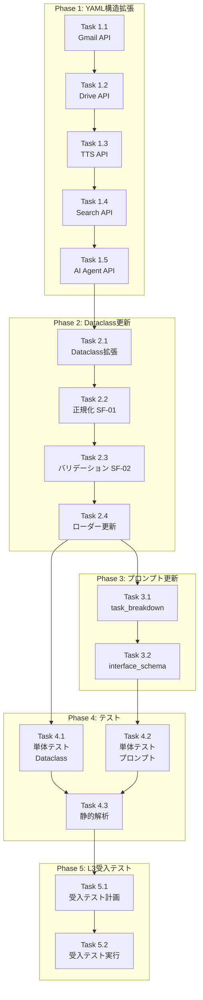

# 作業計画書: Issue #270 expert_agent_capabilities.yaml スキーマ拡張

## Issue: feat: expert_agent_capabilities.yamlにリクエスト/レスポンススキーマを追加

**Issue番号**: #270
**サイズ**: M
**作業見積**: 6.5時間
**優先度**: High
**依存Issue**: なし

---

## 詳細タスク分解

### Phase 1: YAML構造拡張（実装タスク）

- [ ] **Task 1.1**: Gmail API スキーマ追加
  - 所要時間: 30分
  - 成果物: `expert_agent_capabilities.yaml` 更新
  - 対象API:
    - `Gmail検索` (`/v1/utility/gmail/search`)
    - `Gmail送信` (`/v1/utility/gmail/send`)
  - 依存: なし

- [ ] **Task 1.2**: Google Drive API スキーマ追加
  - 所要時間: 30分
  - 成果物: `expert_agent_capabilities.yaml` 更新
  - 対象API:
    - `Google Drive Upload` (`/v1/utility/drive/upload`)
    - `Google Drive Upload from URL` (`/v1/utility/drive/upload_from_url`)
  - 依存: Task 1.1

- [ ] **Task 1.3**: TTS API スキーマ追加 + output_schema移行
  - 所要時間: 30分
  - 成果物: `expert_agent_capabilities.yaml` 更新
  - 対象API:
    - `Text-to-Speech（Base64）` (`/v1/utility/text_to_speech`)
    - `Text-to-Speech + Google Drive` (`/v1/utility/text_to_speech_drive`) - 既存output_schema→response_schemaへ移行
    - `TTS + Google Drive + Gmail通知` (`/v1/utility/tts_and_upload_drive`)
  - 依存: Task 1.2

- [ ] **Task 1.4**: Google Search API スキーマ追加
  - 所要時間: 20分
  - 成果物: `expert_agent_capabilities.yaml` 更新
  - 対象API:
    - `Google検索` (`/v1/utility/google_search`)
    - `Google検索概要` (`/v1/utility/google_search_overview`)
  - 依存: Task 1.3

- [ ] **Task 1.5**: AI Agent API スキーマ追加
  - 所要時間: 30分
  - 成果物: `expert_agent_capabilities.yaml` 更新
  - 対象API:
    - `Direct LLM` (`/v1/mylllm`)
    - `JSON Output Agent` (`/v1/aiagent/utility/jsonoutput`)
    - `Sample Agent` (`/v1/aiagent/sample`)
  - 依存: Task 1.4

### Phase 2: Dataclass・ローダー更新

- [ ] **Task 2.1**: ExpertAgentAPI Dataclass拡張
  - 所要時間: 30分
  - 成果物: `graphai_capabilities.py` 更新
  - 内容:
    - `method: str = "POST"` フィールド追加
    - `request_schema: dict[str, Any] | None = None` フィールド追加
    - `response_schema: dict[str, Any] | None = None` フィールド追加
  - 依存: Phase 1完了

- [ ] **Task 2.2**: スキーマ正規化ユーティリティ実装 (SF-01)
  - 所要時間: 20分
  - 成果物: `graphai_capabilities.py` に `_normalize_schema_keys()` 追加
  - 内容: `output_schema` → `response_schema` 自動変換
  - 依存: Task 2.1

- [ ] **Task 2.3**: スキーマバリデーション実装 (SF-02)
  - 所要時間: 30分
  - 成果物: `graphai_capabilities.py` に `validate_schema()`, `SchemaValidationError` 追加
  - 内容: YAML読み込み時のスキーマ整合性チェック
  - 依存: Task 2.2

- [ ] **Task 2.4**: ローダー関数更新
  - 所要時間: 20分
  - 成果物: `graphai_capabilities.py` の `_load_expert_agent_apis()` 更新
  - 内容: 正規化・バリデーション統合
  - 依存: Task 2.3

### Phase 3: プロンプト更新

- [ ] **Task 3.1**: task_breakdown.py スキーマヒント追加
  - 所要時間: 30分
  - 成果物: `task_breakdown.py` 更新
  - 内容:
    - `_build_schema_hint()` 関数追加
    - `_build_expert_agent_capabilities()` でスキーマヒント表示
  - 依存: Phase 2完了

- [ ] **Task 3.2**: interface_schema.py スキーマ参照追加 (Nice to Have)
  - 所要時間: 30分
  - 成果物: `interface_schema.py` 更新
  - 内容:
    - `_build_schema_reference()` 関数追加
    - トークンモニタリング統合 (SF-03)
  - 依存: Task 3.1

### Phase 4: テスト（TDD - CI実行可能）

- [ ] **Task 4.1**: 単体テスト（Dataclass・ローダー）
  - 所要時間: 45分
  - 成果物: `tests/unit/test_graphai_capabilities.py`
  - テスト項目:
    - YAML読み込みテスト
    - Dataclass変換テスト
    - スキーマ正規化テスト (SF-01)
    - スキーマバリデーションテスト (SF-02)
  - カバレッジ目標: 90%
  - 依存: Phase 2完了

- [ ] **Task 4.2**: 単体テスト（プロンプト生成）
  - 所要時間: 30分
  - 成果物: `tests/unit/test_task_breakdown.py` 更新
  - テスト項目:
    - スキーマヒント生成テスト
    - スキーマ参照生成テスト
  - カバレッジ目標: 90%
  - 依存: Phase 3完了

- [ ] **Task 4.3**: 静的解析確認
  - 所要時間: 15分
  - 成果物: Ruff/MyPy エラーゼロ
  - 依存: Task 4.1, Task 4.2

### Phase 5: L3受入テスト（ローカルのみ）

- [ ] **Task 5.1**: L3受入テスト計画
  - 所要時間: 15分
  - 成果物: 受入テストシナリオ（curlコマンド）
  - 依存: Phase 4完了

- [ ] **Task 5.2**: L3受入テスト実行
  - 所要時間: 30分
  - 成果物: `tests/acceptance/test_issue_270_acceptance.sh`
  - 依存: Task 5.1

---

## タスク依存関係



---

## 作業スケジュール

### Day 1 (4時間)

| 時間 | タスク | 成果物 |
|-----|-------|--------|
| 1h | Task 1.1〜1.4 | YAML: Gmail, Drive, TTS, Search API スキーマ |
| 30min | Task 1.5 | YAML: AI Agent API スキーマ |
| 1h30min | Task 2.1〜2.4 | graphai_capabilities.py 更新 |
| 1h | Task 3.1〜3.2 | プロンプト更新 |

### Day 2 (2.5時間)

| 時間 | タスク | 成果物 |
|-----|-------|--------|
| 1h15min | Task 4.1〜4.2 | 単体テスト |
| 15min | Task 4.3 | 静的解析確認 |
| 45min | Task 5.1〜5.2 | 受入テスト |
| 15min | PR作成 | Pull Request |

**総作業時間**: 6.5時間（約1.5日）

---

## チェックポイント

| タイミング | 確認事項 | 対応 |
|-----------|---------|------|
| Phase 1完了時 | YAMLの構文正確性 | `yaml.safe_load()` で読み込み確認 |
| Phase 2完了時 | Dataclass互換性 | 既存テスト通過確認 |
| Phase 3完了時 | プロンプト出力確認 | トークン数計測 |
| Phase 4完了時 | カバレッジ90%達成 | 未達の場合追加テスト |
| PR作成前 | CI/CDパス | `./scripts/pre-push-check-all.sh` 実行 |

---

## リスクと対策

| リスク | 発生確率 | 影響 | 対策 |
|-------|---------|------|------|
| YAML構文エラー | 中 | ローダー失敗 | Phase 1で段階的に追加・テスト |
| トークン消費量超過 | 中 | LLMコスト増 | SF-03モニタリングで計測 |
| 既存テスト破壊 | 低 | CI失敗 | オプショナルフィールドで後方互換性確保 |
| API仕様との乖離 | 中 | スキーマ不正確 | API_REFERENCE.md を参照して正確に記述 |

---

## 成果物チェックリスト

### コード

- [ ] `expertAgent/aiagent/langgraph/jobTaskGeneratorAgents/utils/config/expert_agent_capabilities.yaml`
- [ ] `expertAgent/aiagent/langgraph/jobTaskGeneratorAgents/utils/graphai_capabilities.py`
- [ ] `expertAgent/aiagent/langgraph/jobTaskGeneratorAgents/prompts/task_breakdown.py`
- [ ] `expertAgent/aiagent/langgraph/jobTaskGeneratorAgents/prompts/interface_schema.py`

### テスト

- [ ] `expertAgent/tests/unit/test_graphai_capabilities.py`
- [ ] `expertAgent/tests/unit/test_task_breakdown.py` (更新)

### 受入テスト

- [ ] `tests/acceptance/test_issue_270_acceptance.sh`

---

## L3受入テスト計画（具体的なコマンド）

### Step 1: サービス起動確認

```bash
# サービス起動
./scripts/dev-start.sh

# ヘルスチェック
curl -sf http://localhost:8104/aiagent-api/health && echo "✅ expertAgent: healthy"
curl -sf http://localhost:8103/health && echo "✅ myVault: healthy"
```

### Step 2: YAML読み込み確認

```bash
# Python でYAML読み込みテスト
cd expertAgent
uv run python -c "
from aiagent.langgraph.jobTaskGeneratorAgents.utils.graphai_capabilities import get_expert_agent_apis

apis = get_expert_agent_apis()
print(f'✅ Loaded {len(apis)} APIs')

# スキーマ存在確認
apis_with_schema = [a for a in apis if a.request_schema or a.response_schema]
print(f'✅ APIs with schema: {len(apis_with_schema)}')

# Gmail検索スキーマ確認
gmail = next((a for a in apis if a.name == 'Gmail検索'), None)
if gmail and gmail.request_schema:
    print(f'✅ Gmail検索 request_schema fields: {list(gmail.request_schema.keys())}')
else:
    print('❌ Gmail検索 request_schema not found')
"
```

### Step 3: プロンプト生成確認

```bash
# プロンプト生成テスト
cd expertAgent
uv run python -c "
from aiagent.langgraph.jobTaskGeneratorAgents.prompts.task_breakdown import _build_expert_agent_capabilities

prompt = _build_expert_agent_capabilities()
print('=== Generated Prompt ===')
print(prompt[:2000])
print('...')
print(f'Total length: {len(prompt)} chars')
print(f'Estimated tokens: {len(prompt) // 4}')
"
```

### Step 4: ジョブ生成E2Eテスト

```bash
# ジョブ生成APIテスト（スキーマ情報が活用されることを確認）
curl -s -X POST http://localhost:8104/aiagent-api/v1/job-generator \
  -H "Content-Type: application/json" \
  -d '{
    "user_request": "最新のメールを5件検索して、件名と送信者を教えてください",
    "available_capabilities": ["Gmail検索"]
  }' | python3 -c "
import sys, json
data = json.load(sys.stdin)
print(f'Status: {data.get(\"status\")}')
if data.get('status') == 'success':
    tasks = data.get('task_breakdown', [])
    for task in tasks:
        if 'interface' in task:
            print(f'Task: {task.get(\"task_name\")}')
            print(f'Interface: {json.dumps(task[\"interface\"], indent=2, ensure_ascii=False)}')
"
```

### Step 5: エビデンス収集

```bash
# レスポンスをファイルに保存
curl -s -X POST http://localhost:8104/aiagent-api/v1/job-generator \
  -H "Content-Type: application/json" \
  -d '{
    "user_request": "テストメッセージを音声に変換してGoogle Driveにアップロード",
    "available_capabilities": ["Text-to-Speech + Google Drive"]
  }' > /tmp/issue_270_acceptance_result.json

# 結果確認
cat /tmp/issue_270_acceptance_result.json | python3 -m json.tool
```

---

## Definition of Done

Issue完了条件：
- [ ] すべてのタスクが完了
- [ ] 主要API（10件以上）のスキーマがYAMLに追加されている
- [ ] `output_schema` → `response_schema` マイグレーション完了 (SF-01)
- [ ] スキーマバリデーション実装完了 (SF-02)
- [ ] トークンモニタリング設計反映 (SF-03)
- [ ] 単体テストカバレッジ90%以上
- [ ] CI/CDグリーン（`./scripts/pre-push-check-all.sh` パス）
- [ ] L3受入テスト全パス
- [ ] コードレビュー承認

---

## 参照ドキュメント

| ドキュメント | パス |
|-------------|------|
| 要件定義書 | `dev-reports/feature/issue/270/requirements.md` |
| 設計方針書 | `dev-reports/feature/issue/270/design-policy.md` |
| アーキテクチャレビュー | `dev-reports/feature/issue/270/architecture-review.md` |
| API Reference | `expertAgent/docs/API_REFERENCE.md` |
| 現在のCapabilities YAML | `expertAgent/aiagent/langgraph/jobTaskGeneratorAgents/utils/config/expert_agent_capabilities.yaml` |

---

## 次のアクション

作業計画承認後：
1. **ブランチ作成**: `feature/issue/270`
2. **worktree作成**: `./scripts/worktree-create-from-issue.sh 270`
3. **タスク実行**: Phase 1から順次実装
4. **進捗報告**: `/progress-report 270` で定期報告

---

**作成日**: 2025-12-11
**Issue**: #270
**ステータス**: 作業計画策定完了
