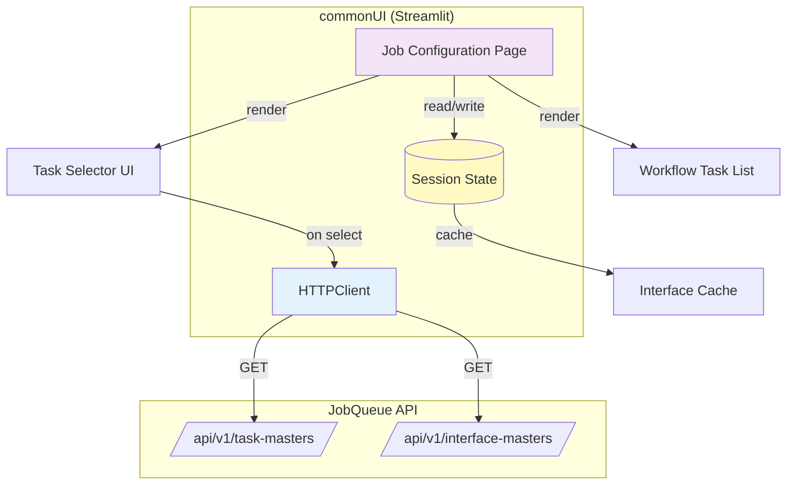
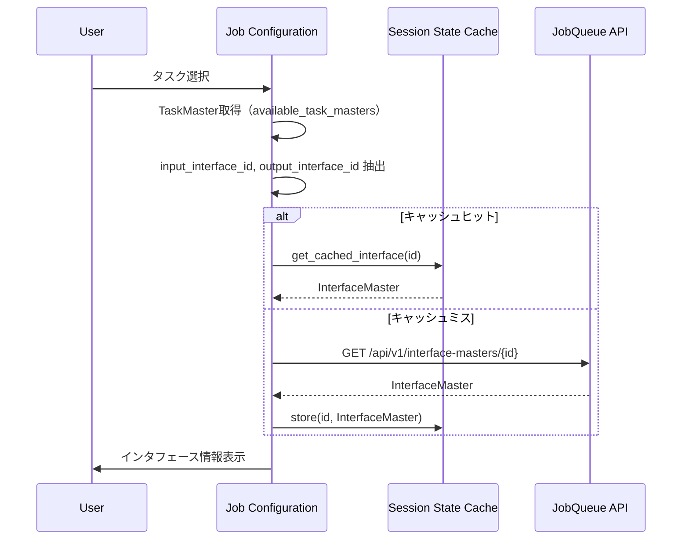

# 設計方針書: commonUIのJob Configurationでのtaskインタフェース確認効率化

> Issue: [#277](https://github.com/kewton/MySwiftAgent/issues/277)
> 作成日: 2025-12-13
> ステータス: 設計完了

---

## 現状調査サマリ

### 対象プロジェクト
- **プロジェクト名**: commonUI
- **技術スタック**: Streamlit (Python 3.12+)
- **主要モジュール**:
  - `commonUI/pages/7_🔧_Job_Configuration.py` - 改修対象（567行）
  - `commonUI/components/http_client.py` - HTTPクライアント
  - `commonUI/core/config.py` - 設定管理

### 既存アーキテクチャパターン

| パターン | 使用箇所 | 目的 |
|---------|---------|------|
| **Session State管理** | 全ページ | Streamlit再描画間のデータ永続化 |
| **Context Manager** | `HTTPClient` | HTTP接続の自動クリーンアップ |
| **Lazy Loading** | `load_job_masters()`, `load_task_masters()` | 必要時のみデータ取得 |
| **Render Function分離** | `render_*()` | UI描画ロジックの分離 |
| **Guard Clause** | 各render関数冒頭 | 早期リターンによる簡潔化 |

### 類似機能の設計

#### TaskMasters詳細画面（8_🔧_TaskMasters.py:569-617）
```python
# Interfaces タブでインタフェース詳細を取得・表示
with tab2:
    st.subheader("📥 Input Interface")
    input_id = task_detail.get("input_interface_id")
    if input_id:
        try:
            api_config = config.get_api_config("JobQueue")
            with HTTPClient(api_config, "JobQueue") as client:
                input_interface = client.get(f"/api/v1/interface-masters/{input_id}")
                st.write(f"**Name:** {input_interface.get('name')}")
                with st.expander("View Input Schema"):
                    st.json(input_interface.get("input_schema", {}))
        except Exception as e:
            st.warning(f"Could not load input interface: {e}")
```

**特徴**:
- インラインAPI呼び出し（詳細表示時のみ取得）
- `st.expander`でJSON Schema表示
- 例外時は`st.warning`で非致命的エラー表示

#### InterfaceMasters詳細画面（9_🔌_InterfaceMasters.py:158-168）
```python
def load_interface_detail(interface_id: str) -> None:
    """Load InterfaceMaster detail from API."""
    try:
        api_config = config.get_api_config("JobQueue")
        with HTTPClient(api_config, "JobQueue") as client:
            interface_detail = client.get(f"/api/v1/interface-masters/{interface_id}")
            st.session_state.interface_detail = interface_detail
    except Exception as e:
        NotificationManager.handle_exception(e, "Load InterfaceMaster Detail")
        st.session_state.interface_detail = None
```

**特徴**:
- session_stateにキャッシュ
- `NotificationManager`でエラーハンドリング

### モジュール間依存関係

```
commonUI (Job Configuration)
    │
    ├── HTTPClient → JobQueue API (:8101)
    │       ├── GET /api/v1/task-masters/{id}
    │       └── GET /api/v1/interface-masters/{id}
    │
    └── Session State (Streamlit内部)
            ├── workflow_job_masters_list
            ├── selected_workflow_master_id
            ├── workflow_tasks
            ├── available_task_masters
            └── validation_report
```

### 既存API設計パターン

| 項目 | 既存パターン |
|------|------------|
| エンドポイント命名 | `/api/v1/{resource}s/{id}` |
| レスポンス形式 | JSON dict |
| エラーハンドリング | HTTP 4xx/5xx → 例外変換 |
| キャッシュ戦略 | session_state + lazy loading |

### 参照したドキュメント

| ドキュメント | 関連内容 |
|-------------|---------|
| `commonUI/README.md` | プロジェクト構成、コンポーネント設計 |
| `docs/arch/service-dependencies.md` | commonUI → jobqueue API連携 |
| `jobqueue/app/schemas/task_master.py` | TaskMasterスキーマ定義 |
| `jobqueue/app/schemas/interface_master.py` | InterfaceMasterスキーマ定義 |

### 設計上の制約

1. **Streamlit再描画特性**: `st.rerun()`による全体更新
2. **API呼び出し制限**: 複数API呼び出し時のレイテンシ考慮
3. **キャッシュ有効期間**: session_state（ページリロードまで）
4. **UIレイアウト**: 既存Job Configurationレイアウトを維持

---

## アーキテクチャ設計

### システム構成図



### レイヤー構成

既存のcommonUIレイヤー構成を維持:

| レイヤー | 該当コンポーネント | 責務 |
|---------|------------------|------|
| **Presentation** | `render_*()` 関数 | UI描画・ユーザーインタラクション |
| **Business Logic** | `load_*()`, `add_*()` 関数 | データ取得・変換・更新 |
| **Data Access** | `HTTPClient` | API通信・例外変換 |
| **State Management** | `st.session_state` | データキャッシュ・永続化 |

### 変更対象ファイル

| ファイル | 変更内容 | 影響度 |
|---------|---------|--------|
| `pages/7_🔧_Job_Configuration.py` | インタフェース表示機能追加 | 中 |
| `tests/unit/test_job_configuration.py` | 新規テスト追加 | 低 |

---

## 技術選定

既存技術スタックを継続使用（新規技術導入なし）:

| カテゴリ | 選定技術 | 選定理由 | 既存との整合性 |
|---------|---------|---------|---------------|
| フレームワーク | Streamlit | 既存採用 | ✅ 完全互換 |
| HTTP通信 | HTTPClient (httpx) | 既存採用 | ✅ 完全互換 |
| 状態管理 | st.session_state | 既存採用 | ✅ 完全互換 |
| 通知 | NotificationManager | 既存採用 | ✅ 完全互換 |

---

## 設計パターン

### 採用パターン

#### 1. Inline API Call Pattern（既存パターン継承）

TaskMastersページの`tab2`（Interfaces）で実績のあるパターンを採用:

```python
# タスク選択時にインタフェース情報を取得
def get_interface_info(interface_id: str) -> dict | None:
    """Get interface details from API (inline, no caching)."""
    if not interface_id:
        return None
    try:
        api_config = config.get_api_config("JobQueue")
        with HTTPClient(api_config, "JobQueue") as client:
            return client.get(f"/api/v1/interface-masters/{interface_id}")
    except Exception:
        return None
```

**採用理由**:
- TaskMastersページで実績あり
- session_stateキャッシュと組み合わせ可能
- 例外時に致命的エラーにならない

#### 2. Session State Caching Pattern（既存パターン継承）

```python
# インタフェース情報をキャッシュ
if "interface_cache" not in st.session_state:
    st.session_state.interface_cache = {}

def get_cached_interface(interface_id: str) -> dict | None:
    """Get interface with caching."""
    if interface_id in st.session_state.interface_cache:
        return st.session_state.interface_cache[interface_id]

    interface = get_interface_info(interface_id)
    if interface:
        st.session_state.interface_cache[interface_id] = interface
    return interface
```

**採用理由**:
- 同一インタフェースの重複取得を防止
- レスポンス改善（2回目以降は即時）
- メモリ効率（ページリロードで自動クリア）

#### 3. Expandable Detail Pattern（既存パターン継承）

```python
# JSON Schemaの展開表示
with st.expander("📋 View Input Schema", expanded=False):
    st.json(interface.get("input_schema", {}))
```

**採用理由**:
- InterfaceMastersページで実績あり
- デフォルト折りたたみでUI簡潔化
- JSON形式を視覚的に表示

---

## データモデル設計

### 既存データモデル（変更なし）

#### TaskMaster（jobqueue）
```json
{
  "id": "tm_XXXXX",
  "name": "company_search",
  "description": "Search for company information",
  "input_interface_id": "if_XXXXX",   // ← 使用
  "output_interface_id": "if_YYYYY",  // ← 使用
  "url": "https://...",
  "method": "POST",
  "timeout_sec": 30
}
```

#### InterfaceMaster（jobqueue）
```json
{
  "id": "if_XXXXX",
  "name": "CompanySearchInput",
  "description": "Input for company search",
  "input_schema": {                    // ← 表示対象
    "$schema": "http://json-schema.org/draft-07/schema#",
    "type": "object",
    "properties": {
      "company_name": {"type": "string"},
      "country": {"type": "string"}
    },
    "required": ["company_name"]
  },
  "output_schema": null                // ← 表示対象
}
```

### 追加Session State

```python
# 新規追加
st.session_state.interface_cache: dict[str, dict] = {}
# キー: interface_id, 値: InterfaceMaster詳細
```

---

## API設計

### 使用するAPI（既存）

| エンドポイント | メソッド | 目的 |
|--------------|---------|------|
| `/api/v1/task-masters/{id}` | GET | TaskMaster詳細取得（既存使用） |
| `/api/v1/interface-masters/{id}` | GET | InterfaceMaster詳細取得（新規使用） |

### API呼び出しフロー



---

## セキュリティ設計

### 既存セキュリティ対策（継続）

| 項目 | 対策 |
|------|------|
| API認証 | HTTPClient経由で`X-API-Token`ヘッダー自動付与 |
| 入力検証 | Pydanticによるスキーマバリデーション（API側） |
| XSS対策 | Streamlitがデフォルトでエスケープ |
| エラー情報漏洩 | 詳細エラーはログのみ、UIには汎用メッセージ |

### 追加対策

- **InterfaceMaster未発見時**: `st.warning`で非致命的通知、処理継続
- **API呼び出し失敗時**: キャッシュ保存しない（staleデータ防止）

---

## パフォーマンス設計

### 目標値

| 項目 | 目標 | 根拠 |
|------|------|------|
| インタフェース取得 | < 500ms | 単一API呼び出し |
| タスク選択→表示 | < 2秒 | 2回のAPI呼び出し（入力/出力） |
| キャッシュヒット時 | < 50ms | メモリ読み取りのみ |

### 最適化戦略

#### 1. Session Stateキャッシュ

```python
# 同一インタフェースの重複取得防止
interface_cache[interface_id] = interface_detail
```

#### 2. 遅延読み込み

```python
# 詳細展開時のみJSON Schema解析
with st.expander("View Schema"):
    st.json(schema)  # 展開時のみレンダリング
```

#### 3. 並列取得（将来拡張）

現フェーズでは非対応。ワークフロー一覧での一括表示時に検討。

---

## 設計判断とトレードオフ

### 判断1: キャッシュ戦略

| 選択肢 | メリット | デメリット | 判定 |
|--------|---------|----------|------|
| **A: session_stateキャッシュ** | シンプル、既存パターン準拠 | ページリロードでクリア | ✅ 採用 |
| B: 取得しない（毎回API呼び出し） | 常に最新 | レイテンシ増加 | ❌ |
| C: Valkeyキャッシュ | 永続化 | 過剰設計、依存追加 | ❌ |

**判断理由**: YAGNIの原則。session_stateキャッシュで十分。

### 判断2: UI配置

| 選択肢 | メリット | デメリット | 判定 |
|--------|---------|----------|------|
| **A: タスク選択直下に表示** | 自然なフロー、視認性高 | スペース消費 | ✅ 採用 |
| B: サイドパネル | コンパクト | 視線移動増加 | ❌ |
| C: ポップアップ/モーダル | スペース節約 | 操作増加 | ❌ |

**判断理由**: 既存UI構成（Add Task to Workflowパネル）との整合性。

### 判断3: エラーハンドリング

| 選択肢 | メリット | デメリット | 判定 |
|--------|---------|----------|------|
| **A: st.warning + 処理継続** | UX維持、非致命的 | エラー見逃しリスク | ✅ 採用 |
| B: NotificationManager.error | 目立つ | 過剰警告 | ❌ |
| C: st.stop() | 明確 | UX阻害 | ❌ |

**判断理由**: インタフェース表示は補助機能。取得失敗でもタスク追加は可能にすべき。

---

## 実装計画

### Phase 1: タスク選択時のインタフェース名表示（F1, F2）

**対象関数**: `render_add_task_panel()`

**変更内容**:
1. タスク選択時にTaskMasterの`input_interface_id`と`output_interface_id`を取得
2. InterfaceMaster APIを呼び出してインタフェース名を取得
3. インタフェース名を表示（入力/出力）

**追加コード概要**:
```python
def render_add_task_panel() -> None:
    # ... 既存コード ...

    if selected_task and selected_task != "":
        task_detail = next(t for t in available_to_add if t["id"] == task_id)

        # 追加: インタフェース情報表示
        render_task_interface_info(task_detail)

        # ... 既存のAddボタン処理 ...
```

### Phase 2: ワークフロータスク一覧へのインタフェース列追加（F3）

**対象関数**: `render_workflow_tasks()`

**変更内容**:
1. DataFrameに`Input Interface`列と`Output Interface`列を追加
2. 各タスクのインタフェースIDからインタフェース名を取得

### Phase 3: JSON Schemaプロパティ展開表示（F4, F5）

**追加関数**: `render_interface_detail_expander()`

**変更内容**:
1. `st.expander`でJSON Schemaを展開表示
2. プロパティ一覧（フィールド名、型、必須/任意）を抽出表示
3. session_stateキャッシュの実装

### Phase 4: インタフェース整合性プレビュー（F6）

**追加関数**: `render_interface_compatibility_preview()`

**変更内容**:
1. ワークフロー内の前タスク出力と新タスク入力の比較
2. 互換性がない場合は警告表示

---

## 参照ドキュメント

- [commonUI README](../../../commonUI/README.md)
- [JobQueue API - TaskMaster Schema](../../../jobqueue/app/schemas/task_master.py)
- [JobQueue API - InterfaceMaster Schema](../../../jobqueue/app/schemas/interface_master.py)
- [Service Dependencies](../../../docs/arch/service-dependencies.md)
- [Requirements Document](./requirements.md)

---

## 品質基準

### テスト計画

| テスト種別 | 対象 | 件数 |
|-----------|------|------|
| 単体テスト | `get_cached_interface()`, `render_task_interface_info()` | 5件 |
| 結合テスト | API連携（モック） | 3件 |
| 手動テスト | UI動作確認 | 3件 |

### 静的解析

```bash
# 品質チェック
uv run ruff check commonUI/pages/7_🔧_Job_Configuration.py
uv run ruff format commonUI/
uv run mypy commonUI/
```

### 受入基準

- [ ] タスク選択時にインタフェース名が表示される
- [ ] インタフェース未設定時は「未設定」と表示される
- [ ] JSON Schema展開表示が動作する
- [ ] インタフェース取得失敗時もタスク追加が可能
- [ ] パフォーマンス目標（2秒以内）を達成

---

## 承認判定

:white_check_mark: **設計承認（Approved）**

既存のcommonUIアーキテクチャパターンを継承し、最小限の変更でユーザー要求を実現する設計。

**推奨実装順序**:
1. Phase 1（タスク選択時表示）を先行実施
2. Phase 2-3は段階的に実装
3. Phase 4は任意（後続Issue化も検討）
