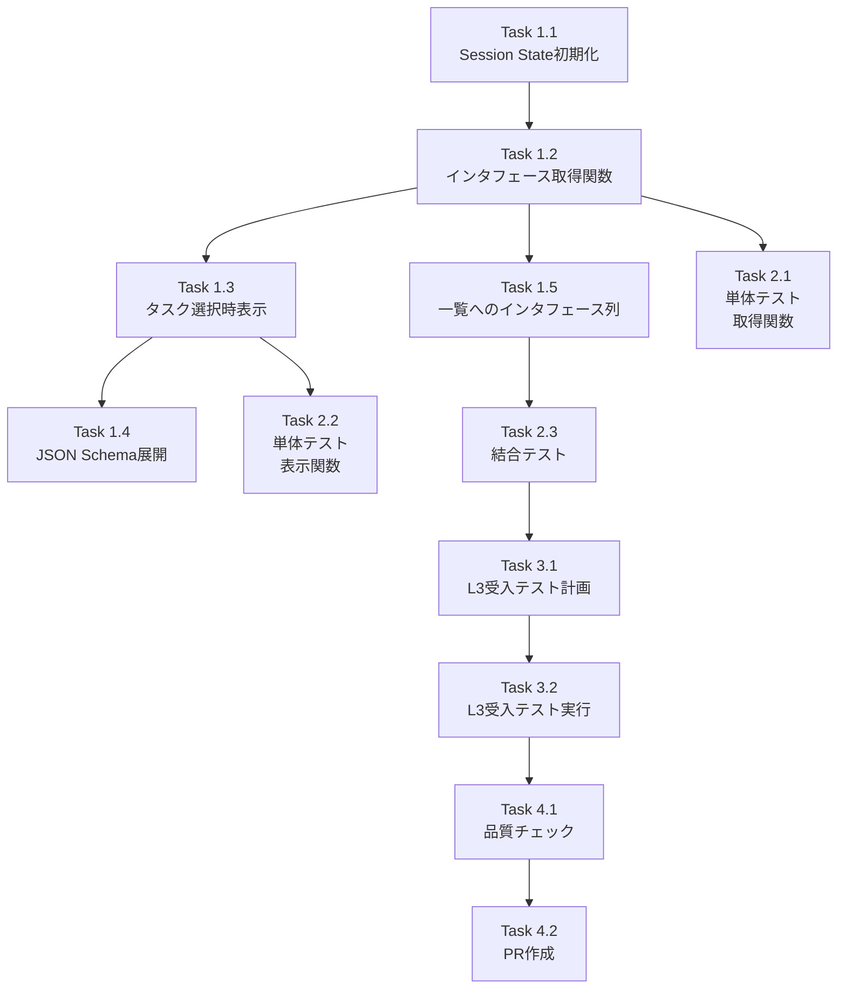

# 作業計画書: commonUI Job Configuration インタフェース表示機能

> Issue: [#277](https://github.com/kewton/MySwiftAgent/issues/277)
> 作成日: 2025-12-13
> ステータス: 計画完了

---

## 1. Issue概要の確認

```markdown
## Issue: commonUIのJob Configurationでのtaskのインタフェース確認効率化
**Issue番号**: #277
**サイズ**: M（中規模）
**作業見積**: 12時間（約1.5日）
**優先度**: Medium
**依存Issue**: なし
**ラベル**: feature
```

### 要件サマリ

- タスク選択時に入出力インタフェース名を表示
- JSON Schemaプロパティを展開表示
- ワークフロータスク一覧にインタフェース列を追加

### 対象ファイル

| ファイル | 変更内容 |
|---------|---------|
| `commonUI/pages/7_🔧_Job_Configuration.py` | インタフェース表示機能追加 |
| `commonUI/tests/unit/test_job_configuration.py` | 新規テスト追加 |

---

## 2. 詳細タスク分解

### Phase 1: 実装タスク

#### Task 1.1: Session State初期化の拡張
- **所要時間**: 0.5時間
- **成果物**: `initialize_session_state()`への追加
- **依存**: なし
- **内容**:
  ```python
  # 追加するsession state
  if "interface_cache" not in st.session_state:
      st.session_state.interface_cache = {}
  ```

#### Task 1.2: インタフェース取得関数の実装
- **所要時間**: 1時間
- **成果物**: `get_interface_info()`, `get_cached_interface()`関数
- **依存**: Task 1.1
- **内容**:
  - APIからInterfaceMaster詳細を取得
  - session_stateにキャッシュ
  - エラー時はNone返却 + ログ出力

#### Task 1.3: タスク選択時のインタフェース表示
- **所要時間**: 2時間
- **成果物**: `render_task_interface_info()`関数
- **依存**: Task 1.2
- **内容**:
  - `render_add_task_panel()`内で呼び出し
  - 入力/出力インタフェース名を表示
  - 未設定時は「未設定」と表示

#### Task 1.4: JSON Schema展開表示
- **所要時間**: 1.5時間
- **成果物**: `render_interface_schema_expander()`関数
- **依存**: Task 1.3
- **内容**:
  - `st.expander`でJSON Schema表示
  - プロパティ一覧（フィールド名、型、必須/任意）を抽出
  - コピー可能なJSONコードブロック

#### Task 1.5: ワークフロータスク一覧へのインタフェース列追加
- **所要時間**: 1.5時間
- **成果物**: `render_workflow_tasks()`の拡張
- **依存**: Task 1.2
- **内容**:
  - DataFrameに`Input Interface`列と`Output Interface`列を追加
  - 各タスクのインタフェース名を取得・表示

### Phase 2: テストタスク（TDD - CI実行可能）

#### Task 2.1: 単体テスト - インタフェース取得関数
- **所要時間**: 1.5時間
- **成果物**: `tests/unit/test_job_configuration.py`
- **カバレッジ目標**: 90%
- **テストケース**:
  - `test_get_interface_info_success`: 正常取得
  - `test_get_interface_info_not_found`: 404エラー時
  - `test_get_interface_info_api_error`: API接続エラー時
  - `test_get_cached_interface_cache_hit`: キャッシュヒット
  - `test_get_cached_interface_cache_miss`: キャッシュミス

#### Task 2.2: 単体テスト - 表示関数
- **所要時間**: 1時間
- **成果物**: `tests/unit/test_job_configuration.py`（追加）
- **テストケース**:
  - `test_render_task_interface_info_with_interfaces`: 両方設定時
  - `test_render_task_interface_info_input_only`: 入力のみ
  - `test_render_task_interface_info_output_only`: 出力のみ
  - `test_render_task_interface_info_none`: 両方未設定

#### Task 2.3: 結合テスト - API連携
- **所要時間**: 1時間
- **成果物**: `tests/integration/test_job_configuration_api.py`
- **テストケース**:
  - `test_interface_fetch_and_cache_flow`: 取得→キャッシュ→再取得フロー
  - `test_interface_display_with_mock_api`: モックAPIでの表示確認

### Phase 3: L3受入テスト（ローカル実行）

#### Task 3.1: L3受入テスト計画
- **所要時間**: 0.5時間
- **成果物**: 受入テストシナリオ

#### Task 3.2: L3受入テスト実行
- **所要時間**: 1時間
- **成果物**: `tests/acceptance/test_issue_277_acceptance.sh`

### Phase 4: ドキュメント・完了処理

#### Task 4.1: コード品質チェック
- **所要時間**: 0.5時間
- **成果物**: Ruff/MyPyエラーゼロ

#### Task 4.2: PR作成
- **所要時間**: 0.5時間
- **成果物**: Pull Request

---

## 3. タスク依存関係



---

## 4. 作業スケジュール

### Day 1 (6.5時間)

| 時間 | タスク | 成果物 |
|------|--------|--------|
| 09:00-09:30 | Task 1.1: Session State初期化 | `interface_cache`追加 |
| 09:30-10:30 | Task 1.2: インタフェース取得関数 | `get_interface_info()`, `get_cached_interface()` |
| 10:30-12:30 | Task 1.3: タスク選択時表示 | `render_task_interface_info()` |
| 13:30-15:00 | Task 1.4: JSON Schema展開 | `render_interface_schema_expander()` |
| 15:00-16:30 | Task 1.5: 一覧へのインタフェース列 | `render_workflow_tasks()`拡張 |

### Day 2 (5.5時間)

| 時間 | タスク | 成果物 |
|------|--------|--------|
| 09:00-10:30 | Task 2.1: 単体テスト（取得関数） | 5テストケース |
| 10:30-11:30 | Task 2.2: 単体テスト（表示関数） | 4テストケース |
| 11:30-12:30 | Task 2.3: 結合テスト | 2テストケース |
| 13:30-14:00 | Task 3.1: L3受入テスト計画 | シナリオ作成 |
| 14:00-15:00 | Task 3.2: L3受入テスト実行 | 受入テストスクリプト |
| 15:00-15:30 | Task 4.1: 品質チェック | Ruff/MyPyパス |
| 15:30-16:00 | Task 4.2: PR作成 | Pull Request |

**総作業時間**: 12時間（約1.5日）

---

## 5. チェックポイント

| タイミング | 確認事項 | 判定基準 |
|-----------|---------|---------|
| Task 1.3完了時 | タスク選択でインタフェース名表示 | UI上で入出力名が見える |
| Task 1.5完了時 | 一覧表示にインタフェース列 | DataFrameに列追加済み |
| Phase 2完了時 | テストカバレッジ90%達成 | `pytest --cov`で確認 |
| Task 3.2完了時 | L3受入テストパス | 全curlコマンド成功 |
| PR作成前 | CI/CDパス | GitHub Actionsグリーン |

---

## 6. リスクと対策

| リスク | 発生確率 | 影響 | 対策 |
|-------|---------|------|------|
| JobQueue API応答遅延 | 低 | タイムアウト | HTTPClientのタイムアウト設定（30秒）で対応 |
| InterfaceMaster削除済み | 中 | 404エラー | `st.warning`で非致命的表示、処理継続 |
| Streamlit再描画でキャッシュクリア | 低 | 再取得発生 | session_stateキャッシュで対応 |
| テストカバレッジ未達 | 中 | CI失敗 | Phase 2で追加テスト実装 |

---

## 7. 成果物チェックリスト

### コード

- [ ] `commonUI/pages/7_🔧_Job_Configuration.py`
  - [ ] `initialize_session_state()` - interface_cache追加
  - [ ] `get_interface_info()` - 新規関数
  - [ ] `get_cached_interface()` - 新規関数
  - [ ] `render_task_interface_info()` - 新規関数
  - [ ] `render_interface_schema_expander()` - 新規関数
  - [ ] `render_add_task_panel()` - インタフェース表示呼び出し追加
  - [ ] `render_workflow_tasks()` - インタフェース列追加

### テスト

- [ ] `commonUI/tests/unit/test_job_configuration.py`
  - [ ] `test_get_interface_info_success`
  - [ ] `test_get_interface_info_not_found`
  - [ ] `test_get_interface_info_api_error`
  - [ ] `test_get_cached_interface_cache_hit`
  - [ ] `test_get_cached_interface_cache_miss`
  - [ ] `test_render_task_interface_info_with_interfaces`
  - [ ] `test_render_task_interface_info_input_only`
  - [ ] `test_render_task_interface_info_output_only`
  - [ ] `test_render_task_interface_info_none`

- [ ] `commonUI/tests/integration/test_job_configuration_api.py`
  - [ ] `test_interface_fetch_and_cache_flow`
  - [ ] `test_interface_display_with_mock_api`

### 受入テスト

- [ ] `tests/acceptance/test_issue_277_acceptance.sh`

---

## 8. L3受入テスト計画（具体的なコマンド）

### Step 1: サービス起動確認

```bash
# サービス起動
make dev-platform  # jobqueue含むPlatform層起動
cd commonUI && uv run streamlit run Home.py --server.port 8501 &

# ヘルスチェック
curl -sf http://localhost:8101/health && echo "✅ JobQueue: healthy"
curl -sf http://localhost:8501/_stcore/health && echo "✅ CommonUI: healthy"
```

### Step 2: テストデータ準備

```bash
# InterfaceMaster作成（入力用）
curl -s -X POST http://localhost:8101/api/v1/interface-masters \
  -H "Content-Type: application/json" \
  -H "X-API-Token: your_token" \
  -d '{
    "name": "TestInputInterface",
    "description": "Test input interface for Issue #277",
    "input_schema": {
      "$schema": "http://json-schema.org/draft-07/schema#",
      "type": "object",
      "properties": {
        "company_name": {"type": "string", "description": "Company name"},
        "country": {"type": "string", "description": "Country code"}
      },
      "required": ["company_name"]
    }
  }' | tee /tmp/input_interface.json

INPUT_IF_ID=$(jq -r '.id' /tmp/input_interface.json)
echo "Created Input Interface: $INPUT_IF_ID"

# InterfaceMaster作成（出力用）
curl -s -X POST http://localhost:8101/api/v1/interface-masters \
  -H "Content-Type: application/json" \
  -H "X-API-Token: your_token" \
  -d '{
    "name": "TestOutputInterface",
    "description": "Test output interface for Issue #277",
    "output_schema": {
      "$schema": "http://json-schema.org/draft-07/schema#",
      "type": "object",
      "properties": {
        "result": {"type": "string"},
        "status": {"type": "string"}
      }
    }
  }' | tee /tmp/output_interface.json

OUTPUT_IF_ID=$(jq -r '.id' /tmp/output_interface.json)
echo "Created Output Interface: $OUTPUT_IF_ID"

# TaskMaster作成（インタフェース付き）
curl -s -X POST http://localhost:8101/api/v1/task-masters \
  -H "Content-Type: application/json" \
  -H "X-API-Token: your_token" \
  -d "{
    \"name\": \"TestTaskWithInterface\",
    \"description\": \"Test task for Issue #277 acceptance test\",
    \"url\": \"http://localhost:8104/v1/test\",
    \"method\": \"POST\",
    \"input_interface_id\": \"$INPUT_IF_ID\",
    \"output_interface_id\": \"$OUTPUT_IF_ID\"
  }" | tee /tmp/task_master.json

TASK_ID=$(jq -r '.id' /tmp/task_master.json)
echo "Created TaskMaster: $TASK_ID"

# TaskMaster作成（インタフェースなし）
curl -s -X POST http://localhost:8101/api/v1/task-masters \
  -H "Content-Type: application/json" \
  -H "X-API-Token: your_token" \
  -d '{
    "name": "TestTaskNoInterface",
    "description": "Test task without interface",
    "url": "http://localhost:8104/v1/test",
    "method": "GET"
  }' | tee /tmp/task_master_no_if.json
```

### Step 3: API動作確認

```bash
# InterfaceMaster取得確認
curl -s http://localhost:8101/api/v1/interface-masters/$INPUT_IF_ID \
  -H "X-API-Token: your_token" | jq .

# 期待するレスポンス:
# {
#   "id": "if_xxx",
#   "name": "TestInputInterface",
#   "input_schema": {...}
# }

# TaskMaster取得確認（インタフェースID含む）
curl -s http://localhost:8101/api/v1/task-masters/$TASK_ID \
  -H "X-API-Token: your_token" | jq '.input_interface_id, .output_interface_id'

# 期待するレスポンス:
# "if_xxx"
# "if_yyy"
```

### Step 4: UI動作確認（手動）

1. ブラウザで `http://localhost:8501` を開く
2. サイドバーで「Job Configuration」を選択
3. JobMasterを選択（または新規作成）
4. 「Add Task to Workflow」パネルで `TestTaskWithInterface` を選択
5. **確認項目**:
   - [ ] 入力インタフェース名「TestInputInterface」が表示される
   - [ ] 出力インタフェース名「TestOutputInterface」が表示される
   - [ ] 「View Input Schema」エキスパンダーをクリックでJSON Schema表示
   - [ ] プロパティ一覧（company_name: string, required）が表示される

6. `TestTaskNoInterface` を選択
7. **確認項目**:
   - [ ] 入力インタフェース「未設定」と表示される
   - [ ] 出力インタフェース「未設定」と表示される

### Step 5: エビデンス収集

```bash
# Streamlitログ確認
tail -50 ~/.streamlit/logs/*.log | grep -E "(ERROR|WARNING)"

# スクリーンショット取得（手動）
# - タスク選択時のインタフェース表示画面
# - JSON Schema展開表示画面
# - ワークフロータスク一覧（インタフェース列付き）
```

### Step 6: クリーンアップ

```bash
# テストデータ削除
curl -s -X DELETE http://localhost:8101/api/v1/task-masters/$TASK_ID \
  -H "X-API-Token: your_token"
curl -s -X DELETE http://localhost:8101/api/v1/interface-masters/$INPUT_IF_ID \
  -H "X-API-Token: your_token"
curl -s -X DELETE http://localhost:8101/api/v1/interface-masters/$OUTPUT_IF_ID \
  -H "X-API-Token: your_token"

echo "✅ Test data cleaned up"
```

---

## 9. Definition of Done

Issue完了条件：

- [ ] すべてのタスク（Task 1.1〜4.2）が完了
- [ ] 単体テストカバレッジ90%以上
- [ ] 結合テスト全シナリオパス
- [ ] **L3受入テスト全パス**（実際のサービス起動・API呼び出し確認）
- [ ] CI/CDグリーン（`./scripts/pre-push-check-all.sh`パス）
- [ ] コードレビュー承認
- [ ] Ruff/MyPyエラーゼロ

---

## 10. 次のアクション

作業計画承認後：

1. **ブランチ作成**: `feature/issue/277`
2. **worktree作成**（オプション）: `./scripts/worktree-create-from-issue.sh 277`
3. **タスク実行**: Phase 1から順次実装
4. **進捗報告**: `/progress-report 277`で定期報告
5. **PR作成**: `/pm-create-pr 277`でPull Request作成

---

## 参照ドキュメント

- [requirements.md](./requirements.md) - 要件定義書
- [design-policy.md](./design-policy.md) - 設計方針書
- [architecture-review.md](./architecture-review.md) - アーキテクチャレビュー
