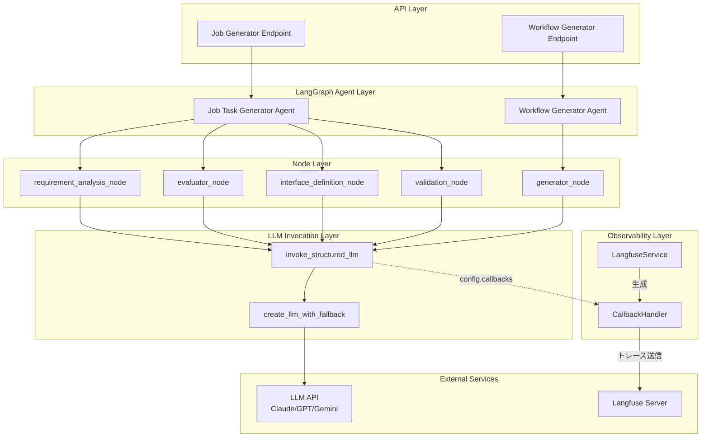
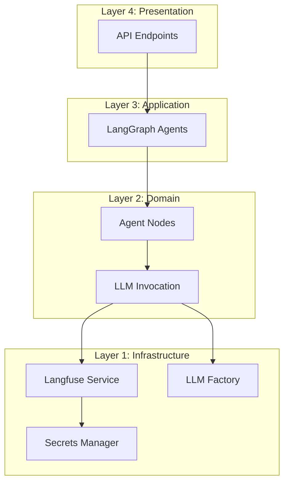
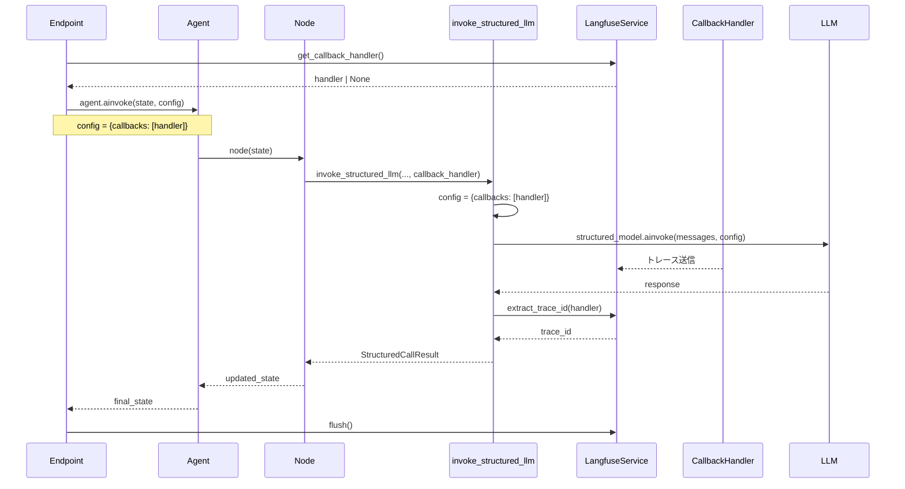
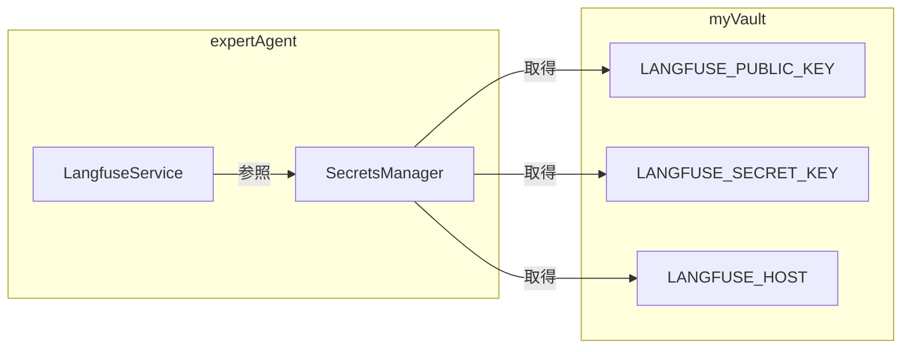

# 設計方針書: Job/Workflow GeneratorへのLangfuseトレース統合

> Issue: [#278](https://github.com/kewton/MySwiftAgent/issues/278)
> 作成日: 2025-12-13
> ステータス: 設計完了

---

## 現状調査サマリ

### 対象プロジェクト

| 項目 | 内容 |
|------|------|
| **プロジェクト名** | expertAgent |
| **技術スタック** | FastAPI + LangGraph + LangChain |
| **対象モジュール** | `jobTaskGeneratorAgents/`, `workflowGeneratorAgents/` |

### 既存アーキテクチャパターン

| パターン | 使用箇所 | 目的 |
|---------|---------|------|
| **Singleton** | `LangfuseService` | アプリケーション全体で1クライアント共有 |
| **Callback Pattern** | `RunnableConfig(callbacks=[handler])` | LLM呼び出し時のトレース注入 |
| **Factory Pattern** | `create_llm_with_fallback()` | LLMインスタンス生成・フォールバック |
| **Structured Output** | `model.with_structured_output()` | Pydanticモデルによる応答構造化 |
| **Dataclass** | `StructuredCallResult` | LLM呼び出し結果の型安全な返却 |

### Langfuse統合の現状

| コンポーネント | 統合状況 | 詳細 |
|---------------|---------|------|
| **LangfuseService** | ✅ 実装済み | `langfuse_service.py` - シングルトン、CallbackHandler生成 |
| **Chat Endpoints** | ✅ 実装済み | `llm_service.py` - CallbackHandler使用中 |
| **Expert AI Agent Service** | ✅ 実装済み | `ai_agent_service.py` - config渡し |
| **Job Task Generator** | ❌ 未実装 | `llm_invocation.py` - CallbackHandler未使用 |
| **Workflow Generator** | ❌ 未実装 | `generator.py` - CallbackHandler未使用 |

### 参照したドキュメント

| ドキュメント | 関連内容 |
|-------------|---------|
| `expertAgent/docs/API_REFERENCE.md` | Job Generator / Workflow Generator API仕様 |
| `docs/arch/service-dependencies.md` | サービス間依存関係・レイヤ構成 |
| `docs/design/langfuse-integration.md` | Langfuse統合ガイド |
| [Langfuse LangChain Integration](https://langfuse.com/docs/integrations/langchain/tracing) | CallbackHandler使用方法 |

### 設計上の制約

1. **Langfuse無効時の動作保証**: APIキー未設定時でも正常動作必須
2. **非同期処理**: すべてのLLM呼び出しは`ainvoke()`による非同期
3. **構造化出力**: `with_structured_output()`ラッパーを通じたCallback伝播必要
4. **後方互換性**: 既存の呼び出し元に影響を与えない

---

## アーキテクチャ設計

### システム構成図



### レイヤー構成



### データフロー



---

## 技術選定

### 採用技術

| カテゴリ | 選定技術 | 選定理由 | 既存との整合性 |
|---------|---------|---------|---------------|
| **Observability** | Langfuse CallbackHandler | LangChain公式統合 | ✅ LangfuseService既存 |
| **Config渡し** | dict形式 (`{"callbacks": [...]}`) | LangGraph互換性 | ✅ ai_agent_service.pyで使用中 |
| **trace_id抽出** | `LangfuseService.extract_trace_id()` | 既存メソッド活用 | ✅ 実装済み |
| **フォールバック** | Optional[CallbackHandler] | Langfuse無効時対応 | ✅ パターン確立済み |

### 不採用技術

| 技術 | 不採用理由 |
|------|----------|
| **RunnableConfig** | LangGraph agent.ainvoke()ではdict形式が標準 |
| **グローバルHandler** | ノード単位のトレース粒度が必要 |
| **Decorator Pattern** | 既存invoke_structured_llmの拡張で十分 |

---

## 設計パターン

### パターン1: Callback Injection Pattern（採用）

```python
# 呼び出し側（Node）
async def requirement_analysis_node(state: JobTaskGeneratorState) -> JobTaskGeneratorState:
    # Handler取得（Langfuse無効時はNone）
    handler = langfuse_service.get_callback_handler(
        trace_name="job_task_generation",
        session_id=state.get("job_id"),
        tags=["requirement_analysis"]
    )

    call_result = await invoke_structured_llm(
        messages=messages,
        response_model=TaskBreakdownResponse,
        context_label="task_breakdown",
        model_env_var="JOB_GENERATOR_ANALYSIS_MODEL",
        default_model="claude-haiku-4-5",
        callback_handler=handler,  # 新規パラメータ
    )

    trace_id = call_result.trace_id  # 結果から取得
    return {...state, "trace_id": trace_id}
```

**選定理由**:
- 既存の`llm_service.py`で確立されたパターン
- ノード単位でのトレース粒度制御が可能
- Optional引数で後方互換性確保

### パターン2: Result Enrichment Pattern（採用）

```python
@dataclass(slots=True)
class StructuredCallResult(Generic[TModel]):
    """Result returned by invoke_structured_llm."""
    result: TModel
    recovered_via_json: bool
    raw_text: str | None
    model_name: str
    trace_id: str | None = None  # 新規追加
```

**選定理由**:
- 既存のDataclassパターンを踏襲
- Optional fieldで後方互換性確保
- trace_idを一元管理

### パターン3: Fail-Open Pattern（継続採用）

```python
async def invoke_structured_llm(
    *,
    callback_handler: CallbackHandler | None = None,
    ...
) -> StructuredCallResult[TModel]:
    # Langfuse無効時も正常動作
    config: dict[str, Any] = {}
    if callback_handler:
        config["callbacks"] = [callback_handler]

    # configがあれば渡す、なければ渡さない
    response = await structured_model.ainvoke(
        messages,
        config=config if config else None
    )
```

**選定理由**:
- Langfuse障害時もメイン機能継続
- APIキー未設定環境での動作保証

---

## データモデル設計

### StructuredCallResult の拡張

```python
@dataclass(slots=True)
class StructuredCallResult(Generic[TModel]):
    """Result returned by invoke_structured_llm.

    Attributes:
        result: 構造化されたLLMレスポンス
        recovered_via_json: JSONフォールバックで復元したか
        raw_text: 生のLLMレスポンステキスト
        model_name: 使用したモデル名
        trace_id: Langfuse trace ID（Langfuse無効時はNone）
    """
    result: TModel
    recovered_via_json: bool
    raw_text: str | None
    model_name: str
    trace_id: str | None = None  # Issue #278で追加
```

### APIレスポンススキーマの拡張

#### JobGeneratorResponse

```python
class JobGeneratorResponse(BaseModel):
    # 既存フィールド...
    status: str
    job_id: str | None
    job_master_id: str | None
    # ...

    # Issue #278で追加
    langfuse_trace_id: str | None = Field(
        default=None,
        description="Langfuse trace ID for observability (null if Langfuse disabled)",
        examples=["550e8400-e29b-41d4-a716-446655440000"],
    )
```

#### WorkflowGeneratorResponse

```python
class WorkflowGeneratorResponse(BaseModel):
    # 既存フィールド...
    status: str
    workflows: list[WorkflowResult]
    # ...

    # Issue #278で追加
    langfuse_trace_id: str | None = Field(
        default=None,
        description="Langfuse trace ID for observability (null if Langfuse disabled)",
        examples=["550e8400-e29b-41d4-a716-446655440000"],
    )
```

---

## API設計

### invoke_structured_llm 関数シグネチャ

```python
async def invoke_structured_llm(
    *,
    messages: list[dict[str, str]],
    response_model: type[TModel],
    context_label: str,
    model_env_var: str,
    default_model: str,
    callback_handler: CallbackHandler | None = None,  # 新規追加
    validator: Callable[[TModel], TModel] | None = None,
    max_tokens_env_var: str = "JOB_GENERATOR_MAX_TOKENS",
    default_max_tokens: int = 8192,
) -> StructuredCallResult[TModel]:
```

### エンドポイントからのtrace_id返却フロー

```python
# job_generator_endpoints.py
async def generate_job(request: JobGeneratorRequest) -> JobGeneratorResponse:
    # Handler取得
    handler = langfuse_service.get_callback_handler(
        trace_name="job_generation",
        session_id=job_id,
    )

    try:
        # Agent実行（config経由でhandler伝播）
        final_state = await agent.ainvoke(
            initial_state,
            config={"callbacks": [handler]} if handler else {}
        )

        # trace_id抽出
        trace_id = langfuse_service.extract_trace_id(handler)

        return JobGeneratorResponse(
            status="success",
            job_id=final_state["job_id"],
            langfuse_trace_id=trace_id,  # 新規
            ...
        )
    finally:
        langfuse_service.flush()  # トレースバッファ送信
```

---

## セキュリティ設計

### APIキー管理



**セキュリティ対策**:

| 脅威 | 対策 |
|------|------|
| APIキー漏洩 | myVault経由で取得、環境変数フォールバック |
| trace_id推測 | UUID形式（128bit）で推測困難 |
| LLM入出力漏洩 | Self-hosted Langfuse推奨、ドキュメントで明示 |

### Langfuse無効時の安全動作

```python
def get_callback_handler(...) -> CallbackHandler | None:
    # Langfuse無効時はNone返却（例外なし）
    if not self._is_enabled() or self._client is None:
        return None

    try:
        return CallbackHandler(public_key=public_key)
    except Exception as e:
        logger.warning(f"Failed to create CallbackHandler: {e}")
        return None  # 失敗時もNone（Fail-Open）
```

---

## パフォーマンス設計

### オーバーヘッド評価

| 処理 | 想定オーバーヘッド | 許容範囲 |
|------|------------------|---------|
| CallbackHandler生成 | < 5ms | ✅ |
| config構築 | < 1ms | ✅ |
| trace_id抽出 | < 1ms | ✅ |
| トレース送信（非同期） | 0ms（ブロックなし） | ✅ |
| **合計** | **< 10ms** | **< 50ms** ✅ |

### 非同期トレース送信

```python
# flush()は非同期でバッファを送信
# ユーザーレスポンスをブロックしない
async def generate_job(...):
    try:
        response = await process_job()
        return response
    finally:
        # レスポンス返却後に非同期送信
        langfuse_service.flush()
```

### キャッシュ戦略

| 対象 | 戦略 | 理由 |
|------|------|------|
| Langfuseクライアント | シングルトン | 接続オーバーヘッド削減 |
| CallbackHandler | リクエストごと生成 | trace_idの一意性確保 |

---

## 設計判断とトレードオフ

### DJ-1: callback_handler vs config 引数

| 選択肢 | メリット | デメリット |
|--------|---------|----------|
| **A: callback_handler引数（採用）** | 明確な責務、型安全 | invoke_structured_llm改修必要 |
| B: config引数 | 汎用的 | 型情報欠落、誤用リスク |

**決定**: **Option A採用** - 明示的なCallbackHandler引数で型安全性と可読性を確保

### DJ-2: trace_id取得タイミング

| 選択肢 | メリット | デメリット |
|--------|---------|----------|
| A: 各ノードで抽出 | 細粒度制御 | 複数trace_id管理複雑 |
| **B: 最終結果で抽出（採用）** | シンプル | フォールバック時の挙動要確認 |

**決定**: **Option B採用** - invoke_structured_llm内で抽出し、StructuredCallResultに含める

### DJ-3: Agent-level vs Node-level Handler

| 選択肢 | メリット | デメリット |
|--------|---------|----------|
| **A: Agent-level（採用）** | 1 trace/1 Job生成 | ノード間の詳細分離困難 |
| B: Node-level | 詳細トレース | trace_id管理複雑 |

**決定**: **Option A採用** - Job/Workflow生成ごとに1つのtraceで管理（Langfuseのspan機能で詳細分離）

### DJ-4: Endpoint vs Node でのHandler生成

| 選択肢 | メリット | デメリット |
|--------|---------|----------|
| **A: Endpoint生成（採用）** | 一元管理、flush()制御容易 | 各Nodeでの追加タグ設定困難 |
| B: Node生成 | 柔軟なタグ付け | Handler管理分散 |

**決定**: **Option A採用** - Endpointでhandler生成し、agent.ainvoke()のconfig経由で伝播

---

## 変更対象ファイル一覧

### 必須変更

| ファイル | 変更内容 | 影響度 |
|---------|---------|--------|
| `utils/llm_invocation.py` | callback_handler引数追加、trace_id抽出 | 中 |
| `utils/llm_invocation.py` | StructuredCallResult.trace_id追加 | 低 |
| `app/schemas/job_generator.py` | langfuse_trace_id追加 | 低 |
| `app/schemas/workflow_generator.py` | langfuse_trace_id追加 | 低 |
| `app/api/v1/job_generator_endpoints.py` | handler取得・trace_id返却 | 中 |
| `app/api/v1/workflow_generator_endpoints.py` | handler取得・trace_id返却 | 中 |

### 推奨変更（Nice to Have）

| ファイル | 変更内容 | 影響度 |
|---------|---------|--------|
| `nodes/requirement_analysis.py` | node別タグ付け | 低 |
| `nodes/evaluator.py` | node別タグ付け | 低 |
| `nodes/interface_definition.py` | node別タグ付け | 低 |
| `nodes/validation.py` | node別タグ付け | 低 |
| `nodes/generator.py` (workflow) | node別タグ付け | 低 |

---

## 実装フェーズ

### Phase 1: Core Implementation

```
- invoke_structured_llm にcallback_handler引数追加
- StructuredCallResult にtrace_id追加
- 単体テスト追加
```

### Phase 2: Job Generator Integration

```
- JobGeneratorResponse にlangfuse_trace_id追加
- job_generator_endpoints.py でhandler取得・返却
- 結合テスト追加
```

### Phase 3: Workflow Generator Integration

```
- WorkflowGeneratorResponse にlangfuse_trace_id追加
- workflow_generator_endpoints.py でhandler取得・返却
- 結合テスト追加
```

### Phase 4: Documentation & Testing

```
- API_REFERENCE.md 更新
- Langfuse無効時のE2Eテスト
- 受入テスト実行
```

---

## リスク評価

| リスク | 影響度 | 発生確率 | 対策 |
|--------|--------|---------|------|
| with_structured_output()でconfig非対応 | 高 | 低 | 事前検証、LangChainドキュメント確認 |
| trace_id抽出タイミング不整合 | 中 | 中 | JSON fallback時もhandler.last_trace_idで取得 |
| 既存テスト破損 | 中 | 低 | Optional引数で後方互換性確保 |
| Langfuse SDK更新で互換性問題 | 低 | 低 | バージョン固定、E2Eテスト |

---

## 参照ドキュメント

- [expertAgent API Reference](../../../expertAgent/docs/API_REFERENCE.md)
- [Service Dependencies](../../../docs/arch/service-dependencies.md)
- [Langfuse Integration Guide](../../../docs/design/langfuse-integration.md)
- [Langfuse LangChain Integration](https://langfuse.com/docs/integrations/langchain/tracing)
- [Issue #278 Requirements](./requirements.md)
- [Issue #194 Design Documents](../issue/194/)
- [Issue #263 CallbackHandler Fix](https://github.com/kewton/MySwiftAgent/issues/263)
