# E-R図: myAgentDesk データベース設計 (Issue #279)

## 概要

myAgentDeskが固有に管理すべきデータのE-R図を定義します。

### 設計方針

| 方針 | 説明 |
|------|------|
| **Single Source of Truth** | 外部サービスのデータは参照ID（FK的）のみ保持し、実データは取得時に外部APIから取得 |
| **ローカルキャッシュ** | UX向上のため、頻繁に参照するデータ（Project名、Workbench名）はローカルにキャッシュ |
| **バージョン管理** | RequirementとJobVersionは履歴を保持し、改善ループを追跡可能に |
| **外部ID参照** | JobQueue、MyScheduler、Langfuseとの連携はIDベースで疎結合化 |

### データ管理の境界

```
┌─────────────────────────────────────────────────────────────────────┐
│                      myAgentDesk 管理データ                          │
│  ┌───────────┐  ┌───────────┐  ┌─────────────────┐  ┌───────────┐  │
│  │ Project   │  │ Workbench │  │RequirementVersion│ │ JobVersion │  │
│  │ (cache)   │  │           │  │                 │  │           │  │
│  └───────────┘  └───────────┘  └─────────────────┘  └───────────┘  │
│  ┌───────────┐  ┌───────────┐  ┌─────────────────┐                 │
│  │ Run       │  │ Schedule  │  │ UserPreference  │                 │
│  │ (ref)     │  │ (ref)     │  │                 │                 │
│  └───────────┘  └───────────┘  └─────────────────┘                 │
└─────────────────────────────────────────────────────────────────────┘
                              ↕ 参照ID
┌─────────────────────────────────────────────────────────────────────┐
│                      外部サービス管理データ                          │
│  myVault: Project設定（APIキー/モデル名等）                          │
│  JobQueue: JobMaster/TaskMaster/Job実行/Task実行                    │
│  MyScheduler: Schedule実行管理                                       │
│  Langfuse: Trace/Span（LLM observability）                          │
│  ExpertAgent: Job生成結果（JobVersion内容の元データ）                │
└─────────────────────────────────────────────────────────────────────┘
```

---

## E-R図（Mermaid形式）

### 全体図

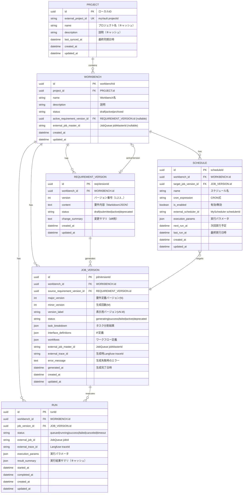

---

## エンティティ詳細

### 1. PROJECT（プロジェクト）

**役割**: myVaultのプロジェクト情報のローカルキャッシュ

| カラム | 型 | 制約 | 説明 |
|--------|-----|------|------|
| id | UUID | PK | ローカル管理用ID |
| external_project_id | VARCHAR(64) | UK, NOT NULL | myVaultのprojectId |
| name | VARCHAR(255) | NOT NULL | プロジェクト名（キャッシュ） |
| description | TEXT | | 説明（キャッシュ） |
| last_synced_at | TIMESTAMP | | myVaultとの最終同期日時 |
| created_at | TIMESTAMP | NOT NULL | 作成日時 |
| updated_at | TIMESTAMP | NOT NULL | 更新日時 |

**備考**:
- プロジェクトの実体（APIキー/モデル設定等）はmyVaultが管理
- このテーブルは参照頻度の高いメタデータのみキャッシュ
- `last_synced_at`でキャッシュの鮮度を管理

---

### 2. WORKBENCH（ワークベンチ）

**役割**: 改善ループの中心となるワークスペース。Job 1:1対応

| カラム | 型 | 制約 | 説明 |
|--------|-----|------|------|
| id | UUID | PK | workbenchId |
| project_id | UUID | FK(PROJECT.id), NOT NULL | 所属プロジェクト |
| name | VARCHAR(255) | NOT NULL | Workbench名 |
| description | TEXT | | 説明 |
| status | VARCHAR(20) | NOT NULL | draft/active/archived |
| active_requirement_version_id | UUID | FK(REQUIREMENT_VERSION.id) | 現在のアクティブ要件Version |
| external_job_master_id | VARCHAR(64) | | JobQueueのjobMasterId（生成後に設定） |
| created_at | TIMESTAMP | NOT NULL | 作成日時 |
| updated_at | TIMESTAMP | NOT NULL | 更新日時 |

**インデックス**:
- `idx_workbench_project` (project_id)
- `idx_workbench_status` (status)

**備考**:
- Workbench作成時にはjobMasterIdは未設定（null）
- Job生成エージェント実行後にexternal_job_master_idが設定される
- statusは: draft（作成直後）→ active（運用中）→ archived（非表示）

---

### 3. REQUIREMENT_VERSION（要件バージョン）

**役割**: 要件の履歴管理、diff表示、改善追跡

| カラム | 型 | 制約 | 説明 |
|--------|-----|------|------|
| id | UUID | PK | reqVersionId |
| workbench_id | UUID | FK(WORKBENCH.id), NOT NULL | 所属Workbench |
| version | INT | NOT NULL | バージョン番号（1, 2, 3...） |
| content | TEXT | NOT NULL | 要件内容（Markdown/JSON） |
| status | VARCHAR(20) | NOT NULL | draft/submitted/active/deprecated |
| change_summary | TEXT | | 変更サマリ（前バージョンとの差分説明） |
| created_at | TIMESTAMP | NOT NULL | 作成日時 |
| updated_at | TIMESTAMP | NOT NULL | 更新日時 |

**ユニーク制約**:
- `uq_req_version` (workbench_id, version)

**インデックス**:
- `idx_req_version_workbench` (workbench_id)
- `idx_req_version_status` (status)

**備考**:
- statusは: draft（編集中）→ submitted（生成待ち）→ active（現在使用中）→ deprecated（旧バージョン）
- contentフォーマットはMarkdownまたはJSON（構造化要件）
- change_summaryはユーザーまたはAIが入力（Improveフロー用）

---

### 4. JOB_VERSION（ジョブバージョン）

**役割**: ExpertAgentの生成結果を格納、実行対象として使用

| カラム | 型 | 制約 | 説明 |
|--------|-----|------|------|
| id | UUID | PK | jobVersionId |
| workbench_id | UUID | FK(WORKBENCH.id), NOT NULL | 所属Workbench |
| source_requirement_version_id | UUID | FK(REQUIREMENT_VERSION.id), NOT NULL | 生成元の要件Version |
| major_version | INT | NOT NULL | 要件定義バージョン（N）= RequirementVersion.version |
| minor_version | INT | NOT NULL | 生成回数（M）= 同一要件からの生成回数 |
| version_label | VARCHAR(20) | NOT NULL | 表示用バージョン（"v1.1", "v2.3"等） |
| status | VARCHAR(20) | NOT NULL | generating/success/failed/active/deprecated |
| task_breakdown | JSONB | | タスク分割結果 |
| interface_definitions | JSONB | | インターフェース定義 |
| workflows | JSONB | | ワークフロー定義（GraphAI YAML参照） |
| external_job_master_id | VARCHAR(64) | | JobQueueのjobMasterId |
| external_trace_id | VARCHAR(64) | | 生成時のLangfuse traceId |
| error_message | TEXT | | 生成失敗時のエラーメッセージ |
| generated_at | TIMESTAMP | | 生成完了日時 |
| created_at | TIMESTAMP | NOT NULL | 作成日時 |
| updated_at | TIMESTAMP | NOT NULL | 更新日時 |

**ユニーク制約**:
- `uq_job_version` (workbench_id, major_version, minor_version)

**インデックス**:
- `idx_job_version_workbench` (workbench_id)
- `idx_job_version_status` (status)
- `idx_job_version_source_req` (source_requirement_version_id)

**バージョン管理体系 (vN.M)**:

| 要素 | カラム | 説明 |
|------|--------|------|
| **N** | major_version | 要件定義バージョン（RequirementVersion.versionと同値） |
| **M** | minor_version | 同一要件からのJob生成回数（1, 2, 3...） |

```
例:
- v1.1: 要件v1から最初のJob生成
- v1.2: 要件v1から2回目のJob生成
- v2.1: 要件v2から最初のJob生成
- v2.3: 要件v2から3回目のJob生成
```

**再生成が必要になる理由**:

同一の要件定義（N）から複数回Job生成（M）を行う理由：

| 理由 | 説明 |
|------|------|
| **LLMの進化** | モデルバージョンアップによる出力品質の変化 |
| **定義ファイルの変更** | Agent定義、IF定義、ワークフローテンプレートの更新 |
| **LLMの非決定性** | 同一入力でも微妙に異なる出力が生成される |
| **プロンプト調整** | システムプロンプトやFew-shot例の改善 |

**備考**:
- `task_breakdown`, `interface_definitions`, `workflows`はExpertAgent APIレスポンスのキャッシュ
- statusは: generating（生成中）→ success/failed → active（実行対象）→ deprecated
- `source_requirement_version_id`により改善ループのトレーサビリティを確保
- `version_label`は`major_version`と`minor_version`から自動生成（"v" + major + "." + minor）

---

### 5. RUN（実行履歴）

**役割**: JobQueue実行のローカル参照、Langfuseトレースへのリンク

| カラム | 型 | 制約 | 説明 |
|--------|-----|------|------|
| id | UUID | PK | runId |
| workbench_id | UUID | FK(WORKBENCH.id), NOT NULL | 所属Workbench |
| job_version_id | UUID | FK(JOB_VERSION.id), NOT NULL | 実行対象のJobVersion |
| status | VARCHAR(20) | NOT NULL | queued/running/success/failed/canceled/timeout |
| external_job_id | VARCHAR(64) | | JobQueueのjobId |
| external_trace_id | VARCHAR(64) | | LangfuseのtraceId |
| execution_params | JSONB | | 実行時パラメータ |
| result_summary | JSONB | | 実行結果サマリ（キャッシュ） |
| started_at | TIMESTAMP | | 実行開始日時 |
| completed_at | TIMESTAMP | | 実行完了日時 |
| created_at | TIMESTAMP | NOT NULL | 作成日時 |
| updated_at | TIMESTAMP | NOT NULL | 更新日時 |

**インデックス**:
- `idx_run_workbench` (workbench_id)
- `idx_run_job_version` (job_version_id)
- `idx_run_status` (status)
- `idx_run_created` (created_at DESC)

**備考**:
- 実行の実体はJobQueueが管理（`external_job_id`で参照）
- ステータスはポーリングでJobQueue APIから取得し、ローカルに反映
- `external_trace_id`でLangfuseダッシュボードへのリンクを提供

---

### 6. SCHEDULE（スケジュール）

**役割**: MySchedulerへの登録情報のローカル参照

| カラム | 型 | 制約 | 説明 |
|--------|-----|------|------|
| id | UUID | PK | scheduleId |
| workbench_id | UUID | FK(WORKBENCH.id), NOT NULL | 所属Workbench |
| target_job_version_id | UUID | FK(JOB_VERSION.id), NOT NULL | 実行対象のJobVersion |
| name | VARCHAR(255) | NOT NULL | スケジュール名 |
| cron_expression | VARCHAR(100) | NOT NULL | CRON式 |
| is_enabled | BOOLEAN | NOT NULL, DEFAULT true | 有効/無効フラグ |
| external_scheduler_id | VARCHAR(64) | | MySchedulerのschedulerId |
| execution_params | JSONB | | 実行時パラメータ |
| next_run_at | TIMESTAMP | | 次回実行予定日時 |
| last_run_at | TIMESTAMP | | 最終実行日時 |
| created_at | TIMESTAMP | NOT NULL | 作成日時 |
| updated_at | TIMESTAMP | NOT NULL | 更新日時 |

**インデックス**:
- `idx_schedule_workbench` (workbench_id)
- `idx_schedule_enabled` (is_enabled)
- `idx_schedule_next_run` (next_run_at)

**備考**:
- スケジュールの実体はMySchedulerが管理
- `is_enabled`の切り替えはMyScheduler APIを呼び出して同期
- `next_run_at`, `last_run_at`はMyScheduler APIから取得してキャッシュ

---

## リレーションシップ詳細

### 1:N リレーションシップ

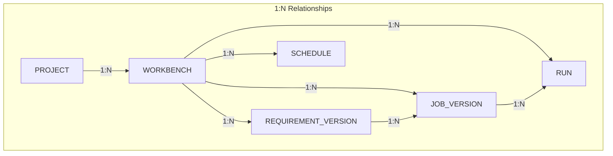

### 特殊リレーションシップ

| リレーション | 型 | 説明 |
|------------|-----|------|
| WORKBENCH → REQUIREMENT_VERSION | 0:1 | activeVersion（現在アクティブな要件Version） |
| SCHEDULE → JOB_VERSION | N:1 | 実行対象（どのJobVersionを定期実行するか） |
| REQUIREMENT_VERSION → JOB_VERSION | 1:N | 生成元（どの要件Versionから生成されたか） |

---

## 外部システムとの連携

### 外部ID参照パターン

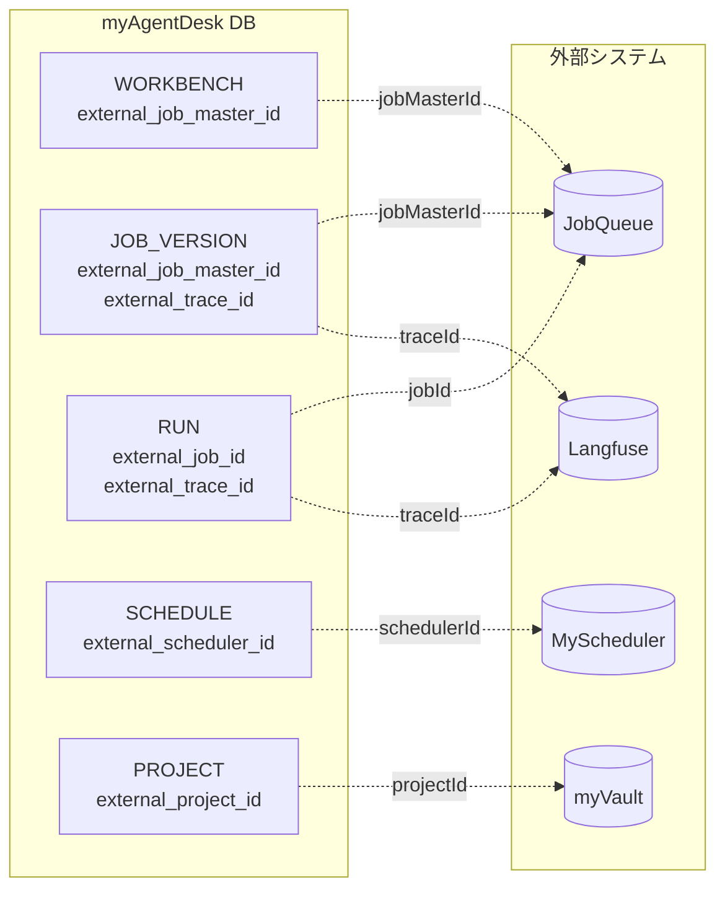

### 外部ID命名規則

| 外部システム | IDプレフィックス | 例 |
|------------|-----------------|-----|
| myVault | `proj_` | `proj_default_001` |
| JobQueue (Master) | `jm_` | `jm_abc123` |
| JobQueue (Job) | `job_` | `job_xyz789` |
| MyScheduler | `sched_` | `sched_cron_001` |
| Langfuse | - | UUID形式 |

---

## 状態遷移

### WORKBENCH.status

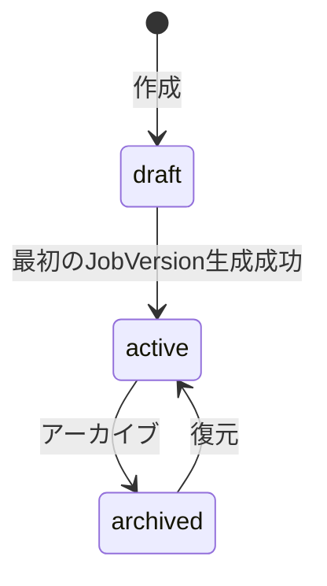

### REQUIREMENT_VERSION.status

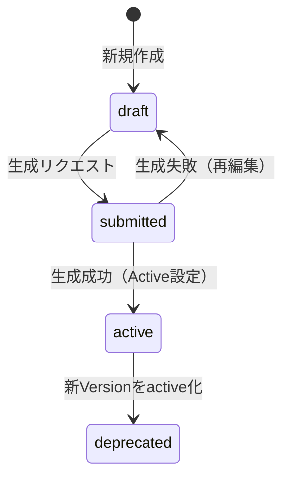

### JOB_VERSION.status

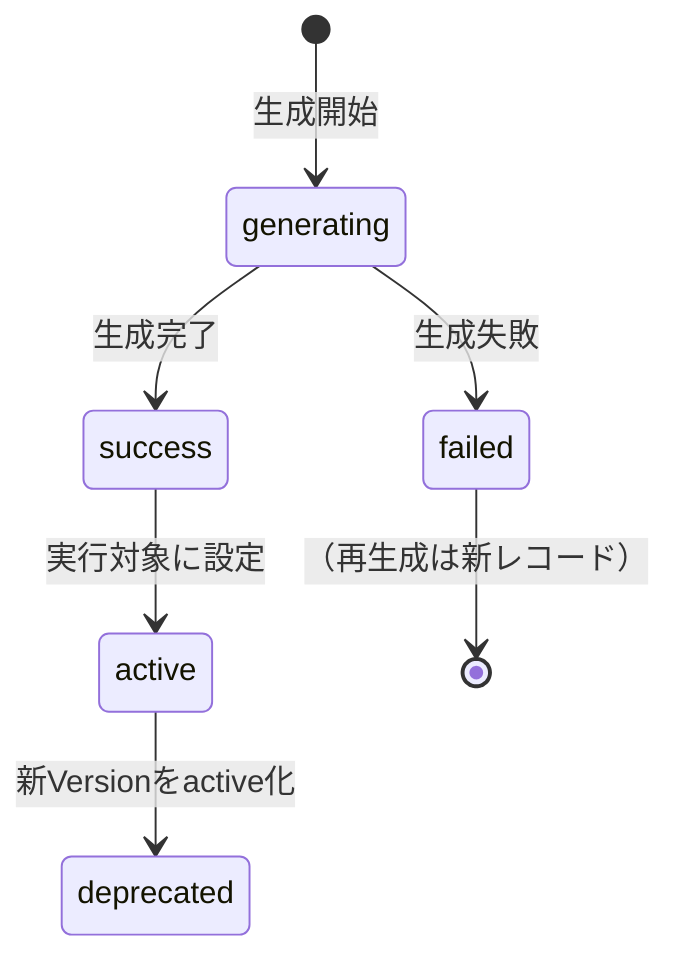

### RUN.status

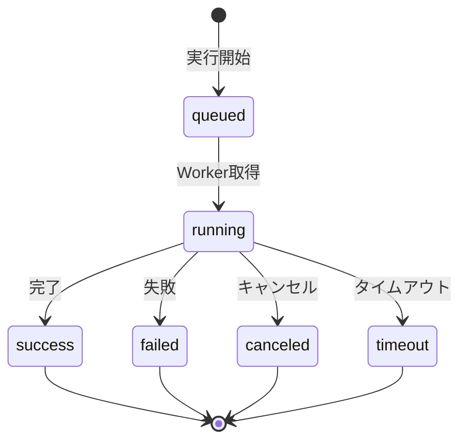

---

## ユースケース別データフロー

### UC1: 新規Workbench作成 → 要件登録 → Job生成

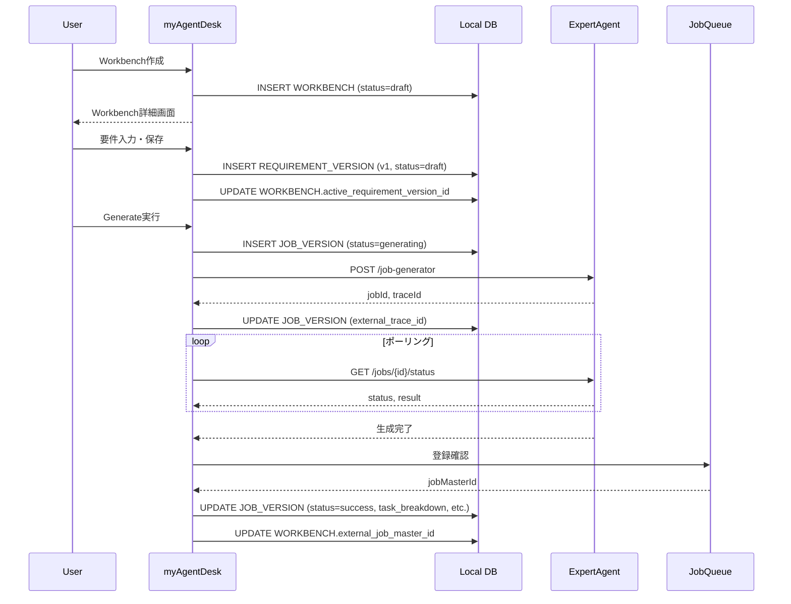

### UC2: 実行 → 分析 → 改善

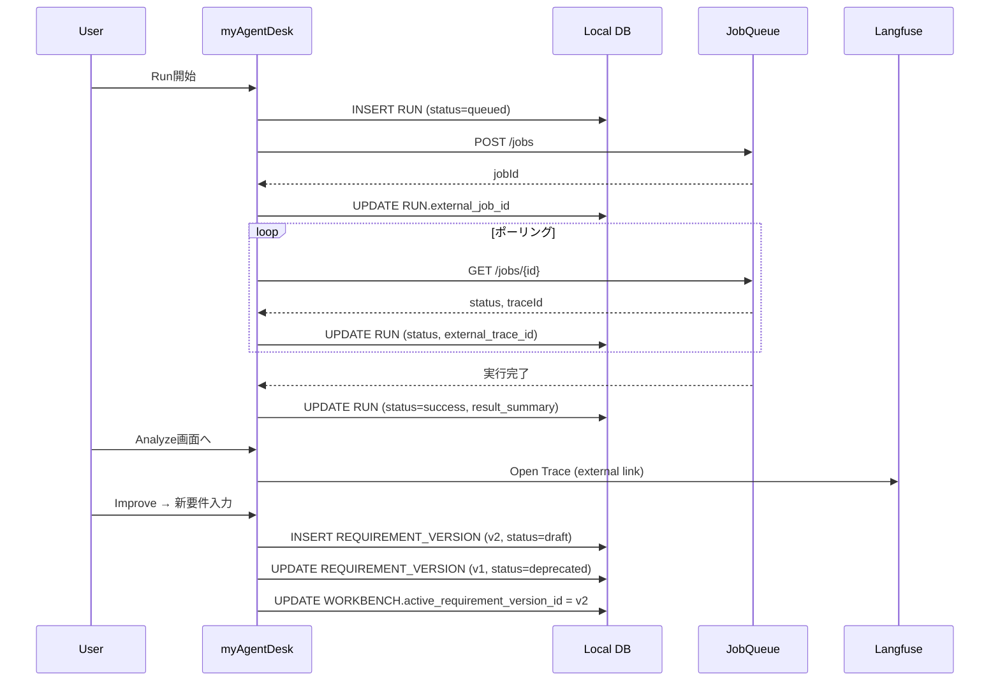

---

## インデックス戦略

### 頻繁なクエリパターン

| クエリ | 使用インデックス |
|--------|----------------|
| プロジェクト内のWorkbench一覧 | `idx_workbench_project` |
| Workbench内の要件Version一覧 | `idx_req_version_workbench` |
| アクティブな要件Versionのみ | `idx_req_version_status` |
| Workbench内のJobVersion一覧 | `idx_job_version_workbench` |
| 最新の実行履歴 | `idx_run_created` (DESC) |
| 有効なスケジュール一覧 | `idx_schedule_enabled` |

### 複合インデックス（必要に応じて追加）

```sql
-- Workbench内のアクティブな要件を取得
CREATE INDEX idx_req_workbench_active
ON requirement_version (workbench_id, status)
WHERE status = 'active';

-- 最近の実行を取得
CREATE INDEX idx_run_workbench_recent
ON run (workbench_id, created_at DESC);
```

---

## CRUD操作定義

### 操作一覧

各エンティティに対するCRUD操作と、その実行コンテキストを定義します。

| エンティティ | Create | Read | Update | Delete | 実体管理 |
|------------|--------|------|--------|--------|---------|
| **PROJECT** | 同期 | 一覧/詳細 | キャッシュ更新 | - | myVault |
| **WORKBENCH** | UI | 一覧/詳細 | 編集 | アーカイブ | myAgentDesk |
| **REQUIREMENT_VERSION** | UI | 一覧/詳細/diff | - | - | myAgentDesk |
| **JOB_VERSION** | 生成 | 一覧/詳細 | ステータス | - | myAgentDesk + JobQueue |
| **RUN** | UI | 一覧/詳細 | ポーリング | - | myAgentDesk + JobQueue |
| **SCHEDULE** | UI | 一覧/詳細 | 編集 | 削除 | myAgentDesk + MyScheduler |

### PROJECT

| 操作 | トリガー | 処理内容 | 外部API |
|------|---------|---------|---------|
| **Create (同期)** | プロジェクト一覧表示時 | myVaultからプロジェクト一覧を取得し、ローカルDBに同期 | `GET /api/v1/projects` |
| **Read 一覧** | `/projects`画面表示 | ローカルDBから取得（キャッシュ期限切れなら再同期） | - |
| **Read 詳細** | `/projects/:id`画面表示 | ローカルDBから取得 | - |
| **Update** | 同期時 | myVaultの最新情報でname/descriptionを更新 | `GET /api/v1/projects/:id` |
| **Delete** | - | 対応しない（myVaultで管理） | - |

### WORKBENCH

| 操作 | トリガー | 処理内容 | 外部API |
|------|---------|---------|---------|
| **Create** | 「New Workbench」ボタン | name/descriptionを入力、status=draftで作成 | - |
| **Read 一覧** | `/projects/:id/workbenches`画面表示 | project_idでフィルタ、status!=archivedで取得 | - |
| **Read 詳細** | `/workbenches/:id`画面表示 | IDで取得、関連エンティティ含む | - |
| **Update 編集** | 編集フォーム保存 | name/description更新 | - |
| **Update status** | 状態遷移イベント | draft→active（初回生成成功時）、active→archived（アーカイブ時） | - |
| **Update activeVersion** | Active切替操作 | active_requirement_version_id更新 | - |
| **Delete (Archive)** | 「Archive」ボタン | status=archivedに更新（論理削除） | - |

### REQUIREMENT_VERSION

| 操作 | トリガー | 処理内容 | 外部API |
|------|---------|---------|---------|
| **Create** | 「Save Requirements」ボタン | 新バージョン作成（version自動採番）、status=draft | - |
| **Create (Improve)** | 「Improve Requirements」ボタン | 既存contentをコピーして新バージョン作成 | - |
| **Read 一覧** | Requirements画面表示 | workbench_idでフィルタ、version DESC | - |
| **Read 詳細** | バージョン選択 | IDで取得 | - |
| **Read diff** | diff表示 | 2バージョンのcontent比較（クライアント側で計算） | - |
| **Update** | - | 不可（Immutable設計） | - |
| **Delete** | - | 不可（履歴保持） | - |

**備考**: RequirementVersionはImmutable。編集は新バージョン作成で対応。

### JOB_VERSION

| 操作 | トリガー | 処理内容 | 外部API |
|------|---------|---------|---------|
| **Create** | 「Generate」ボタン | status=generatingで作成、ExpertAgent呼び出し | `POST /aiagent-api/v1/job-generator` |
| **Read 一覧** | Review画面表示 | workbench_idでフィルタ、version DESC | - |
| **Read 詳細** | JobVersion選択 | IDで取得（task_breakdown/interface_definitions/workflows含む） | - |
| **Update status (生成中)** | ポーリング | ExpertAgentからstatus取得、generating→success/failed | `GET /aiagent-api/v1/jobs/:id/status` |
| **Update status (active化)** | 「Set Active」ボタン | success→active、他をdeprecatedに | - |
| **Update content** | 生成完了時 | task_breakdown/interface_definitions/workflows/external_job_master_id設定 | - |
| **Delete** | - | 不可（履歴保持） | - |

### RUN

| 操作 | トリガー | 処理内容 | 外部API |
|------|---------|---------|---------|
| **Create** | 「Start Run」ボタン | status=queuedで作成、JobQueue呼び出し | `POST /api/v1/jobs` (JobQueue) |
| **Read 一覧** | Runs画面表示 | workbench_idでフィルタ、created_at DESC | - |
| **Read 詳細** | Run選択 | IDで取得（execution_params/result_summary含む） | - |
| **Update status** | ポーリング（5秒間隔） | JobQueueからstatus取得、ローカル更新 | `GET /api/v1/jobs/:id` (JobQueue) |
| **Update traceId** | 実行開始時 | JobQueueレスポンスからexternal_trace_id設定 | - |
| **Update result** | 実行完了時 | result_summary設定 | - |
| **Delete** | - | 不可（履歴保持） | - |

### SCHEDULE

| 操作 | トリガー | 処理内容 | 外部API |
|------|---------|---------|---------|
| **Create** | 「Create Schedule」ボタン | ローカル作成後、MyScheduler登録 | `POST /api/v1/schedules` (MyScheduler) |
| **Read 一覧** | Schedule画面表示 | workbench_idでフィルタ | - |
| **Read 詳細** | Schedule選択 | IDで取得、MySchedulerから最新情報同期 | `GET /api/v1/schedules/:id` (MyScheduler) |
| **Update 編集** | 編集フォーム保存 | cron_expression/execution_params更新、MyScheduler同期 | `PUT /api/v1/schedules/:id` (MyScheduler) |
| **Update enable/disable** | トグルスイッチ | is_enabled更新、MyScheduler同期 | `PATCH /api/v1/schedules/:id` (MyScheduler) |
| **Delete** | 「Delete」ボタン | ローカル削除、MyScheduler削除 | `DELETE /api/v1/schedules/:id` (MyScheduler) |

---

## 外部システム同期パターン

### 同期タイミング

| エンティティ | 同期方式 | タイミング | 失敗時の挙動 |
|------------|---------|----------|-------------|
| PROJECT | Pull | 画面表示時（キャッシュ期限: 5分） | キャッシュ表示、エラー通知 |
| JOB_VERSION | Push + Poll | 生成開始時 + ポーリング（3秒間隔） | リトライ3回、失敗表示 |
| RUN | Push + Poll | 実行開始時 + ポーリング（5秒間隔） | リトライ3回、失敗表示 |
| SCHEDULE | Push | 作成/更新/削除時 | ロールバック、エラー通知 |

### トランザクション境界

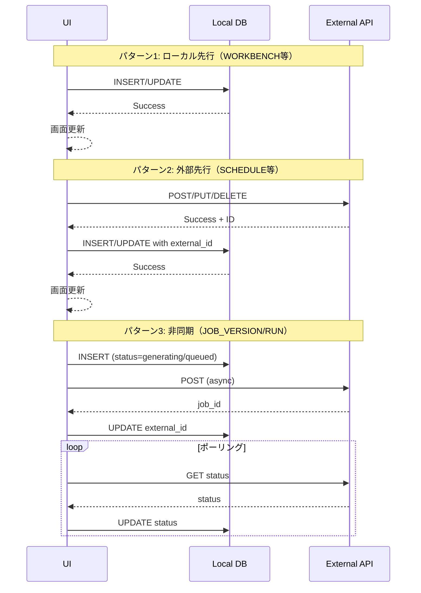

---

## データベース技術選定

### ORM選定: Drizzle ORM

| 項目 | 選定 | 理由 |
|------|------|------|
| **ORM** | Drizzle ORM | TypeScript first、軽量、SQLite/PostgreSQL両対応 |
| **代替案** | Prisma | 機能豊富だがバンドルサイズ大、SQLiteサポートが限定的 |
| **代替案** | Kysely | 型安全だがマイグレーション機能が弱い |

### Drizzle ORMの利点

1. **マルチDB対応**: SQLite (`better-sqlite3`) と PostgreSQL (`postgres`) を同一スキーマで対応
2. **型安全**: スキーマからTypeScript型を自動生成
3. **軽量**: バンドルサイズが小さく、SvelteKitとの相性が良い
4. **マイグレーション**: `drizzle-kit`でpush/migrate対応
5. **JSON対応**: SQLite（TEXT+JSON）とPostgreSQL（JSONB）を透過的に扱える

### データベース構成

```
myAgentDesk/
├── src/
│   └── lib/
│       └── server/
│           └── db/
│               ├── index.ts        # DB接続（環境変数で切替）
│               ├── schema.ts       # Drizzleスキーマ定義
│               └── migrations/     # マイグレーションファイル
├── drizzle.config.ts               # Drizzle Kit設定
└── data/
    └── local.db                    # SQLite DBファイル（開発用）
```

### 環境別設定

```typescript
// src/lib/server/db/index.ts
import { drizzle as drizzleSqlite } from 'drizzle-orm/better-sqlite3';
import { drizzle as drizzlePg } from 'drizzle-orm/postgres-js';
import Database from 'better-sqlite3';
import postgres from 'postgres';
import * as schema from './schema';

const DATABASE_URL = process.env.DATABASE_URL;

export const db = DATABASE_URL?.startsWith('postgres')
  ? drizzlePg(postgres(DATABASE_URL), { schema })
  : drizzleSqlite(new Database('data/local.db'), { schema });
```

### スキーマ定義例

```typescript
// src/lib/server/db/schema.ts
import { sqliteTable, text, integer } from 'drizzle-orm/sqlite-core';
import { pgTable, uuid, varchar, timestamp, jsonb } from 'drizzle-orm/pg-core';

// SQLite版
export const workbenchSqlite = sqliteTable('workbench', {
  id: text('id').primaryKey(),
  projectId: text('project_id').notNull(),
  name: text('name').notNull(),
  description: text('description'),
  status: text('status').notNull().default('draft'),
  activeRequirementVersionId: text('active_requirement_version_id'),
  externalJobMasterId: text('external_job_master_id'),
  createdAt: integer('created_at', { mode: 'timestamp' }).notNull(),
  updatedAt: integer('updated_at', { mode: 'timestamp' }).notNull(),
});

// PostgreSQL版
export const workbenchPg = pgTable('workbench', {
  id: uuid('id').primaryKey().defaultRandom(),
  projectId: uuid('project_id').notNull(),
  name: varchar('name', { length: 255 }).notNull(),
  description: text('description'),
  status: varchar('status', { length: 20 }).notNull().default('draft'),
  activeRequirementVersionId: uuid('active_requirement_version_id'),
  externalJobMasterId: varchar('external_job_master_id', { length: 64 }),
  createdAt: timestamp('created_at').notNull().defaultNow(),
  updatedAt: timestamp('updated_at').notNull().defaultNow(),
});

// 共通インターフェース（実行時に切替）
export const workbench = process.env.DATABASE_URL?.startsWith('postgres')
  ? workbenchPg
  : workbenchSqlite;
```

### JSON型の扱い

| DB | 型 | Drizzle定義 | 備考 |
|----|-----|------------|------|
| SQLite | TEXT | `text('column')` + アプリ側でJSON.parse/stringify | 検索は文字列マッチ |
| PostgreSQL | JSONB | `jsonb('column')` | インデックス対応、部分検索可能 |

```typescript
// SQLite: JSON as TEXT
taskBreakdown: text('task_breakdown', { mode: 'json' }),

// PostgreSQL: JSONB
taskBreakdown: jsonb('task_breakdown'),
```

### マイグレーション戦略

```bash
# 開発環境（SQLite）: スキーマをDBに直接反映
npx drizzle-kit push:sqlite

# 本番環境（PostgreSQL）: マイグレーションファイル生成 → 適用
npx drizzle-kit generate:pg
npx drizzle-kit migrate
```

### 初期スキーマ作成順序

```
1. PROJECT (依存なし)
2. WORKBENCH (PROJECT に依存)
3. REQUIREMENT_VERSION (WORKBENCH に依存)
4. JOB_VERSION (WORKBENCH, REQUIREMENT_VERSION に依存)
5. RUN (WORKBENCH, JOB_VERSION に依存)
6. SCHEDULE (WORKBENCH, JOB_VERSION に依存)
7. WORKBENCH.active_requirement_version_id FK追加 (後から)
```

### 接続プール設定

| 環境 | 接続方式 | 設定 |
|------|---------|------|
| 開発 (SQLite) | 直接接続 | `new Database('data/local.db')` |
| 本番 (PostgreSQL) | コネクションプール | `postgres(DATABASE_URL, { max: 10 })` |

---

## 補足: UserPreference（オプション）

将来的なユーザー設定管理用

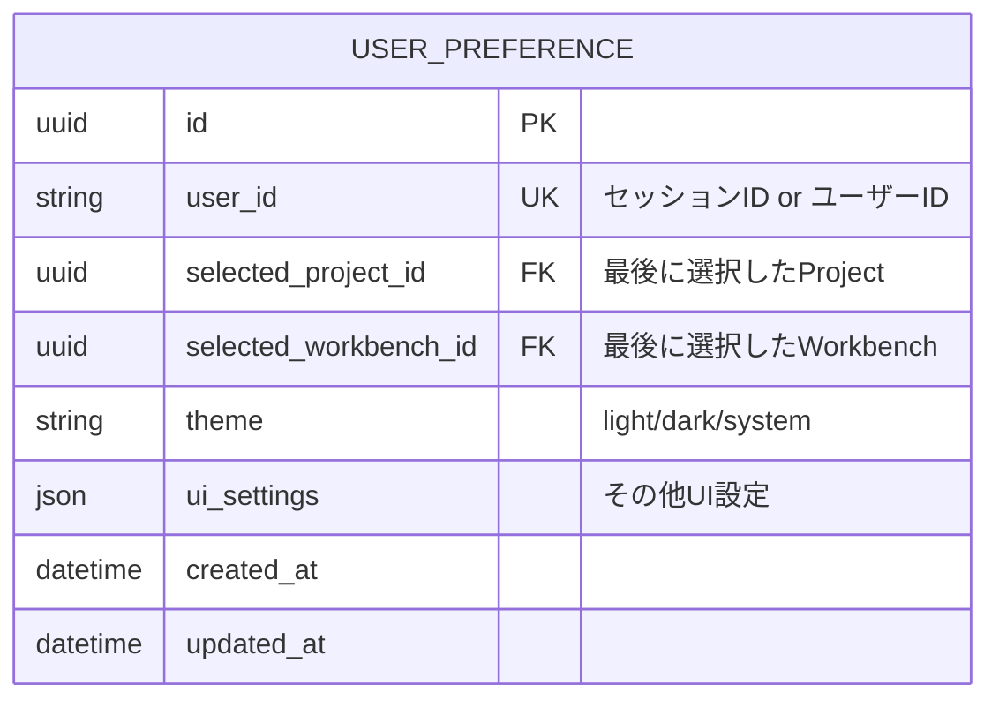

---

## 参照ドキュメント

| ドキュメント | 説明 |
|------------|------|
| `requirements.md` | 要件定義書（エンティティ定義元） |
| `screen-transition.md` | 画面遷移図・URL設計 |
| `docs/arch/service-dependencies.md` | サービス間通信フロー |
| `expertAgent/docs/API_REFERENCE.md` | API仕様（外部IDの元） |

---

**作成日**: 2025-12-14
**対象Issue**: #279 myAgentDesk再構築
**関連ドキュメント**: `requirements.md`, `screen-transition.md`
