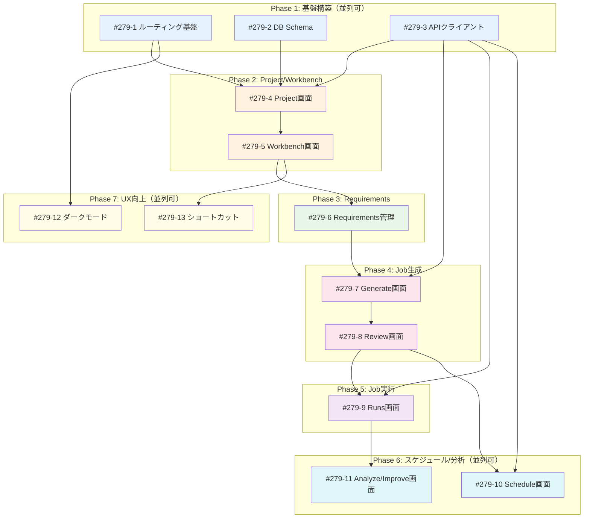

# Issue分割計画書: Issue #279 - myAgentDesk MVP再構築

## 概要

Issue #279（myAgentDesk MVP再構築）を実装可能な単位のIssueに分割し、依存関係を整理します。

**参照ドキュメント**:
- [requirements.md](./requirements.md) - 要件定義書
- [screen-transition.md](./screen-transition.md) - 画面遷移図・URL設計
- [er-diagram.md](./er-diagram.md) - E-R図・データベース設計
- [design-policy.md](./design-policy.md) - 設計方針書
- [design-system.md](./design-system.md) - デザインシステム

**技術スタック**: Svelte 5.45.6 + SvelteKit 2.49.1 + TailwindCSS 4.1.18 + Drizzle ORM

---

## 分割戦略

### 分割原則

| 原則 | 説明 |
|------|------|
| **縦割り（Vertical Slice）優先** | 各Issueが独立してデプロイ可能、UI + API + DB を1つに |
| **モックファースト** | UI/UXを先に固め、後からAPI実接続に差し替え |
| **レイヤー順序** | Portal → Project → Workbench → Detail の順で構築 |
| **依存最小化** | 並列実行可能なIssueを増やす |

### Issueサイズ目安

| サイズ | Story Point | 作業時間 | 本計画での使用 |
|-------|------------|---------|--------------|
| XS | 1 | 2-4時間 | 設定・修正系 |
| S | 2 | 0.5-1日 | 単純機能追加 |
| M | 3-5 | 1-3日 | 標準機能 |
| L | 8 | 3-5日 | 複合機能 |

---

## Issue一覧

### Phase 1: 基盤構築（並列実行可能）

#### Issue #279-1: SvelteKitルーティング基盤
**概要**: URL設計に基づくルーティング構造とレイアウトコンポーネントの実装
**サイズ**: M (3 SP)
**優先度**: P0 (Blocker)
**担当**: Frontend

**スコープ**:
- [ ] `src/routes/` ディレクトリ構造の作成（screen-transition.md準拠）
- [ ] Root Layout（グローバルナビ、Toast通知）
- [ ] Project Layout（サイドバー）
- [ ] Workbench Layout（タブナビ、Next Action Bar）
- [ ] パンくずリストコンポーネント
- [ ] ルーティングの単体テスト

**技術スタック**:
- SvelteKit 2.49.1
- TypeScript 5.9.3

**受入基準（Acceptance Criteria）**:

#### 🤖 自動検証可能な基準（pm-auto-devが実施）

**機能要件**:
- [ ] 全17画面のURLパスが screen-transition.md と一致
- [ ] `+layout.svelte` が各階層で正しくネストされる
- [ ] パラメータ（`:projectId`, `:workbenchId`等）が正しく取得できる

**品質基準**:
- [ ] 単体テストカバレッジ 90%以上
- [ ] Ruff/MyPy（N/A）、ESLint/TypeScript エラーゼロ
- [ ] ビルド成功（`npm run build`）

**テストケース**:
- [ ] 正常系: `/projects/proj_001` へのアクセスで Project Layout が表示される
- [ ] 正常系: `/projects/proj_001/workbenches/wb_001/requirements` でタブが「Requirements」選択状態
- [ ] 異常系: 存在しないパス `/invalid` で 404 ページ表示

#### 👤 手動検証が必要な基準（ユーザーが実施）

**UX/UI検証**:
- [ ] パンくずリストが全画面で正しく表示される
- [ ] タブナビゲーションがクリックで切り替わる
- [ ] ブラウザの戻る/進むボタンで正しく遷移する

---

#### Issue #279-2: Drizzle ORM + SQLite セットアップ
**概要**: ローカル開発用データベーススキーマとマイグレーション基盤
**サイズ**: M (3 SP)
**優先度**: P0 (Blocker)
**担当**: Backend/Full-stack

**スコープ**:
- [ ] Drizzle ORM セットアップ（better-sqlite3）
- [ ] スキーマ定義（er-diagram.md準拠）
  - [ ] Project テーブル
  - [ ] Workbench テーブル
  - [ ] RequirementVersion テーブル
  - [ ] JobVersion テーブル
  - [ ] Run テーブル
  - [ ] Schedule テーブル
- [ ] マイグレーション設定（drizzle-kit）
- [ ] シードデータ作成（モックアップデータ移植）

**技術スタック**:
- Drizzle ORM
- better-sqlite3
- drizzle-kit

**受入基準（Acceptance Criteria）**:

#### 🤖 自動検証可能な基準

**機能要件**:
- [ ] `npm run db:push` でスキーマがSQLiteに反映される
- [ ] 全6テーブルが作成される
- [ ] FK制約が正しく設定される（workbench.project_id → project.id等）

**品質基準**:
- [ ] マイグレーションが冪等（複数回実行可能）
- [ ] TypeScript型がスキーマから自動生成される

**テストケース**:
- [ ] 正常系: Workbench作成時、project_idが存在するProjectを参照
- [ ] 異常系: 存在しないproject_idでWorkbench作成時にFK違反エラー

#### 👤 手動検証が必要な基準

**運用検証**:
- [ ] `data/local.db` ファイルが作成される
- [ ] DBブラウザ（DBeaver等）で内容確認可能

---

#### Issue #279-3: APIクライアント境界（アダプタ層）
**概要**: 外部サービスとの通信を抽象化するAPIクライアント層
**サイズ**: M (5 SP)
**優先度**: P0 (Blocker)
**担当**: Full-stack

**スコープ**:
- [ ] APIクライアント基底クラス（Service Token認証）
- [ ] ExpertAgentClient（Job Generator API）
- [ ] JobQueueClient（Run管理）
- [ ] MySchedulerClient（スケジュール管理）
- [ ] MyVaultClient（Project/シークレット管理）
- [ ] LangfuseClient（トレース取得）
- [ ] モック実装（開発時切替可能）
- [ ] エラーハンドリング（design-policy.md 6.3準拠）
- [ ] Result<T, E> 型パターンの実装

**技術スタック**:
- TypeScript
- fetch API
- Zod（バリデーション）

**受入基準（Acceptance Criteria）**:

#### 🤖 自動検証可能な基準

**機能要件**:
- [ ] `api.expertAgent.generateJob()` が型安全に呼び出せる
- [ ] モックモード時はAPIを呼び出さずモックデータを返却
- [ ] リトライロジック（指数バックオフ）が動作

**品質基準**:
- [ ] 単体テストカバレッジ 90%以上
- [ ] TypeScriptエラーゼロ

**テストケース**:
- [ ] 正常系: モックモードでJobVersion一覧を取得
- [ ] 正常系: リトライ設定が3回まで試行
- [ ] 異常系: 401エラー時に認証エラーとして分類

#### 👤 手動検証が必要な基準

**ビジネスロジック検証**:
- [ ] 環境変数 `USE_MOCK=true` でモックモードに切り替わる
- [ ] 各サービスへの疎通確認が可能

---

### Phase 2: Project・Workbench管理

#### Issue #279-4: Project一覧・詳細画面
**概要**: Projectの一覧表示、詳細ダッシュボード、Vault設定画面
**サイズ**: M (5 SP)
**優先度**: P1 (High)
**担当**: Frontend
**依存**: #279-1, #279-2, #279-3

**スコープ**:
- [ ] Project一覧画面（`/projects`）
  - [ ] プロジェクトカード表示
  - [ ] Workbench数表示
  - [ ] 新規作成モーダル
- [ ] Project詳細画面（`/projects/:projectId`）
  - [ ] プロジェクト概要
  - [ ] 最近のRun一覧（All Runs）
  - [ ] 最近のSchedule一覧（All Schedules）
- [ ] Vault設定画面（`/projects/:projectId/vault`）
  - [ ] シークレット一覧表示
  - [ ] 疎通確認ボタン
  - [ ] 設定不足警告
- [ ] Projectガード（存在確認、アクセス制御）

**技術スタック**:
- Svelte 5 runes ($state, $derived)
- TailwindCSS 4

**受入基準（Acceptance Criteria）**:

#### 🤖 自動検証可能な基準

**機能要件**:
- [ ] `/projects` でProject一覧が表示される
- [ ] `/projects/:projectId` でProject詳細が表示される
- [ ] `/projects/:projectId/vault` でシークレット一覧が表示される
- [ ] 存在しないprojectIdで404エラー

**品質基準**:
- [ ] 単体テストカバレッジ 90%以上
- [ ] ESLint/TypeScript エラーゼロ

**テストケース**:
- [ ] 正常系: Project一覧に3件表示（モックデータ）
- [ ] 正常系: All Runsが選択プロジェクトでフィルタリングされる
- [ ] 異常系: `/projects/invalid_id` で404画面表示

#### 👤 手動検証が必要な基準

**UX/UI検証**:
- [ ] プロジェクトカードのホバーエフェクト
- [ ] Vault設定の「Test Connection」ボタンが動作（モック）
- [ ] 設定不足時に警告バッジが表示される

---

#### Issue #279-5: Workbench一覧・詳細画面
**概要**: Workbenchの一覧表示、詳細ダッシュボード、タブナビゲーション
**サイズ**: M (5 SP)
**優先度**: P1 (High)
**担当**: Frontend
**依存**: #279-1, #279-2, #279-4

**スコープ**:
- [ ] Workbench一覧画面（`/projects/:projectId/workbenches`）
  - [ ] Workbenchカード表示（status, lastRunAt）
  - [ ] 新規作成モーダル
  - [ ] フィルタリング（active/idle/inactive）
- [ ] Workbench詳細画面（`/workbenches/:workbenchId`）
  - [ ] タブナビゲーション（7タブ）
  - [ ] Next Action Bar
  - [ ] 概要パネル
- [ ] Workbenchガード（存在確認、Project所属確認）

**技術スタック**:
- Svelte 5 runes
- URL駆動状態管理（$page.url.searchParams）

**受入基準（Acceptance Criteria）**:

#### 🤖 自動検証可能な基準

**機能要件**:
- [ ] Workbench一覧がProject別にフィルタリングされる
- [ ] タブクリックでURLが変化（`?tab=requirements`等）
- [ ] 存在しないworkbenchIdで404エラー
- [ ] Project不一致のworkbenchIdで404エラー（セキュリティ）

**品質基準**:
- [ ] 単体テストカバレッジ 90%以上
- [ ] E2Eテスト: タブ遷移フロー

**テストケース**:
- [ ] 正常系: proj_001のWorkbench一覧に5件表示
- [ ] 正常系: タブ「Review」クリック後、URLに`tab=review`が付与
- [ ] 異常系: proj_002のURLでproj_001のWorkbenchにアクセス→404

#### 👤 手動検証が必要な基準

**UX/UI検証**:
- [ ] タブ切り替えがスムーズ（遷移アニメーション）
- [ ] Next Action Barが現在の状態に応じて変化
- [ ] ブックマーク後、同じタブが開く

---

### Phase 3: Requirements管理

#### Issue #279-6: Requirements一覧・バージョン管理
**概要**: 要件定義のバージョン管理、diff表示、Active切り替え
**サイズ**: L (8 SP)
**優先度**: P1 (High)
**担当**: Full-stack
**依存**: #279-5

**スコープ**:
- [ ] Requirements一覧画面（`/workbenches/:workbenchId/requirements`）
  - [ ] バージョン一覧（v1, v2, v3...）
  - [ ] Active/Deprecated ステータス表示
  - [ ] 新規バージョン作成ボタン
- [ ] Requirement詳細画面（`/requirements/:reqVersionId`）
  - [ ] Markdownコンテンツ表示
  - [ ] 2バージョン間diff表示
- [ ] Markdownエディタ（新規作成/編集）
- [ ] Active Version切り替え機能
- [ ] Improve導線（Analyze画面から遷移時、既存contentをコピー）

**技術スタック**:
- marked（Markdownレンダリング）
- DOMPurify（XSS対策）
- diff-match-patch（diff表示）

**受入基準（Acceptance Criteria）**:

#### 🤖 自動検証可能な基準

**機能要件**:
- [ ] 要件Version一覧が version DESC で表示される
- [ ] diff表示で追加/削除行がハイライトされる
- [ ] Active切り替え時、旧Activeがdeprecatedになる
- [ ] Markdownが正しくレンダリングされる

**品質基準**:
- [ ] 単体テストカバレッジ 90%以上
- [ ] XSS攻撃テスト（sanitize確認）

**テストケース**:
- [ ] 正常系: v5（active）とv4（deprecated）のdiff表示
- [ ] 正常系: 新規作成でversion=6が採番される
- [ ] 異常系: `` がエスケープされる

#### 👤 手動検証が必要な基準

**UX/UI検証**:
- [ ] Markdownエディタのプレビューがリアルタイム更新
- [ ] diff表示が見やすい（行番号、色分け）
- [ ] 「Improve from v5」ボタンでv5のcontentがコピーされる

---

### Phase 4: Job生成（ExpertAgent連携）

#### Issue #279-7: Generate画面（Job生成）
**概要**: ExpertAgent Job Generator APIを使用したJob生成
**サイズ**: L (8 SP)
**優先度**: P1 (High)
**担当**: Full-stack
**依存**: #279-3, #279-6

**スコープ**:
- [ ] Generate画面（`/workbenches/:workbenchId/generate`）
  - [ ] Active RequirementVersion表示
  - [ ] 「Generate Job」ボタン
  - [ ] 生成中状態表示（プログレスバー）
  - [ ] 生成完了/失敗表示
- [ ] 非同期ポーリング実装（2秒間隔）
- [ ] JobVersion作成（生成結果の保存）
- [ ] バージョン採番（vN.M形式）
- [ ] Retry/Open Trace 導線

**技術スタック**:
- ExpertAgent API（/v1/job-generator）
- ポーリングパターン

**受入基準（Acceptance Criteria）**:

#### 🤖 自動検証可能な基準

**機能要件**:
- [ ] Active RequirementVersionが未設定の場合、生成ボタン無効化
- [ ] 生成開始でJobVersion(status=generating)が作成される
- [ ] 生成完了でJobVersion(status=success, task_breakdown等)が更新される
- [ ] バージョンがvN.M形式で正しく採番される（例: v5.2）

**品質基準**:
- [ ] 単体テストカバレッジ 90%以上
- [ ] 生成タイムアウト（5分）の処理

**テストケース**:
- [ ] 正常系: rv_v5から生成→jv_v5.1が作成される
- [ ] 正常系: 同じrv_v5から再生成→jv_v5.2が作成される
- [ ] 異常系: 生成失敗時にエラーメッセージ表示、Retryボタン表示

#### 👤 手動検証が必要な基準

**UX/UI検証**:
- [ ] 生成中のプログレス表示がスムーズ
- [ ] 生成完了後、自動でReview画面へ遷移（オプション）
- [ ] 「Open Trace」リンクでLangfuseが開く

---

#### Issue #279-8: Review画面（JobVersion詳細）
**概要**: 生成されたJobVersionの詳細確認、タスク分解・IF定義・ワークフロー表示
**サイズ**: M (5 SP)
**優先度**: P1 (High)
**担当**: Frontend
**依存**: #279-7

**スコープ**:
- [ ] Review画面（`/workbenches/:workbenchId/review`）
  - [ ] JobVersion一覧（vN.M形式）
  - [ ] Active/Deprecated ステータス
- [ ] JobVersion詳細画面（`/job-versions/:jobVersionId`）
  - [ ] タスク分解一覧（アコーディオン）
  - [ ] 各タスクのInput/Output IF定義表示
  - [ ] ワークフロー可視化（YAML表示）
  - [ ] 生成元RequirementVersionへのリンク
- [ ] Active JobVersion切り替え
- [ ] 「Start Run」ボタン

**技術スタック**:
- JSON Schema表示
- YAML表示（highlight.js）

**受入基準（Acceptance Criteria）**:

#### 🤖 自動検証可能な基準

**機能要件**:
- [ ] JobVersion一覧がvN.M形式で表示される
- [ ] タスク分解が階層的に表示される
- [ ] IF定義（JSON Schema）がフォーマットされて表示される

**品質基準**:
- [ ] 単体テストカバレッジ 90%以上

**テストケース**:
- [ ] 正常系: jv_v5.2の詳細に8タスクが表示される
- [ ] 正常系: タスク展開でinputInterface/outputInterfaceが表示される

#### 👤 手動検証が必要な基準

**UX/UI検証**:
- [ ] アコーディオンの開閉がスムーズ
- [ ] JSON Schemaが見やすくフォーマットされる
- [ ] ワークフローYAMLがシンタックスハイライトされる

---

### Phase 5: Job実行（JobQueue連携）

#### Issue #279-9: Runs画面（実行履歴・監視）
**概要**: Job実行の開始、リアルタイム監視、実行履歴一覧
**サイズ**: L (8 SP)
**優先度**: P1 (High)
**担当**: Full-stack
**依存**: #279-3, #279-8

**スコープ**:
- [ ] Runs一覧画面（`/workbenches/:workbenchId/runs`）
  - [ ] 実行履歴一覧（status, duration, createdAt）
  - [ ] JobVersionフィルタリング
  - [ ] ページネーション
- [ ] Run詳細画面（`/runs/:runId`）
  - [ ] リアルタイムステータス更新（ポーリング5秒）
  - [ ] プログレスバー（tasksCompleted/totalTasks）
  - [ ] 現在実行中タスク表示
  - [ ] ログ表示（展開可能）
  - [ ] 「Open Trace」リンク
- [ ] Run開始機能（JobVersionから）
- [ ] Rerun機能（失敗時）

**技術スタック**:
- JobQueue API
- ポーリングパターン（5秒間隔）

**受入基準（Acceptance Criteria）**:

#### 🤖 自動検証可能な基準

**機能要件**:
- [ ] Run開始でRun(status=queued)が作成される
- [ ] ステータスがqueued→running→success/failedと遷移する
- [ ] プログレスがリアルタイム更新される
- [ ] external_trace_idでLangfuseリンクが生成される

**品質基準**:
- [ ] 単体テストカバレッジ 90%以上
- [ ] ポーリング停止（成功/失敗時）

**テストケース**:
- [ ] 正常系: Run開始→queued→running→successの遷移
- [ ] 正常系: 失敗時にRerunボタン表示
- [ ] 異常系: ポーリング中にコンポーネントアンマウント→メモリリークなし

#### 👤 手動検証が必要な基準

**UX/UI検証**:
- [ ] プログレスバーがスムーズに更新
- [ ] ログ表示が展開/折りたたみ可能
- [ ] 実行中はローディングインジケータ表示

---

### Phase 6: スケジュール・分析

#### Issue #279-10: Schedule画面（CRON管理）
**概要**: スケジュール作成、編集、有効/無効切り替え
**サイズ**: M (5 SP)
**優先度**: P2 (Medium)
**担当**: Full-stack
**依存**: #279-3, #279-8

**スコープ**:
- [ ] Schedule一覧画面（`/workbenches/:workbenchId/schedule`）
  - [ ] スケジュール一覧（name, cron, isEnabled, nextRunAt）
  - [ ] 有効/無効トグル
  - [ ] 新規作成ボタン
- [ ] Schedule詳細画面（`/schedule/:scheduleId`）
  - [ ] CRON式編集
  - [ ] 対象JobVersion選択
  - [ ] 実行パラメータ設定
  - [ ] 削除ボタン
- [ ] CRON式バリデーション
- [ ] MyScheduler API連携

**技術スタック**:
- MyScheduler API
- cron-parser（CRON式解析）

**受入基準（Acceptance Criteria）**:

#### 🤖 自動検証可能な基準

**機能要件**:
- [ ] スケジュール作成でMyScheduler APIが呼び出される
- [ ] 有効/無効切り替えが即時反映される
- [ ] 不正なCRON式でバリデーションエラー

**品質基準**:
- [ ] 単体テストカバレッジ 90%以上

**テストケース**:
- [ ] 正常系: `0 9 * * 1-5`（平日9時）が有効
- [ ] 異常系: `invalid cron` でエラー表示

#### 👤 手動検証が必要な基準

**UX/UI検証**:
- [ ] CRON式入力時に次回実行日時がプレビュー表示
- [ ] トグルスイッチの反応が即時

---

#### Issue #279-11: Analyze・Improve画面（Langfuse連携）
**概要**: 実行結果の分析、Langfuseトレース連携、要件改善導線
**サイズ**: M (5 SP)
**優先度**: P2 (Medium)
**担当**: Full-stack
**依存**: #279-9

**スコープ**:
- [ ] Analyze画面（`/workbenches/:workbenchId/analyze`）
  - [ ] 最近のRun一覧（サマリ表示）
  - [ ] 成功/失敗率グラフ（簡易）
  - [ ] 「Open Trace」リンク（Langfuse）
  - [ ] トレースメトリクス表示（コスト、レイテンシ）
- [ ] Improve画面（`/workbenches/:workbenchId/improve`）
  - [ ] 現在のActive RequirementVersion表示
  - [ ] 「Create New Version」ボタン（Requirements画面連携）
  - [ ] 改善提案表示（将来: AI生成）
- [ ] Langfuse API連携（トレース取得）

**技術スタック**:
- Langfuse API
- 簡易チャートライブラリ

**受入基準（Acceptance Criteria）**:

#### 🤖 自動検証可能な基準

**機能要件**:
- [ ] Runのexternal_trace_idからLangfuseリンクが生成される
- [ ] Improve画面からRequirements新規作成に遷移可能

**品質基準**:
- [ ] 単体テストカバレッジ 90%以上

**テストケース**:
- [ ] 正常系: Run成功率が計算される（3/5 = 60%）
- [ ] 正常系: Improve→Requirements遷移時、既存contentがコピーされる

#### 👤 手動検証が必要な基準

**UX/UI検証**:
- [ ] 「Open Trace」が新タブでLangfuseを開く
- [ ] グラフが正しくレンダリングされる

---

### Phase 7: UX向上（Nice to Have）

#### Issue #279-12: ダークモード対応
**概要**: CSS変数によるダークモード切り替え
**サイズ**: S (2 SP)
**優先度**: P3 (Low)
**担当**: Frontend
**依存**: #279-1

**スコープ**:
- [ ] CSS変数によるテーマ定義（design-system.md準拠）
- [ ] テーマ切り替えトグル
- [ ] LocalStorageへの設定保存
- [ ] システム設定連動（prefers-color-scheme）

---

#### Issue #279-13: キーボードショートカット
**概要**: 主要操作のキーボードショートカット
**サイズ**: S (2 SP)
**優先度**: P3 (Low)
**担当**: Frontend
**依存**: #279-5

**スコープ**:
- [ ] グローバルショートカット（`/`: 検索、`g p`: Projects）
- [ ] タブ切り替え（`1`〜`7`キー）
- [ ] ショートカットヘルプモーダル（`?`キー）

---

## Phase毎のIssue管理

### Phase 1: 基盤構築（並列実行可能）

| Issue | 概要 | 依存 | サイズ | 見積 |
|-------|------|------|--------|------|
| #279-1 | SvelteKitルーティング基盤 | なし | M (3) | 1日 |
| #279-2 | Drizzle ORM + SQLite | なし | M (3) | 1日 |
| #279-3 | APIクライアント境界 | なし | M (5) | 1.5日 |

**Phase 1 完了条件**:
- [ ] 全URLパスがルーティング可能
- [ ] DBスキーマが作成済み
- [ ] モックモードでAPI呼び出し可能

**並列実行**: #279-1, #279-2, #279-3 は相互依存なし（同時作業可）

---

### Phase 2: Project・Workbench管理（Phase 1完了後）

| Issue | 概要 | 依存 | サイズ | 見積 |
|-------|------|------|--------|------|
| #279-4 | Project一覧・詳細 | #279-1,2,3 | M (5) | 1.5日 |
| #279-5 | Workbench一覧・詳細 | #279-1,2,4 | M (5) | 1.5日 |

**Phase 2 完了条件**:
- [ ] Project選択 → Workbench一覧 → Workbench詳細 の導線が動作
- [ ] Vault設定画面が表示される

---

### Phase 3: Requirements管理（Phase 2完了後）

| Issue | 概要 | 依存 | サイズ | 見積 |
|-------|------|------|--------|------|
| #279-6 | Requirements一覧・バージョン管理 | #279-5 | L (8) | 2.5日 |

**Phase 3 完了条件**:
- [ ] 要件登録・Version追加が可能
- [ ] diff表示が機能
- [ ] Active Version切り替えが機能

---

### Phase 4: Job生成（Phase 3完了後、Phase 5と並列可）

| Issue | 概要 | 依存 | サイズ | 見積 |
|-------|------|------|--------|------|
| #279-7 | Generate画面 | #279-3,6 | L (8) | 2.5日 |
| #279-8 | Review画面 | #279-7 | M (5) | 1.5日 |

**Phase 4 完了条件**:
- [ ] Job生成が実行可能（モック）
- [ ] 生成結果（タスク/IF/WF）が表示される

---

### Phase 5: Job実行（Phase 4完了後）

| Issue | 概要 | 依存 | サイズ | 見積 |
|-------|------|------|--------|------|
| #279-9 | Runs画面 | #279-3,8 | L (8) | 2.5日 |

**Phase 5 完了条件**:
- [ ] Run開始・監視が可能
- [ ] 実行履歴が表示される

---

### Phase 6: スケジュール・分析（Phase 5完了後、並列可）

| Issue | 概要 | 依存 | サイズ | 見積 |
|-------|------|------|--------|------|
| #279-10 | Schedule画面 | #279-3,8 | M (5) | 1.5日 |
| #279-11 | Analyze・Improve画面 | #279-9 | M (5) | 1.5日 |

**Phase 6 完了条件**:
- [ ] スケジュール登録・管理が可能
- [ ] Langfuse連携が機能
- [ ] 改善ループ（Analyze → Improve → Requirements）が成立

**並列実行**: #279-10 と #279-11 は異なる依存（同時作業可）

---

### Phase 7: UX向上（Phase 6完了後、並列可）

| Issue | 概要 | 依存 | サイズ | 見積 |
|-------|------|------|--------|------|
| #279-12 | ダークモード | #279-1 | S (2) | 0.5日 |
| #279-13 | キーボードショートカット | #279-5 | S (2) | 0.5日 |

---

## 依存関係グラフ

---

## 並列実行可能性マトリクス

| Phase | 並列実行可能なIssue | 理由 |
|-------|-------------------|------|
| Phase 1 | #279-1, #279-2, #279-3 | 相互依存なし（ルーティング、DB、API層が独立） |
| Phase 2 | - | #279-4完了後に#279-5（順序依存） |
| Phase 3 | - | 単一Issue |
| Phase 4 | - | #279-7完了後に#279-8（順序依存） |
| Phase 5 | - | 単一Issue |
| Phase 6 | #279-10, #279-11 | 異なる外部サービス（Scheduler/Langfuse） |
| Phase 7 | #279-12, #279-13 | 異なる機能領域 |

---

## 依存関係マトリクス（詳細版）

| Issue | 依存先 | 並列可能 | ブロッカー |
|-------|--------|---------|------------|
| #279-1 | なし | Yes | なし |
| #279-2 | なし | Yes（#279-1と並列可） | なし |
| #279-3 | なし | Yes（#279-1,2と並列可） | なし |
| #279-4 | #279-1,2,3 | No | Phase 1完了待ち |
| #279-5 | #279-1,2,4 | No | #279-4完了待ち |
| #279-6 | #279-5 | No | #279-5完了待ち |
| #279-7 | #279-3,6 | No | #279-6完了待ち |
| #279-8 | #279-7 | No | #279-7完了待ち |
| #279-9 | #279-3,8 | No | #279-8完了待ち |
| #279-10 | #279-3,8 | Yes（#279-11と並列可） | #279-8完了待ち |
| #279-11 | #279-9 | Yes（#279-10と並列可） | #279-9完了待ち |
| #279-12 | #279-1 | Yes（#279-13と並列可） | #279-1完了待ち |
| #279-13 | #279-5 | Yes（#279-12と並列可） | #279-5完了待ち |

---

## マイルストーン計画

### Milestone 1: MVP基盤（Phase 1-2）
**目標**: Project → Workbench の導線確立

| Issue | 見積 |
|-------|------|
| #279-1 ルーティング基盤 | 1日 |
| #279-2 DB Schema | 1日 |
| #279-3 APIクライアント | 1.5日 |
| #279-4 Project画面 | 1.5日 |
| #279-5 Workbench画面 | 1.5日 |
| **合計** | **6.5日** |

**成果物**:
- Project一覧 → Project詳細 → Workbench一覧 → Workbench詳細 の導線
- Vault設定画面
- モックデータでの動作確認

---

### Milestone 2: 改善ループ基盤（Phase 3-5）
**目標**: Requirements → Generate → Review → Run の改善ループ確立

| Issue | 見積 |
|-------|------|
| #279-6 Requirements管理 | 2.5日 |
| #279-7 Generate画面 | 2.5日 |
| #279-8 Review画面 | 1.5日 |
| #279-9 Runs画面 | 2.5日 |
| **合計** | **9日** |

**成果物**:
- 要件登録 → Job生成 → レビュー → 実行 の完全フロー
- バージョン管理（vN.M形式）
- 実行監視機能

---

### Milestone 3: 運用機能（Phase 6）
**目標**: スケジュール管理と分析機能

| Issue | 見積 |
|-------|------|
| #279-10 Schedule画面 | 1.5日 |
| #279-11 Analyze/Improve画面 | 1.5日 |
| **合計** | **3日** |

**成果物**:
- CRON スケジュール管理
- Langfuse連携
- 改善ループの完成（Analyze → Improve → Requirements）

---

### Milestone 4: UX向上（Phase 7）
**目標**: ユーザー体験の向上

| Issue | 見積 |
|-------|------|
| #279-12 ダークモード | 0.5日 |
| #279-13 ショートカット | 0.5日 |
| **合計** | **1日** |

---

## 総見積

| フェーズ | 見積 | 累計 |
|---------|------|------|
| Phase 1: 基盤構築 | 3.5日 | 3.5日 |
| Phase 2: Project/Workbench | 3日 | 6.5日 |
| Phase 3: Requirements | 2.5日 | 9日 |
| Phase 4: Job生成 | 4日 | 13日 |
| Phase 5: Job実行 | 2.5日 | 15.5日 |
| Phase 6: スケジュール/分析 | 3日 | 18.5日 |
| Phase 7: UX向上 | 1日 | 19.5日 |
| **合計** | **19.5日** | - |

**Story Point合計**: 61 SP

---

## リスク評価

| Issue | リスク | 影響度 | 対策 |
|-------|-------|-------|------|
| #279-3 | ExpertAgent APIの仕様変更 | 高 | APIアダプタ層で吸収、型定義で早期検出 |
| #279-6 | Markdownエディタの複雑性 | 中 | 既存ライブラリ活用、段階的機能追加 |
| #279-7 | Job生成の非同期処理 | 中 | ポーリング実装、タイムアウト設定 |
| #279-9 | リアルタイム更新のパフォーマンス | 中 | ポーリング間隔調整、将来SSE移行 |
| #279-10 | CRON式のバリデーション | 低 | cron-parserライブラリ活用 |

---

## 分割判断チェックリスト

各Issueについて確認済み:
- [x] 独立してデプロイ可能か
- [x] 1-3日で完了可能か
- [x] 明確な完了条件があるか（受入基準の2層構造）
- [x] テストが定義できるか
- [x] 他Issueへの影響が最小か
- [x] Phase間の依存関係が明確か
- [x] 並列実行可能なIssueが識別されているか

---

## 次のステップ

1. `/issue-create` コマンドでGitHub Issueを一括作成
2. 各Issueの詳細な作業計画は `/work-plan` で立案
3. Phase 1 の3Issue（#279-1, #279-2, #279-3）を並列で開始

---

**作成日**: 2025-12-16
**対象Issue**: #279 myAgentDesk MVP再構築
**ステータス**: GitHub Issue作成完了

---

## GitHub Issue マッピング

| 計画書内ID | GitHub Issue | タイトル |
|-----------|--------------|----------|
| #279-1 | [#285](https://github.com/Kewton/MySwiftAgent/issues/285) | SvelteKitルーティング基盤 |
| #279-2 | [#286](https://github.com/Kewton/MySwiftAgent/issues/286) | Drizzle ORM + SQLite セットアップ |
| #279-3 | [#287](https://github.com/Kewton/MySwiftAgent/issues/287) | APIクライアント境界（アダプタ層）|
| #279-4 | [#288](https://github.com/Kewton/MySwiftAgent/issues/288) | Project一覧・詳細画面 |
| #279-5 | [#289](https://github.com/Kewton/MySwiftAgent/issues/289) | Workbench一覧・詳細画面 |
| #279-6 | [#290](https://github.com/Kewton/MySwiftAgent/issues/290) | Requirements一覧・バージョン管理 |
| #279-7 | [#291](https://github.com/Kewton/MySwiftAgent/issues/291) | Generate画面（Job生成）|
| #279-8 | [#292](https://github.com/Kewton/MySwiftAgent/issues/292) | Review画面（JobVersion詳細）|
| #279-9 | [#293](https://github.com/Kewton/MySwiftAgent/issues/293) | Runs画面（実行履歴・監視）|
| #279-10 | [#294](https://github.com/Kewton/MySwiftAgent/issues/294) | Schedule画面（CRON管理）|
| #279-11 | [#295](https://github.com/Kewton/MySwiftAgent/issues/295) | Analyze・Improve画面（Langfuse連携）|
| #279-12 | [#296](https://github.com/Kewton/MySwiftAgent/issues/296) | ダークモード対応 |
| #279-13 | [#297](https://github.com/Kewton/MySwiftAgent/issues/297) | キーボードショートカット |
