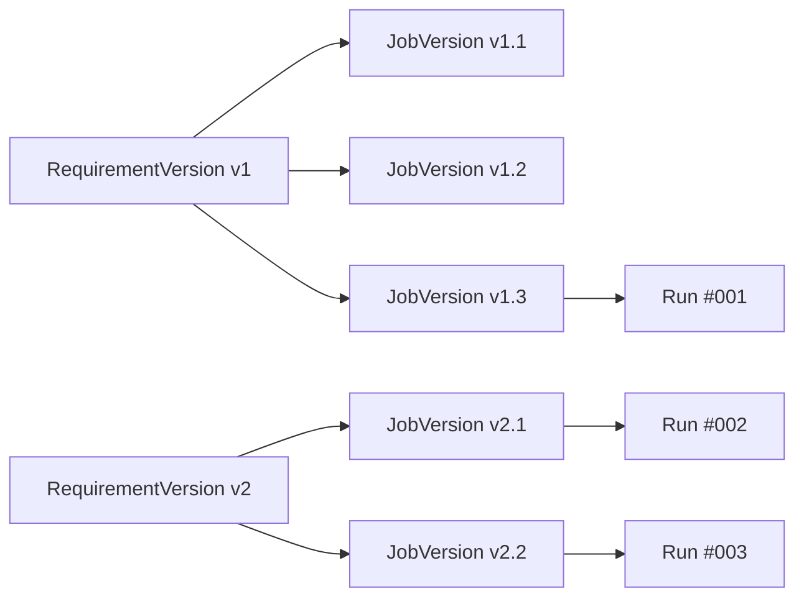

# 要件定義書: myAgentDesk MVP再構築 (Issue #279)

## 現状調査サマリ

### 対象プロジェクト
- **プロジェクト名**: myAgentDesk
- **技術スタック**: Svelte 5.45.6 + SvelteKit 2.49.1 + TailwindCSS 4.1.18
- **現在の状態**: 直近で再初期化済み（クリーンスレート）

### 関連モジュール
| サービス | ポート | 役割 | 統合必要度 |
|---------|-------|------|-----------|
| ExpertAgent | 8104 | AIエージェント・Job/Workflow生成 | 必須 |
| JobQueue | 8101 | ジョブキュー・非同期実行管理 | 必須 |
| MyScheduler | 8102 | CRONスケジューリング | 中 |
| MyVault | 8103 | シークレット・プロジェクト設定管理 | 必須 |
| GraphAiServer | 8105 | ワークフロー実行エンジン | 中 |
| Langfuse | 3001 | LLMトレーシング・分析 | 中 |

### 既存の類似機能
- **commonUI (Streamlit)**: 現行の管理画面。HTTPクライアントパターン、認証フロー、エラーハンドリングの参照実装
- **ExpertAgent API**: Job Generator、Workflow Generator、Chat APIの実装済みエンドポイント

### 使用されている設計パターン
| パターン | 使用箇所 | 目的 |
|---------|---------|------|
| Service Token認証 | myVault連携 | `X-Service` + `X-Token`ヘッダー |
| 非同期ポーリング | Job生成 | `POST /job-generator` → `GET /jobs/{id}/status` |
| SSE (Server-Sent Events) | Chat API | リアルタイムストリーミング |
| XOR バリデーション | API設計 | 排他的パラメータ検証 |

### 参照したドキュメント
- `expertAgent/docs/API_REFERENCE.md` - 全API仕様（Job Generator, Workflow Generator, Chat, Marp Report, Observability）
- `docs/arch/service-dependencies.md` - サービス間依存関係・起動順序・通信フロー
- `myAgentDesk/README.md` - SvelteKitセットアップ情報

### 制約事項
1. **Workbench = Job 1:1**: Workbenchを作成 = Jobを作成と同義
2. **myVault単一ソース**: プロジェクト設定（APIキー/モデル名等）はmyVaultが管理
3. **モックファースト**: 骨格UXを固めてからAPI接続へ差し替え
4. **Svelte 5 Runes API**: 新しいリアクティブシステム（`$state`, `$derived`, `$effect`）を使用

### バージョン管理体系

#### バージョン番号形式: `vN.M`

| 要素 | 説明 | 例 |
|------|------|-----|
| **N** | 要件定義バージョン（RequirementVersion） | v1, v2, v3... |
| **M** | Job生成ワークフローの実行回数 | .1, .2, .3... |

#### バージョン採番ルール

```
v1.1 → 要件v1から最初のJob生成
v1.2 → 要件v1から2回目のJob生成（LLM応答の違いや定義ファイル変更による再生成）
v1.3 → 要件v1から3回目のJob生成
v2.1 → 要件v2（改善後）から最初のJob生成
v2.2 → 要件v2から2回目のJob生成
```

#### 再生成が必要になる理由

同一の要件定義（N）から複数回Job生成（M）を行う理由：

| 理由 | 説明 |
|------|------|
| **LLMの進化** | モデルバージョンアップによる出力品質の変化 |
| **定義ファイルの変更** | Agent定義、IF定義、ワークフローテンプレートの更新 |
| **LLMの非決定性** | 同一入力でも微妙に異なる出力が生成される |
| **プロンプト調整** | システムプロンプトやFew-shot例の改善 |

#### バージョン管理のUI表現

```
Requirements タブ:
  └── v1 (active), v2 (deprecated), v3 (draft)

Review タブ:
  └── v3.1 (active), v3.2 (generating), v2.3 (deprecated), v2.2 (deprecated)

Runs タブ:
  └── Run #001: v3.1 → Success
  └── Run #002: v3.1 → Failed
  └── Run #003: v2.3 → Success
```

#### トレーサビリティ



このバージョン体系により、「どの要件定義」から「何回目の生成」で作られたJobか、そしてそのJobが「どの実行」で使われたかを完全に追跡可能です。

---

## ユーザーストーリー

### Epic ユーザーストーリー

```
As a AIワークフロー開発者
I want to myAgentDeskで「要件登録→ジョブ生成→確認→実行→分析→改善→再生成」の
       サイクルを統一UIで回せるようにしたい
So that 既存システム（ジョブ生成AIエージェント／ジョブ実行管理／スケジューラー／
       Langfuseトレース／myVault）を効率的に活用し、継続的な改善ループを実現できる
```

### 個別ユーザーストーリー

| Issue | ユーザーストーリー |
|-------|------------------|
| **Issue 1** | ドメインモデルが確定され、要件Version→生成→実行→分析→改善が矛盾なく説明できる |
| **Issue 2** | 画面構造が固定され、Deep link可能なURL設計でどの画面にも直接アクセスできる |
| **Issue 3** | 生成/実行/スケジュールの状態が統一表現で表示され、失敗時の次アクションが明確 |
| **Issue 4** | APIクライアント境界が作成され、モック/実環境を切り替えてテスト可能 |
| **Issue 5** | モックデータでMVP導線が一通り動作確認できる |
| **Issue 6** | プロジェクト設定をUIから確認・更新・疎通確認できる |
| **Issue 7** | 要件をバージョン管理し、diff表示とActive Version切替ができる |
| **Issue 8** | 要件VersionからJobVersionを生成し、タスク/IF/ワークフローを閲覧できる |
| **Issue 9** | JobVersionから実行を開始し、Run詳細でステータス追跡ができる |
| **Issue 10** | CRON登録・有効/無効切替・実行履歴確認ができる |
| **Issue 11** | Run詳細からLangfuse traceにアクセスし、要件改善→再生成へ自然に戻れる |

---

## 受入条件（Acceptance Criteria）

### Issue 1: ドメインモデル確定

```gherkin
Given ドメインモデル定義ドキュメント（docs/domain.md）が存在する
When エンティティ定義（Project/Job/Requirement/RequirementVersion/JobVersion/Run/Schedule）を確認する
Then 「要件Version→生成→実行→分析→要件改善→再生成」がドメイン上で矛盾なく説明できる
And Workbench=Job 1:1 が明文化されている
And myVaultの責務（Project設定の単一ソース）が明文化されている
```

### Issue 2: IA（画面構造）確定

```gherkin
Given IA定義ドキュメント（docs/ia.md）が存在する
When 画面一覧・責務・URL案を確認する
Then 想定フロー（Project→Job→Requirements→Generate→Review→Runs→Analyze→Improve→Schedule）が画面遷移として明文化されている
And Deep link可能なURL設計になっている（例: /projects/{id}/jobs/{id}/requirements）
And myVault（プロジェクト設定）への導線が明確
```

### Issue 3: 状態設計確定

```gherkin
Given 状態定義ドキュメント（docs/states.md）が存在する
When Run/Generation/Execution/Scheduleの状態を確認する
Then 生成/実行/スケジュールが同じ状態表現（queued/running/success/failed/canceled/timeout）で扱える
And 失敗時に必ず次の一手（retry/rerun/open logs/open trace）が定義されている
```

### Issue 4: APIアダプタ境界作成

```gherkin
Given src/lib/api/にAPIクライアントI/Fが存在する
When モックモードで起動する
Then UIはsrc/lib/api/*のみ参照し、モック/実接続を差し替え可能
And 既存仕様（ジョブID実行、非同期ステータス、CRON登録、myVault設定）が型で表現されている
```

### Issue 5: モックアップv0

```gherkin
Given モックデータ（src/lib/mocks/）が存在する
When Project→Job→Requirements→Generate→Review→Run→Analyze→Improve→Regenerateを遷移する
Then MVP導線がモックで通る
And 状態表示が一貫している
And どの画面でも「次の一手」が分かる（Next Action Bar）
```

### Issue 6: myVault UI

```gherkin
Given プロジェクトが選択されている
When myVault設定画面を開く
Then プロジェクト設定（APIキー/モデル名）を参照・更新できる
And 疎通確認（validate/test connection）ができる
And 設定不足時に警告が出て生成/実行ボタンが無効化される
```

### Issue 7: 要件バージョン管理

```gherkin
Given Job(=Workbench)が選択されている
When Requirements UIを開く
Then 要件を登録・更新し、バージョンを追加できる
And diff表示（テキスト差分）で変更内容を確認できる
And Active Version切替ができ、生成の入力デフォルトとして使われる
```

### Issue 8: ジョブ生成（実接続）

```gherkin
Given Active RequirementVersionが設定されている
When ジョブ生成を実行する
Then 生成中/成功/失敗の状態が表示される
And JobVersionにタスク分割/IF定義/ワークフローが格納される
And RequirementVersion → JobVersion がリンクされている
And 失敗時にretry/open logs/open traceが表示される
```

### Issue 9: ジョブ実行（実接続）

```gherkin
Given JobVersionが生成されている
When 実行を開始する
Then UIからジョブ実行を開始できる
And Run詳細でステータスがポーリング更新される
And 成功/失敗で次アクション（要件改善→再生成 or 再実行）が表示される
```

### Issue 10: スケジューラー（実接続）

```gherkin
Given Job（またはRun開始API）が存在する
When Schedule作成画面を開く
Then CRON登録（cron expression + target API + params）ができる
And enable/disable切り替えができる
And どのJob/Versionに対するScheduleか追える
```

### Issue 11: 評価/分析（Langfuse）

```gherkin
Given Runが完了しtraceIdが存在する
When Run詳細画面を開く
Then 「Open Trace（Langfuse）」リンクでtraceにアクセスできる
And 「Improve Requirements」ボタンで要件Version追加へ遷移できる
And Run→trace参照→要件改善→再生成の導線が成立する
```

---

## 機能要件

### 必須機能（Must Have）

| カテゴリ | 機能 | 関連Issue |
|---------|------|----------|
| **ドメイン** | Project / Job(=Workbench) / RequirementVersion / JobVersion / Run / Schedule エンティティ | Issue 1 |
| **IA** | Project選択→Job一覧→Job詳細（タブ：Requirements/Generate/Review/Runs/Analyze/Improve/Schedule） | Issue 2 |
| **状態管理** | 統一状態バッジ（queued/running/success/failed/canceled/timeout） | Issue 3 |
| **API層** | jobGenerationClient / jobExecutionClient / schedulerClient / vaultClient / traceClient | Issue 4 |
| **UI骨格** | モック導線、Empty/Error共通化、Next Action Bar | Issue 5 |
| **Vault UI** | 設定参照・更新・疎通確認、設定不足警告 | Issue 6 |
| **要件管理** | 要件登録・Version追加・diff表示・Active切替 | Issue 7 |
| **生成** | ExpertAgent API呼び出し、生成状態表示、JobVersion閲覧（タスク/IF/ワークフロー） | Issue 8 |
| **実行** | Run開始、ステータスポーリング、Run一覧・詳細 | Issue 9 |
| **スケジュール** | CRON登録、enable/disable、Job/Version紐付け | Issue 10 |
| **分析** | traceIdリンク、Langfuse連携、Improve Requirements導線 | Issue 11 |

### あると良い機能（Nice to Have）

| 機能 | 説明 |
|------|------|
| 簡易サマリ | Analyze画面でコスト/レイテンシ/エラー要約を表示 |
| 実行履歴リンク | Schedule画面からRunsへのリンク |
| 監査ログ | myVault更新時のタイムスタンプ記録 |
| リアルタイム更新 | ポーリングからWebSocket/SSEへの切り替え |

### 将来的な拡張（Future Enhancement）

| 機能 | 説明 |
|------|------|
| 要件定義支援 | Chat APIを活用した対話型要件明確化 |
| A/Bテスト | 複数バリアントの比較実験 |
| ダッシュボード | 全体メトリクス可視化 |
| 通知機能 | 実行完了/失敗時のSlack/メール通知 |

---

## 非機能要件

### パフォーマンス要件

| 項目 | 基準 |
|------|------|
| 初期ロード | < 3秒（LCP） |
| ページ遷移 | < 500ms |
| API応答表示 | < 1秒（ローディング表示付き） |
| ステータスポーリング | 5秒間隔 |

### セキュリティ要件

| 項目 | 対策 |
|------|------|
| シークレット管理 | myVault経由でのみ取得、クライアントサイドに露出しない |
| 認証ヘッダー | Service Token（`X-Service` + `X-Token`）を適切に設定 |
| 環境変数 | `.env`ファイルは`.gitignore`に追加済み |

### ユーザビリティ要件

| 項目 | 基準 |
|------|------|
| 状態表示 | 統一バッジで一貫性確保 |
| エラー表示 | 次アクション付きエラーメッセージ |
| ナビゲーション | Deep link対応、パンくずリスト |
| レスポンシブ | デスクトップファースト（1280px以上） |

### 互換性要件

| 項目 | 対応 |
|------|------|
| ブラウザ | Chrome/Edge/Firefox/Safari 最新版 |
| Node.js | 20.x LTS |
| Docker | マルチステージビルド対応 |

---

## 技術的制約

### 技術スタック（固定）

| レイヤ | 技術 | バージョン |
|--------|------|-----------|
| フレームワーク | Svelte | 5.45.6 |
| メタフレームワーク | SvelteKit | 2.49.1 |
| ビルドツール | Vite | 7.2.6 |
| 言語 | TypeScript | 5.9.3 (strict mode) |
| CSS | TailwindCSS | 4.1.18 |
| テスト（Unit） | Vitest | 4.0.15 |
| テスト（E2E） | Playwright | 1.57.0 |
| デプロイ | Node.js adapter | - |

### API連携仕様

| サービス | Base URL | 認証方式 |
|---------|----------|---------|
| ExpertAgent | `http://localhost:8104/aiagent-api` | なし（一部Admin Token） |
| JobQueue | `http://localhost:8101/api/v1` | `X-API-Token` |
| MyScheduler | `http://localhost:8102/api/v1` | `X-API-Token` |
| MyVault | `http://localhost:8103/api` | `X-Service` + `X-Token` |
| Langfuse | `http://localhost:3001` | Public/Secret Key |

### データ形式

- **リクエスト/レスポンス**: JSON
- **日時**: ISO 8601形式
- **ID**: ULID または UUID

---

## リスクと対策

### 技術的リスク

| リスク | 影響度 | 発生確率 | 対策 |
|--------|--------|---------|------|
| Svelte 5 Runes APIの学習曲線 | 中 | 高 | 公式ドキュメント参照、段階的導入 |
| 複数サービス統合の複雑性 | 高 | 中 | モックファースト、APIアダプタ層による疎結合化 |
| 非同期処理のエラーハンドリング | 中 | 中 | 統一エラーハンドラ、リトライロジック実装 |
| ポーリングによるサーバー負荷 | 低 | 中 | 適切なインターバル設定、将来的にSSE移行 |

### ビジネスリスク

| リスク | 影響度 | 発生確率 | 対策 |
|--------|--------|---------|------|
| UXの一貫性欠如 | 高 | 中 | モックアップ先行でUX検証、デザインシステム構築 |
| 既存commonUIとの機能重複 | 中 | 低 | 役割分担明確化（myAgentDesk=改善ループ、commonUI=管理） |

### 対策案

1. **フェーズ分割**: Issue 1-4（設計固定）→ Issue 5（モック）→ Issue 6-7（基盤UI）→ Issue 8-9-11（コア機能）→ Issue 10（スケジュール）
2. **レビューポイント**: 各フェーズ完了時にUX検証
3. **技術検証**: Svelte 5 Runes APIのプロトタイプを先行実装

---

## 参照ドキュメント

| ドキュメント | パス | 内容 |
|------------|------|------|
| API仕様 | `expertAgent/docs/API_REFERENCE.md` | Job Generator, Workflow Generator, Chat, Marp Report, Observability API |
| サービス依存関係 | `docs/arch/service-dependencies.md` | サービス間通信フロー、起動順序、トラブルシューティング |
| 開発フロー | `docs/claude/01-development-workflow.md` | アジャイル開発、Feature/Issue管理 |
| 品質基準 | `docs/claude/04-quality-standards.md` | テスト方針、静的解析、CI/CD |
| Issue分割ガイド | `docs/claude/08-issue-split.md` | 受入基準の2層構造 |

---

## 推奨実装順序

```
Phase 1: 設計固定（Issue 1-4）
├── Issue 1: ドメインモデル確定
├── Issue 2: IA確定
├── Issue 3: 状態設計確定
└── Issue 4: APIアダプタ境界作成

Phase 2: モック導線（Issue 5）
└── Issue 5: モックアップv0

Phase 3: 基盤UI（Issue 6-7）
├── Issue 6: myVault UI
└── Issue 7: 要件バージョン管理

Phase 4: コア機能（Issue 8-9-11）
├── Issue 8: ジョブ生成（実接続）
├── Issue 9: ジョブ実行（実接続）
└── Issue 11: 評価/分析（Langfuse）

Phase 5: スケジュール（Issue 10）
└── Issue 10: スケジューラー（実接続）
```

---

**作成日**: 2025-12-14
**対象Issue**: #279 myAgentDesk再構築
**ステータス**: 要件定義完了、実装準備完了
