# 画面遷移図: myAgentDesk MVP (Issue #279)

## 概要

myAgentDesk MVPの画面遷移を定義します。
主要フローは「Project → Workbench → 改善ループ（Requirements → Generate → Review → Run → Analyze → Improve）」です。

**重要**: Workbench登録 → 要件定義登録 → Job生成エージェント実行 の順序でJobIdが採番されるため、URLパラメータは`:workbenchId`を使用します。

---

## 全体画面遷移図

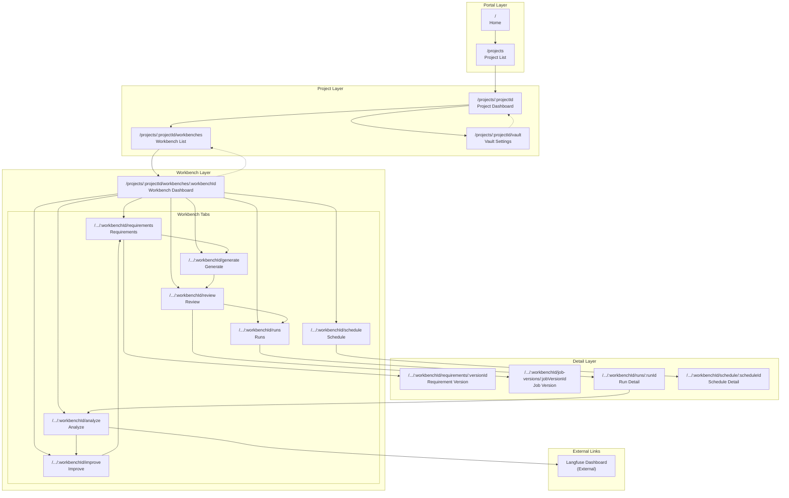

---

## エンティティライフサイクル

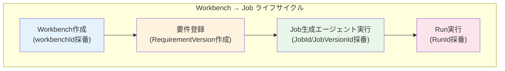

---

## 改善ループ詳細フロー

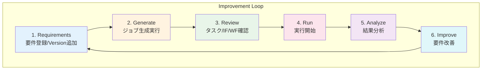

---

## 状態遷移図（Generation/Run）

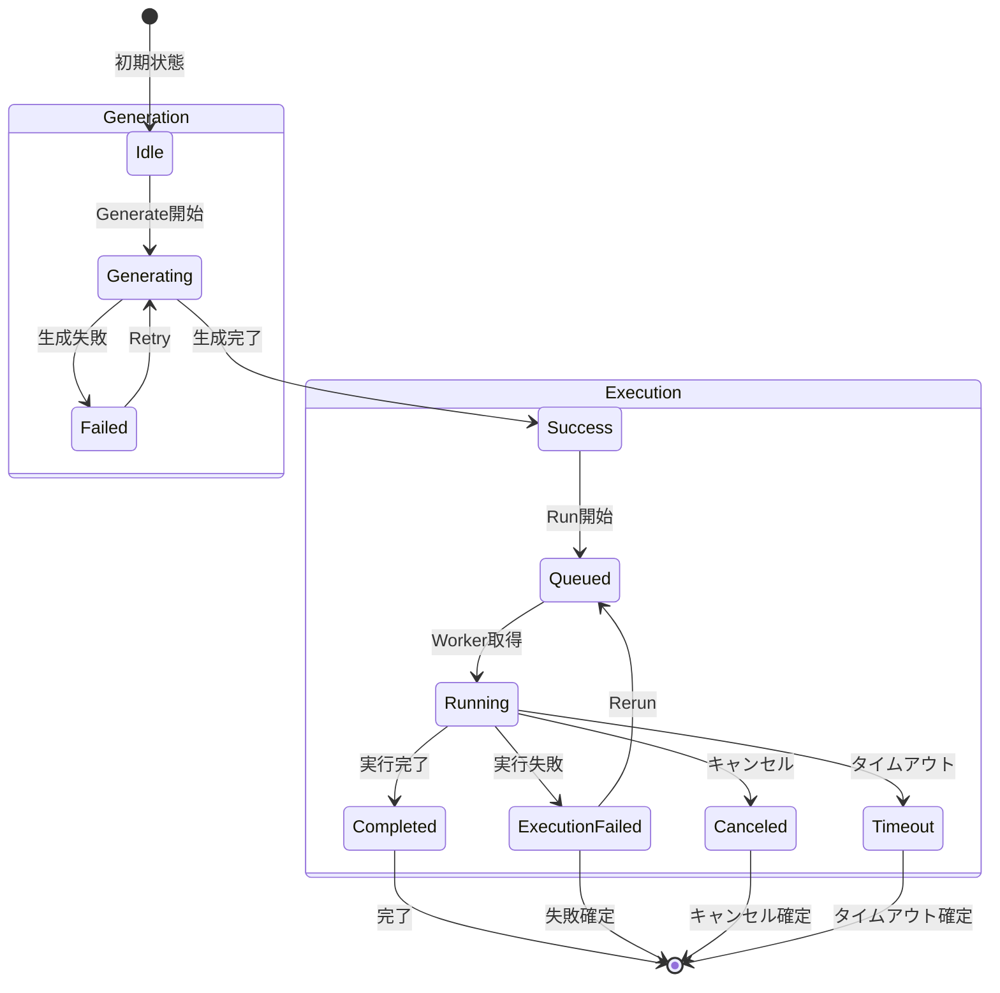

---

## URL設計

### 設計方針

| 方針 | 説明 |
|------|------|
| **階層構造** | Project → Workbench → Tab → Detail の4階層 |
| **命名規則** | 複数形でリスト、単数形で詳細（例: `/workbenches` vs `/workbenches/:id`） |
| **エンティティ明示** | `job-versions`（JobVersion）と `requirements`（RequirementVersion）を区別 |
| **Deep Link対応** | 全画面がURLから直接アクセス可能 |

### ルーティング構造

| Path | 画面名 | 説明 |
|------|-------|------|
| `/` | Home | ランディングページ |
| `/projects` | Project List | プロジェクト一覧 |
| `/projects/:projectId` | Project Dashboard | プロジェクト詳細・ダッシュボード |
| `/projects/:projectId/workbenches` | Workbench List | Workbench一覧 |
| `/projects/:projectId/vault` | Vault Settings | myVault設定（APIキー等） |

**Workbench配下:**

| Path | 画面名 | 説明 |
|------|-------|------|
| `.../workbenches/:workbenchId` | Workbench Dashboard | Workbench詳細（タブナビ起点） |
| `.../workbenches/:workbenchId/requirements` | Requirements | 要件一覧・管理 |
| `.../workbenches/:workbenchId/requirements/:reqVersionId` | Requirement Version | 要件バージョン詳細・diff |
| `.../workbenches/:workbenchId/generate` | Generate | ジョブ生成画面 |
| `.../workbenches/:workbenchId/review` | Review | 生成結果一覧（JobVersion一覧） |
| `.../workbenches/:workbenchId/job-versions/:jobVersionId` | Job Version Detail | JobVersion詳細（タスク/IF/WF） |
| `.../workbenches/:workbenchId/runs` | Runs | 実行履歴一覧 |
| `.../workbenches/:workbenchId/runs/:runId` | Run Detail | 実行詳細・ログ |
| `.../workbenches/:workbenchId/analyze` | Analyze | 分析・Langfuse連携 |
| `.../workbenches/:workbenchId/improve` | Improve | 要件改善 |
| `.../workbenches/:workbenchId/schedule` | Schedule | スケジュール管理 |
| `.../workbenches/:workbenchId/schedule/:scheduleId` | Schedule Detail | スケジュール詳細 |

### URL設計の根拠

```
/projects/:projectId/workbenches/:workbenchId/job-versions/:jobVersionId
                                              ^^^^^^^^^^^^
                                              「job-versions」を使用する理由:
                                              - RequirementVersionとの区別を明確化
                                              - 「versions」だけでは曖昧
                                              - Job生成後に採番されるエンティティであることを示す
```

### エンティティとURLパスの対応

| エンティティ | URLセグメント | 例 |
|------------|--------------|-----|
| Project | `/projects/:projectId` | `/projects/proj_001` |
| Workbench | `/workbenches/:workbenchId` | `/workbenches/wb_abc123` |
| RequirementVersion | `/requirements/:reqVersionId` | `/requirements/rv_v1` |
| JobVersion | `/job-versions/:jobVersionId` | `/job-versions/jv_xyz789` |
| Run | `/runs/:runId` | `/runs/run_123` |
| Schedule | `/schedule/:scheduleId` | `/schedule/sched_456` |

### Deep Link対応

すべての画面はURLから直接アクセス可能：

```bash
# 特定のWorkbench詳細
/projects/proj_001/workbenches/wb_abc123

# 特定の要件バージョン（diff表示可能）
/projects/proj_001/workbenches/wb_abc123/requirements/rv_v2

# 特定のJobVersion（タスク/IF/WF詳細）
/projects/proj_001/workbenches/wb_abc123/job-versions/jv_xyz789

# 特定のRun詳細（ログ/trace）
/projects/proj_001/workbenches/wb_abc123/runs/run_123

# 特定のスケジュール詳細
/projects/proj_001/workbenches/wb_abc123/schedule/sched_456
```

### 画面遷移とURL変化

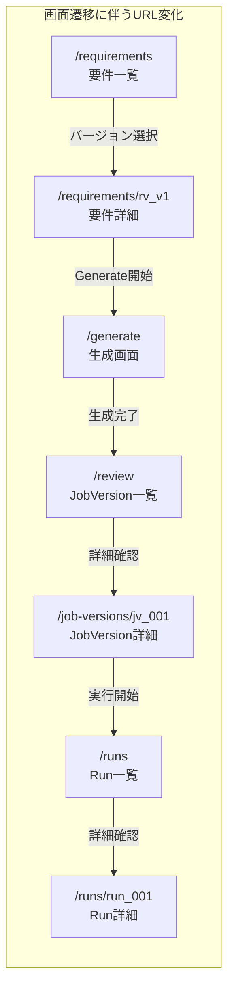

---

## 画面コンポーネント階層

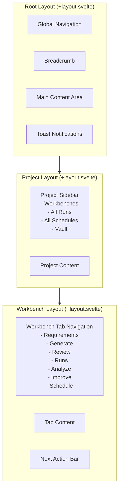

---

## ナビゲーションパターン

### グローバルナビゲーション

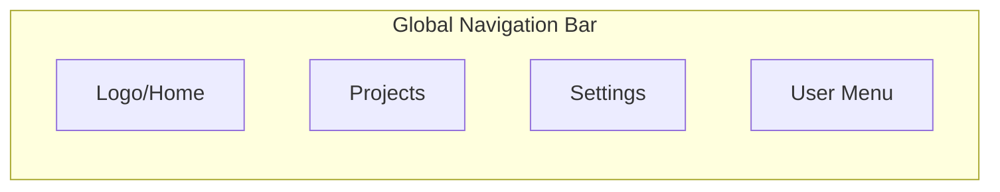

### Project内ナビゲーション

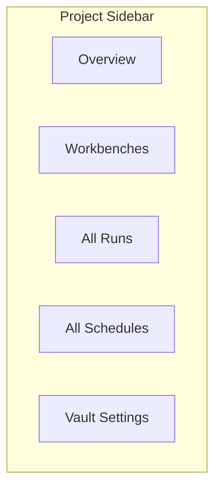

### Workbench内タブナビゲーション

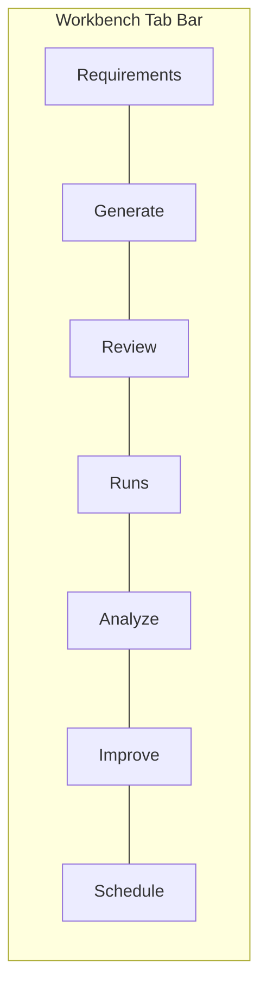

---

## 画面間データフロー

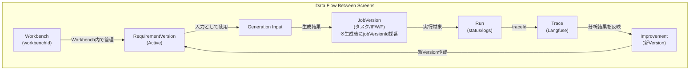

---

## Next Action Bar パターン

各画面での「次にやること」を表示する共通コンポーネント：

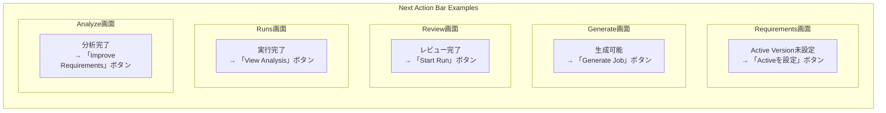

---

## エラー状態の遷移

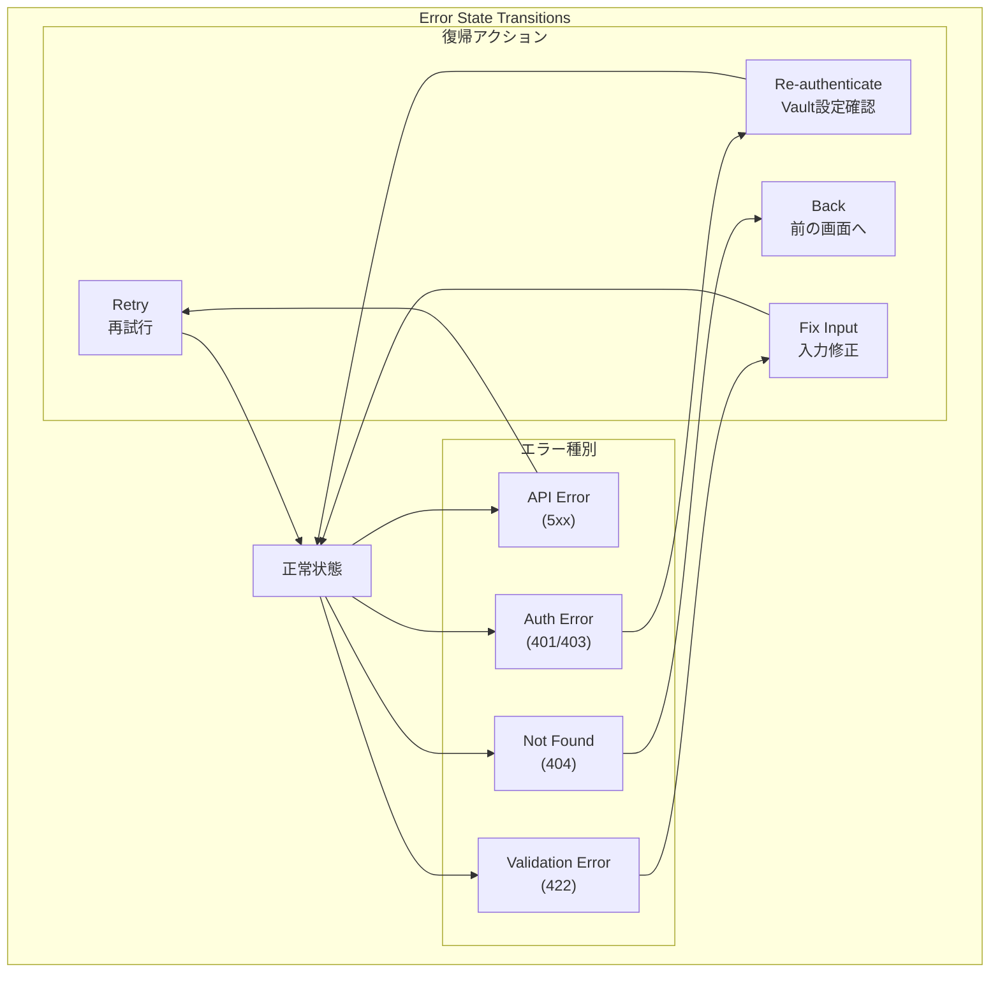

---

## プロジェクト間アクセス制御

### 設計方針

プロジェクト間のデータ分離を保証し、URLの直接アクセスや改ざんによる不正アクセスを防止する。

### アクセス制御の境界

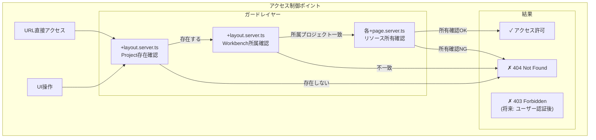

### ガードロジック実装

#### Project レイヤーガード

```typescript
// src/routes/projects/[projectId]/+layout.server.ts
import { error } from '@sveltejs/kit';
import type { LayoutServerLoad } from './$types';
import { db } from '$lib/server/db';
import { project } from '$lib/server/db/schema';
import { eq } from 'drizzle-orm';

export const load: LayoutServerLoad = async ({ params, locals }) => {
  // 1. Project存在確認
  const projectData = await db.query.project.findFirst({
    where: eq(project.id, params.projectId)
  });

  if (!projectData) {
    throw error(404, {
      message: 'プロジェクトが見つかりません',
      code: 'PROJECT_NOT_FOUND'
    });
  }

  // 2. [将来] ユーザーのプロジェクトアクセス権限確認
  // if (locals.user && !hasProjectAccess(locals.user.id, projectData.id)) {
  //   throw error(403, {
  //     message: 'このプロジェクトへのアクセス権限がありません',
  //     code: 'PROJECT_ACCESS_DENIED'
  //   });
  // }

  return {
    project: projectData
  };
};
```

#### Workbench レイヤーガード

```typescript
// src/routes/projects/[projectId]/workbenches/[workbenchId]/+layout.server.ts
import { error } from '@sveltejs/kit';
import type { LayoutServerLoad } from './$types';
import { db } from '$lib/server/db';
import { workbench } from '$lib/server/db/schema';
import { eq, and } from 'drizzle-orm';

export const load: LayoutServerLoad = async ({ params, parent }) => {
  // 親レイアウトからProject情報を取得
  const { project } = await parent();

  // 1. Workbench存在確認
  const workbenchData = await db.query.workbench.findFirst({
    where: eq(workbench.id, params.workbenchId)
  });

  if (!workbenchData) {
    throw error(404, {
      message: 'ワークベンチが見つかりません',
      code: 'WORKBENCH_NOT_FOUND'
    });
  }

  // 2. Workbench → Project 所属確認（重要）
  if (workbenchData.projectId !== project.id) {
    // URLのprojectIdとWorkbenchの所属projectIdが一致しない場合
    // 情報漏洩を防ぐため、存在しないように見せる
    throw error(404, {
      message: 'ワークベンチが見つかりません',
      code: 'WORKBENCH_NOT_FOUND'
    });
  }

  return {
    workbench: workbenchData
  };
};
```

#### リソースレイヤーガード

```typescript
// src/routes/projects/[projectId]/workbenches/[workbenchId]/runs/[runId]/+page.server.ts
import { error } from '@sveltejs/kit';
import type { PageServerLoad } from './$types';
import { db } from '$lib/server/db';
import { run } from '$lib/server/db/schema';
import { eq } from 'drizzle-orm';

export const load: PageServerLoad = async ({ params, parent }) => {
  // 親レイアウトからWorkbench情報を取得
  const { workbench } = await parent();

  // 1. Run存在確認
  const runData = await db.query.run.findFirst({
    where: eq(run.id, params.runId)
  });

  if (!runData) {
    throw error(404, {
      message: '実行履歴が見つかりません',
      code: 'RUN_NOT_FOUND'
    });
  }

  // 2. Run → Workbench 所属確認
  if (runData.workbenchId !== workbench.id) {
    throw error(404, {
      message: '実行履歴が見つかりません',
      code: 'RUN_NOT_FOUND'
    });
  }

  return {
    run: runData
  };
};
```

### アクセス制御マトリクス

| リソース | 確認対象 | ガードロジック | エラー時レスポンス |
|---------|---------|--------------|------------------|
| Project | projectId存在 | `+layout.server.ts` | 404 |
| Workbench | workbenchId存在 + projectId一致 | `+layout.server.ts` | 404 |
| RequirementVersion | reqVersionId存在 + workbenchId一致 | `+page.server.ts` | 404 |
| JobVersion | jobVersionId存在 + workbenchId一致 | `+page.server.ts` | 404 |
| Run | runId存在 + workbenchId一致 | `+page.server.ts` | 404 |
| Schedule | scheduleId存在 + workbenchId一致 | `+page.server.ts` | 404 |

### セキュリティ考慮事項

#### 情報漏洩防止

```typescript
// 悪意あるアクセス例:
// /projects/proj_002/workbenches/wb_001  (wb_001はproj_001所属)

// NG: 詳細なエラーメッセージ（情報漏洩）
throw error(403, 'このワークベンチはproj_001に所属しています');

// OK: 存在しないように見せる（推奨）
throw error(404, 'ワークベンチが見つかりません');
```

#### IDの推測防止

```typescript
// 連番IDの場合、総当たり攻撃で他プロジェクトのリソースを探索可能
// → UUIDまたはULIDを使用して推測困難にする

// NG: 連番ID
const id = 'run_123';

// OK: UUID/ULID
const id = 'run_01HQXYZ123456789ABCDEF';
```

### 将来のユーザー認証統合

Phase 2でユーザー認証を実装する際の拡張ポイント：

```typescript
// src/hooks.server.ts
import type { Handle } from '@sveltejs/kit';
import { verifyToken } from '$lib/server/auth';

export const handle: Handle = async ({ event, resolve }) => {
  // JWTトークンの検証
  const token = event.cookies.get('auth_token');
  if (token) {
    try {
      const user = await verifyToken(token);
      event.locals.user = user;
    } catch {
      event.cookies.delete('auth_token', { path: '/' });
    }
  }

  return resolve(event);
};

// src/routes/projects/[projectId]/+layout.server.ts
export const load: LayoutServerLoad = async ({ params, locals }) => {
  const projectData = await db.query.project.findFirst({
    where: eq(project.id, params.projectId)
  });

  if (!projectData) {
    throw error(404, 'プロジェクトが見つかりません');
  }

  // ユーザー認証が有効な場合のみアクセス権限チェック
  if (locals.user) {
    const hasAccess = await checkProjectAccess(locals.user.id, projectData.id);
    if (!hasAccess) {
      throw error(403, 'このプロジェクトへのアクセス権限がありません');
    }
  }

  return { project: projectData };
};
```

### クライアントサイドの補完ガード

サーバーサイドガードに加え、UIでも不正な遷移を防止：

```svelte
<!-- src/lib/components/layout/ProjectGuard.svelte -->
<script lang="ts">
  import { page } from '$app/stores';
  import { goto } from '$app/navigation';
  import type { Snippet } from 'svelte';

  let { children, projectId }: {
    children: Snippet;
    projectId: string;
  } = $props();

  // URLのprojectIdと現在選択中のprojectIdの整合性チェック
  $effect(() => {
    const urlProjectId = $page.params.projectId;
    if (urlProjectId && urlProjectId !== projectId) {
      // 不整合を検出した場合、正しいURLにリダイレクト
      console.warn('Project ID mismatch detected, redirecting...');
      goto(`/projects/${projectId}`);
    }
  });
</script>

{@render children()}
```

---

## SvelteKit ルーティング構造

```
src/routes/
├── +layout.svelte              # Root layout (Global Nav, Toast)
├── +page.svelte                # Home (/)
├── projects/
│   ├── +layout.svelte          # Projects layout
│   ├── +page.svelte            # Project List (/projects)
│   └── [projectId]/
│       ├── +layout.svelte      # Project layout (Sidebar)
│       ├── +page.svelte        # Project Dashboard
│       ├── vault/
│       │   └── +page.svelte    # Vault Settings
│       └── workbenches/
│           ├── +page.svelte    # Workbench List
│           └── [workbenchId]/
│               ├── +layout.svelte    # Workbench layout (Tabs, Action Bar)
│               ├── +page.svelte      # Workbench Dashboard (redirect to requirements)
│               ├── requirements/
│               │   ├── +page.svelte  # Requirements List
│               │   └── [reqVersionId]/
│               │       └── +page.svelte  # Requirement Version Detail
│               ├── generate/
│               │   └── +page.svelte  # Generate
│               ├── review/
│               │   └── +page.svelte  # Review (JobVersion List)
│               ├── job-versions/
│               │   └── [jobVersionId]/
│               │       └── +page.svelte  # Job Version Detail
│               ├── runs/
│               │   ├── +page.svelte  # Runs List
│               │   └── [runId]/
│               │       └── +page.svelte  # Run Detail
│               ├── analyze/
│               │   └── +page.svelte  # Analyze
│               ├── improve/
│               │   └── +page.svelte  # Improve
│               └── schedule/
│                   ├── +page.svelte  # Schedule List
│                   └── [scheduleId]/
│                       └── +page.svelte  # Schedule Detail
```

---

## 画面一覧サマリ

| # | 画面名 | URL | 主要機能 | 関連Issue |
|---|-------|-----|---------|----------|
| 1 | Home | `/` | ランディング、Project選択へ誘導 | - |
| 2 | Project List | `/projects` | プロジェクト一覧、作成 | - |
| 3 | Project Dashboard | `/projects/:id` | プロジェクト概要、Workbench一覧へ誘導 | - |
| 4 | Vault Settings | `/projects/:id/vault` | APIキー設定、疎通確認 | Issue 6 |
| 5 | Workbench List | `/projects/:id/workbenches` | Workbench一覧、作成 | Issue 2 |
| 6 | Workbench Dashboard | `.../workbenches/:wbId` | Workbench概要、タブナビ | Issue 2 |
| 7 | Requirements | `.../requirements` | 要件一覧、Version管理 | Issue 7 |
| 8 | Requirement Version | `.../requirements/:rvId` | 要件詳細、diff表示 | Issue 7 |
| 9 | Generate | `.../generate` | ジョブ生成実行、状態表示 | Issue 8 |
| 10 | Review | `.../review` | JobVersion一覧、選択 | Issue 8 |
| 11 | Job Version Detail | `.../job-versions/:jvId` | タスク/IF/WF詳細表示 | Issue 8 |
| 12 | Runs | `.../runs` | 実行履歴一覧 | Issue 9 |
| 13 | Run Detail | `.../runs/:runId` | 実行詳細、ログ、trace | Issue 9, 11 |
| 14 | Analyze | `.../analyze` | Langfuse連携、分析 | Issue 11 |
| 15 | Improve | `.../improve` | 要件改善、新Version作成 | Issue 11 |
| 16 | Schedule | `.../schedule` | スケジュール一覧、作成 | Issue 10 |
| 17 | Schedule Detail | `.../schedule/:schedId` | スケジュール詳細、編集 | Issue 10 |

---

## ID採番タイミング

| エンティティ | ID例 | URLセグメント | 採番タイミング |
|------------|------|--------------|---------------|
| Project | `proj_001` | `:projectId` | プロジェクト作成時 |
| Workbench | `wb_abc123` | `:workbenchId` | Workbench作成時 |
| RequirementVersion | `rv_v1`, `rv_v2` | `:reqVersionId` | 要件登録/更新時 |
| JobVersion | `jv_v1.1`, `jv_v2.3` | `:jobVersionId` | Job生成エージェント実行完了時 |
| Run | `run_123` | `:runId` | 実行開始時 |
| Schedule | `sched_456` | `:scheduleId` | スケジュール登録時 |

---

## バージョン管理体系

### バージョン番号形式: `vN.M`

JobVersionは `vN.M` 形式でバージョン管理されます。

| 要素 | 意味 | 説明 |
|------|------|------|
| **N** | 要件定義バージョン | RequirementVersionの番号（v1, v2, v3...） |
| **M** | 生成回数 | 同一要件からのJob生成ワークフロー実行回数（.1, .2, .3...） |

### バージョン採番例

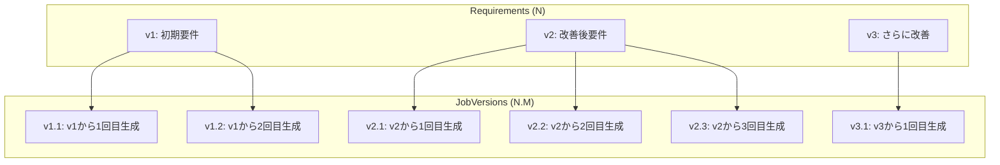

### 再生成が必要になる理由

同一の要件定義（N）から複数回Job生成（M）を行う理由：

| 理由 | 説明 |
|------|------|
| **LLMの進化** | モデルバージョンアップによる出力品質の変化 |
| **定義ファイルの変更** | Agent定義、IF定義、ワークフローテンプレートの更新 |
| **LLMの非決定性** | 同一入力でも微妙に異なる出力が生成される |
| **プロンプト調整** | システムプロンプトやFew-shot例の改善 |

### URL例（バージョン付き）

```bash
# 要件バージョン v2 の詳細
/projects/proj_001/workbenches/wb_abc123/requirements/rv_v2

# JobVersion v2.3 の詳細（要件v2から3回目の生成）
/projects/proj_001/workbenches/wb_abc123/job-versions/jv_v2.3

# JobVersion v2.3 を使用した Run の詳細
/projects/proj_001/workbenches/wb_abc123/runs/run_123
# → Run詳細画面で「Job Version: v2.3」と表示
```

### 画面でのバージョン表示

| 画面 | 表示内容 |
|------|---------|
| **Requirements** | v1, v2, v3（N のみ表示） |
| **Review / Job Version一覧** | v1.1, v1.2, v2.1, v2.2, v2.3（N.M 形式で表示） |
| **Runs一覧** | 各RunにJob Version列（v2.3等）を表示 |
| **Run詳細** | 「Job Version: v2.3」を明示表示 |
| **Analyze** | 実行時のJob Versionを参照表示 |

---

## パンくずリスト例

```
Home > Projects > proj_001 > Workbenches > wb_abc123 > Requirements > rv_v2
Home > Projects > proj_001 > Workbenches > wb_abc123 > Job Versions > jv_xyz789
Home > Projects > proj_001 > Workbenches > wb_abc123 > Runs > run_123
```

---

**作成日**: 2025-12-14
**更新日**: 2025-12-14
**対象Issue**: #279 myAgentDesk再構築
**関連ドキュメント**: `requirements.md`
