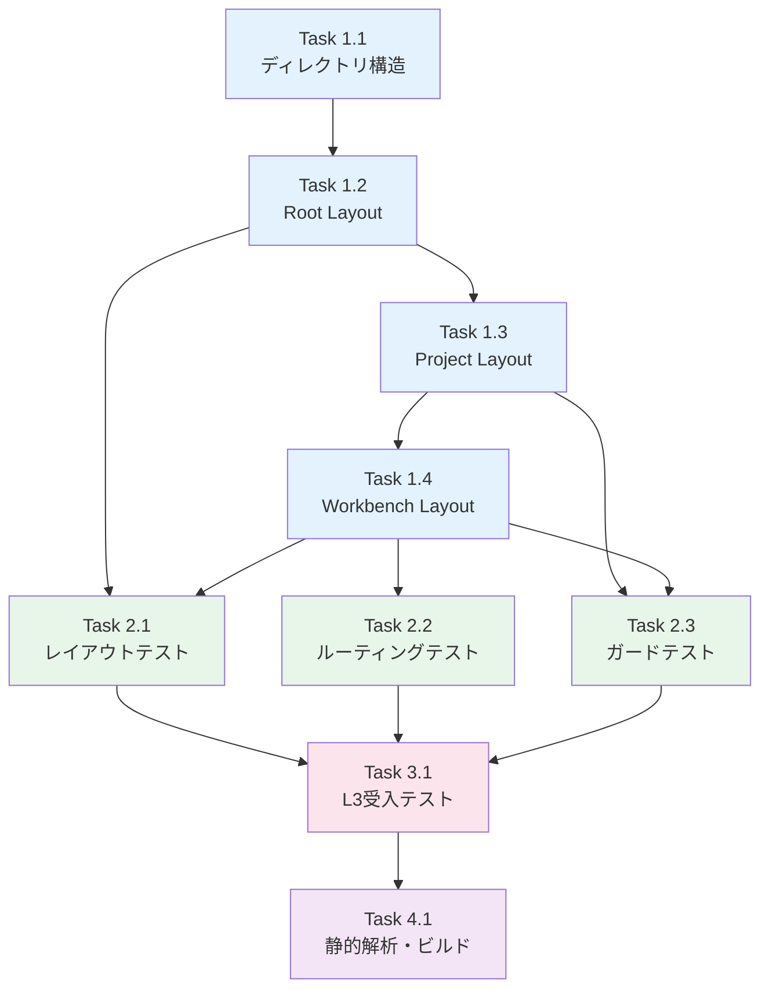

# 作業計画書: Issue #285 - SvelteKitルーティング基盤

## Issue概要

```markdown
## Issue: [myAgentDesk] #279-1: SvelteKitルーティング基盤
**Issue番号**: #285
**GitHub URL**: https://github.com/Kewton/MySwiftAgent/issues/285
**サイズ**: M (3 SP)
**作業見積**: 8時間（1日）
**優先度**: P0 (Blocker)
**依存Issue**: なし（Phase 1 最初のIssue）
**ブロック対象**: #288, #289, #296
```

---

## 詳細タスク分解

### Phase 1: ルーティング構造実装（4時間）

#### Task 1.1: ディレクトリ構造作成
- **所要時間**: 1時間
- **成果物**: `src/routes/` 配下の全ディレクトリ
- **依存**: なし

**作成するディレクトリ構造（screen-transition.md準拠）**:
```
src/routes/
├── +layout.svelte              # Root layout
├── +page.svelte                # Home (/)
├── +error.svelte               # グローバルエラーページ
├── projects/
│   ├── +layout.svelte          # Projects layout
│   ├── +page.svelte            # Project List (/projects)
│   └── [projectId]/
│       ├── +layout.svelte      # Project layout (Sidebar)
│       ├── +layout.server.ts   # Project ガード
│       ├── +page.svelte        # Project Dashboard
│       ├── vault/
│       │   └── +page.svelte    # Vault Settings
│       └── workbenches/
│           ├── +page.svelte    # Workbench List
│           └── [workbenchId]/
│               ├── +layout.svelte    # Workbench layout (Tabs)
│               ├── +layout.server.ts # Workbench ガード
│               ├── +page.svelte      # Redirect to requirements
│               ├── requirements/
│               │   ├── +page.svelte
│               │   └── [reqVersionId]/
│               │       └── +page.svelte
│               ├── generate/
│               │   └── +page.svelte
│               ├── review/
│               │   └── +page.svelte
│               ├── job-versions/
│               │   └── [jobVersionId]/
│               │       └── +page.svelte
│               ├── runs/
│               │   ├── +page.svelte
│               │   └── [runId]/
│               │       └── +page.svelte
│               ├── analyze/
│               │   └── +page.svelte
│               ├── improve/
│               │   └── +page.svelte
│               └── schedule/
│                   ├── +page.svelte
│                   └── [scheduleId]/
│                       └── +page.svelte
```

---

#### Task 1.2: Root Layout実装
- **所要時間**: 1時間
- **成果物**:
  - `src/routes/+layout.svelte`
  - `src/lib/components/layout/GlobalNav.svelte`
  - `src/lib/components/layout/Breadcrumb.svelte`
  - `src/lib/components/ui/Toast.svelte`
- **依存**: Task 1.1

**実装内容**:
- グローバルナビゲーション（Logo, Projects, Settings, User Menu）
- パンくずリスト（Breadcrumb）コンポーネント
- Toast通知コンテナ
- TailwindCSS基本スタイル適用

---

#### Task 1.3: Project Layout実装
- **所要時間**: 1時間
- **成果物**:
  - `src/routes/projects/[projectId]/+layout.svelte`
  - `src/routes/projects/[projectId]/+layout.server.ts`
  - `src/lib/components/layout/ProjectSidebar.svelte`
- **依存**: Task 1.2

**実装内容**:
- Project サイドバー（Overview, Workbenches, All Runs, All Schedules, Vault）
- Project存在確認ガード（+layout.server.ts）
- 404エラー処理

---

#### Task 1.4: Workbench Layout実装
- **所要時間**: 1時間
- **成果物**:
  - `src/routes/projects/[projectId]/workbenches/[workbenchId]/+layout.svelte`
  - `src/routes/projects/[projectId]/workbenches/[workbenchId]/+layout.server.ts`
  - `src/lib/components/layout/WorkbenchTabs.svelte`
  - `src/lib/components/layout/NextActionBar.svelte`
- **依存**: Task 1.3

**実装内容**:
- タブナビゲーション（7タブ: Requirements, Generate, Review, Runs, Analyze, Improve, Schedule）
- URL駆動タブ選択（$page.url.searchParams）
- Next Action Bar（状態に応じた次アクション表示）
- Workbench所属確認ガード（+layout.server.ts）

---

### Phase 2: 単体テスト（2.5時間）

#### Task 2.1: レイアウトコンポーネントテスト
- **所要時間**: 1時間
- **成果物**: `src/tests/unit/layout/`
- **カバレッジ目標**: 90%以上

**テストケース**:
- `GlobalNav.svelte`: ナビゲーションリンクの表示
- `Breadcrumb.svelte`: パス変換、クリック動作
- `ProjectSidebar.svelte`: メニュー項目の表示・選択状態
- `WorkbenchTabs.svelte`: タブ切り替え、URL連動

---

#### Task 2.2: ルーティングテスト
- **所要時間**: 1時間
- **成果物**: `src/tests/unit/routes/`
- **カバレッジ目標**: 90%以上

**テストケース**:
- 全17画面のURLパスが正しく解決される
- パラメータ（`:projectId`, `:workbenchId`等）が正しく取得できる
- 存在しないパスで404が返る

---

#### Task 2.3: ガードロジックテスト
- **所要時間**: 0.5時間
- **成果物**: `src/tests/unit/guards/`
- **カバレッジ目標**: 90%以上

**テストケース**:
- Project存在確認（+layout.server.ts）
- Workbench所属確認（+layout.server.ts）
- 不正アクセス時の404レスポンス

---

### Phase 3: L3受入テスト（1時間）

#### Task 3.1: L3受入テスト計画・実行
- **所要時間**: 1時間
- **成果物**: `tests/acceptance/test_issue_285_acceptance.sh`

**テストシナリオ**: 下記「L3受入テスト計画」セクション参照

---

### Phase 4: 品質確認・ドキュメント（0.5時間）

#### Task 4.1: 静的解析・ビルド確認
- **所要時間**: 0.5時間
- **成果物**: CI/CDグリーン確認

**確認項目**:
- `npm run type-check`: TypeScriptエラーゼロ
- `npm run lint`: ESLintエラーゼロ
- `npm run build`: ビルド成功

---

## タスク依存関係



---

## 作業スケジュール

### Day 1（8時間）

| 時間 | タスク | 成果物 |
|------|-------|--------|
| 09:00-10:00 | Task 1.1: ディレクトリ構造作成 | `src/routes/` 全構造 |
| 10:00-11:00 | Task 1.2: Root Layout実装 | GlobalNav, Breadcrumb, Toast |
| 11:00-12:00 | Task 1.3: Project Layout実装 | ProjectSidebar, ガード |
| 13:00-14:00 | Task 1.4: Workbench Layout実装 | WorkbenchTabs, NextActionBar |
| 14:00-15:00 | Task 2.1: レイアウトテスト | 単体テスト |
| 15:00-16:00 | Task 2.2: ルーティングテスト | 単体テスト |
| 16:00-16:30 | Task 2.3: ガードテスト | 単体テスト |
| 16:30-17:30 | Task 3.1: L3受入テスト | 受入テストスクリプト |
| 17:30-18:00 | Task 4.1: 品質確認 | CI/CDグリーン |

**総作業時間**: 8時間（1日）

---

## チェックポイント

| タイミング | 確認事項 | 対応 |
|-----------|---------|------|
| Task 1.2完了時 | GlobalNavが表示される | `npm run dev` で確認 |
| Task 1.4完了時 | 全17画面に遷移可能 | URL直打ちで確認 |
| Phase 2完了時 | テストカバレッジ90%以上 | `npm run test:coverage` |
| Phase 3完了時 | L3受入テスト全パス | 受入テストスクリプト実行 |
| PR作成前 | CI/CDパス | `./scripts/pre-push-check.sh` |

---

## リスクと対策

| リスク | 発生確率 | 影響 | 対策 |
|-------|---------|------|------|
| Svelte 5 runes API の理解不足 | 中 | 実装遅延1-2時間 | 公式ドキュメント参照、モックアップのコード参考 |
| レイアウトネストの複雑さ | 低 | 実装遅延30分 | SvelteKit公式ドキュメントで確認 |
| ガードロジックの型定義 | 低 | 実装遅延30分 | `$types.d.ts` 自動生成確認 |

---

## 成果物チェックリスト

### コード

#### ディレクトリ構造
- [ ] `src/routes/+layout.svelte` (Root Layout)
- [ ] `src/routes/+page.svelte` (Home)
- [ ] `src/routes/+error.svelte` (エラーページ)
- [ ] `src/routes/projects/+layout.svelte`
- [ ] `src/routes/projects/+page.svelte`
- [ ] `src/routes/projects/[projectId]/+layout.svelte`
- [ ] `src/routes/projects/[projectId]/+layout.server.ts`
- [ ] `src/routes/projects/[projectId]/+page.svelte`
- [ ] `src/routes/projects/[projectId]/vault/+page.svelte`
- [ ] `src/routes/projects/[projectId]/workbenches/+page.svelte`
- [ ] `src/routes/projects/[projectId]/workbenches/[workbenchId]/+layout.svelte`
- [ ] `src/routes/projects/[projectId]/workbenches/[workbenchId]/+layout.server.ts`
- [ ] `src/routes/projects/[projectId]/workbenches/[workbenchId]/+page.svelte`
- [ ] `src/routes/projects/[projectId]/workbenches/[workbenchId]/requirements/+page.svelte`
- [ ] `src/routes/projects/[projectId]/workbenches/[workbenchId]/requirements/[reqVersionId]/+page.svelte`
- [ ] `src/routes/projects/[projectId]/workbenches/[workbenchId]/generate/+page.svelte`
- [ ] `src/routes/projects/[projectId]/workbenches/[workbenchId]/review/+page.svelte`
- [ ] `src/routes/projects/[projectId]/workbenches/[workbenchId]/job-versions/[jobVersionId]/+page.svelte`
- [ ] `src/routes/projects/[projectId]/workbenches/[workbenchId]/runs/+page.svelte`
- [ ] `src/routes/projects/[projectId]/workbenches/[workbenchId]/runs/[runId]/+page.svelte`
- [ ] `src/routes/projects/[projectId]/workbenches/[workbenchId]/analyze/+page.svelte`
- [ ] `src/routes/projects/[projectId]/workbenches/[workbenchId]/improve/+page.svelte`
- [ ] `src/routes/projects/[projectId]/workbenches/[workbenchId]/schedule/+page.svelte`
- [ ] `src/routes/projects/[projectId]/workbenches/[workbenchId]/schedule/[scheduleId]/+page.svelte`

#### コンポーネント
- [ ] `src/lib/components/layout/GlobalNav.svelte`
- [ ] `src/lib/components/layout/Breadcrumb.svelte`
- [ ] `src/lib/components/layout/ProjectSidebar.svelte`
- [ ] `src/lib/components/layout/WorkbenchTabs.svelte`
- [ ] `src/lib/components/layout/NextActionBar.svelte`
- [ ] `src/lib/components/ui/Toast.svelte`

### テスト
- [ ] `src/tests/unit/layout/GlobalNav.test.ts`
- [ ] `src/tests/unit/layout/Breadcrumb.test.ts`
- [ ] `src/tests/unit/layout/ProjectSidebar.test.ts`
- [ ] `src/tests/unit/layout/WorkbenchTabs.test.ts`
- [ ] `src/tests/unit/routes/routing.test.ts`
- [ ] `src/tests/unit/guards/project-guard.test.ts`
- [ ] `src/tests/unit/guards/workbench-guard.test.ts`
- [ ] `tests/acceptance/test_issue_285_acceptance.sh`

---

## L3受入テスト計画

### Step 1: サービス起動確認

```bash
# サービス起動
cd /Users/maenokota/share/work/github_kewton/MySwiftAgent/myAgentDesk
npm run dev &
sleep 5

# ヘルスチェック
curl -sf http://localhost:8000/ && echo "✅ myAgentDesk: healthy"
```

### Step 2: ルーティング正常系テスト

```bash
# Home画面
curl -sf http://localhost:8000/ -o /dev/null && echo "✅ GET / : 200 OK"

# Projects一覧
curl -sf http://localhost:8000/projects -o /dev/null && echo "✅ GET /projects : 200 OK"

# Project詳細（モックデータ: proj_001）
curl -sf http://localhost:8000/projects/proj_001 -o /dev/null && echo "✅ GET /projects/proj_001 : 200 OK"

# Vault設定
curl -sf http://localhost:8000/projects/proj_001/vault -o /dev/null && echo "✅ GET /projects/proj_001/vault : 200 OK"

# Workbench一覧
curl -sf http://localhost:8000/projects/proj_001/workbenches -o /dev/null && echo "✅ GET /projects/proj_001/workbenches : 200 OK"

# Workbench詳細（モックデータ: wb_001）
curl -sf http://localhost:8000/projects/proj_001/workbenches/wb_001 -o /dev/null && echo "✅ GET /workbenches/wb_001 : 200 OK"

# Requirements タブ
curl -sf http://localhost:8000/projects/proj_001/workbenches/wb_001/requirements -o /dev/null && echo "✅ GET /requirements : 200 OK"

# Generate タブ
curl -sf http://localhost:8000/projects/proj_001/workbenches/wb_001/generate -o /dev/null && echo "✅ GET /generate : 200 OK"

# Review タブ
curl -sf http://localhost:8000/projects/proj_001/workbenches/wb_001/review -o /dev/null && echo "✅ GET /review : 200 OK"

# Runs タブ
curl -sf http://localhost:8000/projects/proj_001/workbenches/wb_001/runs -o /dev/null && echo "✅ GET /runs : 200 OK"

# Analyze タブ
curl -sf http://localhost:8000/projects/proj_001/workbenches/wb_001/analyze -o /dev/null && echo "✅ GET /analyze : 200 OK"

# Improve タブ
curl -sf http://localhost:8000/projects/proj_001/workbenches/wb_001/improve -o /dev/null && echo "✅ GET /improve : 200 OK"

# Schedule タブ
curl -sf http://localhost:8000/projects/proj_001/workbenches/wb_001/schedule -o /dev/null && echo "✅ GET /schedule : 200 OK"
```

### Step 3: ルーティング異常系テスト

```bash
# 存在しないパス → 404
HTTP_CODE=$(curl -s -o /dev/null -w "%{http_code}" http://localhost:8000/invalid)
if [ "$HTTP_CODE" = "404" ]; then
  echo "✅ GET /invalid : 404 Not Found (expected)"
else
  echo "❌ GET /invalid : $HTTP_CODE (expected 404)"
fi

# 存在しないプロジェクト → 404
HTTP_CODE=$(curl -s -o /dev/null -w "%{http_code}" http://localhost:8000/projects/nonexistent)
if [ "$HTTP_CODE" = "404" ]; then
  echo "✅ GET /projects/nonexistent : 404 Not Found (expected)"
else
  echo "❌ GET /projects/nonexistent : $HTTP_CODE (expected 404)"
fi
```

### Step 4: レイアウト構造確認

```bash
# HTMLにレイアウト要素が含まれているか確認
curl -s http://localhost:8000/projects/proj_001/workbenches/wb_001/requirements | grep -q "GlobalNav" && echo "✅ GlobalNav present"
curl -s http://localhost:8000/projects/proj_001/workbenches/wb_001/requirements | grep -q "Breadcrumb" && echo "✅ Breadcrumb present"
curl -s http://localhost:8000/projects/proj_001/workbenches/wb_001/requirements | grep -q "WorkbenchTabs" && echo "✅ WorkbenchTabs present"
```

### Step 5: エビデンス収集

```bash
# レスポンスをファイルに保存
curl -s http://localhost:8000/projects/proj_001/workbenches/wb_001/requirements > /tmp/issue_285_acceptance_response.html

echo "✅ Response saved to /tmp/issue_285_acceptance_response.html"
```

---

## Definition of Done

Issue完了条件：
- [ ] すべてのタスクが完了
- [ ] 全17画面のURLパスがscreen-transition.mdと一致
- [ ] `+layout.svelte`が各階層で正しくネストされる
- [ ] パラメータ（`:projectId`, `:workbenchId`等）が正しく取得できる
- [ ] 単体テストカバレッジ90%以上
- [ ] ESLint/TypeScript エラーゼロ
- [ ] ビルド成功（`npm run build`）
- [ ] **L3受入テスト全パス**
- [ ] コードレビュー承認
- [ ] PR マージ

---

## 次のアクション

作業計画承認後：
1. **ブランチ作成**: `feature/issue/285`
2. **worktree作成**: `./scripts/worktree-create-from-issue.sh 285`
3. **TDD実装開始**: `/tdd-impl 285` でTDD駆動開発
4. **進捗報告**: `/progress-report` で定期報告

---

**作成日**: 2025-12-16
**対象Issue**: #285 SvelteKitルーティング基盤
**親Issue**: #279 myAgentDesk MVP再構築
