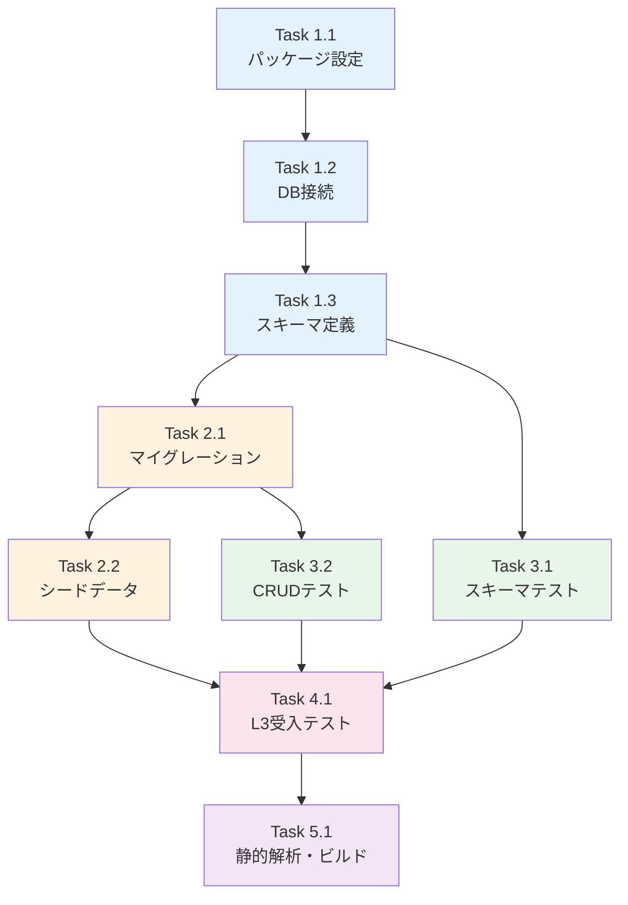

# 作業計画書: Issue #286 - Drizzle ORM + SQLite セットアップ

## Issue概要

```markdown
## Issue: [myAgentDesk] #279-2: Drizzle ORM + SQLite セットアップ
**Issue番号**: #286
**GitHub URL**: https://github.com/Kewton/MySwiftAgent/issues/286
**サイズ**: M (3 SP)
**作業見積**: 8時間（1日）
**優先度**: P0 (Blocker)
**依存Issue**: なし（Phase 1 並列実行可能）
**ブロック対象**: #288 (Project画面), #289 (Workbench画面)
```

---

## 詳細タスク分解

### Phase 1: Drizzle ORM セットアップ（2時間）

#### Task 1.1: パッケージインストール・設定
- **所要時間**: 0.5時間
- **成果物**:
  - `package.json`（依存追加）
  - `drizzle.config.ts`
- **依存**: なし

**インストールパッケージ**:
```bash
npm install drizzle-orm better-sqlite3
npm install -D drizzle-kit @types/better-sqlite3
```

**drizzle.config.ts**:
```typescript
import type { Config } from 'drizzle-kit';

export default {
  schema: './src/lib/server/db/schema.ts',
  out: './src/lib/server/db/migrations',
  driver: 'better-sqlite',
  dbCredentials: {
    url: './data/local.db'
  }
} satisfies Config;
```

---

#### Task 1.2: DB接続モジュール作成
- **所要時間**: 0.5時間
- **成果物**:
  - `src/lib/server/db/index.ts`
  - `data/.gitkeep`
- **依存**: Task 1.1

**実装内容**:
- SQLite/PostgreSQL切替対応のDB接続
- 環境変数（`DATABASE_URL`）による切替
- `.gitignore`に`data/local.db`追加

---

#### Task 1.3: スキーマ定義（6テーブル）
- **所要時間**: 1時間
- **成果物**: `src/lib/server/db/schema.ts`
- **依存**: Task 1.2

**定義するテーブル（er-diagram.md準拠）**:

| テーブル | 主要カラム | FK |
|---------|----------|-----|
| `project` | id, external_project_id, name, description | - |
| `workbench` | id, project_id, name, status, active_requirement_version_id | project.id, requirement_version.id |
| `requirement_version` | id, workbench_id, version, content, status | workbench.id |
| `job_version` | id, workbench_id, source_requirement_version_id, major_version, minor_version, status, task_breakdown, interface_definitions, workflows | workbench.id, requirement_version.id |
| `run` | id, workbench_id, job_version_id, status, external_job_id, external_trace_id | workbench.id, job_version.id |
| `schedule` | id, workbench_id, target_job_version_id, name, cron_expression, is_enabled | workbench.id, job_version.id |

---

### Phase 2: マイグレーション・シードデータ（2時間）

#### Task 2.1: マイグレーション実行
- **所要時間**: 0.5時間
- **成果物**:
  - `src/lib/server/db/migrations/`
  - `data/local.db`
- **依存**: Task 1.3

**実行コマンド**:
```bash
# スキーマをDBに反映
npm run db:push

# package.jsonに追加するスクリプト
"scripts": {
  "db:push": "drizzle-kit push:sqlite",
  "db:generate": "drizzle-kit generate:sqlite",
  "db:studio": "drizzle-kit studio"
}
```

---

#### Task 2.2: シードデータ作成
- **所要時間**: 1.5時間
- **成果物**:
  - `src/lib/server/db/seed.ts`
  - `scripts/db-seed.ts`
- **依存**: Task 2.1

**シードデータ（モックアップデータ移植）**:

```typescript
// Projects (3件)
const projects = [
  { id: 'proj_001', external_project_id: 'default_project', name: 'デフォルトプロジェクト' },
  { id: 'proj_002', external_project_id: 'podcast_project', name: 'ポッドキャスト自動生成' },
  { id: 'proj_003', external_project_id: 'analysis_project', name: 'データ分析プロジェクト' }
];

// Workbenches (5件)
const workbenches = [
  { id: 'wb_001', project_id: 'proj_001', name: 'メール自動返信', status: 'active' },
  { id: 'wb_002', project_id: 'proj_001', name: 'レポート生成', status: 'draft' },
  // ...
];

// RequirementVersions, JobVersions, Runs, Schedules
// モックアップ（pattern-a/+page.svelte）から移植
```

---

### Phase 3: 単体テスト（2.5時間）

#### Task 3.1: スキーマテスト
- **所要時間**: 1時間
- **成果物**: `src/tests/unit/db/schema.test.ts`
- **カバレッジ目標**: 90%以上

**テストケース**:
- 全6テーブルが作成される
- FK制約が正しく設定される
- NOT NULL制約が機能する

---

#### Task 3.2: CRUD操作テスト
- **所要時間**: 1.5時間
- **成果物**: `src/tests/unit/db/crud.test.ts`
- **カバレッジ目標**: 90%以上

**テストケース**:
- 正常系: Project → Workbench → RequirementVersion の階層作成
- 正常系: JobVersion作成時にsource_requirement_version_idが設定される
- 異常系: 存在しないproject_idでWorkbench作成時にFK違反エラー
- 異常系: 存在しないworkbench_idでRun作成時にFK違反エラー

---

### Phase 4: L3受入テスト（1時間）

#### Task 4.1: L3受入テスト計画・実行
- **所要時間**: 1時間
- **成果物**: `tests/acceptance/test_issue_286_acceptance.sh`

**テストシナリオ**: 下記「L3受入テスト計画」セクション参照

---

### Phase 5: 品質確認（0.5時間）

#### Task 5.1: 静的解析・ビルド確認
- **所要時間**: 0.5時間
- **成果物**: CI/CDグリーン確認

**確認項目**:
- `npm run type-check`: TypeScriptエラーゼロ
- `npm run lint`: ESLintエラーゼロ
- `npm run build`: ビルド成功
- `npm run db:push`: マイグレーション成功（冪等）

---

## タスク依存関係



---

## 作業スケジュール

### Day 1（8時間）

| 時間 | タスク | 成果物 |
|------|-------|--------|
| 09:00-09:30 | Task 1.1: パッケージ設定 | package.json, drizzle.config.ts |
| 09:30-10:00 | Task 1.2: DB接続 | src/lib/server/db/index.ts |
| 10:00-11:00 | Task 1.3: スキーマ定義 | schema.ts（6テーブル）|
| 11:00-11:30 | Task 2.1: マイグレーション | data/local.db |
| 11:30-13:00 | Task 2.2: シードデータ | seed.ts |
| 14:00-15:00 | Task 3.1: スキーマテスト | schema.test.ts |
| 15:00-16:30 | Task 3.2: CRUDテスト | crud.test.ts |
| 16:30-17:30 | Task 4.1: L3受入テスト | test_issue_286_acceptance.sh |
| 17:30-18:00 | Task 5.1: 品質確認 | CI/CDグリーン |

**総作業時間**: 8時間（1日）

---

## チェックポイント

| タイミング | 確認事項 | 対応 |
|-----------|---------|------|
| Task 1.3完了時 | TypeScript型が生成される | `npm run type-check` |
| Task 2.1完了時 | local.dbが作成される | `ls -la data/` |
| Task 2.2完了時 | シードデータが投入される | `npm run db:studio` |
| Phase 3完了時 | テストカバレッジ90%以上 | `npm run test:coverage` |
| PR作成前 | db:pushが冪等 | 2回実行で同結果 |

---

## リスクと対策

| リスク | 発生確率 | 影響 | 対策 |
|-------|---------|------|------|
| FK制約のSQLite制限 | 中 | 設計変更1時間 | `PRAGMA foreign_keys = ON` 確認 |
| JSON型のSQLite制限 | 低 | 実装遅延30分 | TEXT + JSON.parse/stringifyで対応 |
| better-sqlite3ビルドエラー | 低 | 実装遅延1時間 | node-pre-gypでプリビルド確認 |

---

## 成果物チェックリスト

### コード

#### 設定ファイル
- [ ] `package.json`（依存追加）
- [ ] `drizzle.config.ts`
- [ ] `.gitignore`（data/local.db追加）

#### データベースモジュール
- [ ] `src/lib/server/db/index.ts`
- [ ] `src/lib/server/db/schema.ts`
- [ ] `src/lib/server/db/seed.ts`
- [ ] `src/lib/server/db/migrations/`
- [ ] `data/.gitkeep`

### テスト
- [ ] `src/tests/unit/db/schema.test.ts`
- [ ] `src/tests/unit/db/crud.test.ts`
- [ ] `tests/acceptance/test_issue_286_acceptance.sh`

---

## L3受入テスト計画

### Step 1: サービス起動確認

```bash
cd /Users/maenokota/share/work/github_kewton/MySwiftAgent/myAgentDesk

# DBファイル存在確認
if [ -f "data/local.db" ]; then
  echo "✅ data/local.db exists"
else
  echo "❌ data/local.db not found"
  exit 1
fi

# マイグレーション冪等性確認
npm run db:push
npm run db:push  # 2回目も成功すること
echo "✅ db:push is idempotent"
```

### Step 2: テーブル作成確認

```bash
# SQLite CLI でテーブル一覧確認
sqlite3 data/local.db ".tables"

# 期待する出力:
# job_version          requirement_version  run                  schedule
# project              workbench

# テーブル数確認
TABLE_COUNT=$(sqlite3 data/local.db ".tables" | wc -w)
if [ "$TABLE_COUNT" -eq 6 ]; then
  echo "✅ All 6 tables created"
else
  echo "❌ Expected 6 tables, found $TABLE_COUNT"
fi
```

### Step 3: FK制約確認

```bash
# FK制約が有効か確認
sqlite3 data/local.db "PRAGMA foreign_keys;"
# 期待: 1

# FK違反テスト（存在しないproject_idでworkbench作成）
sqlite3 data/local.db "PRAGMA foreign_keys = ON; INSERT INTO workbench (id, project_id, name, status, created_at, updated_at) VALUES ('test_wb', 'nonexistent', 'Test', 'draft', datetime('now'), datetime('now'));" 2>&1 | grep -q "FOREIGN KEY constraint failed"
if [ $? -eq 0 ]; then
  echo "✅ FK constraint works correctly"
else
  echo "❌ FK constraint not working"
fi
```

### Step 4: シードデータ確認

```bash
# シードデータ投入
npm run db:seed

# Project数確認
PROJECT_COUNT=$(sqlite3 data/local.db "SELECT COUNT(*) FROM project;")
if [ "$PROJECT_COUNT" -ge 3 ]; then
  echo "✅ Projects seeded: $PROJECT_COUNT"
else
  echo "❌ Expected >= 3 projects, found $PROJECT_COUNT"
fi

# Workbench数確認
WB_COUNT=$(sqlite3 data/local.db "SELECT COUNT(*) FROM workbench;")
if [ "$WB_COUNT" -ge 5 ]; then
  echo "✅ Workbenches seeded: $WB_COUNT"
else
  echo "❌ Expected >= 5 workbenches, found $WB_COUNT"
fi

# FK関係確認（WorkbenchがProjectに紐づく）
sqlite3 data/local.db "SELECT w.name, p.name FROM workbench w JOIN project p ON w.project_id = p.id LIMIT 3;"
echo "✅ FK relationships verified"
```

### Step 5: TypeScript型生成確認

```bash
# 型チェック
npm run type-check

# スキーマからの型推論確認
grep -q "export type Project" src/lib/server/db/schema.ts || echo "⚠️ Project type not exported"
grep -q "export type Workbench" src/lib/server/db/schema.ts || echo "⚠️ Workbench type not exported"

echo "✅ TypeScript types generated"
```

### Step 6: エビデンス収集

```bash
# スキーマ情報をファイルに保存
sqlite3 data/local.db ".schema" > /tmp/issue_286_schema.sql
echo "✅ Schema saved to /tmp/issue_286_schema.sql"

# サンプルデータをファイルに保存
sqlite3 -header -csv data/local.db "SELECT * FROM project;" > /tmp/issue_286_projects.csv
sqlite3 -header -csv data/local.db "SELECT * FROM workbench;" > /tmp/issue_286_workbenches.csv
echo "✅ Sample data saved to /tmp/"
```

---

## Definition of Done

Issue完了条件：
- [ ] すべてのタスクが完了
- [ ] `npm run db:push` でスキーマがSQLiteに反映される
- [ ] 全6テーブルが作成される
- [ ] FK制約が正しく設定される（PRAGMA foreign_keys = ON）
- [ ] マイグレーションが冪等（複数回実行可能）
- [ ] TypeScript型がスキーマから自動生成される
- [ ] シードデータが投入される
- [ ] 単体テストカバレッジ90%以上
- [ ] **L3受入テスト全パス**
- [ ] ESLint/TypeScript エラーゼロ
- [ ] ビルド成功（`npm run build`）
- [ ] コードレビュー承認
- [ ] PR マージ

---

## スキーマ定義詳細（er-diagram.md準拠）

### project テーブル

```typescript
export const project = sqliteTable('project', {
  id: text('id').primaryKey(),
  externalProjectId: text('external_project_id').notNull().unique(),
  name: text('name').notNull(),
  description: text('description'),
  lastSyncedAt: integer('last_synced_at', { mode: 'timestamp' }),
  createdAt: integer('created_at', { mode: 'timestamp' }).notNull(),
  updatedAt: integer('updated_at', { mode: 'timestamp' }).notNull()
});
```

### workbench テーブル

```typescript
export const workbench = sqliteTable('workbench', {
  id: text('id').primaryKey(),
  projectId: text('project_id').notNull().references(() => project.id),
  name: text('name').notNull(),
  description: text('description'),
  status: text('status', { enum: ['draft', 'active', 'archived'] }).notNull().default('draft'),
  activeRequirementVersionId: text('active_requirement_version_id'),
  externalJobMasterId: text('external_job_master_id'),
  createdAt: integer('created_at', { mode: 'timestamp' }).notNull(),
  updatedAt: integer('updated_at', { mode: 'timestamp' }).notNull()
});
```

### requirement_version テーブル

```typescript
export const requirementVersion = sqliteTable('requirement_version', {
  id: text('id').primaryKey(),
  workbenchId: text('workbench_id').notNull().references(() => workbench.id),
  version: integer('version').notNull(),
  content: text('content').notNull(),
  status: text('status', { enum: ['draft', 'submitted', 'active', 'deprecated'] }).notNull().default('draft'),
  changeSummary: text('change_summary'),
  createdAt: integer('created_at', { mode: 'timestamp' }).notNull(),
  updatedAt: integer('updated_at', { mode: 'timestamp' }).notNull()
}, (table) => ({
  uniqVersion: unique().on(table.workbenchId, table.version)
}));
```

### job_version テーブル

```typescript
export const jobVersion = sqliteTable('job_version', {
  id: text('id').primaryKey(),
  workbenchId: text('workbench_id').notNull().references(() => workbench.id),
  sourceRequirementVersionId: text('source_requirement_version_id').notNull().references(() => requirementVersion.id),
  majorVersion: integer('major_version').notNull(),
  minorVersion: integer('minor_version').notNull(),
  versionLabel: text('version_label').notNull(),
  status: text('status', { enum: ['generating', 'success', 'failed', 'active', 'deprecated'] }).notNull().default('generating'),
  taskBreakdown: text('task_breakdown', { mode: 'json' }),
  interfaceDefinitions: text('interface_definitions', { mode: 'json' }),
  workflows: text('workflows', { mode: 'json' }),
  externalJobMasterId: text('external_job_master_id'),
  externalTraceId: text('external_trace_id'),
  errorMessage: text('error_message'),
  generatedAt: integer('generated_at', { mode: 'timestamp' }),
  createdAt: integer('created_at', { mode: 'timestamp' }).notNull(),
  updatedAt: integer('updated_at', { mode: 'timestamp' }).notNull()
}, (table) => ({
  uniqVersion: unique().on(table.workbenchId, table.majorVersion, table.minorVersion)
}));
```

### run テーブル

```typescript
export const run = sqliteTable('run', {
  id: text('id').primaryKey(),
  workbenchId: text('workbench_id').notNull().references(() => workbench.id),
  jobVersionId: text('job_version_id').notNull().references(() => jobVersion.id),
  status: text('status', { enum: ['queued', 'running', 'success', 'failed', 'canceled', 'timeout'] }).notNull().default('queued'),
  externalJobId: text('external_job_id'),
  externalTraceId: text('external_trace_id'),
  executionParams: text('execution_params', { mode: 'json' }),
  resultSummary: text('result_summary', { mode: 'json' }),
  startedAt: integer('started_at', { mode: 'timestamp' }),
  completedAt: integer('completed_at', { mode: 'timestamp' }),
  createdAt: integer('created_at', { mode: 'timestamp' }).notNull(),
  updatedAt: integer('updated_at', { mode: 'timestamp' }).notNull()
});
```

### schedule テーブル

```typescript
export const schedule = sqliteTable('schedule', {
  id: text('id').primaryKey(),
  workbenchId: text('workbench_id').notNull().references(() => workbench.id),
  targetJobVersionId: text('target_job_version_id').notNull().references(() => jobVersion.id),
  name: text('name').notNull(),
  cronExpression: text('cron_expression').notNull(),
  isEnabled: integer('is_enabled', { mode: 'boolean' }).notNull().default(true),
  externalSchedulerId: text('external_scheduler_id'),
  executionParams: text('execution_params', { mode: 'json' }),
  nextRunAt: integer('next_run_at', { mode: 'timestamp' }),
  lastRunAt: integer('last_run_at', { mode: 'timestamp' }),
  createdAt: integer('created_at', { mode: 'timestamp' }).notNull(),
  updatedAt: integer('updated_at', { mode: 'timestamp' }).notNull()
});
```

---

## 次のアクション

作業計画承認後：
1. **ブランチ作成**: `feature/issue/286`
2. **worktree作成**: `./scripts/worktree-create-from-issue.sh 286`
3. **TDD実装開始**: `/tdd-impl 286` でTDD駆動開発
4. **進捗報告**: `/progress-report` で定期報告

---

**作成日**: 2025-12-16
**対象Issue**: #286 Drizzle ORM + SQLite セットアップ
**親Issue**: #279 myAgentDesk MVP再構築
