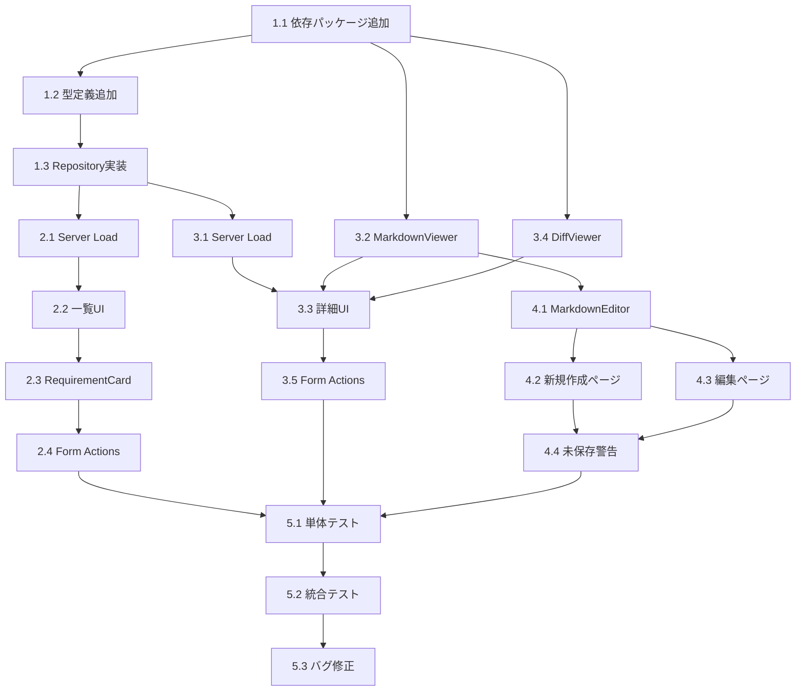

# Issue #290 作業計画書

## Requirements一覧・バージョン管理

**Issue**: [#290 [myAgentDesk] #279-6: Requirements一覧・バージョン管理](https://github.com/kewton/MySwiftAgent/issues/290)
**作成日**: 2025-12-17
**更新日**: 2025-12-17 (レビュー反映)
**見積もり**: L (8 SP) / 約3日 (バッファ込み)
**優先度**: P1 (High)

---

## 1. Issue概要の確認

### 1.1 目的

RequirementVersionの一覧・詳細・編集機能を実装し、Workbench内で要件のバージョン管理を可能にする。

### 1.2 スコープ

| 機能 | 説明 | 状態 |
|------|------|------|
| Requirements一覧画面 | バージョン管理付きの要件一覧表示 | 実装対象 |
| Requirement詳細画面 | Markdownコンテンツ表示、バージョン間差分表示 | 実装対象 |
| Markdownエディタ | リアルタイムプレビュー付き編集機能 | 実装対象 |
| Active Version切替 | アクティブバージョンの設定・変更 | 実装対象 |
| ~~ナビゲーション改善~~ | ~~Analyze画面から内容をコピー~~ | **スコープ外** (別Issue化推奨) |

### 1.3 技術スタック

| ライブラリ | 用途 | バージョン | 備考 |
|-----------|------|-----------|------|
| `marked` | Markdown → HTML変換 | ^15.0.0 | GFM拡張有効化 |
| `dompurify` | XSS対策（HTML sanitization） | ^3.2.0 | **CSRのみ使用** |
| `diff-match-patch` | テキスト差分計算・表示 | ^1.0.5 | - |

### 1.4 既存実装の確認

```
現状のファイル構造:
src/routes/projects/[projectId]/workbenches/[workbenchId]/
├── +layout.server.ts         # workbenchDetail取得済み ← 活用する
├── requirements/
│   ├── +page.svelte          # モック一覧（要実装）
│   └── [reqVersionId]/
│       └── +page.svelte      # プレースホルダー詳細（要実装）

DBスキーマ (requirement_version):
- id: text (PK)
- workbench_id: text (FK)
- version: integer
- content: text (Markdownコンテンツ)
- status: 'draft' | 'submitted' | 'active' | 'deprecated'
- change_summary: text
- created_at, updated_at: timestamp
```

---

## 2. 詳細タスク分解

### Phase 1: 基盤整備 (0.5日)

| タスク | 説明 | 成果物 |
|--------|------|--------|
| 1.1 依存パッケージ追加 | marked, dompurify, diff-match-patch | package.json更新 |
| 1.2 型定義追加 | RequirementVersionの拡張型定義 | `src/lib/types/requirement.ts` |
| 1.3 Repository実装 | RequirementVersionRepository | `src/lib/server/repositories/requirement-version.ts` |
| 1.4 DB初期化確認 | requirement_versionテーブル確認 | `src/lib/server/db/index.ts` |

#### 1.1 依存パッケージ

```bash
npm install marked dompurify diff-match-patch
npm install -D @types/dompurify @types/diff-match-patch
```

#### 1.2 型定義 (`src/lib/types/requirement.ts`)

```typescript
import type { RequirementVersionStatus } from '$lib/server/db/schema';

// 一覧表示用
export interface RequirementVersionListItem {
  id: string;
  version: number;
  status: RequirementVersionStatus;
  changeSummary: string | null;
  isActive: boolean;  // workbench.activeRequirementVersionId === id
  createdAt: Date;
  updatedAt: Date;
}

// 詳細表示用
export interface RequirementVersionDetail extends RequirementVersionListItem {
  content: string;
  workbenchId: string;
}

// 差分表示用
export interface RequirementDiff {
  baseVersion: number;
  targetVersion: number;
  additions: number;
  deletions: number;
}

// 作成・編集用
export interface RequirementVersionInput {
  content: string;
  changeSummary?: string;
}
```

#### 1.3 Repository (`src/lib/server/repositories/requirement-version.ts`)

主要メソッド:
- `findByWorkbench(workbenchId, activeVersionId?)` - バージョン一覧取得（isActive計算付き）
- `findById(id)` - 詳細取得
- `create(workbenchId, input)` - 新バージョン作成（version自動採番）
- `update(id, input)` - 下書き編集（statusがdraftの場合のみ）
- `setActive(workbenchId, versionId)` - アクティブ設定（workbenchも更新）
- `getAdjacentVersion(workbenchId, version)` - 前バージョン取得（差分計算用）

---

### Phase 2: Requirements一覧画面 (1日)

| タスク | 説明 | 成果物 |
|--------|------|--------|
| 2.1 Server Load実装 | 親Layout活用 + 一覧取得 | `requirements/+page.server.ts` |
| 2.2 一覧UI実装 | バージョンカード、ステータスバッジ | `requirements/+page.svelte` |
| 2.3 RequirementCard | 再利用可能なカードコンポーネント | `RequirementVersionCard.svelte` |
| 2.4 Form Actions | create, setActive | `+page.server.ts` actions |

#### 2.1 Server Load設計（親Layout活用）

```typescript
// requirements/+page.server.ts
import type { PageServerLoad, Actions } from './$types';
import { requirementVersionRepository } from '$lib/server/repositories/requirement-version';

export const load: PageServerLoad = async ({ params, parent }) => {
  // 親レイアウトからworkbenchDetail取得（N+1防止）
  const { workbenchDetail } = await parent();

  const versions = await requirementVersionRepository.findByWorkbench(
    params.workbenchId,
    workbenchDetail?.activeRequirementVersion?.id
  );

  return { versions };
};
```

#### 2.2 一覧UI設計

```
┌─────────────────────────────────────────────────────┐
│ Requirements                    [+ New Version]     │
├─────────────────────────────────────────────────────┤
│ ┌─────────────────────────────────────────────────┐ │
│ │ v3 ★Active                           draft     │ │
│ │ Added API error handling                        │ │
│ │ Created: 2024-01-17                            │ │
│ └─────────────────────────────────────────────────┘ │
│ ┌─────────────────────────────────────────────────┐ │
│ │ v2                                   deprecated │ │
│ │ Refactored data processing                     │ │
│ │ Created: 2024-01-16                            │ │
│ └─────────────────────────────────────────────────┘ │
└─────────────────────────────────────────────────────┘
```

---

### Phase 3: Requirement詳細画面 (1日)

| タスク | 説明 | 成果物 |
|--------|------|--------|
| 3.1 Server Load実装 | 詳細 + 前バージョン取得 | `[reqVersionId]/+page.server.ts` |
| 3.2 MarkdownViewer | marked + DOMPurify（**CSRのみ**） | `MarkdownViewer.svelte` |
| 3.3 詳細UI実装 | コンテンツ表示、メタデータ | `[reqVersionId]/+page.svelte` |
| 3.4 DiffViewer | diff-match-patch統合 | `DiffViewer.svelte` |
| 3.5 Form Actions | setActive, updateStatus | `+page.server.ts` actions |

#### 3.2 MarkdownViewer設計（SSR対応版）

```svelte
<!--
  MarkdownViewer Component

  Renders Markdown content with XSS protection.
  Uses client-side only rendering to avoid DOMPurify SSR issues.
-->
<script lang="ts">
  import { browser } from '$app/environment';
  import { marked } from 'marked';
  import { onMount } from 'svelte';

  interface Props {
    content: string;
  }

  let { content }: Props = $props();

  let sanitizedHtml = $state('');
  let isLoading = $state(true);

  // Configure marked for GFM
  marked.setOptions({
    gfm: true,
    breaks: true
  });

  onMount(async () => {
    if (browser) {
      const DOMPurify = (await import('dompurify')).default;
      sanitizedHtml = DOMPurify.sanitize(marked.parse(content) as string);
      isLoading = false;
    }
  });

  // Update when content changes
  $effect(() => {
    if (browser && !isLoading) {
      import('dompurify').then(({ default: DOMPurify }) => {
        sanitizedHtml = DOMPurify.sanitize(marked.parse(content) as string);
      });
    }
  });
</script>

{#if isLoading}
  <div class="markdown-loading">Loading...</div>
{:else}
  <div class="markdown-body">
    {@html sanitizedHtml}
  </div>
{/if}
```

#### 3.4 DiffViewer設計

```svelte
<!--
  DiffViewer Component

  Shows text differences between two versions.
-->
<script lang="ts">
  import { browser } from '$app/environment';
  import { onMount } from 'svelte';

  interface Props {
    oldText: string;
    newText: string;
  }

  let { oldText, newText }: Props = $props();

  let diffHtml = $state('');
  let stats = $state({ additions: 0, deletions: 0 });

  onMount(async () => {
    if (browser) {
      const { diff_match_patch } = await import('diff-match-patch');
      const dmp = new diff_match_patch();
      const diffs = dmp.diff_main(oldText, newText);
      dmp.diff_cleanupSemantic(diffs);
      diffHtml = dmp.diff_prettyHtml(diffs);

      // Calculate stats
      stats = diffs.reduce((acc, [op, text]) => {
        if (op === 1) acc.additions += text.length;
        if (op === -1) acc.deletions += text.length;
        return acc;
      }, { additions: 0, deletions: 0 });
    }
  });
</script>

<div class="diff-stats">
  <span class="additions">+{stats.additions}</span>
  <span class="deletions">-{stats.deletions}</span>
</div>
<div class="diff-view">
  {@html diffHtml}
</div>
```

---

### Phase 4: Markdownエディタ (0.75日)

| タスク | 説明 | 成果物 |
|--------|------|--------|
| 4.1 エディタコンポーネント | split-view editor | `MarkdownEditor.svelte` |
| 4.2 新規作成ページ | 新バージョン作成専用 | `requirements/new/+page.svelte` |
| 4.3 編集ページ | 既存バージョン編集 | `[reqVersionId]/edit/+page.svelte` |
| 4.4 未保存警告 | beforeunload連携 | エディタに組み込み |

#### 4.1 MarkdownEditor設計

```
┌───────────────────────────────────────────────────────┐
│ New Requirement Version                               │
├─────────────────────────┬─────────────────────────────┤
│ # Requirements          │ # Requirements              │
│                         │                             │
│ ## Overview             │ ## Overview                 │
│ This workflow...        │ This workflow...            │
│                         │                             │
│ ## Steps                │ ## Steps                    │
│ 1. Input data           │ 1. Input data               │
│ 2. Process              │ 2. Process                  │
│ 3. Output               │ 3. Output                   │
│                         │                             │
│      [Editor]           │     [Preview]               │
├─────────────────────────┴─────────────────────────────┤
│ Change Summary: [Added error handling for API calls ] │
├───────────────────────────────────────────────────────┤
│                              [Cancel] [Save as Draft] │
└───────────────────────────────────────────────────────┘
```

#### ルート構造（RESTful設計）

```
requirements/
├── +page.svelte              # 一覧
├── +page.server.ts           # 一覧Load + create action
├── new/
│   ├── +page.svelte          # 新規作成エディタ
│   └── +page.server.ts       # create action
└── [reqVersionId]/
    ├── +page.svelte          # 詳細表示
    ├── +page.server.ts       # 詳細Load + setActive action
    └── edit/
        ├── +page.svelte      # 編集エディタ
        └── +page.server.ts   # update action
```

---

### Phase 5: QA・統合テスト (0.75日)

| タスク | 説明 | 成果物 |
|--------|------|--------|
| 5.1 単体テスト | Repository、コンポーネント | `tests/` |
| 5.2 統合テスト | E2Eフロー確認 | 手動テスト |
| 5.3 バグ修正 | 発見した問題の修正 | - |

---

## 3. タスク依存関係



---

## 4. 作業スケジュール

| 日程 | Phase | タスク | 見積もり |
|------|-------|--------|---------|
| Day 1 AM | Phase 1 | 基盤整備（パッケージ、型、Repository） | 4h |
| Day 1 PM | Phase 2 | Requirements一覧画面 | 4h |
| Day 2 AM | Phase 2続き | 一覧画面完成 + Phase 3開始 | 4h |
| Day 2 PM | Phase 3 | Requirement詳細画面 | 4h |
| Day 3 AM | Phase 4 | Markdownエディタ | 4h |
| Day 3 PM | Phase 5 | QA・統合テスト、バグ修正 | 4h |

**合計**: 3日 (24h) - レビュー指摘を反映し+30%バッファ込み

---

## 5. L3受入テスト計画

### 5.1 一覧画面テスト

| テストケース | 期待結果 |
|-------------|---------|
| 一覧表示 | 全バージョンが降順（version DESC）で表示される |
| ステータスバッジ | draft/submitted/active/deprecatedが正しく色分け |
| Active表示 | アクティブバージョンに★マークが表示 |
| 新規作成 | 「+ New Version」クリックで新規作成ページへ遷移 |
| カードクリック | 詳細ページへ遷移 |

### 5.2 詳細画面テスト

| テストケース | 期待結果 |
|-------------|---------|
| Markdownレンダリング | 見出し、リスト、コードブロック、テーブルが正しく表示 |
| XSS対策 | `<script>alert('XSS')</script>` が無害化される |
| 差分表示 | 前バージョンとの差分が色付き（緑:追加/赤:削除）で表示 |
| Set as Active | ボタン押下でworkbench.activeRequirementVersionIdが更新 |
| 編集ボタン | draftステータスの場合のみ編集ボタン表示 |

### 5.3 エディタテスト

| テストケース | 期待結果 |
|-------------|---------|
| リアルタイムプレビュー | 入力中にプレビューが即座に更新 |
| 保存 | Save押下でDBに保存、詳細ページへリダイレクト |
| キャンセル | 変更がある場合は確認ダイアログ表示 |
| 未保存警告 | ページ離脱時にブラウザ警告表示 |
| バージョン自動採番 | 新規作成時、前バージョン+1が自動設定 |

### 5.4 エッジケーステスト（追加）

| テストケース | 期待結果 |
|-------------|---------|
| 空コンテンツ保存 | バリデーションエラー表示 |
| 巨大Markdown (100KB) | 正常にレンダリング、パフォーマンス劣化なし |
| 最初のバージョン作成 | version=1で作成、差分表示は非表示 |
| 非draftバージョン編集試行 | 編集ボタン非表示 or エラー |

---

## 6. Definition of Done

- [ ] Phase 1-5の全タスク完了
- [ ] 単体テストカバレッジ90%以上
- [ ] npm run type-check パス
- [ ] npm run lint パス
- [ ] L3受入テスト全項目パス（5.1〜5.4）
- [ ] 作業ドキュメント完成（work-plan.md, implementation-report.md）

---

## 7. 技術的考慮事項

### 7.1 セキュリティ

- **XSS対策**: DOMPurifyで全HTMLをサニタイズ（**クライアントサイドのみ**）
- **SSR安全性**: SSR時はMarkdownレンダリングをスキップし、CSRで実行
- **入力バリデーション**: content長制限（100KB）、changeSummary長制限（500文字）

### 7.2 パフォーマンス

- **N+1防止**: 親Layoutの`workbenchDetail`を`await parent()`で再利用
- **差分計算**: クライアントサイドで実行、大きなテキストでもUIをブロックしない
- **Markdownキャッシュ**: `$effect`で変更時のみ再レンダリング

### 7.3 UX

- **未保存警告**: `beforeunload`イベントで離脱時に警告
- **ローディング状態**: Markdown/Diffレンダリング中はスケルトン表示
- **エラーハンドリング**: Form Action失敗時にトースト通知

### 7.4 アクセシビリティ

- **キーボードナビゲーション**: Tab/Enter でフォーム操作可能
- **ARIAラベル**: エディタ、プレビュー領域に適切なラベル付与
- **フォーカス管理**: モーダル/ページ遷移時のフォーカス制御

---

## 8. 参照ドキュメント

- [myAgentDesk README](../../../myAgentDesk/README.md)
- [DBスキーマ定義](../../../myAgentDesk/src/lib/server/db/schema.ts)
- [既存WorkbenchRepository](../../../myAgentDesk/src/lib/server/repositories/workbench.ts)
- [marked公式ドキュメント](https://marked.js.org/)
- [DOMPurify公式](https://github.com/cure53/DOMPurify)
- [diff-match-patch Wiki](https://github.com/google/diff-match-patch/wiki)

---

## 9. リスクと対策

| リスク | 影響 | 対策 |
|--------|------|------|
| DOMPurify SSR問題 | ビルドエラー | CSRのみで実行（`browser`チェック） |
| Markdown互換性問題 | 表示崩れ | GFM拡張有効化、事前テスト |
| 差分計算の遅延 | UX低下 | クライアントサイド非同期処理 |
| 大きなコンテンツ | メモリ使用 | content上限設定（100KB） |

---

## 10. スコープ外事項

以下は本Issueのスコープ外とし、必要に応じて別Issueで対応：

| 項目 | 理由 | 推奨対応 |
|------|------|---------|
| ナビゲーション改善 | 具体的要件が不明確 | 別Issue化して要件定義 |
| バージョン削除機能 | 要件未確定 | 必要性を確認後に別Issue化 |
| 自動保存機能 | 複雑性が高い | MVP後の改善として検討 |
| Markdown拡張（数式等） | 追加ライブラリ必要 | 要望があれば別Issue化 |

---

## 11. レビュー履歴

| 日付 | レビュアー | 指摘事項 | 対応 |
|------|-----------|---------|------|
| 2025-12-17 | セルフレビュー | DOMPurify SSR問題 | CSRのみで実行に修正 |
| 2025-12-17 | セルフレビュー | marked sanitizeオプション | 削除（deprecated） |
| 2025-12-17 | セルフレビュー | 編集ルート設計 | `/new`と`/[id]/edit`に分離 |
| 2025-12-17 | セルフレビュー | 親Layout未活用 | `await parent()`で取得に修正 |
| 2025-12-17 | セルフレビュー | 見積もり過小 | 3日に修正（+30%バッファ） |
| 2025-12-17 | セルフレビュー | エッジケース不足 | 5.4節追加 |

---

**作成者**: Claude Code
**ステータス**: レビュー修正完了 → ユーザー承認待ち
